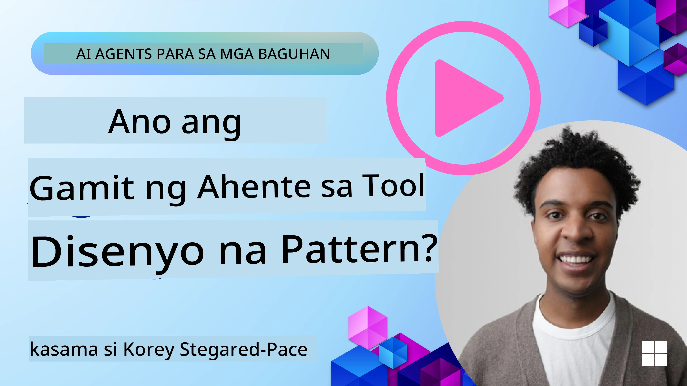
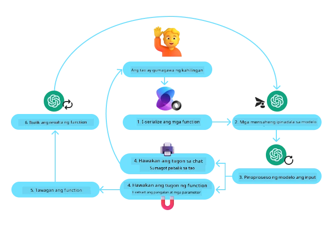
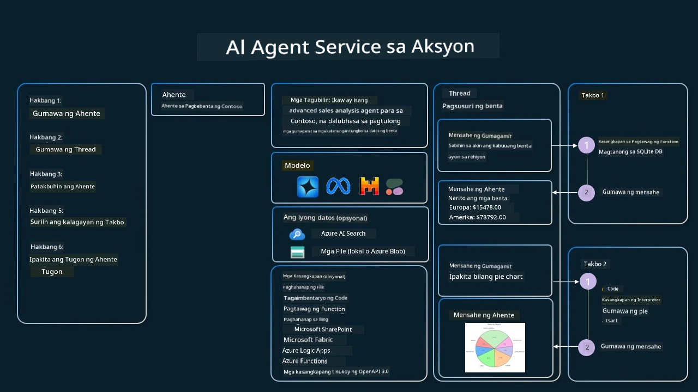

[](https://youtu.be/vieRiPRx-gI?si=cEZ8ApnT6Sus9rhn)

> _(I-click ang larawang nasa itaas upang mapanood ang video ng araling ito)_

# Pattern ng Disenyo sa Paggamit ng Tool

Ang mga tool ay kawili-wili dahil pinapayagan nila ang mga AI agent na magkaroon ng mas malawak na hanay ng kakayahan. Sa halip na limitado lamang ang mga aksyong maaaring gawin ng agent, sa pagdagdag ng isang tool, maaari na ngayong magsagawa ang agent ng malawak na saklaw ng mga aksyon. Sa kabanatang ito, tatalakayin natin ang Tool Use Design Pattern, na naglalarawan kung paano magagamit ng mga AI agent ang partikular na mga tool upang maabot ang kanilang mga layunin.

## Panimula

Sa araling ito, nais nating sagutin ang mga sumusunod na tanong:

- Ano ang tool use design pattern?
- Ano ang mga kaso kung saan ito maaaring gamitin?
- Ano ang mga elemento/parte na kailangan para maipatupad ang design pattern?
- Ano ang mga espesyal na konsiderasyon sa paggamit ng Tool Use Design Pattern upang makabuo ng mapagkakatiwalaang AI agents?

## Mga Layunin sa Pagkatuto

Pagkatapos makumpleto ang araling ito, magagawa mong:

- I-defina ang Tool Use Design Pattern at ang layunin nito.
- Tukuyin ang mga kaso kung saan ang Tool Use Design Pattern ay naaangkop.
- Unawain ang mga pangunahing elemento na kailangan upang maipatupad ang design pattern.
- Kilalanin ang mga konsiderasyon para sa pagtitiyak ng pagiging mapagkakatiwalaan ng mga AI agent na gumagamit ng design pattern na ito.

## Ano ang Tool Use Design Pattern?

Ang **Tool Use Design Pattern** ay nakatuon sa pagbibigay sa mga LLM ng kakayahang makipag-ugnayan sa mga panlabas na tool upang makamit ang partikular na mga layunin. Ang mga tool ay code na maaaring patakbuhin ng isang agent upang magsagawa ng mga aksyon. Ang tool ay maaaring simpleng function tulad ng calculator, o isang API call sa third-party na serbisyo tulad ng pagsilip sa presyo ng stock o forecast ng panahon. Sa konteksto ng AI agents, ang mga tool ay idinisenyo upang patakbuhin ng mga agent bilang tugon sa **model-generated function calls**.

## Ano ang mga kaso kung saan ito maaaring gamitin?

Maaaring gamitin ng mga AI Agent ang mga tool upang matapos ang mga komplikadong gawain, makakuha ng impormasyon, o gumawa ng mga desisyon. Madalas gamitin ang tool use design pattern sa mga senaryo na nangangailangan ng dynamic na pakikipag-ugnayan sa mga panlabas na sistema, tulad ng databases, web services, o mga code interpreter. Ang kakayahang ito ay kapaki-pakinabang sa iba't ibang mga kaso gaya ng:

- **Dynamic Information Retrieval:** Maaaring mag-query ang mga agent sa mga external API o database upang kunin ang pinakabagong datos (hal., pag-query sa SQLite database para sa pagsusuri ng datos, pagkuha ng presyo ng stock o impormasyon ng panahon).
- **Code Execution and Interpretation:** Maaaring magpatakbo ang mga agent ng code o script upang lutasin ang mga matematikal na problema, gumawa ng mga ulat, o magsagawa ng mga simulasyon.
- **Workflow Automation:** Pag-aautomat ng paulit-ulit o multi-step na mga workflow sa pamamagitan ng pagsasama ng mga tool tulad ng task schedulers, email services, o mga data pipeline.
- **Customer Support:** Maaaring makipag-ugnayan ang mga agent sa CRM system, ticketing platform, o knowledge base upang sagutin ang mga tanong ng user.
- **Content Generation and Editing:** Maaaring gumamit ang mga agent ng mga tool tulad ng grammar checker, text summarizer, o content safety evaluator upang tumulong sa paggawa ng nilalaman.

## Ano ang mga elemento/parte na kailangan upang maipatupad ang tool use design pattern?

Ang mga elementong ito ang nagpapahintulot sa AI agent na magsagawa ng malawak na hanay ng mga gawain. Tingnan natin ang mga pangunahing elemento na kailangan upang maipatupad ang Tool Use Design Pattern:

- **Function/Tool Schemas**: Detalyadong mga depinisyon ng mga magagamit na tool, kabilang ang pangalan ng function, layunin, kinakailangang mga parameter, at inaasahang output. Pinapayagan ng mga schema na ito ang LLM na maunawaan kung ano ang mga tool na magagamit at kung paano bumuo ng mga valid na kahilingan.

- **Function Execution Logic**: Namamahala kung paano at kailan tinatawag ang mga tool batay sa intensyon ng user at konteksto ng pag-uusap. Maaaring kasama dito ang mga planner module, mekanismo ng pag-ruta, o mga conditional flow na nagdidikta ng dynamic na paggamit ng tool.

- **Message Handling System**: Mga bahagi na namamahala sa daloy ng usapan sa pagitan ng input ng user, mga tugon ng LLM, mga tawag sa tool, at mga output ng tool.

- **Tool Integration Framework**: Impraestruktura na kumokonekta sa agent sa iba't ibang tool, maging ito man ay simpleng function o kumplikadong mga panlabas na serbisyo.

- **Error Handling & Validation**: Mga mekanismo upang hawakan ang mga pagkabigo sa pagpapatakbo ng tool, pag-validate ng mga parameter, at pamamahala ng mga hindi inaasahang tugon.

- **State Management**: Nagmo-monitor ng konteksto ng pag-uusap, mga naunang interaksyon sa tool, at persistent na datos upang matiyak ang konsistensya sa mga multi-turn na interaksyon.

Susunod, tingnan natin nang mas detalyado ang Function/Tool Calling.
 
### Function/Tool Calling

Ang function calling ang pangunahing paraan upang bigyang-daan ang mga Large Language Models (LLMs) na makipag-ugnayan sa mga tool. Madalas mong marinig na ang 'Function' at 'Tool' ay ginagamitan nang magkasingkahulugan dahil ang mga 'function' (mga bloke ng reusable code) ang mga 'tool' na ginagamit ng mga agent upang isagawa ang mga gawain. Para maipatupad ang code ng function, kailangang ikumpara ng LLM ang kahilingan ng user laban sa paglalarawan ng function. Ginagawa ito sa pamamagitan ng isang schema na naglalaman ng mga paglalarawan ng lahat ng magagamit na mga function na ipinapadala sa LLM. Piliin ng LLM ang pinaka-angkop na function para sa gawain at ibabalik ang pangalan at mga argument nito. Tatawagin ang napiling function, ipapadala ang tugon nito pabalik sa LLM, na gagamitin ang impormasyong iyon upang tumugon sa kahilingan ng user.

Para sa mga developer na magpatupad ng function calling para sa mga agent, kakailanganin ninyo:

1. Isang LLM model na sumusuporta sa function calling
2. Isang schema na naglalaman ng mga paglalarawan ng function
3. Ang code para sa bawat function na inilalarawan

Gamitin natin ang halimbawa ng pagkuha ng kasalukuyang oras sa isang lungsod upang ilarawan:

1. **I-initialize ang LLM na sumusuporta sa function calling:**

    Hindi lahat ng modelo ay sumusuporta sa function calling, kaya mahalagang tiyakin na ang LLM na gamit mo ay sumusuporta nito.     <a href="https://learn.microsoft.com/azure/ai-services/openai/how-to/function-calling" target="_blank">Azure OpenAI</a> ay sumusuporta sa function calling. Maaari tayong magsimula sa pamamagitan ng pag-initialize ng OpenAI client laban sa Azure OpenAI **Responses API** (ang stable na `/openai/v1/` endpoint — walang kailangan na `api_version`). 

    ```python
    # I-initialize ang OpenAI client para sa Azure OpenAI (Responses API, v1 endpoint)
    client = OpenAI(
        base_url=f"{os.environ['AZURE_OPENAI_ENDPOINT'].rstrip('/')}/openai/v1/",
        api_key=os.environ["AZURE_OPENAI_API_KEY"],
    )
    deployment_name = os.environ["AZURE_OPENAI_DEPLOYMENT"]
    ```

1. **Gumawa ng Function Schema**:

    Sunod ay magdedeklara tayo ng isang JSON schema na naglalaman ng pangalan ng function, paglalarawan kung ano ang ginagawa ng function, at mga pangalan at paglalarawan ng mga parameter ng function.
    Ipasa natin ang schema na ito sa client na ginawa dati, kasabay ng kahilingan ng user para malaman ang oras sa San Francisco. Mahalaga ring note na ang **tool call** ang ibinabalik, **hindi** ang huling sagot sa tanong. Tulad ng naipaliwanag kanina, ang LLM ay magbabalik ng pangalan ng function na napili nito para sa gawain, at ang mga argumentong ipapasa dito.

    ```python
    # Paglalarawan ng function para basahin ng modelo (Responses API flat tool format)
    tools = [
        {
            "type": "function",
            "name": "get_current_time",
            "description": "Get the current time in a given location",
            "parameters": {
                "type": "object",
                "properties": {
                    "location": {
                        "type": "string",
                        "description": "The city name, e.g. San Francisco",
                    },
                },
                "required": ["location"],
            },
        }
    ]
    ```
   
    ```python
  
    # Paunang mensahe ng gumagamit
    messages = [{"role": "user", "content": "What's the current time in San Francisco"}]

    # Unang tawag sa API: Hilingin sa modelo na gamitin ang function
    response = client.responses.create(
        model=deployment_name,
        input=messages,
        tools=tools,
        tool_choice="auto",
        store=False,
    )

    # Ang Responses API ay nagbabalik ng mga tawag sa tool bilang function_call na mga item sa response.output.
    # Idagdag ang mga ito sa pag-uusap upang magkaroon ang modelo ng buong konteksto sa susunod na tugon.
    messages += response.output

    print("Model's response:")
    print(response.output)
  
    ```

    ```bash
    Model's response:
    [ResponseFunctionToolCall(arguments='{"location":"San Francisco"}', call_id='call_pOsKdUlqvdyttYB67MOj434b', name='get_current_time', type='function_call')]
    ```
  
1. **Ang function code na kailangan para isagawa ang gawain:**

    Ngayon na napili na ng LLM kung aling function ang kailangang patakbuhin, kailangang ipatupad at patakbuhin ang code upang maisagawa ang gawain.
    Maaari nating ipatupad ang code upang makuha ang kasalukuyang oras gamit ang Python. Kailangan din nating isulat ang code upang kunin ang pangalan at mga argument mula sa response_message upang makuha ang pinal na resulta.

    ```python
      def get_current_time(location):
        """Get the current time for a given location"""
        print(f"get_current_time called with location: {location}")  
        location_lower = location.lower()
        
        for key, timezone in TIMEZONE_DATA.items():
            if key in location_lower:
                print(f"Timezone found for {key}")  
                current_time = datetime.now(ZoneInfo(timezone)).strftime("%I:%M %p")
                return json.dumps({
                    "location": location,
                    "current_time": current_time
                })
      
        print(f"No timezone data found for {location_lower}")  
        return json.dumps({"location": location, "current_time": "unknown"})
    ```

     ```python
    # Pamahalaan ang mga tawag sa function
    tool_calls = [item for item in response.output if item.type == "function_call"]
    if tool_calls:
        for tool_call in tool_calls:
            if tool_call.name == "get_current_time":

                function_args = json.loads(tool_call.arguments)

                time_response = get_current_time(
                    location=function_args.get("location")
                )

                # Ibalik ang resulta ng tool bilang isang item ng function_call_output
                messages.append({
                    "type": "function_call_output",
                    "call_id": tool_call.call_id,
                    "output": time_response,
                })
    else:
        print("No tool calls were made by the model.")

    # Pangalawang tawag sa API: Kunin ang pangwakas na tugon mula sa modelo
    final_response = client.responses.create(
        model=deployment_name,
        input=messages,
        tools=tools,
        store=False,
    )

    return final_response.output_text
     ```

     ```bash
      get_current_time called with location: San Francisco
      Timezone found for san francisco
      The current time in San Francisco is 09:24 AM.
     ```

Ang Function Calling ang puso ng karamihan, kung hindi man lahat, ng agent tool use design, pero ang pag-implementa mula sa simula ay maaaring minsang maging hamon.
Tulad ng natutunan natin sa [Lesson 2](../../../02-explore-agentic-frameworks), nagbibigay ang mga agentic framework ng mga pre-built na bahagi upang ipatupad ang tool use.
 
## Mga Halimbawa ng Paggamit ng Tool sa mga Agentic Framework

Narito ang ilang mga halimbawa kung paano mo magagamit ang Tool Use Design Pattern gamit ang iba't ibang agentic frameworks:

### Microsoft Agent Framework

<a href="https://learn.microsoft.com/azure/ai-services/agents/overview" target="_blank">Microsoft Agent Framework</a> ay isang open-source na AI framework para sa pagbuo ng mga AI agent. Pinapasimple nito ang proseso ng paggamit ng function calling sa pamamagitan ng pagpapahintulot na idefine ang mga tool bilang Python functions gamit ang `@tool` decorator. Pinangangasiwaan ng framework ang komunikasyon pabalik-balik sa pagitan ng model at ng iyong code. Nagbibigay din ito ng access sa mga pre-built na tool tulad ng File Search at Code Interpreter sa pamamagitan ng `FoundryChatClient`.

Ipinapakita ng sumusunod na diagram ang proseso ng function calling gamit ang Microsoft Agent Framework:



Sa Microsoft Agent Framework, ang mga tool ay dinefine bilang mga decorated functions. Maaari nating gawing tool ang `get_current_time` function na nakita natin kanina gamit ang `@tool` decorator. Awtomatikong ise-serialize ng framework ang function at ang mga parameter nito, na bumubuo ng schema na ipapadala sa LLM.

```python
import os
from agent_framework import tool
from agent_framework.foundry import FoundryChatClient
from azure.identity import AzureCliCredential

@tool(approval_mode="never_require")
def get_current_time(location: str) -> str:
    """Get the current time for a given location"""
    ...

# Gumawa ng kliyente
provider = FoundryChatClient(
    project_endpoint=os.environ["AZURE_AI_PROJECT_ENDPOINT"],
    model=os.environ["AZURE_AI_MODEL_DEPLOYMENT_NAME"],
    credential=AzureCliCredential(),
)

# Gumawa ng ahente at patakbuhin gamit ang kasangkapan
agent = provider.as_agent(name="TimeAgent", instructions="Use available tools to answer questions.", tools=get_current_time)
response = await agent.run("What time is it?")
```
  
### Microsoft Foundry Agent Service

<a href="https://learn.microsoft.com/azure/ai-services/agents/overview" target="_blank">Microsoft Foundry Agent Service</a> ay isang mas bagong agentic framework na idinisenyo upang bigyan ang mga developer ng kapangyarihan na ligtas na lumikha, mag-deploy, at mag-scale ng mataas na kalidad at extensible na AI agent nang hindi na kailangang i-manage ang pangunahing compute at storage resources. Ito ay partikular na kapaki-pakinabang para sa mga enterprise application dahil ito ay fully managed service na may enterprise-grade security.

Kung ikukumpara sa direktang pagdevelop gamit ang LLM API, nag-aalok ang Microsoft Foundry Agent Service ng ilang mga benepisyo, kabilang ang:

- Awtomatikong pagtawag ng tools – hindi na kailangang i-parse ang tool call, patakbuhin ang tool, at hawakan ang tugon; lahat ng ito ay ginagawa na server-side
- Ligtas na pinamamahalaang datos – sa halip na ikaw na ang mag-manage ng sarili mong conversation state, maaasahan mo ang threads para itago ang lahat ng impormasyong kailangan mo
- Mga tool na handang gamitin agad – Mga tool na maaari mong gamitin upang makipag-ugnayan sa iyong mga data source, tulad ng Bing, Azure AI Search, at Azure Functions.

Ang mga tool na magagamit sa Microsoft Foundry Agent Service ay maaaring hatiin sa dalawang kategorya:

1. Mga Knowledge Tools:
    - <a href="https://learn.microsoft.com/azure/ai-services/agents/how-to/tools/bing-grounding?tabs=python&pivots=overview" target="_blank">Grounding gamit ang Bing Search</a>
    - <a href="https://learn.microsoft.com/azure/ai-services/agents/how-to/tools/file-search?tabs=python&pivots=overview" target="_blank">File Search</a>
    - <a href="https://learn.microsoft.com/azure/ai-services/agents/how-to/tools/azure-ai-search?tabs=azurecli%2Cpython&pivots=overview-azure-ai-search" target="_blank">Azure AI Search</a>

2. Mga Action Tools:
    - <a href="https://learn.microsoft.com/azure/ai-services/agents/how-to/tools/function-calling?tabs=python&pivots=overview" target="_blank">Function Calling</a>
    - <a href="https://learn.microsoft.com/azure/ai-services/agents/how-to/tools/code-interpreter?tabs=python&pivots=overview" target="_blank">Code Interpreter</a>
    - <a href="https://learn.microsoft.com/azure/ai-services/agents/how-to/tools/openapi-spec?tabs=python&pivots=overview" target="_blank">Mga tool na tinukoy ng OpenAPI</a>
    - <a href="https://learn.microsoft.com/azure/ai-services/agents/how-to/tools/azure-functions?pivots=overview" target="_blank">Azure Functions</a>

Pinapayagan tayo ng Agent Service na magamit ang mga tool na ito nang sabay bilang isang `toolset`. Ginagamit din nito ang `threads` na nagtatala ng kasaysayan ng mga mensahe mula sa isang partikular na pag-uusap.

Isipin mo na ikaw ay isang sales agent sa isang kumpanya na tinatawag na Contoso. Nais mong mag-develop ng conversational agent na makakasagot sa mga tanong tungkol sa iyong sales data.

Ipinapakita ng sumusunod na larawan kung paano mo magagamit ang Microsoft Foundry Agent Service upang suriin ang iyong sales data:



Para gamitin ang alinman sa mga tool na ito sa serbisyo, maaari tayong gumawa ng client at mag-define ng tool o toolset. Sa praktikal na implementasyon, maaari nating gamitin ang sumusunod na Python code. Magagawa ng LLM na suriin ang toolset at magpasya kung gagamitin ang ginawang function ng user, `fetch_sales_data_using_sqlite_query`, o ang pre-built Code Interpreter depende sa kahilingan ng user.

```python 
import os
from azure.ai.projects import AIProjectClient
from azure.identity import DefaultAzureCredential
from fetch_sales_data_functions import fetch_sales_data_using_sqlite_query # fetch_sales_data_using_sqlite_query na function na matatagpuan sa fetch_sales_data_functions.py na file.
from azure.ai.projects.models import ToolSet, FunctionTool, CodeInterpreterTool

project_client = AIProjectClient.from_connection_string(
    credential=DefaultAzureCredential(),
    conn_str=os.environ["PROJECT_CONNECTION_STRING"],
)

# Ipaunang isaayos ang toolset
toolset = ToolSet()

# Ipaunang isaayos ang function calling agent gamit ang fetch_sales_data_using_sqlite_query na function at idagdag ito sa toolset
fetch_data_function = FunctionTool(fetch_sales_data_using_sqlite_query)
toolset.add(fetch_data_function)

# Ipaunang isaayos ang Code Interpreter tool at idagdag ito sa toolset.
code_interpreter = CodeInterpreterTool()toolset.add(code_interpreter)

agent = project_client.agents.create_agent(
    model="gpt-4o-mini", name="my-agent", instructions="You are helpful agent", 
    toolset=toolset
)
```

## Ano ang mga espesyal na konsiderasyon sa paggamit ng Tool Use Design Pattern upang makabuo ng mapagkakatiwalaang AI agents?

Isang karaniwang alalahanin sa SQL na dynamic na nabubuo ng LLM ay ang seguridad, lalo na ang panganib ng SQL injection o mga malisyosong aksyon, tulad ng pag-drop o paninirang-daan sa database. Bagama't may katotohanan ang mga alalahaning ito, maaari itong epektibong mapigilan sa pamamagitan ng tamang pagkokontrol sa mga permiso ng database access. Para sa karamihan ng mga database, nangangahulugan ito ng pagkokontrol sa database bilang read-only. Para sa mga serbisyo ng database tulad ng PostgreSQL o Azure SQL, dapat maitalaga ang app sa read-only (SELECT) na papel.

Ang pagpapatakbo ng app sa isang secure na kapaligiran ay lalo pang nagpapahusay ng proteksyon. Sa mga senaryong enterprise, karaniwang kinuha at binago ang data mula sa mga operational system papunta sa isang read-only na database o data warehouse na may user-friendly na schema. Tinitiyak ng pamamaraang ito na ligtas ang data, na-optimize para sa performance at accessibility, at may restricted na read-only access ang app.

## Mga Halimbawang Code

- Python: [Agent Framework](./code_samples/04-python-agent-framework.ipynb)
- .NET: [Agent Framework](./code_samples/04-dotnet-agent-framework.md)

## May Karagdagang mga Tanong Tungkol sa mga Tool Use Design Patterns?

Sumali sa [Microsoft Foundry Discord](https://discord.com/invite/ATgtXmAS5D) upang makipagkita sa iba pang mga nag-aaral, dumalo sa office hours at masagot ang iyong mga tanong tungkol sa AI Agents.

## Karagdagang Mga Mapagkukunan

- <a href="https://microsoft.github.io/build-your-first-agent-with-azure-ai-agent-service-workshop/" target="_blank">Azure AI Agents Service Workshop</a>
- <a href="https://github.com/Azure-Samples/contoso-creative-writer/tree/main/docs/workshop" target="_blank">Contoso Creative Writer Multi-Agent Workshop</a>
- <a href="https://learn.microsoft.com/azure/ai-services/agents/overview" target="_blank">Microsoft Agent Framework Overview</a>


## Nakaraang Aralin

[Pag-unawa sa Agentic Design Patterns](../03-agentic-design-patterns/README.md)

## Susunod na Aralin

[Agentic RAG](../05-agentic-rag/README.md)

---

<!-- CO-OP TRANSLATOR DISCLAIMER START -->
**Pagtatanggi**:
Ang dokumentong ito ay isinalin gamit ang serbisyo ng AI translation na [Co-op Translator](https://github.com/Azure/co-op-translator). Bagama't nagsusumikap kami para sa katumpakan, pakatandaan na ang awtomatikong pagsasalin ay maaaring maglaman ng mga pagkakamali o hindi pagkakatugma. Ang orihinal na dokumento sa orihinal nitong wika ang dapat ituring na pangunahing sanggunian. Para sa mahahalagang impormasyon, inirerekomenda ang propesyonal na pagsasalin ng tao. Hindi kami mananagot sa anumang maling pagkakaintindi o maling interpretasyon na nagmula sa paggamit ng pagsasaling ito.
<!-- CO-OP TRANSLATOR DISCLAIMER END -->