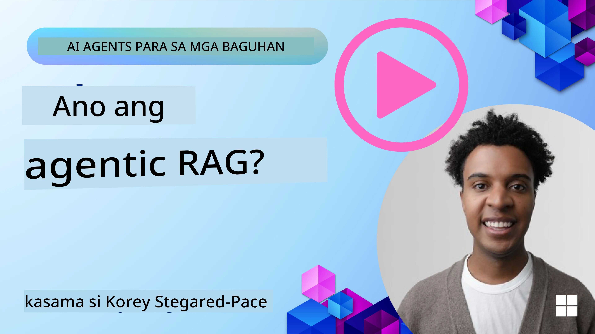
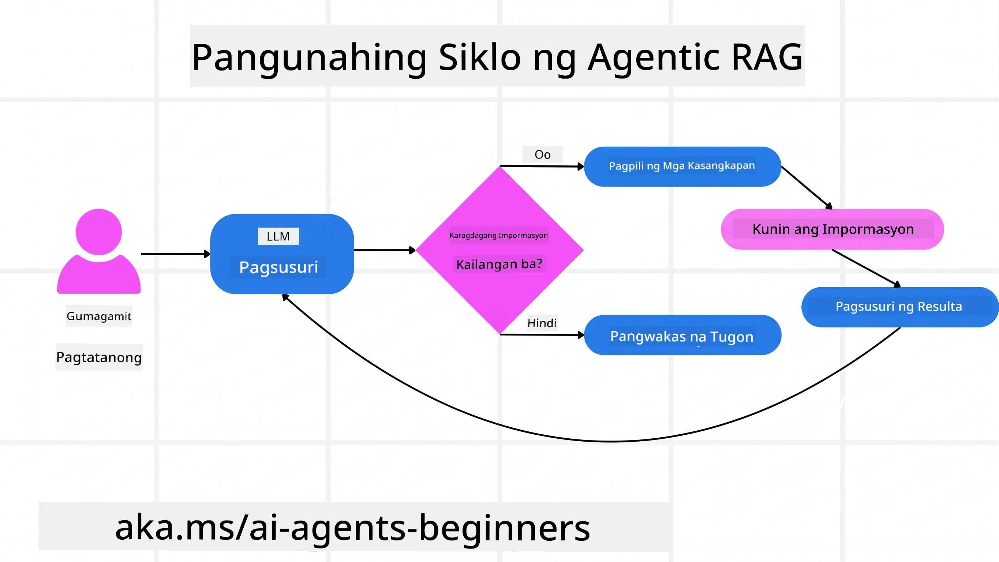
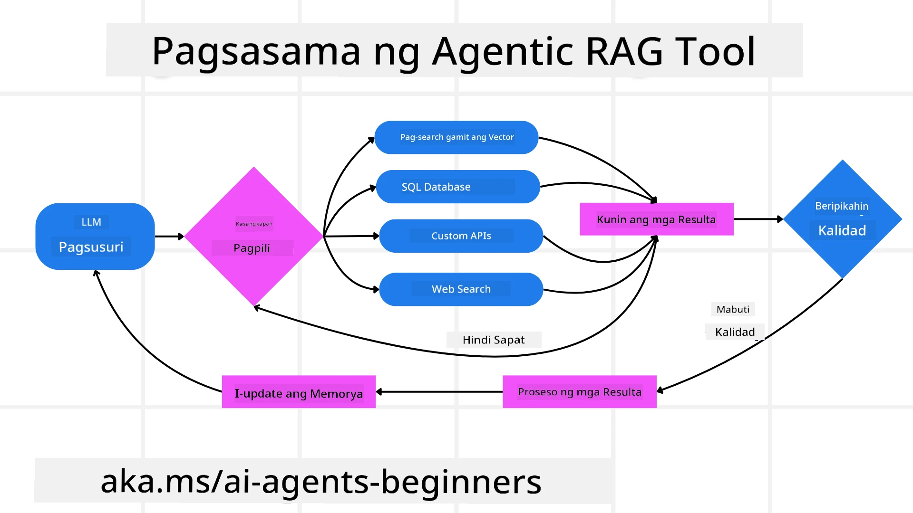
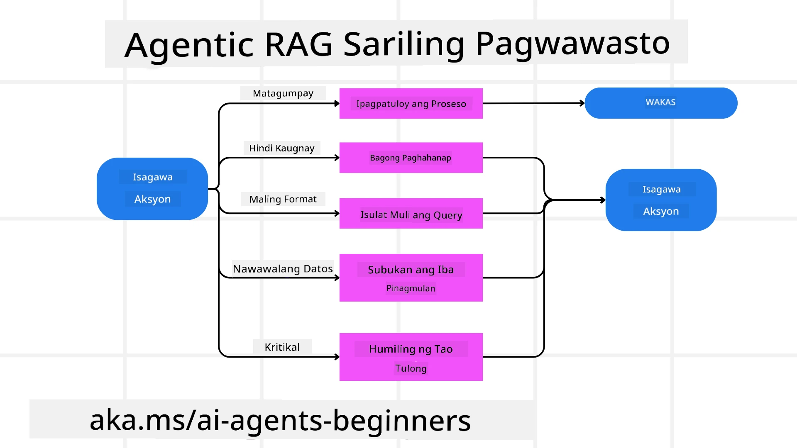
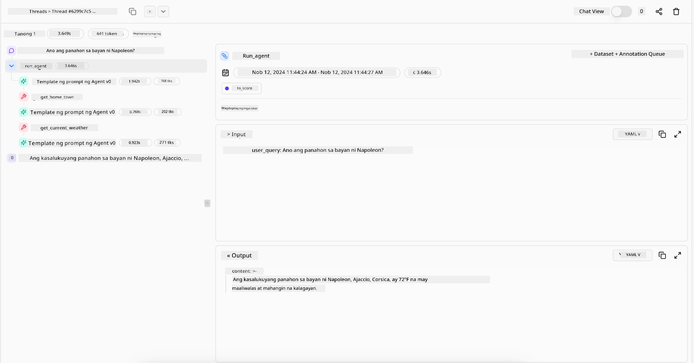

> _(I-click ang larawan sa itaas upang mapanood ang video ng leksyon na ito)_

# Agentic RAG

Ang leksyong ito ay nagbibigay ng komprehensibong pangkalahatang-ideya ng Agentic Retrieval-Augmented Generation (Agentic RAG), isang lumilitaw na paradigma ng AI kung saan ang malalaking language models (LLMs) ay awtonomong nagpaplano ng kanilang mga susunod na hakbang habang kumukuha ng impormasyon mula sa mga panlabas na pinagkukunan. Hindi tulad ng mga static na retrieval-then-read na pattern, ang Agentic RAG ay kinabibilangan ng paulit-ulit na pagtawag sa LLM, na pinaghahalo-halo ng mga tawag sa tool o function at mga nakaayos na output. Sinusuri ng sistema ang mga resulta, pinapino ang mga query, tumatawag ng karagdagang mga tool kung kinakailangan, at nagpapatuloy sa siklong ito hanggang sa makamit ang kasiya-siyang solusyon.

## Panimula

Tatalakayin sa leksyong ito

- **Pag-unawa sa Agentic RAG:**  Alamin ang tungkol sa lumilitaw na paradigma sa AI kung saan ang malalaking language models (LLMs) ay awtonomong nagpaplano ng kanilang mga susunod na hakbang habang kumukuha ng impormasyon mula sa mga panlabas na pinagkukunan ng datos.
- **Pag-unawa sa Iterative Maker-Checker Style:** Unawain ang paikot-ikot na pagtawag sa LLM, na nilalapatan ng mga tawag sa tool o function at mga nakaayos na output, na idinisenyo upang mapabuti ang kawastuhan at hawakan ang mga maling porma ng mga query.
- **Pagsusuri sa Mga Praktikal na Aplikasyon:** Tukuyin ang mga sitwasyon kung saan namamayani ang Agentic RAG, tulad ng mga kapaligirang una ang kawastuhan, mga kumplikadong interaksyon sa database, at mga pinalawak na workflow.

## Mga Layunin ng Pag-aaral

Pagkatapos makumpleto ang leksyong ito, malalaman/mo mauunawaan mo:

- **Pag-unawa sa Agentic RAG:** Alamin ang tungkol sa lumilitaw na paradigma sa AI kung saan ang malalaking language models (LLMs) ay awtonomong nagpaplano ng kanilang mga susunod na hakbang habang kumukuha ng impormasyon mula sa mga panlabas na pinagkukunan ng datos.
- **Iterative Maker-Checker Style:** Unawain ang konsepto ng paikot-ikot na pagtawag sa LLM, na nilalapatan ng mga tawag sa tool o function at mga nakaayos na output, na idinisenyo upang mapabuti ang kawastuhan at hawakan ang mga maling porma ng mga query.
- **Pagmamay-ari sa Proseso ng Pangangatwiran:** Unawain ang kakayahan ng sistema na pagmamay-ari ang proseso ng pangangatwiran nito, na gumagawa ng mga desisyon kung paano lapitan ang mga problema nang hindi umaasa sa mga paunang itinakdang landas.
- **Workflow:** Unawain kung paano ang isang agentic na modelo ay malaya na nagpapasya upang kunin ang mga ulat ng takbo sa merkado, tukuyin ang datos ng kakumpitensya, pag-ugnayin ang mga panloob na sukatan ng benta, pagsamahin ang mga natuklasan, at suriin ang estratehiya.
- **Iterative Loops, Integrasyon ng Tool, at Memorya:** Alamin ang tungkol sa pag-asa ng sistema sa paikot-ikot na pattern ng interaksyon, pinapanatili ang estado at memorya sa mga hakbang upang maiwasan ang paulit-ulit na siklo at gumawa ng mga may-kabatirang desisyon.
- **Pagharap sa mga Mode ng Kabiguan at Pagsasaayos sa Sarili:** Tuklasin ang matibay na mga mekanismo ng pagsasaayos sa sarili ng sistema, kabilang ang pag-ikot muli at muling pag-query, paggamit ng mga diagnostic tool, at paghingi ng tulong mula sa tao.
- **Mga Hangganan ng Ahensya:** Unawain ang mga limitasyon ng Agentic RAG, na nakatuon sa awtonomiya na nakatuon sa domain, pag-asa sa imprastruktura, at paggalang sa mga guardrails.
- **Mga Praktikal na Gamit at Halaga:** Tukuyin ang mga sitwasyon kung saan namamayani ang Agentic RAG, tulad ng mga kapaligirang una ang kawastuhan, mga kumplikadong interaksyon sa database, at mga pinalawak na workflow.
- **Pamamahala, Transparency, at Tiwala:** Alamin ang tungkol sa kahalagahan ng pamamahala at transparency, kabilang ang maipaliwanag na pangangatwiran, pagkontrol sa bias, at pangangasiwa ng tao.

## Ano ang Agentic RAG?

Ang Agentic Retrieval-Augmented Generation (Agentic RAG) ay isang lumilitaw na paradigma ng AI kung saan ang malalaking language models (LLMs) ay awtonomong nagpaplano ng kanilang mga susunod na hakbang habang kumukuha ng impormasyon mula sa mga panlabas na pinagkukunan. Hindi tulad ng mga static na retrieval-then-read na pattern, ang Agentic RAG ay kinabibilangan ng paikot-ikot na pagtawag sa LLM, na pinaghahalo-halo ng mga tawag sa tool o function at mga nakaayos na output. Sinusuri ng sistema ang mga resulta, pinapino ang mga query, tumatawag ng karagdagang mga tool kung kinakailangan, at nagpapatuloy sa siklong ito hanggang sa makamit ang kasiya-siyang solusyon. Ang paikot-ikot na estilo na ito ng “maker-checker” ay nagpapabuti ng kawastuhan, humahawak ng mga maling porma ng query, at tinitiyak ang mataas na kalidad ng mga resulta.

Ang sistema ay aktibong nagmamay-ari sa proseso ng pangangatwiran nito, muling sinusulat ang mga nabigong query, pumipili ng ibang mga pamamaraan ng retrieval, at pinagsasama ang maraming mga tool—tulad ng vector search sa Azure AI Search, mga SQL database, o mga custom na API—bago tapusin ang sagot nito. Ang natatanging kalidad ng isang agentic na sistema ay ang kakayahan nitong pagmamay-ari ang proseso ng pangangatwiran nito. Ang mga tradisyunal na implementasyon ng RAG ay umaasa sa mga paunang itinakdang landas, ngunit ang isang agentic na sistema ay awtonomong tinutukoy ang pagkakasunod-sunod ng mga hakbang base sa kalidad ng nakuhang impormasyon.

## Pagpapakahulugan sa Agentic Retrieval-Augmented Generation (Agentic RAG)

Ang Agentic Retrieval-Augmented Generation (Agentic RAG) ay isang lumilitaw na paradigma sa pagbuo ng AI kung saan ang mga LLM ay hindi lamang kumukuha ng impormasyon mula sa mga panlabas na pinagkukunan ng datos kundi awtonomong nagpaplano rin ng kanilang mga susunod na hakbang. Hindi tulad ng mga static na retrieval-then-read na pattern o maingat na sinulat na mga pagkakasunod-sunod ng prompt, ang Agentic RAG ay kinapapalooban ng isang paikot-ikot na loop ng mga pagtawag sa LLM, na pinaghahalo ng mga tawag sa tool o function at mga nakaayos na output. Sa bawat yugto, sinusuri ng sistema ang mga nakuha nitong resulta, nagpasiya kung kailangan pang pino ang mga query, tumatawag ng karagdagang mga tool kung kinakailangan, at nagpapatuloy sa siklong ito hanggang sa makamit ang kasiya-siyang solusyon.

Ang paikot-ikot na estilo na ito ng “maker-checker” ay idinisenyo upang mapabuti ang kawastuhan, harapin ang mga maling porma ng mga query sa mga nakaayos na database (hal. NL2SQL), at tiyakin ang balanseng, mataas na kalidad na mga resulta. Sa halip na umasa lamang sa maingat na inhenyeriya na mga chain ng prompt, aktibong pagmamay-ari ng sistema ang proseso ng pangangatwiran nito. Maaari nitong muling isulat ang mga nabigong query, pumili ng iba't ibang pamamaraan ng retrieval, at pagsamahin ang maraming tool—tulad ng vector search sa Azure AI Search, mga SQL database, o mga custom na API—bago tapusin ang sagot. Inaalis nito ang pangangailangan para sa sobrang kumplikadong mga framework ng orchestration. Sa halip, isang medyo simpleng paikot-ikot na “LLM call → tool use → LLM call → …” ang maaaring maghatid ng sopistikado at matibay na output.

## Pagmamay-ari ng Proseso ng Pangangatwiran

Ang natatanging kalidad na nagpapagawa sa isang sistema na maging “agentic” ay ang kakayahan nitong pagmamay-ari ang proseso ng pangangatwiran nito. Ang tradisyunal na mga implementasyon ng RAG ay kadalasang umaasa sa mga tao na magtakda ng landas para sa modelo: isang chain-of-thought na naglalahad kung ano ang kukunin at kailan.
Ngunit kapag ang isang sistema ay tunay na agentic, ito ay panloob na nagpapasya kung paano lapitan ang problema. Hindi ito basta sumusunod lamang sa isang script; awtonomong tinutukoy nito ang pagkakasunod-sunod ng mga hakbang base sa kalidad ng impormasyong nakikita nito.
Halimbawa, kung hihilingin itong gumawa ng estratehiya para sa paglulunsad ng produkto, hindi ito umaasa lamang sa isang prompt na nagsasaad ng buong workflow ng pananaliksik at paggawa ng desisyon. Sa halip, ang agentic na modelo ay malaya na nagpapasya na:

1. Kumuha ng mga ulat ng kasalukuyang takbo sa merkado gamit ang Bing Web Grounding
2. Tukuyin ang nauugnay na datos ng kakumpitensya gamit ang Azure AI Search.
3.	Pag-ugnayin ang mga historikal na panloob na sukatan ng benta gamit ang Azure SQL Database.
4. Isama ang mga natuklasan sa isang nagkakaisang estratehiya na pinangangalagaan sa pamamagitan ng Azure OpenAI Service.
5.	Suriin ang estratehiya para sa mga kakulangan o hindi pagkakatugma, magbigay ng panibagong round ng retrieval kung kinakailangan.
Lahat ng mga hakbang na ito—pagpino ng mga query, pagpili ng mga pinagkukunan, pag-uulit hanggang “masaya” sa sagot—ay pinapasiya ng modelo, hindi sinulat nang maaga ng tao.

## Iterative Loops, Integrasyon ng Tool, at Memorya

Ang isang agentic na sistema ay umaasa sa paikot-ikot na pattern ng interaksyon:

- **Paunang Tawag:** Ang layunin ng gumagamit (aka. user prompt) ay ipinapasa sa LLM.
- **Pagtawag sa Tool:** Kung natukoy ng modelo na may kulang na impormasyon o malabong mga tagubilin, pumipili ito ng tool o pamamaraan ng retrieval—tulad ng query sa vector database (hal. Azure AI Search Hybrid search sa pribadong datos) o isang nakaayos na SQL call—upang makakuha ng karagdagang konteksto.
- **Pagsusuri at Pagpino:** Matapos suriin ang naibalik na datos, nagpasiya ang modelo kung sapat ang impormasyong nakuha. Kung hindi, pinapino nito ang query, sumusubok ng ibang tool, o inaayos ang pamamaraan nito.
- **Ulitin Hanggang Masiya:** Nagpapatuloy ang siklong ito hanggang matukoy ng modelo na may sapat na kalinawan at ebidensya upang maghatid ng huling maayos na tugon.
- **Memorya at Estado:** Dahil pinananatili ng sistema ang estado at memorya sa bawat hakbang, naaalala nito ang mga naunang pagsubok at kanilang mga resulta, iniiwasan ang paulit-ulit na siklo at gumagawa ng mas matalinong mga desisyon habang nagpapatuloy.

Sa paglipas ng panahon, lumilikha ito ng pakiramdam ng pag-usbong ng pag-unawa, na nagpapahintulot sa modelo na mag-navigate ng mga kumplikadong gawain na may maraming hakbang nang hindi nangangailangan ng tuloy-tuloy na interbensyon ng tao o pagbabago ng prompt.

## Pagharap sa mga Mode ng Kabiguan at Pagsasaayos sa Sarili

Kasama sa awtonomiya ng Agentic RAG ang matibay na mga mekanismo ng pagsasaayos sa sarili. Kapag nakaharap ang sistema sa mga dead end—tulad ng pagkuha ng hindi nauugnay na mga dokumento o pagharap sa mga maling porma ng query—maaari nitong:

- **Mag-ikot at Muling Mag-Query:** Sa halip na magbalik ng mga sagot na mababa ang halaga, sinusubukan ng modelo ang mga bagong estratehiya sa paghahanap, muling isinusulat ang mga query sa database, o tumitingin sa mga alternatibong set ng datos.
- **Gumamit ng Mga Diagnostic Tool:** Maaaring magtawag ang sistema ng karagdagang mga function na dinisenyo upang tulungan itong i-debug ang mga hakbang ng pangangatwiran nito o tiyakin ang kawastuhan ng na-retrieve na datos. Ang mga tool tulad ng Azure AI Tracing ay magiging mahalaga upang mapagana ang matibay na observability at monitoring.
- **Paghatol sa Pangangalaga ng Tao:** Para sa mga mataas na panganib o paulit-ulit na nabibigay-sang mga scenario, maaaring mag-flag ang modelo ng kawalang-katiyakan at humiling ng gabay mula sa tao. Kapag nagbigay ang tao ng corrective feedback, maaari itong isama ng modelo sa mga susunod na hakbang.

Ang paikot-ikot at dinamiko na diskarte na ito ay nagpapahintulot sa modelo na patuloy na mag-improve, tiniyak na hindi ito basta one-shot na sistema kundi isa na natututo mula sa mga pagkakamali nito sa isang partikular na sesyon.

## Mga Hangganan ng Ahensya

Sa kabila ng awtonomiya nito sa loob ng isang gawain, ang Agentic RAG ay hindi kahalintulad ng Artificial General Intelligence. Ang mga “agentic” na kakayahan nito ay limitado sa mga tool, pinagkukunan ng datos, at mga polisiya na ibinigay ng mga human developer. Hindi ito makalilikha ng sariling mga tool o makalalabas sa mga hangganan ng domain na itinakda. Sa halip, mahusay ito sa dynamic na pag-oorganisa ng mga pinaghirapang yaman.
Pangunahing pagkakaiba mula sa mga mas advanced na porma ng AI ay kinabibilangan ng:

1. **Awtonomiya na Nakatuon sa Domain:** Ang mga sistemang Agentic RAG ay nakatuon sa pagtamo ng mga layunin ng gumagamit sa loob ng kilalang domain, gamit ang mga estratehiya tulad ng muling pagsulat ng query o pagpili ng tool upang mapabuti ang mga resulta.
2. **Pag-asa sa Inprastruktura:** Ang mga kakayahan ng sistema ay nakasalalay sa mga tool at datos na isinama ng mga developer. Hindi nito malalampasan ang mga hangganang ito nang walang interbensyon ng tao.
3. **Paggalang sa mga Guardrails:** Mahalaga pa rin ang mga etikal na gabay, mga tuntunin ng pagsunod, at mga patakaran sa negosyo. Ang kalayaan ng ahente ay palaging nililimitahan ng mga panukalang pangkaligtasan at mga mekanismo ng pangangasiwa (sana?).

## Mga Praktikal na Gamit at Halaga

Namamayani ang Agentic RAG sa mga senaryong nangangailangan ng paulit-ulit na pagpino at katumpakan:

1. **Mga Kapaligirang Unahin ang Kawastuhan:** Sa mga pagsuri sa pagsunod, pagsusuri ng regulasyon, o pananaliksik sa batas, maaaring paulit-ulit na beripikahin ng agentic na modelo ang mga katotohanan, kumunsulta sa maraming pinagkukunan, at muling isulat ang mga query hanggang sa makabuo ng maingat na nasuri na sagot.
2. **Kumplikadong Interaksyon sa Database:** Kapag humaharap sa mga nakaayos na datos kung saan madalas nabibigo o kailangang isaayos ang mga query, maaaring awtonomong pinuhin ng sistema ang mga query gamit ang Azure SQL o Microsoft Fabric OneLake, tinitiyak na ang huling retrieval ay naaayon sa layunin ng gumagamit.
3. **Pinalawak na Workflow:** Maaaring umunlad ang mas mahabang sesyon habang lumalabas ang mga bagong impormasyon. Patuloy na maisasama ng Agentic RAG ang mga bagong datos, inaalis ang mga estratehiya habang natututo ng higit tungkol sa problema.

## Pamamahala, Transparency, at Tiwala

Habang ang mga sistemang ito ay nagiging mas autonomous sa kanilang pangangatwiran, mahalaga ang pamamahala at transparency:

- **Maipaliwanag na Pangangatwiran:** Maaaring magbigay ang modelo ng audit trail ng mga query na ginawa, mga pinagkukunang tinanong, at mga hakbang ng pangangatwiran na tinahak upang makarating sa konklusyon. Ang mga tool tulad ng Azure AI Content Safety at Azure AI Tracing / GenAIOps ay makatutulong upang mapanatili ang transparency at mabawasan ang mga panganib.
- **Kontrol sa Bias at Balanseng Retrieval:** Maaaring i-tune ng mga developer ang mga estratehiya sa retrieval upang matiyak na isasaalang-alang ang balanseng, kumakatawang mga pinagkukunan ng datos, at regular na suriin ang mga output upang matukoy ang bias o mga pinalihis na pattern gamit ang mga custom na modelo para sa mga advanced na organisasyon sa agham ng datos gamit ang Azure Machine Learning.
- **Pangangasiwa ng Tao at Pagsunod:** Para sa mga sensitibong gawain, nananatiling mahalaga ang pagsusuri ng tao. Hindi pinapalitan ng Agentic RAG ang hatol ng tao sa mga mataas na panganib na desisyon—pinalalakas nito iyon sa pamamagitan ng paghahatid ng mas masusi nang nasuring mga opsyon.

Mahalaga ang mga tool na nagbibigay ng malinaw na tala ng mga aksyon. Kung wala ang mga ito, napakahirap mag-debug ng isang multi-step na proseso. Tingnan ang sumusunod na halimbawa mula sa Literal AI (kompanyang nasa likod ng Chainlit) para sa isang Agent run:

## Konklusyon

Ang Agentic RAG ay kumakatawan sa isang natural na ebolusyon sa kung paano haharapin ng mga AI system ang mga kumplikado, data-intensive na gawain. Sa pamamagitan ng pag-aampon ng paikot-ikot na pattern ng interaksyon, awtonomong pagpili ng mga tool, at pagpino ng mga query hanggang makamit ang mataas na kalidad na resulta, lumalampas ang sistema sa static na pagsunod sa prompt patungo sa isang mas adaptive, context-aware na tagagawa ng desisyon. Bagaman limitado pa rin ng mga human-defined na imprastruktura at mga gabay sa etika, pinapatibay ng mga kakayahan ng ahente ang mas mayaman, mas dinamikong, at sa huli ay mas kapaki-pakinabang na mga interaksyon ng AI para sa mga negosyo at mga end-user.

### May Karagdagang Mga Tanong Tungkol sa Agentic RAG?

Sumali sa [Microsoft Foundry Discord](https://discord.com/invite/ATgtXmAS5D) upang makipagtagpo sa iba pang mga nag-aaral, dumalo sa office hours, at masagot ang iyong mga tanong tungkol sa AI Agents.

## Karagdagang Mga Mapagkukunan

- <a href="https://learn.microsoft.com/training/modules/use-own-data-azure-openai" target="_blank">Ipapatupad ang Retrieval Augmented Generation (RAG) gamit ang Azure OpenAI Service: Alamin kung paano gamitin ang iyong sariling data sa Azure OpenAI Service. Nagbibigay ang Microsoft Learn module na ito ng komprehensibong gabay sa pagpapatupad ng RAG</a>
- <a href="https://learn.microsoft.com/azure/ai-studio/concepts/evaluation-approach-gen-ai" target="_blank">Pagsusuri ng mga aplikasyon ng generative AI gamit ang Microsoft Foundry: Tinatalakay ng artikulong ito ang pagsusuri at paghahambing ng mga modelo sa mga pampublikong dataset, kasama na ang mga aplikasyon ng Agentic AI at mga arkitekturang RAG</a>
- <a href="https://weaviate.io/blog/what-is-agentic-rag" target="_blank">Ano ang Agentic RAG | Weaviate</a>
- <a href="https://ragaboutit.com/agentic-rag-a-complete-guide-to-agent-based-retrieval-augmented-generation/" target="_blank">Agentic RAG: Isang Kumpletong Gabay sa Agent-Based Retrieval Augmented Generation – Balita mula sa generation RAG</a>

- <a href="https://huggingface.co/learn/cookbook/agent_rag" target="_blank">Agentic RAG: pabilisin ang iyong RAG gamit ang query reformulation at self-query! Hugging Face Open-Source AI Cookbook</a>
- <a href="https://youtu.be/aQ4yQXeB1Ss?si=2HUqBzHoeB5tR04U" target="_blank">Pagdaragdag ng Agentic Layers sa RAG</a>
- <a href="https://www.youtube.com/watch?v=zeAyuLc_f3Q&t=244s" target="_blank">Ang Hinaharap ng Knowledge Assistants: Jerry Liu</a>
- <a href="https://www.youtube.com/watch?v=AOSjiXP1jmQ" target="_blank">Paano Gumawa ng Agentic RAG Systems</a>
- <a href="https://ignite.microsoft.com/sessions/BRK102?source=sessions" target="_blank">Paggamit ng Microsoft Foundry Agent Service para palakihin ang iyong AI agents</a>

### Mga Akademikong Papel

- <a href="https://arxiv.org/abs/2303.17651" target="_blank">2303.17651 Self-Refine: Iterative Refinement na may Self-Feedback</a>
- <a href="https://arxiv.org/abs/2303.11366" target="_blank">2303.11366 Reflexion: Mga Language Agents na may Verbal Reinforcement Learning</a>
- <a href="https://arxiv.org/abs/2305.11738" target="_blank">2305.11738 CRITIC: Malalaking Language Models na Kayang Mag-Self-Correct gamit ang Tool-Interactive Critiquing</a>
- <a href="https://arxiv.org/abs/2501.09136" target="_blank">2501.09136 Agentic Retrieval-Augmented Generation: Isang Survey tungkol sa Agentic RAG</a>

## Nakaraang Aralin

[Tool Use Design Pattern](../04-tool-use/README.md)

## Susunod na Aralin

[Paggawa ng Mapagkakatiwalaang AI Agents](../06-building-trustworthy-agents/README.md)

---

<!-- CO-OP TRANSLATOR DISCLAIMER START -->
**Pagtatanggi**:
Ang dokumentong ito ay isinalin gamit ang serbisyo ng AI translation na [Co-op Translator](https://github.com/Azure/co-op-translator). Bagama't nagsusumikap kami para sa katumpakan, pakatandaan na ang awtomatikong pagsasalin ay maaaring maglaman ng mga pagkakamali o hindi pagkakatugma. Ang orihinal na dokumento sa orihinal nitong wika ang dapat ituring na pangunahing sanggunian. Para sa mahahalagang impormasyon, inirerekomenda ang propesyonal na pagsasalin ng tao. Hindi kami mananagot sa anumang maling pagkakaintindi o maling interpretasyon na nagmula sa paggamit ng pagsasaling ito.
<!-- CO-OP TRANSLATOR DISCLAIMER END -->