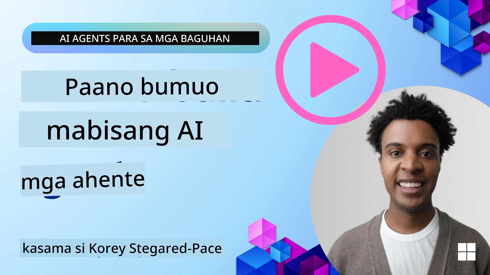
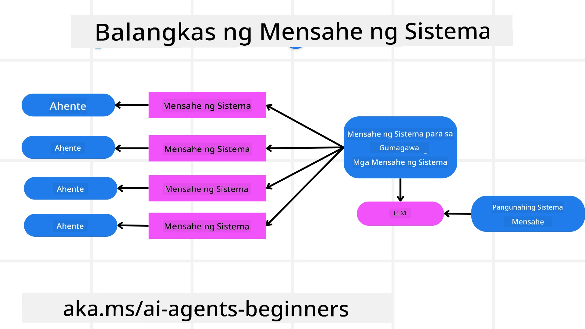
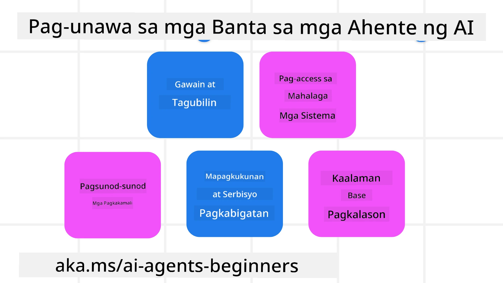
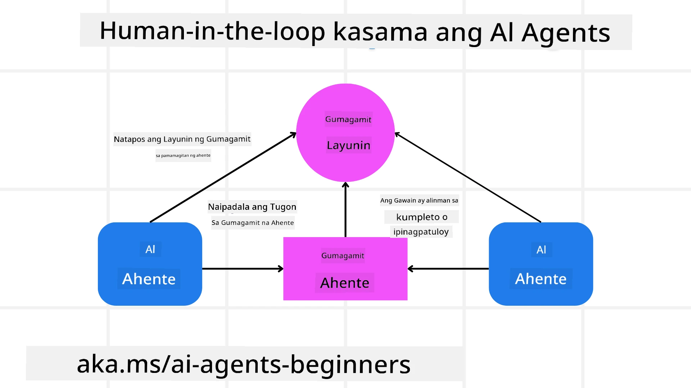

[](https://youtu.be/iZKkMEGBCUQ?si=Q-kEbcyHUMPoHp8L)

> _(I-click ang larawan sa itaas upang panoorin ang video ng araling ito)_

# Pagbuo ng Mapagkakatiwalaang AI Agents

## Panimula

Tatalakayin sa araling ito ang:

- Paano bumuo at mag-deploy ng ligtas at epektibong AI Agents
- Mahahalagang konsiderasyon sa seguridad kapag nagde-develop ng AI Agents.
- Paano mapanatili ang privacy ng data at user kapag nagde-develop ng AI Agents.

## Mga Layunin sa Pagkatuto

Pagkatapos makumpleto ang araling ito, malalaman mo kung paano:

- Tukuyin at mabawasan ang mga panganib kapag lumilikha ng AI Agents.
- Magpatupad ng mga hakbang sa seguridad upang matiyak na ang data at access ay maayos na pinamamahalaan.
- Lumikha ng AI Agents na nagpapanatili ng privacy ng data at nagbibigay ng kalidad na karanasan sa user.

## Kaligtasan

Tingnan muna natin ang pagbuo ng ligtas na mga agentic na aplikasyon. Ang kaligtasan ay nangangahulugan na gumaganap ang AI agent ayon sa disenyo. Bilang mga tagabuo ng mga agentic na aplikasyon, mayroon tayong mga pamamaraan at kagamitan upang mapalaki ang kaligtasan:

### Pagbuo ng Sistema ng Mensahe Framework

Kung nakakagawa ka na ng AI application gamit ang Large Language Models (LLMs), alam mo ang kahalagahan ng pagdisenyo ng matatag na system prompt o system message. Itinatakda ng mga prompt na ito ang meta na mga panuntunan, mga tagubilin, at mga patnubay kung paano makikipag-ugnayan ang LLM sa user at data.

Para sa AI Agents, mas mahalaga ang system prompt dahil kailangan ng AI Agents ng tumpak na mga tagubilin upang makumpleto ang mga gawaing idinisenyo natin para sa kanila.

Upang makalikha ng scalable na system prompts, maaari tayong gumamit ng isang system message framework para bumuo ng isa o higit pang mga agent sa ating application:



#### Hakbang 1: Gumawa ng Meta System Message

Ang meta prompt ay gagamitin ng isang LLM upang gumawa ng mga system prompts para sa mga agent na gagawin natin. Idinisenyo natin ito bilang isang template upang mabilis tayong makalikha ng maraming agent kung kinakailangan.

Narito ang isang halimbawa ng meta system message na ibibigay natin sa LLM:

```plaintext
You are an expert at creating AI agent assistants. 
You will be provided a company name, role, responsibilities and other
information that you will use to provide a system prompt for.
To create the system prompt, be descriptive as possible and provide a structure that a system using an LLM can better understand the role and responsibilities of the AI assistant. 
```

#### Hakbang 2: Gumawa ng pangunahing prompt

Ang susunod na hakbang ay gumawa ng pangunahing prompt upang ilarawan ang AI Agent. Dapat mong isama ang papel ng agent, ang mga gawaing gagawin ng agent, at anumang iba pang responsibilidad ng agent.

Narito ang isang halimbawa:

```plaintext
You are a travel agent for Contoso Travel that is great at booking flights for customers. To help customers you can perform the following tasks: lookup available flights, book flights, ask for preferences in seating and times for flights, cancel any previously booked flights and alert customers on any delays or cancellations of flights.  
```

#### Hakbang 3: Ibigay ang Pangunahing System Message sa LLM

Ngayon ay maaari nating i-optimize ang system message na ito sa pamamagitan ng pagbibigay ng meta system message bilang system message at ang ating pangunahing system message.

Magbibigay ito ng system message na mas mahusay na idinisenyo para maggabay sa ating mga AI agent:

```markdown
**Company Name:** Contoso Travel  
**Role:** Travel Agent Assistant

**Objective:**  
You are an AI-powered travel agent assistant for Contoso Travel, specializing in booking flights and providing exceptional customer service. Your main goal is to assist customers in finding, booking, and managing their flights, all while ensuring that their preferences and needs are met efficiently.

**Key Responsibilities:**

1. **Flight Lookup:**
    
    - Assist customers in searching for available flights based on their specified destination, dates, and any other relevant preferences.
    - Provide a list of options, including flight times, airlines, layovers, and pricing.
2. **Flight Booking:**
    
    - Facilitate the booking of flights for customers, ensuring that all details are correctly entered into the system.
    - Confirm bookings and provide customers with their itinerary, including confirmation numbers and any other pertinent information.
3. **Customer Preference Inquiry:**
    
    - Actively ask customers for their preferences regarding seating (e.g., aisle, window, extra legroom) and preferred times for flights (e.g., morning, afternoon, evening).
    - Record these preferences for future reference and tailor suggestions accordingly.
4. **Flight Cancellation:**
    
    - Assist customers in canceling previously booked flights if needed, following company policies and procedures.
    - Notify customers of any necessary refunds or additional steps that may be required for cancellations.
5. **Flight Monitoring:**
    
    - Monitor the status of booked flights and alert customers in real-time about any delays, cancellations, or changes to their flight schedule.
    - Provide updates through preferred communication channels (e.g., email, SMS) as needed.

**Tone and Style:**

- Maintain a friendly, professional, and approachable demeanor in all interactions with customers.
- Ensure that all communication is clear, informative, and tailored to the customer's specific needs and inquiries.

**User Interaction Instructions:**

- Respond to customer queries promptly and accurately.
- Use a conversational style while ensuring professionalism.
- Prioritize customer satisfaction by being attentive, empathetic, and proactive in all assistance provided.

**Additional Notes:**

- Stay updated on any changes to airline policies, travel restrictions, and other relevant information that could impact flight bookings and customer experience.
- Use clear and concise language to explain options and processes, avoiding jargon where possible for better customer understanding.

This AI assistant is designed to streamline the flight booking process for customers of Contoso Travel, ensuring that all their travel needs are met efficiently and effectively.

```

#### Hakbang 4: Ulitin at Paunlarin

Ang kahalagahan ng system message framework na ito ay upang maging mas madali ang pagsukat sa paggawa ng mga system message mula sa maramihang agent pati na rin ang pagpapahusay ng iyong mga system message sa paglipas ng panahon. Bihira kang magkakaroon ng system message na gumagana nang tama sa unang pagkakataon para sa iyong kumpletong kaso ng paggamit. Ang kakayahang gumawa ng maliliit na pagbabago at pagpapabuti sa pamamagitan ng pagbabago ng pangunahing system message at pagpapatakbo nito sa sistema ay magpapahintulot sa iyo na ikumpara at suriin ang mga resulta.

## Pag-unawa sa mga Banta

Upang makabuo ng mapagkakatiwalaang AI agents, mahalagang maunawaan at mabawasan ang mga panganib at banta sa iyong AI agent. Tingnan natin ang ilang mga iba't ibang banta sa AI agents at kung paano ka makapaghahanda at makakaplano nang mas mabuti para sa mga ito.



### Gawain at Tagubilin

**Paglalarawan:** Sinusubukan ng mga umaatake na baguhin ang mga tagubilin o layunin ng AI agent sa pamamagitan ng prompting o pagmamanipula ng mga input.

**Pag-iwas:** Isagawa ang mga pagsusuri sa beripikasyon at mga input filter upang matukoy ang mga posibleng mapanganib na prompt bago ito iproseso ng AI Agent. Dahil ang mga atakeng ito ay karaniwang nangangailangan ng madalas na interaksyon sa Agent, ang paglilimita sa bilang ng mga turn sa pag-uusap ay isa pang paraan upang maiwasan ang ganitong uri ng atake.

### Access sa mga Kritikal na Sistema

**Paglalarawan:** Kung ang isang AI agent ay may access sa mga sistema at serbisyo na nag-iimbak ng sensitibong data, maaaring mapahamak ng mga umaatake ang komunikasyon sa pagitan ng agent at mga serbisyong ito. Maaari itong direktang atake o di-tuwirang pagtatangkang kumuha ng impormasyon tungkol sa mga sistemang ito sa pamamagitan ng agent.

**Pag-iwas:** Dapat may limitadong access ang AI agents sa mga sistema batay lamang sa pangangailangan upang maiwasan ang ganitong uri ng atake. Dapat ay ligtas din ang komunikasyon sa pagitan ng agent at ng sistema. Ang pagpapatupad ng authentication at access control ay isa pang paraan upang protektahan ang impormasyong ito.

### Pag-overload ng Resources at Serbisyo

**Paglalarawan:** Maaaring gamitin ng AI agents ang iba't ibang tools at serbisyo upang makumpleto ang mga gawain. Maaaring gamitin ng mga umaatake ang kakayahang ito upang atakehin ang mga serbisyong ito sa pamamagitan ng pagpapadala ng maraming kahilingan sa AI Agent, na maaaring magdulot ng mga pagkabigo sa sistema o mataas na gastos.

**Pag-iwas:** Magpatupad ng mga patakaran upang limitahan ang bilang ng mga kahilingan na maaaring gawin ng AI agent sa isang serbisyo. Ang paglilimita sa bilang ng mga turn sa pag-uusap at mga kahilingan sa iyong AI agent ay isa pang paraan upang maiwasan ang ganitong uri ng mga atake.

### Pagpapalason sa Knowledge Base

**Paglalarawan:** Ang ganitong uri ng atake ay hindi direktang target ang AI agent kundi ang knowledge base at iba pang serbisyo na gagamitin ng AI agent. Maaaring kabilang dito ang pagpapasira sa data o impormasyon na gagamitin ng AI agent upang makumpleto ang isang gawain, na nagreresulta sa bias o hindi inaasahang mga sagot sa user.

**Pag-iwas:** Isagawa ang regular na beripikasyon ng data na gagamitin ng AI agent sa kanyang mga workflow. Tiyakin na ang access sa data na ito ay secure at nagagawa lamang ng mga pinagkakatiwalaang tao upang maiwasan ang ganitong uri ng atake.

### Sunod-sunod na Pagkakamali

**Paglalarawan:** Ang AI agents ay nakakakuha ng access sa iba't ibang tools at serbisyo upang makumpleto ang mga gawain. Ang mga pagkakamaling dulot ng mga umaatake ay maaaring magdulot ng pagkabigo ng iba pang mga sistema na konektado sa AI agent, na nagpapalawak ng saklaw ng pag-atake at nagpapahirap sa pag-troubleshoot.

**Pag-iwas:** Isang paraan upang maiwasan ito ay ang pagpapatakbo ng AI Agent sa isang limitadong kapaligiran, tulad ng pagsasagawa ng mga gawain sa loob ng Docker container, upang maiwasan ang direktang pag-atake sa sistema. Ang paggawa ng fallback mechanisms at retry logic kapag may system na nagbigay ng error ay isa pang paraan upang maiwasan ang malawakang pagkabigo ng sistema.

## Human-in-the-Loop

Isa pang epektibong paraan upang makabuo ng mapagkakatiwalaang AI Agent systems ay ang paggamit ng Human-in-the-loop. Lumilikha ito ng daloy kung saan ang mga user ay maaaring magbigay ng feedback sa mga Agent habang tumatakbo ang proseso. Ang mga user ay nagsisilbing mga agent sa isang multi-agent system at nagbibigay ng pag-apruba o pagtigil sa tumatakbong proseso.



Narito ang isang code snippet na gumagamit ng Microsoft Agent Framework upang ipakita kung paano ipinatutupad ang konseptong ito:

```python
import os
from agent_framework.azure import AzureAIProjectAgentProvider
from azure.identity import AzureCliCredential

# Lumikha ng tagapagbigay na may pag-apruba mula sa tao
provider = AzureAIProjectAgentProvider(
    credential=AzureCliCredential(),
)

# Lumikha ng ahente na may hakbang ng pag-apruba ng tao
response = provider.create_response(
    input="Write a 4-line poem about the ocean.",
    instructions="You are a helpful assistant. Ask for user approval before finalizing.",
)

# Maaaring repasuhin at aprubahan ng gumagamit ang tugon
print(response.output_text)
user_input = input("Do you approve? (APPROVE/REJECT): ")
if user_input == "APPROVE":
    print("Response approved.")
else:
    print("Response rejected. Revising...")
```

## Konklusyon

Ang pagbuo ng mapagkakatiwalaang AI agents ay nangangailangan ng maingat na disenyo, matatag na mga hakbang sa seguridad, at tuloy-tuloy na pag-uulit. Sa pamamagitan ng pagpapatupad ng mga istrukturadong meta prompting systems, pag-unawa sa mga potensyal na banta, at pagsasagawa ng mga estratehiya sa pag-iwas, maaaring makalikha ang mga developer ng mga AI agent na ligtas at epektibo. Bukod dito, ang pagsasama ng human-in-the-loop na diskarte ay nagsisiguro na nananatiling nakaayon ang mga AI agent sa pangangailangan ng user habang pinapaliit ang mga panganib. Habang patuloy na umuunlad ang AI, ang pagpapanatili ng proaktibong pananaw sa seguridad, privacy, at mga etikal na konsiderasyon ay susi sa pagpapaunlad ng tiwala at pagiging maaasahan sa mga AI-driven system.

### Mayroon Pang mga Tanong tungkol sa Pagbuo ng Mapagkakatiwalaang AI Agents?

Sumali sa [Microsoft Foundry Discord](https://aka.ms/ai-agents/discord) upang makipagkita sa iba pang mga nag-aaral, dumalo sa office hours, at masagot ang iyong mga tanong tungkol sa AI Agents.

## Karagdagang Mga Mapagkukunan

- <a href="https://learn.microsoft.com/azure/ai-studio/responsible-use-of-ai-overview" target="_blank">Pangkalahatang-ideya ng Responsible AI</a>
- <a href="https://learn.microsoft.com/azure/ai-studio/concepts/evaluation-approach-gen-ai" target="_blank">Pagsusuri ng mga generative AI modelo at AI aplikasyon</a>
- <a href="https://learn.microsoft.com/azure/ai-services/openai/concepts/system-message?context=%2Fazure%2Fai-studio%2Fcontext%2Fcontext&tabs=top-techniques" target="_blank">Mga system message para sa kaligtasan</a>
- <a href="https://blogs.microsoft.com/wp-content/uploads/prod/sites/5/2022/06/Microsoft-RAI-Impact-Assessment-Template.pdf?culture=en-us&country=us" target="_blank">Template para sa Risk Assessment</a>

## Nakaraang Aralin

[Agentic RAG](../05-agentic-rag/README.md)

## Susunod na Aralin

[Planning Design Pattern](../07-planning-design/README.md)

---

<!-- CO-OP TRANSLATOR DISCLAIMER START -->
**Paunawa**:
Ang dokumentong ito ay isinalin gamit ang serbisyong AI na pagsasalin na [Co-op Translator](https://github.com/Azure/co-op-translator). Bagamat nagsusumikap kami para sa katumpakan, pakatandaan na ang mga awtomatikong pagsasalin ay maaaring maglaman ng mga pagkakamali o di-tumpak na impormasyon. Ang orihinal na dokumento sa kanyang orihinal na wika ang dapat ituring na opisyal na sanggunian. Para sa mahahalagang impormasyon, ipinapayo ang propesyonal na pagsasalin ng tao. Hindi kami mananagot sa anumang kalituhan o maling pagkakaintindi na nagmumula sa paggamit ng pagsasaling ito.
<!-- CO-OP TRANSLATOR DISCLAIMER END -->