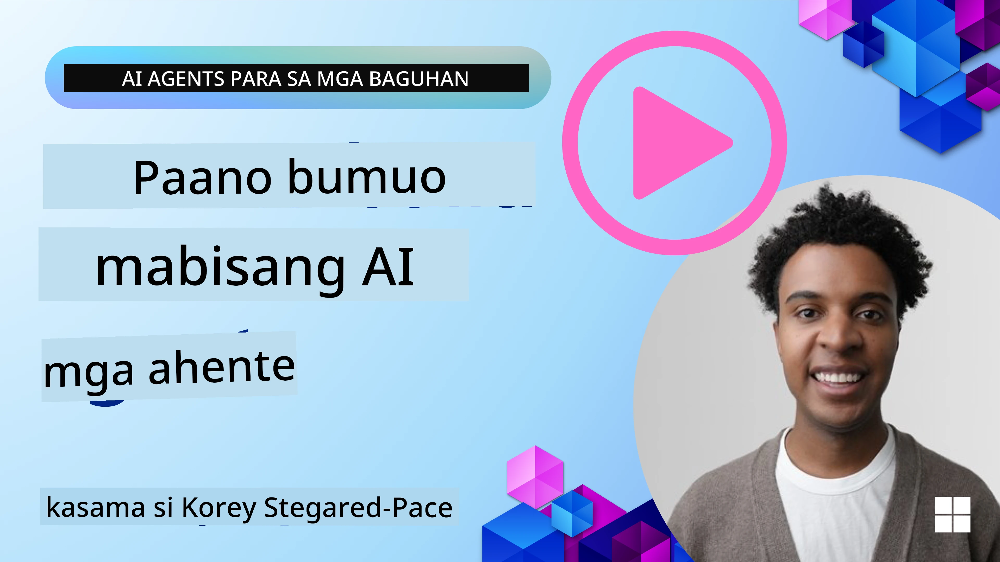
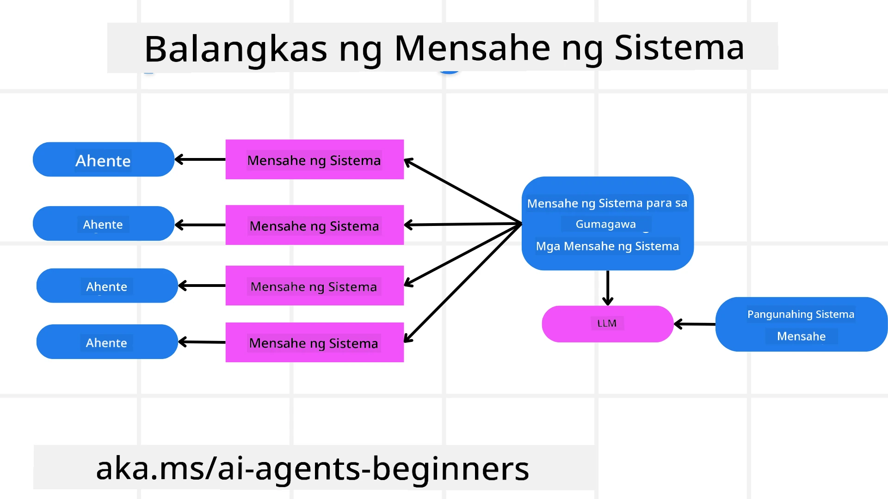
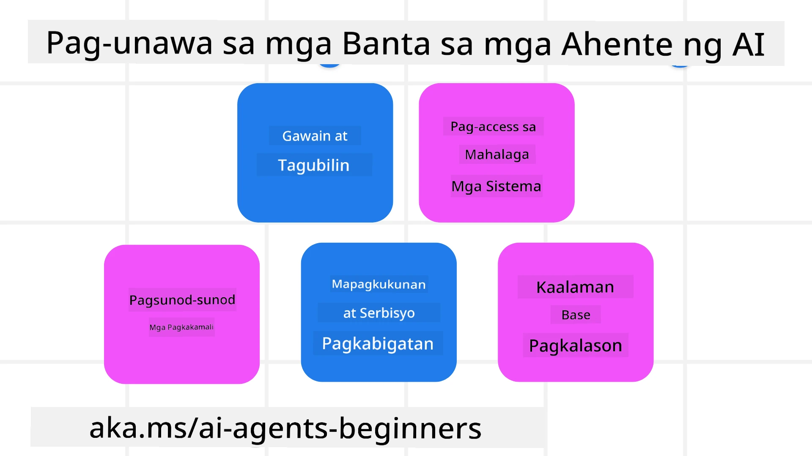
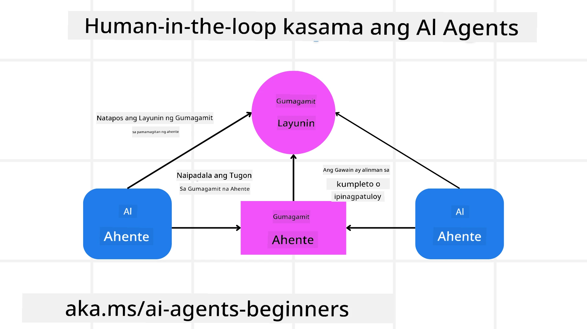

[](https://youtu.be/iZKkMEGBCUQ?si=Q-kEbcyHUMPoHp8L)

> _(I-click ang larawan sa itaas upang panoorin ang video ng leksyon na ito)_

# Pagtatayo ng Mapagkakatiwalaang AI Agents

## Panimula

Tatalakayin sa leksyong ito ang:

- Paano bumuo at maglunsad ng ligtas at epektibong AI Agents
- Mahahalagang konsiderasyon sa seguridad kapag nagde-develop ng AI Agents.
- Paano mapanatili ang data at pribadong impormasyon ng gumagamit sa pagde-develop ng AI Agents.

## Mga Layunin sa Pagkatuto

Matapos matapos ang leksyong ito, malalaman mo kung paano:

- Tukuyin at harapin ang mga panganib sa paggawa ng AI Agents.
- Ipatupad ang mga hakbang sa seguridad upang matiyak na maayos ang pamamahala ng data at akses.
- Gumawa ng AI Agents na nagpo-protekta sa privacy ng data at nagbibigay ng mataas na kalidad na karanasan sa gumagamit.

## Kaligtasan

Unang tingnan natin ang pagtatayo ng ligtas na mga aplikasyong agentic. Ang kaligtasan ay nangangahulugang gumagana ang AI agent ayon sa disenyo. Bilang mga tagabuo ng mga agentic application, may mga paraan at kagamitan tayo upang mapalakas ang kaligtasan:

### Pagtatayo ng System Message Framework

Kung nakabuo ka na ng AI application gamit ang Large Language Models (LLMs), alam mo na ang kahalagahan ng pagdidisenyo ng matibay na system prompt o mensahe ng sistema. Ang mga prompt na ito ang nagtatakda ng mga meta patakaran, tagubilin, at gabay kung paano makikipag-ugnayan ang LLM sa gumagamit at data.

Para sa AI Agents, mas mahalaga ang system prompt dahil kailangan ng AI Agents ng napaka-tiyak na mga tagubilin para maisakatuparan ang mga gawaing inilaan natin para sa kanila.

Upang makalikha ng sistemang mga prompt na maaaring sukatin, maaari nating gamitin ang isang system message framework para sa pagtayo ng isa o higit pang mga agent sa ating aplikasyon:



#### Hakbang 1: Gumawa ng Meta System Message 

Gagamitin ng LLM ang meta prompt para lumikha ng mga system prompt para sa mga agent na gagawin natin. Ididisenyo natin ito bilang template upang makagawa tayo ng maraming agent nang mas mabilis kung kinakailangan.

Narito ang halimbawa ng meta system message na ibibigay natin sa LLM:

```plaintext
You are an expert at creating AI agent assistants. 
You will be provided a company name, role, responsibilities and other
information that you will use to provide a system prompt for.
To create the system prompt, be descriptive as possible and provide a structure that a system using an LLM can better understand the role and responsibilities of the AI assistant. 
```

#### Hakbang 2: Gumawa ng basic na prompt

Ang susunod na hakbang ay gumawa ng basic prompt upang ilarawan ang AI Agent. Dapat mong isama ang papel ng agent, mga gawain na gagawin ng agent, at iba pang responsibilidad nito.

Narito ang halimbawa:

```plaintext
You are a travel agent for Contoso Travel that is great at booking flights for customers. To help customers you can perform the following tasks: lookup available flights, book flights, ask for preferences in seating and times for flights, cancel any previously booked flights and alert customers on any delays or cancellations of flights.  
```

#### Hakbang 3: Ibigay ang Basic System Message sa LLM

Ngayon ay maaari nating i-optimize ang mensaheng ito sa pamamagitan ng pagbibigay ng meta system message bilang system message kasama ang ating basic system message.

Magreresulta ito ng system message na mas mahusay na idinisenyo upang gabayan ang ating AI agents:

```markdown
**Company Name:** Contoso Travel  
**Role:** Travel Agent Assistant

**Objective:**  
You are an AI-powered travel agent assistant for Contoso Travel, specializing in booking flights and providing exceptional customer service. Your main goal is to assist customers in finding, booking, and managing their flights, all while ensuring that their preferences and needs are met efficiently.

**Key Responsibilities:**

1. **Flight Lookup:**
    
    - Assist customers in searching for available flights based on their specified destination, dates, and any other relevant preferences.
    - Provide a list of options, including flight times, airlines, layovers, and pricing.
2. **Flight Booking:**
    
    - Facilitate the booking of flights for customers, ensuring that all details are correctly entered into the system.
    - Confirm bookings and provide customers with their itinerary, including confirmation numbers and any other pertinent information.
3. **Customer Preference Inquiry:**
    
    - Actively ask customers for their preferences regarding seating (e.g., aisle, window, extra legroom) and preferred times for flights (e.g., morning, afternoon, evening).
    - Record these preferences for future reference and tailor suggestions accordingly.
4. **Flight Cancellation:**
    
    - Assist customers in canceling previously booked flights if needed, following company policies and procedures.
    - Notify customers of any necessary refunds or additional steps that may be required for cancellations.
5. **Flight Monitoring:**
    
    - Monitor the status of booked flights and alert customers in real-time about any delays, cancellations, or changes to their flight schedule.
    - Provide updates through preferred communication channels (e.g., email, SMS) as needed.

**Tone and Style:**

- Maintain a friendly, professional, and approachable demeanor in all interactions with customers.
- Ensure that all communication is clear, informative, and tailored to the customer's specific needs and inquiries.

**User Interaction Instructions:**

- Respond to customer queries promptly and accurately.
- Use a conversational style while ensuring professionalism.
- Prioritize customer satisfaction by being attentive, empathetic, and proactive in all assistance provided.

**Additional Notes:**

- Stay updated on any changes to airline policies, travel restrictions, and other relevant information that could impact flight bookings and customer experience.
- Use clear and concise language to explain options and processes, avoiding jargon where possible for better customer understanding.

This AI assistant is designed to streamline the flight booking process for customers of Contoso Travel, ensuring that all their travel needs are met efficiently and effectively.

```

#### Hakbang 4: Ulitin at Pagbutihin

Ang halaga ng system message framework na ito ay para mapadali ang paglikha ng mga system message mula sa maraming agent at mapabuti rin ang iyong mga system message sa paglipas ng panahon. Bihira na mapagana mo ang isang system message sa unang subok para sa buong gamit nito. Ang kakayahang gumawa ng maliliit na pagbabago at pagpapabuti sa pamamagitan ng pag-alter sa basic system message at pagpasa nito sa sistema ay makakatulong sa paghahambing at pagsusuri ng mga resulta.

## Pag-unawa sa mga Banta

Para makabuo ng mapagkakatiwalaang AI agents, mahalagang maintindihan at mabawasan ang mga panganib at banta sa AI agent. Tingnan natin ang ilan sa mga banta sa AI agents at kung paano ka makapaghahanda para dito.



### Gawain at Tagubilin

**Paglalarawan:** Sinusubukan ng mga umaatake na baguhin ang mga tagubilin o layunin ng AI agent sa pamamagitan ng pag-prompt o panghihimasok sa mga input.

**Pagsugpo**: Gamitin ang mga validation checks at mga input filter para matukoy ang mga delikadong prompt bago iproseso ng AI Agent. Dahil karaniwang kailangan ng madalas na interaksyon sa Agent ang mga atakeng ito, ang limitasyon sa bilang ng mga usapan ay isa pang paraan upang maiwasan ang ganitong uri ng pag-atake.

### Akses sa Kritikal na mga Sistema

**Paglalarawan**: Kung may akses ang AI agent sa mga sistema at serbisyo na nag-iingat ng sensitibong data, maaari itong pag-atakehin ng mga umaatake sa komunikasyon sa pagitan ng agent at mga serbisyong ito. Maari itong mga direktang pag-atake o di-tuwirang pagtatangkang makakuha ng impormasyon sa mga sistemang ito sa pamamagitan ng agent.

**Pagsugpo**: Dapat may akses ang AI agents sa mga sistema batay lamang sa pangangailangan upang maiwasan ang ganitong uri ng pag-atake. Dapat siguraduhin ding ligtas ang komunikasyon sa pagitan ng agent at ng sistema. Ang pagpapatupad ng authentication at access control ay isa pang paraan upang protektahan ang impormasyong ito.

### Sobrang Paggamit ng Resource at Serbisyo

**Paglalarawan:** Nakaka-access ang AI agents ng iba't ibang kagamitan at serbisyo para maisagawa ang mga gawain. Maaari itong pagsamantalahan ng mga umaatake sa pamamagitan ng pagpapadala ng maraming mga request sa AI Agent na maaaring magdulot ng pagkasira ng sistema o mataas na gastos.

**Pagsugpo:** Magpatupad ng mga polisiya para limitahan ang dami ng requests na maaaring gawin ng AI agent sa isang serbisyo. Ang pag-limit ng bilang ng mga pag-uusap at request sa iyong AI agent ay isa pang paraan upang maiwasan ang ganitong mga pag-atake.

### Pagkalason sa Knowledge Base

**Paglalarawan:** Hindi direktang tinatarget ng pag-atakeng ito ang AI agent kundi ang knowledge base at iba pang mga serbisyo na gagamitin ng AI agent. Maaaring kabilang dito ang pagdudumi ng data o impormasyon na gagamitin ng AI agent sa paggawa ng gawain, na nagreresulta sa kiniling o hindi inaasahang tugon sa gumagamit.

**Pagsugpo:** Gawing regular ang pagberipika ng data na gagamitin ng AI agent sa mga workflow nito. Siguraduhing ligtas ang akses sa data at nababago lamang ito ng mga pinagkakatiwalaang tao upang maiwasan ang ganitong uri ng pag-atake.

### Pagsunod-sunod na Mali

**Paglalarawan:** Nakaka-access ang AI agents ng iba't ibang kagamitan at serbisyo para sa mga gawain. Ang mga error na sanhi ng mga umaatake ay maaaring magdulot ng pagkasira ng ibang mga sistema na konektado sa AI agent, na nagdudulot ng mas malawakang pag-atake at pagpapahirap sa pag-troubleshoot.

**Pagsugpo**: Isang paraan para maiwasan ito ay ang pagpapatakbo ng AI Agent sa isang limitadong kapaligiran, tulad ng pagkilos sa loob ng Docker container, upang maiwasan ang direktang pag-atake sa sistema. Ang paggawa ng mga fallback mechanism at retry logic kapag nag-error ang ilang sistema ay isa pang paraan upang mapigilan ang malalaking pagkasira ng sistema.

## Human-in-the-Loop

Isa pang epektibong paraan upang bumuo ng mapagkakatiwalaang AI Agent system ay ang paggamit ng Human-in-the-loop. Gumagawa ito ng daloy kung saan maaaring magbigay ng puna ang mga gumagamit sa mga Agent sa panahon ng pagpapatakbo. Sa esensya, gumaganap ang mga gumagamit bilang mga agent sa isang multi-agent system at nagbibigay sila ng pag-apruba o pagtigil sa tumatakbong proseso.



Narito ang isang snippet ng code gamit ang Microsoft Agent Framework upang ipakita kung paano ipinatutupad ang konseptong ito:

```python
import os
from agent_framework.foundry import FoundryChatClient
from azure.identity import AzureCliCredential

# Lumikha ng taga-supply na may pag-apruba mula sa tao sa proseso
provider = FoundryChatClient(
    project_endpoint=os.environ["AZURE_AI_PROJECT_ENDPOINT"],
    model=os.environ["AZURE_AI_MODEL_DEPLOYMENT_NAME"],
    credential=AzureCliCredential(),
)

# Lumikha ng ahente na may hakbang ng pag-apruba ng tao
response = provider.create_response(
    input="Write a 4-line poem about the ocean.",
    instructions="You are a helpful assistant. Ask for user approval before finalizing.",
)

# Maaaring suriin at aprubahan ng gumagamit ang sagot
print(response.output_text)
user_input = input("Do you approve? (APPROVE/REJECT): ")
if user_input == "APPROVE":
    print("Response approved.")
else:
    print("Response rejected. Revising...")
```

## Konklusyon

Ang pagtatayo ng mapagkakatiwalaang AI agents ay nangangailangan ng maingat na disenyo, matibay na hakbang pang-seguridad, at patuloy na pag-ulit. Sa pamamagitan ng pagpapatupad ng mga nakaistrukturang meta prompting system, pag-unawa sa mga posibleng banta, at pagsasabuhay ng mga estratehiya ng pagsugpo, makakalikha ang mga developer ng AI agents na ligtas at epektibo. Bukod pa rito, ang pagpasok ng human-in-the-loop na paraan ay nagsisiguro na ang AI agents ay nananatiling naka-align sa pangangailangan ng mga gumagamit habang binabawasan ang mga panganib. Habang patuloy na umuunlad ang AI, ang pagpapanatili ng maagap na pananaw sa seguridad, privacy, at mga etikal na konsiderasyon ay magiging susi sa pagpapalago ng tiwala at pagiging maaasahan sa mga AI-driven na sistema.

## Code Samples

- [`code_samples/06-system-message-framework.ipynb`](code_samples/06-system-message-framework.ipynb): Hakbang-hakbang na demo ng meta-prompt na system-message framework.
- [`code_samples/06-human-in-the-loop.ipynb`](code_samples/06-human-in-the-loop.ipynb): Mga pre-action approval gates, risk tiering, at audit logging para sa mapagkakatiwalaang mga agent.

### May Iba Ka Pang Mga Tanong tungkol sa Pagtatayo ng Mapagkakatiwalaang AI Agents?

Sumali sa [Microsoft Foundry Discord](https://discord.com/invite/ATgtXmAS5D) upang makihalubilo sa iba pang mga nag-aaral, dumalo sa mga office hour, at masagot ang iyong mga tanong tungkol sa AI Agents.

## Karagdagang Mga Sanggunian

- <a href="https://learn.microsoft.com/azure/ai-studio/responsible-use-of-ai-overview" target="_blank">Pangkalahatang Paliwanag sa Responsable na AI</a>
- <a href="https://learn.microsoft.com/azure/ai-studio/concepts/evaluation-approach-gen-ai" target="_blank">Pagsusuri ng mga modelong generative AI at AI applications</a>
- <a href="https://learn.microsoft.com/azure/ai-services/openai/concepts/system-message?context=%2Fazure%2Fai-studio%2Fcontext%2Fcontext&tabs=top-techniques" target="_blank">Mga safety system message</a>
- <a href="https://blogs.microsoft.com/wp-content/uploads/prod/sites/5/2022/06/Microsoft-RAI-Impact-Assessment-Template.pdf?culture=en-us&country=us" target="_blank">Template para sa Risk Assessment</a>

## Nakaraang Leksiyon

[Agentic RAG](../05-agentic-rag/README.md)

## Susunod na Leksiyon

[Planning Design Pattern](../07-planning-design/README.md)

---

<!-- CO-OP TRANSLATOR DISCLAIMER START -->
**Pagtatanggi**:
Ang dokumentong ito ay isinalin gamit ang serbisyo ng AI translation na [Co-op Translator](https://github.com/Azure/co-op-translator). Bagama't nagsusumikap kami para sa katumpakan, pakatandaan na ang awtomatikong pagsasalin ay maaaring maglaman ng mga pagkakamali o hindi pagkakatugma. Ang orihinal na dokumento sa orihinal nitong wika ang dapat ituring na pangunahing sanggunian. Para sa mahahalagang impormasyon, inirerekomenda ang propesyonal na pagsasalin ng tao. Hindi kami mananagot sa anumang maling pagkakaintindi o maling interpretasyon na nagmula sa paggamit ng pagsasaling ito.
<!-- CO-OP TRANSLATOR DISCLAIMER END -->