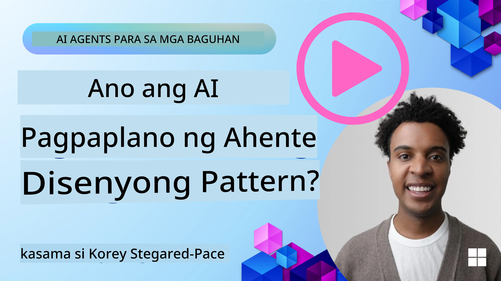
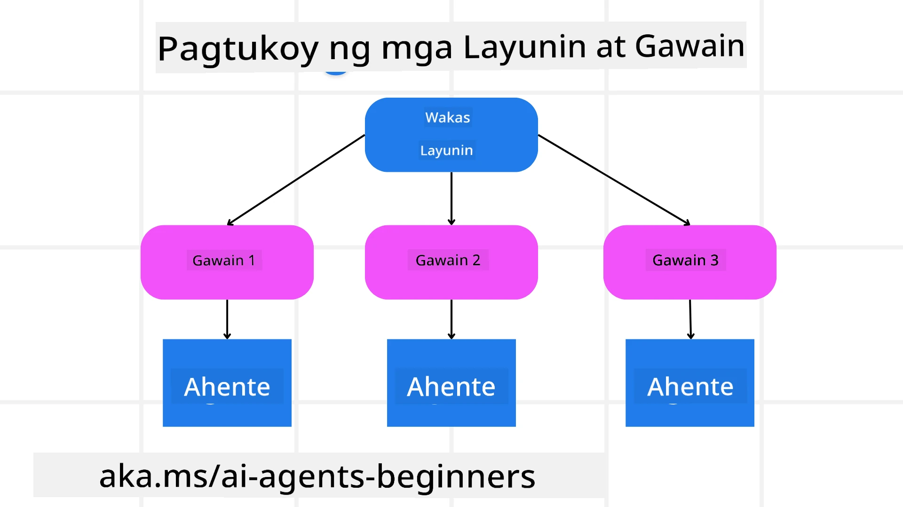

[](https://youtu.be/kPfJ2BrBCMY?si=9pYpPXp0sSbK91Dr)

> _(I-click ang larawan sa itaas upang panoorin ang video ng araling ito)_

# Planning Design

## Panimula

Saklaw ng araling ito ang

* Pagbibigay ng malinaw na pangkalahatang layunin at paghahati ng isang masalimuot na gawain sa mga kailangang gawin na gawain.
* Paggamit ng naka-istrukturang output para sa mas maaasahang at madaling mabasang tugon ng makina.
* Paglalapat ng event-driven na pamamaraan upang hawakan ang mga dinamikong gawain at di-inaasahang inputs.

## Mga Layunin sa Pagkatuto

Pagkatapos makumpleto ang araling ito, mauunawaan mo ang tungkol sa:

* Kilalanin at itakda ang pangkalahatang layunin para sa isang AI agent, upang malinaw nitong malaman kung ano ang dapat makamit.
* Hatiin ang masalimuot na gawain sa mga kailangang gawin na sub-gawain at ayusin ang mga ito sa isang lohikal na pagkakasunod-sunod.
* Bigyan ang mga agent ng tamang mga kasangkapan (halimbawa, mga search tool o mga data analytics tool), magpasya kung kailan at paano ito gagamitin, at hawakan ang mga hindi inaasahang sitwasyon na lumitaw.
* Suriin ang mga resulta ng mga sub-gawain, sukatin ang pagganap, at paulit-ulit na pagbutihin ang mga aksyon upang mapabuti ang panghuling output.

## Pagbibigay ng Pangunahing Layunin at Paghahati ng Gawain



Karamihan sa mga totoong gawain ay masyadong masalimuot upang gamitin ng isang hakbang lamang. Kailangan ng AI agent ng maiksing layunin upang gabayan ang kanyang pagpaplano at mga aksyon. Halimbawa, isaalang-alang ang layunin:

    "Gumawa ng 3-araw na plano ng paglalakbay."

Bagamat simple itong sabihin, kailangan pa rin itong linawin. Mas malinaw ang layunin, mas magiging mahusay ang agent (at anumang taong kalahok) na magtuon upang maabot ang tamang resulta, gaya ng paggawa ng komprehensibong itineraryo na may mga opsyon sa flight, rekomendasyon ng hotel, at mga mungkahing aktibidad.

### Paghahati ng Gawain

Ang malalaki o masalimuot na mga gawain ay nagiging mas madali kapag hinati sa mas maliliit na sub-gawain na may layunin.
Para sa halimbawa ng itineraryo ng paglalakbay, maaari mong hatiin ang layunin sa:

* Pag-book ng Flight
* Pag-book ng Hotel
* Pag-upa ng Sasakyan
* Personalization

Bawat sub-gawain ay maaaring tugunan ng mga espesyal na agent o proseso. Isang agent ay maaaring magpakadalubhasa sa paghahanap ng pinakamahusay na deal sa flight, ang isa ay nakatuon sa pag-book ng hotel, at iba pa. Ang nagkokordina o "downstream" agent ay maaaring pagsamahin ang mga resulta upang makabuo ng isang buo at magkakaugnay na itineraryo para sa end user.

Pinapayagan din ng modular na pamamaraan na ito ang paunti-unting pagpapahusay. Halimbawa, maaari kang magdagdag ng mga espesyalisadong agent para sa mga Rekomendasyon sa Pagkain o Mga Mungkahing Lokal na Aktibidad at pinuhin ang itineraryo habang lumilipas ang panahon.

### Naka-istrukturang output

Ang Large Language Models (LLMs) ay maaaring gumawa ng naka-istrukturang output (halimbawa JSON) na mas madaling ma-parse at maiproseso ng mga downstream agent o serbisyo. Ito ay lalo na kapaki-pakinabang sa isang multi-agent na konteksto, kung saan maaari nating gawin ang mga gawain matapos matanggap ang output ng pagpaplano.

Ipinapakita ng sumusunod na Python snippet ang isang simpleng planning agent na naghahati ng layunin sa mga sub-gawain at lumilikha ng naka-istrukturang plano:

```python
from pydantic import BaseModel
from enum import Enum
from typing import List, Optional, Union
import json
import os
from typing import Optional
from pprint import pprint
from agent_framework.azure import AzureAIProjectAgentProvider
from azure.identity import AzureCliCredential

class AgentEnum(str, Enum):
    FlightBooking = "flight_booking"
    HotelBooking = "hotel_booking"
    CarRental = "car_rental"
    ActivitiesBooking = "activities_booking"
    DestinationInfo = "destination_info"
    DefaultAgent = "default_agent"
    GroupChatManager = "group_chat_manager"

# Modelo ng Travel SubTask
class TravelSubTask(BaseModel):
    task_details: str
    assigned_agent: AgentEnum  # nais naming i-assign ang gawain sa ahente

class TravelPlan(BaseModel):
    main_task: str
    subtasks: List[TravelSubTask]
    is_greeting: bool

provider = AzureAIProjectAgentProvider(credential=AzureCliCredential())

# Tukuyin ang mensahe ng gumagamit
system_prompt = """You are a planner agent.
    Your job is to decide which agents to run based on the user's request.
    Provide your response in JSON format with the following structure:
{'main_task': 'Plan a family trip from Singapore to Melbourne.',
 'subtasks': [{'assigned_agent': 'flight_booking',
               'task_details': 'Book round-trip flights from Singapore to '
                               'Melbourne.'}
    Below are the available agents specialised in different tasks:
    - FlightBooking: For booking flights and providing flight information
    - HotelBooking: For booking hotels and providing hotel information
    - CarRental: For booking cars and providing car rental information
    - ActivitiesBooking: For booking activities and providing activity information
    - DestinationInfo: For providing information about destinations
    - DefaultAgent: For handling general requests"""

user_message = "Create a travel plan for a family of 2 kids from Singapore to Melbourne"

response = client.create_response(input=user_message, instructions=system_prompt)

response_content = response.output_text
pprint(json.loads(response_content))
```

### Planning Agent with Multi-Agent Orchestration

Sa halimbawang ito, ang Semantic Router Agent ay tumatanggap ng kahilingan mula sa user (halimbawa, "Kailangan ko ng plano sa hotel para sa aking biyahe.").

Ang planner ay:

* Tumanggap ng Plano para sa Hotel: Kinukuha ng planner ang mensahe ng user at, batay sa isang system prompt (kasama ang detalye ng mga available na agent), bumubuo ng naka-istrukturang travel plan.
* Nagtatala ng mga Agent at Kanilang mga Kasangkapan: May listahan sa agent registry ng mga agent (halimbawa para sa flight, hotel, pag-upa ng sasakyan, at mga aktibidad) kasama ang mga function o tool na kanilang inaalok.
* Ipinapasa ang Plano sa mga Kaukulang Agent: Depende sa bilang ng mga sub-gawain, ang planner ay nagpapadala ng mensahe nang direkta sa dedikadong agent (para sa mga single-task na senaryo) o nagkokordina sa pamamagitan ng group chat manager para sa multi-agent na kolaborasyon.
* Nilalagdang ang Resulta: Sa huli, binubuod ng planner ang ginawa nitong plano para sa kalinawan.
Ipinapakita ng sumusunod na Python code sample ang mga hakbang na ito:

```python

from pydantic import BaseModel

from enum import Enum
from typing import List, Optional, Union

class AgentEnum(str, Enum):
    FlightBooking = "flight_booking"
    HotelBooking = "hotel_booking"
    CarRental = "car_rental"
    ActivitiesBooking = "activities_booking"
    DestinationInfo = "destination_info"
    DefaultAgent = "default_agent"
    GroupChatManager = "group_chat_manager"

# Modelo ng Travel SubTask

class TravelSubTask(BaseModel):
    task_details: str
    assigned_agent: AgentEnum # nais naming i-assign ang gawain sa ahente

class TravelPlan(BaseModel):
    main_task: str
    subtasks: List[TravelSubTask]
    is_greeting: bool
import json
import os
from typing import Optional

from agent_framework.azure import AzureAIProjectAgentProvider
from azure.identity import AzureCliCredential

# Gumawa ng kliyente

provider = AzureAIProjectAgentProvider(credential=AzureCliCredential())

from pprint import pprint

# Tukuyin ang mensahe ng user

system_prompt = """You are a planner agent.
    Your job is to decide which agents to run based on the user's request.
    Below are the available agents specialized in different tasks:
    - FlightBooking: For booking flights and providing flight information
    - HotelBooking: For booking hotels and providing hotel information
    - CarRental: For booking cars and providing car rental information
    - ActivitiesBooking: For booking activities and providing activity information
    - DestinationInfo: For providing information about destinations
    - DefaultAgent: For handling general requests"""

user_message = "Create a travel plan for a family of 2 kids from Singapore to Melbourne"

response = client.create_response(input=user_message, instructions=system_prompt)

response_content = response.output_text

# I-print ang nilalaman ng tugon pagkatapos itong i-load bilang JSON

pprint(json.loads(response_content))
```

Ang susunod ay ang output mula sa naunang code at maaari mong gamitin ang naka-istrukturang output na ito upang i-route sa `assigned_agent` at buodin ang travel plan para sa end user.

```json
{
    "is_greeting": "False",
    "main_task": "Plan a family trip from Singapore to Melbourne.",
    "subtasks": [
        {
            "assigned_agent": "flight_booking",
            "task_details": "Book round-trip flights from Singapore to Melbourne."
        },
        {
            "assigned_agent": "hotel_booking",
            "task_details": "Find family-friendly hotels in Melbourne."
        },
        {
            "assigned_agent": "car_rental",
            "task_details": "Arrange a car rental suitable for a family of four in Melbourne."
        },
        {
            "assigned_agent": "activities_booking",
            "task_details": "List family-friendly activities in Melbourne."
        },
        {
            "assigned_agent": "destination_info",
            "task_details": "Provide information about Melbourne as a travel destination."
        }
    ]
}
```

Isang halimbawa ng notebook gamit ang naunang code sample ay matatagpuan [dito](07-python-agent-framework.ipynb).

### Pang-ulit na Pagpaplano

Ang ilang mga gawain ay nangangailangan ng palitan o muling pagpaplano, kung saan ang resulta ng isang sub-gawain ay nakakaapekto sa kasunod. Halimbawa, kung ang agent ay makakakita ng hindi inaasahang format ng data habang nagbu-book ng flights, kailangan nitong baguhin ang estratehiya bago magpatuloy sa pag-book ng hotel.

Dagdag pa, ang feedback mula sa user (halimbawa, isang tao na nagpasiya na mas gusto nila ang mas maagang flight) ay maaaring mag-trigger ng partial na muling pagpaplano. Ang dynamic at paulit-ulit na pamamaraang ito ay nagsisiguro na ang panghuling solusyon ay angkop sa mga totoong hadlang at nagbabagong kagustuhan ng user.

halimbawang code

```python
from agent_framework.azure import AzureAIProjectAgentProvider
from azure.identity import AzureCliCredential
#.. katulad ng nakaraang code at ipasa ang kasaysayan ng gumagamit, kasalukuyang plano

system_prompt = """You are a planner agent to optimize the
    Your job is to decide which agents to run based on the user's request.
    Below are the available agents specialized in different tasks:
    - FlightBooking: For booking flights and providing flight information
    - HotelBooking: For booking hotels and providing hotel information
    - CarRental: For booking cars and providing car rental information
    - ActivitiesBooking: For booking activities and providing activity information
    - DestinationInfo: For providing information about destinations
    - DefaultAgent: For handling general requests"""

user_message = "Create a travel plan for a family of 2 kids from Singapore to Melbourne"

response = client.create_response(
    input=user_message,
    instructions=system_prompt,
    context=f"Previous travel plan - {TravelPlan}",
)
# .. muling magplano at ipadala ang mga gawain sa mga kaukulang ahente
```

Para sa mas komprehensibong pagpaplano, suriin ang Magnetic One <a href="https://www.microsoft.com/research/articles/magentic-one-a-generalist-multi-agent-system-for-solving-complex-tasks" target="_blank">Blogpost</a> para sa paglutas ng masalimuot na mga gawain.

## Buod

Sa artikulong ito, tiningnan natin ang halimbawa kung paano tayo makakagawa ng planner na kayang dynamic na piliin ang mga available na agent na itinakda. Ang output ng Planner ay naghahati ng mga gawain at nagtatalaga ng mga agent upang maisagawa ang mga ito. Inaakala na ang mga agent ay may access sa mga function/tool na kinakailangan upang maisagawa ang gawain. Bilang karagdagan sa mga agent, maaari kang magdagdag ng iba pang mga pattern tulad ng reflection, summarizer, at round robin chat upang higit pang ipasadya.

## Karagdagang Mga Mapagkukunan

Magentic One - Isang Generalist multi-agent system para sa paglutas ng masalimuot na mga gawain na may mga kahanga-hangang resulta sa iba't ibang mapanghamong agentic benchmarks. Sanggunian: <a href="https://www.microsoft.com/research/articles/magentic-one-a-generalist-multi-agent-system-for-solving-complex-tasks" target="_blank">Magentic One</a>. Sa implementasyong ito, ang orchestrator ay lumilikha ng mga task specific na plano at ipinapasa ang mga gawain sa mga available na agent. Bilang karagdagan sa pagpaplano, ang orchestrator ay gumagamit din ng mekanismo sa pagsubaybay upang bantayan ang progreso ng gawain at muling magplano kung kinakailangan.

### May Iba Ka Pang Tanong tungkol sa Planning Design Pattern?

Sumali sa [Microsoft Foundry Discord](https://aka.ms/ai-agents/discord) upang makipagkita sa iba pang mga nag-aaral, dumalo sa office hours, at masagot ang iyong mga tanong tungkol sa AI Agents.

## Nakaraang Aralin

[Building Trustworthy AI Agents](../06-building-trustworthy-agents/README.md)

## Susunod na Aralin

[Multi-Agent Design Pattern](../08-multi-agent/README.md)

---

<!-- CO-OP TRANSLATOR DISCLAIMER START -->
**Paunawa**:  
Ang dokumentong ito ay isinalin gamit ang AI translation service na [Co-op Translator](https://github.com/Azure/co-op-translator). Bagaman nagsusumikap kami para sa katumpakan, mangyaring tandaan na ang mga awtomatikong pagsasalin ay maaaring maglaman ng mga pagkakamali o kamalian. Ang orihinal na dokumento sa sariling wika nito ang dapat ituring na pangunahing sanggunian. Para sa mga mahalagang impormasyon, inirerekomenda ang propesyonal na pagsasaling pantao. Hindi kami mananagot sa anumang hindi pagkakaunawaan o maling interpretasyon na nagmula sa paggamit ng pagsasaling ito.
<!-- CO-OP TRANSLATOR DISCLAIMER END -->