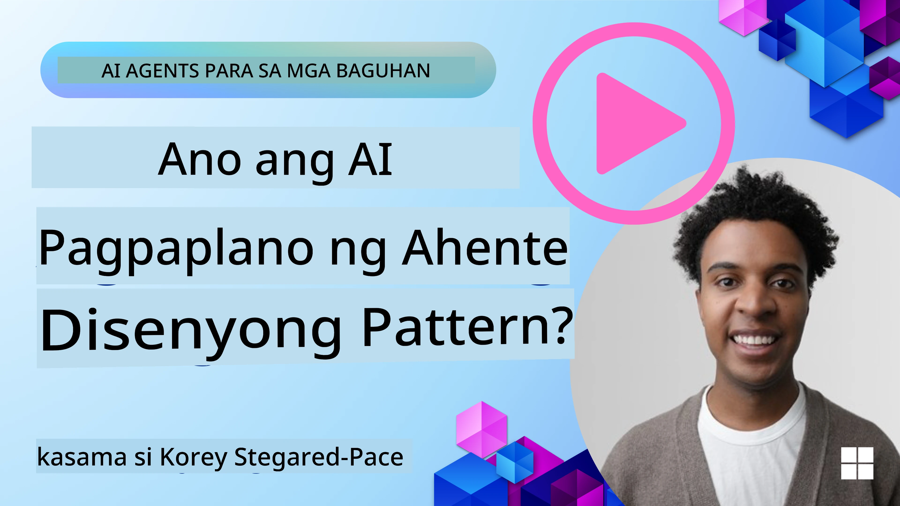
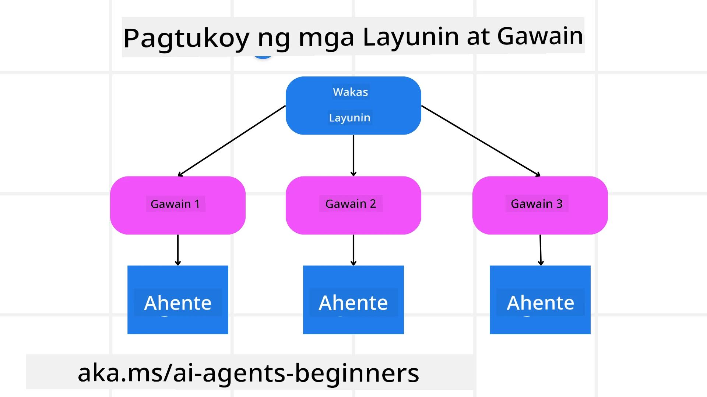

[](https://youtu.be/kPfJ2BrBCMY?si=9pYpPXp0sSbK91Dr)

> _(I-click ang larawan sa itaas para makita ang video ng araling ito)_

# Planning Design

## Panimula

Tatalakayin sa araling ito ang

* Pagbibigay ng malinaw na pangkalahatang layunin at paghahati ng isang komplikadong gawain sa mga mas madaling pamahalaang gawain.
* Paggamit ng istrukturadong output para sa mas maaasahan at madaling mabasa ng makina na mga sagot.
* Paglalapat ng event-driven na pamamaraan para sa paghawak ng mga dinamiko na gawain at hindi inaasahang input.

## Mga Layunin sa Pagkatuto

Pagkatapos makumpleto ang araling ito, mauunawaan mo:

* Tukuyin at itakda ang pangkalahatang layunin para sa isang AI agent, tinitiyak na malinaw nitong alam kung ano ang kailangang makamit.
* Hatiin ang isang komplikadong gawain sa mga pamamahalaang subtask at isaayos ang mga ito sa isang lohikal na pagkakasunod-sunod.
* Bigyan ang mga agents ng tamang mga kagamitan (hal. mga search tool o data analytics tool), magpasya kung kailan at paano ito gagamitin, at hawakan ang mga hindi inaasahang sitwasyon na maaaring lumitaw.
* Suriin ang mga kinalabasan ng subtask, sukatin ang performance, at ulitin ang mga aksyon upang mapabuti ang panghuling output.

## Pagbibigay Kahulugan sa Pangkalahatang Layunin at Paghahati ng Gawain



Karamihan sa mga gawain sa totoong buhay ay masyadong komplikado upang harapin sa isang hakbang lamang. Kailangan ng AI agent ng isang maikling layunin upang gabayan ang kanyang pagpaplano at mga aksyon. Halimbawa, isaalang-alang ang layunin:

    "Gumawa ng 3-araw na plano sa paglalakbay."

Bagaman simple itong sabihin, kailangan pa rin itong dagdagan. Kapag mas malinaw ang layunin, mas makakapag-focus ang agent (at ang kahit sinong katrabaho) sa pagkamit ng tamang resulta, tulad ng paggawa ng isang kumpletong itineraryo na may mga opsyon sa flight, rekomendasyon sa hotel, at mungkahi sa mga gawain.

### Paghahati ng Gawain

Nagiging mas madaling pamahalaan ang malalaki o masalimuot na gawain kapag hinati ito sa mas maliliit at fokusadong mga subtask.
Para sa halimbawa ng plano sa paglalakbay, maaari mong hatiin ang layunin sa:

* Pagbu-book ng Flight
* Pagbu-book ng Hotel
* Pag-upa ng Sasakyan
* Personalization

Ang bawat subtask ay maaaring asikasuhin ng mga dedikadong agent o proseso. Maaaring mag-specialize ang isang agent sa paghahanap ng pinakamahusay na flight deal, ang isa naman ay sa pagbu-book ng hotel, atbp. Ang isang coordinating o "downstream" na agent ay maaaring pag-isahin ang mga resulta upang makagawa ng isang buo at magkakaugnay na itineraryo para sa end user.

Pinahihintulutan din ng modular na pamamaraan na ito ang mga paunti-unting pagpapahusay. Halimbawa, maaari kang magdagdag ng mga espesyal na agent para sa Mga Rekomendasyon sa Pagkain o Mga Mungkahi ng Lokal na Gawain at pinuhin ang itineraryo sa paglipas ng panahon.

### Istrukturadong output

Maaaring gumawa ang Large Language Models (LLMs) ng istrukturadong output (hal. JSON) na mas madaling iproseso at basahin ng mga downstream agent o serbisyo. Lalo itong kapaki-pakinabang sa konteksto ng multi-agent, kung saan maaari nating isagawa ang mga gawain pagkatapos matanggap ang output ng pagpaplano.

Ipinapakita ng sumusunod na Python snippet ang isang simpleng planning agent na naghahati ng layunin sa mga subtask at gumagawa ng isang istrukturadong plano:

```python
from pydantic import BaseModel
from enum import Enum
from typing import List, Optional, Union
import json
import os
from typing import Optional
from pprint import pprint
from agent_framework.foundry import FoundryChatClient
from azure.identity import AzureCliCredential

class AgentEnum(str, Enum):
    FlightBooking = "flight_booking"
    HotelBooking = "hotel_booking"
    CarRental = "car_rental"
    ActivitiesBooking = "activities_booking"
    DestinationInfo = "destination_info"
    DefaultAgent = "default_agent"
    GroupChatManager = "group_chat_manager"

# Modelo ng SubTask ng Paglalakbay
class TravelSubTask(BaseModel):
    task_details: str
    assigned_agent: AgentEnum  # nais naming italaga ang gawain sa ahente

class TravelPlan(BaseModel):
    main_task: str
    subtasks: List[TravelSubTask]
    is_greeting: bool

provider = FoundryChatClient(
    project_endpoint=os.environ["AZURE_AI_PROJECT_ENDPOINT"],
    model=os.environ["AZURE_AI_MODEL_DEPLOYMENT_NAME"],
    credential=AzureCliCredential(),
)

# Tukuyin ang mensahe ng gumagamit
system_prompt = """You are a planner agent.
    Your job is to decide which agents to run based on the user's request.
    Provide your response in JSON format with the following structure:
{'main_task': 'Plan a family trip from Singapore to Melbourne.',
 'subtasks': [{'assigned_agent': 'flight_booking',
               'task_details': 'Book round-trip flights from Singapore to '
                               'Melbourne.'}
    Below are the available agents specialised in different tasks:
    - FlightBooking: For booking flights and providing flight information
    - HotelBooking: For booking hotels and providing hotel information
    - CarRental: For booking cars and providing car rental information
    - ActivitiesBooking: For booking activities and providing activity information
    - DestinationInfo: For providing information about destinations
    - DefaultAgent: For handling general requests"""

user_message = "Create a travel plan for a family of 2 kids from Singapore to Melbourne"

response = client.create_response(input=user_message, instructions=system_prompt)

response_content = response.output_text
pprint(json.loads(response_content))
```

### Planning Agent na may Multi-Agent Orchestration

Sa halimbawa na ito, tumatanggap ang isang Semantic Router Agent ng kahilingan mula sa user (hal., "Kailangan ko ng plano sa hotel para sa aking biyahe.").

Ang planner ay pagkatapos:

* Tumatanggap ng Plano sa Hotel: Kinukuha ng planner ang mensahe ng user at, batay sa isang system prompt (kasama ang mga detalye ng magagamit na agent), lumilikha ng istrukturadong plano sa paglalakbay.
* Nagsasabi ng mga Agent at Kanilang Mga Kasangkapan: Nasa rehistro ng agent ang listahan ng mga agent (hal. para sa flight, hotel, pag-upa ng sasakyan, at mga gawain) kasama ang mga function o tool na kanilang inaalok.
* Ipinapasa ang Plano sa Mga Karampatang Agent: Depende sa bilang ng mga subtask, ipinapadala ng planner ang mensahe nang direkta sa isang dedikadong agent (para sa mga single-task scenario) o kinokoordina ito sa pamamagitan ng isang group chat manager para sa kolaborasyon ng multi-agent.
* Nagbubuod ng Kinalabasan: Sa huli, inuulat ng planner ang nilikhang plano para sa kalinawan.
Ipinapakita ng sumusunod na Python code sample ang mga hakbang na ito:

```python

from pydantic import BaseModel

from enum import Enum
from typing import List, Optional, Union

class AgentEnum(str, Enum):
    FlightBooking = "flight_booking"
    HotelBooking = "hotel_booking"
    CarRental = "car_rental"
    ActivitiesBooking = "activities_booking"
    DestinationInfo = "destination_info"
    DefaultAgent = "default_agent"
    GroupChatManager = "group_chat_manager"

# Modelong Travel SubTask

class TravelSubTask(BaseModel):
    task_details: str
    assigned_agent: AgentEnum # nais naming i-assign ang gawain sa ahente

class TravelPlan(BaseModel):
    main_task: str
    subtasks: List[TravelSubTask]
    is_greeting: bool
import json
import os
from typing import Optional

from agent_framework.foundry import FoundryChatClient
from azure.identity import AzureCliCredential

# Gumawa ng kliyente

provider = FoundryChatClient(
    project_endpoint=os.environ["AZURE_AI_PROJECT_ENDPOINT"],
    model=os.environ["AZURE_AI_MODEL_DEPLOYMENT_NAME"],
    credential=AzureCliCredential(),
)

from pprint import pprint

# Tukuyin ang mensahe ng user

system_prompt = """You are a planner agent.
    Your job is to decide which agents to run based on the user's request.
    Below are the available agents specialized in different tasks:
    - FlightBooking: For booking flights and providing flight information
    - HotelBooking: For booking hotels and providing hotel information
    - CarRental: For booking cars and providing car rental information
    - ActivitiesBooking: For booking activities and providing activity information
    - DestinationInfo: For providing information about destinations
    - DefaultAgent: For handling general requests"""

user_message = "Create a travel plan for a family of 2 kids from Singapore to Melbourne"

response = client.create_response(input=user_message, instructions=system_prompt)

response_content = response.output_text

# I-print ang nilalaman ng tugon pagkatapos itong i-load bilang JSON

pprint(json.loads(response_content))
```

Ang sumusunod ay ang output mula sa naunang code at maaari mong gamitin ang istrukturadong output na ito upang ipasa sa `assigned_agent` at ibuod ang plano sa paglalakbay para sa end user.

```json
{
    "is_greeting": "False",
    "main_task": "Plan a family trip from Singapore to Melbourne.",
    "subtasks": [
        {
            "assigned_agent": "flight_booking",
            "task_details": "Book round-trip flights from Singapore to Melbourne."
        },
        {
            "assigned_agent": "hotel_booking",
            "task_details": "Find family-friendly hotels in Melbourne."
        },
        {
            "assigned_agent": "car_rental",
            "task_details": "Arrange a car rental suitable for a family of four in Melbourne."
        },
        {
            "assigned_agent": "activities_booking",
            "task_details": "List family-friendly activities in Melbourne."
        },
        {
            "assigned_agent": "destination_info",
            "task_details": "Provide information about Melbourne as a travel destination."
        }
    ]
}
```

Mayroong halimbawa ng notebook kasama ang naunang code sample na makikita [dito](./code_samples/07-python-agent-framework.ipynb).

### Paulit-ulit na Pagpaplano

Ang ilang mga gawain ay nangangailangan ng palitan ng usapan o muling pagpaplano, kung saan ang kinalabasan ng isang subtask ay nakakaapekto sa susunod. Halimbawa, kung nakakita ang agent ng hindi inaasahang format ng data habang nagbu-book ng flights, maaaring kailanganin nitong baguhin ang kanyang estratehiya bago lumipat sa pagbu-book ng hotel.

Bukod dito, ang feedback mula sa user (hal. isang tao na nagpasiya na mas gusto ang mas maagang flight) ay maaaring mag-trigger ng bahagyang muling plano. Tinitiyak ng dinamiko, paulit-ulit na pamamaraan na ito na ang panghuling solusyon ay umaayon sa mga totoong limitasyon at nagbabagong mga kagustuhan ng user.

hal. sample code

```python
import os
from agent_framework.foundry import FoundryChatClient
from azure.identity import AzureCliCredential
#.. pareho sa naunang code at ipasa ang kasaysayan ng user, kasalukuyang plano

system_prompt = """You are a planner agent to optimize the
    Your job is to decide which agents to run based on the user's request.
    Below are the available agents specialized in different tasks:
    - FlightBooking: For booking flights and providing flight information
    - HotelBooking: For booking hotels and providing hotel information
    - CarRental: For booking cars and providing car rental information
    - ActivitiesBooking: For booking activities and providing activity information
    - DestinationInfo: For providing information about destinations
    - DefaultAgent: For handling general requests"""

user_message = "Create a travel plan for a family of 2 kids from Singapore to Melbourne"

response = client.create_response(
    input=user_message,
    instructions=system_prompt,
    context=f"Previous travel plan - {TravelPlan}",
)
# .. muling magplano at ipadala ang mga gawain sa kani-kanilang mga ahente
```

Para sa mas kompleto at detalyadong pagpaplano, tingnan ang Magnetic One <a href="https://www.microsoft.com/research/articles/magentic-one-a-generalist-multi-agent-system-for-solving-complex-tasks" target="_blank">Blogpost</a> para sa paglutas ng masalimuot na mga gawain.

## Buod

Sa artikulong ito, tiningnan natin ang isang halimbawa kung paano tayo makakagawa ng isang planner na maaaring pumili ng available na mga agent nang dinamiko. Hinahati ng output ng Planner ang mga gawain at nagtatalaga ng mga agent upang ito ay maisakatuparan. Ipinagpapalagay na may access ang mga agent sa mga function/tool na kinakailangan upang gawin ang gawain. Bukod sa mga agent, maaari kang magsama ng ibang pattern tulad ng reflection, summarizer, at round robin chat upang higit pang i-customize.

## Karagdagang Mga Sanggunian

Magnetic One - Isang Generalist na multi-agent system para sa paglutas ng masalimuot na mga gawain na may mga kahanga-hangang resulta sa maraming mahihirap na agentic benchmarks. Sanggunian: <a href="https://www.microsoft.com/research/articles/magentic-one-a-generalist-multi-agent-system-for-solving-complex-tasks" target="_blank">Magnetic One</a>. Sa implementasyong ito, ang orchestrator ay lumilikha ng mga task-specific na plano at nagtatalaga ng mga gawain sa mga available na agent. Bukod sa pagpaplano, gumagamit din ang orchestrator ng tracking mechanism upang subaybayan ang progreso ng gawain at mag-replan kung kinakailangan.

### May Karagdagang Mga Tanong tungkol sa Planning Design Pattern?

Sumali sa [Microsoft Foundry Discord](https://discord.com/invite/ATgtXmAS5D) upang makipagkita sa iba pang mga nag-aaral, dumalo sa office hours, at matugunan ang iyong mga tanong tungkol sa AI Agents.

## Nakaraang Aralin

[Building Trustworthy AI Agents](../06-building-trustworthy-agents/README.md)

## Susunod na Aralin

[Multi-Agent Design Pattern](../08-multi-agent/README.md)

---

<!-- CO-OP TRANSLATOR DISCLAIMER START -->
**Pagtatanggi**:
Ang dokumentong ito ay isinalin gamit ang serbisyo ng AI translation na [Co-op Translator](https://github.com/Azure/co-op-translator). Bagama't nagsusumikap kami para sa katumpakan, pakatandaan na ang awtomatikong pagsasalin ay maaaring maglaman ng mga pagkakamali o hindi pagkakatugma. Ang orihinal na dokumento sa orihinal nitong wika ang dapat ituring na pangunahing sanggunian. Para sa mahahalagang impormasyon, inirerekomenda ang propesyonal na pagsasalin ng tao. Hindi kami mananagot sa anumang maling pagkakaintindi o maling interpretasyon na nagmula sa paggamit ng pagsasaling ito.
<!-- CO-OP TRANSLATOR DISCLAIMER END -->