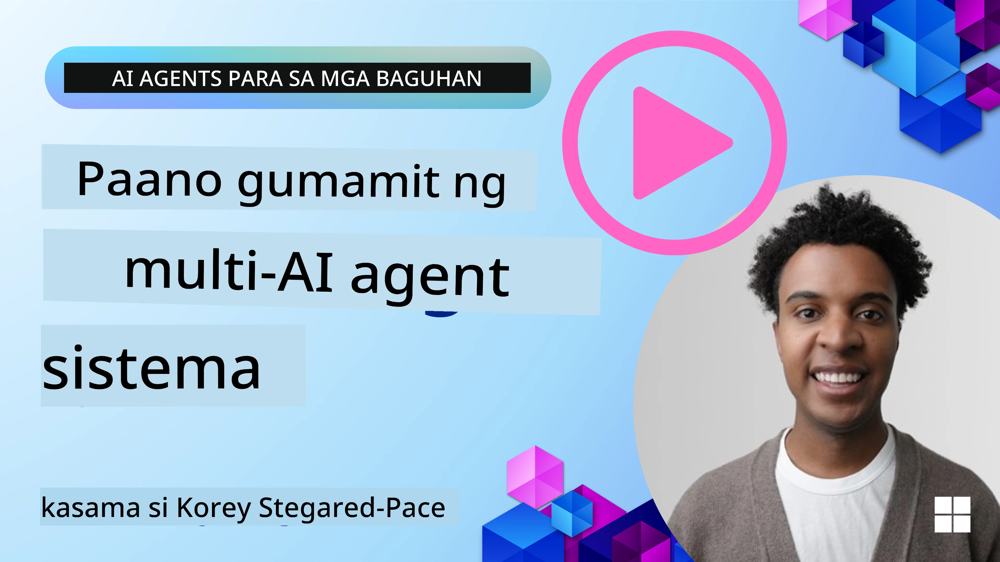
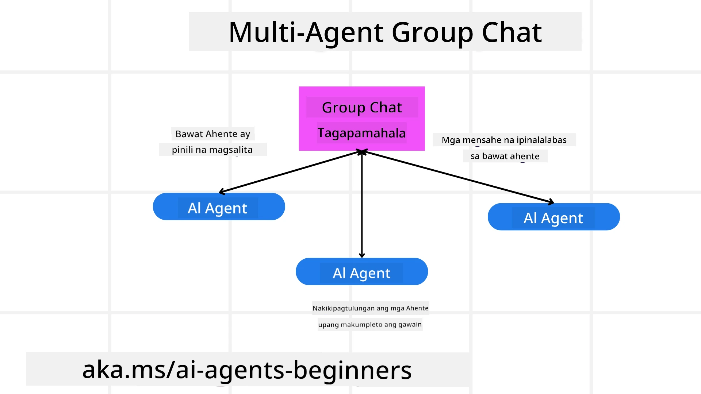
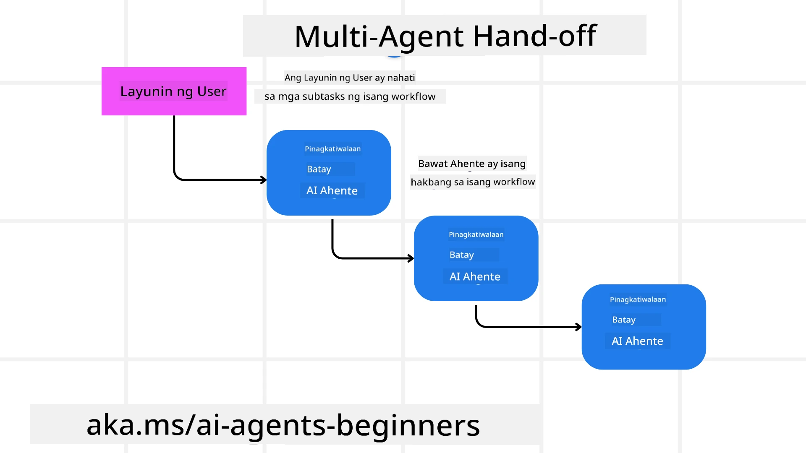
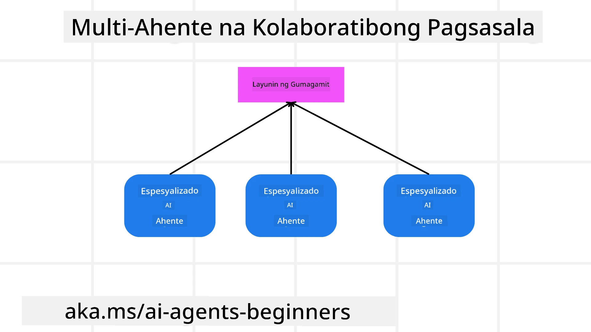

> _(I-click ang larawan sa itaas upang panoorin ang video ng leksyong ito)_

# Mga pattern sa disenyo ng multi-agent

Sa sandaling magsimula kang magtrabaho sa isang proyekto na kinasasangkutan ang maraming agent, kakailanganin mong isaalang-alang ang multi-agent design pattern. Gayunpaman, maaaring hindi agad malinaw kung kailan dapat lumipat sa multi-agent at kung ano ang mga benepisyo nito.

## Panimula

Sa leksyon na ito, sisikapin nating sagutin ang mga sumusunod na tanong:

- Ano ang mga senaryo kung saan ang multi-agent ay naaangkop?
- Ano ang mga kalamangan ng paggamit ng multi-agent kumpara sa isang agent lang na gumagawa ng maraming gawain?
- Ano ang mga pundasyon sa pagpapatupad ng multi-agent design pattern?
- Paano tayo magkakaroon ng pananaw kung paano nagtutulungan ang mga magkakaibang agent?

## Mga Layunin sa Pagkatuto

Pagkatapos ng leksyong ito, dapat kang makapag:

- Matukoy ang mga senaryo kung saan naaangkop ang multi-agent
- Makilala ang mga kalamangan ng paggamit ng multi-agent kumpara sa iisang agent.
- Maunawaan ang mga pundasyon sa pagpapatupad ng multi-agent design pattern.

Ano ang mas malaking larawan?

*Ang mga multi-agent ay isang pattern sa disenyo na nagpapahintulot sa maraming agent na magtulungan upang makamit ang isang pangkaraniwang layunin*.

Ito ay malawakang ginagamit sa iba't ibang larangan, kabilang ang robotics, autonomous systems, at distributed computing.

## Mga Senaryo Kung Saan Naaangkop ang Multi-Agent

Ano nga ba ang mga senaryo na mainam gamitin ang multi-agent? Ang sagot ay maraming sitwasyon na nakikinabang sa paggamit ng maraming agent lalo na sa mga sumusunod na kaso:

- **Malalaking trabaho**: Ang malalaking trabaho ay maaaring hatiin sa maliliit na gawain at ipamahagi sa iba't ibang agent, na nagpapahintulot ng parallel processing at mas mabilis na pagkumpleto. Isang halimbawa nito ay sa isang malaking data processing task.
- **Mga komplikadong gawain**: Tulad ng sa malalaking trabaho, ang mga kumplikadong gawain ay maaaring hatiin sa maliliit na subtasks na ipapamahagi sa iba't ibang agent, na bawat isa ay espesyalista sa isang bahagi ng gawain. Isang magandang halimbawa nito ay sa autonomous vehicles kung saan ang iba't ibang agent ang nagmamaniobra sa navigation, obstacle detection, at komunikasyon sa ibang mga sasakyan.
- **Iba't ibang kasanayan**: Ang iba't ibang agent ay maaaring may iba't ibang kasanayan, na nagpapahintulot sa kanila na pangasiwaan ang iba't ibang bahagi ng gawain nang mas epektibo kaysa sa isang agent lamang. Para sa kasong ito, isang magandang halimbawa ay sa healthcare kung saan ang mga agent ay namamahala sa diagnostics, treatment plans, at patient monitoring.

## Mga Kalamangan ng Paggamit ng Multi-Agent Kaysa Isang Agent Lang

Maaaring gumana nang maayos ang isang systema ng isang agent para sa mga simpleng gawain, ngunit para sa mga mas komplikadong gawain, ang paggamit ng maraming agent ay maaaring magbigay ng ilang kalamangan:

- **Espesyalisasyon**: Ang bawat agent ay maaaring espesyalisado para sa isang partikular na gawain. Ang kakulangan sa espesyalisasyon sa isang agent lang ay nangangahulugan na may agent kang kayang gawin ang lahat ngunit maaaring malito kung ano ang gagawin kapag hinarap ang komplikadong gawain. Halimbawa, maaaring mauwi ito sa paggawa ng isang gawain na hindi nito pinakamagalingang larangan.
- **Scalability**: Madaling mapalawak ang mga systema sa pamamagitan ng pagdaragdag ng mas maraming agent kaysa sa pagbibigay bigat nang sobra sa iisang agent.
- **Fault Tolerance**: Kung may isang agent na mag-fail, maaari pa ring magpatuloy ang iba sa kanilang mga gawain, na nagsisiguro ng pagiging maaasahan ng systema.

Isang halimbawa: mag-book tayo ng biyahe para sa isang user. Ang isang single-agent system ay kailangang humawak sa lahat ng aspeto ng proseso ng pag-book ng biyahe, mula sa paghahanap ng mga flight hanggang sa pag-book ng mga hotel at rental na sasakyan. Para magawa ito gamit ang isang agent lang, kailangang may mga tool ang agent para sa lahat ng ito. Maaari itong magresulta sa isang komplikado at monolithik na systema na mahirap ayusin at palawakin. Sa kabilang banda, ang multi-agent system ay maaaring magkaroon ng iba't ibang agent na espesyalisado sa paghahanap ng mga flight, pag-book ng mga hotel, at pag-book ng rental na sasakyan. Ginagawa nitong mas modular, mas madaling ayusin, at mas scalable ang systema.

Ihambing ito sa isang travel bureau na pinamamahalaan ng isang maliit na tindahan kontra isang travel bureau na isang prangkisa. Ang maliit na tindahan ay magkakaroon ng isang agent na humahawak sa lahat ng aspeto ng proseso ng pag-book ng biyahe, habang ang prangkisa naman ay magkakaroon ng iba't ibang agent na humahawak sa iba't ibang aspeto ng proseso.

## Mga Pundasyon sa Pagpapatupad ng Multi-Agent Design Pattern

Bago mo maipatupad ang multi-agent design pattern, kailangan mong maunawaan ang mga pundasyon na bumubuo sa pattern.

Gawing mas kongkreto ito sa muling pagtingin sa halimbawa ng pag-book ng biyahe para sa isang user. Sa kasong ito, kabilang sa mga pundasyon ang:

- **Komunikasyon ng Agent**: Ang mga agent na naghahanap ng flight, nagbu-book ng hotel, at mga rental na sasakyan ay kailangang mag-komunikasyon at magbahagi ng impormasyon tungkol sa mga kagustuhan at limitasyon ng user. Kailangang magpasya ka sa mga protocol at paraan para sa komunikasyong ito. Kahulugan nito, kailangang makipag-ugnayan ang agent ng flight sa agent ng hotel upang matiyak na naka-book ang hotel sa parehong mga petsa ng flight. Nangangahulugan ito na kailangang magbahagi ang mga agent ng impormasyon tungkol sa mga petsa ng paglalakbay ng user, ibig sabihin kailangang magpasya ka *kung aling mga agent ang nagbabahagi ng impormasyon at paano nila ito ginagawa*.
- **Mga Mekanismo ng Koordinasyon**: Kailangang mag-coordinate ang mga agent sa kanilang mga aksyon upang matiyak na natutupad ang mga kagustuhan at limitasyon ng user. Halimbawa, pwedeng gustuhin ng user na malapit ang hotel sa airport habang ang isang limitasyon naman ay ang mga rental na sasakyan ay available lang sa airport. Nangangahulugan ito na kailangang mag-coordinate ang agent ng hotel sa agent ng rental car upang matiyak na natutupad ang mga ito. Ibig sabihin ay kailangan mong magpasya *kung paano nagkokoordinate ang mga agent sa kanilang mga aksyon*.
- **Arkitektura ng Agent**: Kailangang mayroon ang mga agent ng panloob na istruktura upang magsagawa ng desisyon at matuto mula sa kanilang interaksyon sa user. Halimbawa, ang agent ng paghahanap ng flight ay kailangang magkaroon ng istruktura na makakagawa ng desisyon kung aling mga flight ang irekomenda sa user. Nangangahulugan ito na kailangang magpasya ka *kung paano gumagawa ng desisyon at natututo ang mga agent mula sa kanilang interaksyon sa user*. Halimbawa kung paano natututo ang agent ay maaaring gumamit ito ng machine learning model para magrekomenda ng mga flight batay sa nakaraang kagustuhan ng user.
- **Pananaw sa Mga Interaksyon ng Multi-Agent**: Kailangan mong magkaroon ng pananaw kung paano nagtutulungan ang mga maraming agent. Nangangahulugan ito na kailangan mong magkaroon ng mga kasangkapan at teknik para ma-track ang mga gawain at interaksyon ng agent. Maaari itong anyo ng mga logging at monitoring tool, mga kasangkapang magpapakita ng biswal, at mga sukatan ng performance.
- **Mga Pattern ng Multi-Agent**: May iba't ibang pattern para sa pagpapatupad ng multi-agent system, tulad ng centralized, decentralized, at hybrid na arkitektura. Kailangan mong magpasya kung alin ang pinakanaaangkop sa iyong gamit.
- **Human in the loop**: Sa karamihan ng kaso, magkakaroon ka ng tao sa loop at kailangan mong turuan ang mga agent kung kailan hihingi ng interbensyon mula sa tao. Maaari itong anyo ng user na humihiling ng partikular na hotel o flight na hindi pa nirekomenda ng mga agent o humihingi ng kumpirmasyon bago mag-book ng flight o hotel.

## Pananaw sa Mga Interaksyon ng Multi-Agent

Mahalaga na magkaroon ka ng pananaw kung paano nagtutulungan ang maraming agent. Ang pananaw na ito ay mahalaga para sa pag-debug, pag-optimize, at pagtiyak ng kabuuang epektibidad ng systema. Para maisakatuparan ito, kailangan mong magkaroon ng mga kasangkapan at teknik sa pagsubaybay ng gawain at interaksyon ng mga agent. Maaaring ito ay anyo ng mga logging at monitoring tool, mga kasangkapang pampag-visualize, at mga sukatan ng performance.

Halimbawa, sa kaso ng pag-book ng biyahe para sa isang user, maaari kang magkaroon ng isang dashboard na nagpapakita ng status ng bawat agent, mga kagustuhan at limitasyon ng user, at ang interaksyon sa pagitan ng mga agent. Maaaring ipakita sa dashboard ang mga petsa ng paglalakbay ng user, ang mga flight na nirekomenda ng flight agent, ang mga hotel na nirekomenda ng hotel agent, at ang mga rental car na nirekomenda ng rental car agent. Magbibigay ito ng malinaw na pananaw kung paano nagtutulungan ang mga agent at kung natutugunan ba ang mga kagustuhan at limitasyon ng user.

Tingnan natin ang bawat isa sa mga aspetong ito nang mas detalyado.

- **Logging at Monitoring Tools**: Gusto mong magkaroon ng logging para sa bawat aksyon na ginawa ng agent. Ang log entry ay maaaring mag-imbak ng impormasyon tungkol sa agent na gumawa ng aksyon, ang aksyong ginawa, ang oras kung kailan ginawa ito, at ang resulta ng aksyon. Ang impormasyong ito ay maaaring gamitin para sa pag-debug, pag-optimize, at iba pa.

- **Visualization Tools**: Makakatulong ang mga visualization tool upang makita mo ang interaksyon ng mga agent sa mas intuitibong paraan. Halimbawa, maaari kang magkaroon ng graph na nagpapakita ng daloy ng impormasyon sa pagitan ng mga agent. Nakakatulong ito para makita ang mga bottleneck, inefficiencies, at iba pang isyu sa systema.

- **Mga Sukatan ng Performance**: Makakatulong ang mga sukatan ng performance para subaybayan ang epektibidad ng multi-agent system. Halimbawa, maaari mong subaybayan ang oras na ginugol upang matapos ang isang gawain, ang bilang ng mga gawain na natapos sa isang takdang panahon, at ang katumpakan ng mga rekomendasyon ng mga agent. Makakatulong ang impormasyong ito upang matukoy ang mga bahaging kailangang pagbutihin at i-optimize ang systema.

## Mga Pattern ng Multi-Agent

Tuklasin natin ang ilang kongkretong pattern na maaaring gamitin para gumawa ng multi-agent apps. Narito ang ilang mga kawili-wiling pattern na dapat isaalang-alang:

### Group chat

Ang pattern na ito ay kapaki-pakinabang kung nais mong gumawa ng group chat application kung saan maraming agent ang maaaring mag-komunikasyon sa isa't isa. Karaniwang paggamit nito ay para sa team collaboration, customer support, at social networking.

Sa pattern na ito, bawat agent ay kumakatawan sa isang user sa group chat, at ang mga mensahe ay ipinagpapalitan gamit ang messaging protocol. Maaaring magpadala ang mga agent ng mensahe sa group chat, makatanggap ng mga mensahe mula sa group chat, at tumugon sa mga mensahe mula sa ibang mga agent.

Ito ay maaaring ipatupad gamit ang centralized na arkitektura kung saan lahat ng mensahe ay dumadaan sa isang central server, o decentralized na arkitektura kung saan direkta nagkakapalitan ng mga mensahe ang mga agent.

### Hand-off

Ang pattern na ito ay kapaki-pakinabang kung nais mong lumikha ng isang application kung saan ang maraming agent ay maaaring mag-handoff ng mga gawain sa bawat isa.

Karaniwang paggamit nito ay customer support, task management, at workflow automation.

Sa pattern na ito, bawat agent ay kumakatawan sa isang gawain o hakbang sa workflow, at maaaring mag-handoff ang mga agent ng mga gawain sa ibang mga agent base sa mga nakatakdang alituntunin.

### Collaborative filtering

Ang pattern na ito ay kapaki-pakinabang kung nais mong gumawa ng application kung saan maraming agent ang maaaring magtulungan para gumawa ng mga rekomendasyon sa mga user.

Bakit mo gustong magkaroon ng maraming agent na nagtutulungan? Dahil bawat agent ay maaaring may iba't ibang kasanayan at maaaring mag-ambag sa proseso ng rekomendasyon sa iba't ibang paraan.

Halimbawa, nais ng isang user na makakuha ng rekomendasyon sa pinakamagandang stock na bibilhin sa stock market.

- **Eksperto sa industriya**: Isang agent ay maaaring eksperto sa isang partikular na industriya.
- **Technical analysis**: Isa pang agent ay maaaring eksperto sa technical analysis.
- **Fundamental analysis**: At isang agent pa ay maaaring eksperto sa fundamental analysis. Sa pamamagitan ng pagtutulungan, maaaring magbigay ang mga agent ng mas kumpletong rekomendasyon sa user.

## Senaryo: Proseso ng Refund

Isaalang-alang ang isang senaryo kung saan ang isang customer ay nais kumuha ng refund para sa isang produkto, maaaring maraming agent ang kasangkot sa prosesong ito ngunit hatiin natin ito sa mga agent na partikular para sa prosesong ito at mga pangkalahatang agent na maaaring magamit sa ibang proseso.

**Mga agent na partikular para sa proseso ng refund**:

Narito ang ilang mga agent na maaaring kasangkot sa proseso ng refund:

- **Customer agent**: Ang agent na ito ay kumakatawan sa customer at responsable sa pagsisimula ng proseso ng refund.
- **Seller agent**: Ang agent na ito ay kumakatawan sa seller at responsable sa pagproseso ng refund.
- **Payment agent**: Ang agent na ito ay kumakatawan sa proseso ng payment at responsable sa pag-refund ng bayad ng customer.
- **Resolution agent**: Ang agent na ito ay kumakatawan sa proseso ng resolusyon at responsable sa paglutas sa anumang isyu na lumitaw sa proseso ng refund.
- **Compliance agent**: Ang agent na ito ay kumakatawan sa proseso ng pagsunod at responsable sa pagtiyak na sumusunod ang proseso ng refund sa mga regulasyon at polisiya.

**Mga pangkalahatang agent**:

Ang mga agent na ito ay maaaring gamitin sa ibang bahagi ng iyong negosyo.

- **Shipping agent**: Ang agent na ito ay kumakatawan sa proseso ng pagpapadala at responsable sa pagpapadala ng produkto pabalik sa seller. Ang agent na ito ay maaaring gamitin para sa parehong proseso ng refund at para sa pangkalahatang pagpapadala ng produkto sa pamamagitan ng pagbili halimbawa.
- **Feedback agent**: Ang agent na ito ay kumakatawan sa proseso ng pagtanggap ng feedback at responsable sa pangangalap ng puna mula sa customer. Puwedeng mangyari ang feedback anumang oras at hindi lang sa panahon ng refund process.
- **Escalation agent**: Ang agent na ito ay kumakatawan sa proseso ng pagsasa-eskala at responsable sa pagsasa-eskala ng mga isyu sa mas mataas na antas ng suporta. Maaaring gamitin ang ganitong klase ng agent sa anumang proseso kung saan kailangan mong isa-eskala ang isyu.
- **Notification agent**: Ang agent na ito ay kumakatawan sa proseso ng pagpapadala ng notipikasyon at responsable sa pagpapadala ng paalala sa customer sa iba't ibang yugto ng refund process.
- **Analytics agent**: Ang agent na ito ay kumakatawan sa proseso ng pagsusuri ng data at responsable sa pag-aanalisa ng datos na may kaugnayan sa refund process.
- **Audit agent**: Ang agent na ito ay kumakatawan sa proseso ng audit at responsable sa pag-audit ng refund process upang matiyak na ito ay naisagawa nang tama.
- **Reporting agent**: Ang agent na ito ay kumakatawan sa proseso ng paggawa ng ulat at responsable sa pagbuo ng mga report tungkol sa refund process.
- **Knowledge agent**: Ang agent na ito ay kumakatawan sa proseso ng kaalaman at responsable sa pagpapanatili ng knowledge base ng impormasyon na may kaugnayan sa refund process. Maaaring may kaalaman siya sa refunds at ibang bahagi ng iyong negosyo.
- **Security agent**: Ang agent na ito ay kumakatawan sa proseso ng seguridad at responsable sa pagtiyak sa kaligtasan ng refund process.
- **Quality agent**: Ang agent na ito ay kumakatawan sa proseso ng kalidad at responsable sa pagtiyak ng kalidad ng refund process.

Maraming mga agent ang nakalista sa itaas, para sa partikular na proseso ng refund pati na rin para sa pangkalahatang mga agent na maaaring gamitin sa ibang bahagi ng iyong negosyo. Sana ay nagbigay ito sa iyo ng ideya kung paano ka makakapagdesisyon kung aling mga agent ang gagamitin sa iyong multi-agent system.

## Takdang-Aralin

Magdisenyo ng multi-agent system para sa proseso ng customer support. Tukuyin ang mga agent na kasangkot sa proseso, ang kanilang mga tungkulin at responsibilidad, at kung paano sila nag-iinteract. Isaalang-alang ang parehong mga agent na partikular sa customer support process at mga pangkalahatang agent na maaaring gamitin sa ibang bahagi ng iyong negosyo.
> Mag-isip muna bago basahin ang sumusunod na solusyon, maaaring kailanganin mo ng mas maraming ahente kaysa sa inaakala mo.

> TIP: Isipin ang iba't ibang yugto ng proseso ng customer support at isaalang-alang din ang mga ahente na kailangan para sa anumang sistema.

## Solusyon

[Solusyon](./solution/solution.md)

## Pagsusuri ng Kaalaman

Tanong: Kailan mo dapat isaalang-alang ang paggamit ng multi-agents?

- [ ] A1: Kapag maliit ang iyong trabaho at simple ang gawain.
- [ ] A2: Kapag malaki ang iyong trabaho
- [ ] A3: Kapag simple ang gawain.

[Solusyon na pagsusulit](./solution/solution-quiz.md)

## Buod

Sa araling ito, tinalakay natin ang multi-agent design pattern, kabilang ang mga senaryong maaaring gamitin ang multi-agents, mga benepisyo ng paggamit ng multi-agents kumpara sa isang solong ahente, mga bahagi ng pagpapatupad ng multi-agent design pattern, at kung paano magkaroon ng pananaw kung paano nakikipag-ugnayan ang maraming ahente sa isa't isa.

### Mayroon ka pa bang mga tanong tungkol sa Multi-Agent Design Pattern?

Sumali sa [Microsoft Foundry Discord](https://aka.ms/ai-agents/discord) upang makipagkita sa ibang mga nag-aaral, dumalo sa office hours, at masagot ang iyong mga tanong tungkol sa AI Agents.

## Karagdagang mga mapagkukunan

- <a href="https://learn.microsoft.com/azure/ai-services/agents/overview" target="_blank">Dokumentasyon ng Microsoft Agent Framework</a>
- <a href="https://www.analyticsvidhya.com/blog/2024/10/agentic-design-patterns/" target="_blank">Mga agentic design pattern</a>

## Nakaraang Aralin

[Planning Design](../07-planning-design/README.md)

## Susunod na Aralin

[Metacognition in AI Agents](../09-metacognition/README.md)

---

<!-- CO-OP TRANSLATOR DISCLAIMER START -->
**Pahayag ng Paunang Salita**:
Ang dokumentong ito ay isinalin gamit ang AI translation service na [Co-op Translator](https://github.com/Azure/co-op-translator). Bagamat pinagsisikapan naming maging tumpak, mangyaring tandaan na ang mga awtomatikong pagsasalin ay maaaring magkaroon ng mga pagkakamali o kamalian. Ang orihinal na dokumento sa orihinal nitong wika ang dapat ituring na pangunahing sanggunian. Para sa mahahalagang impormasyon, inirerekomenda ang propesyonal na pagsasalin ng tao. Hindi kami mananagot sa anumang hindi pagkakaunawaan o maling interpretasyon na maaaring bunga ng paggamit ng pagsasaling ito.
<!-- CO-OP TRANSLATOR DISCLAIMER END -->