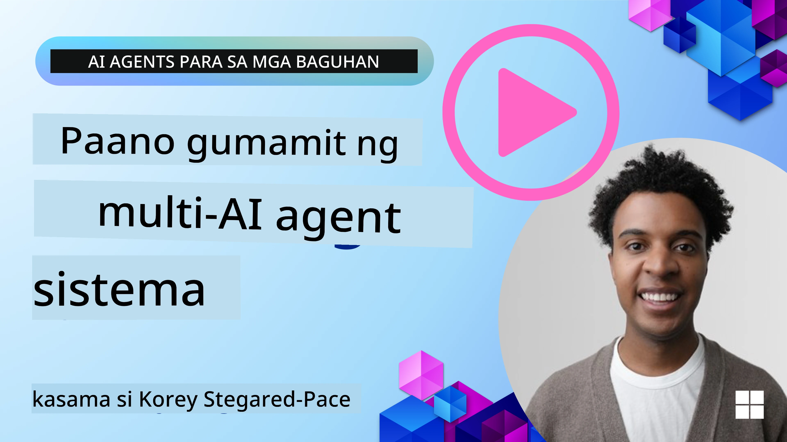
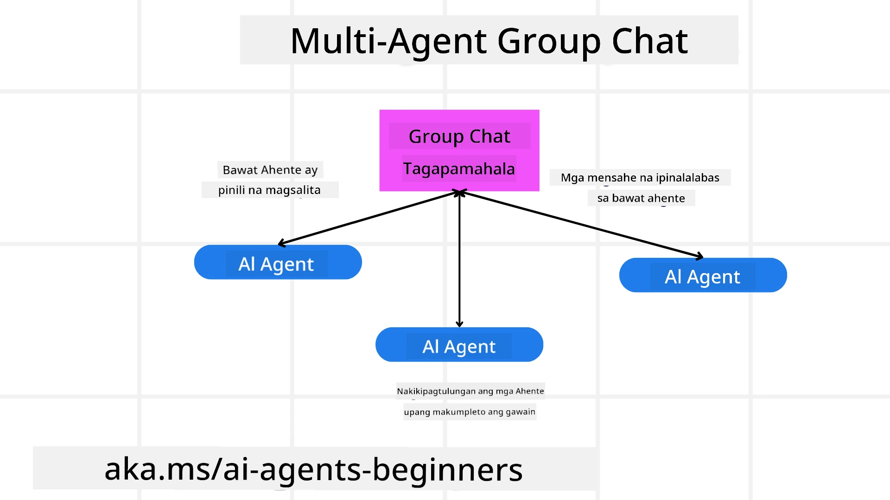
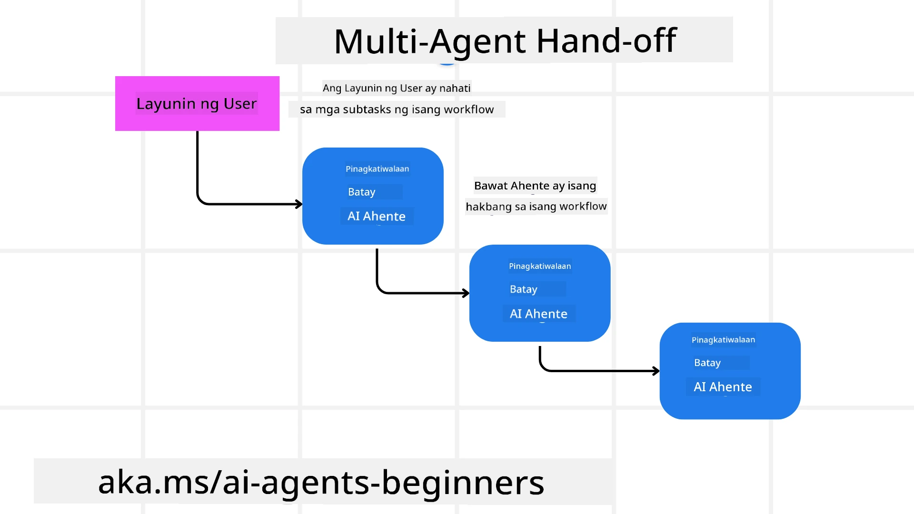
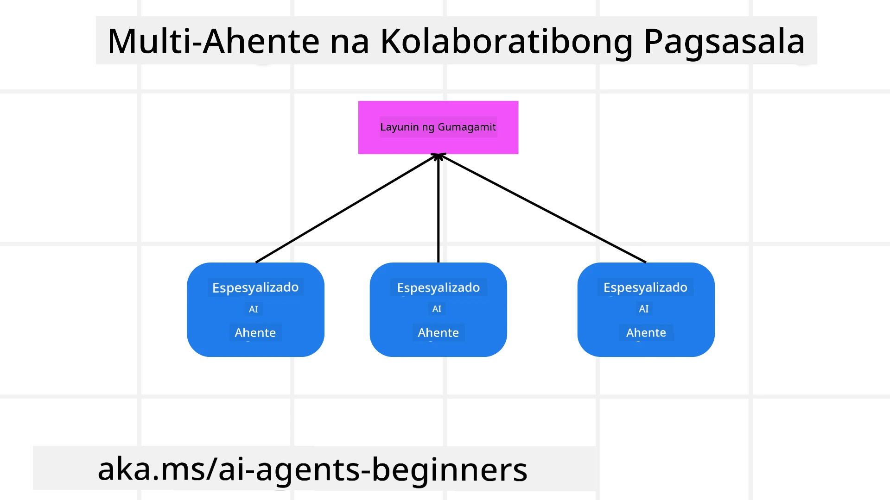

> _(I-click ang larawan sa itaas upang panoorin ang video ng araling ito)_

# Mga pattern ng disenyo ng multi-agent

Sa sandaling magsimula kang magtrabaho sa isang proyekto na kinasasangkutan ng maraming ahente, kakailanganin mong isaalang-alang ang multi-agent design pattern. Gayunpaman, maaaring hindi agad malinaw kung kailan lilipat sa multi-agents at kung ano ang mga kalamangan nito.

## Panimula

Sa araling ito, titingnan natin ang mga sumusunod na tanong:

- Ano ang mga senaryo kung saan naaangkop ang paggamit ng multi-agents?
- Ano ang mga kalamangan ng paggamit ng multi-agents kumpara sa isang singular na ahente na gumagawa ng maraming gawain?
- Ano ang mga pundasyong bahagi ng pagpapatupad ng multi-agent design pattern?
- Paano tayo magkakaroon ng kakayahang makita kung paano nagkakatawan ang mga ahente sa isa’t isa?

## Mga Layunin sa Pagkatuto

Pagkatapos ng araling ito, dapat mong magawa ang mga sumusunod:

- Tukuyin ang mga senaryong naaangkop ang paggamit ng multi-agents
- Kilalanin ang mga kalamangan ng paggamit ng multi-agents kumpara sa isa lamang na ahente.
- Unawain ang mga pundasyong bahagi sa pagpapatupad ng multi-agent design pattern.

Ano ang mas malawak na larawan?

*Ang multi-agents ay isang pattern ng disenyo na nagpapahintulot sa maraming ahente na magtulungan upang makamit ang isang pangkaraniwang layunin*.

Malawak ang gamit ng pattern na ito sa iba't ibang larangan, kabilang ang robotics, autonomous systems, at distributed computing.

## Mga Senaryo Kung Saan Naaangkop ang Multi-Agents

Ano ba ang mga senaryong angkop gamitin ang multi-agents? Maraming senaryo kung saan kapaki-pakinabang ang paggamit ng maraming ahente, lalo na sa mga sumusunod na kaso:

- **Malalaking gawain**: Ang malalaking gawain ay maaaring hatiin sa maliliit na bahagi at italaga sa iba't ibang ahente, na nagpapahintulot ng parallel processing at mas mabilis na pagtapos. Halimbawa nito ang malaking gawain sa pagproseso ng data.
- **Mahirap na mga gawain**: Tulad ng malalaking gawain, ang mahihirap na gawain ay maaaring hatiin sa mga mas maliliit na bahagi at italaga sa mga ahente, na ang bawat isa ay dalubhasa sa isang partikular na aspeto ng gawain. Isang magandang halimbawa nito ay sa mga autonomous vehicles kung saan iba’t ibang ahente ang namamahala sa nabigasyon, pagtukoy ng hadlang, at pakikipag-ugnayan sa iba pang sasakyan.
- **Iba’t ibang ekspertis**: Ang mga ahente ay maaaring magkaroon ng iba’t ibang kahusayan, kaya mas mahusay nilang hawakan ang iba't ibang aspeto ng gawain kumpara sa isang solong ahente. Sa kasong ito, magandang halimbawa ang healthcare kung saan ang mga ahente ay maaaring mamahala sa diagnostics, mga plano sa paggamot, at pagmamanman ng pasyente.

## Mga Kalamangan ng Paggamit ng Multi-Agents Kumpara sa Isang Ahente

Maaaring gumana nang maayos ang isang solong ahente para sa mga simpleng gawain, ngunit para sa mas kumplikadong mga gawain, ang paggamit ng maraming ahente ay maaaring magbigay ng ilang benepisyo:

- **Espesyalisasyon**: Ang bawat ahente ay maaaring dalubhasa sa isang partikular na gawain. Ang kawalan ng espesyalisasyon sa isang ahente ay nangangahulugan na mayroon kang ahente na kayang gawin ang lahat ngunit maaaring malito sa kung ano ang gagawin kapag naharap sa kumplikadong gawain. Halimbawa, maaari itong magtapos sa paggawa ng gawain na hindi siya ang pinaka-angkop para dito.
- **Scalability**: Mas madali ang pagpapalawak ng mga sistema sa pamamagitan ng pagdagdag ng higit pang mga ahente kaysa pasanin ang isang ahente lamang.
- **Fault Tolerance**: Kung may isang ahente na mabigo, ang iba ay maaaring magpatuloy sa paggana, na nagsisiguro ng pagiging maaasahan ng sistema.

Halimbawa, mag-book tayo ng trip para sa isang user. Kailangan ng isang single agent system na hawakan lahat ng aspeto ng proseso ng pag-book ng trip, mula sa paghahanap ng flights hanggang sa pag-book ng mga hotel at renta ng mga sasakyan. Para makamit ito gamit ang isang ahente, kailangan nitong magkaroon ng mga kagamitan para gawin ang lahat ng mga ito. Maaaring magresulta ito sa isang kumplikado at monolitikong sistema na mahirap panatilihin at i-scale. Sa kabilang banda, ang multi-agent system ay maaaring magkaroon ng iba't ibang mga ahente na dalubhasa sa paghahanap ng flights, pag-book ng hotel, at renta ng sasakyan. Magiging mas modular, mas madaling panatilihin, at scalable ang sistema.

Ihambing ito sa isang travel bureau na pinapatakbo bilang isang mom-and-pop store kumpara sa isang travel bureau na pinapatakbo bilang isang franchise. Ang mom-and-pop store ay may isang ahente na humahawak sa lahat ng aspeto ng proseso ng pag-book ng trip, samantalang ang franchise ay may iba't ibang mga ahente na humahawak ng iba't ibang aspeto ng proseso ng pag-book ng trip.

## Mga Pundasyong Bahagi ng Pagpapatupad ng Multi-Agent Design Pattern

Bago mo maipatupad ang multi-agent design pattern, kailangan mong maunawaan ang mga pundasyong bahagi na bumubuo sa pattern.

Gawin nating mas tiyak ito sa pamamagitan ng muling pagtingin sa halimbawa ng pag-book ng trip para sa isang user. Sa kasong ito, ang mga pundasyong bahagi ay maaaring isama ang mga sumusunod:

- **Komunikasyon ng Ahente**: Ang mga ahente para sa paghahanap ng flights, pag-book ng hotel, at renta ng mga sasakyan ay kailangang makipag-usap at magbahagi ng impormasyon tungkol sa mga gusto at limitasyon ng user. Kailangan mong magdesisyon tungkol sa mga protocol at pamamaraan para sa komunikasyong ito. Nangangahulugan ito nang konkreto na ang ahente para sa paghahanap ng flights ay kailangang makipagkomunika sa ahente para sa pag-book ng hotel upang matiyak na naka-book ang hotel para sa parehong mga petsa ng flight. Ibig sabihin nito, kailangang magbahagi ang mga ahente ng impormasyon tungkol sa mga petsa ng paglalakbay ng user, kaya kailangan mong magdesisyon *kung aling mga ahente ang nagbabahagi ng impormasyon at paano nila ito ibinabahagi*.
- **Mga Mekanismo ng Koordinasyon**: Kailangang mag-coordinate ang mga ahente ng kanilang mga aksyon upang matiyak na natutugunan ang mga gusto at limitasyon ng user. Halimbawa, ang gusto ng user ay isang hotel malapit sa paliparan habang ang limitasyon ay na ang mga renta ng sasakyan ay available lamang sa paliparan. Nangangahulugan ito na kailangang makipag-coordinate ang ahente para sa pag-book ng hotel sa ahente para sa pag-book ng renta ng sasakyan upang matiyak na natutugunan ang mga gusto at limitasyon ng user. Kailangan mong magdesisyon *kung paano nagko-coordinate ang mga ahente ng kanilang mga aksyon*.
- **Arkitektura ng Ahente**: Kailangang may internal na istruktura ang mga ahente upang makagawa ng desisyon at matuto mula sa kanilang interaksiyon sa user. Nangangahulugan ito na ang ahente para sa paghahanap ng flights ay kailangang magkaroon ng internal na istruktura upang makagawa ng mga desisyon tungkol sa kung aling mga flight ang irerekomenda sa user. Kailangan mong magdesisyon *kung paano gumagawa ng mga desisyon at natututo ang mga ahente mula sa kanilang interaksiyon sa user*. Halimbawa kung paano natututo at napapabuti ang isang ahente ay maaaring ang ahente para sa paghahanap ng flights ay gumamit ng machine learning model para irekomenda ang mga flight batay sa mga nakaraang hilig ng user.
- **Kakayahang Makita ang Interaksiyon ng Multi-Agent**: Kailangan mong makita kung paano nagkakaroon ng interaksiyon ang maraming ahente sa isa't isa. Nangangahulugan ito na kailangan mong magkaroon ng mga kagamitan at teknika para subaybayan ang mga gawain at interaksiyon ng mga ahente. Maaari itong anyo ng mga kagamitan sa pag-log at pag-monitor, mga visualization tool, at mga sukatan sa performance.
- **Mga Pattern ng Multi-Agent**: Mayroong iba't ibang pattern sa pagpapatupad ng mga multi-agent system, tulad ng centralized, decentralized, at hybrid na arkitektura. Kailangan mong magdesisyon sa pattern na pinakaangkop sa iyong use case.
- **Human in the loop**: Sa karamihan ng mga kaso, may isang tao sa proseso at kailangan mong ituro sa mga ahente kung kailan humingi ng interbensyon ng tao. Maaari itong anyo ng user na humihiling ng partikular na hotel o flight na hindi inirerekomenda ng mga ahente o humihingi ng kumpirmasyon bago mag-book ng flight o hotel.

## Kakayahang Makita ang Interaksiyon ng Multi-Agent

Mahalaga na mayroon kang kakayahang makita kung paano nagkakainteraksiyon ang maraming ahente sa bawat isa. Ang kakayahang ito ay mahalaga para sa pag-debug, pag-optimize, at pagsigurado ng kabuuang epektibidad ng sistema. Para makamit ito, kailangan mong magkaroon ng mga kagamitan at teknika para subaybayan ang mga gawain ng ahente at mga interaksiyon. Maaari itong anyo ng mga kagamitan sa pag-log at monitoring, mga visualization tool, at mga sukatan sa performance.

Halimbawa, sa kaso ng pag-book ng trip para sa isang user, maaari kang magkaroon ng dashboard na nagpapakita ng status ng bawat ahente, mga gusto at limitasyon ng user, at ang mga interaksiyon ng mga ahente. Ang dashboard na ito ay maaaring magpakita ng mga petsa ng paglalakbay ng user, ang mga flight na inirerekomenda ng flight agent, mga hotel na inirerekomenda ng hotel agent, at mga rentang sasakyan na inirerekomenda ng rental car agent. Magbibigay ito ng malinaw na pananaw kung paano nagkaka-interact ang mga ahente at kung natutugunan ba ang mga gusto at limitasyon ng user.

Tingnan natin nang mas detalyado ang bawat isa sa mga aspetong ito.

- **Mga Tool sa Pag-log at Monitoring**: Nais mong magkaroon ng pag-log para sa bawat aksyon na ginagawa ng isang ahente. Ang isang entry sa log ay maaaring magtago ng impormasyon tungkol sa ahenteng gumawa ng aksyon, ang ginawa, ang oras kung kailan ginawa, at ang resulta ng aksyon. Ang impormasyong ito ay maaaring gamitin para sa pag-debug, pag-optimize at iba pa.

- **Mga Tool sa Visualization**: Ang mga tool sa visualization ay makakatulong makita ang interaksiyon ng mga ahente sa mas intuitive na paraan. Halimbawa, maaari kang magkaroon ng graph na nagpapakita ng daloy ng impormasyon sa pagitan ng mga ahente. Makakatulong ito upang matukoy ang mga bottleneck, inefficiency, at iba pang isyu sa sistema.

- **Mga Sukatan sa Performance**: Makakatulong ang mga sukatan upang masubaybayan ang kahusayan ng multi-agent system. Halimbawa, maaari mong subaybayan ang oras na kinain upang matapos ang isang gawain, ang bilang ng mga natapos na gawain kada yunit ng oras, at ang katumpakan ng mga rekomendasyon na ginawa ng mga ahente. Ang impormasyong ito ay makakatulong matukoy ang mga lugar na kailangang pagbutihin at i-optimize ang sistema.

## Mga Pattern ng Multi-Agent

Tingnan natin ang ilang kongkretong pattern na maaari nating gamitin upang lumikha ng mga multi-agent na app. Narito ang ilang mga interesanteng pattern na dapat isaalang-alang:

### Group chat

Ang pattern na ito ay kapaki-pakinabang kung nais mong lumikha ng isang group chat application kung saan maraming ahente ang maaaring mag-komunikasyon sa isa't isa. Karaniwang gamit nito ang team collaboration, customer support, at social networking.

Sa pattern na ito, bawat ahente ay kumakatawan sa isang user sa group chat, at ang mga mensahe ay ipinagpapalitan sa pagitan ng mga ahente gamit ang messaging protocol. Maaaring magpadala ang mga ahente ng mga mensahe sa group chat, tumanggap ng mga mensahe mula sa group chat, at magsagot ng mga mensahe mula sa ibang mga ahente.

Maaaring ipatupad ang pattern na ito gamit ang centralized architecture kung saan lahat ng mga mensahe ay dadaan sa isang central server, o gamit ang decentralized architecture kung saan ang mga mensahe ay direktang ipinagpapalitan.

### Hand-off

Ang pattern na ito ay kapaki-pakinabang kung nais mong lumikha ng aplikasyon kung saan maraming ahente ang maaaring magpasa-pasa ng gawain sa isa’t isa.

Karaniwang gamit nito ang customer support, task management, at workflow automation.

Sa pattern na ito, bawat ahente ay kumakatawan sa isang gawain o hakbang sa workflow, at maaaring ipasa ng mga ahente ang mga gawain sa iba pang ahente batay sa mga paunang itinakdang alituntunin.

### Collaborative filtering

Ang pattern na ito ay kapaki-pakinabang kung nais mong lumikha ng aplikasyon kung saan maraming ahente ang nagtutulungan para magbigay ng mga rekomendasyon sa mga user.

Bakit gusto mong magkaroon ng maraming ahente na nagtutulungan ay dahil ang bawat ahente ay maaaring may iba't ibang espesyalisasyon at maaaring mag-ambag sa proseso ng rekomendasyon sa iba't ibang paraan.

Halimbawa, nais ng isang user ng rekomendasyon tungkol sa pinakamagandang stock na bibilhin sa stock market.

- **Eksperto sa industriya**: Isang ahente ay maaaring eksperto sa isang partikular na industriya.
- **Technical analysis**: Isa pang ahente ay maaaring eksperto sa technical analysis.
- **Fundamental analysis**: at isa pang ahente ay maaaring eksperto sa fundamental analysis. Sa pagtutulungan, makakapagbigay ang mga ahenteng ito ng mas komprehensibong rekomendasyon sa user.

## Senaryo: Proseso ng refund

Isaalang-alang ang isang senaryo kung saan ang customer ay sumusubok kumuha ng refund para sa isang produkto, maaaring maraming ahente ang kasangkot sa prosesong ito ngunit hatiin natin ito sa mga ahenteng partikular sa prosesong ito at mga pangkalahatang ahente na maaaring gamitin sa ibang proseso.

**Mga ahenteng partikular sa proseso ng refund**:

Narito ang ilang mga ahente na maaaring kasangkot sa proseso ng refund:

- **Customer agent**: Ang ahenteng ito ay kumakatawan sa customer at responsable sa pagsisimula ng proseso ng refund.
- **Seller agent**: Ang ahenteng ito ay kumakatawan sa seller at responsable sa pagproseso ng refund.
- **Payment agent**: Ang ahenteng ito ay kumakatawan sa proseso ng pagbabayad at responsable sa pag-refund sa bayad ng customer.
- **Resolution agent**: Ang ahenteng ito ay kumakatawan sa proseso ng resolusyon at responsable sa paglutas ng anumang problema na lumitaw sa proseso ng refund.
- **Compliance agent**: Ang ahenteng ito ay kumakatawan sa proseso ng pagsunod at responsable sa pagtitiyak na ang proseso ng refund ay sumusunod sa mga regulasyon at polisiya.

**Pangkalahatang mga ahente**:

Ang mga ahenteng ito ay maaaring gamitin sa ibang bahagi ng iyong negosyo.

- **Shipping agent**: Ang ahenteng ito ay kumakatawan sa proseso ng pagpapadala at responsable sa pagpapadala ng produkto pabalik sa seller. Maaaring gamitin ang ahenteng ito para sa parehong proseso ng refund at pangkalahatang pagpapadala ng produkto sa pamamagitan ng pagbili, halimbawa.
- **Feedback agent**: Ang ahenteng ito ay kumakatawan sa proseso ng feedback at responsable sa pagkolekta ng feedback mula sa customer. Maaaring kunin ang feedback anumang oras, hindi lamang sa panahon ng refund process.
- **Escalation agent**: Ang ahenteng ito ay kumakatawan sa proseso ng escalation at responsable sa pag-escalate ng mga isyu sa mas mataas na antas ng suporta. Maaari mong gamitin ang ganitong uri ng ahente para sa anumang proseso kung saan kailangan mong i-escalate ang isang isyu.
- **Notification agent**: Ang ahenteng ito ay kumakatawan sa proseso ng pagpapadala ng mga notipikasyon at responsable sa pagpapadala ng mga notipikasyon sa customer sa iba't ibang yugto ng proseso ng refund.
- **Analytics agent**: Ang ahenteng ito ay kumakatawan sa proseso ng analytics at responsable sa pagsusuri ng data na may kaugnayan sa proseso ng refund.
- **Audit agent**: Ang ahenteng ito ay kumakatawan sa proseso ng audit at responsable sa pag-audit ng proseso ng refund upang matiyak na ito ay isinagawa nang tama.
- **Reporting agent**: Ang ahenteng ito ay kumakatawan sa proseso ng pag-uulat at responsable sa paggawa ng mga ulat tungkol sa proseso ng refund.
- **Knowledge agent**: Ang ahenteng ito ay kumakatawan sa proseso ng kaalaman at responsable sa pagpapanatili ng knowledge base ng impormasyon na may kaugnayan sa proseso ng refund. Maaring maging mahusay ito sa parehong refund at iba pang bahagi ng iyong negosyo.
- **Security agent**: Ang ahenteng ito ay kumakatawan sa proseso ng seguridad at responsable sa pagtitiyak ng seguridad ng proseso ng refund.
- **Quality agent**: Ang ahenteng ito ay kumakatawan sa proseso ng kalidad at responsable sa pagtitiyak ng kalidad ng proseso ng refund.

Mayroong maraming mga ahenteng nakalista nang mas nauna, pareho para sa partikular na proseso ng refund ngunit pati na rin sa mga pangkalahatang ahente na maaaring gamitin sa iba pang bahagi ng iyong negosyo. Sana ay nagbibigay ito sa iyo ng ideya kung paano mo mapipili kung alin ang mga ahenteng gagamitin sa iyong multi-agent system.

## Takdang-Aralin

Disenyo ng isang multi-agent system para sa proseso ng customer support. Tukuyin ang mga ahenteng kasangkot sa proseso, ang kanilang mga papel at responsibilidad, at kung paano sila nakikipag-ugnayan sa isa't isa. Isaalang-alang ang parehong mga ahenteng partikular sa proseso ng customer support at mga pangkalahatang ahente na maaaring gamitin sa ibang bahagi ng iyong negosyo.

> Mag-isip muna bago mo basahin ang sumusunod na solusyon, maaaring kailanganin mo ng mas maraming ahente kaysa sa inaakala mo.

> TIP: Isipin ang iba't ibang yugto ng proseso ng customer support at isaalang-alang din ang mga ahenteng kailangan para sa anumang sistema.

## Solusyon

[Solusyon](./solution/solution.md)

## Mga pagsusuri sa kaalaman

### Tanong 1

Aling sitwasyon ang pinakaangkop para sa multi-agent system?

- [ ] A1: Isang support bot ang sumasagot sa mga karaniwang tanong gamit ang isang knowledge base at maliit na set ng mga kasangkapan.
- [ ] A2: Ang proseso ng refund ay nangangailangan ng hiwalay na mga papel para sa pandaraya, pagbabayad, at pagsunod, bawat isa ay may sarili nitong mga kasangkapan, at kailangang koordinahin ang kanilang mga resulta.
- [ ] A3: Ang parehong simpleng classified request ay dumarating nang libu-libo sa bawat oras.

### Tanong 2

Kailan karaniwang mas mainam ang isang solong ahente?

- [ ] A1: Ang gawain ay maaaring gawin gamit ang isang set ng mga instruksyon at kasangkapan, nang walang pangangailangan ng paglilipat sa mga espesyalista.
- [ ] A2: Ang ahente ay may access sa higit sa isang kasangkapan.
- [ ] A3: Ang workflow ay nangangailangan ng hiwalay na mga papel na may iba't ibang mga pahintulot at independyenteng mga audit trail.

[Solusyon sa quiz](./solution/solution-quiz.md)

## Buod

Sa araling ito, tiningnan natin ang multi-agent design pattern, kabilang ang mga sitwasyong angkop para sa multi-agents, mga benepisyo ng paggamit ng multi-agents kumpara sa isang solong ahente, ang mga pundasyon ng pagpapatupad ng multi-agent design pattern, at kung paano magkaroon ng pananaw sa kung paano nakikipag-ugnayan ang mga maraming ahente sa isa't isa.

### May Mga Karagdagang Tanong Tungkol sa Multi-Agent Design Pattern?

Sumali sa [Microsoft Foundry Discord](https://discord.com/invite/ATgtXmAS5D) upang makipagkita sa ibang mga nag-aaral, dumalo sa office hours, at masagot ang iyong mga tanong tungkol sa AI Agents.

## Karagdagang mga mapagkukunan

- <a href="https://learn.microsoft.com/azure/ai-services/agents/overview" target="_blank">Dokumentasyon ng Microsoft Agent Framework</a>
- <a href="https://www.analyticsvidhya.com/blog/2024/10/agentic-design-patterns/" target="_blank">Mga agentic design pattern</a>

## Nakaraang Aralin

[Planning Design](../07-planning-design/README.md)

## Susunod na Aralin

[Metacognition in AI Agents](../09-metacognition/README.md)

---

<!-- CO-OP TRANSLATOR DISCLAIMER START -->
**Pagtatanggi**:
Ang dokumentong ito ay isinalin gamit ang serbisyo ng AI translation na [Co-op Translator](https://github.com/Azure/co-op-translator). Bagama't nagsusumikap kami para sa katumpakan, pakatandaan na ang awtomatikong pagsasalin ay maaaring maglaman ng mga pagkakamali o hindi pagkakatugma. Ang orihinal na dokumento sa orihinal nitong wika ang dapat ituring na pangunahing sanggunian. Para sa mahahalagang impormasyon, inirerekomenda ang propesyonal na pagsasalin ng tao. Hindi kami mananagot sa anumang maling pagkakaintindi o maling interpretasyon na nagmula sa paggamit ng pagsasaling ito.
<!-- CO-OP TRANSLATOR DISCLAIMER END -->