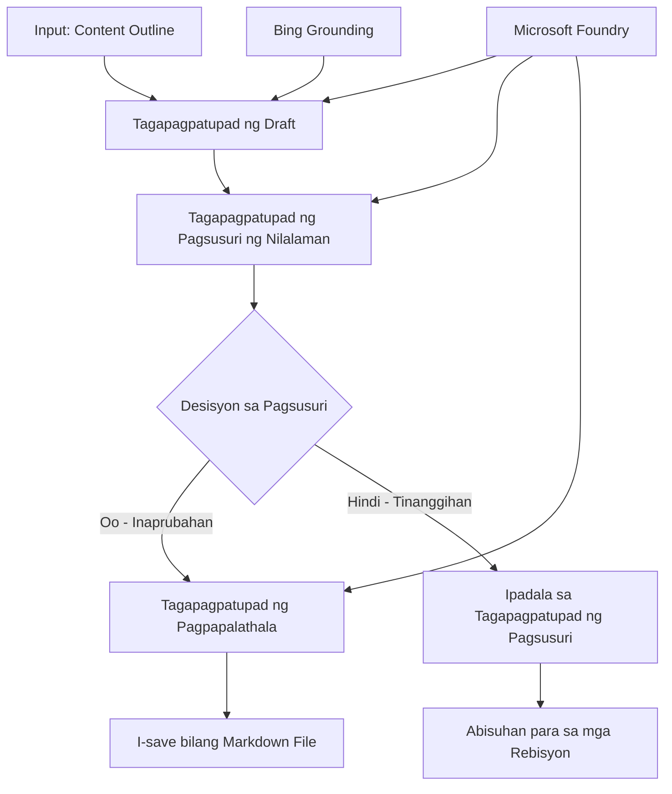

# 🔀 Kondisyonal na Mga Daloy ng Trabaho ng Ahente gamit ang Microsoft Foundry (.NET)

## 📋 Tutorial sa Matalinong Workflow Batay sa Desisyon

Ipinapakita ng notebook na ito ang **mga pattern ng kondisyonal na workflow** gamit ang Microsoft Foundry at ang Microsoft Agent Framework para sa .NET. Matututunan mo kung paano bumuo ng mga sopistikadong workflow na pinapatakbo ng mga desisyon na matalinong nagsusuri at nagruruta ng proseso batay sa pagsusuri ng AI, mga patakarang pang-negosyo, at mga dinamiko na kondisyon para sa enterprise-grade na awtomasyon.

## 🎯 Mga Layunin sa Pagkatuto

### 🧠 **Matalinong Arkitektura ng Desisyon**
- **Pagsasakatuparan ng Kondisyonal na Lohika**: Bumuo ng kumplikadong puno ng mga desisyon na may maraming sangay
- **AI-Powered Routing**: Gamitin ang mga modelo ng Microsoft Foundry upang gumawa ng matalinong mga desisyon sa pag-ruta
- **Dynamic Workflow Adaptation**: Baguhin ang kilos ng workflow batay sa pagsusuri at mga kondisyon sa takbo ng oras
- **Integrasyon ng Mga Alituntunin sa Enterprise**: Isama ang lohika ng negosyo at mga kinakailangang pagsunod sa workflows

### 🔀 **Mga Advanced na Kondisyonal na Pattern**
- **Pagpapasya gamit ang Maramihang Pamantayan**: Suriin ang maraming salik para sa mga desisyon sa pag-ruta
- **Context-Aware Processing**: Gumawa ng mga desisyon batay sa naipon na konteksto at kasaysayan ng workflow
- **Adaptive Workflow Modification**: Dynamic na iakma ang mga landas ng proseso batay sa real-time na mga kondisyon
- **Integrasyon ng Rule Engine**: Magpatupad ng sopistikadong mga engine ng patakaran ng negosyo sa loob ng workflows

### 🏢 **Mga Kondisyonal na Aplikasyon sa Enterprise**
- **Pag-uuri at Pag-ruta ng Dokumento**: Awtomatikong uriin at ruta ang mga dokumento sa angkop na workflows
- **Triage ng Serbisyo sa Customer**: Matalinong pag-ruta ng mga tanong ng customer sa mga espesyalistang pangkat
- **Pagsunod at Pagproseso ng Panganib**: Ipatupad ang iba't ibang proseso ng pagsusuri at pagrepaso batay sa pagsusuri ng panganib
- **Quality Assurance Workflows**: Ruta ng nilalaman sa mga naaangkop na proseso ng pagrepaso batay sa mga sukatan ng kalidad

## ⚙️ Mga Kinakailangan at Setup

### 📦 **Mga Kailangan na NuGet Packages**

Mga advanced na packages para sa kondisyonal na pagproseso ng workflow:

```xml
<!-- Core AI Framework -->
<PackageReference Include="Microsoft.Extensions.AI" Version="9.9.0" />

<!-- Azure AI Agents with Persistent State -->
<PackageReference Include="Azure.AI.Agents.Persistent" Version="1.2.0-beta.5" />

<!-- Azure Identity and Utilities -->
<PackageReference Include="Azure.Identity" Version="1.15.0" />
<PackageReference Include="System.Linq.Async" Version="6.0.3" />
<PackageReference Include="DotNetEnv" Version="3.1.1" />

<!-- Local Workflow Framework References -->
<!-- Microsoft.Agents.Workflows.dll - Advanced workflow orchestration -->
<!-- Microsoft.Agents.AI.AzureAI.dll - Microsoft Foundry integration -->
<!-- Microsoft.Agents.AI.dll - Core agent abstractions -->
```

### 🔑 **Konpigurasyon ng Microsoft Foundry**

**Mga Kinakailangang Azure Resources:**
- Microsoft Foundry workspace na may mga modelo para sa kondisyonal na pagproseso
- Azure subscription na may angkop na compute quotas at permiso
- Na-deploy na mga AI modelo para sa paggawa ng desisyon at pagsusuri ng nilalaman
- (Opsyonal) Koneksyon sa Bing Search API para sa grounding capabilities

**Konpigurasyon ng Kapaligiran (file na .env):**
```env
# Microsoft Foundry Configuration
AZURE_AI_PROJECT_ENDPOINT=https://your-project.cognitiveservices.azure.com/
BING_CONNECTION_ID=your-bing-connection-id
```

**Setup ng Authentication:**
```csharp
// Azure CLI or Managed Identity authentication
using Azure.Identity;
var credential = new AzureCliCredential();

// Load environment configuration
DotNetEnv.Env.Load("../../../.env");
```

### 🏗️ **Arkitektura ng Kondisyonal na Workflow**



**Mga Pangunahing Komponent:**
- **Draft Executor**: AI agent na lumilikha ng paunang mga draft mula sa mga outline
- **Content Review Executor**: AI agent na sumusuri sa kalidad at pagsunod ng draft
- **Conditional Routing**: Lohika ng desisyon na nagruruta batay sa mga resulta ng review
- **Publish/Review Paths**: Hiwa-hiwalay na mga landas ng proseso para sa mga naaprubahang at tinanggihan na nilalaman
- **State Management**: Nangangalaga sa konteksto ng nilalaman at pagsusuri sa buong workflow

## 🎨 **Mga Pattern ng Disenyo sa Kondisyonal na Workflow**

### 📋 **Produksyon ng Nilalaman na may Quality Gates**
```
Outline → Draft Creation → Quality Review → {Approve: Publish | Reject: Revise}
```

### 🎯 **Pagproseso ng Dokumento Batay sa Panganib**
```
Document → Risk Assessment → {Low: Standard | High: Enhanced Review}
```

### 🔍 **Matalinong Pag-ruta ng Serbisyo sa Customer**
```
Customer Query → Analysis → {Simple: FAQ Bot | Complex: Human Agent}
```

### 💼 **Mga Workflow na Pinapatakbo ng Pagsunod**
```
Content → Compliance Check → {Pass: Publish | Fail: Legal Review}
```

## 🏢 **Mga Benepisyo ng Kondisyonal sa Enterprise**

### 🎯 **Matalinong Awtomasyon**
- **Matalinong Paggawa ng Desisyon**: AI-powered na mga desisyon sa pag-ruta batay sa pagsusuri ng nilalaman at konteksto
- **Adaptive Processing**: Mga workflows na awtomatikong inaayos batay sa nagbabagong mga kondisyon
- **Pagpapatupad ng Patakaran sa Negosyo**: Awtomatikong aplikasyon ng kumplikadong lohika at polisiya ng negosyo
- **Context-Aware Routing**: Mga desisyon batay sa buong kasaysayan ng workflow at naipong konteksto

### 📈 **Kahusayan ng Operasyon**
- **Optimized Resource Allocation**: Ruta ng trabaho sa mga pinaka-angkop na espesyalista at proseso
- **Bawas na Manwal na Pagsaklaw**: Pinapaliit ng awtomatikong paggawa ng desisyon ang pangangailangan para sa manu-manong pag-ruta
- **Mas Mabilis na Oras ng Pagsasaayos**: Direktang pag-ruta sa angkop na kaalaman at kapasidad sa pagproseso
- **Pare-parehong Aplikasyon**: Uniform na paggamit ng mga patakaran sa negosyo at mga pamantayan sa paggawa ng desisyon

### 🛡️ **Pamamahala ng Panganib at Pagsunod**
- **Awtomatikong Pagsusuri ng Panganib**: AI-powered na pagsusuri ng antas ng panganib ng nilalaman at sitwasyon
- **Pagpapatupad ng Pagsunod**: Awtomatikong pag-ruta sa mga kinakailangang regulasyon na proseso
- **Paglalapat ng Mga Protokol sa Seguridad**: Pinahusay na mga hakbang sa seguridad na inilalapat batay sa pagsusuri ng panganib
- **Pagpapanatili ng Audit Trail**: Kumpletong dokumentasyon ng mga desisyon sa pag-ruta at rasyonal

### 📊 **Analytics at Patuloy na Pagpapabuti**
- **Decision Analytics**: Subaybayan ang bisa at katumpakan ng mga desisyon sa pag-ruta
- **Pattern Recognition**: Tuklasin ang mga uso at pattern sa mga desisyon sa pag-ruta sa paglipas ng panahon
- **Performance Optimization**: Patuloy na pagpapabuti ng mga pamantayan sa paggawa ng desisyon at kahusayan sa pag-ruta
- **Business Intelligence**: Mga pananaw tungkol sa mga katangian ng nilalaman at mga pangangailangan sa pagproseso

### 🔧 **Teknikal na Kahusayan**
- **Persistent State Management**: Panatilihin ang kumplikadong estado sa buong pagpapatupad ng workflow
- **Scalable Architecture**: Kayang harapin ang mataas na dami ng kondisyonal na mga pangangailangan sa pagproseso
- **Integration Capabilities**: Seamless na integrasyon sa umiiral nang mga sistema at proseso ng negosyo
- **Monitoring at Observability**: Komprehensibong pagsubaybay ng pagganap at mga desisyon sa workflow

Gumawa tayo ng matalinong, pinapatakbo ng desisyon na mga enterprise workflow gamit ang .NET! 🚀

## 💻 Pagpapatakbo ng Code

Ang kumpletong pagpapatupad ay makukuha sa `04.dotnet-agent-framework-workflow-aifoundry-condition.cs`. Ipinapakita nito ang **content production workflow na may quality gates**:

### 🏗️ **Arkitektura ng Workflow**

```
Content Outline → Draft Creation → Quality Review → Conditional Routing:
                                                      ├─ Approved (>200 words) → Publish
                                                      └─ Rejected (<200 words) → Review Notification
```

**Mga Ahente sa Workflow:**
1. **Evangelist Agent**: Lumilikha ng tutorial drafts mula sa mga outline na may grounding mula sa Bing
2. **Content Reviewer Agent**: Sinusuri ang kalidad ng draft (bilang ng salita, kasapatan)
3. **Publisher Agent**: Nagsi-save ng mga naaprubahang nilalaman bilang timestamped na Markdown files

**Mga Custom Executor:**
1. **DraftExecutor**: Nag-oorganisa ng paggawa ng mga draft
2. **ContentReviewExecutor**: Isinasagawa ang pagtatasa ng kalidad
3. **PublishExecutor**: Humahawak sa publikasyon ng mga naaprubahang nilalaman
4. **SendReviewExecutor**: Namamahala sa mga notipikasyon para sa mga tinanggihang nilalaman

### 🚀 Pagpapatakbo ng Halimbawa

**Mga Kinakailangan:**
- Nakakonpig na Microsoft Foundry workspace
- Authentication sa Azure CLI (`az login`)
- (Opsyonal) Koneksyon sa Bing Search para sa grounding

```bash
# Gawing executable ang script (Unix/Linux/macOS)
chmod +x 04.dotnet-agent-framework-workflow-aifoundry-condition.cs

# Patakbuhin ang kondisyonal na workflow
./04.dotnet-agent-framework-workflow-aifoundry-condition.cs
```

O sa Windows:
```powershell
dotnet run 04.dotnet-agent-framework-workflow-aifoundry-condition.cs
```

### 📝 Inaasahang Output

Ang workflow ay:
1. **Lumikha ng Mga Ahente**: Mag-initialize ng tatlong espesyalistang Microsoft Foundry agents
2. **Gumawa ng Draft**: Lumilikha ang evangelist agent ng tutorial draft mula sa outline
3. **Suriin ang Nilalaman**: Sinusuri ng content reviewer ang kalidad ng draft
4. **Kondisyonal na Pag-ruta**:
   - **Kung aprubado (>200 salita)**: Ise-save ng publish executor bilang Markdown file
   - **Kung tinanggihan (<200 salita)**: Magpapadala ng notipikasyon ng review
5. **Ipakita ang Resulta**: Ipakita ang panghuling resulta ng workflow

### 🔧 Mga Opsyon sa Pag-customize

**Baguhin ang Mga Pamantayan sa Review:**
```csharp
const string ContentReviewerInstructions = @"
You are a content reviewer...
1. Check if content is more than 500 words (instead of 200)
2. Verify technical accuracy
3. Ensure proper formatting
...";
```

**Magdagdag ng Higit Pang Mga Kondisyonal na Landas:**
```csharp
var workflow = new WorkflowBuilder(draftExecutor)
    .AddEdge(draftExecutor, contentReviewerExecutor)
    .AddEdge(contentReviewerExecutor, publishExecutor, condition: GetCondition("Excellent"))
    .AddEdge(contentReviewerExecutor, editExecutor, condition: GetCondition("Good"))
    .AddEdge(contentReviewerExecutor, sendReviewerExecutor, condition: GetCondition("Poor"))
    .Build();
```

**Palitan ang Mga Kinakailangan sa Nilalaman:**
```csharp
string OUTLINE_Content = @"
# Your Custom Topic
## Section 1
https://your-reference-url
## Section 2
...
";
```

### 🎯 Mga Aplikasyon sa Tunay na Mundo

Ang pattern ng kondisyonal na workflow na ito ay perpekto para sa:
- **Mga Sistema ng Pamamahala ng Nilalaman**: Awtomatikong editorial workflows na may quality gates
- **Pagproseso ng Dokumento**: Ruta ng mga dokumento batay sa klasipikasyon at pagsunod
- **Customer Support**: Matalinong pag-ruta ng ticket batay sa kumplikado at urgency
- **Legal Review**: Ruta ng mga kontrata batay sa pagsusuri ng panganib at halaga
- **Mga Proseso ng HR**: Ruta ng mga aplikasyon sa angkop na screening workflows

### 🔍 Pag-unawa sa Kondisyonal na Lohika

**Function ng Kondisyon:**
```csharp
public Func<object?, bool> GetCondition(string expectedResult) =>
    reviewResult => reviewResult is ReviewResult review && review.Result == expectedResult;
```

Lumilikha ang function na ito ng predicate na:
1. Sinusuri kung ang resulta ay nasa uri na `ReviewResult`
2. Inihahambing ang property na `Result` sa inaasahang halaga
3. Nagbabalik ng true/false upang tukuyin ang pag-ruta

**Mga Gilid ng Workflow na may Kondisyon:**
```csharp
.AddEdge(contentReviewerExecutor, publishExecutor, condition: GetCondition("Yes"))
.AddEdge(contentReviewerExecutor, sendReviewerExecutor, condition: GetCondition("No"))
```

### 📊 Mga Advanced na Tampok

**JSON Schema Validation:**
Ginagamit ng workflow ang mga JSON schema upang matiyak ang istrakturadong mga tugon:

```csharp
// Define response structure
public class ReviewResult
{
    [JsonPropertyName("review_result")]
    public string Result { get; set; } = string.Empty;
    
    [JsonPropertyName("reason")]
    public string Reason { get; set; } = string.Empty;
    
    [JsonPropertyName("draft_content")]
    public string DraftContent { get; set; } = string.Empty;
}

// Apply to agent
ResponseFormat = ChatResponseFormat.ForJsonSchema(
    AIJsonUtilities.CreateJsonSchema(typeof(ReviewResult)), 
    "ReviewResult", 
    "Review Result From DraftContent"
)
```

**Integrasyon ng Bing Grounding:**
Ginagamit ng evangelist agent ang Bing grounding upang ma-access ang impormasyon sa real-time:

```csharp
var bingGroundingConfig = new BingGroundingSearchConfiguration(bing_conn_id);
BingGroundingToolDefinition bingGroundingTool = new(
    new BingGroundingSearchToolParameters([bingGroundingConfig])
);
```

Pinapagana nito ang ahente na sundan ang mga URL sa outline at kunin ang kasalukuyang impormasyon.

### 🛡️ Pag-handle ng Error

May kasamang matibay na pag-handle ng error ang workflow para sa mga tinanggihang nilalaman:
- Ang mga kabiguan sa review ay nagti-trigger ng alternatibong landas
- Nagbibigay ng malinaw na mga dahilan ng pagtanggi ang mga notipikasyon
- Pinananatili ang nilalaman para sa rebisyon

### 🔄 Pagpapalawak ng Workflow

**Magdagdag ng Loop para sa Rebisyon:**
Lumikha ng feedback loop na awtomatikong gumagawang muli ng nilalaman:

```csharp
.AddEdge(contentReviewerExecutor, publishExecutor, condition: GetCondition("Yes"))
.AddEdge(contentReviewerExecutor, draftExecutor, condition: GetCondition("No")) // Loop back
```

**Magpatupad ng Multi-Level na Review:**
Magdagdag ng maraming yugto ng review na may magkakaibang mga pamantayan:

```csharp
.AddEdge(draftExecutor, technicalReviewer)
.AddEdge(technicalReviewer, editorialReviewer, condition: GetCondition("TechPass"))
.AddEdge(editorialReviewer, publishExecutor, condition: GetCondition("EditPass"))
```

Nagbibigay ang pattern na ito ng kondisyonal na workflow ng pundasyon para sa pagbuo ng mga sopistikadong, matatalinong sistema ng awtomasyong enterprise! 🚀

---

<!-- CO-OP TRANSLATOR DISCLAIMER START -->
**Pagtatanggi**:
Ang dokumentong ito ay isinalin gamit ang serbisyo ng AI translation na [Co-op Translator](https://github.com/Azure/co-op-translator). Bagama't nagsusumikap kami para sa katumpakan, pakatandaan na ang awtomatikong pagsasalin ay maaaring maglaman ng mga pagkakamali o hindi pagkakatugma. Ang orihinal na dokumento sa orihinal nitong wika ang dapat ituring na pangunahing sanggunian. Para sa mahahalagang impormasyon, inirerekomenda ang propesyonal na pagsasalin ng tao. Hindi kami mananagot sa anumang maling pagkakaintindi o maling interpretasyon na nagmula sa paggamit ng pagsasaling ito.
<!-- CO-OP TRANSLATOR DISCLAIMER END -->