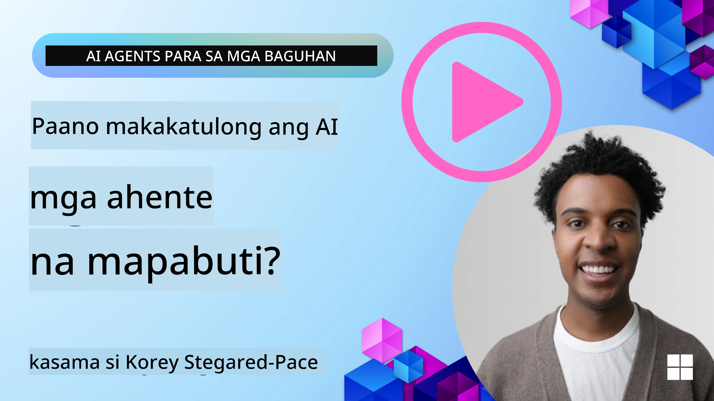
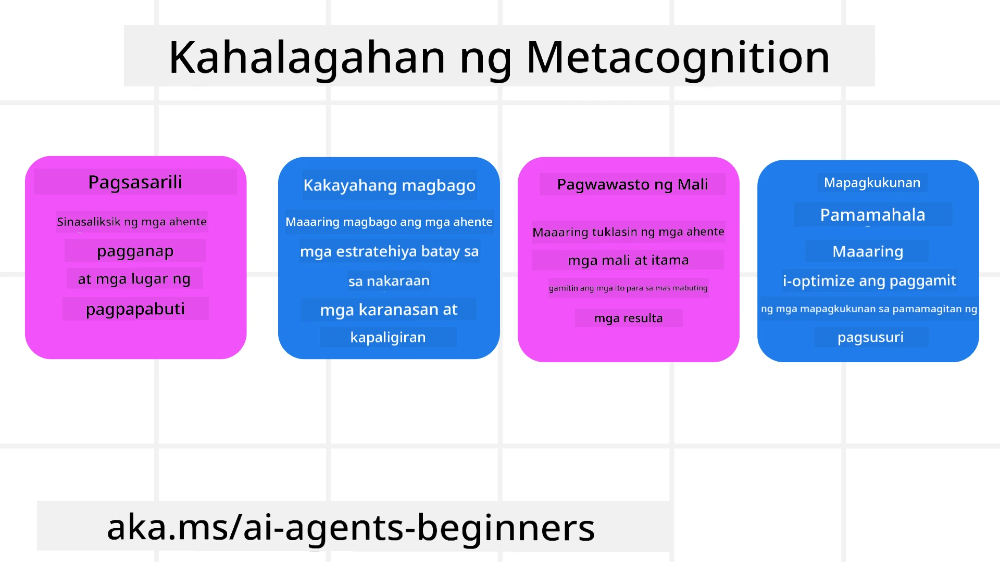
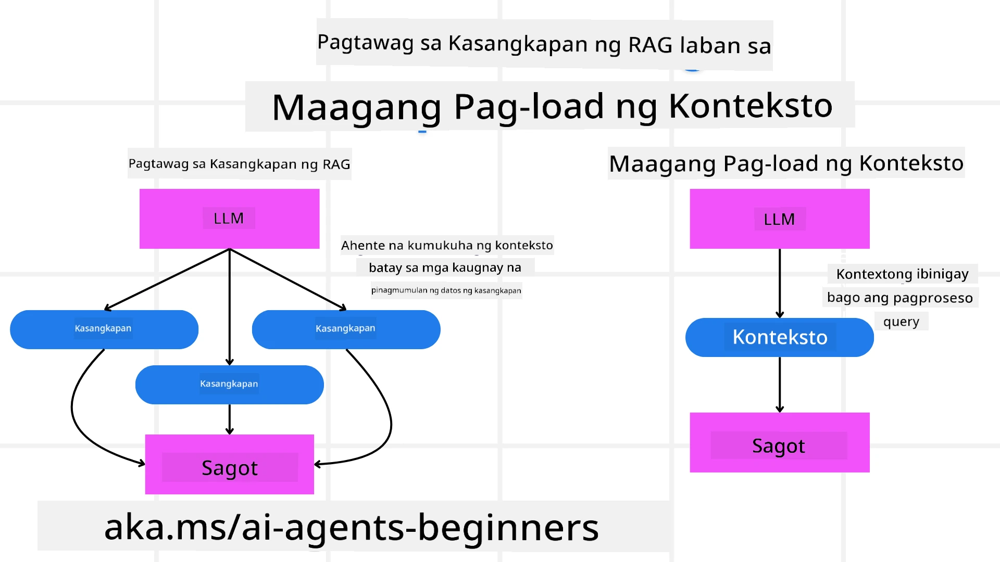

[](https://youtu.be/His9R6gw6Ec?si=3_RMb8VprNvdLRhX)

> _(I-click ang larawan sa itaas upang panoorin ang video ng araling ito)_
# Metakognisyon sa Mga AI Agent

## Panimula

Maligayang pagdating sa aralin tungkol sa metakognisyon sa mga AI agent! Ang kabanatang ito ay idinisenyo para sa mga nagsisimula na mausisa kung paano maaaring mag-isip ang mga AI agent tungkol sa kanilang sariling proseso ng pag-iisip. Sa pagtatapos ng araling ito, mauunawaan mo ang mga pangunahing konsepto at magkakaroon ng mga praktikal na halimbawa upang magamit ang metakognisyon sa disenyo ng AI agent.

## Mga Layunin sa Pagkatuto

Pagkatapos makumpleto ang araling ito, magagawa mong:

1. Maunawaan ang mga implikasyon ng reasoning loops sa mga depinisyon ng agent.
2. Gamitin ang mga teknik ng pagpaplano at ebalwasyon upang makatulong sa mga self-correcting na agent.
3. Lumikha ng sarili mong mga agent na kaya ang manipulahin ang code para makamit ang mga gawain.

## Panimula sa Metakognisyon

Ang metakognisyon ay tumutukoy sa mataas na antas ng mga prosesong kognitibo na kinasasangkutan ang pag-iisip tungkol sa sariling pag-iisip. Para sa mga AI agent, nangangahulugan ito ng kakayahang suriin at ayusin ang kanilang mga aksyon base sa sariling kamalayan at mga nakaraang karanasan. Ang metakognisyon, o "pag-iisip tungkol sa pag-iisip," ay isang mahalagang konsepto sa pagbuo ng mga agentic na sistema ng AI. Kabilang dito ang kamalayan ng AI system sa kanilang sariling panloob na proseso at kakayahang bantayan, i-regulate, at baguhin ang kanilang asal nang naaayon. Katulad ng ginagawa natin kapag binabasa natin ang sitwasyon o tinitingnan ang isang problema. Ang ganitong uri ng sariling kamalayan ay makatutulong sa mga AI system na gumawa ng mas magagandang desisyon, tuklasin ang mga pagkakamali, at pagbutihin ang kanilang pagganap sa paglipas ng panahon—na muling bumabalik sa Turing test at ang debate kung sakupin ba ng AI ang mundo.

Sa konteksto ng mga systemang agentic AI, ang metakognisyon ay makakatulong tugunan ang ilang mga hamon, tulad ng:
- Transparensiya: Pagtitiyak na ang mga AI system ay makapaliwanag ng kanilang pangangatwiran at mga desisyon.
- Pangangatwiran: Pagsusulong ng kakayahan ng AI system na pagsamahin ang impormasyon at gumawa ng matalinong desisyon.
- Pag-aangkop: Pagbibigay-daan sa mga AI system na mag-adjust sa mga bagong kapaligiran at nagbabagong kundisyon.
- Persepsyon: Pagpapahusay ng katumpakan ng mga AI system sa pagkilala at pagbibigay-kahulugan sa data mula sa kanilang paligid.

### Ano ang Metakognisyon?

Ang metakognisyon, o "pag-iisip tungkol sa pag-iisip," ay isang mataas na antas ng proseso ng kognisyon na kinasasangkutan ang sariling kamalayan at sariling regulasyon ng sariling mga proseso ng pag-iisip. Sa larangan ng AI, pinapagana ng metakognisyon ang mga agent na suriin at baguhin ang kanilang mga estratehiya at aksyon, na nagreresulta sa pinabuting kakayahan sa paglutas ng problema at paggawa ng desisyon. Sa pamamagitan ng pag-unawa sa metakognisyon, makakalikha ka ng mga AI agent na hindi lamang mas matalino kundi mas nababagay at epektibo rin. Sa tunay na metakognisyon, makikita mo ang AI na tahasang pinag-iisipan ang sarili nitong pangangatwiran.

Halimbawa: “Pinili ko ang mas murang mga flight dahil… maaaring may nawawala akong diretso na flight, kaya susuriin ko ulit.”
Sinusubaybayan kung paano o bakit nito pinili ang isang tiyak na ruta.
- Napapansin na nagkamali dahil masyado itong umasa sa mga kagustuhan ng user mula sa huling beses, kaya binabago ang estratehiya sa paggawa ng desisyon hindi lamang ang huling rekomendasyon.
- Dinidiagnose ang mga pattern tulad ng, “Kapag nakita kong binanggit ng user ang ‘masyadong siksikan,’ hindi lamang dapat alisin ang ilang atraksyon kundi pag-isipan din na may mali sa aking pamamaraan ng pagpili ng ‘top attractions’ kung palagi kong inuuna ang ayon sa kasikatan.”

### Kahalagahan ng Metakognisyon sa Mga AI Agent

Mahalaga ang metakognisyon sa disenyo ng AI agent para sa ilang mga dahilan:



- Pagsusuri sa Sarili: Maaaring suriin ng mga agent ang kanilang sariling pagganap at tukuyin ang mga lugar na kailangang pagbutihin.
- Kakayahang Mag-adapt: Maaari nilang baguhin ang kanilang mga estratehiya base sa mga nakaraang karanasan at nagbabagong kapaligiran.
- Pagwawasto ng Mali: Kaya nilang awtomatikong tuklasin at itama ang mga error, na nagreresulta sa mas tumpak na resulta.
- Pamamahala ng Mga Resource: Maaari nilang i-optimize ang paggamit ng mga resource tulad ng oras at kapangyarihang pangkompyut sa pamamagitan ng pagpaplano at ebalwasyon ng kanilang mga aksyon.

## Mga Bahagi ng Isang AI Agent

Bago sumisid sa mga metakognitibong proseso, mahalagang maunawaan ang mga pangunahing bahagi ng isang AI agent. Karaniwan, ang AI agent ay binubuo ng:

- Persona: Ang personalidad at mga katangian ng agent, na naglalarawan kung paano ito nakikipag-ugnayan sa mga user.
- Tools: Mga kakayahan at function na magagawa ng agent.
- Skills: Ang kaalaman at kadalubhasaan na taglay ng agent.

Pinagtutulungan ang mga bahaging ito upang lumikha ng isang "expertise unit" na makakagawa ng mga tiyak na gawain.

**Halimbawa**:
Isipin ang isang travel agent, isang serbisyo ng agent na hindi lang nagpaplano ng iyong bakasyon kundi ina-adjust ang ruta base sa real-time na data at mga nakaraang karanasan ng customer.

### Halimbawa: Metakognisyon sa Isang Serbisyo ng Travel Agent

Isipin mong nagdidisenyo ka ng isang travel agent service na pinapagana ng AI. Ang agent na ito, "Travel Agent," ay tumutulong sa mga user sa pagplano ng kanilang mga bakasyon. Para maisama ang metakognisyon, kailangang suriin at ayusin ng Travel Agent ang mga aksyon base sa sariling kamalayan at mga nakaraang karanasan. Ganito maaaring gumana ang metakognisyon:

#### Kasalukuyang Gawain

Ang kasalukuyang gawain ay tulungan ang isang user na magplano ng biyahe sa Paris.

#### Mga Hakbang Para Matapos ang Gawain

1. **Kolektahin ang mga Kagustuhan ng User**: Tanungin ang user tungkol sa kanilang mga petsa ng paglalakbay, budget, mga interes (hal., mga museo, pagkain, pamimili), at anumang mga partikular na pangangailangan.
2. **Kunin ang Impormasyon**: Maghanap ng mga opsyon sa flight, akomodasyon, atraksyon, at mga restoran na tugma sa kagustuhan ng user.
3. **Gawin ang mga Rekomendasyon**: Magbigay ng personalisadong itineraryo na may mga detalye ng flight, reserbasyon sa hotel, at mga inirerekomendang aktibidad.
4. **Baguhin Base sa Feedback**: Tanungin ang user tungkol sa kanilang feedback sa mga rekomendasyon at gawin ang kinakailangang mga pagbabago.

#### Mga Kinakailangang Resource

- Access sa mga database ng flight at booking sa hotel.
- Impormasyon tungkol sa mga atraksyon at restoran sa Paris.
- Data ng feedback ng user mula sa mga nakaraang interaksyon.

#### Karanasan at Pagsusuri sa Sarili

Ginagamit ng Travel Agent ang metakognisyon upang suriin ang sariling pagganap at matuto mula sa mga nakaraang karanasan. Halimbawa:

1. **Pagsusuri ng Feedback ng User**: Sinusuri ng Travel Agent ang feedback ng user upang malaman kung alin sa mga rekomendasyon ang tinanggap ng mabuti at alin ang hindi. Ina-adjust nito ang mga susunod na suhestiyon nang naaayon.
2. **Kakayahang Mag-adapt**: Kung binanggit ng user dati ang hindi gusto sa masikip na lugar, iiwasan ng Travel Agent ang pagrekomenda ng mga popular na turistang lugar sa peak hours sa hinaharap.
3. **Pagwawasto ng Mali**: Kung nagkamali ang Travel Agent sa isang booking dati, tulad ng pag-suggest ng hotel na puno na, natututo itong mas mahigpit na suriin ang availability bago magrekomenda.

#### Praktikal na Halimbawa para sa Developer

Narito ang isang pinaikling halimbawa ng code para sa Travel Agent na nagsasama ng metakognisyon:

```python
class Travel_Agent:
    def __init__(self):
        self.user_preferences = {}
        self.experience_data = []

    def gather_preferences(self, preferences):
        self.user_preferences = preferences

    def retrieve_information(self):
        # Maghanap ng mga flight, hotel, at mga atraksyon batay sa mga kagustuhan
        flights = search_flights(self.user_preferences)
        hotels = search_hotels(self.user_preferences)
        attractions = search_attractions(self.user_preferences)
        return flights, hotels, attractions

    def generate_recommendations(self):
        flights, hotels, attractions = self.retrieve_information()
        itinerary = create_itinerary(flights, hotels, attractions)
        return itinerary

    def adjust_based_on_feedback(self, feedback):
        self.experience_data.append(feedback)
        # Suriin ang feedback at ayusin ang mga susunod na rekomendasyon
        self.user_preferences = adjust_preferences(self.user_preferences, feedback)

# Halimbawa ng paggamit
travel_agent = Travel_Agent()
preferences = {
    "destination": "Paris",
    "dates": "2025-04-01 to 2025-04-10",
    "budget": "moderate",
    "interests": ["museums", "cuisine"]
}
travel_agent.gather_preferences(preferences)
itinerary = travel_agent.generate_recommendations()
print("Suggested Itinerary:", itinerary)
feedback = {"liked": ["Louvre Museum"], "disliked": ["Eiffel Tower (too crowded)"]}
travel_agent.adjust_based_on_feedback(feedback)
```

#### Bakit Mahalaga ang Metakognisyon

- **Pagsusuri sa Sarili**: Maaaring suriin ng mga agent ang kanilang pagganap at tukuyin ang mga puwang para sa pagpapabuti.
- **Kakayahang Mag-adapt**: Binabago ng mga agent ang mga estratehiya base sa feedback at nagbabagong kondisyon.
- **Pagwawasto ng Mali**: Nakakapag-detect at nakakapagwasto sila ng mga pagkakamali nang autonomously.
- **Pamamahala ng Resource**: Ino-optimize ng mga agent ang paggamit ng mga resources tulad ng oras at computational power.

Sa pagsasama ng metakognisyon, makakapagbigay ang Travel Agent ng mas personalisado at tumpak na mga rekomendasyon sa paglalakbay, na nagpapaganda ng kabuuang karanasan ng user.

---

## 2. Pagpaplano sa Mga Agent

Mahalaga ang pagpaplano bilang bahagi ng pag-uugali ng AI agent. Kabilang dito ang pagbalangkas ng mga hakbang na kailangang gawin para makamit ang layunin, isinaalang-alang ang kasalukuyang kalagayan, mga resources, at posibleng mga hadlang.

### Mga Elemento ng Pagpaplano

- **Kasalukuyang Gawain**: Maliwanag na tukuyin ang gawain.
- **Mga Hakbang Para Matapos ang Gawain**: Hatiin ang gawain sa mga madaling pamahalaang hakbang.
- **Kinakailangang Resources**: Tukuyin ang mga kailangang resources.
- **Karanasan**: Gamitin ang mga nakaraang karanasan upang gabayan ang pagpaplano.

**Halimbawa**:
Narito ang mga hakbang na kailangan gawin ng Travel Agent upang epektibong tumulong sa isang user na magplano ng kanilang biyahe:

### Mga Hakbang para sa Travel Agent

1. **Kolektahin ang Mga Kagustuhan ng User**
   - Tanungin ang user tungkol sa mga detalye ng kanilang mga petsa ng paglalakbay, budget, interes, at iba pang mga kinakailangan.
   - Halimbawa: "Kailan mo planong maglakbay?" "Ano ang iyong budget na saklaw?" "Anong mga aktibidad ang gusto mong gawin kapag bakasyon?"

2. **Kunin ang Impormasyon**
   - Maghanap ng mga opsyon sa paglalakbay base sa mga kagustuhan ng user.
   - **Mga Flight**: Maghanap ng mga flight na available sa loob ng budget at sa mga nais na petsa ng paglalakbay ng user.
   - **Akomodasyon**: Humanap ng mga hotel o paupahang lugar na tugma sa mga kagustuhan ng user sa lokasyon, presyo, at amenities.
   - **Mga Atraksyon at Restoran**: Tukuyin ang mga popular na atraksyon, aktibidad, at mga kainan na pasok sa interes ng user.

3. **Gumawa ng Mga Rekomendasyon**
   - Pagsamahin ang mga nakuha na impormasyon sa isang personalisadong itineraryo.
   - Magbigay ng mga detalye tulad ng mga opsyon sa flight, reserbasyon sa hotel, at mga inirekomendang aktibidad, na tiyak sa mga kagustuhan ng user.

4. **Ipakita ang Itineraryo sa User**
   - Ibahagi ang iminungkahing itineraryo para sa kanilang pagsusuri.
   - Halimbawa: "Narito ang isang iminungkahing itineraryo para sa iyong biyahe sa Paris. Kasama dito ang mga detalye ng flight, booking sa hotel, at listahan ng mga rekomendadong aktibidad at restoran. Sabihin mo lang ang iyong opinyon!"

5. **Kolektahin ang Feedback**
   - Tanungin ang user ang tungkol sa kanilang opinyon sa itinanghal na itineraryo.
   - Halimbawa: "Gusto mo ba ang mga opsyon sa flight?" "Ayos ba ang hotel para sa iyong pangangailangan?" "May mga aktibidad ka bang gustong idagdag o alisin?"

6. **Baguhin Base sa Feedback**
   - Baguhin ang itineraryo base sa feedback ng user.
   - Gawin ang mga kinakailangang pagbabago sa mga flight, akomodasyon, at rekomendasyon sa mga aktibidad upang mas mabagay sa kagustuhan ng user.

7. **Pangwakas na Kumpirmasyon**
   - Ipakita ang na-update na itineraryo sa user para sa pangwakas na kumpirmasyon.
   - Halimbawa: "Ginawa ko na ang mga pagbabago base sa iyong feedback. Narito ang na-update na itineraryo. Okay na ba sa’yo?"

8. **Mag-book at Kumpirmahin ang Mga Reservation**
   - Kapag inaprubahan na ng user ang itineraryo, ituloy ang pag-book ng mga flight, akomodasyon, at iba pang planadong aktibidad.
   - Ipadala ang mga detalye ng kumpirmasyon sa user.

9. **Magbigay ng Patuloy na Suporta**
   - Manatiling available upang tulungan ang user sa mga pagbabago o karagdagang kahilingan bago at habang naglalakbay.
   - Halimbawa: "Kung kailangan mo ng karagdagang tulong habang naglalakbay, huwag mag-atubiling kontakin ako anumang oras!"

### Halimbawa ng Interaksyon

```python
class Travel_Agent:
    def __init__(self):
        self.user_preferences = {}
        self.experience_data = []

    def gather_preferences(self, preferences):
        self.user_preferences = preferences

    def retrieve_information(self):
        flights = search_flights(self.user_preferences)
        hotels = search_hotels(self.user_preferences)
        attractions = search_attractions(self.user_preferences)
        return flights, hotels, attractions

    def generate_recommendations(self):
        flights, hotels, attractions = self.retrieve_information()
        itinerary = create_itinerary(flights, hotels, attractions)
        return itinerary

    def adjust_based_on_feedback(self, feedback):
        self.experience_data.append(feedback)
        self.user_preferences = adjust_preferences(self.user_preferences, feedback)

# Halimbawang paggamit sa loob ng isang booing na kahilingan
travel_agent = Travel_Agent()
preferences = {
    "destination": "Paris",
    "dates": "2025-04-01 to 2025-04-10",
    "budget": "moderate",
    "interests": ["museums", "cuisine"]
}
travel_agent.gather_preferences(preferences)
itinerary = travel_agent.generate_recommendations()
print("Suggested Itinerary:", itinerary)
feedback = {"liked": ["Louvre Museum"], "disliked": ["Eiffel Tower (too crowded)"]}
travel_agent.adjust_based_on_feedback(feedback)
```

## 3. Corrective RAG System

Unahin nating unawain ang pagkakaiba sa pagitan ng RAG Tool at Pre-emptive Context Load



### Retrieval-Augmented Generation (RAG)

Pinagsasama ng RAG ang isang retrieval system sa isang generative model. Kapag may query, kinukuha ng retrieval system ang mga kaugnay na dokumento o data mula sa panlabas na pinagkukunan, at ginagamit ang impormasyong ito upang dagdagan ang input ng generative model. Nakakatulong ito sa modelong makagawa ng mas tumpak at may kaugnayang tugon.

Sa isang RAG system, kumukuha ang agent ng kaugnay na impormasyon mula sa knowledge base at ginagamit ito upang makabuo ng angkop na mga sagot o aksyon.

### Corrective RAG Approach

Nakatuon ang Corrective RAG approach sa paggamit ng RAG techniques upang itama ang mga pagkakamali at pagbutihin ang katumpakan ng mga AI agent. Kabilang dito ang:

1. **Prompting Technique**: Paggamit ng mga partikular na prompt upang gabayan ang agent sa pagkuha ng kaugnay na impormasyon.
2. **Tool**: Pagpapatupad ng mga algorithm at mekanismo na nagpapahintulot sa agent na suriin ang kaugnayan ng nakuha na impormasyon at makagawa ng tumpak na mga tugon.
3. **Evaluation**: Patuloy na pagsusuri sa pagganap ng agent at paggawa ng mga pag-aayos para mapabuti ang katumpakan at kahusayan nito.

#### Halimbawa: Corrective RAG sa Isang Search Agent

Isipin ang isang search agent na kumukuha ng impormasyon mula sa web upang sagutin ang mga tanong ng user. Ang Corrective RAG approach ay maaaring kabilang ang:

1. **Prompting Technique**: Pagsasalaysay ng mga query sa paghahanap base sa input ng user.
2. **Tool**: Paggamit ng natural language processing at machine learning algorithms upang i-ranggo at i-filter ang mga resulta ng paghahanap.
3. **Evaluation**: Pagsusuri ng feedback ng user upang matukoy at maitama ang mga di-tumpak na impormasyon sa nakuha.

### Corrective RAG sa Travel Agent

Pinapalakas ng Corrective RAG (Retrieval-Augmented Generation) ang kakayahan ng AI na kunin at lumikha ng impormasyon habang inaayos ang mga di-tumpak na bahagi. Tingnan natin kung paano magagamit ng Travel Agent ang Corrective RAG approach upang magbigay ng mas tumpak at kaugnayang mga rekomendasyon sa paglalakbay.

Kabilang dito ang:

- **Prompting Technique:** Paggamit ng mga partikular na prompt para gabayan ang agent sa pagkuha ng kaugnay na impormasyon.
- **Tool:** Pagpapatupad ng mga algorithm at mekanismo na nagpapahintulot sa agent na suriin ang kaugnayan ng impormasyong nakuha at makagawa ng tumpak na tugon.
- **Evaluation:** Patuloy na pagsusuri sa pagganap ng agent at paggawa ng mga pag-aayos upang mapabuti ang katumpakan at kahusayan nito.

#### Mga Hakbang sa Pagpapatupad ng Corrective RAG sa Travel Agent

1. **Pangunahing Interaksyon sa User**
   - Kinokolekta ng Travel Agent ang mga unang kagustuhan mula sa user, tulad ng destinasyon, mga petsa ng paglalakbay, budget, at mga interes.
   - Halimbawa:

     ```python
     preferences = {
         "destination": "Paris",
         "dates": "2025-04-01 to 2025-04-10",
         "budget": "moderate",
         "interests": ["museums", "cuisine"]
     }
     ```

2. **Pagkuha ng Impormasyon**
   - Kinukuha ng Travel Agent ang impormasyon tungkol sa mga flight, akomodasyon, atraksyon, at mga restoran base sa mga kagustuhan ng user.
   - Halimbawa:

     ```python
     flights = search_flights(preferences)
     hotels = search_hotels(preferences)
     attractions = search_attractions(preferences)
     ```

3. **Pagbuo ng Paunang Rekomendasyon**
   - Ginagamit ng Travel Agent ang nakuhang impormasyon upang gumawa ng personalisadong itineraryo.
   - Halimbawa:

     ```python
     itinerary = create_itinerary(flights, hotels, attractions)
     print("Suggested Itinerary:", itinerary)
     ```

4. **Pagkolekta ng Feedback ng User**
   - Tinanong ng Travel Agent ang user tungkol sa kanilang opinyon sa mga unang rekomendasyon.
   - Halimbawa:

     ```python
     feedback = {
         "liked": ["Louvre Museum"],
         "disliked": ["Eiffel Tower (too crowded)"]
     }
     ```

5. **Proseso ng Corrective RAG**
   - **Prompting Technique**: Gumagawa ang Travel Agent ng mga bagong query sa paghahanap base sa feedback ng user.
     - Halimbawa:

       ```python
       if "disliked" in feedback:
           preferences["avoid"] = feedback["disliked"]
       ```

   - **Tool**: Ginagamit ng Travel Agent ang mga algorithm upang i-ranggo at i-filter ang mga bagong resulta ng paghahanap, na binibigyang-diin ang kaugnayan base sa feedback ng user.
     - Halimbawa:

       ```python
       new_attractions = search_attractions(preferences)
       new_itinerary = create_itinerary(flights, hotels, new_attractions)
       print("Updated Itinerary:", new_itinerary)
       ```

   - **Evaluation**: Patuloy na sinisiyasat ng Travel Agent ang kaugnayan at katumpakan ng mga rekomendasyon nito sa pamamagitan ng pagsusuri ng feedback ng user at paggawa ng kinakailangang mga pagbabago.
     - Halimbawa:

       ```python
       def adjust_preferences(preferences, feedback):
           if "liked" in feedback:
               preferences["favorites"] = feedback["liked"]
           if "disliked" in feedback:
               preferences["avoid"] = feedback["disliked"]
           return preferences

       preferences = adjust_preferences(preferences, feedback)
       ```

#### Praktikal na Halimbawa

Narito ang simpleng halimbawa ng Python code na nagsasama ng Corrective RAG approach sa Travel Agent:

```python
class Travel_Agent:
    def __init__(self):
        self.user_preferences = {}
        self.experience_data = []

    def gather_preferences(self, preferences):
        self.user_preferences = preferences

    def retrieve_information(self):
        flights = search_flights(self.user_preferences)
        hotels = search_hotels(self.user_preferences)
        attractions = search_attractions(self.user_preferences)
        return flights, hotels, attractions

    def generate_recommendations(self):
        flights, hotels, attractions = self.retrieve_information()
        itinerary = create_itinerary(flights, hotels, attractions)
        return itinerary

    def adjust_based_on_feedback(self, feedback):
        self.experience_data.append(feedback)
        self.user_preferences = adjust_preferences(self.user_preferences, feedback)
        new_itinerary = self.generate_recommendations()
        return new_itinerary

# Halimbawa ng paggamit
travel_agent = Travel_Agent()
preferences = {
    "destination": "Paris",
    "dates": "2025-04-01 to 2025-04-10",
    "budget": "moderate",
    "interests": ["museums", "cuisine"]
}
travel_agent.gather_preferences(preferences)
itinerary = travel_agent.generate_recommendations()
print("Suggested Itinerary:", itinerary)
feedback = {"liked": ["Louvre Museum"], "disliked": ["Eiffel Tower (too crowded)"]}
new_itinerary = travel_agent.adjust_based_on_feedback(feedback)
print("Updated Itinerary:", new_itinerary)
```

### Pre-emptive Context Load


Ang Pre-emptive Context Load ay kinabibilangan ng pag-load ng kaugnay na konteksto o impormasyon ng background sa modelo bago iproseso ang isang tanong. Ibig sabihin nito, may access ang modelo sa impormasyong ito mula sa simula, na makakatulong upang makabuo ito ng mas may kaalamang mga sagot nang hindi na kailangang kumuha pa ng karagdagang data habang nasa proseso.

Narito ang isang pinasimpleng halimbawa kung paano maaaring magmukhang pre-emptive context load para sa isang travel agent application sa Python:

```python
class TravelAgent:
    def __init__(self):
        # I-pre-load ang mga sikat na destinasyon at ang kanilang impormasyon
        self.context = {
            "Paris": {"country": "France", "currency": "Euro", "language": "French", "attractions": ["Eiffel Tower", "Louvre Museum"]},
            "Tokyo": {"country": "Japan", "currency": "Yen", "language": "Japanese", "attractions": ["Tokyo Tower", "Shibuya Crossing"]},
            "New York": {"country": "USA", "currency": "Dollar", "language": "English", "attractions": ["Statue of Liberty", "Times Square"]},
            "Sydney": {"country": "Australia", "currency": "Dollar", "language": "English", "attractions": ["Sydney Opera House", "Bondi Beach"]}
        }

    def get_destination_info(self, destination):
        # Kunin ang impormasyon ng destinasyon mula sa na-pre-load na konteksto
        info = self.context.get(destination)
        if info:
            return f"{destination}:\nCountry: {info['country']}\nCurrency: {info['currency']}\nLanguage: {info['language']}\nAttractions: {', '.join(info['attractions'])}"
        else:
            return f"Sorry, we don't have information on {destination}."

# Halimbawa ng paggamit
travel_agent = TravelAgent()
print(travel_agent.get_destination_info("Paris"))
print(travel_agent.get_destination_info("Tokyo"))
```

#### Paliwanag

1. **Initialization (`__init__` method)**: Ang klase na `TravelAgent` ay nag-pre-load ng isang diksyonaryo na naglalaman ng impormasyon tungkol sa mga popular na destinasyon gaya ng Paris, Tokyo, New York, at Sydney. Kasama sa diksyonarong ito ang mga detalye tulad ng bansa, salapi, wika, at pangunahing mga atraksyon para sa bawat destinasyon.

2. **Pagkuha ng Impormasyon (`get_destination_info` method)**: Kapag nagtatanong ang user tungkol sa isang partikular na destinasyon, hinahanap ng `get_destination_info` na pamamaraan ang kaugnay na impormasyon mula sa pre-loaded na kontekstong diksyonaryo.

Sa pamamagitan ng pre-loading ng konteksto, maaaring mabilis na tumugon ang travel agent application sa mga tanong ng user nang hindi na kailangan pang kumuha ng impormasyong ito mula sa isang panlabas na pinagmulan nang real-time. Ginagawa nitong mas epektibo at mabilis ang application.

### Pag-bootstrap ng Plano na may Layunin Bago mag Iterasyon

Ang pag-bootstrapping ng plano na may layunin ay kinabibilangan ng pagsisimula sa isang malinaw na layunin o target na resulta sa isip. Sa pamamagitan ng pagpapahayag ng layuning ito nang paunang, magagamit ito ng modelo bilang gabay sa buong proseso ng iterasyon. Nakakatulong ito upang tiyakin na ang bawat iteration ay lumalapit sa pagkamit ng nais na resulta, kaya mas epektibo at naka-pokus ang proseso.

Narito ang isang halimbawa kung paano mo maaaring i-bootstrap ang isang travel plan na may layunin bago mag-iterasyon para sa isang travel agent sa Python:

### Sitwasyon

Nais ng isang travel agent na magplano ng isang customized na bakasyon para sa isang kliyente. Ang layunin ay gumawa ng travel itinerary na magpapataas ng kasiyahan ng kliyente base sa kanilang mga kagustuhan at budget.

### Mga Hakbang

1. Tukuyin ang mga kagustuhan at budget ng kliyente.
2. I-bootstrap ang paunang plano base sa mga kagustuhan na ito.
3. Mag-iterate upang pinuhin ang plano, na ini-optimize para sa kasiyahan ng kliyente.

#### Python Code

```python
class TravelAgent:
    def __init__(self, destinations):
        self.destinations = destinations

    def bootstrap_plan(self, preferences, budget):
        plan = []
        total_cost = 0

        for destination in self.destinations:
            if total_cost + destination['cost'] <= budget and self.match_preferences(destination, preferences):
                plan.append(destination)
                total_cost += destination['cost']

        return plan

    def match_preferences(self, destination, preferences):
        for key, value in preferences.items():
            if destination.get(key) != value:
                return False
        return True

    def iterate_plan(self, plan, preferences, budget):
        for i in range(len(plan)):
            for destination in self.destinations:
                if destination not in plan and self.match_preferences(destination, preferences) and self.calculate_cost(plan, destination) <= budget:
                    plan[i] = destination
                    break
        return plan

    def calculate_cost(self, plan, new_destination):
        return sum(destination['cost'] for destination in plan) + new_destination['cost']

# Halimbawa ng paggamit
destinations = [
    {"name": "Paris", "cost": 1000, "activity": "sightseeing"},
    {"name": "Tokyo", "cost": 1200, "activity": "shopping"},
    {"name": "New York", "cost": 900, "activity": "sightseeing"},
    {"name": "Sydney", "cost": 1100, "activity": "beach"},
]

preferences = {"activity": "sightseeing"}
budget = 2000

travel_agent = TravelAgent(destinations)
initial_plan = travel_agent.bootstrap_plan(preferences, budget)
print("Initial Plan:", initial_plan)

refined_plan = travel_agent.iterate_plan(initial_plan, preferences, budget)
print("Refined Plan:", refined_plan)
```

#### Paliwanag ng Code

1. **Initialization (`__init__` method)**: Ang `TravelAgent` klase ay inisyalisado gamit ang isang listahan ng mga posibleng destinasyon, bawat isa ay may mga katangian tulad ng pangalan, gastos, at uri ng aktibidad.

2. **Pag-bootstrapping ng Plano (`bootstrap_plan` method)**: Ang pamamaraan na ito ay lumilikha ng paunang travel plan base sa mga kagustuhan ng kliyente at budget. Sini-scan nito ang listahan ng mga destinasyon at idinadagdag sa plano kung tugma ito sa mga kagustuhan ng kliyente at pasok sa budget.

3. **Pagtugma ng Mga Kagustuhan (`match_preferences` method)**: Sinusuri ng pamamaraan na ito kung ang isang destinasyon ay tumutugma sa mga kagustuhan ng kliyente.

4. **Pag-Iterate ng Plano (`iterate_plan` method)**: Pinapino ng pamamaraan na ito ang paunang plano sa pamamagitan ng pagsubukang palitan ang bawat destinasyon sa plano ng mas angkop na destinasyon, isinasaalang-alang ang mga kagustuhan ng kliyente at mga limitasyon sa budget.

5. **Pagkalkula ng Gastos (`calculate_cost` method)**: Kinakalkula ng pamamaraang ito ang kabuuang gastos ng kasalukuyang plano, kasama ang posibleng bagong destinasyon.

#### Halimbawa ng Paggamit

- **Paunang Plano**: Gumawa ang travel agent ng paunang plano base sa kagustuhan ng kliyente para sa sightseeing at budget na $2000.
- **Pininong Plano**: Inulit ng travel agent ang plano, ini-optimize para sa mga kagustuhan at budget ng kliyente.

Sa pamamagitan ng pag-bootstrap ng plano na may malinaw na layunin (halimbawa, pagpapa-maximize ng kasiyahan ng kliyente) at pag-iterate upang pinuhin ang plano, maaaring makagawa ang travel agent ng customized at optimized na travel itinerary para sa kliyente. Tinitiyak ng pamamaraang ito na ang planong travel ay naaayon sa mga kagustuhan at budget ng kliyente mula pa sa simula, at bumubuti sa bawat iterasyon.

### Paggamit ng LLM para sa Re-ranking at Scoring

Maaaring gamitin ang Large Language Models (LLMs) para sa re-ranking at scoring sa pamamagitan ng pagsusuri ng kaugnayan at kalidad ng mga dokumentong nakuha o mga nabubuong sagot. Ganito ito gumagana:

**Retrieval:** Kinukuha sa unang hakbang ang isang set ng posibleng dokumento o mga sagot base sa tanong.

**Re-ranking:** Sinusuri ng LLM ang mga kandidatong ito at inuuri muli ayon sa kaugnayan at kalidad. Ginagawa nitong unang maipakita ang pinaka-kaugnay at mataas ang kalidad na impormasyon.

**Scoring:** Nagbibigay ang LLM ng mga iskor sa bawat kandidato, na nagpapakita ng kanilang kaugnayan at kalidad. Nakakatulong ito sa pagpili ng pinakamahusay na sagot o dokumento para sa user.

Sa pamamagitan ng paggamit ng LLM para sa re-ranking at scoring, maaaring magbigay ang sistema ng mas tumpak at kontekstwal na relevant na impormasyon, na nagpapabuti sa pangkalahatang karanasan ng user.

Narito ang isang halimbawa kung paano maaaring gamitin ng isang travel agent ang Large Language Model (LLM) para sa re-ranking at scoring ng mga destinasyon sa paglalakbay base sa mga kagustuhan ng user sa Python:

#### Sitwasyon - Paglalakbay base sa Mga Kagustuhan

Nais ng isang travel agent na irekomenda ang pinakamahusay na mga destinasyon sa paglalakbay sa isang kliyente base sa kanilang mga kagustuhan. Tutulungan ng LLM ang re-ranking at pag-score ng mga destinasyon upang masigurado na ang pinaka-kaakmang mga opsyon ang ipinapakita.

#### Mga Hakbang:

1. Kolektahin ang mga kagustuhan ng user.
2. Kumuha ng listahan ng mga posibleng destinasyon.
3. Gamitin ang LLM upang i-re-rank at i-score ang mga destinasyon batay sa mga kagustuhan ng user.

Narito kung paano mo mapapabago ang naunang halimbawa upang gamitin ang Azure OpenAI Services:

#### Mga Kinakailangan

1. Kailangan mong magkaroon ng Azure subscription.
2. Gumawa ng Azure OpenAI resource at kunin ang iyong API key.

#### Halimbawa ng Python Code

```python
import requests
import json

class TravelAgent:
    def __init__(self, destinations):
        self.destinations = destinations

    def get_recommendations(self, preferences, api_key, endpoint):
        # Bumuo ng prompt para sa Azure OpenAI
        prompt = self.generate_prompt(preferences)
        
        # Tukuyin ang mga headers at payload para sa kahilingan
        headers = {
            'Content-Type': 'application/json',
            'Authorization': f'Bearer {api_key}'
        }
        payload = {
            "prompt": prompt,
            "max_tokens": 150,
            "temperature": 0.7
        }
        
        # Tawagin ang Azure OpenAI API upang makuha ang na-re-rank at scoring na mga destinasyon
        response = requests.post(endpoint, headers=headers, json=payload)
        response_data = response.json()
        
        # Kunin at ibalik ang mga rekomendasyon
        recommendations = response_data['choices'][0]['text'].strip().split('\n')
        return recommendations

    def generate_prompt(self, preferences):
        prompt = "Here are the travel destinations ranked and scored based on the following user preferences:\n"
        for key, value in preferences.items():
            prompt += f"{key}: {value}\n"
        prompt += "\nDestinations:\n"
        for destination in self.destinations:
            prompt += f"- {destination['name']}: {destination['description']}\n"
        return prompt

# Halimbawa ng paggamit
destinations = [
    {"name": "Paris", "description": "City of lights, known for its art, fashion, and culture."},
    {"name": "Tokyo", "description": "Vibrant city, famous for its modernity and traditional temples."},
    {"name": "New York", "description": "The city that never sleeps, with iconic landmarks and diverse culture."},
    {"name": "Sydney", "description": "Beautiful harbour city, known for its opera house and stunning beaches."},
]

preferences = {"activity": "sightseeing", "culture": "diverse"}
api_key = 'your_azure_openai_api_key'
endpoint = 'https://your-endpoint.com/openai/deployments/your-deployment-name/completions?api-version=2022-12-01'

travel_agent = TravelAgent(destinations)
recommendations = travel_agent.get_recommendations(preferences, api_key, endpoint)
print("Recommended Destinations:")
for rec in recommendations:
    print(rec)
```

#### Paliwanag ng Code - Preference Booker

1. **Initialization**: Ang `TravelAgent` klase ay inisyalisado gamit ang isang listahan ng mga posibleng destinasyon ng paglalakbay, bawat isa ay may mga katangiang tulad ng pangalan at paglalarawan.

2. **Pagkuha ng Mga Rekomendasyon (`get_recommendations` method)**: Lumilikha ang pamamaraan na ito ng prompt para sa Azure OpenAI service base sa mga kagustuhan ng user at gumagawa ng HTTP POST request sa Azure OpenAI API para makuha ang na-re-rank at na-score na mga destinasyon.

3. **Pagbuo ng Prompt (`generate_prompt` method)**: Binubuo ng pamamaraang ito ang isang prompt para sa Azure OpenAI, kabilang ang mga kagustuhan ng user at ang listahan ng mga destinasyon. Ginagabayan ng prompt ang modelo upang i-re-rank at i-score ang mga destinasyon base sa ibinigay na mga kagustuhan.

4. **API Call**: Ginagamit ang `requests` library upang gumawa ng HTTP POST request sa Azure OpenAI API endpoint. Naglalaman ang tugon ng na-re-rank at na-score na mga destinasyon.

5. **Halimbawa ng Paggamit**: Kinokolekta ng travel agent ang mga kagustuhan ng user (hal., interes sa sightseeing at iba't ibang kultura) at ginagamit ang Azure OpenAI service upang makakuha ng na-re-rank at na-score na mga rekomendasyon para sa mga destinasyon sa paglalakbay.

Tiyakin na palitan ang `your_azure_openai_api_key` ng iyong aktwal na Azure OpenAI API key at ang `https://your-endpoint.com/...` ng aktwal na URL ng endpoint ng iyong Azure OpenAI deployment.

Sa pamamagitan ng paggamit ng LLM para sa re-ranking at scoring, maaaring magbigay ang travel agent ng mas personalisado at angkop na mga rekomendasyon sa paglalakbay sa mga kliyente, na nagpapaganda ng kanilang pangkalahatang karanasan.

### RAG: Teknik sa Prompting kumpara sa Tool

Ang Retrieval-Augmented Generation (RAG) ay maaaring maging isang teknik sa prompting at isang tool sa pagbuo ng mga AI agent. Ang pag-unawa sa pagkakaiba ng dalawa ay makakatulong sa iyo upang mas epektibong magamit ang RAG sa iyong mga proyekto.

#### RAG bilang Teknik sa Prompting

**Ano ito?**

- Bilang teknik sa prompting, ang RAG ay kinabibilangan ng pagbuo ng partikular na mga tanong o prompt upang gabayan ang pagkuha ng kaugnay na impormasyon mula sa malawak na koleksyon o database. Ang impormasyong ito ay pagkatapos ginagamit upang bumuo ng mga sagot o aksyon.

**Paano ito gumagana:**

1. **Pagbuo ng mga Prompt**: Gumawa ng maayos na istruktura ng mga prompt o tanong base sa gawain o input ng user.
2. **Pagkuha ng Impormasyon**: Gamitin ang mga prompt upang maghanap ng kaugnay na data mula sa pre-existing knowledge base o dataset.
3. **Pagbuo ng Tugon**: Pagsamahin ang nakuha na impormasyon sa mga generative AI models upang makabuo ng komprehensibo at magkakaugnay na sagot.

**Halimbawa sa Travel Agent**:

- Input ng User: "Gusto kong bumisita sa mga museo sa Paris."
- Prompt: "Hanapin ang mga nangungunang museo sa Paris."
- Nakuha na Impormasyon: Mga detalye tungkol sa Louvre Museum, Musée d'Orsay, atbp.
- Nabuo na Tugon: "Narito ang ilan sa mga nangungunang museo sa Paris: Louvre Museum, Musée d'Orsay, at Centre Pompidou."

#### RAG bilang Tool

**Ano ito?**

- Bilang tool, ang RAG ay isang integrated system na awtomatikong pinangangalagaan ang proseso ng retrieval at generation, nagpapadali sa mga developer na magpatupad ng kumplikadong AI functionalities nang hindi mano-manong gumagawa ng mga prompt para sa bawat tanong.

**Paano ito gumagana:**

1. **Integrasyon**: Isama ang RAG sa arkitektura ng AI agent, na nagpapahintulot dito na awtomatikong pamahalaan ang mga gawain ng retrieval at generation.
2. **Awtomasyon**: Pinamamahalaan ng tool ang buong proseso mula sa pagtanggap ng input ng user hanggang sa pagbuo ng panghuling tugon, nang hindi nangangailangan ng malinaw na prompt para sa bawat hakbang.
3. **Kahusayan**: Pinapahusay ang pagganap ng agent sa pamamagitan ng pagsasaayos ng retrieval at generation process, na nagpapabilis at nagpapakatumpak ng mga tugon.

**Halimbawa sa Travel Agent**:

- Input ng User: "Gusto kong bumisita sa mga museo sa Paris."
- Tool ng RAG: Awtomatikong kinukuha ang impormasyon tungkol sa mga museo at bumubuo ng tugon.
- Nabuo na Tugon: "Narito ang ilan sa mga nangungunang museo sa Paris: Louvre Museum, Musée d'Orsay, at Centre Pompidou."

### Paghahambing

| Aspeto                | Teknik sa Prompting                                       | Tool                                                  |
|------------------------|-------------------------------------------------------------|-------------------------------------------------------|
| **Mano-mano vs Awtomatiko**| Mano-mano ang pagbuo ng mga prompt para sa bawat tanong.      | Awtomatikong proseso para sa retrieval at generation.  |
| **Kontrol**            | Nagbibigay ng mas maraming kontrol sa proseso ng retrieval. | Pinapadali at inaawtomatiko ang retrieval at generation.|
| **Pagkakayari**        | Pinapayagan ang custom na mga prompt base sa tiyak na pangangailangan. | Mas epektibo para sa malawakang implementasyon.        |
| **Kompleksidad**       | Nangangailangan ng paggawa at pag-aayos ng mga prompt.      | Mas madaling isama sa arkitektura ng AI agent.          |

### Praktikal na Mga Halimbawa

**Halimbawa ng Teknik sa Prompting:**

```python
def search_museums_in_paris():
    prompt = "Find top museums in Paris"
    search_results = search_web(prompt)
    return search_results

museums = search_museums_in_paris()
print("Top Museums in Paris:", museums)
```

**Halimbawa ng Tool:**

```python
class Travel_Agent:
    def __init__(self):
        self.rag_tool = RAGTool()

    def get_museums_in_paris(self):
        user_input = "I want to visit museums in Paris."
        response = self.rag_tool.retrieve_and_generate(user_input)
        return response

travel_agent = Travel_Agent()
museums = travel_agent.get_museums_in_paris()
print("Top Museums in Paris:", museums)
```

### Pagsusuri ng Kaugnayan

Ang pagsusuri ng kaugnayan ay isang mahalagang aspeto ng pagganap ng AI agent. Tinitiyak nito na ang impormasyong nakuha at nabuo ng agent ay angkop, tumpak, at kapaki-pakinabang sa user. Tuklasin natin kung paano suriin ang kaugnayan sa mga AI agent, kasama ang mga praktikal na halimbawa at teknik.

#### Mga Pangunahing Konsepto sa Pagsusuri ng Kaugnayan

1. **Kamulat sa Konteksto**:
   - Kailangang maintindihan ng agent ang konteksto ng tanong ng user upang makuha at makabuo ng angkop na impormasyon.
   - Halimbawa: Kung nagtatanong ang user tungkol sa "pinakamagandang mga restaurant sa Paris," dapat isaalang-alang ng agent ang mga kagustuhan ng user, gaya ng uri ng lutuin at budget.

2. **Katumpakan**:
   - Ang impormasyong ibinibigay ng agent ay dapat tama sa mga katotohanan at napapanahon.
   - Halimbawa: Pagrerekomenda ng mga kasalukuyang bukas na restaurant na may magagandang review kaysa sa mga luma o saradong opsyon.

3. **Layunin ng User**:
   - Dapat maunawaan ng agent ang layunin ng user sa likod ng tanong upang makapagbigay ng pinaka-angkop na impormasyon.
   - Halimbawa: Kung humiling ang user ng "budget-friendly na hotel," dapat unahin ng agent ang mga abot-kayang opsyon.

4. **Feedback Loop**:
   - Ang patuloy na pagkolekta at pagsusuri ng feedback mula sa user ay tumutulong sa agent na pinuhin ang proseso ng pagsusuri ng kaugnayan.
   - Halimbawa: Pagsasama ng mga rating ng user at feedback sa mga naunang rekomendasyon upang mapabuti ang mga susunod na tugon.

#### Praktikal na Teknik para sa Pagsusuri ng Kaugnayan

1. **Pag-score ng Kaugnayan**:
   - Maglaan ng iskor ng kaugnayan sa bawat nakuha na item base sa kung gaano ito tumutugma sa tanong at mga kagustuhan ng user.
   - Halimbawa:

     ```python
     def relevance_score(item, query):
         score = 0
         if item['category'] in query['interests']:
             score += 1
         if item['price'] <= query['budget']:
             score += 1
         if item['location'] == query['destination']:
             score += 1
         return score
     ```

2. **Pag-filter at Pagraranggo**:
   - Salain ang mga hindi kaugnay na item at isaayos ang natitira base sa kanilang mga iskor ng kaugnayan.
   - Halimbawa:

     ```python
     def filter_and_rank(items, query):
         ranked_items = sorted(items, key=lambda item: relevance_score(item, query), reverse=True)
         return ranked_items[:10]  # Ibalik ang nangungunang 10 kaugnay na mga item
     ```

3. **Natural Language Processing (NLP)**:
   - Gamitin ang mga teknik ng NLP upang maintindihan ang tanong ng user at makuha ang kaugnay na impormasyon.
   - Halimbawa:

     ```python
     def process_query(query):
         # Gamitin ang NLP upang makuha ang mga pangunahing impormasyon mula sa query ng gumagamit
         processed_query = nlp(query)
         return processed_query
     ```

4. **Pagsasama ng Feedback ng User**:
   - Kolektahin ang feedback ng user tungkol sa mga ibinigay na rekomendasyon at gamitin ito upang baguhin ang mga susunod na pagsusuri ng kaugnayan.
   - Halimbawa:

     ```python
     def adjust_based_on_feedback(feedback, items):
         for item in items:
             if item['name'] in feedback['liked']:
                 item['relevance'] += 1
             if item['name'] in feedback['disliked']:
                 item['relevance'] -= 1
         return items
     ```

#### Halimbawa: Pagsusuri ng Kaugnayan sa Travel Agent

Narito ang isang praktikal na halimbawa kung paano maaaring suriin ng Travel Agent ang kaugnayan ng mga rekomendasyong panglakbay:

```python
class Travel_Agent:
    def __init__(self):
        self.user_preferences = {}
        self.experience_data = []

    def gather_preferences(self, preferences):
        self.user_preferences = preferences

    def retrieve_information(self):
        flights = search_flights(self.user_preferences)
        hotels = search_hotels(self.user_preferences)
        attractions = search_attractions(self.user_preferences)
        return flights, hotels, attractions

    def generate_recommendations(self):
        flights, hotels, attractions = self.retrieve_information()
        ranked_hotels = self.filter_and_rank(hotels, self.user_preferences)
        itinerary = create_itinerary(flights, ranked_hotels, attractions)
        return itinerary

    def filter_and_rank(self, items, query):
        ranked_items = sorted(items, key=lambda item: self.relevance_score(item, query), reverse=True)
        return ranked_items[:10]  # Ibalik ang nangungunang 10 kaugnay na mga item

    def relevance_score(self, item, query):
        score = 0
        if item['category'] in query['interests']:
            score += 1
        if item['price'] <= query['budget']:
            score += 1
        if item['location'] == query['destination']:
            score += 1
        return score

    def adjust_based_on_feedback(self, feedback, items):
        for item in items:
            if item['name'] in feedback['liked']:
                item['relevance'] += 1
            if item['name'] in feedback['disliked']:
                item['relevance'] -= 1
        return items

# Halimbawa ng paggamit
travel_agent = Travel_Agent()
preferences = {
    "destination": "Paris",
    "dates": "2025-04-01 to 2025-04-10",
    "budget": "moderate",
    "interests": ["museums", "cuisine"]
}
travel_agent.gather_preferences(preferences)
itinerary = travel_agent.generate_recommendations()
print("Suggested Itinerary:", itinerary)
feedback = {"liked": ["Louvre Museum"], "disliked": ["Eiffel Tower (too crowded)"]}
updated_items = travel_agent.adjust_based_on_feedback(feedback, itinerary['hotels'])
print("Updated Itinerary with Feedback:", updated_items)
```

### Paghahanap na may Layunin

Ang paghahanap na may layunin ay kinabibilangan ng pag-unawa at interpretasyon ng pinakasalimuot na layunin o target sa likod ng tanong ng user upang makuha at makabuo ng pinaka-kaugnay at kapaki-pakinabang na impormasyon. Lumalampas ang pamamaraang ito sa simpleng pagtutugma ng mga keyword at nakatuon sa pagkuha ng tunay na pangangailangan at konteksto ng user.

#### Mga Pangunahing Konsepto sa Paghahanap na may Layunin

1. **Pag-unawa sa Layunin ng User**:
   - Ang layunin ng user ay maaaring ikategorya sa tatlong pangunahing uri: informational, navigational, at transactional.
     - **Informational Intent**: Naghahanap ang user ng impormasyon tungkol sa isang paksa (hal., "Ano ang pinakamagagandang museo sa Paris?").
     - **Navigational Intent**: Nais ng user na pumunta sa isang partikular na website o pahina (hal., "Opisyal na website ng Louvre Museum").
     - **Transactional Intent**: Nais ng user na magsagawa ng isang transaksyon, tulad ng pag-book ng flight o pagbili (hal., "Mag-book ng flight papuntang Paris").

2. **Kamulat sa Konteksto**:
   - Ang pagsusuri sa konteksto ng tanong ng user ay nakakatulong sa wastong pagtukoy ng kanilang layunin. Kasama dito ang pagsasaalang-alang sa mga naunang interaksyon, mga kagustuhan ng user, at mga detalye ng kasalukuyang tanong.

3. **Natural Language Processing (NLP)**:
   - Ginagamit ang mga teknik ng NLP upang maintindihan at maipaliwanag ang mga natural na tanong na ibinibigay ng mga user. Kabilang dito ang mga gawain tulad ng pagkilala ng entidad, pagsusuri ng damdamin, at parsing ng tanong.

4. **Personalization**:
   - Ang pag-personalize ng mga resulta ng paghahanap base sa kasaysayan, mga kagustuhan, at feedback ng user ay nagpapahusay sa kaugnayan ng impormasyong nakuha.

#### Praktikal na Halimbawa: Paghahanap na may Layunin sa Travel Agent

Tingnan natin ang Travel Agent bilang halimbawa kung paano maipapatupad ang paghahanap na may layunin.

1. **Pagkolekta ng Mga Kagustuhan ng User**

   ```python
   class Travel_Agent:
       def __init__(self):
           self.user_preferences = {}

       def gather_preferences(self, preferences):
           self.user_preferences = preferences
   ```

2. **Pag-unawa sa Layunin ng User**

   ```python
   def identify_intent(query):
       if "book" in query or "purchase" in query:
           return "transactional"
       elif "website" in query or "official" in query:
           return "navigational"
       else:
           return "informational"
   ```

3. **Kamulat sa Konteksto**


   ```python
   def analyze_context(query, user_history):
       # Pagsamahin ang kasalukuyang query sa kasaysayan ng gumagamit upang maunawaan ang konteksto
       context = {
           "current_query": query,
           "user_history": user_history
       }
       return context
   ```

4. **Maghanap at I-personalize ang mga Resulta**

   ```python
   def search_with_intent(query, preferences, user_history):
       intent = identify_intent(query)
       context = analyze_context(query, user_history)
       if intent == "informational":
           search_results = search_information(query, preferences)
       elif intent == "navigational":
           search_results = search_navigation(query)
       elif intent == "transactional":
           search_results = search_transaction(query, preferences)
       personalized_results = personalize_results(search_results, user_history)
       return personalized_results

   def search_information(query, preferences):
       # Halimbawa ng lohika sa paghahanap para sa layuning pang-impormasyon
       results = search_web(f"best {preferences['interests']} in {preferences['destination']}")
       return results

   def search_navigation(query):
       # Halimbawa ng lohika sa paghahanap para sa layuning pang-navigasyon
       results = search_web(query)
       return results

   def search_transaction(query, preferences):
       # Halimbawa ng lohika sa paghahanap para sa layuning pang-transaksyon
       results = search_web(f"book {query} to {preferences['destination']}")
       return results

   def personalize_results(results, user_history):
       # Halimbawa ng lohika sa personalisasyon
       personalized = [result for result in results if result not in user_history]
       return personalized[:10]  # Ibalik ang nangungunang 10 personalized na resulta
   ```

5. **Halimbawa ng Paggamit**

   ```python
   travel_agent = Travel_Agent()
   preferences = {
       "destination": "Paris",
       "interests": ["museums", "cuisine"]
   }
   travel_agent.gather_preferences(preferences)
   user_history = ["Louvre Museum website", "Book flight to Paris"]
   query = "best museums in Paris"
   results = search_with_intent(query, preferences, user_history)
   print("Search Results:", results)
   ```

---

## 4. Pagbuo ng Code bilang Isang Kasangkapan

Gumagamit ang mga ahente na bumubuo ng code ng mga AI model upang magsulat at magpatupad ng code, na nagsosolusyon ng mga komplikadong problema at nag-aautomat ng mga gawain.

### Mga Ahente na Gumagawa ng Code

Gumagamit ang mga ahente na bumubuo ng code ng mga generative AI model upang magsulat at magpatupad ng code. Maaari nilang lutasin ang mga kumplikadong problema, mag-automate ng mga gawain, at magbigay ng mahahalagang pananaw sa pamamagitan ng paggawa at pagpapatakbo ng code sa iba't ibang mga programming language.

#### Praktikal na mga Aplikasyon

1. **Automated Code Generation**: Gumawa ng mga snippet ng code para sa mga tiyak na gawain, tulad ng pagsusuri ng data, web scraping, o machine learning.
2. **SQL bilang isang RAG**: Gumamit ng mga SQL query upang kunin at manipulahin ang data mula sa mga database.
3. **Pagsosolusyon ng Problema**: Gumawa at magpatupad ng code upang lutasin ang mga tiyak na problema, tulad ng pag-optimize ng mga algorithm o pagsusuri ng data.

#### Halimbawa: Ahente na Gumagawa ng Code para sa Pagsusuri ng Data

Isipin na nagdidisenyo ka ng isang ahente na gumagawa ng code. Ganito ang maaaring paraan ng pagtatrabaho nito:

1. **Gawain**: Suriin ang isang dataset upang makilala ang mga trend at mga pattern.
2. **Mga Hakbang**:
   - I-load ang dataset sa isang kasangkapan sa pagsusuri ng data.
   - Gumawa ng mga SQL query upang i-filter at i-aggregate ang data.
   - Ipatupad ang mga query at kunin ang mga resulta.
   - Gamitin ang mga resulta upang gumawa ng mga biswal na presentasyon at mga pananaw.
3. **Mga Kailangang Resources**: Access sa dataset, mga kasangkapan sa pagsusuri ng data, at mga kakayahang SQL.
4. **Karanasan**: Gamitin ang mga nakaraang resulta ng pagsusuri upang mapabuti ang katumpakan at kaugnayan ng mga susunod na pagsusuri.

### Halimbawa: Ahente na Gumagawa ng Code para sa Travel Agent

Sa halimbawang ito, magdidisenyo tayo ng isang ahente na gumagawa ng code, Travel Agent, upang tulungan ang mga gumagamit sa pagpaplano ng kanilang paglalakbay sa pamamagitan ng paggawa at pagpapatupad ng code. Kaya nitong hawakan ang mga gawain tulad ng pagkuha ng mga opsyon sa paglalakbay, pag-filter ng mga resulta, at pagbuo ng itinerary gamit ang generative AI.

#### Pangkalahatang-ideya ng Ahente na Gumagawa ng Code

1. **Pagkuha ng Mga Kagustuhan ng Gumagamit**: Kinokolekta ang input ng gumagamit tulad ng destinasyon, mga petsa ng paglalakbay, budget, at mga interes.
2. **Pagbuo ng Code upang Kunin ang Data**: Gumagawa ng mga snippet ng code upang kunin ang impormasyon tungkol sa mga flight, hotel, at mga atraksyon.
3. **Pagpapatupad ng Ginawang Code**: Pinapatakbo ang ginawang code upang kunin ang impormasyong real-time.
4. **Pagbuo ng Itinerary**: Pinagsasama-sama ang nakuhang data sa isang personalized na plano sa paglalakbay.
5. **Pagsasaayos Batay sa Feedback**: Tumatanggap ng feedback ng gumagamit at muling gumagawa ng code kung kinakailangan upang pinuhin ang mga resulta.

#### Hakbang-hakbang na Implementasyon

1. **Pagkuha ng Mga Kagustuhan ng Gumagamit**

   ```python
   class Travel_Agent:
       def __init__(self):
           self.user_preferences = {}

       def gather_preferences(self, preferences):
           self.user_preferences = preferences
   ```

2. **Pagbuo ng Code upang Kunin ang Data**

   ```python
   def generate_code_to_fetch_data(preferences):
       # Halimbawa: Bumuo ng code upang maghanap ng mga flight base sa mga kagustuhan ng gumagamit
       code = f"""
       def search_flights():
           import requests
           response = requests.get('https://api.example.com/flights', params={preferences})
           return response.json()
       """
       return code

   def generate_code_to_fetch_hotels(preferences):
       # Halimbawa: Bumuo ng code upang maghanap ng mga hotel
       code = f"""
       def search_hotels():
           import requests
           response = requests.get('https://api.example.com/hotels', params={preferences})
           return response.json()
       """
       return code
   ```

3. **Pagpapatupad ng Ginawang Code**

   ```python
   def execute_code(code):
       # Isagawa ang nalikhang code gamit ang exec
       exec(code)
       result = locals()
       return result

   travel_agent = Travel_Agent()
   preferences = {
       "destination": "Paris",
       "dates": "2025-04-01 to 2025-04-10",
       "budget": "moderate",
       "interests": ["museums", "cuisine"]
   }
   travel_agent.gather_preferences(preferences)
   
   flight_code = generate_code_to_fetch_data(preferences)
   hotel_code = generate_code_to_fetch_hotels(preferences)
   
   flights = execute_code(flight_code)
   hotels = execute_code(hotel_code)

   print("Flight Options:", flights)
   print("Hotel Options:", hotels)
   ```

4. **Pagbuo ng Itinerary**

   ```python
   def generate_itinerary(flights, hotels, attractions):
       itinerary = {
           "flights": flights,
           "hotels": hotels,
           "attractions": attractions
       }
       return itinerary

   attractions = search_attractions(preferences)
   itinerary = generate_itinerary(flights, hotels, attractions)
   print("Suggested Itinerary:", itinerary)
   ```

5. **Pagsasaayos Batay sa Feedback**

   ```python
   def adjust_based_on_feedback(feedback, preferences):
       # Ayusin ang mga kagustuhan batay sa puna ng gumagamit
       if "liked" in feedback:
           preferences["favorites"] = feedback["liked"]
       if "disliked" in feedback:
           preferences["avoid"] = feedback["disliked"]
       return preferences

   feedback = {"liked": ["Louvre Museum"], "disliked": ["Eiffel Tower (too crowded)"]}
   updated_preferences = adjust_based_on_feedback(feedback, preferences)
   
   # Muling likhain at isagawa ang code na may na-update na mga kagustuhan
   updated_flight_code = generate_code_to_fetch_data(updated_preferences)
   updated_hotel_code = generate_code_to_fetch_hotels(updated_preferences)
   
   updated_flights = execute_code(updated_flight_code)
   updated_hotels = execute_code(updated_hotel_code)
   
   updated_itinerary = generate_itinerary(updated_flights, updated_hotels, attractions)
   print("Updated Itinerary:", updated_itinerary)
   ```

### Paggamit ng Kahandaan sa Kapaligiran at Pagsusuri

Ang batay sa schema ng table ay maaaring talagang mapabuti ang proseso ng pagbuo ng query sa pamamagitan ng paggamit ng kahandaan sa kapaligiran at pagsusuri.

Narito ang isang halimbawa kung paano ito maaaring gawin:

1. **Pag-unawa sa Schema**: Mauunawaan ng sistema ang schema ng table at gagamitin ang impormasyong ito upang patatagin ang pagbuo ng query.
2. **Pagsasaayos Batay sa Feedback**: Iaayos ng sistema ang mga kagustuhan ng gumagamit base sa feedback at mag-iisip kung alin sa mga field sa schema ang kailangang i-update.
3. **Pagbuo at Pagpapatupad ng mga Query**: Bubuuin at ipapatupad ng sistema ang mga query upang kunin ang na-update na data ng flight at hotel base sa mga bagong kagustuhan.

Narito ang isang updated na halimbawa ng Python code na naglalaman ng mga konseptong ito:

```python
def adjust_based_on_feedback(feedback, preferences, schema):
    # Ayusin ang mga kagustuhan base sa feedback ng gumagamit
    if "liked" in feedback:
        preferences["favorites"] = feedback["liked"]
    if "disliked" in feedback:
        preferences["avoid"] = feedback["disliked"]
    # Pangangatwiran base sa schema para ayusin ang iba pang kaugnay na kagustuhan
    for field in schema:
        if field in preferences:
            preferences[field] = adjust_based_on_environment(feedback, field, schema)
    return preferences

def adjust_based_on_environment(feedback, field, schema):
    # Pasadyang logic para ayusin ang mga kagustuhan base sa schema at feedback
    if field in feedback["liked"]:
        return schema[field]["positive_adjustment"]
    elif field in feedback["disliked"]:
        return schema[field]["negative_adjustment"]
    return schema[field]["default"]

def generate_code_to_fetch_data(preferences):
    # Gumawa ng code para kunin ang datos ng flight base sa na-update na mga kagustuhan
    return f"fetch_flights(preferences={preferences})"

def generate_code_to_fetch_hotels(preferences):
    # Gumawa ng code para kunin ang datos ng hotel base sa na-update na mga kagustuhan
    return f"fetch_hotels(preferences={preferences})"

def execute_code(code):
    # I-simulate ang pagpapatupad ng code at ibalik ang mock data
    return {"data": f"Executed: {code}"}

def generate_itinerary(flights, hotels, attractions):
    # Gumawa ng itinerary base sa flights, hotels, at mga atraksyon
    return {"flights": flights, "hotels": hotels, "attractions": attractions}

# Halimbawa ng schema
schema = {
    "favorites": {"positive_adjustment": "increase", "negative_adjustment": "decrease", "default": "neutral"},
    "avoid": {"positive_adjustment": "decrease", "negative_adjustment": "increase", "default": "neutral"}
}

# Halimbawa ng paggamit
preferences = {"favorites": "sightseeing", "avoid": "crowded places"}
feedback = {"liked": ["Louvre Museum"], "disliked": ["Eiffel Tower (too crowded)"]}
updated_preferences = adjust_based_on_feedback(feedback, preferences, schema)

# Muling-gumawa at patakbuhin ang code gamit ang na-update na mga kagustuhan
updated_flight_code = generate_code_to_fetch_data(updated_preferences)
updated_hotel_code = generate_code_to_fetch_hotels(updated_preferences)

updated_flights = execute_code(updated_flight_code)
updated_hotels = execute_code(updated_hotel_code)

updated_itinerary = generate_itinerary(updated_flights, updated_hotels, feedback["liked"])
print("Updated Itinerary:", updated_itinerary)
```

#### Paliwanag - Pag-book Batay sa Feedback

1. **Schema Awareness**: Ang diksyunaryo na `schema` ay nagtatakda kung paano dapat i-adjust ang mga kagustuhan base sa feedback. Kabilang dito ang mga field na tulad ng `favorites` at `avoid`, na may kaukulang mga pagsasaayos.
2. **Pagsasaayos ng Mga Kagustuhan (`adjust_based_on_feedback` method)**: Ina-adjust ng pamamaraang ito ang mga kagustuhan base sa feedback ng gumagamit at sa schema.
3. **Pagsasaayos Batay sa Kapaligiran (`adjust_based_on_environment` method)**: Ina-customize ng pamamaraang ito ang mga pagsasaayos base sa schema at feedback.
4. **Pagbuo at Pagpapatupad ng Mga Query**: Bumubuo ang sistema ng code upang kunin ang na-update na data ng flight at hotel base sa na-adjust na mga kagustuhan at pinapalakad ang mga query na ito bilang simulasyon.
5. **Pagbuo ng Itinerary**: Lumilikha ang sistema ng na-update na itinerary base sa bagong data tungkol sa flight, hotel, at atraksyon.

Sa pamamagitan ng paggawa ng sistema na may kakayahang makaramdam ng kapaligiran at mag-isip base sa schema, makagagawa ito ng mas tumpak at may kaugnayang mga query, na nagreresulta sa mas mahusay na mga rekomendasyon sa paglalakbay at mas personalized na karanasan ng gumagamit.

### Paggamit ng SQL bilang Retrieval-Augmented Generation (RAG) na Teknik

Ang SQL (Structured Query Language) ay isang makapangyarihang kasangkapan para sa pakikipag-ugnayan sa mga database. Kapag ginamit bilang bahagi ng tilgang ng Retrieval-Augmented Generation (RAG), maaaring kunin ng SQL ang may kaugnayang data mula sa mga database upang magbigay ng impormasyon at bumuo ng mga tugon o aksyon sa mga AI agent. Tuklasin natin kung paano maaaring gamitin ang SQL bilang isang teknik sa RAG sa konteksto ng Travel Agent.

#### Mga Mahalagang Konsepto

1. **Pakikipag-ugnayan sa Database**:
   - Ginagamit ang SQL upang magsagawa ng mga query sa database, kunin ang may kaugnayang impormasyon, at manipulahin ang data.
   - Halimbawa: Pagkuha ng mga detalye ng flight, impormasyon ng hotel, at mga atraksyon mula sa isang travel database.

2. **Integrasyon sa RAG**:
   - Gumagawa ng mga SQL query base sa input at mga kagustuhan ng gumagamit.
   - Ginagamit ang nakuhang data upang makabuo ng mga personalisadong rekomendasyon o aksyon.

3. **Dynamic na Pagbuo ng Query**:
   - Ang AI agent ay bumubuo ng mga dynamic na SQL query batay sa konteksto at pangangailangan ng gumagamit.
   - Halimbawa: Pag-customize ng mga SQL query upang i-filter ang mga resulta base sa budget, mga petsa, at mga interes.

#### Mga Aplikasyon

- **Automated Code Generation**: Gumawa ng mga snippet ng code para sa mga tiyak na gawain.
- **SQL bilang isang RAG**: Gumamit ng mga SQL query upang manipulahin ang data.
- **Pagsosolusyon ng Problema**: Gumawa at magpatupad ng code upang lutasin ang mga problema.

**Halimbawa**:
Isang ahente sa pagsusuri ng data:

1. **Gawain**: Suriin ang isang dataset upang makakita ng mga trend.
2. **Mga Hakbang**:
   - I-load ang dataset.
   - Gumawa ng mga SQL query upang i-filter ang data.
   - Ipatupad ang mga query at kunin ang mga resulta.
   - Gumawa ng mga biswal na presentasyon at mga pananaw.
3. **Mga Resources**: Access sa dataset, mga kakayahan sa SQL.
4. **Karanasan**: Gamitin ang mga nakaraang resulta para mapabuti ang mga susunod na pagsusuri.

#### Praktikal na Halimbawa: Paggamit ng SQL sa Travel Agent

1. **Pagkuha ng Mga Kagustuhan ng Gumagamit**

   ```python
   class Travel_Agent:
       def __init__(self):
           self.user_preferences = {}

       def gather_preferences(self, preferences):
           self.user_preferences = preferences
   ```

2. **Pagbuo ng Mga SQL Query**

   ```python
   def generate_sql_query(table, preferences):
       query = f"SELECT * FROM {table} WHERE "
       conditions = []
       for key, value in preferences.items():
           conditions.append(f"{key}='{value}'")
       query += " AND ".join(conditions)
       return query
   ```

3. **Pagpapatupad ng Mga SQL Query**

   ```python
   import sqlite3

   def execute_sql_query(query, database="travel.db"):
       connection = sqlite3.connect(database)
       cursor = connection.cursor()
       cursor.execute(query)
       results = cursor.fetchall()
       connection.close()
       return results
   ```

4. **Pagbuo ng Mga Rekomendasyon**

   ```python
   def generate_recommendations(preferences):
       flight_query = generate_sql_query("flights", preferences)
       hotel_query = generate_sql_query("hotels", preferences)
       attraction_query = generate_sql_query("attractions", preferences)
       
       flights = execute_sql_query(flight_query)
       hotels = execute_sql_query(hotel_query)
       attractions = execute_sql_query(attraction_query)
       
       itinerary = {
           "flights": flights,
           "hotels": hotels,
           "attractions": attractions
       }
       return itinerary

   travel_agent = Travel_Agent()
   preferences = {
       "destination": "Paris",
       "dates": "2025-04-01 to 2025-04-10",
       "budget": "moderate",
       "interests": ["museums", "cuisine"]
   }
   travel_agent.gather_preferences(preferences)
   itinerary = generate_recommendations(preferences)
   print("Suggested Itinerary:", itinerary)
   ```

#### Mga Halimbawa ng SQL Query

1. **Query sa Flight**

   ```sql
   SELECT * FROM flights WHERE destination='Paris' AND dates='2025-04-01 to 2025-04-10' AND budget='moderate';
   ```

2. **Query sa Hotel**

   ```sql
   SELECT * FROM hotels WHERE destination='Paris' AND budget='moderate';
   ```

3. **Query sa Atraksyon**

   ```sql
   SELECT * FROM attractions WHERE destination='Paris' AND interests='museums, cuisine';
   ```

Sa pamamagitan ng paggamit ng SQL bilang bahagi ng teknik na Retrieval-Augmented Generation (RAG), maaaring dinamiko na kunin at gamitin ng mga AI agent tulad ng Travel Agent ang may kaugnayang data upang magbigay ng tumpak at personalisadong mga rekomendasyon.

### Halimbawa ng Metacognition

Upang ipakita ang isang implementasyon ng metacognition, gumawa tayo ng isang simpleng ahente na *nagmumuni-muni sa proseso ng paggawa ng desisyon* habang nilulutas ang isang problema. Sa halimbawang ito, bubuo tayo ng isang sistema kung saan sinusubukan ng ahente na i-optimize ang pagpili ng hotel, ngunit sinusuri rin ang sarili nitong pag-iisip at inaayos ang estratehiya kapag nagkamali o pumili ng hindi pinakamainam.

Isasagawa natin ito gamit ang isang simpleng halimbawa kung saan pumipili ang ahente ng mga hotel base sa kumbinasyon ng presyo at kalidad, ngunit "magmumuni-muni" ito sa mga desisyon nito at aayusin ang mga ito nang naaayon.

#### Paano ito nagpapakita ng metacognition:

1. **Paunang Desisyon**: Pipili ang ahente ng pinakamurang hotel, nang hindi nauunawaan ang epekto ng kalidad.
2. **Pagninilay at Pagsusuri**: Matapos ang paunang pagpili, susuriin ng ahente kung ang hotel ay isang "masamang" pagpili gamit ang feedback ng gumagamit. Kapag natuklasan na masyadong mababa ang kalidad ng hotel, magmumuni-muni ito sa sariling pag-iisip.
3. **Pagsasaayos ng Estratehiya**: Ia-adjust ng ahente ang estratehiya nito base sa pagmumuni at lilipat mula sa "pinakamura" papuntang "pinakamataas ang kalidad," kaya pinapabuti ang proseso ng paggawa ng desisyon sa mga susunod na pag-ulit.

Narito ang isang halimbawa:

```python
class HotelRecommendationAgent:
    def __init__(self):
        self.previous_choices = []  # Nag-iimbak ng mga napiling hotel dati
        self.corrected_choices = []  # Nag-iimbak ng mga naitama na pagpipilian
        self.recommendation_strategies = ['cheapest', 'highest_quality']  # Mga magagamit na estratehiya

    def recommend_hotel(self, hotels, strategy):
        """
        Recommend a hotel based on the chosen strategy.
        The strategy can either be 'cheapest' or 'highest_quality'.
        """
        if strategy == 'cheapest':
            recommended = min(hotels, key=lambda x: x['price'])
        elif strategy == 'highest_quality':
            recommended = max(hotels, key=lambda x: x['quality'])
        else:
            recommended = None
        self.previous_choices.append((strategy, recommended))
        return recommended

    def reflect_on_choice(self):
        """
        Reflect on the last choice made and decide if the agent should adjust its strategy.
        The agent considers if the previous choice led to a poor outcome.
        """
        if not self.previous_choices:
            return "No choices made yet."

        last_choice_strategy, last_choice = self.previous_choices[-1]
        # Ipagpalagay nating may feedback mula sa user na nagsasabi kung maganda o hindi ang huling pagpili
        user_feedback = self.get_user_feedback(last_choice)

        if user_feedback == "bad":
            # Ayusin ang estratehiya kung ang nakaraang pagpili ay hindi kasiya-siya
            new_strategy = 'highest_quality' if last_choice_strategy == 'cheapest' else 'cheapest'
            self.corrected_choices.append((new_strategy, last_choice))
            return f"Reflecting on choice. Adjusting strategy to {new_strategy}."
        else:
            return "The choice was good. No need to adjust."

    def get_user_feedback(self, hotel):
        """
        Simulate user feedback based on hotel attributes.
        For simplicity, assume if the hotel is too cheap, the feedback is "bad".
        If the hotel has quality less than 7, feedback is "bad".
        """
        if hotel['price'] < 100 or hotel['quality'] < 7:
            return "bad"
        return "good"

# I-simulate ang isang listahan ng mga hotel (presyo at kalidad)
hotels = [
    {'name': 'Budget Inn', 'price': 80, 'quality': 6},
    {'name': 'Comfort Suites', 'price': 120, 'quality': 8},
    {'name': 'Luxury Stay', 'price': 200, 'quality': 9}
]

# Gumawa ng isang ahente
agent = HotelRecommendationAgent()

# Hakbang 1: Inirerekomenda ng ahente ang isang hotel gamit ang estratehiyang "pinakamura"
recommended_hotel = agent.recommend_hotel(hotels, 'cheapest')
print(f"Recommended hotel (cheapest): {recommended_hotel['name']}")

# Hakbang 2: Pinagninilayan ng ahente ang pagpili at inaayos ang estratehiya kung kinakailangan
reflection_result = agent.reflect_on_choice()
print(reflection_result)

# Hakbang 3: Muling nagrerekomenda ang ahente, sa pagkakataong ito gamit ang naayong estratehiya
adjusted_recommendation = agent.recommend_hotel(hotels, 'highest_quality')
print(f"Adjusted hotel recommendation (highest_quality): {adjusted_recommendation['name']}")
```

#### Mga Kakayahan ng Metacognition ng mga Ahente

Ang susi dito ay ang kakayahan ng ahente na:
- Suriin ang mga nakaraang pagpili at proseso ng paggawa ng desisyon.
- I-adjust ang estratehiya batay sa mungkahing iyon i.e., metacognition sa aksyon.

Ito ay isang simpleng anyo ng metacognition kung saan kaya ng sistema na i-adjust ang proseso ng pag-iisip nito batay sa panloob na feedback.

### Konklusyon

Ang metacognition ay isang makapangyarihang kasangkapan na maaaring lubhang pagbutihin ang kakayahan ng mga AI agent. Sa pamamagitan ng pagsasama ng mga proseso ng metacognition, maaaring magdisenyo ng mga ahente na mas matalino, naaangkop, at episyente. Gamitin ang mga karagdagang resources upang higit pang tuklasin ang kahanga-hangang mundo ng metacognition sa mga AI agent.

### May Karagdagang Tanong Tungkol sa Metacognition Design Pattern?

Sumali sa [Microsoft Foundry Discord](https://discord.com/invite/ATgtXmAS5D) upang makipagkita sa ibang mga nag-aaral, dumalo sa mga office hours at masagot ang inyong mga tanong tungkol sa AI Agents.

## Nakaraang Aralin

[Multi-Agent Design Pattern](../08-multi-agent/README.md)

## Susunod na Aralin

[AI Agents in Production](../10-ai-agents-production/README.md)

---

<!-- CO-OP TRANSLATOR DISCLAIMER START -->
**Pagtatanggi**:
Ang dokumentong ito ay isinalin gamit ang serbisyo ng AI translation na [Co-op Translator](https://github.com/Azure/co-op-translator). Bagama't nagsusumikap kami para sa katumpakan, pakatandaan na ang awtomatikong pagsasalin ay maaaring maglaman ng mga pagkakamali o hindi pagkakatugma. Ang orihinal na dokumento sa orihinal nitong wika ang dapat ituring na pangunahing sanggunian. Para sa mahahalagang impormasyon, inirerekomenda ang propesyonal na pagsasalin ng tao. Hindi kami mananagot sa anumang maling pagkakaintindi o maling interpretasyon na nagmula sa paggamit ng pagsasaling ito.
<!-- CO-OP TRANSLATOR DISCLAIMER END -->