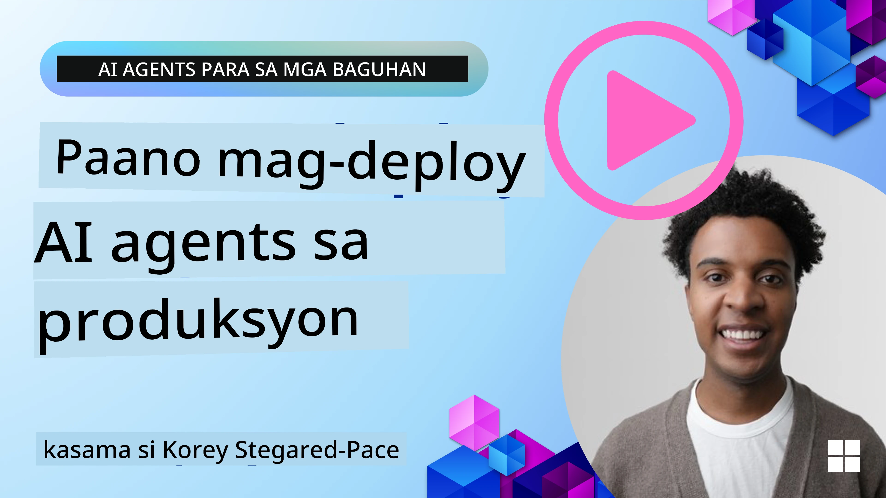

# Mga AI Agent sa Produksyon: Observability at Pagsusuri

[](https://youtu.be/l4TP6IyJxmQ?si=reGOyeqjxFevyDq9)

Habang lumilipat ang mga AI agent mula sa mga experimental na prototype patungo sa mga totoong aplikasyon, nagiging mahalaga ang kakayahang maunawaan ang kanilang kilos, subaybayan ang kanilang pagganap, at sistematikong suriin ang kanilang mga output.

## Mga Layunin sa Pagkatuto

Pagkatapos makumpleto ang araling ito, malalaman/mo mauunawaan mo:
- Mga pangunahing konsepto ng observability at pagsusuri ng agent
- Mga teknik para mapabuti ang pagganap, gastos, at bisa ng mga agent
- Ano at paano sistematikong susuriin ang iyong mga AI agent
- Paano kontrolin ang gastos kapag nagde-deploy ng mga AI agent sa produksyon
- Paano i-instrument ang mga agent na binuo gamit ang AutoGen

Ang layunin ay bigyan ka ng kaalaman para gawing transparent, madaling pamahalaan, at mapagkakatiwalaan ang iyong mga "black box" na agent.

_**Tandaan:** Mahalaga na mag-deploy ng mga AI Agent na ligtas at mapagkakatiwalaan. Tingnan din ang araling [Pagbuo ng Mapagkakatiwalaang AI Agents](../06-building-trustworthy-agents/README.md)._

## Traces and Spans

Ang mga tool sa observability tulad ng [Langfuse](https://langfuse.com/) o [Microsoft Foundry](https://learn.microsoft.com/en-us/azure/ai-foundry/what-is-azure-ai-foundry) kadalasan ay kumakatawan sa mga takbo ng agent bilang traces at spans.

- **Trace** kumakatawan sa isang kumpletong gawain ng agent mula sa simula hanggang sa katapusan (hal., paghawak ng tanong ng user).
- **Spans** ay mga indibidwal na hakbang sa loob ng trace (hal., pagtawag sa isang language model o pagkuha ng data).


Kung walang observability, ang isang AI agent ay maaaring magmukhang isang "black box" — ang panloob nitong estado at pangangatwiran ay hindi maliwanag, na nagpapahirap mag-diagnose ng mga isyu o mag-optimize ng pagganap. Sa observability, nagiging "glass box" ang mga agent, nagbibigay ng transparency na mahalaga para bumuo ng tiwala at matiyak na gumagana sila ayon sa inaasahan. 

## Bakit Mahalaga ang Observability sa Mga Kapaligiran ng Produksyon

Ang paglipat ng mga AI agent sa produksyon ay nagdudulot ng bagong hanay ng mga hamon at kinakailangan. Ang observability ay hindi na isang "magandang meron lamang" kundi isang kritikal na kakayahan:

*   **Pag-debug at Pagsusuri ng Ugat ng Suliranin:** Kapag nabigo ang isang agent o naglabas ng hindi inaasahang output, nagbibigay ang mga tool ng observability ng mga trace na kailangan upang tukuyin ang pinagmulan ng error. Ito ay lalong mahalaga sa mga komplikadong agent na maaaring gumamit ng maraming LLM call, pakikipag-ugnayan sa mga tool, at kondisyunal na lohika.
*   **Pamamahala ng Latency at Gastos:** Madalas umaasa ang mga AI agent sa mga LLM at iba pang external API na sinisingil batay sa token o bawat tawag. Pinapayagan ng observability ang tumpak na pagsubaybay sa mga tawag na ito, na tumutulong tukuyin ang mga operasyon na labis ang bagal o mahal. Nakakatulong ito sa mga koponan na i-optimize ang mga prompt, pumili ng mas episyenteng modelo, o muling idisenyo ang mga workflow upang pamahalaan ang operational na gastos at matiyak ang magandang karanasan ng user.
*   **Tiwala, Kaligtasan, at Pagsunod:** Sa maraming aplikasyon, mahalaga na matiyak na kumikilos ang mga agent nang ligtas at etikal. Nagbibigay ang observability ng audit trail ng mga aksyon at desisyon ng agent. Magagamit ito upang matukoy at mabawasan ang mga isyu tulad ng prompt injection, pagbuo ng nakapipinsalang nilalaman, o maling paghawak ng personally identifiable information (PII). Halimbawa, maaari mong repasuhin ang mga trace para maunawaan kung bakit nagbigay ang agent ng isang partikular na tugon o gumamit ng isang tiyak na tool.
*   **Tuloy-tuloy na Loop ng Pagpapabuti:** Ang data ng observability ang pundasyon ng isang iterative na proseso ng pag-develop. Sa pamamagitan ng pagmamanman kung paano nagpe-perform ang mga agent sa totoong mundo, maaaring tukuyin ng mga koponan ang mga lugar na nangangailangan ng pagpapabuti, mangalap ng data para sa fine-tuning ng mga modelo, at beripikahin ang epekto ng mga pagbabago. Lumilikha ito ng feedback loop kung saan ang mga insight mula sa online evaluation sa produksyon ay nag-iinform sa offline na eksperimento at pagbuti, na humahantong sa unti-unting pagtaas ng pagganap ng agent.

## Mga Pangunahing Metrik na Sundan

Upang subaybayan at maunawaan ang kilos ng agent, dapat subaybayan ang iba't ibang metrik at signal. Habang maaaring mag-iba ang partikular na metrik depende sa layunin ng agent, ang ilan ay pangkalahatang mahalaga.

Narito ang ilan sa mga pinakakaraniwang metrik na sinusubaybayan ng mga tool sa observability:

**Latency:** Gaano kabilis tumugon ang agent? Ang mahabang paghihintay ay negatibong nakakaapekto sa karanasan ng user. Dapat sukatin ang latency para sa mga gawain at indibidwal na hakbang sa pamamagitan ng pag-trace ng mga takbo ng agent. Halimbawa, ang isang agent na kumukuha ng 20 segundo para sa lahat ng model calls ay maaaring pabilisin sa pamamagitan ng paggamit ng mas mabilis na modelo o pagpapatakbo ng mga tawag sa modelo nang sabay-sabay.

**Costs:** Magkano ang gastos kada takbo ng agent? Umaasa ang mga AI agent sa mga LLM call na sinisingil kada token o sa mga external API. Ang madalas na paggamit ng tool o maraming prompt ay maaaring mabilis magpataas ng gastos. Halimbawa, kung tumatawag ang agent sa LLM ng limang beses para sa bara-bara lamang na pagbuti ng kalidad, kailangang suriin kung makatwiran ang gastos o maaari mong bawasan ang bilang ng tawag o gumamit ng mas murang modelo. Makakatulong din ang real-time monitoring upang tuklasin ang hindi inaasahang pagtaas (hal., bugs na nagdudulot ng labis na API loops).

**Request Errors:** Ilan ang mga request na nabigo ang agent? Maaari itong kabilang ang mga API error o nabigong tawag sa tool. Upang gawing mas matatag ang iyong agent sa produksyon laban sa mga ito, maaari kang mag-set up ng fallbacks o retries. Hal., kung down ang LLM provider A, maaari kang mag-switch sa LLM provider B bilang backup.

**User Feedback:** Ang pagpapatupad ng direktang pagsusuri ng user ay nagbibigay ng mahahalagang insight. Kasama rito ang mga tahasang rating (👍thumbs-up/👎down, ⭐1-5 stars) o tekstuwal na komento. Ang patuloy na negatibong feedback ay dapat mag-alerto sa iyo dahil senyales ito na hindi gumagana ang agent ayon sa inaasahan. 

**Implicit User Feedback:** Nagbibigay ng di-tuwirang feedback ang kilos ng user kahit wala silang tahasang rating. Maaaring kabilang dito ang agarang pag-rephrase ng tanong, paulit-ulit na query, o pag-click sa retry button. Hal., kung nakikita mong paulit-ulit na tinatanong ng mga user ang parehong tanong, ito ay senyales na hindi gumagana ang agent ayon sa inaasahan.

**Accuracy:** Gaano kadalas nagbibigay ang agent ng tama o kanais-nais na mga output? Nag-iiba ang mga depinisyon ng katumpakan (hal., kawastuhan sa paglutas ng problema, kawastuhan sa information retrieval, kasiyahan ng user). Ang unang hakbang ay tukuyin kung ano ang hitsura ng tagumpay para sa iyong agent. Maaari mong subaybayan ang accuracy sa pamamagitan ng automated checks, evaluation scores, o mga label ng pagkumpleto ng gawain. Halimbawa, pagmamarka sa mga trace bilang "succeeded" o "failed". 

**Automated Evaluation Metrics:** Maaari mo ring i-set up ang automated evals. Halimbawa, maaari mong gamitin ang isang LLM upang i-score ang output ng agent hal., kung ito ay nakakatulong, tama, o hindi. Mayroon ding ilang open source na library na tumutulong i-score ang iba't ibang aspeto ng agent. Hal., [RAGAS](https://docs.ragas.io/) para sa RAG agents o [LLM Guard](https://llm-guard.com/) para tuklasin ang nakapipinsalang wika o prompt injection. 

Sa praktika, ang kumbinasyon ng mga metrik na ito ang nagbibigay ng pinakamainam na saklaw ng kalusugan ng isang AI agent. Sa kabanatang ito [halimbawang notebook](./code_samples/10_autogen_evaluation.ipynb), ipapakita namin kung paano lumilitaw ang mga metrik na ito sa mga tunay na halimbawa pero una, pag-aaralan muna natin kung ano ang karaniwang itsura ng isang evaluation workflow.

## I-instrument ang iyong AI Agent

Upang makakalap ng tracing data, kailangan mong i-instrument ang iyong code. Ang layunin ay i-instrument ang code ng agent upang mag-output ng mga trace at metrik na maaaring makuha, maproseso, at ma-visualize ng isang observability platform.

**OpenTelemetry (OTel):** Ang [OpenTelemetry](https://opentelemetry.io/) ay umusbong bilang isang industry standard para sa LLM observability. Nagbibigay ito ng set ng mga API, SDK, at tool para sa pag-generate, pagkolekta, at pag-export ng telemetry data. 

Maraming instrumentation library ang bumabalot sa umiiral na mga framework ng agent at nagpapadali para i-export ang OpenTelemetry spans sa isang observability tool. Nasa ibaba ang isang halimbawa ng pag-i-instrument ng isang AutoGen agent gamit ang [OpenLit instrumentation library](https://github.com/openlit/openlit):

```python
import openlit

openlit.init(tracer = langfuse._otel_tracer, disable_batch = True)
```

Ang [halimbawang notebook](./code_samples/10_autogen_evaluation.ipynb) sa kabanatang ito ay magpapakita kung paano i-instrument ang iyong AutoGen agent.

**Manual Span Creation:** Habang nagbibigay ang mga instrumentation library ng magandang panimulang antas, madalas may mga kaso kung saan kailangan ang mas detalyado o pasadyang impormasyon. Maaari kang manu-manong gumawa ng spans upang magdagdag ng pasadyang lohika ng aplikasyon. Mas mahalaga, maaari nilang pagyamanin ang awtomatikong o manu-manong nagawang spans ng pasadyang attributes (kilala rin bilang tags o metadata). Kasama sa mga attribute na ito ang business-specific na data, mga intermediate na kalkulasyon, o anumang konteksto na maaaring maging kapaki-pakinabang para sa pag-debug o analisis, gaya ng `user_id`, `session_id`, o `model_version`.

Halimbawa ng manu-manong paggawa ng traces at spans gamit ang [Langfuse Python SDK](https://langfuse.com/docs/sdk/python/sdk-v3): 

```python
from langfuse import get_client
 
langfuse = get_client()
 
span = langfuse.start_span(name="my-span")
 
span.end()
```

## Pagsusuri ng Agent

Nagbibigay ang observability ng mga metrik, ngunit ang pagsusuri ay ang proseso ng pag-aanalisa ng mga datos na iyon (at pagsasagawa ng mga test) upang matukoy kung gaano kahusay ang pagganap ng isang AI agent at kung paano ito mapapabuti. Sa ibang salita, kapag nakuha mo na ang mga trace at metrik na iyon, paano mo gagamitin ang mga ito upang hatulan ang agent at gumawa ng mga desisyon? 

Mahalaga ang regular na pagsusuri dahil madalas na hindi deterministic ang mga AI agent at maaaring mag-evolve (sa pamamagitan ng mga update o pagbabago sa pag-uugali ng modelo) – kung walang pagsusuri, hindi mo malalaman kung ang iyong "matalinong agent" ay talagang gumagawa ng maayos na trabaho o nagkaroon ng regression.

May dalawang kategorya ng pagsusuri para sa mga AI agent: **evaluasyong online** at **evaluasyong offline**. Pareho silang mahalaga at nagko-komplemento sa isa't isa. Kadalasan nagsisimula tayo sa evaluasyong offline, dahil ito ang minimum na kinakailangang hakbang bago mag-deploy ng anumang agent.

### Evaluasyong Offline


Kasama rito ang pagsusuri ng agent sa isang kontroladong setting, karaniwang gamit ang mga test dataset, hindi mga live na query ng user. Gumagamit ka ng mga curated na dataset kung saan alam mo ang inaasahang output o tamang kilos, at saka pinapatakbo ang iyong agent sa mga ito. 

Halimbawa, kung gumawa ka ng agent para sa mga math word-problem, maaari kang magkaroon ng isang [halimbawang dataset](https://huggingface.co/datasets/gsm8k) ng 100 problema na may kilalang sagot. Kadalasang ginagawa ang evaluasyong offline habang nasa development (at maaaring bahagi ng CI/CD pipelines) upang suriin ang mga pagbuti o pigilan ang mga regression. Ang bentahe ay ito ay **nauulit at makakakuha ka ng malinaw na accuracy metrics dahil mayroon kang ground truth**. Maaari mo ring i-simulate ang mga tanong ng user at sukatin ang mga tugon ng agent laban sa ideal na mga sagot o gumamit ng automated na metrik tulad ng nabanggit sa itaas. 

Ang pangunahing hamon sa offline eval ay ang tiyakin na komprehensibo at nananatiling may kaugnayan ang iyong test dataset – maaaring mag-perform nang mabuti ang agent sa isang fixed na test set ngunit makatagpo ng ibang uri ng query sa produksyon. Samakatuwid, dapat mong panatilihing updated ang mga test set ng mga bagong edge case at mga halimbawa na sumasalamin sa mga totoong senaryo​. Makatutulong ang halo ng maliit na “smoke test” na mga kaso at mas malalaking evaluation set: maliit para sa mabilisang tseke at malaki para sa mas malawak na metrik ng pagganap​.

### Evaluasyong Online 


Ito ay tumutukoy sa pagsusuri ng agent sa isang live, totoong kapaligiran, ibig sabihin sa aktwal na paggamit sa produksyon. Kasama sa online evaluation ang pagmamanman ng pagganap ng agent sa mga totoong interaksyon ng user at patuloy na pag-aanalisa ng mga resulta. 

Halimbawa, maaari mong subaybayan ang success rates, user satisfaction scores, o iba pang metrik sa live traffic. Ang kalamangan ng evaluasyong online ay na **nahuhuli nito ang mga bagay na maaaring hindi mo inaasahan sa lab setting** – maaari mong obserbahan ang model drift sa paglipas ng panahon (kung bumababa ang bisa ng agent habang nagbabago ang pattern ng input) at mahuli ang mga hindi inaasahang query o sitwasyon na wala sa iyong test data​. Nagbibigay ito ng totoong larawan kung paano kumikilos ang agent sa totoong mundo. 

Kadalasan kasama sa online evaluation ang pagkolekta ng implicit at explicit user feedback, tulad ng napag-usapan, at posibleng pagpapatakbo ng shadow tests o A/B tests (kung saan tumatakbo ang isang bagong bersyon ng agent nang kasabay para ikumpara sa luma). Ang hamon ay maaaring maging mahirap makakuha ng maaasahang labels o score para sa live interactions – maaaring umasa ka sa feedback ng user o downstream metrics (hal., nag-click ba ang user sa resulta). 

### Pagsasama ng dalawa

Ang evaluasyong online at offline ay hindi magkaibang mundo; lubhang komplementaryo ang mga ito. Ang mga insight mula sa online monitoring (hal., bagong uri ng query ng user kung saan mahina ang agent) ay magagamit upang palawakin at pagandahin ang mga offline test dataset. Sa kabilang banda, ang mga agent na mahusay sa offline tests ay mas may kumpiyansang ma-deploy at mamamanman online. 

Sa katunayan, maraming koponan ang gumagamit ng isang loop: 

_suriin offline -> ideploy -> imonitor online -> kolektahin ang mga bagong kaso ng pagkabigo -> idagdag sa offline dataset -> pinuhin ang agent -> ulitin_.

## Mga Karaniwang Isyu

Habang dine-deploy mo ang mga AI agent sa produksyon, maaari kang makatagpo ng iba't ibang hamon. Narito ang ilang karaniwang isyu at ang kanilang posibleng solusyon:

| **Isyu**    | **Posibleng Solusyon**   |
| ------------- | ------------------ |
| Hindi palaging gumaganap nang pare-pareho ang AI Agent sa mga gawain | - Pinuhin ang prompt na ibinibigay sa AI Agent; maging malinaw sa mga layunin.<br>- Tukuyin kung saan makatutulong ang paghahati ng mga gawain sa mga subtasks at paghawak ng mga ito ng maraming agent. |
| Paulit-ulit na pag-uulit (continuous loops) na nangyayari sa AI Agent  | - Siguruhing mayroon kang malinaw na mga kondisyon ng pagtatapos upang malaman ng Agent kung kailan titigil sa proseso.<br>- Para sa mga komplikadong gawain na nangangailangan ng pangangatwiran at pagpaplano, gumamit ng mas malaking modelo na espesyalista sa mga reasoning task. |
| Hindi maganda ang pagganap ng mga tawag sa mga tool ng AI Agent   | - Subukan at beripikahin ang output ng tool sa labas ng system ng agent.<br>- Pinuhin ang mga tinukoy na parameter, mga prompt, at pagbibigay-ngalan ng mga tool.  |
| Hindi pare-parehong pagganap ng Multi-Agent system | - Pinuhin ang mga prompt na ibinibigay sa bawat agent upang matiyak na sila ay tiyak at magkakaiba sa isa’t isa.<br>- Bumuo ng hierarchical system gamit ang "routing" o controller agent upang tukuyin kung aling agent ang tama. |

Marami sa mga isyung ito ay maaaring mas madaling matukoy kapag may observability. Nakakatulong ang mga trace at metrik na napag-usapan natin upang eksaktong matukoy kung saan sa workflow ng agent nagaganap ang mga problema, na nagpapadali sa pag-debug at optimisasyon.

## Pamamahala ng Gastos
Narito ang ilang estratehiya para pamahalaan ang mga gastos sa pag-deploy ng mga AI agent sa produksyon:

**Paggamit ng Mas Maliit na Modelo:** Small Language Models (SLMs) ay maaaring mag-perform nang mahusay sa ilang agentic na use-case at makabuluhang magbabawas ng gastos. Tulad ng nabanggit kanina, ang paggawa ng isang evaluation system para tukuyin at ihambing ang performance kumpara sa mas malalaking modelo ay ang pinakamahusay na paraan para maunawaan kung gaano kahusay mag-perform ang isang SLM sa iyong use case. Isaalang-alang ang paggamit ng SLMs para sa mas simpleng gawain tulad ng pag-uuri ng intensyon o pagkuha ng mga parameter, habang inireserba ang mas malalaking modelo para sa kumplikadong reasoning.

**Paggamit ng Router Model:** Katulad na estratehiya ang paggamit ng iba't ibang modelo at laki. Maaari kang gumamit ng LLM/SLM o serverless function para i-route ang mga kahilingan batay sa pagiging kumplikado papunta sa pinaka-angkop na mga modelo. Makakatulong din ito na bawasan ang gastos habang tinitiyak ang performance sa tamang gawain. Halimbawa, i-route ang mga simpleng query sa mas maliliit, mas mabilis na mga modelo, at gamitin lamang ang mamahaling malalaking modelo para sa mga gawain na nangangailangan ng kumplikadong pag-iisip.

**Caching Responses:** Ang pagtukoy ng mga karaniwang kahilingan at gawain at pagbibigay ng mga sagot bago pa man dumaan sa iyong agentic system ay isang mahusay na paraan para bawasan ang dami ng magkakatulad na kahilingan. Maaari mo ring ipatupad ang isang daloy upang tukuyin kung gaano pagkakahawig ang isang kahilingan sa iyong mga naka-cache na kahilingan gamit ang mas simpleng mga AI model. Malaki ang maitutulong ng estratehiyang ito sa pagbabawas ng gastos para sa madalas na tinatanong o karaniwang mga workflow.

## Tingnan natin kung paano ito gumagana sa praktika

Sa [example notebook of this section](./code_samples/10_autogen_evaluation.ipynb), makikita natin ang mga halimbawa kung paano natin magagamit ang mga observability tool para subaybayan at suriin ang ating agent.

### May Mga Karagdagang Tanong tungkol sa mga AI Agent sa Produksyon?

Sumali sa [Microsoft Foundry Discord](https://aka.ms/ai-agents/discord) para makipagkita sa iba pang mga nag-aaral, dumalo sa office hours at masagot ang iyong mga tanong tungkol sa AI Agents.

## Nakaraang Aralin

[Pattern ng Disenyo ng Metacognition](../09-metacognition/README.md)

## Susunod na Aralin

[Mga Agentic Protocol](../11-agentic-protocols/README.md)

---

<!-- CO-OP TRANSLATOR DISCLAIMER START -->
Paunawa:
Ang dokumentong ito ay isinalin gamit ang AI translation service [Co-op Translator](https://github.com/Azure/co-op-translator). Bagaman nagsusumikap kami na maging tumpak, pakatandaan na ang mga awtomatikong pagsasalin ay maaaring maglaman ng mga pagkakamali o di-tumpak na paglalahad. Ang orihinal na dokumento sa katutubong wika nito ang dapat ituring na opisyal na sanggunian. Para sa mahahalagang impormasyon, inirerekomenda ang propesyonal na pagsasaling‑tao ng isang tao. Hindi kami mananagot para sa anumang hindi pagkakaunawaan o maling interpretasyon na nagmumula sa paggamit ng pagsasaling ito.
<!-- CO-OP TRANSLATOR DISCLAIMER END -->