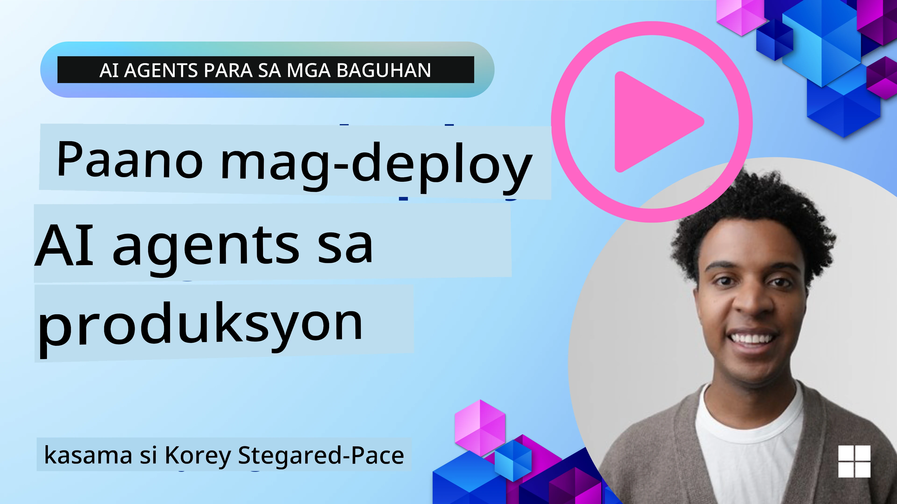

# Mga AI Agent sa Produksyon: Obserbabilidad at Pagsusuri

[](https://youtu.be/l4TP6IyJxmQ?si=reGOyeqjxFevyDq9)

Habang ang mga AI agent ay lumilipat mula sa mga eksperimento patungo sa mga aplikasyon sa totoong mundo, nagiging mahalaga ang kakayahang maunawaan ang kanilang kilos, bantayan ang kanilang pagganap, at sistematikong suriin ang kanilang mga output.

## Mga Layunin sa Pagkatuto

Pagkatapos makumpleto ang araling ito, malalaman mo/maiintindihan mo:
- Mga pangunahing konsepto ng obserbabilidad at pagsusuri ng agent
- Mga teknik para mapabuti ang pagganap, gastos, at bisa ng mga agent
- Ano at paano sistematikong suriin ang iyong mga AI agent
- Paano kontrolin ang mga gastos sa pag-deploy ng AI agent sa produksyon
- Paano gamitan ng instrumento ang mga agent na ginawa gamit ang Microsoft Agent Framework

Layunin nito na bigyan ka ng kaalaman upang gawing transparent, namamahala, at maaasahang mga sistema ang iyong mga "black box" na agent.

_**Tandaan:** Mahalaga ang pag-deploy ng mga AI Agent na ligtas at mapagkakatiwalaan. Tingnan din ang aralin na [Building Trustworthy AI Agents](../06-building-trustworthy-agents/README.md)._

## Mga Trace at Span

Ang mga observability tool tulad ng [Langfuse](https://langfuse.com/) o [Microsoft Foundry](https://learn.microsoft.com/en-us/azure/ai-foundry/what-is-azure-ai-foundry) ay kadalasang kumakatawan sa mga takbo ng agent bilang mga trace at span.

- **Trace** ay kumakatawan sa isang kumpletong gawain ng agent mula simula hanggang katapusan (hal., pagsagot sa query ng user).
- **Span** ay mga indibidwal na hakbang sa loob ng trace (hal., pagtawag ng language model o pagkuha ng datos).


<!-- Image URL retained for illustration purposes -->

Kung walang obserbabilidad, ang isang AI agent ay maaaring tila isang "black box" - ang panloob nitong estado at pag-iisip ay hindi malinaw, kaya mahirap tukuyin ang problema o i-optimize ang pagganap. Sa obserbabilidad, ang mga agent ay nagiging "glass boxes," na nagbibigay ng transparency na mahalaga para makabuo ng tiwala at matiyak na gumagana sila ayon sa nilalayong paraan.

## Bakit Mahalaga ang Observability sa Mga Kapaligiran ng Produksyon

Ang paglilipat ng mga AI agent sa mga kapaligiran ng produksyon ay nagdadala ng mga bagong hamon at pangangailangan. Ang obserbabilidad ay hindi na isang "magandang meron lang" kundi isang kritikal na kakayahan:

*   **Pag-debug at Pagsusuri sa Pinag-ugatan ng Problema**: Kapag nabigo ang isang agent o naglabas ng hindi inaasahang output, nagbibigay ang mga obserbability tool ng mga trace upang matukoy ang pinagmulan ng error. Mahalaga ito lalo na sa mga komplikadong agent na maaaring may maraming tawag sa LLM, interaksyon sa mga tool, at lohika na kondisyonal.
*   **Pamamahala ng Latency at Gastos**: Kadalasan, umaasa ang mga AI agent sa LLM at iba pang external APIs na sinisingil bawat token o bawat tawag. Pinapayagan ng obserbabilidad ang tumpak na pagsubaybay sa mga tawag na ito, na tumutulong tukuyin ang mga operasyon na sobrang bagal o mahal. Pinapahintulutan nito ang mga team na i-optimize ang mga prompt, pumili ng mas epektibong modelo, o baguhin ang mga workflow para mapamahalaan ang gastos at masiguro ang magandang karanasan sa user.
*   **Tiwala, Kaligtasan, at Pagsunod sa Alituntunin**: Sa maraming aplikasyon, mahalagang tiyakin na ang mga agent ay kumikilos nang ligtas at etikal. Nagbibigay ang obserbabilidad ng audit trail ng mga aksyon at desisyon ng agent. Maaaring gamitin ito upang tuklasin at harapin ang mga isyu tulad ng prompt injection, paggawa ng mapanganib na nilalaman, o maling paghawak ng personal na impormasyon (PII). Halimbawa, maaari mong suriin ang mga trace upang maintindihan kung bakit nagbigay ang agent ng isang tiyak na tugon o gumamit ng partikular na tool.
*   **Patuloy na Proseso ng Pagpapabuti**: Ang datos mula sa obserbabilidad ay pundasyon ng prosesong paulit-ulit na pag-develop. Sa pamamagitan ng pagmamanman kung paano gumagana ang mga agent sa totoong mundo, maaaring matukoy ng mga team ang mga lugar na dapat pagbutihin, mangalap ng data para sa fine-tuning ng mga modelo, at beripikahin ang epekto ng mga pagbabago. Lumilikha ito ng feedback loop kung saan ang mga insight mula sa online evaluation sa produksyon ay nagtutulak ng offline na eksperimento at pagpipino, na nagreresulta sa unti-unting pagbuti ng pagganap ng agent.

## Mga Mahahalagang Sukatan na Dapat Subaybayan

Upang bantayan at maunawaan ang kilos ng agent, isang hanay ng mga sukatan at signal ang dapat subaybayan. Habang maaaring mag-iba ang partikular na sukatan batay sa layunin ng agent, may ilang mahahalaga nang pangkalahatan.

Narito ang ilan sa mga karaniwang sukatan na sinusubaybayan ng mga observability tool:

**Latency:** Gaano kabilis tumugon ang agent? Ang mahahabang paghihintay ay negatibong nakakaapekto sa karanasan ng user. Dapat sukatin ang latency para sa mga gawain at bawat hakbang sa pagsubaybay ng takbo ng agent. Halimbawa, ang agent na nangangailangan ng 20 segundo para sa lahat ng tawag sa modelo ay maaaring pabilisin sa paggamit ng mas mabilis na modelo o sa pagpapatakbo ng mga tawag nang sabay-sabay.

**Gastos:** Magkano ang gastos bawat takbo ng agent? Umaasa ang AI agent sa mga tawag sa LLM na sinisingil kada token o sa mga external API. Ang madalas na paggamit ng tool o maraming prompt ay nagpapataas mabilis ng gastos. Halimbawa, kung limang beses tumawag ang agent sa LLM para sa kaunting pagbuti ng kalidad, dapat mong alamin kung makatarungan ang gastos o kung maaari mong bawasan ang bilang ng tawag o gumamit ng mas murang modelo. Makakatulong rin ang real-time monitoring upang matukoy ang hindi inaasahang pagtaas ng gastos (hal., bug na sanhi ng paulit-ulit na loops sa API).

**Mga Error sa Request:** Gaano karaming mga request ang nabigo ng agent? Maaaring kabilang dito ang mga error sa API o nabigong tawag sa tool. Upang maging mas matibay ang iyong agent laban dito sa produksyon, maaari kang mag-set up ng fallback o retries. Halimbawa, kung mababa ang LLM provider A, lumipat ka sa LLM provider B bilang backup.

**Feedback ng User:** Ang pagsagawa ng direktang pagsusuri mula sa user ay nagbibigay ng mahalagang insight. Kasama dito ang mga tahasang rating (👍thumbs-up/👎down, ⭐1-5 star) o mga tekstwal na komento. Ang tuloy-tuloy na negatibong feedback ay dapat magbigay-alam sa iyo dahil ito ay palatandaan na hindi maayos ang pagganap ng agent.

**Implicit User Feedback:** Nagbibigay ng di-tahasang feedback ang mga kilos ng user kahit walang tahasang rating. Maaaring kasama dito ang agarang pagrephrase ng tanong, paulit-ulit na pagtatanong, o pag-click ng retry button. Halimbawa, kung napapansin mong paulit-ulit na tinatanong ng user ang parehong tanong, ito ay senyales na hindi maayos ang gawain ng agent.

**Katumpakan:** Gaano kadalas naglalabas ng tamang o kanais-nais na output ang agent? Nag-iiba ang mga depinisyon ng katumpakan (hal., tama ba ang pagsagot sa problema, katumpakan sa pagkuha ng impormasyon, kasiyahan ng user). Ang unang hakbang ay tukuyin kung ano ang itsura ng tagumpay para sa iyong agent. Maaari mong subaybayan ang katumpakan gamit ang mga automated check, evaluation scores, o task completion labels. Halimbawa, pagtanda sa mga trace bilang "nagawa ng maayos" o "nabigo."

**Automated Evaluation Metrics:** Maaari ka ring mag-set up ng automated evals. Halimbawa, maaari mong gamitin ang LLM upang i-score ang output ng agent kung ito ay kapaki-pakinabang, tama, o hindi. Mayroong mga open source libraries na tumutulong sa pag-score ng iba't ibang aspeto ng agent. Halimbawa, [RAGAS](https://docs.ragas.io/) para sa mga RAG agent o [LLM Guard](https://llm-guard.com/) upang tuklasin ang mapanganib na lenggwahe o prompt injection.

Sa praktika, isang kombinasyon ng mga sukatan na ito ang nagbibigay ng pinakamahusay na coverage sa kalusugan ng AI agent. Sa [halimbawa ng notebook](./code_samples/10-expense_claim-demo.ipynb) sa kabanatang ito, ipapakita namin kung paano lumilitaw ang mga sukatan sa totoong mga halimbawa ngunit una, aalamin muna natin kung paano ang karaniwang workflow ng pagsusuri.

## Instrumentuhin ang Iyong Agent

Upang makalikom ng tracing data, kailangan mong instrumentuhin ang iyong code. Layunin nito na instrumentuhin ang code ng agent upang maglabas ng mga trace at sukatan na maaaring makuha, maproseso, at mailarawan ng isang obserbability platform.

**OpenTelemetry (OTel):** Ang [OpenTelemetry](https://opentelemetry.io/) ay naging industry standard para sa obserbabilidad ng LLM. Nagbibigay ito ng set ng APIs, SDKs, at mga tool para sa paggawa, pagkolekta, at pag-export ng telemetry data.

Maraming instrumentation libraries na nagbabalot ng mga umiiral na agent framework at nagpapadali sa pag-export ng OpenTelemetry spans sa isang obserbability tool. Ang Microsoft Agent Framework ay native na integratado sa OpenTelemetry. Nasa ibaba ang halimbawa ng pag-instrument sa isang MAF agent:

```python
from agent_framework.observability import get_tracer, get_meter

tracer = get_tracer()
meter = get_meter()

with tracer.start_as_current_span("agent_run"):
    # Ang pagsubaybay sa pagganap ng ahente ay awtomatiko
    pass
```

Ang [halimbawa ng notebook](./code_samples/10-expense_claim-demo.ipynb) sa kabanatang ito ay magpapakita kung paano i-instrument ang iyong MAF agent.

**Manwal na Paglikha ng Span:** Habang nagbibigay ang mga instrumentation library ng magandang baseline, may mga pagkakataon na kailangan ng mas detalyado o custom na impormasyon. Maaari kang gumawa ng span nang manwal para magdagdag ng custom application logic. Higit pa rito, maaari nilang payamanin ang mga awtomatiko o manwal na mga span gamit ang custom na attributes (tinatawag ding tags o metadata). Maaaring kabilang dito ang data na specific sa negosyo, mga intermediate na kalkulasyon, o anumang konteksto na maaaring makatulong sa pag-debug o pagsusuri, tulad ng `user_id`, `session_id`, o `model_version`.

Halimbawa ng manwal na paggawa ng traces at spans gamit ang [Langfuse Python SDK](https://langfuse.com/docs/sdk/python/sdk-v3):

```python
from langfuse import get_client
 
langfuse = get_client()
 
span = langfuse.start_span(name="my-span")
 
span.end()
```

## Pagsusuri ng Agent

Nagbibigay ang obserbabilidad ng mga sukatan, ngunit ang pagsusuri ay ang proseso ng pag-aanalisa ng datos na iyon (at pagsasagawa ng mga pagsubok) upang matukoy kung gaano kahusay gumaganap ang AI agent at kung paano ito mapapabuti. Sa madaling salita, kapag nakuha mo na ang mga trace at sukatan, paano mo ito gagamitin upang husgahan ang agent at gumawa ng mga desisyon?

Mahalaga ang regular na pagsusuri dahil madalas ang mga AI agent ay hindi deterministic at maaaring mag-evolve (sa pamamagitan ng mga update o pagbabago ng pag-uugali ng modelo) – kung walang pagsusuri, hindi mo malalaman kung ang iyong “matalinong agent” ay talagang nagagawa ang kanyang trabaho ng maayos o bumagsak.

May dalawang kategorya ng pagsusuri para sa AI agent: **online evaluation** at **offline evaluation**. Pareho silang mahalaga at nagko-komplemento. Karaniwan, nagsisimula tayo sa offline evaluation dahil ito ang minimum na hakbang bago mag-deploy ng anumang agent.

### Offline Evaluation


Ito ay pagsusuri ng agent sa isang kontroladong kapaligiran, karaniwang ginagamit ang mga test dataset, hindi aktwal na user queries. Ginagamit mo ang mga curated dataset kung saan alam mo ang inaasahang output o tamang kilos, at saka mong pinapatakbo ang iyong agent doon.

Halimbawa, kung gumawa ka ng agent para sa math word problem, maaaring mayroon kang [test dataset](https://huggingface.co/datasets/gsm8k) ng 100 problema na may kilalang sagot. Kadalasang ginagawa ang offline evaluation habang nagde-develop (at maaaring bahagi ng CI/CD pipeline) upang tingnan ang mga pagbuti o maiwasan ang regresyon. Ang benepisyo nito ay **maaaring ulitin ito at makakakuha ka ng malinaw na accuracy metrics dahil may ground truth ka**. Maaari ka ring mag-simulate ng mga tanong ng user at sukatin ang tugon ng agent laban sa mga ideal na sagot o gumamit ng awtomatikong sukatan gaya ng nabanggit sa itaas.

Ang pangunahing hamon sa offline eval ay tiyaking kumpleto at may kaugnayan ang iyong test dataset – maaaring magaling ang agent sa isang fixed na test set ngunit makaranas ng ibang tanong sa produksyon. Kaya dapat regular mong ina-update ang mga test set ng mga bagong edge case at halimbawa na sumasalamin sa mga totoong sitwasyon​. Kapaki-pakinabang ang halo ng maliliit na “smoke test” cases at mas malalaking evaluation sets: maliit para sa mabilisang tseke at malaki para sa mas malawak na sukatan ng pagganap​.

### Online Evaluation


Ito ay tumutukoy sa pagsusuri ng agent sa isang buhay na, totoong kapaligiran, halimbawa sa aktwal na paggamit sa produksyon. Ang online evaluation ay kinabibilangan ng pagmamanman sa pagganap ng agent sa tunay na interaksyon ng user at patuloy na pagsusuri sa mga resulta.

Halimbawa, maaari mong subaybayan ang success rate, mga score ng kasiyahan ng user, o iba pang sukatan sa live traffic. Ang bentahe ng online evaluation ay **nakukuha nito ang mga bagay na hindi mo inaasahan sa laboratoryo** – makikita mo ang pag-drift ng modelo sa paglipas ng panahon (kung bumababa ang bisa ng agent habang nagbabago ang mga pattern ng input) at mahuhuli ang mga hindi inaasahang tanong o sitwasyon na wala sa test data​. Nagbibigay ito ng tunay na larawan kung paano gumalaw ang agent sa totoong mundo.

Madalas kasama sa online evaluation ang pagkolekta ng implicit at explicit na-feedback ng user, tulad ng napag-usapan, at posibleng pagsasagawa ng shadow test o A/B test (kung saan ang bagong bersyon ng agent ay tumatakbo sabay sa luma upang ikumpara). Ang hamon ay maaaring mahirap makakuha ng mapagkakatiwalaang labels o score sa live interaction – maari kang umasa sa feedback ng user o downstream na sukatan (tulad ng kung nag-click ba ang user sa resulta).

### Pagsasama ng Dalawa

Hindi magkasalungat ang online at offline evaluation; sila ay malakas na nagtutulungan. Ang mga insight mula sa online monitoring (hal., bagong uri ng tanong ng user na mababa ang pagganap ng agent) ay maaari mong gamitin upang dagdagan at pagbutihin ang offline test dataset. Sa kabilang banda, ang mga agent na maganda ang pagganap sa offline test ay mas kumpiyansang maide-deploy at mamamanman sa online.

Sa katunayan, maraming team ang gumagamit ng loop:

_offline eval -> deploy -> online monitor -> kolektahin ang bagong failure case -> idagdag sa offline dataset -> paunlarin ang agent -> ulitin_.

## Karaniwang Isyu

Habang nagde-deploy ka ng AI agents sa produksyon, maaari kang makatagpo ng iba't ibang hamon. Narito ang ilang karaniwang isyu at posibleng solusyon:

| **Isyu**    | **Posibleng Solusyon**   |
| ------------- | ------------------ |
| Hindi konsistent ang pagganap ng AI Agent sa mga gawain | - Pinuhin ang prompt na ibinibigay sa AI Agent; linawin ang mga layunin.<br>- Tuklasin kung saan makakatulong ang paghahati ng gawain sa mga subtasks at pagtatalaga sa maraming agent. |
| Palaging umiikot ang AI Agent sa loop | - Siguraduhing may malinaw na termination terms at kondisyon para malaman ng Agent kung kailan titigil.<br>- Para sa mga komplikadong gawain na nangangailangan ng reasoning at planning, gumamit ng mas malaking modelo na espesyalista sa mga reasoning task. |
| Hindi maayos ang pagganap ng mga tawag sa AI Agent tool | - Subukan at suriin ang output ng tool sa labas ng system ng agent.<br>- Pinuhin ang mga tinukoy na parametro, prompt, at pangalan ng mga tool.  |
| Hindi consistent ang pagganap ng Multi-Agent system | - Pinuhin ang mga prompt na ibinibigay sa bawat agent upang maging specific at iba-iba.<br>- Gumawa ng hierarchical system gamit ang "routing" o controller agent para tukuyin kung aling agent ang tama. |

Marami sa mga isyung ito ay mas madaling matukoy kung may obserbabilidad. Ang mga trace at sukatan na naipaliwanag natin kanina ay tumutulong matukoy ang eksaktong lugar kung saan nagkakaroon ng problema sa workflow ng agent, kaya mas epektibo ang pag-debug at optimization.

## Pamamahala ng Gastos


Narito ang ilang mga estratehiya upang pamahalaan ang mga gastos sa pag-deploy ng mga AI agent sa produksyon:

**Paggamit ng Mas Maliit na Modelo:** Ang Maliliit na Language Models (SLMs) ay maaaring mag-perform nang maayos sa ilang mga use-case ng agentic at makakapagpababa nang malaki sa mga gastos. Tulad ng nabanggit kanina, ang paggawa ng isang evaluation system upang matukoy at ihambing ang performance kumpara sa mas malalaking modelo ang pinakamagandang paraan upang maunawaan kung gaano kahusay mag-perform ang isang SLM sa iyong use case. Isaalang-alang ang paggamit ng SLM para sa mga mas simpleng gawain tulad ng intent classification o parameter extraction, habang inilalaan ang mas malalaking modelo para sa mga kumplikadong pag-iisip.

**Paggamit ng Router Model:** Isang katulad na estratehiya ay ang paggamit ng iba't ibang modelo at laki. Maaari kang gumamit ng LLM/SLM o serverless function upang i-route ang mga kahilingan batay sa pagiging kumplikado sa mga pinaka-angkop na modelo. Makakatulong din ito upang mabawasan ang mga gastos habang tiniyak ang performance sa tamang mga gawain. Halimbawa, i-route ang mga simpleng query sa mas maliliit, mas mabilis na modelo, at gamitin lamang ang mamahaling malalaking modelo para sa mga kumplikadong gawain ng pag-iisip.

**Caching Responses:** Ang pagtukoy sa mga karaniwang kahilingan at gawain at pagbibigay ng mga sagot bago pa man dumaan sa iyong agentic system ay isang mahusay na paraan upang mabawasan ang dami ng mga magkakatulad na kahilingan. Maaari mo ring ipatupad ang isang flow upang tukuyin kung gaano kalapit ang isang kahilingan sa iyong mga naka-cache na kahilingan gamit ang mas simpleng mga AI model. Ang estratehiyang ito ay maaaring magpababa nang malaki sa mga gastos para sa mga madalas itanong na tanong o karaniwang workflow.

## Tingnan natin kung paano ito gumagana sa praktis

Sa [example notebook ng seksyong ito](./code_samples/10-expense_claim-demo.ipynb), makikita natin ang mga halimbawa kung paano natin magagamit ang mga observability tool upang subaybayan at suriin ang ating agent.


### May Higit Pang Mga Tanong tungkol sa AI Agents sa Produksyon?

Sumali sa [Microsoft Foundry Discord](https://discord.com/invite/ATgtXmAS5D) para makipagkita sa ibang mga nag-aaral, dumalo sa mga office hours at masagot ang iyong mga tanong tungkol sa AI Agents.

## Nakaraang Aralin

[Metacognition Design Pattern](../09-metacognition/README.md)

## Susunod na Aralin

[Agentic Protocols](../11-agentic-protocols/README.md)

---

<!-- CO-OP TRANSLATOR DISCLAIMER START -->
**Pagtatanggi**:
Ang dokumentong ito ay isinalin gamit ang serbisyo ng AI translation na [Co-op Translator](https://github.com/Azure/co-op-translator). Bagama't nagsusumikap kami para sa katumpakan, pakatandaan na ang awtomatikong pagsasalin ay maaaring maglaman ng mga pagkakamali o hindi pagkakatugma. Ang orihinal na dokumento sa orihinal nitong wika ang dapat ituring na pangunahing sanggunian. Para sa mahahalagang impormasyon, inirerekomenda ang propesyonal na pagsasalin ng tao. Hindi kami mananagot sa anumang maling pagkakaintindi o maling interpretasyon na nagmula sa paggamit ng pagsasaling ito.
<!-- CO-OP TRANSLATOR DISCLAIMER END -->