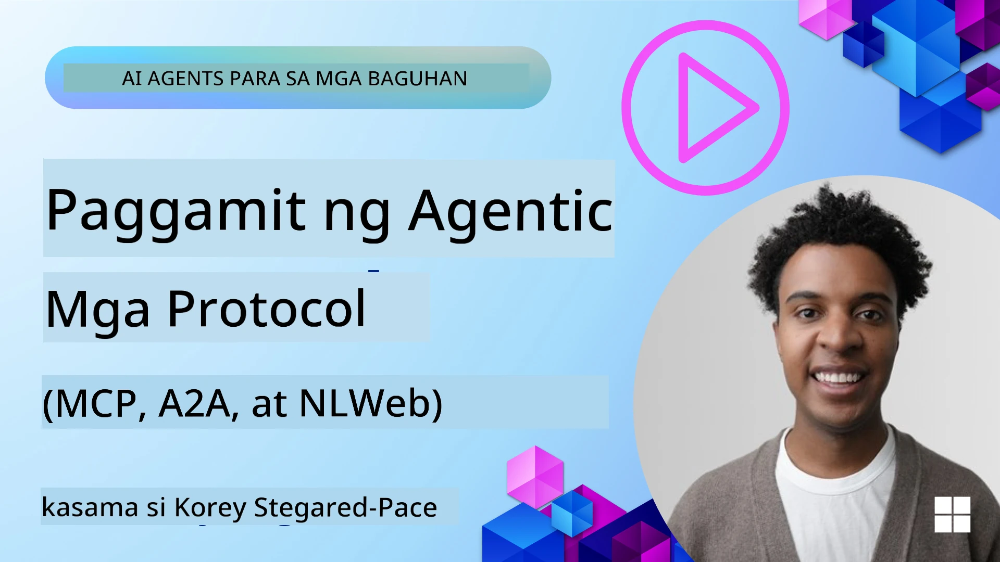
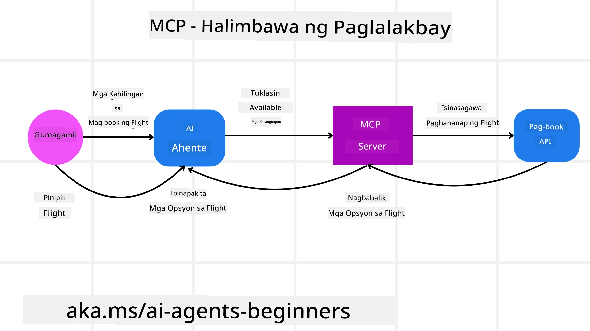
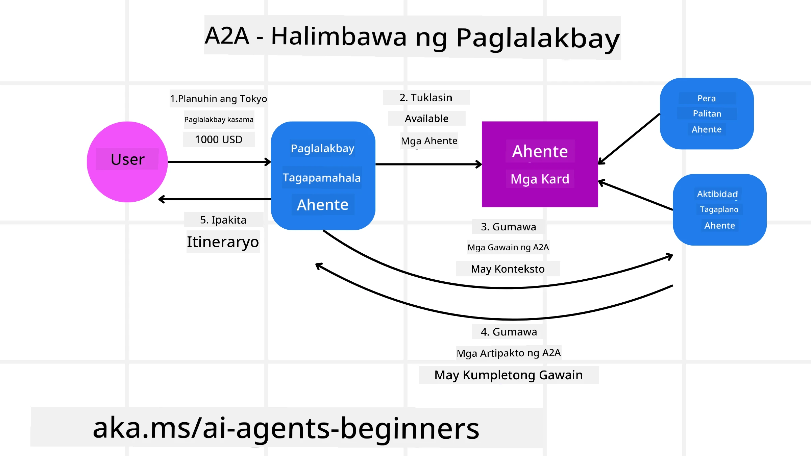
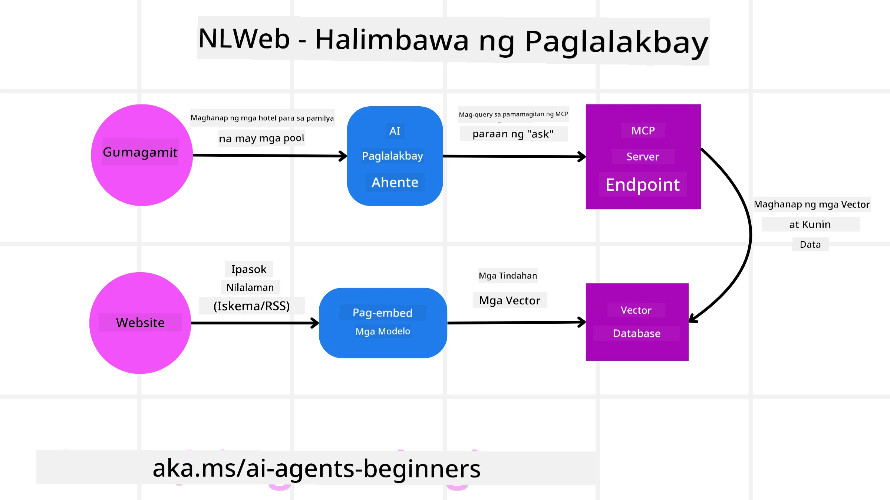

# Paggamit ng Agentic Protocols (MCP, A2A at NLWeb)

> _(I-click ang larawan sa itaas upang panoorin ang video ng araling ito)_

Habang lumalago ang paggamit ng AI agents, tumataas din ang pangangailangan para sa mga protocol na nagsisiguro ng standardisasyon, seguridad, at sumusuporta sa malayang inobasyon. Sa araling ito, tatalakayin natin ang 3 protocol na naglalayong tugunan ang pangangailangang ito - Model Context Protocol (MCP), Agent to Agent (A2A) at Natural Language Web (NLWeb).

## Panimula

Sa araling ito, tatalakayin natin:

• Paano pinapayagan ng **MCP** ang mga AI Agent na ma-access ang mga panlabas na tool at datos upang kumpletuhin ang mga gawain ng user.

• Paano pinapahintulutan ng **A2A** ang komunikasyon at kolaborasyon sa pagitan ng iba't ibang AI agent.

• Paano dinadala ng **NLWeb** ang mga natural language na interface sa anumang website na nagpapahintulot sa mga AI Agent na matuklasan at makipag-ugnayan sa nilalaman.

## Mga Layunin sa Pagkatuto

• **Tukuyin** ang pangunahing layunin at mga benepisyo ng MCP, A2A, at NLWeb sa konteksto ng mga AI agent.

• **Ipaliwanag** kung paano pinapadali ng bawat protocol ang komunikasyon at interaksyon sa pagitan ng mga LLM, tool, at iba pang agent.

• **Kilalanin** ang magkakaibang mga papel na ginagampanan ng bawat protocol sa pagbuo ng mga kumplikadong agentic na sistema.

## Model Context Protocol

The **Model Context Protocol (MCP)** ay isang open standard na nagbibigay ng standardized na paraan para sa mga application na magbigay ng konteksto at mga tool sa mga LLM. Pinahihintulutan nito ang isang "universal adaptor" sa iba't ibang mga pinagkukunan ng datos at mga tool na maaaring pagkonektahan ng mga AI Agent sa isang pare-parehong paraan.

Tingnan natin ang mga komponent ng MCP, ang mga benepisyo kumpara sa direktang paggamit ng API, at isang halimbawa kung paano maaaring gumamit ang mga AI agent ng isang MCP server.

### MCP Core Components

MCP ay gumagana sa isang **client-server architecture** at ang mga pangunahing komponent ay:

• **Hosts** ay mga LLM application (halimbawa isang code editor tulad ng VSCode) na nagsisimula ng mga koneksyon sa isang MCP Server.

• **Clients** ay mga komponent sa loob ng host application na nagpapanatili ng one-to-one na koneksyon sa mga server.

• **Servers** ay magagaan na programa na nag-eexpose ng mga partikular na kakayahan.

Kasama sa protocol ang tatlong pangunahing primitive na siyang mga kakayahan ng isang MCP Server:

• **Tools**: Ito ay mga hiwalay na aksyon o function na maaaring tawagin ng isang AI agent upang magsagawa ng aksyon. Halimbawa, ang isang weather service ay maaaring mag-expose ng "get weather" tool, o ang isang e-commerce server ay maaaring mag-expose ng "purchase product" tool. I-aanunsyo ng mga MCP server ang pangalan ng bawat tool, paglalarawan, at input/output schema sa kanilang listahan ng mga kakayahan.

• **Resources**: Ito ay mga read-only na item ng datos o dokumento na maaaring ibigay ng isang MCP server, at maaaring kunin ng mga client kapag kailangan. Kabilang sa mga halimbawa ang nilalaman ng file, mga tala sa database, o mga log file. Ang mga Resources ay maaaring teksto (tulad ng code o JSON) o binary (tulad ng mga imahe o PDF).

• **Prompts**: Ito ay mga paunang-deklarang template na nagbibigay ng mga mungkahing prompt, na nagpapahintulot ng mas kumplikadong mga workflow.

### Mga Benepisyo ng MCP

Nag-aalok ang MCP ng makabuluhang mga pakinabang para sa mga AI Agent:

• **Dynamic Tool Discovery**: Maaaring makatanggap nang dinamiko ang mga agent ng listahan ng mga magagamit na tools mula sa isang server kasama ang mga paglalarawan ng ginagawa ng mga ito. Ito ay kabaligtaran ng tradisyonal na mga API, na madalas nangangailangan ng static na pag-code para sa mga integrasyon, na nangangahulugang anumang pagbabago sa API ay nangangailangan ng pag-update ng code. Nag-aalok ang MCP ng isang "integrate once" na paraan, na nagreresulta sa mas mataas na kakayahang umangkop.

• **Interoperability Across LLMs**: Gumagana ang MCP sa iba't ibang LLM, na nagbibigay ng flexibility na magpalit ng core models para masuri para sa mas mahusay na performance.

• **Standardized Security**: Kasama sa MCP ang isang standard na paraan ng authentication, na nagpapabuti sa scalability kapag nagdaragdag ng access sa karagdagang MCP servers. Mas simple ito kaysa pamahalaan ang iba't ibang keys at uri ng authentication para sa iba't ibang tradisyonal na API.

### MCP Example

Isipin na nais ng isang user na mag-book ng flight gamit ang isang AI assistant na pinapagana ng MCP.

1. **Connection**: Ang AI assistant (ang MCP client) ay kumokonekta sa isang MCP server na ibinigay ng isang airline.

2. **Tool Discovery**: Tinanong ng client ang MCP server ng airline, "Anong mga tool ang mayroon kayo?" Sumagot ang server ng mga tool tulad ng "search flights" at "book flights".

3. **Tool Invocation**: Pagkatapos hihilingin mo sa AI assistant, "Pakihanap ng flight mula Portland papuntang Honolulu." Tukuyin ng AI assistant, gamit ang kanyang LLM, na kailangan nitong tawagin ang "search flights" tool at ipapasa ang mga kaukulang parameter (origin, destination) sa MCP server.

4. **Execution and Response**: Ang MCP server, na kumikilos bilang isang wrapper, ay gagawa ng aktwal na tawag sa internal booking API ng airline. Tatanggap ito ng impormasyon ng flight (hal., JSON data) at ipapadala ito pabalik sa AI assistant.

5. **Further Interaction**: Ipapakita ng AI assistant ang mga opsyon sa flight. Kapag pumili ka ng flight, maaring tawagin ng assistant ang "book flight" tool sa parehong MCP server, kumukumpleto ang booking.

## Agent-to-Agent Protocol (A2A)

Habang nakatuon ang MCP sa pagkonekta ng mga LLM sa mga tool, ang **Agent-to-Agent (A2A) protocol** ay sumusulong pa sa pamamagitan ng pagpapahintulot ng komunikasyon at kolaborasyon sa pagitan ng iba't ibang AI agent. Kinikonekta ng A2A ang mga AI agent mula sa iba't ibang organisasyon, kapaligiran at tech stack upang kumpletuhin ang isang magkasanib na gawain.

Susuriin natin ang mga komponent at benepisyo ng A2A, kasama ang isang halimbawa kung paano ito maaaring ilapat sa aming travel application.

### A2A Core Components

Nakatuon ang A2A sa pagpapahintulot ng komunikasyon sa pagitan ng mga agent at pagpapatulungan nila upang kumpletuhin ang isang subtask ng user. Ang bawat komponent ng protocol ay nag-aambag dito:

#### Agent Card

Katulad ng paraan kung paano nagbabahagi ang isang MCP server ng listahan ng mga tool, ang isang Agent Card ay may:
- Ang Pangalan ng Agent .
- Isang **paglalarawan ng pangkalahatang mga gawain** na nito ginagawa.
- Isang **listahan ng mga partikular na kakayahan** na may mga paglalarawan upang tulungan ang ibang mga agent (o kahit mga tao) na maunawaan kung kailan at bakit nila gustong tawagan ang agent na iyon.
- Ang **kasalukuyang Endpoint URL** ng agent
- Ang **version** at **capabilities** ng agent tulad ng streaming responses at push notifications.

#### Agent Executor

Ang Agent Executor ang responsable para sa **pagpasa ng konteksto ng chat ng user sa remote agent**, kailangan ng remote agent nito upang maunawaan ang gawain na kailangang tapusin. Sa isang A2A server, gumagamit ang isang agent ng sarili nitong Large Language Model (LLM) upang i-parse ang dumarating na mga kahilingan at isagawa ang mga gawain gamit ang sarili nitong internal na mga tool.

#### Artifact

Kapag natapos ng remote agent ang hiniling na gawain, ang kanyang produktong trabaho ay nililikha bilang isang artifact. Ang isang artifact **naglalaman ng resulta ng trabaho ng agent**, isang **paglalarawan ng kung ano ang natapos**, at ang **text context** na ipinapadala sa pamamagitan ng protocol. Pagkatapos maipadala ang artifact, isinasara ang koneksyon sa remote agent hanggang kailanganin muli.

#### Event Queue

Ang komponent na ito ay ginagamit para sa **paghawak ng mga update at pagpapasa ng mga mensahe**. Ito ay partikular na mahalaga sa produksyon para sa mga agentic na sistema upang maiwasan na masara ang koneksyon sa pagitan ng mga agent bago matapos ang isang gawain, lalo na kapag ang oras ng pagkompleto ng gawain ay maaaring tumagal ng mas mahabang panahon.

### Mga Benepisyo ng A2A

• **Pinahusay na Kolaborasyon**: Pinahihintulutan nito ang mga agent mula sa iba't ibang vendor at platform na makipag-ugnayan, magbahagi ng konteksto, at magtrabaho nang magkakasama, na nagpo-promote ng tuloy-tuloy na automasyon sa pagitan ng mga tradisyonal na hiwalay na sistema.

• **Model Selection Flexibility**: Ang bawat A2A agent ay maaaring magdesisyon kung aling LLM ang gagamitin nito para paglingkuran ang mga kahilingan, na nagbibigay-daan sa pag-optimize o fine-tuning ng mga modelo bawat agent, hindi tulad ng isang solong LLM na koneksyon sa ilang MCP na senaryo.

• **Built-in Authentication**: Integrated ang authentication direkta sa A2A protocol, na nagbibigay ng matibay na security framework para sa interaksyon ng mga agent.

### A2A Example

Palalawakin natin ang senaryo ng travel booking, ngunit sa pagkakataong ito gamit ang A2A.

1. **User Request to Multi-Agent**: Nakikipag-ugnayan ang isang user sa isang "Travel Agent" A2A client/agent, marahil sa pagsabi, "Pakibook ang isang buong biyahe papuntang Honolulu para sa susunod na linggo, kabilang ang flights, hotel, at rental car".

2. **Orchestration by Travel Agent**: Tumatanggap ang Travel Agent ng komplikadong kahilingang ito. Ginagamit nito ang kanyang LLM upang mag-reason tungkol sa gawain at tukuyin na kailangan nitong makipag-ugnayan sa iba pang mga espesyalistang agent.

3. **Inter-Agent Communication**: Pagkatapos, ginagamit ng Travel Agent ang A2A protocol upang kumonekta sa downstream agents, tulad ng isang "Airline Agent," isang "Hotel Agent," at isang "Car Rental Agent" na nilikha ng iba't ibang kumpanya.

4. **Delegated Task Execution**: Nagpapadala ang Travel Agent ng mga partikular na gawain sa mga espesyalistang agent na ito (hal., "Maghanap ng mga flight papuntang Honolulu," "Mag-book ng hotel," "Mag-renta ng kotse"). Bawat isa sa mga espesyalistang agent na ito, na nagpapatakbo ng sarili nilang LLM at gumagamit ng sarili nilang mga tool (na maaaring MCP servers din), ay isinasagawa ang kani-kanilang bahagi ng booking.

5. **Consolidated Response**: Kapag natapos na ng lahat ng downstream agents ang kanilang mga gawain, pinagsasama ng Travel Agent ang mga resulta (mga detalye ng flight, kumpirmasyon ng hotel, booking ng renta ng kotse) at nagpapadala ng komprehensibo, chat-style na tugon pabalik sa user.

## Natural Language Web (NLWeb)

Matagal nang pangunahing paraan ang mga website para ma-access ng mga user ang impormasyon at datos sa internet.

Tingnan natin ang iba't ibang komponent ng NLWeb, ang mga benepisyo ng NLWeb at isang halimbawa kung paano gumagana ang aming NLWeb sa pamamagitan ng pagtingin sa aming travel application.

### Mga Komponent ng NLWeb

- **NLWeb Application (Core Service Code)**: Ang sistema na nagpo-proseso ng mga tanong sa natural language. Kinokonekta nito ang iba't ibang bahagi ng platform upang lumikha ng mga tugon. Maaari mo itong isipin bilang ang **engine na nagpapatakbo ng mga natural language na feature** ng isang website.

- **NLWeb Protocol**: Ito ay isang **pangunahin na hanay ng mga patakaran para sa natural language interaction** sa isang website. Nagbabalik ito ng mga tugon sa JSON format (madalas gamit ang Schema.org). Layunin nito na lumikha ng isang simpleng pundasyon para sa “AI Web,” katulad ng ginawa ng HTML upang maging posible ang pagbabahagi ng mga dokumento online.

- **MCP Server (Model Context Protocol Endpoint)**: Bawat NLWeb setup ay gumagana rin bilang isang **MCP server**. Ibig sabihin nito na maaari itong **magbahagi ng mga tool (tulad ng isang “ask” method) at datos** sa ibang mga AI system. Sa praktika, ginagawa nitong magagamit ng mga AI agent ang nilalaman at kakayahan ng website, na nagpapahintulot sa site na maging bahagi ng mas malawak na “agent ecosystem.”

- **Embedding Models**: Ang mga modelong ito ay ginagamit upang **ikonvert ang nilalaman ng website sa mga numerikal na representasyong tinatawag na vectors** (embeddings). Kinukuha ng mga vector na ito ang kahulugan sa paraang kayang ikumpara at hanapin ng mga computer. Itinatabi ang mga ito sa isang espesyal na database, at maaaring pumili ang mga user kung aling embedding model ang nais nilang gamitin.

- **Vector Database (Retrieval Mechanism)**: Itong database na ito **nagtatago ng mga embeddings ng nilalaman ng website**. Kapag may nagtanong, sinusuri ng NLWeb ang vector database upang mabilis na makita ang pinaka-nauugnay na impormasyon. Nagbibigay ito ng mabilis na listahan ng posibleng mga sagot, niraranggo ayon sa pagkakapareho. Gumagana ang NLWeb sa iba't ibang vector storage systems tulad ng Qdrant, Snowflake, Milvus, Azure AI Search, at Elasticsearch.

### NLWeb by Example

Isaalang-alang ang aming travel booking website muli, ngunit sa pagkakataong ito, pinapagana ito ng NLWeb.

1. **Data Ingestion**: Ang umiiral na product catalogs ng travel website (hal., listahan ng flight, paglalarawan ng hotel, mga tour package) ay naka-format gamit ang Schema.org o niloload via RSS feeds. Ina-ingest ng mga tool ng NLWeb ang structured na datos na ito, lumilikha ng embeddings, at ini-store ang mga ito sa lokal o remote na vector database.

2. **Natural Language Query (Human)**: Bumibisita ang isang user sa website at, sa halip na mag-navigate sa mga menu, nagta-type sa isang chat interface: "Hanapan mo ako ng family-friendly na hotel sa Honolulu na may pool para sa susunod na linggo".

3. **NLWeb Processing**: Natatanggap ng NLWeb application ang query na ito. Ipinapadala nito ang query sa isang LLM para sa pag-unawa at sabay na hinahanap ang vector database para sa mga nauugnay na listahan ng hotel.

4. **Accurate Results**: Tinutulungan ng LLM na i-interpret ang mga resulta ng paghahanap mula sa database, tukuyin ang pinakamahusay na tugma batay sa mga kriteriyang "family-friendly," "pool," at "Honolulu," at pagkatapos ay i-format ang isang tugon sa natural na wika. Mahalaga, tumutukoy ang tugon sa mga aktwal na hotel mula sa catalog ng website, na iniiwasan ang mga imbentong impormasyon.

5. **AI Agent Interaction**: Dahil nagsisilbi ang NLWeb bilang isang MCP server, ang isang panlabas na AI travel agent ay maaari ring kumonekta sa NLWeb instance ng website na ito. Maaaring gamitin ng AI agent ang `ask("Are there any vegan-friendly restaurants in the Honolulu area recommended by the hotel?")` MCP method upang direktang mag-query sa website. Poproseso ng NLWeb instance ito, gagamitin ang database nito ng impormasyon sa mga restaurant (kung na-load), at magbabalik ng istrukturadong JSON na tugon.

### May Karagdagang mga Tanong tungkol sa MCP/A2A/NLWeb?

Sumali sa [Microsoft Foundry Discord](https://aka.ms/ai-agents/discord) upang makipagkita sa ibang mga nag-aaral, dumalo sa office hours at masagot ang iyong mga tanong tungkol sa AI Agents.

## Mga Sanggunian

- [MCP para sa Mga Nagsisimula](https://aka.ms/mcp-for-beginners)  
- [Dokumentasyon ng MCP](https://learn.microsoft.com/python/api/overview/azure/ai-projects-readme)
- [NLWeb Repo](https://github.com/nlweb-ai/NLWeb)
- [Microsoft Agent Framework](https://aka.ms/ai-agents-beginners/agent-framewrok)

---

<!-- CO-OP TRANSLATOR DISCLAIMER START -->
Paunawa:
Isinalin ang dokumentong ito gamit ang AI na serbisyo ng pagsasalin [Co-op Translator](https://github.com/Azure/co-op-translator). Bagamat sinisikap naming maging tumpak, pakitandaan na maaaring may mga pagkakamali o hindi pagkakatugma ang mga awtomatikong pagsasalin. Ang orihinal na dokumento sa orihinal nitong wika ang dapat ituring na mapagkakatiwalaang sanggunian. Para sa mahahalagang impormasyon, inirerekomenda ang propesyonal na pagsasaling ginagawa ng tao. Hindi kami mananagot sa anumang hindi pagkakaunawaan o maling interpretasyon na nagmumula sa paggamit ng pagsasaling ito.
<!-- CO-OP TRANSLATOR DISCLAIMER END -->