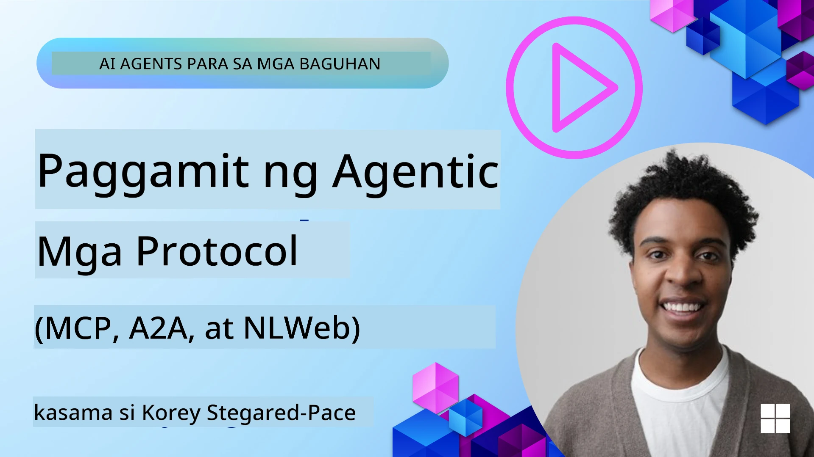
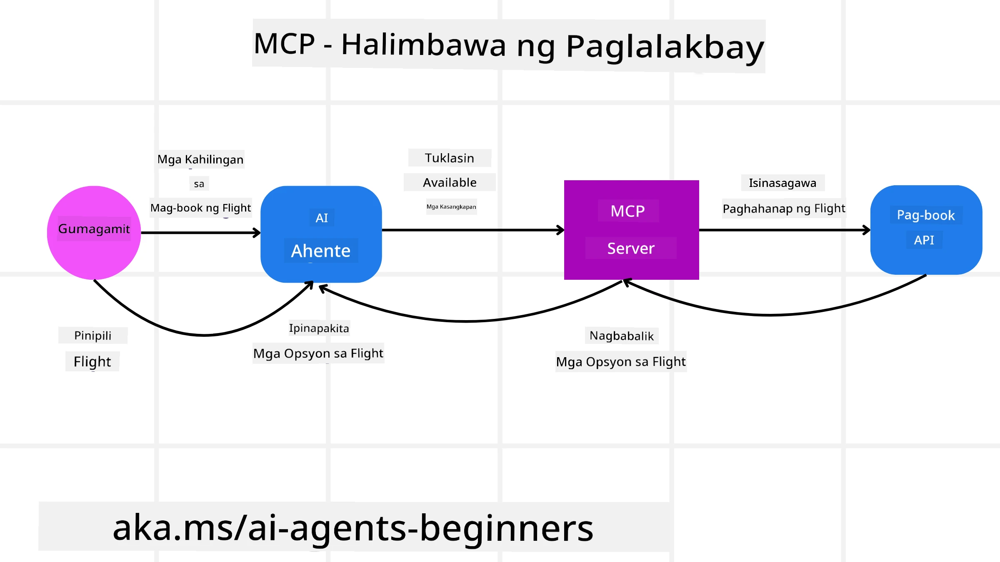
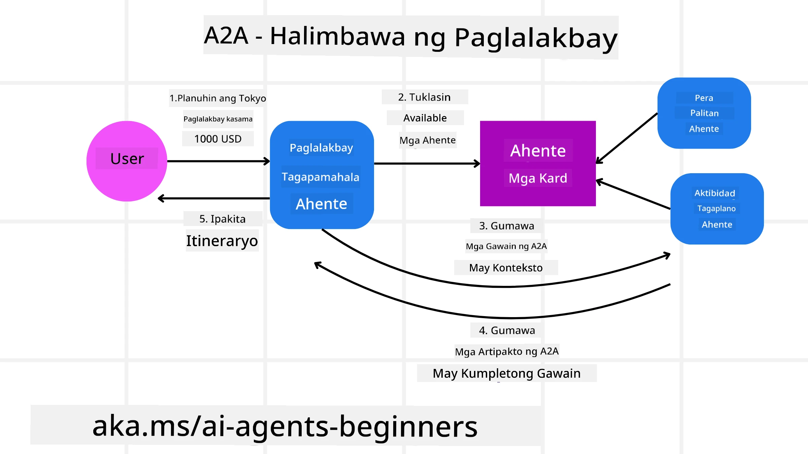
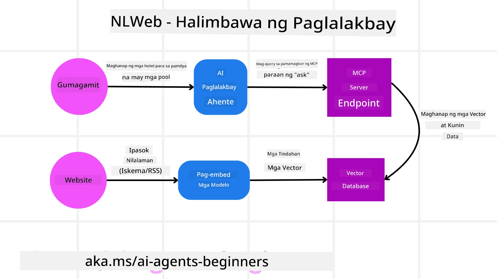

# Paggamit ng Agentic Protocols (MCP, A2A at NLWeb)

> _(I-click ang larawan sa itaas upang panoorin ang video ng lekson na ito)_

Habang lumalaki ang paggamit ng AI agents, ganoon din ang pangangailangan para sa mga protocol na nagsisiguro ng standardisasyon, seguridad, at suporta para sa bukas na inobasyon. Sa lekson na ito, tatalakayin natin ang 3 protocol na naglalayong tugunan ang pangangailangang ito - Model Context Protocol (MCP), Agent to Agent (A2A) at Natural Language Web (NLWeb).

## Panimula

Sa lekson na ito, tatalakayin natin:

• Paano pinapayagan ng **MCP** ang AI Agents na ma-access ang mga panlabas na tool at datos para matapos ang mga gawain ng user.

• Paano pinahihintulutan ng **A2A** ang komunikasyon at kolaborasyon sa pagitan ng iba't ibang AI agents.

• Paano inilalapat ng **NLWeb** ang mga natural language interface sa kahit anong website na nagpapahintulot sa AI Agents na matuklasan at makipag-ugnayan sa nilalaman.

## Mga Layunin sa Pagkatuto

• **Tukuyin** ang pangunahing layunin at benepisyo ng MCP, A2A, at NLWeb sa konteksto ng mga AI agents.

• **Ipaliwanag** kung paano pinadadali ng bawat protocol ang komunikasyon at interaksyon sa pagitan ng LLMs, mga tool, at ibang mga agent.

• **Kilalanin** ang natatanging mga tungkulin ng bawat protocol sa pagbuo ng masalimuot na agentic systems.

## Model Context Protocol

Ang **Model Context Protocol (MCP)** ay isang bukas na standard na nagbibigay ng standardisadong paraan para sa mga aplikasyon na magbigay ng konteksto at mga tool sa mga LLM. Ito ay nagpapahintulot ng "universal adaptor" sa iba't ibang pinagmumulan ng datos at mga tool na maaaring ikonekta ng mga AI Agents sa isang pare-parehong paraan.

Tingnan natin ang mga bahagi ng MCP, mga benepisyo nito kumpara sa direktang paggamit ng API, at isang halimbawa kung paano maaaring gamitin ng mga AI agents ang isang MCP server.

### Mga Pangunahing Bahagi ng MCP

Ang MCP ay nagpapatakbo sa **client-server architecture** at ang mga pangunahing bahagi nito ay:

• **Hosts** ay mga aplikasyon ng LLM (halimbawa ay isang code editor tulad ng VSCode) na nagsisimula ng koneksyon sa isang MCP Server.

• **Clients** ay mga bahagi sa loob ng host application na nagpapanatili ng one-to-one na koneksyon sa mga server.

• **Servers** ay magagaan na mga programa na nagpapakita ng mga partikular na kakayahan.

Kasama sa protocol ang tatlong pangunahing primitives na mga kakayahan ng isang MCP Server:

• **Tools**: Mga hiwalay na aksyon o function na maaaring tawagin ng AI agent upang magsagawa ng isang gawain. Halimbawa, isang weather service ay maaaring magpakita ng "get weather" tool, o isang e-commerce server ay maaaring magpakita ng "purchase product" tool. Ina-advertise ng mga MCP server ang pangalan ng bawat tool, deskripsyon, at input/output schema sa kanilang capabilities listing.

• **Resources**: Ito ay mga data item o dokumento na pangbasa lamang na maaaring ibigay ng MCP server, at maaaring kunin ng mga client kapag hiniling. Halimbawa nito ay mga nilalaman ng file, talaan ng database, o mga log file. Ang Resources ay maaaring teksto (tulad ng code o JSON) o binary (tulad ng mga larawan o PDF).

• **Prompts**: Ito ay mga paunang hugis na template na nagbibigay ng mga mungkahing prompt, na nagpapahintulot ng mas komplikadong workflow.

### Mga Benepisyo ng MCP

Nagbibigay ang MCP ng mga mahahalagang kalamangan para sa mga AI Agents:

• **Dynamic Tool Discovery**: Maaaring makatanggap ang mga agents ng dynamic na listahan ng mga available na tool mula sa server kasama ang mga paglalarawan ng kanilang ginagawa. Kabahin ito ng pagkakaiba sa tradisyunal na mga API na madalas nangangailangan ng static coding para sa mga integrasyon, ibig sabihin anumang pagbabago sa API ay nangangailangan ng pag-update ng code. Nag-aalok ang MCP ng "integrate once" na pamamaraan, na nagdudulot ng mas malaking kakayahang mag-adapt.

• **Interoperability Across LLMs**: Gumagana ang MCP sa iba't ibang LLM, na nagbibigay ng kakayahan na palitan ang mga pangunahing modelo para sa mas magandang performance.

• **Standardized Security**: Kasama sa MCP ang isang standard na paraan ng authentication, na nagpapabuti ng scalability kapag nagdadagdag ng access sa karagdagang MCP server. Mas simple ito kumpara sa pamamahala ng iba't ibang key at uri ng authentication para sa iba’t ibang tradisyunal na API.

### Halimbawa ng MCP

Isipin na nais ng isang user na mag-book ng flight gamit ang AI assistant na pinapagana ng MCP.

1. **Koneksyon**: Ang AI assistant (ang MCP client) ay kumokonekta sa isang MCP server na ibinigay ng airline.

2. **Pagkilala sa Tool**: Tinanong ng client ang MCP server ng airline, "Anong mga tool ang mayroon kayo?" Sumagot ang server ng mga tool tulad ng "search flights" at "book flights."

3. **Pagtawag ng Tool**: Pagkatapos ay hiningi mo sa AI assistant, "Paki-search ang flight mula Portland papuntang Honolulu." Ginagamit ng AI assistant gamit ang LLM nito ang "search flights" tool at ipinapasa ang mga kaukulang parametro (origin, destination) sa MCP server.

4. **Pagsasagawa at Tugon**: Ang MCP server, bilang wrapper, ay tumatawag sa airline's internal booking API. Tumatanggap ito ng impormasyon ng flight (hal., JSON data) at ipinapasa ito pabalik sa AI assistant.

5. **Karagdagang Pakikipag-ugnayan**: Ipinapakita ng AI assistant ang mga opsyon ng flight. Kapag pumili ka na, maaaring tawagin ng assistant ang "book flight" tool sa parehong MCP server upang tapusin ang booking.

## Agent-to-Agent Protocol (A2A)

Habang nakatuon ang MCP sa pagkonekta ng LLMs sa mga tool, ang **Agent-to-Agent (A2A) protocol** ay nagpapalawak pa sa pamamagitan ng pagpapahintulot ng komunikasyon at kolaborasyon sa pagitan ng iba't ibang AI agents. Kinokonekta ng A2A ang mga AI agents mula sa iba't ibang organisasyon, kapaligiran, at mga tech stack upang makumpleto ang isang pinagsamang gawain.

Titingnan natin ang mga bahagi at benepisyo ng A2A, pati na rin isang halimbawa kung paano ito maaaring gamitin sa ating travel application.

### Mga Pangunahing Bahagi ng A2A

Nakatuon ang A2A sa pagpapahintulot ng komunikasyon sa pagitan ng mga agent at pagtutulungan nila para makumpleto ang bahagi ng gawain ng user. Bawat bahagi ng protocol ay tumutulong dito:

#### Agent Card

Katulad ng pagbibigay ng listahan ng mga tool ng isang MCP server, ang Agent Card ay mayroong:
- Pangalan ng Agent.
- Isang **paglalarawan ng mga pangkalahatang gawain** na natatapos nito.
- Isang **listahan ng mga partikular na kasanayan** kasama ang mga paglalarawan para matulungan ang ibang mga agent (o kahit mga human user) na maintindihan kung kailan at bakit nila tatawagin ang agent na iyon.
- Ang **kasalukuyang Endpoint URL** ng agent.
- Ang **bersyon** at **mga kakayahan** ng agent gaya ng streaming responses at push notifications.

#### Agent Executor

Ang Agent Executor ay responsable para sa **pagpapasa ng konteksto ng chat ng user sa remote agent**, kailangan ito ng remote agent para maintindihan ang gawain na kailangang tapusin. Sa isang A2A server, gumagamit ang agent ng sarili nitong Large Language Model (LLM) para unawain ang mga papasok na request at isagawa ang mga gawain gamit ang sarili nitong mga internal na tool.

#### Artifact

Kapag natapos na ng remote agent ang hinihinging gawain, ang gawa nito ay nililikha bilang artifact. Ang artifact ay **naglalaman ng resulta ng trabaho ng agent**, isang **paglalarawan ng natapos**, at ang **tekstong konteksto** na ipinadala sa protocol. Pagkatapos maipadala ang artifact, ang koneksyon sa remote agent ay isinasara hanggang sa kailanganin muli.

#### Event Queue

Ang bahaging ito ay ginagamit para sa **pag-aasikaso ng mga update at pagpapasa ng mga mensahe**. Mahalaga ito lalo na sa produksyon ng mga agentic system upang maiwasan ang pagsasara ng koneksyon sa pagitan ng mga agent bago matapos ang gawain, lalo na kung matagal ang oras ng pagtapos ng gawain.

### Mga Benepisyo ng A2A

• **Pinahusay na Kolaborasyon**: Pinapayagan nito ang mga agent mula sa iba't ibang vendor at platform na makipag-ugnayan, magbahagi ng konteksto, at magtulungan, na nagpapadali ng seamless automation sa mga tradisyunal na disconnected na sistema.

• **Kalayaan sa Pagpili ng Modelo**: Bawat A2A agent ay maaaring pumili kung aling LLM ang gagamitin para sa pagserbisyo sa mga request nito, na nagpapahintulot ng optimized o fine-tuned na mga modelo bawat agent, hindi tulad ng isang solong koneksyon sa LLM sa ilang MCP scenario.

• **Built-in Authentication**: Integrated ang authentication nang direkta sa A2A protocol, na nagbibigay ng matibay na security framework para sa interaksyon ng mga agent.

### Halimbawa ng A2A

Palalawakin natin ang ating travel booking scenario, ngunit sa pagkakataong ito gamit ang A2A.

1. **Request ng User sa Multi-Agent**: Nakikipag-ugnayan ang user sa isang "Travel Agent" A2A client/agent, marahil nagsasabi, "Paki-book ang buong trip papuntang Honolulu sa susunod na linggo, kasama ang flights, hotel, at rental car."

2. **Orkestra ng Travel Agent**: Natatanggap ng Travel Agent ang komplikadong request na ito. Ginagamit nito ang LLM upang pag-isipan ang gawain at tukuyin na kailangan nitong makipag-ugnayan sa ibang mga espesyalistang agent.

3. **Inter-Agent Communication**: Ginagamit ng Travel Agent ang A2A protocol para kumonekta sa mga downstream agent, tulad ng "Airline Agent," "Hotel Agent," at "Car Rental Agent" na ginawa ng iba't ibang kumpanya.

4. **Delegated Task Execution**: Nagpapadala ang Travel Agent ng mga partikular na gawain sa mga espesyalistang agent na ito (hal., "Find flights to Honolulu," "Book a hotel," "Rent a car"). Bawat isa sa mga ito ay nagpapatakbo ng sarili nilang LLM at gumagamit ng sariling mga tool (na maaaring mga MCP server rin), upang gawin ang partikular na bahagi ng booking.

5. **Consolidated Response**: Kapag natapos na ng lahat ng downstream agent ang kanilang gawain, pinagsasama ng Travel Agent ang mga resulta (mga detalye ng flight, kumpirmasyon ng hotel, booking ng car rental) at ipinapadala ang isang komprehensibong chat-style na tugon pabalik sa user.

## Natural Language Web (NLWeb)

Matagal nang pangunahing paraan ang mga website para sa mga user upang ma-access ang impormasyon at datos sa internet.

Tingnan natin ang iba't ibang bahagi ng NLWeb, mga benepisyo ng NLWeb at isang halimbawa kung paano gumagana ang NLWeb sa ating travel application.

### Mga Bahagi ng NLWeb

- **NLWeb Application (Core Service Code)**: Ang sistema na nagpoproseso ng mga tanong sa natural na wika. Kinokonekta nito ang iba't ibang bahagi ng platform upang makalikha ng mga sagot. Maaari mo itong isipin bilang ang **makina na nagpapatakbo ng mga feature ng natural language sa isang website**.

- **NLWeb Protocol**: Ito ay isang **pangunahing set ng mga panuntunan para sa natural language interaction** sa isang website. Nagpapadala ito ng mga tugon sa JSON format (madalas gumagamit ng Schema.org). Layunin nito na lumikha ng simpleng pundasyon para sa “AI Web,” tulad ng ginagawa ng HTML para sa pagbabahagi ng mga dokumento online.

- **MCP Server (Model Context Protocol Endpoint)**: Bawat setup ng NLWeb ay gumagana rin bilang isang **MCP server**. Ibig sabihin nito ay maaari itong **magbahagi ng mga tool (tulad ng “ask” method) at data** sa ibang AI system. Sa praktis, ginagawang magagamit ng mga AI agent ang nilalaman at kakayahan ng website, na nagpapasali sa site sa mas malawak na “agent ecosystem.”

- **Embedding Models**: Ang mga modelong ito ay ginagamit para **i-convert ang nilalaman ng website sa mga numerikal na representasyon na tinatawag na vectors** (embeddings). Kinakatawan ng mga vector na ito ang kahulugan sa paraang magagamit ng computer para mag-compare at maghanap. Iniimbak ang mga ito sa isang espesyal na database, at maaaring pumili ang mga user kung aling embedding model ang nais nilang gamitin.

- **Vector Database (Retrieval Mechanism)**: Ang database na ito ay **nagtatago ng embeddings ng nilalaman ng website**. Kapag may nagtanong, tinitingnan ng NLWeb ang vector database para mabilis na mahanap ang pinaka-nauugnay na impormasyon. Nagbibigay ito ng mabilis na listahan ng posibleng sagot, na niraranggo ayon sa pagkakatulad. Gumagana ang NLWeb sa iba't ibang sistema ng vector storage tulad ng Qdrant, Snowflake, Milvus, Azure AI Search, at Elasticsearch.

### NLWeb sa Halimbawa

Isipin muli ang ating travel booking website, ngunit sa pagkakataong ito, pinapagana ng NLWeb.

1. **Pagpasok ng Data**: Ang umiiral na product catalogs ng travel website (hal., flight listings, paglalarawan ng hotel, tour packages) ay na-format gamit ang Schema.org o nai-load via RSS feeds. Kinukuha ng mga tool ng NLWeb ang nanatiling data, gumagawa ng embeddings, at iniimbak sa lokal o remote vector database.

2. **Tanong sa Natural Language (Tao)**: Isang user ang bumibisita sa website at sa halip na mag-navigate sa mga menu, nagta-type sa chat interface: "Maghanap ng family-friendly na hotel sa Honolulu na may pool para sa susunod na linggo."

3. **Pagpoproseso ng NLWeb**: Tinatanggap ng NLWeb application ang tanong na ito. Ipinapadala nito ang tanong sa isang LLM para sa pag-unawa at kasabay nito ay hinahanap sa vector database ang mga kaugnay na hotel listings.

4. **Tumpak na Resulta**: Tinutulungan ng LLM na bigyang-kahulugan ang mga resulta ng search mula sa database, tukuyin ang pinakamahusay na tugma base sa mga pamantayan na "family-friendly," "pool," at "Honolulu," at saka ini-format ang isang natural language na tugon. Mahalaga, tumutukoy ang tugon sa aktuwal na mga hotel mula sa catalog ng website, na iniiwasan ang mga gawa-gawang impormasyon.

5. **Pakikipag-ugnayan ng AI Agent**: Dahil nagsisilbi ang NLWeb bilang isang MCP server, maaaring kumonekta rin ang isang panlabas na AI travel agent sa instance ng NLWeb ng website na ito. Maaari gamitin ng AI agent ang MCP method na `ask` upang direktang mag-query sa website: `ask("Mayroon bang mga vegan-friendly na restaurant sa lugar ng Honolulu na inirerekomenda ng hotel?")`. Ang NLWeb instance ay poproseso nito, gamit ang database ng impormasyon ng restaurant (kung na-load), at magbabalik ng naka-istrukturang JSON na tugon.

### May Mga Karagdagang Tanong Tungkol sa MCP/A2A/NLWeb?

Sumali sa [Microsoft Foundry Discord](https://discord.com/invite/ATgtXmAS5D) para makipagkita sa ibang mga nag-aaral, dumalo sa office hours at sagutin ang iyong mga tanong tungkol sa AI Agents.

## Mga Mapagkukunan

- [MCP for Beginners](https://aka.ms/mcp-for-beginners)  
- [MCP Documentation](https://learn.microsoft.com/python/api/overview/azure/ai-projects-readme)
- [NLWeb Repo](https://github.com/nlweb-ai/NLWeb)
- [Microsoft Agent Framework](https://aka.ms/ai-agents-beginners/agent-framework)

---

<!-- CO-OP TRANSLATOR DISCLAIMER START -->
**Pagtatanggi**:
Ang dokumentong ito ay isinalin gamit ang serbisyo ng AI translation na [Co-op Translator](https://github.com/Azure/co-op-translator). Bagama't nagsusumikap kami para sa katumpakan, pakatandaan na ang awtomatikong pagsasalin ay maaaring maglaman ng mga pagkakamali o hindi pagkakatugma. Ang orihinal na dokumento sa orihinal nitong wika ang dapat ituring na pangunahing sanggunian. Para sa mahahalagang impormasyon, inirerekomenda ang propesyonal na pagsasalin ng tao. Hindi kami mananagot sa anumang maling pagkakaintindi o maling interpretasyon na nagmula sa paggamit ng pagsasaling ito.
<!-- CO-OP TRANSLATOR DISCLAIMER END -->