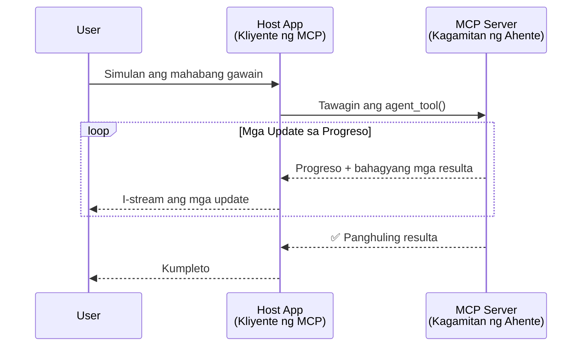
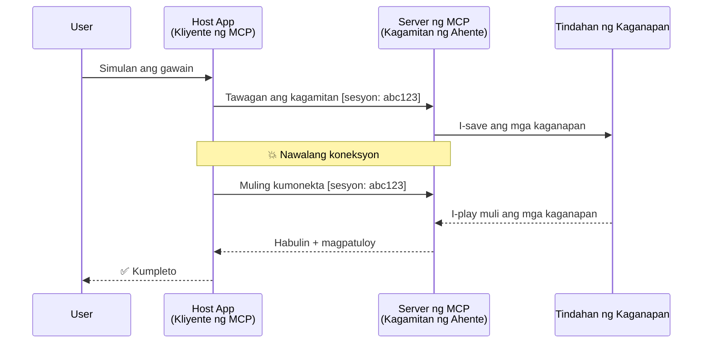
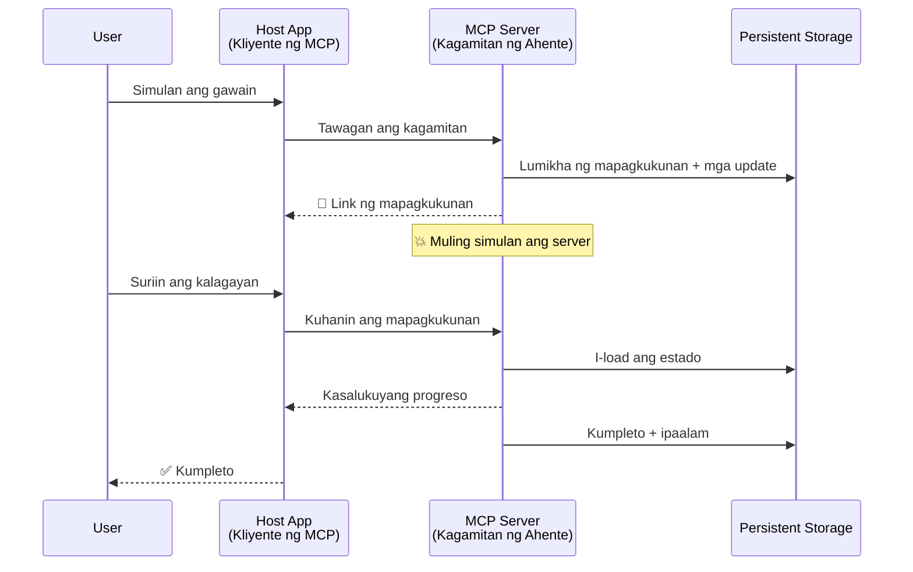
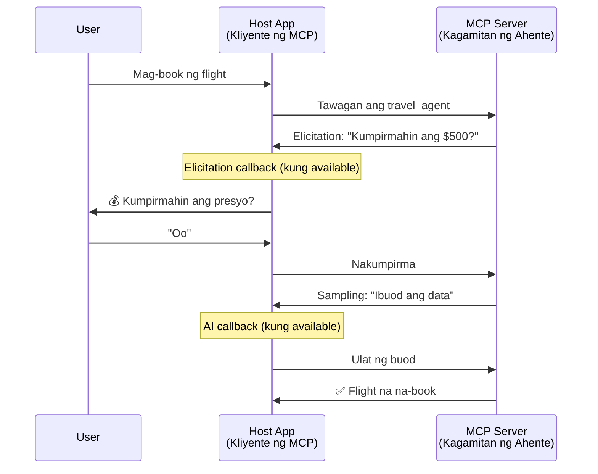
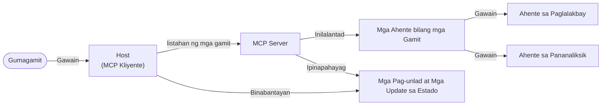

# Pagtatayo ng Mga Sistema ng Komunikasyon ng Ahente-sa-Ahente gamit ang MCP

> TL;DR - Maaari Ka Bang Gumawa ng Agent2Agent Communication sa MCP? Oo!

Malaki na ang pag-unlad ng MCP mula sa orihinal nitong layunin na "magbigay ng konteksto sa LLMs". Sa mga kamakailang pagpapahusay kabilang ang [resumable streams](https://modelcontextprotocol.io/docs/concepts/transports#resumability-and-redelivery), [elicitation](https://modelcontextprotocol.io/specification/2025-06-18/client/elicitation), [sampling](https://modelcontextprotocol.io/specification/2025-06-18/client/sampling), at mga notification ([progress](https://modelcontextprotocol.io/specification/2025-06-18/basic/utilities/progress) at [resources](https://modelcontextprotocol.io/specification/2025-06-18/schema#resourceupdatednotification)), ang MCP ngayon ay nagbibigay ng matibay na pundasyon para sa pagtatayo ng masalimuot na mga sistema ng komunikasyon ng ahente-sa-ahente.

## Ang Maling Pananaw Tungkol sa Ahente/Kagamitan

Habang mas maraming mga developer ang sumusubok sa mga kagamitan na may mga katangian ng ahente (tumakbo nang matagal, maaaring mangailangan ng karagdagang input habang tumatakbo, atbp.), isang karaniwang maling paniniwala na hindi angkop ang MCP dahil sa mga unang halimbawa na ang mga kagamitan ay nakatuon lamang sa simpleng request-response na mga pattern.

Luma na ang pananaw na ito. Ang espesipikasyon ng MCP ay malaki na ang na-update sa nakalipas na mga buwan na may mga kakayahan na nagpapatigil sa agwat para sa pagtatayo ng mga ahenteng tumatakbo nang matagal:

- **Streaming at Bahagyang Mga Resulta**: Real-time na mga update ng progreso habang tumatakbo
- **Resumability**: Maaaring muling kumonekta ang mga kliyente at magpatuloy pagkatapos ng pagkakahiwalay
- **Durability**: Nananatili ang mga resulta kahit may restart ang server (hal. sa pamamagitan ng mga link na resource)
- **Multi-turn**: Interactive na input habang tumatakbo sa pamamagitan ng elicitation at sampling

Maaaring pagsamahin ang mga tampok na ito upang payagan ang masalimuot na mga aplikasyon na ahente o multi-agent, lahat ay nakabase sa MCP protocol.

Para sa sanggunian, tatawagin nating "tool" ang isang ahente na available sa isang MCP server. Nangangahulugan ito ng pagkakaroon ng host application na nagpapatupad ng MCP client na nagtatatag ng session sa MCP server at maaaring tumawag sa ahente.

## Ano ang Ginagawa ng MCP Tool na "Agentic"?

Bago pumasok sa implementasyon, itakda natin kung anong mga kakayahan sa imprastruktura ang kailangan para suportahan ang mga ahenteng tumatakbo nang matagal.

> Ituturing natin ang ahente bilang isang entidad na maaaring kumilos nang autonomous sa mahabang panahon, kaya nitong hawakan ang mga komplikadong gawain na maaaring mangailangan ng maraming pakikipag-ugnayan o pagsasaayos batay sa real-time na feedback.

### 1. Streaming at Bahagyang Mga Resulta

Hindi epektibo ang tradisyunal na mga pattern ng request-response para sa mga long-running na gawain. Kailangan ng mga ahente na magbigay ng:

- Real-time na mga update ng progreso
- Mga panandaliang resulta

**Suporta ng MCP**: Pinapayagan ng mga notification ng pag-update ng resource ang streaming ng bahagyang mga resulta, ngunit nangangailangan ito ng maingat na disenyo upang maiwasan ang mga salungatan sa modelo ng JSON-RPC na 1:1 na request/response.

| Tampok                    | Kaso ng Paggamit                                                                                                                                                                | Suporta ng MCP                                                                            |
| -------------------------- | ----------------------------------------------------------------------------------------------------------------------------------------------------------------------------- | ----------------------------------------------------------------------------------------- |
| Real-time Progress Updates | Humihiling ang user ng gawain sa paglipat ng codebase. Nagsi-stream ang ahente ng progreso: "10% - Sinusuri ang mga dependencies... 25% - Kinokopya ang mga TypeScript files... 50% - Ina-update ang mga imports..." | ✅ Mga notification ng progreso                                                           |
| Partial Results            | "Mag-generate ng libro" na gawain ay nag-stream ng bahagyang mga resulta, hal. 1) Balangkas ng kwento, 2) Listahan ng mga kabanata, 3) Bawat kabanata kapag tapos na. Maaaring tignan, kanselahin, o baguhin ng host anumang oras. | ✅ Maaaring "palawakin" ang mga notification upang isama ang bahagyang mga resulta, tingnan ang mga panukala sa PR 383, 776 |

<div align="center" style="font-style: italic; font-size: 0.95em; margin-bottom: 0.5em;">
<strong>Larawan 1:</strong> Ipinapakita ng diagram na ito kung paano nagsi-stream ang MCP agent ng mga real-time na update ng progreso at bahagyang mga resulta sa host application habang tumatakbo ang mahaba-habang gawain, na nagbibigay-daan sa user na subaybayan ang pagtakbo sa real time.
</div>



### 2. Resumability

Kailangan ng mga ahente na harapin nang maayos ang mga pagkaantala sa network:

- Muling kumonekta pagkatapos ng pagkahiwalay ng kliyente
- Magpatuloy mula sa huling natapos (muling paghahatid ng mensahe)

**Suporta ng MCP**: Sinusuportahan ngayon ng MCP StreamableHTTP transport ang session resumption at message redelivery gamit ang mga session ID at huling event ID. Mahalaga na ang server ay dapat magpatupad ng EventStore na nagpapahintulot ng event replays kapag muling kumokonekta ang client.  
Tandaan na may panukalang pang-komunidad (PR #975) na sumusuri sa transport-agnostic na resumable streams.

| Tampok      | Kaso ng Paggamit                                                                                                                                            | Suporta ng MCP                                                          |
| ------------ | ----------------------------------------------------------------------------------------------------------------------------------------------------------- | ---------------------------------------------------------------------- |
| Resumability | Naka-disconnect ang kliyente sa kalagitnaan ng mahaba-habang gawain. Sa muling pagkonekta, nagpapatuloy ang session na may mga na-miss na event na nire-replay, na tuloy-tuloy na nagpapatuloy mula sa huling punto. | ✅ StreamableHTTP transport na may session IDs, event replay, at EventStore |

<div align="center" style="font-style: italic; font-size: 0.95em; margin-bottom: 0.5em;">
<strong>Larawan 2:</strong> Ipinapakita ng diagram na ito kung paano pinapayagan ng StreamableHTTP transport at event store ng MCP ang seamless session resumption: kung magdi-disconnect ang kliyente, maaari itong muling kumonekta at ire-replay ang mga na-miss na event, nagpapatuloy ang gawain nang hindi nawawala ang progreso.
</div>



### 3. Durability

Kailangan ng mga mahaba-habang ahente ang persistenteng estado:

- Nananatili ang mga resulta kahit magkaroon ng restart ang server
- Maaaring kunin ang status nang hiwalay
- Pagsubaybay ng progreso sa iba't ibang session

**Suporta ng MCP**: Sinusuportahan na ngayon ng MCP ang Resource link na uri ng return para sa tawag sa tool. Ngayon, isang posibleng pattern ay magdisenyo ng tool na lumilikha ng resource at agad na nagbabalik ng resource link. Maaari pang ipagpatuloy ng tool ang gawain sa background at i-update ang resource. Sa kabilang banda, maaaring piliin ng kliyente na i-poll ang estado ng resource para makuha ang bahagyang o kompletong resulta (batay sa mga update na ibinibigay ng server) o mag-subscribe para sa mga notification ng update.

Isang limitasyon dito ay ang pag-poll sa mga resource o pag-subscribe para sa mga update ay maaaring kumonsumo ng mga resource na may epekto sa malawakang paggamit. May bukas na panukalang pang-komunidad (kasama ang #992) na sumusuri sa posibilidad ng pagsasama ng mga webhook o trigger na maaaring tawagan ng server upang ipaalam sa client/host application ang mga update.

| Tampok    | Kaso ng Paggamit                                                                                                                                  | Suporta ng MCP                                                    |
| ---------- | ------------------------------------------------------------------------------------------------------------------------------------------------- | ---------------------------------------------------------------- |
| Durability | Nag-crash ang server habang ginagawa ang data migration task. Nanatili ang mga resulta at progreso pagkatapos ng restart, maaaring tingnan ng client ang status at magpatuloy mula sa persistent na resource. | ✅ Resource links na may persistent storage at status notifications |

Ngayon, isang karaniwang pattern ay magdisenyo ng tool na lumilikha ng resource at agad na nagbabalik ng resource link. Maaari patuloy na pagtrabahuan ng tool sa background ang gawain, magbigay ng mga notification ng resource na nagsisilbing mga update ng progreso o isama ang bahagyang mga resulta, at i-update ang nilalaman ng resource kung kinakailangan.

<div align="center" style="font-style: italic; font-size: 0.95em; margin-bottom: 0.5em;">
<strong>Larawan 3:</strong> Ipinakikita ng diagram na ito kung paano ginagamit ng mga MCP agent ang mga persistent na resource at mga notification ng status upang matiyak na ang mga mahaba-habang gawain ay nananatili kahit may restart ng server, na nagpapahintulot sa mga kliyente na tingnan ang progreso at kunin ang mga resulta kahit matapos ang mga pagkabigo.
</div>



### 4. Multi-Turn Interactions

Kalimitang kailangan ng mga ahente ang karagdagang input habang tumatakbo:

- Paglilinaw o pag-apruba mula sa tao
- Tulong mula sa AI para sa mga komplikadong desisyon
- Dinamikong pagsasaayos ng mga parametro

**Suporta ng MCP**: Ganap na sinusuportahan sa pamamagitan ng sampling (para sa input ng AI) at elicitation (para sa input ng tao).

| Tampok                  | Kaso ng Paggamit                                                                                                                                     | Suporta ng MCP                                            |
| ----------------------- | ---------------------------------------------------------------------------------------------------------------------------------------------------- | --------------------------------------------------------- |
| Multi-Turn Interactions | Ang travel booking agent ay humihiling ng kumpirmasyon ng presyo mula sa user, pagkatapos ay humihingi ng AI na ibuod ang data ng paglalakbay bago tapusin ang booking transaction. | ✅ Elicitation para sa input ng tao, sampling para sa input ng AI |

<div align="center" style="font-style: italic; font-size: 0.95em; margin-bottom: 0.5em;">
<strong>Larawan 4:</strong> Ipinapakita ng diagram na ito kung paano maaaring interactive na humiling ang mga MCP agent ng input mula sa tao o humingi ng tulong mula sa AI habang tumatakbo, na sumusuporta sa mga komplikadong workflow na multi-turn tulad ng mga kumpirmasyon at dinamikong paggawa ng desisyon.
</div>



## Pagpapatupad ng Mga Mahabang Tumakbong Ahente sa MCP - Pangkalahatang Tanaw ng Code

Bilang bahagi ng artikulong ito, nagbibigay kami ng isang [code repository](https://github.com/victordibia/ai-tutorials/tree/main/MCP%20Agents) na naglalaman ng kumpletong implementasyon ng mga mahaba-habang tumakbong ahente gamit ang MCP Python SDK na may StreamableHTTP transport para sa session resumption at message redelivery. Ipinapakita ng implementasyon kung paano maaaring pagsamahin ang mga kakayahan ng MCP upang magpayagan ng masalimuot na pag-uugali na parang ahente.

Partikular, nagpapatupad kami ng server na may dalawang pangunahing tool na ahente:

- **Travel Agent** - Nagsasagawa ng simulasyon ng serbisyo sa pag-book ng biyahe na may kumpirmasyon ng presyo gamit ang elicitation
- **Research Agent** - Nagsasagawa ng mga gawain sa pananaliksik na may AI-assisted summaries gamit ang sampling

Parehong ipinapakita ng mga ahenteng ito ang mga real-time na update ng progreso, mga interactive na kumpirmasyon, at mga ganap na kakayahan sa session resumption.

### Mga Pangunahing Konsepto sa Implementasyon

Ipinapakita ng mga sumusunod na seksyon ang implementasyon ng ahente sa server-side at ang paghawak ng host sa client-side para sa bawat kakayahan:

#### Streaming at Mga Update ng Progreso - Real-time na Katayuan ng Gawain

Pinapayagan ng streaming ang mga ahente na magbigay ng mga real-time na update ng progreso habang tumatakbo ang mga mahahabang gawain, na nagpapanatili sa mga user na may kaalaman sa katayuan ng gawain at mga panandaliang resulta.

**Implementasyon ng Server (nagpapadala ng mga notification ng progreso ang ahente):**

```python
# Mula sa server/server.py - Ahente ng paglalakbay na nagpapadala ng mga update sa progreso
for i, step in enumerate(steps):
    await ctx.session.send_progress_notification(
        progress_token=ctx.request_id,
        progress=i * 25,
        total=100,
        message=step,
        related_request_id=str(ctx.request_id)
    )
    await anyio.sleep(2)  # Gawin ang trabaho nang ipinalalagay

# Alternatibo: I-log ang mga mensahe para sa detalyadong hakbang-hakbang na mga update
await ctx.session.send_log_message(
    level="info",
    data=f"Processing step {current_step}/{steps} ({progress_percent}%)",
    logger="long_running_agent",
    related_request_id=ctx.request_id,
)
```

**Implementasyon ng Client (tumanggap ang host ng mga update ng progreso):**

```python
# Mula sa client/client.py - Kliyenteng humahawak ng real-time na mga abiso
async def message_handler(message) -> None:
    if isinstance(message, types.ServerNotification):
        if isinstance(message.root, types.LoggingMessageNotification):
            console.print(f"📡 [dim]{message.root.params.data}[/dim]")
        elif isinstance(message.root, types.ProgressNotification):
            progress = message.root.params
            console.print(f"🔄 [yellow]{progress.message} ({progress.progress}/{progress.total})[/yellow]")

# Magrehistro ng tagapangasiwa ng mensahe kapag lumilikha ng sesyon
async with ClientSession(
    read_stream, write_stream,
    message_handler=message_handler
) as session:
```

#### Elicitation - Humihiling ng Input ng User

Pinapayagan ng elicitation ang mga ahente na humiling ng input ng user habang tumatakbo. Mahalaga ito para sa mga kumpirmasyon, paglilinaw, o pag-apruba sa mga mahahabang gawain.

**Implementasyon ng Server (ang ahente ay humihiling ng kumpirmasyon):**

```python
# Mula sa server/server.py - Ahente ng paglalakbay na humihiling ng kumpirmasyon ng presyo
elicit_result = await ctx.session.elicit(
    message=f"Please confirm the estimated price of $1200 for your trip to {destination}",
    requestedSchema=PriceConfirmationSchema.model_json_schema(),
    related_request_id=ctx.request_id,
)

if elicit_result and elicit_result.action == "accept":
    # Magpatuloy sa pag-book
    logger.info(f"User confirmed price: {elicit_result.content}")
elif elicit_result and elicit_result.action == "decline":
    # I-cancel ang booking
    booking_cancelled = True
```

**Implementasyon ng Client (nagbibigay ang host ng elicitation callback):**

```python
# Mula sa client/client.py - Paghawak ng kliyente sa mga kahilingan ng elicitation
async def elicitation_callback(context, params):
    console.print(f"💬 Server is asking for confirmation:")
    console.print(f"   {params.message}")

    response = console.input("Do you accept? (y/n): ").strip().lower()

    if response in ['y', 'yes']:
        return types.ElicitResult(
            action="accept",
            content={"confirm": True, "notes": "Confirmed by user"}
        )
    else:
        return types.ElicitResult(
            action="decline",
            content={"confirm": False, "notes": "Declined by user"}
        )

# Irehistro ang callback kapag lumilikha ng session
async with ClientSession(
    read_stream, write_stream,
    elicitation_callback=elicitation_callback
) as session:
```

#### Sampling - Humihiling ng Tulong mula sa AI

Pinapayagan ng sampling ang mga ahente na humiling ng tulong mula sa LLM para sa mga komplikadong desisyon o pagbuo ng nilalaman habang tumatakbo. Nagpapahintulot ito ng hybrid na workflow ng tao at AI.

**Implementasyon ng Server (ang ahente ay humihiling ng tulong mula sa AI):**

```python
# Mula sa server/server.py - Ahente ng pananaliksik na humihiling ng buod mula sa AI
sampling_result = await ctx.session.create_message(
    messages=[
        SamplingMessage(
            role="user",
            content=TextContent(type="text", text=f"Please summarize the key findings for research on: {topic}")
        )
    ],
    max_tokens=100,
    related_request_id=ctx.request_id,
)

if sampling_result and sampling_result.content:
    if sampling_result.content.type == "text":
        sampling_summary = sampling_result.content.text
        logger.info(f"Received sampling summary: {sampling_summary}")
```

**Implementasyon ng Client (nagbibigay ang host ng sampling callback):**

```python
# Mula sa client/client.py - Pag-handle ng client ng mga kahilingan sa sampling
async def sampling_callback(context, params):
    message_text = params.messages[0].content.text if params.messages else 'No message'
    console.print(f"🧠 Server requested sampling: {message_text}")

    # Sa isang totoong aplikasyon, ito ay maaaring tumawag sa isang LLM API
    # Para sa layunin ng demonstrasyon, nagbibigay kami ng isang mock na tugon
    mock_response = "Based on current research, MCP has evolved significantly..."

    return types.CreateMessageResult(
        role="assistant",
        content=types.TextContent(type="text", text=mock_response),
        model="interactive-client",
        stopReason="endTurn"
    )

# Irehistro ang callback kapag gumagawa ng session
async with ClientSession(
    read_stream, write_stream,
    sampling_callback=sampling_callback,
    elicitation_callback=elicitation_callback
) as session:
```

#### Resumability - Patuloy na Session Sa Kabila ng mga Pagkawala ng Koneksyon

Tinitiyak ng resumability na ang mga mahahabang gawain ng ahente ay makakaligtas sa mga pagka-disconnect ng client at maipagpapatuloy nang tuluy-tuloy kapag muling nakonekta. Ipinapatupad ito sa pamamagitan ng event stores at mga resumption token.

**Implementasyon ng Event Store (hawak ng server ang session na estado):**

```python
# Mula sa server/event_store.py - Simpleng in-memory na imbakan ng mga pangyayari
class SimpleEventStore(EventStore):
    def __init__(self):
        self._events: list[tuple[StreamId, EventId, JSONRPCMessage]] = []
        self._event_id_counter = 0

    async def store_event(self, stream_id: StreamId, message: JSONRPCMessage) -> EventId:
        """Store an event and return its ID."""
        self._event_id_counter += 1
        event_id = str(self._event_id_counter)
        self._events.append((stream_id, event_id, message))
        return event_id

    async def replay_events_after(self, last_event_id: EventId, send_callback: EventCallback) -> StreamId | None:
        """Replay events after the specified ID for resumption."""
        start_index = None
        stream_id = None
        for index, (event_stream_id, event_id, _) in enumerate(self._events):
            if event_id == last_event_id:
                start_index = index + 1
                stream_id = event_stream_id
                break

        if start_index is None:
            return None

        # I-replay lamang ang mga kaganapang nangyari matapos sa orihinal na stream ng sesyon.
        for event_stream_id, event_id, message in self._events[start_index:]:
            if event_stream_id != stream_id:
                continue
            await send_callback(EventMessage(message, event_id))

        return stream_id

# Mula sa server/server.py - Ipinapasa ang imbakan ng pangyayari sa tagapamahala ng sesyon
def create_server_app(event_store: Optional[EventStore] = None) -> Starlette:
    server = ResumableServer()

    # Gumawa ng tagapamahala ng sesyon gamit ang imbakan ng pangyayari para sa pagpapatuloy
    session_manager = StreamableHTTPSessionManager(
        app=server,
        event_store=event_store,  # Pinapagana ng imbakan ng pangyayari ang pagpapatuloy ng sesyon
        json_response=False,
        security_settings=security_settings,
    )

    return Starlette(routes=[Mount("/mcp", app=session_manager.handle_request)])

# Paggamit: I-initialize gamit ang imbakan ng pangyayari
event_store = SimpleEventStore()
app = create_server_app(event_store)
```

**Metadata ng Client na may Resumption Token (muling kumonekta ang client gamit ang nakaimbak na estado):**

```python
# Mula sa client/client.py - Pagpapatuloy ng kliyente gamit ang metadata
if existing_tokens and existing_tokens.get("resumption_token"):
    # Gamitin ang umiiral na token ng pagpapatuloy upang ipagpatuloy kung saan tayo huminto
    metadata = ClientMessageMetadata(
        resumption_token=existing_tokens["resumption_token"],
    )
else:
    # Gumawa ng callback upang i-save ang token ng pagpapatuloy kapag natanggap
    def enhanced_callback(token: str):
        protocol_version = getattr(session, 'protocol_version', None)
        token_manager.save_tokens(session_id, token, protocol_version, command, args)

    metadata = ClientMessageMetadata(
        on_resumption_token_update=enhanced_callback,
    )

# Magpadala ng kahilingan gamit ang metadata ng pagpapatuloy
result = await session.send_request(
    types.ClientRequest(
        types.CallToolRequest(
            method="tools/call",
            params=types.CallToolRequestParams(name=command, arguments=args)
        )
    ),
    types.CallToolResult,
    metadata=metadata,
)
```

Pinapanatili ng host application ang mga session ID at mga resumption token nang lokal, na nagpapahintulot dito na muling kumonekta sa mga umiiral na session nang hindi nawawala ang progreso o estado.

### Organisasyon ng Code

<div align="center" style="font-style: italic; font-size: 0.95em; margin-bottom: 0.5em;">
<strong>Larawan 5:</strong> Arkitektura ng sistema ng ahente na nakabase sa MCP
</div>



**Pangunahing Mga File:**

- **`server/server.py`** - Resumable MCP server na may travel at research agents na naglalaman ng elicitation, sampling, at mga update ng progreso
- **`client/client.py`** - Interactive na host application na may suporta sa resumption, mga callback handler, at pamamahala ng token
- **`server/event_store.py`** - Implementasyon ng event store na nagpapahintulot ng session resumption at message redelivery

## Pagpapalawak sa Multi-Agent Communication sa MCP

Maaaring palawakin ang nasa itaas na implementasyon sa mga multi-agent system sa pamamagitan ng pagpapahusay sa katalinuhan at lawak ng host application:

- **Intelligent Task Decomposition**: Sinusuri ng host ang mga komplikadong hiling ng user at hinahati ito sa mga subtask para sa iba’t ibang specialized agents
- **Multi-Server Coordination**: Pinapanatili ng host ang koneksyon sa maraming MCP server, bawat isa ay may iba't ibang kakayahan ng agent
- **Task State Management**: Sinusubaybayan ng host ang progreso sa maraming kasabay na agent task, pinangangasiwaan ang mga dependencies at sequencing
- **Resilience at Pag-uulit**: Pinamamahalaan ng host ang mga pagkabigo, nagpapatupad ng retry logic, at nire-reroute ang mga gawain kapag hindi available ang mga ahente
- **Result Synthesis**: Pinagsasama ng host ang mga output mula sa maraming ahente upang makabuo ng magkakaugnay na panghuling resulta

Ang host ay umuunlad mula sa simpleng kliyente tungo sa isang matalinong tagapamahala, na nakikipag-coordinate sa mga distributed na kakayahan ng ahente habang pinapanatili ang parehong pundasyon ng MCP protocol.

## Konklusyon

Ang mga pinahusay na kakayahan ng MCP - mga notification ng resource, elicitation/sampling, resumable streams, at persistent resources - ay nagpapahintulot ng masalimuot na pakikipag-ugnayan ng ahente-sa-ahente habang pinapanatili ang pagiging simple ng protocol.

## Pagsisimula

Handa ka nang gumawa ng sarili mong agent2agent system? Sundin ang mga hakbang na ito:

### 1. Patakbuhin ang Demo

```bash
# Simulan ang server na may event store para sa pagpapatuloy
python -m server.server --port 8006

# Sa isa pang terminal, patakbuhin ang interactive client
python -m client.client --url http://127.0.0.1:8006/mcp
```

**Mga magagamit na utos sa interactive na mode:**

- `travel_agent` - Mag-book ng biyahe na may kumpirmasyon ng presyo gamit ang elicitation
- `research_agent` - Magsagawa ng pananaliksik na may AI-assisted summaries gamit ang sampling
- `list` - Ipakita ang lahat ng available na tools
- `clean-tokens` - Alisin ang mga resumption token
- `help` - Ipakita ang detalyadong tulong sa utos
- `quit` - Lumabas sa client

### 2. Subukan ang Mga Kakayahan sa Resumption

- Magsimula ng mahaba-habang tumakbong ahente (hal. `travel_agent`)
- Putulin ang client habang tumatakbo (Ctrl+C)
- I-restart ang client - awtomatiko itong magpapatuloy mula sa huling hinto

### 3. Tuklasin at Palawakin pa

- **Suriin ang mga halimbawa**: Tingnan ang [mcp-agents](https://github.com/victordibia/ai-tutorials/tree/main/MCP%20Agents)
- **Sumali sa komunidad**: Makilahok sa mga talakayan ng MCP sa GitHub
- **Magsimula**: Magsimula sa isang simpleng mahaba-habang gawain at unti-unting idagdag ang streaming, resumability, at multi-agent na koordinasyon

Ipinapakita nito kung paano pinapayagan ng MCP ang matalinong pag-uugali ng agent habang pinapanatili ang pagiging simple ng tool-based.

Sa kabuuan, mabilis ang pag-unlad ng MCP protocol spec; hinihikayat ang mambabasa na suriin ang opisyal na website ng dokumentasyon para sa pinakabagong mga update - https://modelcontextprotocol.io/introduction

---

<!-- CO-OP TRANSLATOR DISCLAIMER START -->
**Pagtatanggi**:
Ang dokumentong ito ay isinalin gamit ang serbisyo ng AI translation na [Co-op Translator](https://github.com/Azure/co-op-translator). Bagama't nagsusumikap kami para sa katumpakan, pakatandaan na ang awtomatikong pagsasalin ay maaaring maglaman ng mga pagkakamali o hindi pagkakatugma. Ang orihinal na dokumento sa orihinal nitong wika ang dapat ituring na pangunahing sanggunian. Para sa mahahalagang impormasyon, inirerekomenda ang propesyonal na pagsasalin ng tao. Hindi kami mananagot sa anumang maling pagkakaintindi o maling interpretasyon na nagmula sa paggamit ng pagsasaling ito.
<!-- CO-OP TRANSLATOR DISCLAIMER END -->