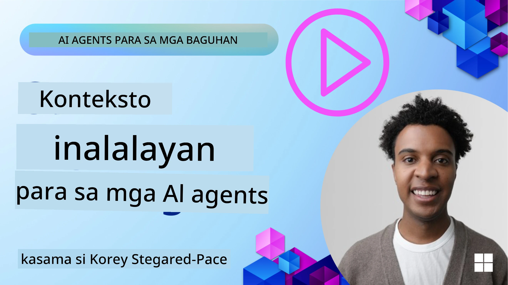
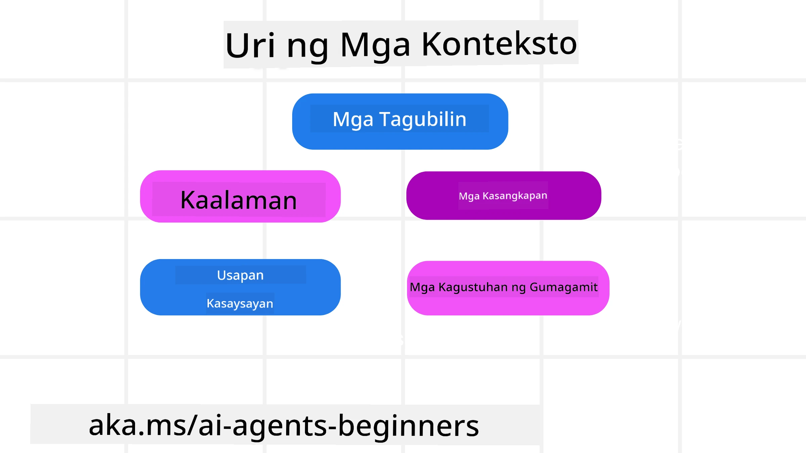
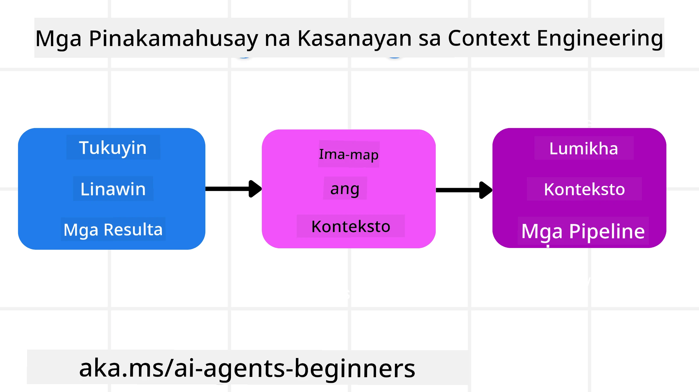

# Context Engineering para sa mga AI Agents

> _(I-click ang larawan sa itaas upang mapanood ang video ng leksyong ito)_

Mahalaga ang pag-unawa sa kumplikasyon ng aplikasyon na iyong binubuo para sa isang AI agent upang makagawa ng maaasahan. Kailangan nating bumuo ng mga AI Agents na epektibong namamahala ng impormasyon upang matugunan ang mga kumplikadong pangangailangan lampas pa sa prompt engineering.

Sa leksyong ito, titingnan natin kung ano ang context engineering at ang papel nito sa pagbuo ng mga AI agents.

## Panimula

Saklaw ng leksyong ito:

• **Ano ang Context Engineering** at bakit ito naiiba sa prompt engineering.

• **Mga Estratehiya para sa epektibong Context Engineering**, kabilang kung paano magsulat, pumili, magsiksik, at maghiwalay ng impormasyon.

• **Mga Karaniwang Pagkabigo sa Context** na maaaring magpalabo sa AI agent at kung paano ito ayusin.

## Mga Layunin sa Pagkatuto

Pagkatapos matapos ang leksyong ito, mauunawaan mo kung paano:

• **Ipaliwanag ang context engineering** at pag-iba ito mula sa prompt engineering.

• **Tukuyin ang mga pangunahing bahagi ng context** sa mga aplikasyon ng Large Language Model (LLM).

• **Ilapat ang mga estratehiya sa pagsusulat, pagpili, pagsisiksik, at paghihiwalay ng context** upang mapabuti ang pagganap ng agent.

• **Kilalanin ang mga karaniwang pagkabigo sa context** gaya ng poisoning, distraction, confusion, at clash, at ipatupad ang mga pamamaraan sa pag-iwas.

## Ano ang Context Engineering?

Para sa mga AI Agents, ang context ang nagtatakda ng pagpaplano ng isang AI Agent upang gumawa ng ilang aksyon. Ang Context Engineering ay ang pagsasanay upang matiyak na ang AI Agent ay may tamang impormasyon upang kumpletuhin ang susunod na hakbang ng gawain. Ang context window ay may limitadong laki, kaya bilang mga tagabuo ng agent kailangan nating bumuo ng mga sistema at proseso para sa pamamahala ng pagdaragdag, pagtanggal, at pagsisiksik ng impormasyon sa context window.

### Prompt Engineering laban sa Context Engineering

Ang prompt engineering ay nakatuon sa isang set ng static na mga tagubilin upang epektibong gabayan ang mga AI Agents gamit ang set ng mga patakaran. Ang context engineering naman ay ang pamamahala ng isang dynamic na set ng impormasyon, kabilang ang paunang prompt, upang matiyak na ang AI Agent ay may kailangan nito sa paglipas ng panahon. Ang pangunahing ideya sa context engineering ay gawing paulit-ulit at maaasahan ang prosesong ito.

### Mga Uri ng Context

Mahalagang tandaan na ang context ay hindi isang bagay lamang. Ang impormasyon na kailangan ng AI Agent ay maaaring manggaling sa iba't ibang mga pinagmulan at nasa atin ang responsibilidad na tiyakin na may access ang agent sa mga pinagmulan na ito:

Ang mga uri ng context na kailangang pamahalaan ng AI agent ay maaaring kabilang ang:

• **Mga Tagubilin:** Parang mga "batas" ng agent ito – prompts, system messages, few-shot na mga halimbawa (na nagpapakita sa AI kung paano gawin ang isang bagay), at mga paglalarawan ng mga tool na maaari nitong gamitin. Dito nagsasanib ang pokus ng prompt engineering at context engineering.

• **Kaalaman:** Saklaw nito ang mga katotohanan, impormasyong nakuha mula sa mga database, o mga pangmatagalang alaala na naipon ng agent. Kasama rito ang pagsasama ng Retrieval Augmented Generation (RAG) system kung kailangan ng agent ng access sa iba't ibang pagtitipon ng kaalaman at database.

• **Mga Tool:** Ito ay mga depinisyon ng mga panlabas na function, APIs at MCP Servers na maaaring tawagan ng agent, kasama ang feedback (mga resulta) na nakukuha nito mula sa paggamit ng mga ito.

• **Kasaysayan ng Usapan:** Ang tuloy-tuloy na dayalogo sa isang user. Habang lumilipas ang panahon, lumalalim at lumalaki ang mga pag-uusap na ito na nangangahulugang kumukuha sila ng espasyo sa context window.

• **Mga Kagustuhan ng User:** Impormasyong natutunan tungkol sa mga hilig o hindi gusto ng user sa paglipas ng panahon. Maaaring ito ay itago at tawagin kapag gumagawa ng mga susi na desisyon upang makatulong sa user.

## Mga Estratehiya para sa Epektibong Context Engineering

### Mga Estratehiya sa Pagpaplano

Ang mahusay na context engineering ay nagsisimula sa mahusay na pagpaplano. Narito ang isang pamamaraan na tutulong sa iyo upang simulan ang pag-iisip kung paano ilalapat ang konsepto ng context engineering:

1. **Tukuyin ang Maliwanag na Resulta** - Ang mga resulta ng mga gawain na itatalaga sa AI Agents ay dapat malinaw na tukuyin. Sagutin ang tanong - "Ano ang magiging hitsura ng mundo kapag natapos na ng AI Agent ang kanyang gawain?" Sa madaling salita, anong pagbabago, impormasyon, o tugon ang dapat makuha ng user pagkatapos makipag-ugnay sa AI Agent.
2. **I-mapa ang Context** - Kapag natukoy mo na ang mga resulta ng AI Agent, kailangan mong sagutin ang tanong na "Anong impormasyon ang kailangan ng AI Agent upang matapos ang gawain na ito?". Sa ganitong paraan, maaari mong simulang ilarawan kung saan matatagpuan ang impormasyong iyon.
3. **Gumawa ng Context Pipelines** - Ngayong alam mo na kung saan ang impormasyon, kailangan mong sagutin ang tanong na "Paano makukuha ng Agent ang impormasyong ito?". Maaaring gawin ito sa iba't ibang paraan kabilang ang RAG, paggamit ng MCP servers at iba pang mga tool.

### Mga Praktikal na Estratehiya

Mahalaga ang pagpaplano pero kapag nagsimulang dumaloy ang impormasyon sa context window ng ating agent, kailangan nating magkaroon ng praktikal na mga estratehiya para pamahalaan ito:

#### Pamamahala ng Context

Habang ang ilang impormasyon ay awtomatikong idinadagdag sa context window, ang context engineering ay tungkol sa pagtanggap ng mas aktibong papel sa impormasyong ito na maaaring gawin sa pamamagitan ng ilang estratehiya:

 1. **Agent Scratchpad**  
 Pinapayagan nito ang AI Agent na magtala ng mahahalagang impormasyon tungkol sa kasalukuyang mga gawain at interaksyon ng user sa isang session. Dapat itong umiiral sa labas ng context window sa isang file o runtime object na maaaring kunin muli ng agent sa session na ito kung kinakailangan.

 2. **Mga Alaala**  
 Maganda ang scratchpads para pamahalaan ang impormasyon sa labas ng context window ng isang session. Pinapahintulutan ng mga alaala ang mga agent na mag-imbak at kumuha ng mahalagang impormasyon sa maraming session. Maaaring kabilang dito ang mga buod, kagustuhan ng user at feedback para sa mga pagpapabuti sa hinaharap.

 3. **Pagsisiksik ng Context**  
  Kapag lumaki na ang context window at malapit nang maabot ang limitasyon, maaaring gamitin ang mga teknik tulad ng pagbubuod at pagputol. Kasama rito ang pagpapanatili lamang ng pinaka-makabuluhang impormasyon o pagtanggal sa mga lumang mensahe.
  
 4. **Mga Multi-Agent System**  
  Ang pagbuo ng multi-agent system ay isang uri ng context engineering dahil bawat agent ay may sariling context window. Paano ang pagbabahagi at pagpasa ng context sa iba't ibang agent ay isang bagay na kailangang planuhin kapag bumubuo ng mga sistemang ito.
  
 5. **Mga Sandbox Environment**  
  Kung kailangan ng agent na magpatakbo ng ilang code o magproseso ng malaking dami ng impormasyon sa isang dokumento, maaaring mangailangan ito ng maraming token para maiproseso ang resulta. Sa halip na itago ito lahat sa context window, maaaring gumamit ang agent ng sandbox environment na kayang magpatakbo ng code na ito at basahin lamang ang mga resulta at iba pang mahalagang impormasyon.
  
 6. **Mga Runtime State Object**  
   Ginagawa ito sa pamamagitan ng paglikha ng mga lalagyan ng impormasyon upang pamahalaan ang mga sitwasyon kung kailan kailangan ng Agent na ma-access ang tiyak na impormasyon. Para sa isang komplikadong gawain, pinapayagan nito ang Agent na itago ang mga resulta ng bawat subtask hakbang-hakbang, na pinapayagan ang context na manatiling konektado lamang sa partikular na subtask.

#### Pagsusuri ng Context

Pagkatapos mong ilapat ang isa sa mga estratehiyang ito, mainam na suriin kung ano talaga ang natanggap sa susunod na tawag sa modelo. Isang kapaki-pakinabang na tanong sa pag-debug ay:

> Nag-load ba ang agent ng sobrang daming context, maling context, o may context na kulang para sa pangangailangan?

Hindi mo kailangang i-log ang raw prompts, output ng tool, o nilalaman ng memorya upang masagot ang tanong na iyon. Sa produksyon, mas mainam na gumamit ng maliliit na record ng pagsusuri ng context na nagtatala ng bilang, mga id, mga hash, at mga label ng polisiya:

- **Pagpili:** Subaybayan kung ilang candidate na chunk, tool, o memory ang isinasaalang-alang, ilan ang napili, at aling alituntunin o marka ang nag-filter sa iba.
- **Pag-compress:** Itala ang source range o trace id, summary id, tinatayang bilang ng token bago at pagkatapos ng compression, at kung ang raw na nilalaman ay hindi isinama sa susunod na tawag.
- **Paghihiwalay:** Itala kung aling subtask ang ginamit sa hiwalay na agent, session, o sandbox, anong bounded summary ang naibalik, at kung ang malaking output ng tool ay nanatiling labas sa konteksto ng parent agent.
- **Memorya at RAG:** Itago ang mga retrieval document id, memory id, mga marka, napiling id, at kalagayan ng pag-redact sa halip na buong teksto na nakuha.
- **Kaligtasan at privacy:** Mas gusto ang mga hash, id, token bucket, at label ng polisiya kaysa sa sensitibong prompt text, argumento ng tool, resulta ng tool, o katawan ng memorya ng user.

Ang layunin ay hindi mag-imbak ng mas maraming context. Layunin nitong mag-iwan ng sapat na ebidensiya upang malaman ng developer kung anong estratehiya sa context ang ginamit at kung ito ba ay nagbago sa susunod na tawag sa modelo sa inaasahang paraan.

### Halimbawa ng Context Engineering

Sabihin nating gusto nating ang AI agent ay **"Mag-book ng biyahe papuntang Paris para sa akin."**

• Ang isang simpleng agent na gumagamit lamang ng prompt engineering ay maaaring sumagot: **"Okay, kailan ka gustong pumunta sa Paris?"**. Pinroseso nito ang direktang tanong mo sa oras na iyon.

• Ang agent na gumagamit ng mga estratehiya sa context engineering na natalakay ay gagawa ng mas marami pa. Bago ito sumagot, maaaring gawin ng system nito ang mga sumusunod:

  ◦ **Suriin ang iyong kalendaryo** para sa mga available na petsa (pagkuha ng real-time na data).

 ◦ **Alalahanin ang mga nakaraang kagustuhan sa paglalakbay** (mula sa long-term memory) tulad ng paboritong airline, budget, o kung gusto mo ng direct flights.

 ◦ **Tukuyin ang mga available na tool** para sa pag-book ng flight at hotel.

- Pagkatapos, isang halimbawa ng sagot ay: "Hey [Your Name]! Nakikita kong malaya ka sa unang linggo ng Oktubre. Hahanapin ko ba ang mga direct flight papuntang Paris sa [Preferred Airline] sa loob ng iyong karaniwang budget na [Budget]?" Ang mas mayaman at context-aware na tugon na ito ay nagpapakita ng kapangyarihan ng context engineering.

## Mga Karaniwang Pagkabigo sa Context

### Context Poisoning

**Ano ito:** Kapag ang isang hallucination (maling impormasyon na nilikha ng LLM) o error ay pumasok sa context at paulit-ulit na tinutukoy, na nagiging dahilan upang maghangad ang agent ng mga imposibleng layunin o bumuo ng mga walang kabuluhang estratehiya.

**Ano ang gagawin:** Magpatupad ng **context validation** at **quarantine**. Suriin ang impormasyon bago ito idagdag sa long-term memory. Kung may hinalang poisoning, magsimula ng bagong context threads upang mapigilan ang pagkalat ng maling impormasyon.

**Halimbawa sa Pag-book ng Biyahe:** Ang iyong agent ay nag-hallucinate ng **direct flight mula sa maliit na lokal na paliparan papunta sa malayong internasyonal na lungsod** na hindi naman talaga nag-aalok ng international flights. Ang di-umiiral na detalye ng flight ay nai-save sa context. Pagkaraan, kapag inutusan mo ang agent na mag-book, patuloy itong naghahanap ng ticket sa imposible na rutang ito, na nagdudulot ng tuluy-tuloy na pagkakamali.

**Solusyon:** Magpatupad ng hakbang na **suriin ang pag-iral at ruta ng flight gamit ang real-time API** _bago_ idagdag ang detalye ng flight sa working context ng agent. Kung pumalya ang validasyon, ang maling impormasyon ay "icensequarantine" at hindi na gagamitin pa.

### Context Distraction

**Ano ito:** Kapag lumaki nang labis ang context na ang modelo ay masyadong nakatuon sa naipong kasaysayan sa halip na gamitin ang natutunan niya sa pagsasanay, na nagreresulta sa paulit-ulit o hindi kapaki-pakinabang na mga aksyon. Maaari nang magkamali ang mga modelo kahit bago pa mapuno ang context window.

**Ano ang gagawin:** Gamitin ang **context summarization**. Paminsang-paminsan ay siksikin ang naipong impormasyon sa mas maikling mga buod, pinananatili ang mahahalagang detalye habang tinatanggal ang mga ugulang kasaysayan. Nakakatulong ito upang "i-reset" ang pokus.

**Halimbawa sa Pag-book ng Biyahe:** Ilang panahon kayong nag-uusap tungkol sa iba’t ibang pangarap mong destinasyon sa paglalakbay, kabilang ang detalyadong kwento ng iyong backpacking trip dalawang taon na ang nakalipas. Nang hilingin mo na sa wakas na **"maghanap ng murang flight para sa susunod na buwan,"** masyado nang naipit ang agent sa mga luma at hindi mahalagang detalye at patuloy na tinatanong tungkol sa backpacking gear o mga lumang itinerary, na hindi pinapansin ang iyong kasalukuyang kahilingan.

**Solusyon:** Pagkatapos ng ilang turns o kapag lumaki nang sobra ang context, dapat i**buodin ng agent ang pinakabagong at pinakamahalagang bahagi ng pag-uusap** – naka-pokus sa iyong kasalukuyang petsa ng paglalakbay at destinasyon – at gamitin ang condensed summary na iyon para sa susunod na tawag sa LLM, itinatanggal ang hindi gaanong mahalagang nagdaang usapan.

### Context Confusion

**Ano ito:** Kapag sobra-sobrang context, madalas sa anyo ng napakaraming available na tool, ay nagiging sanhi ng model na gumawa ng maling sagot o tumawag ng mga hindi kaugnay na tool. Mas prone ang maliliit na modelo dito.

**Ano ang gagawin:** Magpatupad ng **tool loadout management** gamit ang RAG techniques. Itago ang mga deskripsyon ng tool sa vector database at pumili _lamang_ ng pinaka-mahalagang tool para sa bawat partikular na gawain. Pinapakita ng pananaliksik na limitahan sa wala pang 30 ang pagpili ng mga tool.

**Halimbawa sa Pag-book ng Biyahe:** May access ang iyong agent sa dose-dosenang mga tool: `book_flight`, `book_hotel`, `rent_car`, `find_tours`, `currency_converter`, `weather_forecast`, `restaurant_reservations`, atbp. Tinanong mo, **"Ano ang pinakamagandang paraan para makapaglibot sa Paris?"** Dahil sa dami ng mga tool, nalito ang agent at sinubukang tawagan ang `book_flight` _sa loob_ ng Paris, o `rent_car` kahit mas gusto mo ang pampublikong transportasyon, dahil maaaring mag-overlap ang deskripsyon ng mga tool o hindi nito matukoy ang pinaka-angkop.

**Solusyon:** Gamitin ang **RAG sa mga deskripsyon ng tool**. Kapag tinanong mo tungkol sa paglalibot sa Paris, dininamikong kukunin ng sistema _lamang_ ang pinaka-angkop na tool tulad ng `rent_car` o `public_transport_info` base sa iyong query, na nagpapakita ng nakatuong "loadout" ng mga tool sa LLM.

### Context Clash

**Ano ito:** Kapag may magkasalungat na impormasyon sa loob ng context, na nagreresulta sa hindi magkakatugmang pangangatwiran o maling panghuling sagot. Karaniwan itong nangyayari kapag ang impormasyon ay dumarating nang paunti-unti, at nananatili sa context ang maagang, maling mga palagay.

**Ano ang gagawin:** Gamitin ang **context pruning** at **offloading**. Ang pruning ay nangangahulugan ng pagtanggal ng mga lipas o magkasalungat na impormasyon habang dumarating ang mga bagong detalye. Ang offloading ay nagbibigay sa modelo ng hiwalay na "scratchpad" workspace upang iproseso ang impormasyon nang hindi nilalabhan ang pangunahing context.
**Halimbawa ng Pag-book ng Paglalakbay:** Sa simula, sinasabi mo sa iyong ahente, **"Gusto kong lumipad sa economy class."** Kalaunan sa usapan, nagbago ang isip at sinabi mo, **"Sa katunayan, para sa biyaheng ito, mag-business class tayo."** Kung parehong nananatili ang mga tagubilin sa konteksto, maaaring makatanggap ang ahente ng magkasalungat na resulta ng paghahanap o malito kung aling prayoridad ang uunahin.

**Solusyon:** Ipatupad ang **context pruning**. Kapag may bagong tagubilin na salungat sa dati, ang mas luma ay aalisin o malinaw na mapapalitan sa konteksto. Bilang alternatibo, maaaring gumamit ang ahente ng **scratchpad** upang ayusin ang mga magkakasalungat na kagustuhan bago magpasiya, na tinitiyak na ang huling, magkakatugmang tagubilin lang ang gagabay sa mga aksyon nito.

## May Iba Pang Tanong Tungkol sa Context Engineering?

Sumali sa [Microsoft Foundry Discord](https://aka.ms/ai-agents/discord) upang makipagkita sa iba pang mga nag-aaral, dumalo sa office hours, at masagot ang iyong mga tanong tungkol sa AI Agents.

---

<!-- CO-OP TRANSLATOR DISCLAIMER START -->
**Pagtatanggi**:
Ang dokumentong ito ay isinalin gamit ang serbisyo ng AI translation na [Co-op Translator](https://github.com/Azure/co-op-translator). Bagama't nagsusumikap kami para sa katumpakan, pakatandaan na ang awtomatikong pagsasalin ay maaaring maglaman ng mga pagkakamali o hindi pagkakatugma. Ang orihinal na dokumento sa orihinal nitong wika ang dapat ituring na pangunahing sanggunian. Para sa mahahalagang impormasyon, inirerekomenda ang propesyonal na pagsasalin ng tao. Hindi kami mananagot sa anumang maling pagkakaintindi o maling interpretasyon na nagmula sa paggamit ng pagsasaling ito.
<!-- CO-OP TRANSLATOR DISCLAIMER END -->