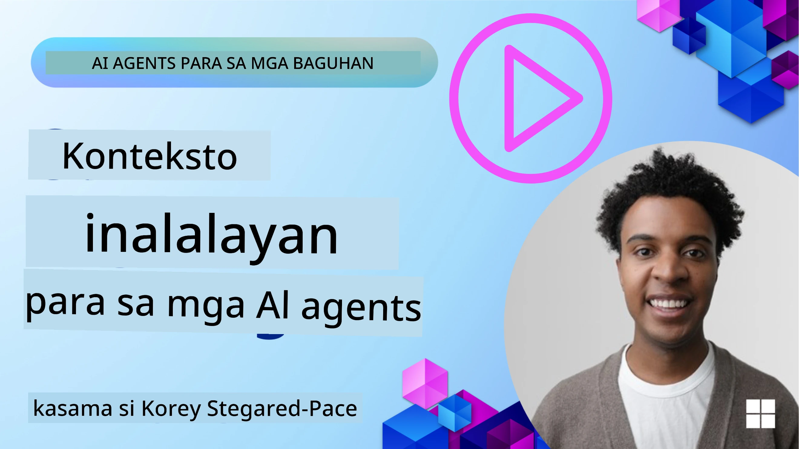
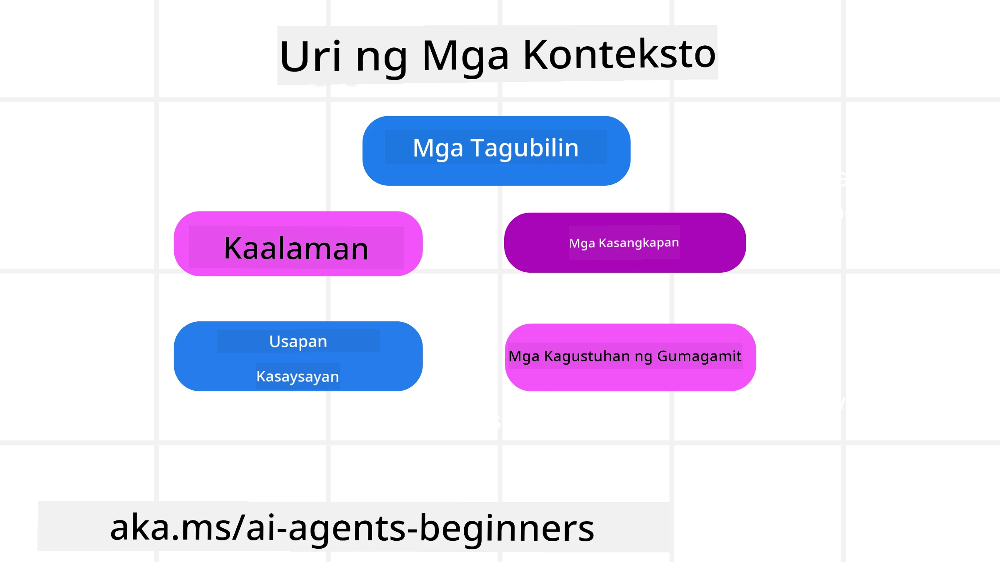
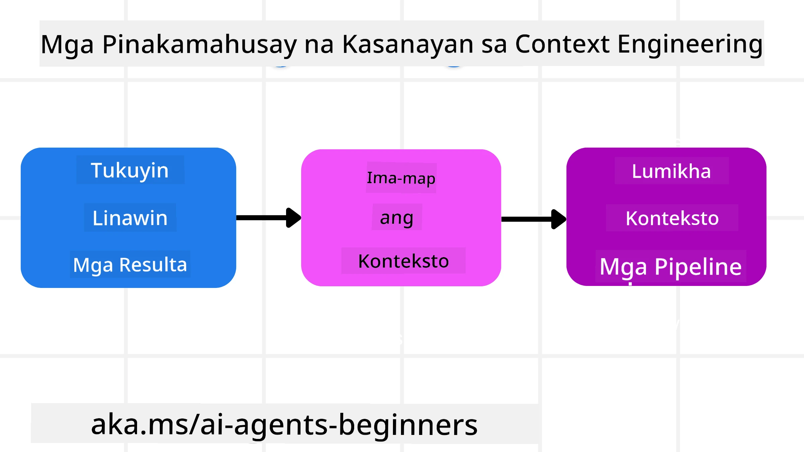

# Context Engineering para sa mga AI Agents

> _(I-klik ang larawan sa itaas upang panoorin ang video ng leksyong ito)_

Mahalaga ang pag-unawa sa pagiging kumplikado ng aplikasyon na binubuo mo para sa isang AI agent upang makagawa ng maaasahang isa. Kailangan nating bumuo ng mga AI Agents na epektibong namamahala ng impormasyon upang tugunan ang mga kumplikadong pangangailangan lampas sa prompt engineering.

Sa leksyong ito, titingnan natin kung ano ang context engineering at ang papel nito sa pagbuo ng mga AI agents.

## Panimula

Sasakupin ng leksyong ito:

• **Ano ang Context Engineering** at bakit ito iba sa prompt engineering.

• **Mga Estratehiya para sa epektibong Context Engineering**, kabilang ang kung paano magsulat, pumili, mag-compress, at mag-isolate ng impormasyon.

• **Mga Karaniwang Pagkabigo sa Konteksto** na maaaring makaapekto sa iyong AI agent at kung paano ito ayusin.

## Mga Layunin sa Pagkatuto

Matapos matapos ang leksyong ito, mauunawaan mo kung paano:

• **Ilarawan ang context engineering** at maihiwalay ito mula sa prompt engineering.

• **Tukuyin ang mga pangunahing bahagi ng konteksto** sa mga aplikasyon ng Large Language Model (LLM).

• **Ipatupad ang mga estratehiya para sa pagsusulat, pagpili, pag-compress, at pag-isolate ng konteksto** upang mapabuti ang pagganap ng agent.

• **Kilalanin ang mga karaniwang pagkabigo sa konteksto** tulad ng poisoning, distraction, confusion, at clash, at magpatupad ng mga teknik sa pag-iwas.

## Ano ang Context Engineering?

Para sa mga AI Agents, ang konteksto ang nagtutulak sa pagpa-plano ng AI Agent upang gumawa ng mga tiyak na aksyon. Ang Context Engineering ay ang pagsasanay upang matiyak na ang AI Agent ay may tamang impormasyon upang makumpleto ang susunod na hakbang ng gawain. Limitado ang laki ng context window, kaya bilang mga tagabuo ng agent kailangan nating bumuo ng mga sistema at proseso upang pamahalaan ang pagdaragdag, pagtanggal, at pag-compress ng impormasyon sa context window.

### Prompt Engineering vs Context Engineering

Nakatuon ang prompt engineering sa isang hanay ng static na mga tagubilin upang epektibong gabayan ang mga AI Agents gamit ang mga alituntunin. Samantala, ang context engineering ay kung paano pamahalaan ang isang dinamikong hanay ng impormasyon, kabilang ang paunang prompt, upang matiyak na ang AI Agent ay may kinakailangan nito sa paglipas ng panahon. Ang pangunahing ideya tungkol sa context engineering ay gawing paulit-ulit at maaasahan ang prosesong ito.

### Mga Uri ng Konteksto

Mahalaga tandaan na ang konteksto ay hindi lamang isang bagay. Ang impormasyon na kailangan ng AI Agent ay maaaring manggaling sa iba't ibang pinagmulan at nasa atin upang siguraduhing may access ang agent sa mga ito:

Ang mga uri ng konteksto na maaaring kailanganin ng AI agent na pamahalaan ay kinabibilangan ng:

• **Mga Tagubilin:** Para itong mga "patakaran" ng agent – mga prompt, mensahe ng sistema, mga halimbawa ng few-shot (na nagpapakita sa AI kung paano gawin ang isang bagay), at mga paglalarawan ng mga tool na maaari nitong gamitin. Dito nagsasanib ang pokus ng prompt engineering at context engineering.

• **Kaalaman:** Saklaw nito ang mga katotohanan, impormasyon na nakuha mula sa mga database, o mga pangmatagalang alaala na naipon ng agent. Kasama dito ang pagsasama ng Retrieval Augmented Generation (RAG) system kung kinakailangan ng agent na ma-access ang iba't ibang imbakan ng kaalaman at mga database.

• **Mga Tool:** Ito ang mga depinisyon ng mga panlabas na function, API at MCP Servers na maaaring tawagan ng agent, kasama ang feedback (mga resulta) na natatanggap nito mula sa paggamit ng mga iyon.

• **Kasaysayan ng Usapan:** Ang patuloy na dayalogo sa isang user. Habang lumilipas ang panahon, ang mga pag-uusap na ito ay lumalawig at nagiging mas kumplikado na nangangahulugang kumukuha ito ng espasyo sa context window.

• **Mga Kagustuhan ng User:** Impormasyon na natutunan tungkol sa mga gusto o ayaw ng isang user sa paglipas ng panahon. Maaaring itago at tawagin ito kapag gumagawa ng mahahalagang desisyon upang matulungan ang user.

## Mga Estratehiya para sa Epektibong Context Engineering

### Mga Estratehiya sa Pagpaplano

Nagsisimula ang magandang context engineering sa mahusay na pagpaplano. Narito ang isang paraan na makakatulong sa iyo na magsimulang mag-isip kung paano iaplay ang konsepto ng context engineering:

1. **Tukuyin ang Malinaw na Resulta** - Ang mga resulta ng mga gawain na itatalaga sa AI Agents ay dapat malinaw na tukuyin. Sagutin ang tanong - "Ano ang magiging hitsura ng mundo kapag tapos na ang AI Agent sa kanyang gawain?" Sa ibang salita, anong pagbabago, impormasyon, o tugon ang dapat makuha ng user pagkatapos makipag-ugnayan sa AI Agent.
2. **I-mapa ang Konteksto** - Kapag natukoy mo na ang mga resulta ng AI Agent, kailangan mong sagutin ang tanong na "Anong impormasyon ang kailangan ng AI Agent upang makumpleto ang gawaing ito?". Sa ganitong paraan, maaari mong simulan ang pagmamapa sa konteksto kung saan maaaring matagpuan ang impormasyong iyon.
3. **Gumawa ng Context Pipelines** - Ngayon na alam mo na kung saan ang impormasyon, kailangan mong sagutin ang tanong na "Paano makukuha ng Agent ang impormasyong ito?". Maaari itong gawin sa iba't ibang paraan kabilang ang RAG, paggamit ng MCP servers at iba pang mga tool.

### Mga Praktikal na Estratehiya

Mahalaga ang pagpaplano ngunit kapag nagsimulang dumaloy ang impormasyon sa context window ng ating agent, kailangan nating magkaroon ng praktikal na mga estratehiya upang pamahalaan ito:

#### Pamamahala sa Konteksto

Habang ang ilang impormasyon ay awtomatikong idaragdag sa context window, ang context engineering ay tungkol sa pagiging mas aktibo sa pamamahala ng impormasyong ito na maaaring gawin gamit ang ilang estratehiya:

 1. **Agent Scratchpad**
 Pinapayagan nito ang AI Agent na magsulat ng mga tala tungkol sa mahalagang impormasyon tungkol sa kasalukuyang mga gawain at interaksyon ng user sa loob ng isang session. Dapat itong ilagay sa labas ng context window sa isang file o runtime na bagay na maaaring kunin ulit ng agent sa session na iyon kung kinakailangan.

 2. **Alaala**
 Mabuti ang mga scratchpad para sa pamamahala ng impormasyon sa labas ng context window ng isang session. Pinapayagan ng mga alaala ang mga agent na mag-imbak at kumuha ng mahalagang impormasyon sa iba't ibang session. Maaari itong magsama ng mga buod, mga kagustuhan ng user, at feedback para sa mga pagpapahusay sa hinaharap.

 3. **Pag-compress ng Konteksto**
  Kapag lumalaki ang context window at papalapit sa limitasyon nito, maaaring gamitin ang mga teknik tulad ng pagsu-summarize at pag-trim. Kasama dito ang pagpapanatili ng pinaka-makabuluhang impormasyon o pagtanggal ng mas lumang mga mensahe.
  
 4. **Multi-Agent Systems**
  Ang pagbuo ng multi-agent system ay isang anyo ng context engineering dahil bawat agent ay may sariling context window. Kung paano ibinabahagi at ipinapasa ang konteksto sa iba't ibang agent ay isa pang bagay na kailangang planuhin sa pagbuo ng mga sistemang ito.
  
 5. **Sandbox Environments**
  Kung nangangailangan ang isang agent na magpatakbo ng code o magproseso ng malalaking dami ng impormasyon sa isang dokumento, maaaring kailanganin nito ng maraming token upang iproseso ang mga resulta. Sa halip na itago lahat ito sa context window, maaaring gamitin ng agent ang isang sandbox environment na kayang patakbuhin ang code na ito at basahin lamang ang mga resulta at iba pang mahahalagang impormasyon.
  
 6. **Runtime State Objects**
   Ginagawa ito sa pamamagitan ng paglikha ng mga lalagyan ng impormasyon upang pamahalaan ang mga sitwasyon kung kailan kailangan ng Agent na magkaroon ng access sa partikular na impormasyon. Para sa isang komplikadong gawain, pinapayagan nito ang Agent na itago ang mga resulta ng bawat hakbang ng subtask nang paisa-isa, na pinapanatili ang konteksto na konektado lamang sa partikular na subtask.

#### Pagsusuri ng Konteksto

Pagkatapos mong i-apply ang isa sa mga estratehiyang ito, mahalagang suriin kung ano talaga ang natanggap sa susunod na tawag sa modelo. Isang kapaki-pakinabang na tanong sa debugging ay:

> Nag-load ba ang agent ng masyadong maraming konteksto, maling konteksto, o may kulang na konteksto na kailangan nito?

Hindi mo kailangang i-log ang mga raw prompt, output ng tool, o nilalaman ng memorya para sagutin ang tanong na iyon. Sa produksyon, mas mainam ang maliliit na tala sa pagsusuri ng konteksto na kumukuha ng bilang, mga id, mga hash, at mga label ng polisiya:

- **Pagpili:** Subaybayan kung ilan ang mga kandidatong chunks, tool, o alaala na tiningnan, ilan ang napili, at kung aling patakaran o iskor ang dahilan ng pagsala sa iba.
- **Pag-compress:** Itala ang source range o trace id, ang summary id, tinatayang bilang ng token bago at pagkatapos ng compression, at kung inalis ang raw content sa susunod na tawag.
- **Pag-isolate:** Tandaan kung aling subtask ang pinatakbo sa hiwalay na agent, session, o sandbox, kung anong bounded summary ang ibinalik, at kung ang malaking output ng tool ay nanatili sa labas ng context ng parent agent.
- **Memorya at RAG:** Itago ang mga retrieval document id, memorya id, mga iskor, mga napiling id, at status ng redaction sa halip na buong text na nakuha.
- **Kaligtasan at privacy:** Mas mainam ang mga hash, id, token buckets, at mga label ng polisiya kaysa sa sensitibong teksto ng prompt, mga argumento ng tool, mga resulta ng tool, o mga katawan ng user memorya.

Ang layunin ay hindi upang mag-imbak ng mas maraming konteksto. Ito ay upang mag-iwan ng sapat na ebidensya upang malaman ng isang developer kung aling estratehiya ng konteksto ang nagpapatakbo at kung binago nito ang susunod na tawag sa modelo sa inaasahang paraan.

### Halimbawa ng Context Engineering

Sabihin nating nais natin ng AI agent na **"Mag-book ng trip papuntang Paris para sa akin."**

• Isang simpleng agent na gumagamit lamang ng prompt engineering ay maaaring sumagot nang: **"Sige, kailan mo gustong pumunta sa Paris?"** Pinoproseso lamang nito ang direktang tanong mo sa oras na iyon na tinanong ng user.

• Isang agent na gumagamit ng mga estratehiya ng context engineering na tinalakay ay gagawa ng mas maraming bagay. Bago pa man ito sumagot, maaaring:

  ◦ **Suriin ang iyong kalendaryo** para sa mga available na petsa (kumuha ng real-time na datos).

 ◦ **Alalahanin ang mga dating kagustuhan sa paglalakbay** (mula sa pangmatagalang memorya) tulad ng paborito mong airline, badyet, o kung mas gusto mo ang direct flights.

 ◦ **Tukuyin ang magagamit na mga tool** para sa pag-book ng flight at hotel.

- Pagkatapos, maaaring ganito ang tugon:  "Hey [Pangalan Mo]! Nakikita kong libre ka sa unang linggo ng Oktubre. Hahanapan kita ng direct flights papuntang Paris gamit ang [Preferred Airline] sa loob ng karaniwang badyet mo na [Budget]." Ang mas mayamang tugon na batay sa konteksto ay nagpapakita ng kapangyarihan ng context engineering.

## Mga Karaniwang Pagkabigo sa Konteksto

### Context Poisoning

**Ano ito:** Kapag may hallucination (maling impormasyon na ginawa ng LLM) o error na pumapasok sa konteksto at paulit-ulit na tinutukoy, na nagiging sanhi ng agent na maghangad ng mga imposible na layunin o bumuo ng mga walang katuturan na estratehiya.

**Dapat gawin:** Magpatupad ng **validasyon ng konteksto** at **quarantine**. Suriin ang impormasyon bago ito idagdag sa pangmatagalang memorya. Kapag may potensyal na poisoning, magsimula ng bagong context threads upang pigilan ang pagkalat ng maling impormasyon.

**Halimbawa sa Pag-book ng Paglalakbay:** Nag-hallucinate ang iyong agent ng **direct flight mula sa maliit na lokal na paliparan patungo sa malayong internasyonal na lungsod** na hindi talaga nag-aalok ng international flights. Ang hindi totoong detalye ng flight na ito ay nai-save sa konteksto. Sa susunod, kapag nag-request kang mag-book, patuloy na sinusubukan ng agent na maghanap ng tiket para sa imposibleng ruta na ito, na nagreresulta sa paulit-ulit na mga error.

**Solusyon:** Magpatupad ng hakbang na **sinusuri ang pagkakaroon at ruta ng flight gamit ang real-time API** _bago_ idagdag ang detalye ng flight sa working context ng agent. Kapag nabigo ang pagsusuri, ang maling impormasyon ay "quinarantine" at hindi na ginagamit pa.

### Context Distraction

**Ano ito:** Kapag ang konteksto ay naging napakalaki na masyadong nakatuon ang modelo sa naipong kasaysayan at hindi na nagagamit ang natutunan mula sa pagsasanay, na nagdudulot ng paulit-ulit o hindi kapaki-pakinabang na mga aksyon. Maaaring magsimulang magkamali ang mga modelo kahit bago pa mapuno ang context window.

**Dapat gawin:** Gamitin ang **pagbabawas ng konteksto sa buod**. Paminsan-minsan i-compress ang naipong impormasyon sa mas maigsi na mga buod, pinananatili ang mahalagang detalye habang tinatanggal ang paulit-ulit na kasaysayan. Nakakatulong ito sa "pag-reset" ng pokus.

**Halimbawa sa Pag-book ng Paglalakbay:** Matagal mo nang pinag-uusapan ang iba't ibang pangarap na destinasyon kasama na ang detalyadong pagsasalaysay ng iyong backpacking trip dalawang taon na ang nakakaraan. Nang huli mong utos ay **"hanapan mo ako ng murang flight para sa susunod na buwan,"** napapabilaukan ang agent sa mga lumang hindi na mahalagang detalye at patuloy na nagtatanong tungkol sa iyong backpacking gear o mga dating itinerary, na hindi pinapansin ang kasalukuyang hiling.

**Solusyon:** Pagkatapos ng ilang mga turn o kapag lumaki nang husto ang konteksto, dapat **buodin ng agent ang pinaka-kamakailan at mahalagang bahagi ng pag-uusap** – nakatuon sa iyong kasalukuyang mga petsa at destinasyon – at gamitin ang pinaikling buod na iyon sa susunod na tawag sa LLM, itinapon ang hindi gaanong kaugnay na mga nakaraang usapan.

### Context Confusion

**Ano ito:** Kapag ang hindi kinakailangang konteksto, kadalasan sa anyo ng masyadong maraming magagamit na mga tool, ay nagiging sanhi sa modelo na bumuo ng mga maling tugon o tawagan ang mga di-nauugnay na tool. Lalo na itong nangyayari sa mga mas maliit na modelo.

**Dapat gawin:** Magpatupad ng **tool loadout management** gamit ang mga teknik ng RAG. Itago ang mga deskripsyon ng tool sa isang vector database at piliin _lamang_ ang pinaka-kaugnay na mga tool para sa bawat partikular na gawain. Ipinapakita ng pananaliksik na mas mainam na limitahan ang tool selections sa ilalim ng 30.

**Halimbawa sa Pag-book ng Paglalakbay:** May access ang iyong agent sa dose-dosenang mga tool: `book_flight`, `book_hotel`, `rent_car`, `find_tours`, `currency_converter`, `weather_forecast`, `restaurant_reservations`, atbp. Tinanong mo, **"Ano ang pinakamahusay na paraan para makalibot sa Paris?"** Dahil sa napakaraming tool, nalilito ang agent at tinatangkang tawagan ang `book_flight` _sa loob_ ng Paris, o `rent_car` kahit mas gusto mo ang pampublikong transportasyon, dahil maaaring mag-overlap ang mga deskripsyon ng tool o hindi nito matukoy kung alin ang pinaka-angkop.

**Solusyon:** Gumamit ng **RAG sa mga deskripsyon ng tool**. Kapag nagtanong ka tungkol sa paglibot sa Paris, ang sistema ay dinamiko na kokolekta _lamang_ ng pinaka-kaugnay na mga tool tulad ng `rent_car` o `public_transport_info` batay sa iyong query, na nagpapakita ng nakatuong "loadout" ng mga tool sa LLM.

### Context Clash

**Ano ito:** Kapag may magkasalungat na impormasyon sa loob ng konteksto, na nagreresulta sa hindi magkatugmang pangangatwiran o masasamang huling tugon. Kadalasan itong nangyayari kapag dahan-dahang dumadating ang impormasyon, at ang mga unang maling palagay ay nananatili sa konteksto.

**Dapat gawin:** Gamitin ang **context pruning** at **offloading**. Ang pruning ay nangangahulugan ng pagtanggal ng lipas o salungat na impormasyon habang dumarating ang mga bagong detalye. Ang offloading naman ay nagbibigay sa modelo ng hiwalay na "scratchpad" na workspace upang iproseso ang impormasyon nang hindi nagkaka-klutter ang pangunahing konteksto.

**Halimbawa ng Pag-book ng Paglalakbay:** Sa simula, sinasabi mo sa iyong ahente, **"Gusto kong maglipad sa economy class."** Sa kalaunan ng pag-uusap, nagbago ang iyong isip at sinabi mo, **"Sa katunayan, para sa paglalakbay na ito, pumunta tayo sa business class."** Kung nananatili ang parehong mga tagubilin sa konteksto, maaaring makatanggap ang ahente ng magkasalungat na resulta ng paghahanap o malito kung alin sa mga prayoridad ang dapat unahin.

**Solusyon:** Ipatupad ang **context pruning**. Kapag ang isang bagong tagubilin ay sumasalungat sa isang luma, ang mas matandang tagubilin ay tinatanggal o hayagang pinapalitan sa konteksto. Bilang alternatibo, maaaring gamitin ng ahente ang isang **scratchpad** upang ayusin ang mga magkasalungat na kagustuhan bago magdesisyon, na tinitiyak na ang tanging huling, pare-parehong tagubilin lamang ang gumabay sa mga aksyon nito.

## May Karagdagan Pang Mga Tanong Tungkol sa Context Engineering?

Sumali sa [Microsoft Foundry Discord](https://discord.com/invite/ATgtXmAS5D) upang makilala ang iba pang mga nag-aaral, dumalo sa mga office hours, at masagot ang iyong mga tanong tungkol sa AI Agents.

---

<!-- CO-OP TRANSLATOR DISCLAIMER START -->
**Pagtatanggi**:
Ang dokumentong ito ay isinalin gamit ang serbisyo ng AI translation na [Co-op Translator](https://github.com/Azure/co-op-translator). Bagama't nagsusumikap kami para sa katumpakan, pakatandaan na ang awtomatikong pagsasalin ay maaaring maglaman ng mga pagkakamali o hindi pagkakatugma. Ang orihinal na dokumento sa orihinal nitong wika ang dapat ituring na pangunahing sanggunian. Para sa mahahalagang impormasyon, inirerekomenda ang propesyonal na pagsasalin ng tao. Hindi kami mananagot sa anumang maling pagkakaintindi o maling interpretasyon na nagmula sa paggamit ng pagsasaling ito.
<!-- CO-OP TRANSLATOR DISCLAIMER END -->