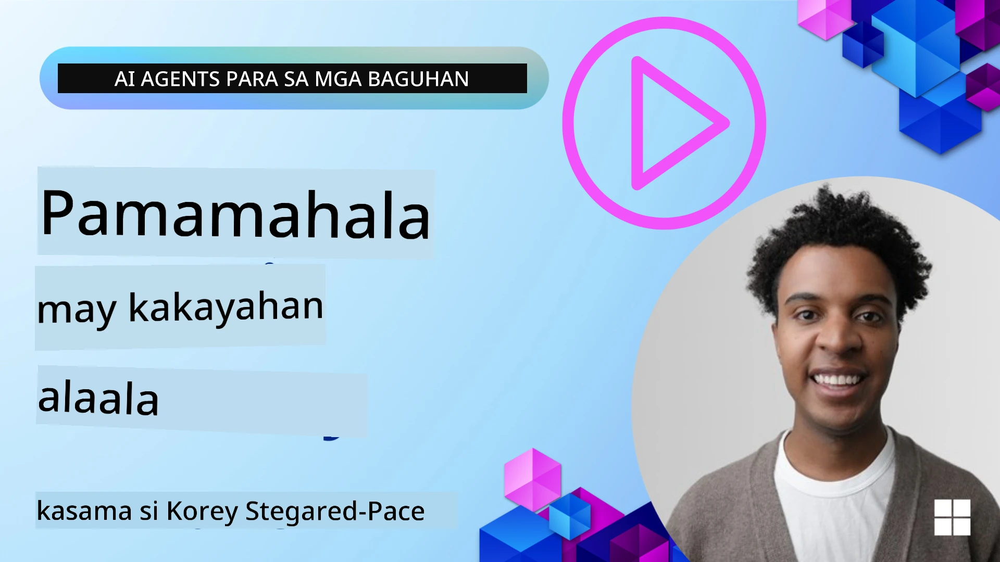

# Memorya para sa mga AI Agent 

Kapag tinatalakay ang natatanging mga benepisyo ng paglikha ng mga AI agent, dalawang bagay ang kadalasang binabanggit: ang kakayahang tumawag ng mga tool upang kumpletuhin ang mga gawain at ang kakayahang umunlad sa paglipas ng panahon. Ang memorya ang pundasyon ng paglikha ng ahenteng nagpapabuti sa sarili na makagagawa ng mas mahusay na karanasan para sa ating mga gumagamit.

Sa araling ito, titingnan natin kung ano ang memorya para sa mga AI agent at kung paano natin ito pamahalaan at gamitin para sa kapakinabangan ng ating mga aplikasyon.

## Panimula

Saklaw ng araling ito:

• **Pag-unawa sa Memorya ng AI Agent**: Ano ang memorya at bakit ito mahalaga para sa mga ahente.

• **Pagpapatupad at Pag-iimbak ng Memorya**: Praktikal na mga paraan para magdagdag ng kakayahan sa memorya sa iyong mga AI agent, na nakatuon sa pansamantala at pangmatagalang memorya.

• **Paggawing Nagpapabuti sa Sarili ang mga AI Agent**: Paano pinahihintulutan ng memorya ang mga ahente na matuto mula sa nakaraang mga interaksyon at umunlad sa paglipas ng panahon.

## Mga Magagamit na Implementasyon

Kasama sa araling ito ang dalawang komprehensibong tutorial na notebook:

• **[13-agent-memory.ipynb](./13-agent-memory.ipynb)**: Nagpapatupad ng memorya gamit ang Mem0 at Azure AI Search kasama ang Microsoft Agent Framework

• **[13-agent-memory-cognee.ipynb](./13-agent-memory-cognee.ipynb)**: Nagpapatupad ng istrukturadong memorya gamit ang Cognee, na awtomatikong bumubuo ng knowledge graph na sinusuportahan ng embeddings, nagvi-visualize ng graph, at nag-aalok ng intelihenteng retrieval

## Mga Layunin sa Pagkatuto

Pagkatapos tapusin ang araling ito, malalaman mo kung paano:

• **Iba-ibahin ang iba't ibang uri ng memorya ng AI agent**, kabilang ang working, short-term, at long-term memory, pati na rin ang mga espesyal na anyo tulad ng persona at episodic memory.

• **Magpatupad at pamahalaan ang pansamantala at pangmatagalang memorya para sa mga AI agent** gamit ang Microsoft Agent Framework, na ginagamit ang mga tool tulad ng Mem0, Cognee, Whiteboard memory, at integrasyon sa Azure AI Search.

• **Unawain ang mga prinsipyo sa likod ng mga ahenteng nagpapabuti sa sarili** at kung paano nakatutulong ang matibay na sistema ng pamamahala ng memorya sa tuloy-tuloy na pagkatuto at pag-aangkop.

## Pag-unawa sa Memorya ng AI Agent

Sa pinakapuso nito, **ang memorya para sa mga AI agent ay tumutukoy sa mga mekanismong nagpapahintulot sa kanila na magtago at magbalik-tanaw ng impormasyon**. Ang impormasyong ito ay maaaring tiyak na detalye tungkol sa isang pag-uusap, mga kagustuhan ng gumagamit, mga nakaraang aksyon, o kahit mga natutunang pattern.

Kung walang memorya, kadalasang stateless ang mga AI application, ibig sabihin nagsisimula mula sa simula ang bawat interaksyon. Nagdudulot ito ng paulit-ulit at nakakainis na karanasan para sa gumagamit kung saan ang ahente ay "nakakalimot" ng naunang konteksto o mga kagustuhan.

### Bakit Mahalaga ang Memorya?

Ang katalinuhan ng isang ahente ay malalim na nakaugnay sa kakayahan nito na magbalik-tanaw at gumamit ng nakaraang impormasyon. Pinahihintulutan ng memorya ang mga ahente na maging:

• **Mapagmuni-muni**: Nag-aaral mula sa nakaraang mga aksyon at resulta.

• **Nakikipag-ugnayan**: Nananatili ang konteksto sa isang nagpapatuloy na pag-uusap.

• **Proaktibo at Reaktibo**: Inaasahan ang mga pangangailangan o tumutugon nang naaangkop batay sa historikal na datos.

• **Autonomo**: Gumagana nang mas malaya sa pamamagitan ng pagkuha sa nakaimbak na kaalaman.

Ang layunin ng pagpapatupad ng memorya ay gawing mas **mapagkakatiwalaan at may kakayahan** ang mga ahente.

### Mga Uri ng Memorya

#### Gumaganang Memorya

Isipin ito bilang isang piraso ng papel na ginagamit ng ahente habang isinasagawa ang isang nag-iisang, nagpapatuloy na gawain o proseso ng pag-iisip. Nagtatago ito ng agarang impormasyong kailangan upang kalkulahin ang susunod na hakbang.

Para sa mga AI agent, madalas na kinukuha ng gumaganang memorya ang pinaka-nauugnay na impormasyon mula sa isang pag-uusap, kahit na mahaba o na-truncate ang buong kasaysayan ng chat. Nakatuon ito sa pagkuha ng mga pangunahing elemento tulad ng mga kinakailangan, panukala, desisyon, at mga aksyon.

**Halimbawa ng Gumaganang Memorya**

Sa isang ahente para sa pag-book ng biyahe, maaaring kunin ng gumaganang memorya ang kasalukuyang kahilingan ng gumagamit, tulad ng "Gusto kong mag-book ng biyahe papuntang Paris". Ang tiyak na kahilingang ito ay hinahawakan sa agarang konteksto ng ahente upang gabayan ang kasalukuyang interaksyon.

#### Pansamantalang Memorya

Ang uri ng memoryang ito ay nagtatago ng impormasyon sa loob ng isang pag-uusap o sesyon. Ito ang konteksto ng kasalukuyang chat, na nagpapahintulot sa ahente na tumukoy pabalik sa mga naunang palitan sa dialogue.

**Halimbawa ng Pansamantalang Memorya**

Kung ang isang gumagamit ay nagtanong, "Magkano ang pamasahe ng flight papuntang Paris?" at pagkatapos ay sumunod ng "Paano naman ang accommodation doon?", tinitiyak ng pansamantalang memorya na alam ng ahente na ang "doon" ay tumutukoy sa "Paris" sa loob ng parehong pag-uusap.

#### Pangmatagalang Memorya

Ito ay impormasyon na nagpapatuloy sa maraming pag-uusap o sesyon. Pinahihintulutan nito ang mga ahente na tandaan ang mga kagustuhan ng gumagamit, mga historikal na interaksyon, o pangkalahatang kaalaman sa mahabang panahon. Mahalaga ito para sa personalisasyon.

**Halimbawa ng Pangmatagalang Memorya**

Maaaring mag-imbak ang pangmatagalang memorya na "Si Ben ay mahilig sa skiing at mga panlabas na aktibidad, gusto ng kape na may tanawin ng bundok, at nais iwasan ang mga advanced na ski slopes dahil sa isang nakaraang pinsala". Ang impormasyong ito, na natutunan mula sa mga nakaraang interaksyon, ay nakakaapekto sa mga rekomendasyon sa mga susunod na session ng pagpaplano ng biyahe, na ginagawang lubos na personalisado ang mga ito.

#### Memorya ng Persona

Ang espesyal na uri ng memoryang ito ay tumutulong sa isang ahente na bumuo ng isang pare-parehong "personality" o "persona". Pinahihintulutan nito ang ahente na tandaan ang mga detalye tungkol sa sarili nito o sa hinahangad na papel nito, na ginagawang mas daloy at nakatuon ang mga interaksyon.

**Halimbawa ng Memorya ng Persona**
Kung ang travel agent ay dinisenyo upang maging isang "expert ski planner," maaaring palakasin ng persona memory ang papel na ito, na nakaimpluwensya sa mga tugon nito upang umayon sa tono at kaalaman ng isang eksperto.

#### Memorya ng Workflow/Episodiko

Itong memorya ay nag-iimbak ng pagkakasunod-sunod ng mga hakbang na ginawa ng ahente sa isang komplikadong gawain, kabilang ang mga tagumpay at kabiguan. Para itong pag-alaala ng mga tiyak na "episodyo" o nakaraang karanasan upang matuto mula rito.

**Halimbawa ng Episodic Memory**

Kung sinubukan ng ahente na mag-book ng isang partikular na flight ngunit nabigo dahil sa kawalan ng availability, maaaring itala ng episodic memory ang kabiguan na ito, na nagbibigay-daan sa ahente na subukan ang mga alternatibong flight o ipaalam sa gumagamit ang isyu nang mas may kamalayan sa susunod na pagtatangka.

#### Memorya ng Entidad

Kabilang dito ang pagkuha at pag-alaala ng mga partikular na entidad (tulad ng mga tao, lugar, o bagay) at mga kaganapan mula sa mga pag-uusap. Pinahihintulutan nito ang ahente na bumuo ng istrukturadong pag-unawa sa mga pangunahing elemento na tinalakay.

**Halimbawa ng Memorya ng Entidad**

Mula sa isang pag-uusap tungkol sa isang nakaraang biyahe, maaaring kunin ng ahente ang "Paris," "Eiffel Tower," at "dinner sa Le Chat Noir restaurant" bilang mga entidad. Sa isang hinaharap na interaksyon, maaaring maalala ng ahente ang "Le Chat Noir" at mag-alok na gumawa ng bagong reservation doon.

#### Structured RAG (Retrieval Augmented Generation)

Habang ang RAG ay isang mas malawak na teknik, ang "Structured RAG" ay binibigyang-diin bilang isang makapangyarihang teknolohiya sa memorya. Kinukuha nito ang siksik, istrukturadong impormasyon mula sa iba't ibang pinagmulan (mga pag-uusap, email, imahe) at ginagamit ito upang mapabuti ang katumpakan, recall, at bilis ng mga tugon. Hindi tulad ng klasikong RAG na umaasa lamang sa semantic similarity, ang Structured RAG ay gumagana kasama ang likas na istruktura ng impormasyon.

**Halimbawa ng Structured RAG**

Sa halip na pag-match lamang ng mga keyword, maaaring i-parse ng Structured RAG ang mga detalye ng flight (destinasyon, petsa, oras, airline) mula sa isang email at iimbak ang mga ito sa isang istrukturadong paraan. Pinahihintulutan nito ang tumpak na mga query tulad ng "Anong flight ang na-book ko papuntang Paris noong Martes?"

## Pagpapatupad at Pag-iimbak ng Memorya

Ang pagpapatupad ng memorya para sa mga AI agent ay nangangailangan ng sistematikong proseso ng **pamamahala ng memorya**, na kinabibilangan ng pagbuo, pag-iimbak, pag-retrieve, pagsasama, pag-update, at kahit ang "pagkalimot" (o pagtanggal) ng impormasyon. Ang retrieval ay isang partikular na mahalagang aspeto.

### Espesyal na Mga Kasangkapan sa Memorya

#### Mem0

Isang paraan upang mag-imbak at pamahalaan ang memorya ng ahente ay ang paggamit ng mga espesyal na kasangkapan tulad ng Mem0. Gumagana ang Mem0 bilang isang persistent memory layer, na nagpapahintulot sa mga ahente na maalala ang mga nauugnay na interaksyon, mag-imbak ng mga kagustuhan ng gumagamit at faktwal na konteksto, at matuto mula sa mga tagumpay at kabiguan sa paglipas ng panahon. Ang ideya dito ay nagiging stateful ang mga dating stateless na ahente.

Gumagana ito sa pamamagitan ng isang **two-phase memory pipeline: extraction and update**. Unang ipinapadala ang mga mensaheng idinadagdag sa thread ng isang ahente sa serbisyo ng Mem0, na gumagamit ng isang Large Language Model (LLM) upang ibuod ang kasaysayan ng pag-uusap at kunin ang mga bagong memorya. Kasunod nito, isang LLM-driven update phase ang tumutukoy kung dapat bang idagdag, baguhin, o tanggalin ang mga memoryang ito, at iniimbak ang mga ito sa isang hybrid na data store na maaaring magsama ng vector, graph, at key-value na mga database. Sinusuportahan din ng sistemang ito ang iba't ibang uri ng memorya at maaaring isama ang graph memory para pamahalaan ang mga relasyon sa pagitan ng mga entidad.

#### Cognee

Isa pang makapangyarihang paraan ay ang paggamit ng **Cognee**, isang open-source semantic memory para sa mga AI agent na nagbabalangkas ng istrukturado at hindi istrukturadong data sa mga queryable knowledge graph na sinusuportahan ng embeddings. Nagbibigay ang Cognee ng isang **dual-store architecture** na pinagsasama ang vector similarity search at mga relasyon ng graph, na nagpapahintulot sa mga ahente na maunawaan hindi lamang kung aling impormasyon ang magkatulad, kundi kung paano magkakaugnay ang mga konsepto.

Namumukod-tangi ito sa **hybrid retrieval** na naghahalo ng vector similarity, graph structure, at LLM reasoning - mula sa raw chunk lookup hanggang sa graph-aware question answering. Pinananatili ng sistema ang **living memory** na umuunlad at lumalaki habang nananatiling ma-query bilang isang konektadong graph, sumusuporta sa parehong pansamantalang session context at pangmatagalang persistent memory.

Ipinapakita ng Cognee notebook tutorial ([13-agent-memory-cognee.ipynb](./13-agent-memory-cognee.ipynb)) ang pagbuo ng pinag-isang memory layer na ito, na may praktikal na mga halimbawa ng pag-ingest ng magkakaibang mga pinagmulan ng data, pag-visualize ng knowledge graph, at pag-query gamit ang iba't ibang mga search strategy na iniangkop sa partikular na mga pangangailangan ng ahente.

### Pag-iimbak ng Memorya gamit ang RAG

Higit sa mga espesyal na kasangkapan sa memorya tulad ng Mem0, maaari mong gamitin ang mga matitibay na serbisyo sa paghahanap tulad ng **Azure AI Search bilang backend para sa pag-iimbak at pag-retrieve ng mga memorya**, lalo na para sa structured RAG.

Pinahihintulutan ka nitong i-ground ang mga tugon ng iyong ahente sa iyong sariling data, na tinitiyak ang mas nauugnay at mas tumpak na mga sagot. Maaaring gamitin ang Azure AI Search upang mag-imbak ng mga memorya ng gumagamit na nauugnay sa paglalakbay, mga katalogo ng produkto, o anumang iba pang domain-specific na kaalaman.

Sinusuportahan ng Azure AI Search ang mga kakayahang tulad ng **Structured RAG**, na namumukod-tangi sa pagkuha at pag-retrieve ng siksik, istrukturadong impormasyon mula sa malalaking dataset tulad ng kasaysayan ng pag-uusap, mga email, o kahit mga imahe. Nagbibigay ito ng "superhuman precision and recall" kumpara sa tradisyunal na text chunking at embedding approaches.

## Paggawing Nagpapabuti sa Sarili ang mga AI Agent

Isang karaniwang pattern para sa mga ahenteng nagpapabuti sa sarili ay ang pagpapakilala ng isang **"knowledge agent"**. Ang hiwalay na ahenteng ito ay nagmamasid sa pangunahing pag-uusap sa pagitan ng gumagamit at ng pangunahing ahente. Ang tungkulin nito ay:

1. **Tukuyin ang mahalagang impormasyon**: Alamin kung may bahagi ng pag-uusap na karapat-dapat i-save bilang pangkalahatang kaalaman o partikular na kagustuhan ng gumagamit.

2. **Kunin at ibuod**: Ilahad ang mahalagang natutunan o kagustuhan mula sa pag-uusap.

3. **I-imbak sa knowledge base**: Panatilihin ang na-extract na impormasyong ito, madalas sa isang vector database, upang ma-retrieve sa kalaunan.

4. **Palawakin ang mga susunod na query**: Kapag nagsimula ang gumagamit ng bagong query, nire-retrieve ng knowledge agent ang mga nauugnay na nakaimbak na impormasyon at idinadagdag ito sa prompt ng gumagamit, na nagbibigay ng mahalagang konteksto sa pangunahing ahente (kahawig ng RAG).

### Mga Pag-optimize para sa Memorya

• **Pamamahala ng Latency**: Upang maiwasang pabagalin ang mga interaksyon ng gumagamit, maaaring gumamit muna ng mas mura, mas mabilis na modelo upang mabilis na suriin kung mahalaga ang impormasyon na i-imbak o i-retrieve, at tatawagin lamang ang mas kumplikadong proseso ng extraction/retrieval kapag kinakailangan.

• **Pagpapanatili ng Knowledge Base**: Para sa lumalaking knowledge base, ang hindi gaanong madalas gamitin na impormasyon ay maaaring ilipat sa "cold storage" upang pamahalaan ang mga gastos.

## May Karagdagang mga Tanong Tungkol sa Agent Memory?

Sumali sa [Microsoft Foundry Discord](https://aka.ms/ai-agents/discord) upang makipagkita sa iba pang mga nag-aaral, dumalo sa office hours at masagot ang iyong mga tanong tungkol sa AI Agents.

---

<!-- CO-OP TRANSLATOR DISCLAIMER START -->
Paunawa:
Isinalin ang dokumentong ito gamit ang serbisyong pagsasalin na pinapagana ng AI na [Co-op Translator](https://github.com/Azure/co-op-translator). Bagaman sinisikap naming maging tumpak, pakitandaan na ang mga awtomatikong salin ay maaaring maglaman ng mga pagkakamali o di-tumpak na impormasyon. Ang orihinal na dokumento sa kanyang likas na wika ang dapat ituring na pinakapinagkakatiwalaang sanggunian. Para sa mahahalagang impormasyon, inirerekomenda ang propesyonal na salin ng tao. Hindi kami mananagot sa anumang hindi pagkakaunawaan o maling interpretasyon na nagmumula sa paggamit ng salin na ito.
<!-- CO-OP TRANSLATOR DISCLAIMER END -->