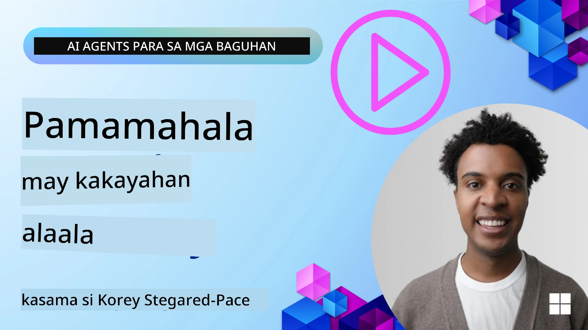

# Memorya para sa mga Ahente ng AI

Kapag pinag-uusapan ang mga natatanging benepisyo ng paggawa ng mga Ahente ng AI, dalawang bagay ang pangunahing tinatalakay: ang kakayahang tumawag ng mga tool upang tapusin ang mga gawain at ang kakayahang mag-improve sa paglipas ng panahon. Ang memorya ang pundasyon ng paglikha ng self-improving na ahente na makakalikha ng mas magagandang karanasan para sa ating mga gumagamit.

Sa araling ito, titingnan natin kung ano ang memorya para sa mga Ahente ng AI at kung paano natin ito pamahalaan at gamitin para sa kapakinabangan ng ating mga aplikasyon.

## Panimula

Sasaklawin ng araling ito ang:

• **Pag-unawa sa Memorya ng Ahente ng AI**: Ano ang memorya at bakit ito mahalaga para sa mga ahente.

• **Pagpapatupad at Pag-iimbak ng Memorya**: Mga praktikal na paraan para magdagdag ng kakayahan sa memorya sa iyong mga ahente ng AI, na nakatuon sa panandalian at pangmatagalang memorya.

• **Paggawa ng mga Ahente ng AI na Self-improving**: Paano pinapagana ng memorya ang mga ahente upang matuto mula sa mga nakaraang interaksyon at mag-improve sa paglipas ng panahon.

## Magagamit na mga Implementasyon

Kasama sa araling ito ang dalawang komprehensibong notebook tutorials:

• **[13-agent-memory.ipynb](./13-agent-memory.ipynb)**: Nagpapatupad ng memorya gamit ang Mem0 at Azure AI Search gamit ang Microsoft Agent Framework

• **[13-agent-memory-cognee.ipynb](./13-agent-memory-cognee.ipynb)**: Nagpapatupad ng istrakturadong memorya gamit ang Cognee, na awtomatikong bumubuo ng knowledge graph na sinusuportahan ng embeddings, nagpapakita ng graph, at matalinong retrieval

## Mga Layunin sa Pagkatuto

Pagkatapos makumpleto ang araling ito, malalaman mo kung paano:

• **Ihambing ang iba't ibang uri ng memorya ng ahente ng AI**, kabilang ang working, short-term, at long-term memory, pati na rin ang mga espesyal na anyo gaya ng persona at episodic memory.

• **Ipakatupad at pamahalaan ang panandalian at pangmatagalang memorya para sa mga ahente ng AI** gamit ang Microsoft Agent Framework, gamit ang mga tool tulad ng Mem0, Cognee, Whiteboard memory, at pagsasama sa Azure AI Search.

• **Unawain ang mga prinsipyo sa likod ng self-improving AI agents** at kung paano nakakatulong ang malalakas na sistema ng pamamahala ng memorya sa tuloy-tuloy na pagkatuto at adaptasyon.

## Pag-unawa sa Memorya ng Ahente ng AI

Sa pinaka-puso nito, **ang memorya para sa mga ahente ng AI ay tumutukoy sa mga mekanismong nagpapahintulot sa kanila na magtago at maalala ang impormasyon**. Ang impormasyong ito ay maaaring mga tiyak na detalye tungkol sa isang pag-uusap, mga kagustuhan ng gumagamit, mga nakaraang aksyon, o maging mga natutunang pattern.

Kung walang memorya, ang mga aplikasyon ng AI ay madalas na walang estado, ibig sabihin ay nagsisimula mula sa simula ang bawat interaksyon. Nagdudulot ito ng paulit-ulit at nakakainis na karanasan sa gumagamit kung saan "nakakalimot" ang ahente ng naunang konteksto o mga kagustuhan.

### Bakit Mahalaga ang Memorya?

ang katalinuhan ng isang ahente ay malalim na nakatali sa kakayahan nitong maalala at gamitin ang nakaraang impormasyon. Pinapayagan ng memorya ang mga ahente na maging:

• **Nagmumuni-muni**: Natututo mula sa mga nakaraang aksyon at resulta.

• **Nakikipag-ugnayan**: Pinananatili ang konteksto sa isang nagaganap na pag-uusap.

• **Proaktibo at Reaktibo**: Inaabangan ang mga pangangailangan o tumutugon ng angkop batay sa datos mula sa nakaraan.

• **Autonomous**: Nag-ooperate nang mas independyente sa pagkuha ng naka-imbak na kaalaman.

Ang layunin ng pagpapatupad ng memorya ay gawing mas **mapagkakatiwalaan at kapable** ang mga ahente.

### Mga Uri ng Memorya

#### Working Memory

Isipin ito bilang isang piraso ng scratch paper na ginagamit ng ahente habang ginagawa ang isang gawain o pag-iisip. Ito ang humahawak ng agarang impormasyon na kailangan upang makalkula ang susunod na hakbang.

Para sa mga AI agents, madalas na kinokapture ng working memory ang pinakaperting impormasyon mula sa isang pag-uusap, kahit na mahaba o pinaikli ang buong kasaysayan ng chat. Nakatuon ito sa pagkuha ng mga pangunahing elemento tulad ng mga kinakailangan, mga panukala, mga desisyon, at mga aksyon.

**Halimbawa ng Working Memory**

Sa isang travel booking agent, maaaring i-capture ng working memory ang kasalukuyang kahilingan ng gumagamit, gaya ng "Gusto kong mag-book ng biyahe papuntang Paris". Ang partikular na kinakailangang ito ay hawak sa agarang konteksto ng ahente upang gabayan ang kasalukuyang interaksyon.

#### Short Term Memory

Ang ganitong uri ng memorya ay naghahawak ng impormasyon para sa tagal ng isang pag-uusap o session lamang. Ito ang konteksto ng kasalukuyang chat, na nagpapahintulot sa ahente na balikan ang mga naunang pag-uusap sa diyalogo.

Sa [Microsoft Agent Framework](https://github.com/microsoft/agent-framework) Python SDK samples, ito ay tumutukoy sa `AgentSession`, na nilikha gamit ang `agent.create_session()`. Ang session ay ang built-in na short-term memory ng framework: pinananatili nito ang konteksto ng pag-uusap habang ginagamit pa rin ang parehong session, pero hindi ito naiimbak kapag nagwakas ang session o nirestart ang aplikasyon. Gamitin ang long-term memory para sa mga impormasyon at kagustuhan na kailangang manatili sa iba't ibang session, kadalasang sa pamamagitan ng database, vector index, o ibang pangmatagalang imbakan.

**Halimbawa ng Short Term Memory**

Kapag nagtanong ang isang gumagamit, "Magkano ang flight papuntang Paris?" at pagkatapos ay sumunod sa "Paano naman ang kapaguran diyan?", pinapabatid ng short-term memory na ang "diyan" ay tumutukoy sa "Paris" sa parehong usapan.

#### Long Term Memory

Ito ay impormasyon na nagtatagal sa maraming pag-uusap o session. Pinapayagan nito ang mga ahente na maalala ang mga kagustuhan ng gumagamit, mga nakaraang interaksyon, o pangkalahatang kaalaman sa loob ng mahabang panahon. Mahalaga ito para sa personalisasyon.

**Halimbawa ng Long Term Memory**

Maaaring itabi sa long-term memory na "Si Ben ay mahilig sa skiing at mga outdoor activities, gusto ng kape na may tanawin ng bundok, at nais iwasan ang mga advanced na ski slope dahil sa isang nakaraang injury". Ang impormasyong ito, na natutunan mula sa mga nakaraang interaksyon, ay nakakaapekto sa mga rekomendasyon sa mga susunod na sesyon sa pagplano ng biyahe, kaya't ito ay higit na personalised.

#### Persona Memory

Ang espesyal na uri ng memoryang ito ay tumutulong sa isang ahente na magkaroon ng konsistenteng "pagkatao" o "persona". Pinapayagan nito ang ahente na maalala ang mga detalye tungkol sa sarili nito o sa nakatakdang papel nito, na ginagawang mas maayos at pokus ang mga interaksyon.

**Halimbawa ng Persona Memory**
Kung ang travel agent ay dinisenyo bilang isang "ekspertong tagaplano ng ski," maaaring palakasin ng persona memory ang papel na ito, na nakakaapekto sa mga tugon nito upang umayon sa tono at kaalaman ng isang eksperto.

#### Workflow/Episodic Memory

Isinasaad ng memoryang ito ang pagkakasunod-sunod ng mga hakbang na ginawa ng ahente sa isang komplikadong gawain, kabilang ang mga tagumpay at pagkabigo. Parang pag-alala sa tiyak na mga "episode" o nakaraang karanasan upang matuto mula rito.

**Halimbawa ng Episodic Memory**

Kung sinubukan ng ahente na mag-book ng partikular na flight ngunit nabigo ito dahil sa hindi availability, maaaring itala ng episodic memory ang pagkabigong ito, na nagpapahintulot sa ahente na subukan ang ibang flight o ipaalam sa gumagamit ang isyu sa isang mas may kaalaman na paraan sa susunod na pagtatangka.

#### Entity Memory

Kasama dito ang pagkuha at pag-alala sa mga tiyak na entity (tulad ng mga tao, lugar, o bagay) at mga kaganapan mula sa mga pag-uusap. Pinapayagan nito ang ahente na bumuo ng istrakturadong pag-unawa sa mga pangunahing elementong natalakay.

**Halimbawa ng Entity Memory**

Mula sa pag-uusap tungkol sa nakaraang biyahe, maaaring i-extract ng ahente ang mga "Paris," "Eiffel Tower," at "hapunan sa Le Chat Noir restaurant" bilang mga entity. Sa susunod na interaksyon, maaaring maalala ng ahente ang "Le Chat Noir" at mag-alok na gumawa ng bagong reservation doon.

#### Structured RAG (Retrieval Augmented Generation)

Habang ang RAG ay isang mas malawak na teknik, ang "Structured RAG" ay binibigyang-diin bilang isang makapangyarihang teknolohiya ng memorya. Kinukuha nito ang dense, istrakturadong impormasyon mula sa iba't ibang pinagmulan (mga pag-uusap, email, mga larawan) at ginagamit ito upang mas mapabuti ang katumpakan, recall, at bilis ng mga tugon. Hindi tulad ng klasikong RAG na umaasa lamang sa semantic similarity, ang Structured RAG ay nagtatrabaho gamit ang likas na istruktura ng impormasyon.

**Halimbawa ng Structured RAG**

Sa halip na basta tumutugma lang sa mga keyword, maaaring i-parse ng Structured RAG ang mga detalye ng flight (destinasyon, petsa, oras, airline) mula sa isang email at itabi ang mga iyon sa istrakturadong paraan. Pinahihintulutan nito ang eksaktong pagtatanong tulad ng "Anong flight ang na-book ko papuntang Paris noong Martes?"

## Pagpapatupad at Pag-iimbak ng Memorya

Ang pagpapatupad ng memorya para sa mga ahente ng AI ay nagsasangkot ng sistematikong proseso ng **pamamahala ng memorya**, na kinabibilangan ng paggawa, pag-iimbak, pagkuha, pag-integrate, pag-update, at pati na rin ang "pagkalimot" (o pagtanggal) ng impormasyon. Ang retrieval ay isang partikular na mahalagang aspeto.

### Mga Espesyal na Tool sa Memorya

#### Mem0

Isa sa mga paraan upang mag-imbak at pamahalaan ang memorya ng ahente ay ang paggamit ng mga espesyal na tool tulad ng Mem0. Gumagana ang Mem0 bilang isang persistent memory layer, na nagpapahintulot sa mga ahente na maalala ang mga kaugnay na interaksyon, mag-imbak ng mga kagustuhan ng gumagamit at paktwal na konteksto, at matuto mula sa mga tagumpay at pagkabigo sa paglipas ng panahon. Ang ideya dito ay ang mga stateless na ahente ay nagiging stateful.

Ito ay gumagana sa pamamagitan ng **two-phase memory pipeline: extraction at update**. Una, ang mga mensaheng idinagdag sa thread ng ahente ay ipinapadala sa serbisyo ng Mem0, na gumagamit ng Large Language Model (LLM) upang ibuod ang kasaysayan ng pag-uusap at kunin ang mga bagong memorya. Pagkatapos, ang isang LLM-driven update phase ang tumutukoy kung idadagdag, babaguhin, o tatanggalin ang mga memoryang ito, iniimbak ang mga ito sa isang hybrid data store na maaaring magsama ng vector, graph, at key-value na mga database. Sinusuportahan din ng sistemang ito ang iba't ibang uri ng memorya at maaaring isama ang graph memory para sa pamamahala ng mga relasyon sa pagitan ng mga entity.

#### Cognee

Isang makapangyarihang pamamaraan din ang paggamit ng **Cognee**, isang open-source semantic memory para sa mga ahente ng AI na nagta-transform ng istrakturado at hindi istrakturadong data sa knowledge graphs na sinusuportahan ng embeddings. Nagbibigay ang Cognee ng **dual-store architecture** na pinagsasama ang vector similarity search at graph relationships, na nagpapahintulot sa mga ahente na maunawaan hindi lamang kung anong impormasyon ang magkatulad, kundi kung paano magkaugnay ang mga konsepto.

Namumukod-tangi ito sa **hybrid retrieval** na pinaghalong vector similarity, graph structure, at LLM reasoning - mula sa raw chunk lookup hanggang sa graph-aware question answering. Pinapanatili ng sistema ang **living memory** na patuloy umuunlad at lumalaki habang nananatiling queryable bilang isang pinag-ugnay na graph, na sumusuporta sa parehong short-term session context at long-term persistent memory.

Ipinapakita ng Cognee notebook tutorial ([13-agent-memory-cognee.ipynb](./13-agent-memory-cognee.ipynb)) ang paggawa ng pinag-isang layer ng memorya, na may praktikal na mga halimbawa ng pag-ingest sa iba't ibang mga pinagmulan ng data, pag-visualize ng knowledge graph, at pagtatanong gamit ang iba't ibang mga search strategy na iniakma sa mga partikular na pangangailangan ng ahente.

### Pag-iimbak ng Memorya gamit ang RAG

Bukod sa mga espesyal na tool sa memorya tulad ng Mem0, maaari mong gamitin ang matitibay na serbisyo ng paghahanap tulad ng **Azure AI Search bilang backend para sa pag-iimbak at pagkuha ng mga memorya**, lalo na para sa istrakturadong RAG.

Pinapayagan ka nitong gawing batayan ang mga tugon ng iyong ahente sa iyong sariling data, na nagsisiguro ng mas may kaugnayan at tumpak na mga sagot. Magagamit ang Azure AI Search upang mag-imbak ng mga memorya ng paglalakbay ng gumagamit, katalogo ng produkto, o anumang iba pang kaalaman na nakatuon sa isang partikular na domain.

Sinusuportahan ng Azure AI Search ang mga kakayahan tulad ng **Structured RAG**, na mahusay sa pagkuha at pagkuha ng dense, istrakturadong impormasyon mula sa malalaking dataset tulad ng kasaysayan ng pag-uusap, email, o kahit mga larawan. Nagbibigay ito ng "superhuman precision and recall" kumpara sa tradisyunal na mga pamamaraan ng text chunking at embedding.

## Paggawa ng mga Ahente ng AI na Self-Improving

Isang karaniwang pattern para sa mga self-improving na ahente ay ang pagpapakilala ng isang **"knowledge agent"**. Ang hiwalay na ahenteng ito ay nagmamasid sa pangunahing pag-uusap sa pagitan ng gumagamit at ng pangunahing ahente. Ang kanyang tungkulin ay:

1. **Tukuyin ang mahalagang impormasyon**: Alamin kung may anumang bahagi ng pag-uusap na karapat-dapat itabi bilang pangkalahatang kaalaman o partikular na kagustuhan ng gumagamit.

2. **Kuninin at ibuod**: Alisin ang pinakamahalagang aral o kagustuhan mula sa pag-uusap.

3. **I-imbak sa knowledge base**: Itabi ang nakuhang impormasyon, madalas sa vector database, upang magamit sa susunod.

4. **Palakasin ang mga susunod na query**: Kapag ang gumagamit ay nagsimula ng bagong query, kukunin ng knowledge agent ang kaugnay na naka-imbak na impormasyon at idadagdag ito sa prompt ng gumagamit, na nagbibigay ng mahalagang konteksto sa pangunahing ahente (katulad ng RAG).

### Mga Optimization para sa Memorya

• **Pamahalaan ang Latency**: Upang maiwasan ang pagbagal ng mga interaksyon ng gumagamit, maaaring gamitin muna ang isang mas mura at mas mabilis na modelo upang mabilis na suriin kung mahalaga ang impormasyon para itago o kunin, at ilunsad lamang ang mas komplikadong proseso ng extraction/retrieval kapag kinakailangan.

• **Pangangalaga sa Knowledge Base**: Para sa lumalaking knowledge base, maaaring ilipat sa "cold storage" ang mga impormasyon na bihirang gamitin upang mapamahalaan ang mga gastos.

## May Karagdagang Mga Tanong Tungkol sa Memorya ng Ahente?

Sumali sa [Microsoft Foundry Discord](https://discord.com/invite/ATgtXmAS5D) upang makipagkita sa ibang mga nag-aaral, dumalo sa office hours, at makuha ang mga sagot sa iyong mga tanong tungkol sa AI Agents.

---

<!-- CO-OP TRANSLATOR DISCLAIMER START -->
**Pagtatanggi**:
Ang dokumentong ito ay isinalin gamit ang serbisyo ng AI translation na [Co-op Translator](https://github.com/Azure/co-op-translator). Bagama't nagsusumikap kami para sa katumpakan, pakatandaan na ang awtomatikong pagsasalin ay maaaring maglaman ng mga pagkakamali o hindi pagkakatugma. Ang orihinal na dokumento sa orihinal nitong wika ang dapat ituring na pangunahing sanggunian. Para sa mahahalagang impormasyon, inirerekomenda ang propesyonal na pagsasalin ng tao. Hindi kami mananagot sa anumang maling pagkakaintindi o maling interpretasyon na nagmula sa paggamit ng pagsasaling ito.
<!-- CO-OP TRANSLATOR DISCLAIMER END -->