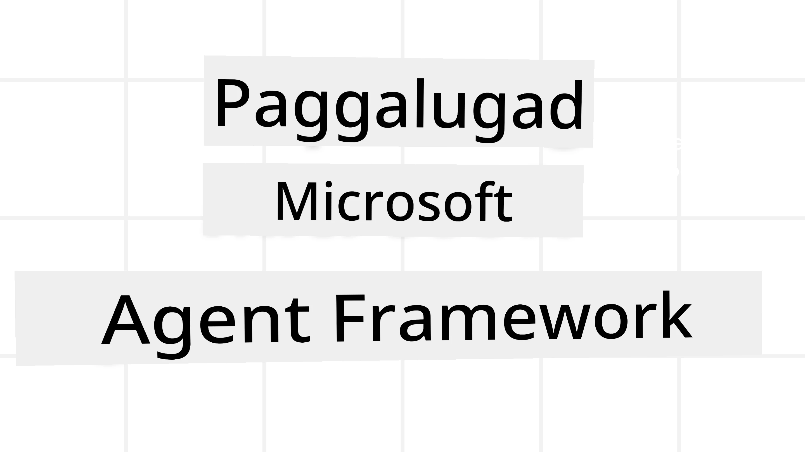
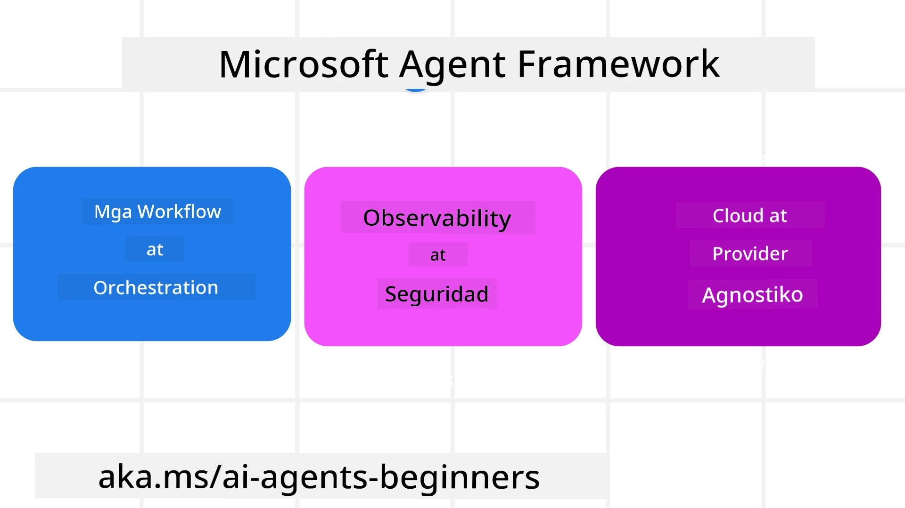

# Pagsasaliksik sa Microsoft Agent Framework



### Panimula

Saklaw ng araling ito:

- Pag-unawa sa Microsoft Agent Framework: Mga Pangunahing Tampok at Halaga  
- Pagsasaliksik sa Mga Pangunahing Konsepto ng Microsoft Agent Framework  
- Mga Advanced na Pattern ng MAF: Workflows, Middleware, at Memorya  

## Mga Layunin sa Pagkatuto

Pagkatapos makumpleto ang araling ito, malalaman mo kung paano:

- Bumuo ng Production Ready AI Agents gamit ang Microsoft Agent Framework  
- Ilapat ang mga pangunahing tampok ng Microsoft Agent Framework sa iyong mga Agentic Use Cases  
- Gumamit ng mga advanced na pattern kabilang ang workflows, middleware, at observability  

## Mga Halimbawang Kodigo 

Makikita ang mga halimbawang kodigo para sa [Microsoft Agent Framework (MAF)](https://aka.ms/ai-agents-beginners/agent-framewrok) sa repositoryong ito sa ilalim ng mga file na `xx-python-agent-framework` at `xx-dotnet-agent-framework`.

## Pag-unawa sa Microsoft Agent Framework



Ang [Microsoft Agent Framework (MAF)](https://aka.ms/ai-agents-beginners/agent-framewrok) ay ang pinagsamang balangkas ng Microsoft para sa pagbuo ng AI agents. Nag-aalok ito ng kakayahang umangkop upang matugunan ang malawak na iba't ibang mga agentic use case na nakikita sa parehong production at research na kapaligiran kabilang ang:

- **Sunud-sunod na Orkestrasyon ng Agent** sa mga sitwasyon kung saan kailangan ang hakbang-hakbang na workflows.
- **Sabay-sabay na Orkestrasyon** sa mga sitwasyon kung saan kailangang tapusin ng mga agent ang mga gawain nang sabay-sabay.
- **Orkestrasyon ng Group Chat** sa mga sitwasyon kung saan maaaring magtulungan ang mga agent sa isang gawain.
- **Handoff Orchestration** sa mga sitwasyon kung saan inihahand-off ng mga agent ang gawain sa isa't isa habang natatapos ang mga subtask.
- **Magnetic Orchestration** sa mga sitwasyon kung saan ang isang manager agent ay lumilikha at nagbabago ng isang listahan ng gawain at humahawak sa koordinasyon ng mga subagent upang matapos ang gawain.

Upang maghatid ng AI Agents sa Production, kasama rin sa MAF ang mga tampok para sa:

- **Observability** sa pamamagitan ng paggamit ng OpenTelemetry kung saan bawat aksyon ng AI Agent kabilang ang pagtawag sa tool, mga hakbang ng orkestrasyon, mga daloy ng pangangatwiran, at pagmamanman ng performance sa pamamagitan ng Microsoft Foundry dashboards.
- **Seguridad** sa pamamagitan ng pagho-host ng mga agent nang natively sa Microsoft Foundry na may kasamang mga security control tulad ng role-based access, paghawak ng pribadong data, at built-in na content safety.
- **Kalawakan** dahil ang mga thread at workflow ng agent ay maaaring mag-pause, mag-resume, at mag-recover mula sa mga error na nagpapahintulot sa mas mahabang pagpapatakbo ng proseso.
- **Kontrol** dahil sinusuportahan ang human-in-the-loop workflows kung saan ang mga gawain ay minamarkahan bilang nangangailangan ng pag-apruba ng tao.

Nakatuon din ang Microsoft Agent Framework sa pagiging interoperable sa pamamagitan ng:

- ** pagiging Cloud-agnostic** - Maaaring tumakbo ang mga agent sa loob ng mga container, on-premises, at sa iba't ibang cloud.
- ** pagiging Provider-agnostic** - Maaaring likhain ang mga agent gamit ang gustong SDK kabilang ang Azure OpenAI at OpenAI
- **Pagsasama ng Open Standards** - Maaaring gamitin ng mga agent ang mga protocol tulad ng Agent-to-Agent (A2A) at Model Context Protocol (MCP) upang tuklasin at gamitin ang ibang mga agent at tool.
- **Plugins at Connectors** - Maaaring makipag-ugnayan sa mga data at memory services tulad ng Microsoft Fabric, SharePoint, Pinecone, at Qdrant.

Tingnan natin kung paano inilalapat ang mga tampok na ito sa ilan sa mga pangunahing konsepto ng Microsoft Agent Framework.

## Mga Pangunahing Konsepto ng Microsoft Agent Framework

### Mga Agent


**Paglikha ng mga Agent**

Ginagawa ang paglikha ng agent sa pamamagitan ng pagtukoy sa inference service (LLM Provider), isang hanay ng mga tagubilin para sundan ng AI Agent, at isang itinalagang `name`:

```python
agent = AzureOpenAIChatClient(credential=AzureCliCredential()).create_agent( instructions="You are good at recommending trips to customers based on their preferences.", name="TripRecommender" )
```

Ginagamit sa itaas ang `Azure OpenAI` ngunit maaaring likhain ang mga agent gamit ang iba't ibang serbisyo kabilang ang `Microsoft Foundry Agent Service`:

```python
AzureAIAgentClient(async_credential=credential).create_agent( name="HelperAgent", instructions="You are a helpful assistant." ) as agent
```

OpenAI `Responses`, `ChatCompletion` APIs

```python
agent = OpenAIResponsesClient().create_agent( name="WeatherBot", instructions="You are a helpful weather assistant.", )
```

```python
agent = OpenAIChatClient().create_agent( name="HelpfulAssistant", instructions="You are a helpful assistant.", )
```

o mga remote agent gamit ang A2A protocol:

```python
agent = A2AAgent( name=agent_card.name, description=agent_card.description, agent_card=agent_card, url="https://your-a2a-agent-host" )
```

**Pagpapatakbo sa mga Agent**

Pinatatakbo ang mga agent gamit ang `.run` o `.run_stream` methods para sa non-streaming o streaming na mga tugon.

```python
result = await agent.run("What are good places to visit in Amsterdam?")
print(result.text)
```

```python
async for update in agent.run_stream("What are the good places to visit in Amsterdam?"):
    if update.text:
        print(update.text, end="", flush=True)

```

Ang bawat pagpapatakbo ng agent ay maaari ring may mga opsyon upang i-customize ang mga parameter gaya ng `max_tokens` na ginagamit ng agent, mga `tools` na maaaring tawagin ng agent, at maging ang mismong `model` na ginamit para sa agent.

Kapakipakinabang ito sa mga kaso kung saan kailangan ang partikular na mga modelo o tools upang matapos ang gawain ng gumagamit.

**Mga Tools**

Maaaring tukuyin ang mga tools kapwa sa pagtukoy ng agent:

```python
def get_attractions( location: Annotated[str, Field(description="The location to get the top tourist attractions for")], ) -> str: """Get the top tourist attractions for a given location.""" return f"The top attractions for {location} are." 


# Kapag direktang lumilikha ng isang ChatAgent

agent = ChatAgent( chat_client=OpenAIChatClient(), instructions="You are a helpful assistant", tools=[get_attractions]

```

at pati na rin kapag pinapatakbo ang agent:

```python

result1 = await agent.run( "What's the best place to visit in Seattle?", tools=[get_attractions] # Tool na ibinigay para sa takbong ito lamang )
```

**Agent Threads**

Ginagamit ang mga Agent Threads upang hawakan ang mga multi-turn na pag-uusap. Maaaring likhain ang mga thread sa pamamagitan ng:

- Paggamit ng `get_new_thread()` na nagpapahintulot na masave ang thread sa paglipas ng panahon  
- Awtomatikong paglikha ng thread kapag pinapatakbo ang agent na tumatagal lamang sa kasalukuyang pagpapatakbo.

Para gumawa ng thread, ganito ang hitsura ng kodigo:

```python
# Lumikha ng bagong thread.
thread = agent.get_new_thread() # Patakbuhin ang ahente gamit ang thread.
response = await agent.run("Hello, I am here to help you book travel. Where would you like to go?", thread=thread)

```

Maaari mo ring i-serialize ang thread upang maimbak para sa susunod na paggamit:

```python
# Gumawa ng bagong thread.
thread = agent.get_new_thread() 

# Patakbuhin ang ahente gamit ang thread.

response = await agent.run("Hello, how are you?", thread=thread) 

# Isaayos ang thread para sa pag-iimbak.

serialized_thread = await thread.serialize() 

# I-deserialize ang estado ng thread matapos i-load mula sa storage.

resumed_thread = await agent.deserialize_thread(serialized_thread)
```

**Agent Middleware**

Nakikipag-ugnayan ang mga agent sa mga tool at LLM upang matapos ang mga gawain ng gumagamit. Sa ilang mga sitwasyon, nais nating magsagawa o mag-track ng mga interaksyon sa pagitan ng mga ito. Pinapayagan tayo ng Agent middleware na gawin ito sa pamamagitan ng:

*Function Middleware*

Pinapayagan tayo ng middleware na ito na magsagawa ng aksyon sa pagitan ng agent at isang function/tool na tatawagin nito. Halimbawa ng paggamit nito ay kapag nais mong mag-log ng function call.

Sa code sa ibaba ang `next` ang nagdedetermina kung tatawagin ang susunod na middleware o ang mismong function.

```python
async def logging_function_middleware(
    context: FunctionInvocationContext,
    next: Callable[[FunctionInvocationContext], Awaitable[None]],
) -> None:
    """Function middleware that logs function execution."""
    # Paunang pagproseso: Mag-log bago ang pagpapatupad ng function
    print(f"[Function] Calling {context.function.name}")

    # Magpatuloy sa susunod na middleware o pagpapatupad ng function
    await next(context)

    # Pagkatapos ng pagproseso: Mag-log pagkatapos ng pagpapatupad ng function
    print(f"[Function] {context.function.name} completed")
```

*Chat Middleware*

Pinapayagan tayo ng middleware na ito na magsagawa o mag-log ng aksyon sa pagitan ng agent at ng mga kahilingan sa pagitan ng LLM.

Nagtataglay ito ng mahalagang impormasyon tulad ng `messages` na ipinapadala sa AI service.

```python
async def logging_chat_middleware(
    context: ChatContext,
    next: Callable[[ChatContext], Awaitable[None]],
) -> None:
    """Chat middleware that logs AI interactions."""
    # Pre-proses: Mag-log bago ang tawag sa AI
    print(f"[Chat] Sending {len(context.messages)} messages to AI")

    # Magpatuloy sa susunod na middleware o serbisyo ng AI
    await next(context)

    # Post-proses: Mag-log pagkatapos ng tugon ng AI
    print("[Chat] AI response received")

```

**Agent Memory**

Tulad ng tinalakay sa araling `Agentic Memory`, mahalagang elemento ang memorya upang mapagana ang agent sa iba't ibang mga konteksto. Nag-aalok ang MAF ng iba't ibang uri ng mga memorya:

*In-Memory Storage*

Ito ang memorya na nakaimbak sa mga thread habang tumatakbo ang aplikasyon.

```python
# Gumawa ng bagong thread.
thread = agent.get_new_thread() # Patakbuhin ang ahente gamit ang thread.
response = await agent.run("Hello, I am here to help you book travel. Where would you like to go?", thread=thread)
```

*Persistent Messages*

Ginagamit ang memoryang ito kapag iniimbak ang kasaysayan ng pag-uusap sa iba't ibang session. Ito ay tinutukoy gamit ang `chat_message_store_factory` :

```python
from agent_framework import ChatMessageStore

# Gumawa ng pasadyang tindahan ng mensahe
def create_message_store():
    return ChatMessageStore()

agent = ChatAgent(
    chat_client=OpenAIChatClient(),
    instructions="You are a Travel assistant.",
    chat_message_store_factory=create_message_store
)

```

*Dynamic Memory*

Idinadagdag ang memoryang ito sa konteksto bago pa tumakbo ang mga agent. Maaaring iimbak ang mga memoryang ito sa mga panlabas na serbisyo tulad ng mem0:

```python
from agent_framework.mem0 import Mem0Provider

# Paggamit ng Mem0 para sa mga advanced na kakayahan sa memorya
memory_provider = Mem0Provider(
    api_key="your-mem0-api-key",
    user_id="user_123",
    application_id="my_app"
)

agent = ChatAgent(
    chat_client=OpenAIChatClient(),
    instructions="You are a helpful assistant with memory.",
    context_providers=memory_provider
)

```

**Agent Observability**

Mahalaga ang observability sa pagbuo ng mga mapagkakatiwalaan at madaling mapanatili na mga agentic system. Nakikipagsama ang MAF sa OpenTelemetry upang magbigay ng tracing at meter para sa mas mahusay na observability.

```python
from agent_framework.observability import get_tracer, get_meter

tracer = get_tracer()
meter = get_meter()
with tracer.start_as_current_span("my_custom_span"):
    # gawin ang isang bagay
    pass
counter = meter.create_counter("my_custom_counter")
counter.add(1, {"key": "value"})
```

### Workflows

Nag-aalok ang MAF ng mga workflow na mga pre-defined na hakbang upang matapos ang isang gawain at kasama ang mga AI agent bilang bahagi ng mga hakbang na iyon.

Binubuo ang mga workflow ng iba't ibang mga bahagi na nagpapahintulot ng mas mahusay na control flow. Pinapayagan rin ng workflows ang **multi-agent orchestration** at **checkpointing** upang mai-save ang state ng workflow.

Ang mga pangunahing bahagi ng isang workflow ay:

**Executors**

Tumatanggap ang mga executor ng input na mga mensahe, isinasagawa ang kanilang itinalagang gawain, at pagkatapos ay gumagawa ng output na mensahe. Itinutulak nito ang workflow pasulong patungo sa pagtatapos ng mas malaking gawain. Maaaring AI agent o custom na lohika ang mga executor.

**Edges**

Ginagamit ang mga edges upang tukuyin ang daloy ng mga mensahe sa isang workflow. Maaaring ito ay:

*Direct Edges* - Simpleng one-to-one na koneksyon sa pagitan ng mga executor:

```python
from agent_framework import WorkflowBuilder

builder = WorkflowBuilder()
builder.add_edge(source_executor, target_executor)
builder.set_start_executor(source_executor)
workflow = builder.build()
```

*Conditional Edges* - Na-activate kapag natugunan ang partikular na kondisyon. Halimbawa, kapag walang bakanteng kuwarto sa hotel, maaring magmungkahi ang executor ng ibang opsyon.

*Switch-case Edges* - Nagpapadala ng mga mensahe sa iba't ibang executor base sa mga tinukoy na kondisyon. Halimbawa, kung may priority access ang customer sa paglalakbay at ang kanilang mga gawain ay hahawakan ng ibang workflow.

*Fan-out Edges* - Nagpapadala ng isang mensahe sa maraming target.

*Fan-in Edges* - Nangongolekta ng maraming mensahe mula sa iba't ibang executor at nagpasa sa iisang target.

**Events**

Para magbigay ng mas mahusay na observability sa mga workflow, nag-aalok ang MAF ng mga built-in na event para sa pagpapatupad kabilang ang:

- `WorkflowStartedEvent`  - Nagsisimula ang pagtakbo ng workflow  
- `WorkflowOutputEvent` - Gumagawa ang workflow ng output  
- `WorkflowErrorEvent` - Nakaranas ng error ang workflow  
- `ExecutorInvokeEvent`  - Nagsisimula ang executor ng proseso  
- `ExecutorCompleteEvent`  -  Natatapos ng executor ang proseso  
- `RequestInfoEvent` - Isang kahilingan ang ini-isyu  

## Mga Advanced na Pattern ng MAF

Sakop ng mga seksyon sa itaas ang mga pangunahing konsepto ng Microsoft Agent Framework. Habang bumubuo ka ng mas komplikadong mga agent, narito ang ilang mga advanced na pattern na dapat isaalang-alang:

- **Pagsasama ng Middleware**: Pagsamahin ang maraming middleware handler (logging, auth, rate-limiting) gamit ang function at chat middleware para sa detalyadong kontrol sa ugali ng agent.
- **Workflow Checkpointing**: Gamitin ang mga event ng workflow at serialization upang i-save at i-resume ang mga prosesong malalawak ang pagpapatakbo ng agent.
- **Dynamic Tool Selection**: Pagsamahin ang RAG sa mga paglalarawan ng tool gamit ang pagpaparehistro ng tool ng MAF upang ipakita ang mga relevant lamang na tool sa bawat query.
- **Multi-Agent Handoff**: Gamitin ang mga edge ng workflow at conditional routing upang i-orchestrate ang handoff sa pagitan ng mga espesyalisadong agent.

## Mga Halimbawang Kodigo 

Makikita ang mga halimbawang kodigo para sa Microsoft Agent Framework sa repositoryong ito sa ilalim ng mga file na `xx-python-agent-framework` at `xx-dotnet-agent-framework`.

## May Karagdagang Tanong Tungkol sa Microsoft Agent Framework?

Sumali sa [Microsoft Foundry Discord](https://aka.ms/ai-agents/discord) upang makipagkita sa ibang mga nag-aaral, dumalo sa office hours, at makakuha ng kasagutan sa iyong mga tanong tungkol sa AI Agents.

---

<!-- CO-OP TRANSLATOR DISCLAIMER START -->
**Paunawa**:
Ang dokumentong ito ay isinalin gamit ang serbisyong AI na pagsasalin [Co-op Translator](https://github.com/Azure/co-op-translator). Bagama't aming pinagsisikapang maging tumpak ang pagsasalin, pakatandaan na ang mga awtomatikong pagsasalin ay maaaring maglaman ng mga pagkakamali o hindi pagkakatugma. Ang orihinal na dokumento sa kanyang orihinal na wika ang dapat ituring na opisyal na sanggunian. Para sa mahahalagang impormasyon, inirerekomenda ang propesyonal na pagsasaling tao. Hindi kami mananagot sa anumang hindi pagkakaunawaan o maling interpretasyon na maaaring magmula sa paggamit ng pagsasaling ito.
<!-- CO-OP TRANSLATOR DISCLAIMER END -->