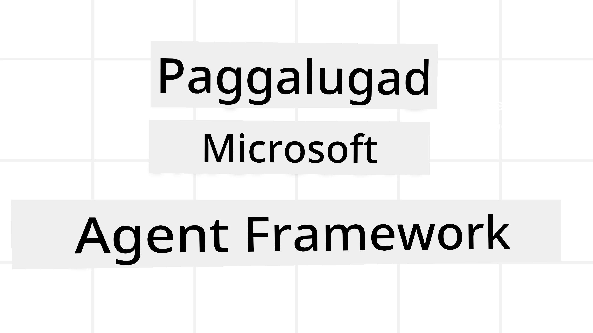
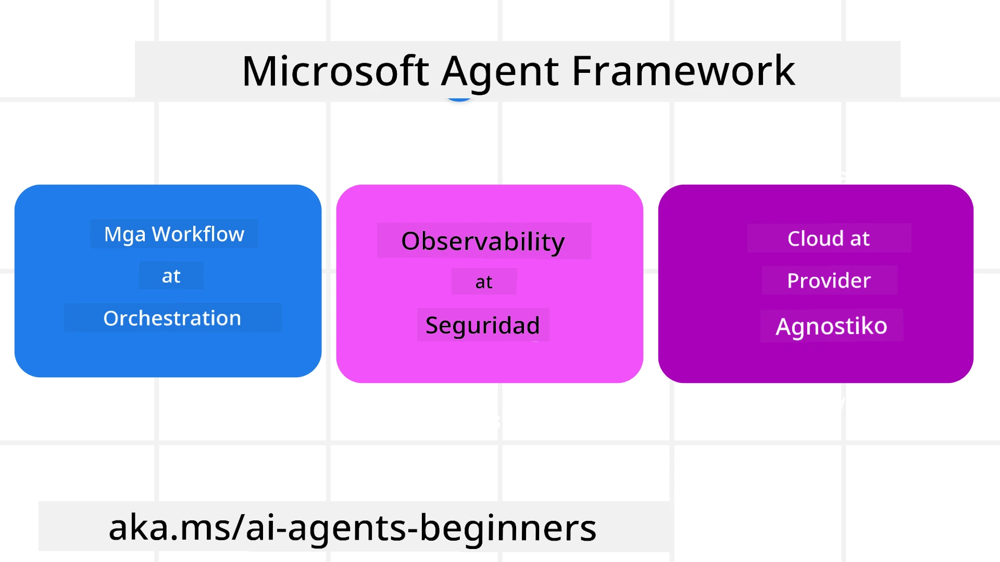
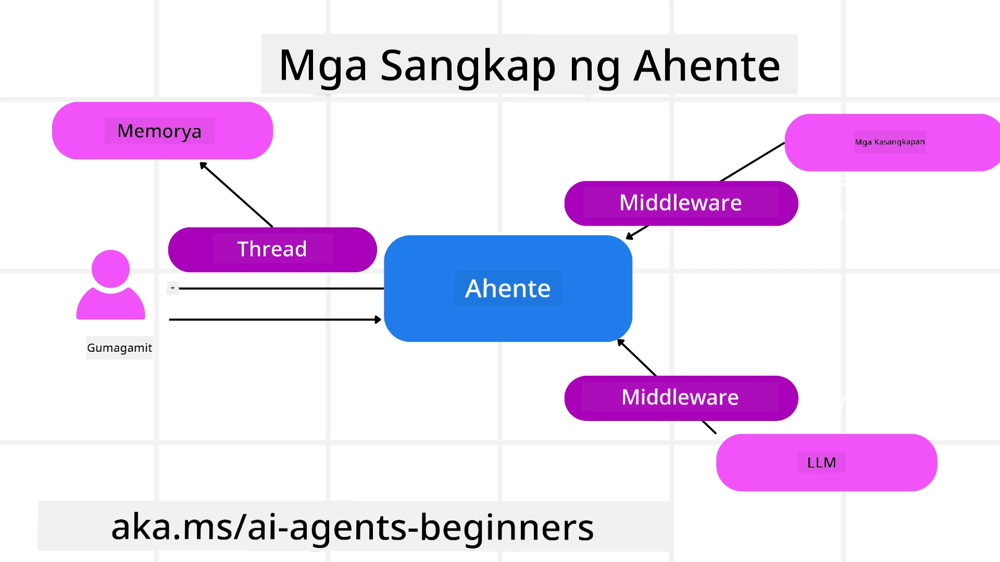

# Pagsusuri sa Microsoft Agent Framework



### Panimula

Saklaw ng yugtong ito ang:

- Pag-unawa sa Microsoft Agent Framework: Pangunahing Mga Tampok at Halaga  
- Pagsusuri sa Mga Pangunahing Konsepto ng Microsoft Agent Framework
- Mga Advanced na Pattern ng MAF: Workflows, Middleware, at Memorya

## Mga Layunin sa Pagkatuto

Matapos makumpleto ang yugtong ito, malalaman mo kung paano:

- Bumuo ng mga Production Ready AI Agents gamit ang Microsoft Agent Framework
- Ilapat ang mga pangunahing tampok ng Microsoft Agent Framework sa iyong mga Agentic Use Case
- Gumamit ng mga advanced na pattern kabilang ang workflows, middleware, at observability

## Mga Halimbawang Kodigo 

Makikita ang mga halimbawang kodigo para sa [Microsoft Agent Framework (MAF)](https://learn.microsoft.com/en-us/agent-framework/overview/?wt.mc_id=youtube_26688_organicsocial_reactor&pivots=programming-language-python) sa repositoryong ito sa ilalim ng mga file na `xx-python-agent-framework` at `xx-dotnet-agent-framework`.

## Pag-unawa sa Microsoft Agent Framework



Ang [Microsoft Agent Framework (MAF)](https://learn.microsoft.com/en-us/agent-framework/overview/?wt.mc_id=youtube_26688_organicsocial_reactor&pivots=programming-language-python) ay pinagsamang framework ng Microsoft para sa paggawa ng mga AI agent. Nagbibigay ito ng kakayahang tugunan ang malawak na hanay ng mga agentic use case na makikita sa parehong production at research environment kabilang ang:

- **Sunod-sunod na Agent orchestration** sa mga sitwasyon kung saan kailangan ng hakbang-hakbang na workflows.
- **Sabayan na orchestration** sa mga sitwasyon kung saan kailangang tapusin ng mga agent ang mga gawain nang sabay-sabay.
- **Group chat orchestration** sa mga sitwasyon kung saan maaaring magtulungan ang mga agent sa isang gawain.
- **Handoff Orchestration** sa mga sitwasyon kung saan ipinapasa ng mga agent ang gawain sa isa't isa habang tinatapos ang mga subtask.
- **Magnetic Orchestration** sa mga sitwasyon kung saan ang isang manager agent ay lumilikha at binabago ang isang task list at pinamamahalaan ang koordinasyon ng mga subagent upang tapusin ang gawain.

Upang maghatid ng AI Agents sa Production, kasama rin sa MAF ang mga tampok para sa:

- **Observability** gamit ang OpenTelemetry kung saan bawat aksyon ng AI Agent kabilang ang pagtawag ng tool, mga hakbang ng orchestration, daloy ng pag-iisip, at pag-monitor ng performance sa pamamagitan ng Microsoft Foundry dashboards.
- **Seguridad** sa pamamagitan ng pagho-host ng mga agent nang lokal sa Microsoft Foundry na may kasamang mga kontrol sa seguridad tulad ng role-based access, ligtas na paghawak ng pribadong data, at built-in na content safety.
- **Katibayan** dahil ang mga thread at workflows ng Agent ay maaaring mag-pause, mag-resume, at maka-recover mula sa mga error na nagbibigay-daan para sa mas matagal na proseso.
- **Kontrol** dahil sinusuportahan ang human in the loop workflows kung saan minamarkahan ang mga gawain bilang nangangailangan ng human approval.

Nakatuon din ang Microsoft Agent Framework sa pagiging interoperable sa pamamagitan ng:

- **Being Cloud-agnostic** - Maaaring tumakbo ang mga agent sa containers, on-prem, at sa iba't ibang mga cloud.
- **Being Provider-agnostic** - Maaaring likhain ang mga agent gamit ang iyong preferred SDK kabilang ang Azure OpenAI at OpenAI
- **Integrating Open Standards** - Maaaring gumamit ang mga agent ng mga protocol tulad ng Agent-to-Agent(A2A) at Model Context Protocol (MCP) upang tuklasin at gamitin ang ibang mga agent at tool.
- **Plugins and Connectors** - Maaaring kumonekta sa mga serbisyo ng data at memory tulad ng Microsoft Fabric, SharePoint, Pinecone at Qdrant.

Tingnan natin kung paano inaaplay ang mga tampok na ito sa ilan sa mga pangunahing konsepto ng Microsoft Agent Framework.

## Mga Pangunahing Konsepto ng Microsoft Agent Framework

### Mga Agent



**Paggawa ng mga Agent**

Ang paggawa ng agent ay ginagawa sa pamamagitan ng pagtukoy sa inference service (LLM Provider), isang
set ng mga tagubilin para sundan ng AI Agent, at isang itinalagang `name`:

```python
agent = AzureOpenAIChatClient(credential=AzureCliCredential()).create_agent( instructions="You are good at recommending trips to customers based on their preferences.", name="TripRecommender" )
```

Ang nasa itaas ay gumagamit ng `Azure OpenAI` ngunit maaaring gumawa ng mga agent gamit ang iba't ibang mga serbisyo kabilang ang `Microsoft Foundry Agent Service`:

```python
AzureAIAgentClient(async_credential=credential).create_agent( name="HelperAgent", instructions="You are a helpful assistant." ) as agent
```

OpenAI `Responses`, `ChatCompletion` APIs

```python
agent = OpenAIResponsesClient().create_agent( name="WeatherBot", instructions="You are a helpful weather assistant.", )
```

```python
agent = OpenAIChatClient().create_agent( name="HelpfulAssistant", instructions="You are a helpful assistant.", )
```

o [MiniMax](https://platform.minimaxi.com/), na nagbibigay ng OpenAI-compatible na API na may malalaking context window (hanggang 204K tokens):

```python
agent = OpenAIChatClient(base_url="https://api.minimax.io/v1", api_key=os.environ["MINIMAX_API_KEY"], model_id="MiniMax-M3").create_agent( name="HelpfulAssistant", instructions="You are a helpful assistant.", )
```

o mga remote agent gamit ang A2A protocol:

```python
agent = A2AAgent( name=agent_card.name, description=agent_card.description, agent_card=agent_card, url="https://your-a2a-agent-host" )
```

**Pagpapatakbo ng mga Agent**

Pinatatakbo ang mga agent gamit ang mga method na `.run` o `.run_stream` para sa non-streaming o streaming na mga tugon.

```python
result = await agent.run("What are good places to visit in Amsterdam?")
print(result.text)
```

```python
async for update in agent.run_stream("What are the good places to visit in Amsterdam?"):
    if update.text:
        print(update.text, end="", flush=True)

```

Ang bawat pagpapatakbo ng agent ay maaari ring magkaroon ng mga opsyon para i-customize ang mga parameter tulad ng `max_tokens` na ginagamit ng agent, mga `tools` na maaaring tawagan ng agent, at kahit na ang mismong `model` na ginagamit para sa agent.

Ito ay kapaki-pakinabang sa mga kaso kung saan kinakailangan ang mga partikular na modelo o tool para sa pagtapos ng gawain ng gumagamit.

**Mga Tool**

Maaaring tukuyin ang mga tool parehong kapag tinutukoy ang agent:

```python
def get_attractions( location: Annotated[str, Field(description="The location to get the top tourist attractions for")], ) -> str: """Get the top tourist attractions for a given location.""" return f"The top attractions for {location} are." 


# Kapag direktang lumilikha ng isang ChatAgent

agent = ChatAgent( chat_client=OpenAIChatClient(), instructions="You are a helpful assistant", tools=[get_attractions]

```

at pati na rin kapag pinapatakbo ang agent:

```python

result1 = await agent.run( "What's the best place to visit in Seattle?", tools=[get_attractions] # Tool na ibinigay para lamang sa run na ito )
```

**Mga Agent Thread**

Ginagamit ang mga Agent Thread upang pangasiwaan ang mga multi-turn na pag-uusap. Maaaring likhain ang mga thread sa pamamagitan ng:

- Paggamit ng `get_new_thread()` na nagpapahintulot na masave ang thread sa paglipas ng panahon
- Paggawa ng thread nang awtomatiko kapag pinapatakbo ang agent at ang thread ay tatagal lamang sa kasalukuyang pagpapatakbo.

Ang paggawa ng thread ay ganito ang hitsura ng kodigo:

```python
# Gumawa ng bagong thread.
thread = agent.get_new_thread() # Patakbuhin ang ahente kasama ang thread.
response = await agent.run("Hello, I am here to help you book travel. Where would you like to go?", thread=thread)

```

Pagkatapos ay maaari mong i-serialize ang thread upang itago para sa susunod na paggamit:

```python
# Lumikha ng bagong thread.
thread = agent.get_new_thread() 

# Patakbuhin ang ahente gamit ang thread.

response = await agent.run("Hello, how are you?", thread=thread) 

# I-serialize ang thread para sa imbakan.

serialized_thread = await thread.serialize() 

# I-deserialize ang estado ng thread pagkatapos i-load mula sa imbakan.

resumed_thread = await agent.deserialize_thread(serialized_thread)
```

**Agent Middleware**

Nakikipag-ugnayan ang mga agent sa mga tool at LLM upang tapusin ang mga gawain ng gumagamit. Sa ilang mga sitwasyon, nais nating magpatupad o mag-track sa pagitan ng mga interaksyong ito. Pinapahintulutan tayo ng agent middleware na gawin ito sa pamamagitan ng:

*Function Middleware*

Pinapayagan tayo ng middleware na ito na magsagawa ng aksyon sa pagitan ng agent at ng isang function/tool na tatawagan nito. Halimbawa ng paggamit nito ay kapag nais mong mag-log ng tawag sa function.

Sa kodigo sa ibaba, tinutukoy ng `next` kung ang susunod na middleware o ang aktwal na function ang dapat tawagin.

```python
async def logging_function_middleware(
    context: FunctionInvocationContext,
    next: Callable[[FunctionInvocationContext], Awaitable[None]],
) -> None:
    """Function middleware that logs function execution."""
    # Paunang pagproseso: Mag-log bago ang pagpapatupad ng function
    print(f"[Function] Calling {context.function.name}")

    # Magpatuloy sa susunod na middleware o pagpapatupad ng function
    await next(context)

    # Pagkatapos ng pagproseso: Mag-log pagkatapos ng pagpapatupad ng function
    print(f"[Function] {context.function.name} completed")
```

*Chat Middleware*

Pinapayagan tayo ng middleware na ito na magsagawa o mag-log ng aksyon sa pagitan ng agent at ng mga kahilingan sa pagitan ng LLM.

Naglalaman ito ng mahalagang impormasyon tulad ng mga `messages` na ipinapadala sa AI service.

```python
async def logging_chat_middleware(
    context: ChatContext,
    next: Callable[[ChatContext], Awaitable[None]],
) -> None:
    """Chat middleware that logs AI interactions."""
    # Paunang pagproseso: Mag-log bago ang tawag sa AI
    print(f"[Chat] Sending {len(context.messages)} messages to AI")

    # Magpatuloy sa susunod na middleware o serbisyo ng AI
    await next(context)

    # Pagkatapos ng pagproseso: Mag-log pagkatapos ng tugon ng AI
    print("[Chat] AI response received")

```

**Agent Memory**

Tulad ng tinalakay sa yugtong `Agentic Memory`, mahalagang elemento ang memorya upang mabigyang-daan ang agent na mag-operate sa iba't ibang konteksto. Nagbibigay ang MAF ng ilang uri ng memorya:

*In-Memory Storage*

Ito ay memoryang iniimbak sa mga thread habang tumatakbo ang aplikasyon.

```python
# Gumawa ng bagong thread.
thread = agent.get_new_thread() # Patakbuhin ang ahente gamit ang thread.
response = await agent.run("Hello, I am here to help you book travel. Where would you like to go?", thread=thread)
```

*Persistent Messages*

Ginagamit ang memoryang ito kapag nag-iimbak ng kasaysayan ng pag-uusap sa iba't ibang sesyon. Tinukoy ito gamit ang `chat_message_store_factory`:

```python
from agent_framework import ChatMessageStore

# Lumikha ng pasadyang imbakan ng mensahe
def create_message_store():
    return ChatMessageStore()

agent = ChatAgent(
    chat_client=OpenAIChatClient(),
    instructions="You are a Travel assistant.",
    chat_message_store_factory=create_message_store
)

```

*Dynamic Memory*

Idinadagdag ang memoryang ito sa konteksto bago patakbuhin ang mga agent. Maaaring itago ang mga memoryang ito sa mga external na serbisyo tulad ng mem0:

```python
from agent_framework.mem0 import Mem0Provider

# Paggamit ng Mem0 para sa mga advanced na kakayahan sa memorya
memory_provider = Mem0Provider(
    api_key="your-mem0-api-key",
    user_id="user_123",
    application_id="my_app"
)

agent = ChatAgent(
    chat_client=OpenAIChatClient(),
    instructions="You are a helpful assistant with memory.",
    context_providers=memory_provider
)

```

**Agent Observability**

Mahalaga ang observability para sa paggawa ng mga maaasahan at madaling panatilihin na agentic system. Nakikipag-integrate ang MAF sa OpenTelemetry upang magbigay ng tracing at mga metro para sa mas mahusay na observability.

```python
from agent_framework.observability import get_tracer, get_meter

tracer = get_tracer()
meter = get_meter()
with tracer.start_as_current_span("my_custom_span"):
    # gumawa ng isang bagay
    pass
counter = meter.create_counter("my_custom_counter")
counter.add(1, {"key": "value"})
```

### Workflows

Nag-aalok ang MAF ng workflows na mga pre-defined na hakbang upang makumpleto ang isang gawain at kasama ang AI agent bilang mga bahagi sa mga hakbang na iyon.

Binubuo ang mga workflow ng iba't ibang sangkap na nagpapahintulot ng mas mahusay na kontrol ng daloy. Pinapahintulutan din ng mga workflow ang **multi-agent orchestration** at **checkpointing** upang maseguro ang estado ng workflow.

Ang mga pangunahing sangkap ng workflow ay:

**Executors**

Tumatanggap ng input messages ang mga executor, isinasagawa ang mga itinalagang gawain, at pagkatapos ay gumagawa ng output message. Ito ay nagpapatuloy ng workflow patungo sa pagkumpleto ng mas malaking gawain. Ang mga executor ay maaaring AI agent o custom logic.

**Edges**

Ginagamit ang mga edges upang tukuyin ang daloy ng mga mensahe sa workflow. Maaari itong maging:

*Direct Edges* - Simpleng one-to-one na koneksyon sa pagitan ng mga executor:

```python
from agent_framework import WorkflowBuilder

builder = WorkflowBuilder()
builder.add_edge(source_executor, target_executor)
builder.set_start_executor(source_executor)
workflow = builder.build()
```

*Conditional Edges* - Na-activate kapag natugunan ang tiyak na kondisyon. Halimbawa, kapag wala nang bakanteng hotel rooms, maaaring magmungkahi ng ibang mga opsyon ang executor.

*Switch-case Edges* - Ina-ruta ang mga mensahe sa iba't ibang executor base sa tinukoy na mga kondisyon. Halimbawa: kung may priority access ang travel customer, ang kanilang mga gawain ay hahawakan sa ibang workflow.

*Fan-out Edges* - Magpadala ng isang mensahe sa maraming target.

*Fan-in Edges* - Kumuha ng maraming mensahe mula sa iba't ibang executor at ipadala sa isang target.

**Mga Kaganapan**

Upang mas mapabuti ang observability sa mga workflow, nag-aalok ang MAF ng mga built-in na kaganapan para sa pagpapatupad kabilang ang:

- `WorkflowStartedEvent`  - Nagsisimula ang pagpapatupad ng workflow
- `WorkflowOutputEvent` - Nagbibigay ang workflow ng output
- `WorkflowErrorEvent` - Nakakaranas ang workflow ng error
- `ExecutorInvokeEvent`  - Nagsisimula ang executor ng pagproseso
- `ExecutorCompleteEvent`  - Natatapos ang executor sa pagproseso
- `RequestInfoEvent` - Isang kahilingan ang inilabas

## Mga Advanced na Pattern ng MAF

Sakop sa mga naunang bahagi ang mga pangunahing konsepto ng Microsoft Agent Framework. Habang gumagawa ka ng mas kumplikadong mga agent, narito ang ilang mga advanced na pattern na dapat isaalang-alang:

- **Middleware Composition**: Pagsamasamahin ang maraming middleware handler (logging, auth, rate-limiting) gamit ang function at chat middleware para sa mas detalyadong kontrol ng kilos ng agent.
- **Workflow Checkpointing**: Gamitin ang mga workflow event at serialization upang maseguro at maipagpatuloy ang mga prosesong tumatakbo nang matagal ng agent.
- **Dynamic Tool Selection**: Pagsamahin ang RAG sa mga paglalarawan ng tool gamit ang pagpaparehistro ng tool ng MAF upang ipakita lamang ang mga kaugnay na tool kada query.
- **Multi-Agent Handoff**: Gumamit ng mga edge sa workflow at conditional routing upang isaayos ang handoff sa pagitan ng mga espesyalistang agent.

## Pagho-host ng LangChain / LangGraph Agents sa Microsoft Foundry

Ang Microsoft Agent Framework ay **framework-interoperable** — hindi ka limitado sa mga agent na ginawa gamit ang MAF. Kung mayroon ka nang agent na ginawa gamit ang **LangChain** o **LangGraph**, maaari mo itong patakbuhin bilang isang **Microsoft Foundry hosted agent** upang pamahalaan ng Foundry ang runtime, sesyon, scaling, pagkakakilanlan, at protocol endpoints para sa iyo, habang nananatili ang iyong agent logic sa LangGraph.

Ginagawa ito gamit ang `langchain_azure_ai.agents.hosting` package, na naglalantad ng compiled LangGraph graph sa parehong mga protocol na ginagamit ng mga Foundry hosted agent.

**1. I-install ang hosting extra:**

```bash
pip install -U "langchain-azure-ai[hosting]>=1.2.4" azure-identity
```

Ina-install ng `hosting` extra ang mga Foundry protocol libraries: `azure-ai-agentserver-responses` (ang OpenAI-compatible na `/responses` endpoint) at `azure-ai-agentserver-invocations` (ang generic na `/invocations` endpoint).

**2. Piliin ang hosting protocol:**

| Protocol | Host class | Endpoint | Gamitin kapag |
|----------|-----------|----------|----------|
| **Responses** | `ResponsesHostServer` | `/responses` | Gusto mo ng OpenAI-compatible chat, streaming, kasaysayan ng tugon, at pag-thread ng pag-uusap — ang inirekomendang default para sa conversational agents. |
| **Invocations** | `InvocationsHostServer` | `/invocations` | Kailangan mo ng custom na JSON shape, webhook-style na endpoint, o hindi conversational na pagproseso. |

Dahil ang **Responses API ang pangunahing API para sa agent-style na development sa Foundry**, magsimula sa `ResponsesHostServer` para sa karamihan ng mga agent.

**3. I-configure ang mga environment variable** (`az login` muna para makapag-authenticate ang `DefaultAzureCredential`):

```bash
export FOUNDRY_PROJECT_ENDPOINT="https://<resource>.services.ai.azure.com/api/projects/<project>"
export FOUNDRY_MODEL_NAME="gpt-5-mini"
```

Kapag ang agent ay tumakbo bilang hosted agent sa Foundry, awtomatikong ina-inject ng platform ang `FOUNDRY_PROJECT_ENDPOINT`.

**4. I-expose ang LangGraph agent sa Responses protocol:**

```python
import os

from azure.ai.projects import AIProjectClient
from azure.identity import DefaultAzureCredential, get_bearer_token_provider
from langchain.agents import create_agent
from langchain_openai import ChatOpenAI
from langchain_azure_ai.agents.hosting import ResponsesHostServer

_AZURE_AI_SCOPE = "https://ai.azure.com/.default"


def build_chat_model() -> ChatOpenAI:
    project_endpoint = os.environ["FOUNDRY_PROJECT_ENDPOINT"].rstrip("/")
    deployment = os.environ.get("FOUNDRY_MODEL_NAME", "gpt-5-mini")
    credential = DefaultAzureCredential()
    project = AIProjectClient(endpoint=project_endpoint, credential=credential)
    openai_client = project.get_openai_client()
    token_provider = get_bearer_token_provider(credential, _AZURE_AI_SCOPE)

    # Ang ChatOpenAI dito ay tumatarget sa OpenAI-compatible (Mga Tugon) endpoint ng proyektong Foundry.
    return ChatOpenAI(
        model=deployment,
        base_url=str(openai_client.base_url),
        api_key=token_provider,
    )


def main() -> None:
    graph = create_agent(build_chat_model(), tools=[])
    port = int(os.environ.get("PORT", "8088"))
    ResponsesHostServer(graph).run(port=port)


if __name__ == "__main__":
    main()
```

Patakbuhin ito nang lokal gamit ang `python main.py`, pagkatapos ay magpadala ng Responses request sa `http://localhost:8088/responses`.

**Pangunahing kilos:**

- **Mga Pag-uusap**: Pinagpapatuloy ng mga kliyente ang pag-uusap sa pamamagitan ng pagpapasa ng `previous_response_id` o `conversation` ID. Kung naka-compile ang iyong graph gamit ang LangGraph checkpointer, nagka-key ang Foundry ng estado ng pag-uusap sa checkpoint (gumamit ng durable checkpointer sa production; ayos lang ang `MemorySaver` para sa lokal na pagsusuri).
- **Human-in-the-loop**: Kung gumagamit ang iyong graph ng LangGraph `interrupt()`, ipinapakita ng `ResponsesHostServer` ang nakabinbing interrupt bilang isang Responses `function_call` / `mcp_approval_request` item, at nagtatuloy ang kliyente sa katugmang `function_call_output` / `mcp_approval_response`.
- **Deploy sa Foundry**: Gamitin ang Azure Developer CLI — `azd ext install azure.ai.agents`, `azd ai agent init -m <manifest>`, `azd ai agent run` (lokal, kailangan ng Docker), pagkatapos ay `azd provision` at `azd deploy`. Nangangailangan ang hosted-agent deployment ng **Foundry Project Manager** role.

Makikita ang tumatakbong bersyon ng halimbawang ito sa [code-samples/14-langchain-hosted-agent.py](../../../14-microsoft-agent-framework/code-samples/14-langchain-hosted-agent.py). Para sa buong walkthrough (Invocations protocol, custom request schemas, at troubleshooting), tingnan ang [Host LangGraph agents as Foundry hosted agents](https://learn.microsoft.com/azure/foundry/how-to/develop/langchain-hosted-agents).

## Mga Halimbawang Kodigo 

Makikita ang mga halimbawang kodigo para sa Microsoft Agent Framework sa repositoryong ito sa ilalim ng mga file na `xx-python-agent-framework` at `xx-dotnet-agent-framework`.

## May Karagdagang Mga Tanong Tungkol sa Microsoft Agent Framework?

Sumali sa [Microsoft Foundry Discord](https://discord.com/invite/ATgtXmAS5D) upang makipagkita sa ibang mga nag-aaral, dumalo sa office hours, at masagot ang iyong mga tanong tungkol sa AI Agents.
## Nakaraang Yugtong Aralin

[Memory for AI Agents](../13-agent-memory/README.md)

## Susunod na Yugtong Aralin

[Building Computer Use Agents (CUA)](../15-browser-use/README.md)

---

<!-- CO-OP TRANSLATOR DISCLAIMER START -->
**Pagtatanggi**:
Ang dokumentong ito ay isinalin gamit ang serbisyo ng AI translation na [Co-op Translator](https://github.com/Azure/co-op-translator). Bagama't nagsusumikap kami para sa katumpakan, pakatandaan na ang awtomatikong pagsasalin ay maaaring maglaman ng mga pagkakamali o hindi pagkakatugma. Ang orihinal na dokumento sa orihinal nitong wika ang dapat ituring na pangunahing sanggunian. Para sa mahahalagang impormasyon, inirerekomenda ang propesyonal na pagsasalin ng tao. Hindi kami mananagot sa anumang maling pagkakaintindi o maling interpretasyon na nagmula sa paggamit ng pagsasaling ito.
<!-- CO-OP TRANSLATOR DISCLAIMER END -->