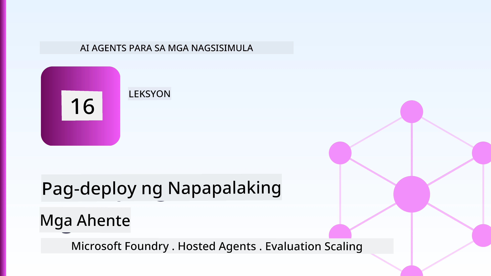
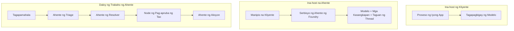
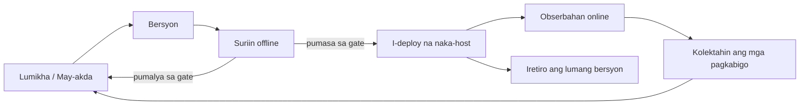
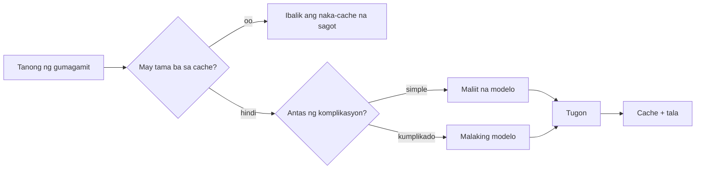
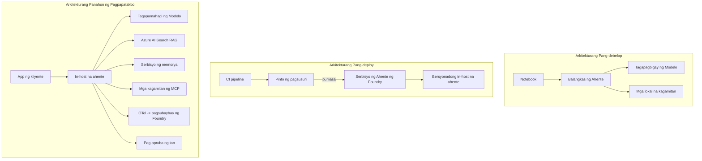

# Pagde-deploy ng Scalable Agents gamit ang Microsoft Foundry



Hanggang sa puntong ito ng kurso, nakabuo ka na ng mga agent na tumatakbo sa iyong laptop, sa loob ng isang notebook, na pinapatakbo ng `az login` at ilang environment variables. Iyan ang tamang paraan para matuto. Hindi iyan ang tamang paraan para magpatakbo ng agent na umaasa ang libu-libong mga customer sa alas-3 ng madaling araw.

Tungkol ang araling ito sa pagitan ng "gumagana ito sa aking makina" at "gumagana ito nang maaasahan at abot-kaya sa produksyon." Pinasasara namin ang puwang na iyon gamit ang **Microsoft Foundry** at ang **Microsoft Foundry Agent Service**, at ginagawa namin ito sa pamamagitan ng pagbuo ng isang tunay na customer support agent na may mga tool, retrieval, memorya, pagsusuri, at monitoring.

## Panimula

Tatalakayin sa araling ito ang:

- Ang pagkakaiba sa pagitan ng **prototype agent** at isang **deployed agent**, at bakit ang paglipat ay kadalasang tungkol sa lahat ng bagay *sa paligid* ng modelo.
- **Mga pattern ng deployment** para sa mga agent: client-hosted, service-hosted (Hosted Agents), at workflow-orchestrated.
- Ang **lifecycle ng agent** sa Microsoft Foundry — lumikha, mag-version, mag-deploy, mag-evaluate, mag-obserba, magretiro.
- **Mga estratehiya sa scaling**: model routing, caching, concurrency, at stateless design.
- **Observability** gamit ang OpenTelemetry at Foundry tracing.
- **Pag-optimize ng gastos** sa pamamagitan ng pagpili ng modelo, routing, at evaluation gates.
- **Mga konsiderasyong pang-enterprise**: pamamahala, human approval, at ligtas na pagpapatakbo ng MCP servers sa produksyon.

## Mga Layunin sa Pagkatuto

Pagkatapos makumpleto ang araling ito, malalaman mo kung paano:

- Pumili ng tamang deployment pattern para sa isang partikular na workload ng agent.
- Mag-deploy ng agent sa Microsoft Foundry Agent Service upang ito ay may version, pamamahala, at nakikita.
- Mag-instrument ng isang agent para sa tracing at mag-wire ng evaluation pipeline na tumatakbo bago ang bawat release.
- Ipatupad ang model routing at caching upang mapanatili ang latency at gastos sa ilalim ng kontrol sa scaling.
- Magdagdag ng human approval gate para sa mga high-risk na aksyon at isama ang MCP server sa isang production-safe na paraan.

## Mga Kinakailangan

Ang araling ito ay nagpapalagay na nakumpleto mo na ang mga naunang aralin at komportable ka sa:

- Pagbuo ng mga agent gamit ang [Microsoft Agent Framework](../14-microsoft-agent-framework/README.md) (Aralin 14).
- [Paggamit ng Tool](../04-tool-use/README.md) (Aralin 4) at [Agentic RAG](../05-agentic-rag/README.md) (Aralin 5).
- [Agent Memory](../13-agent-memory/README.md) (Aralin 13) at [Agentic Protocols / MCP](../11-agentic-protocols/README.md) (Aralin 11).
- [Observability at Evaluation](../10-ai-agents-production/README.md) (Aralin 10) — ang araling ito ay direktang nakabatay dito.

Kakailanganin mo rin:

- Isang **Azure subscription** at isang **Microsoft Foundry project** na may kahit isang deployed na chat model.
- Ang **Azure CLI** ay authenticated (`az login`).
- Python 3.12+ at ang mga package sa repository [`requirements.txt`](../../../requirements.txt).

## Mula Prototype hanggang Produksyon: Ano ang Talagang Nagbabago

Ang prototype agent at production agent ay may parehong core loop — mag-reason, tumawag ng mga tool, sumagot. Ang nagbabago ay lahat ng nasa paligid ng loop na iyon. Ang modelo ay marahil 20% lang ng production agent; ang ibang 80% ay ang operational skeleton.

| Alalahanin | Prototype | Produksyon |
| --- | --- | --- |
| **Hosting** | Tumakbo sa iyong notebook | Tumakbo bilang hosted service, may version at ipinalalabas |
| **Identity** | Iyong `az login` token | Managed identity na may scoped RBAC |
| **State** | Sa memorya lang, nawawala kapag nirestart | Externalised (thread store, memory service) |
| **Failure** | Nakikita mo ang traceback | May retries, fallbacks, dead-letter, alerts |
| **Gastos** | "Ilang sentimos lang" | Sinusubaybayan per request, niruruta, kino-cache, may budget |
| **Kalidad** | Tinitingnan mo lang ang output | Awtomatikong sinusuri bago bawat release |
| **Tiwala** | Inaprubahan mo bawat aksyon | Patakaran + human-in-the-loop para sa mga risky na aksyon |

Tandaan ang talahanayan na ito. Bawat seksyon sa ibaba ay tumutugma sa isa sa mga row na ito.

## Mga Pattern ng Deployment ng Agent

May tatlong pattern na madalas mong gagamitin, madalas na pinagsama.

### 1. Client-Hosted Agents

Ang agent object ay nasa loob ng *iyong* application process. Direktang tumatawag ang iyong code sa model provider; ang reasoning loop ay tumatakbo sa iyong service. Ito ang ginawa ng bawat naunang aralin.

- **Gamitin ito kapag** kailangan mo ng buong kontrol sa loop, custom middleware, o ninanais mong i-embed ang agent sa loob ng umiiral na backend.
- **Trade-off**: ikaw ang may-ari ng scaling, state, at resilience.

### 2. Hosted Agents (Foundry Agent Service)

Ang agent ay *nairehistro bilang resource* sa Microsoft Foundry. Ina-host ng Foundry ang reasoning loop, nag-iimbak ng mga thread, nagpapatupad ng content safety at RBAC, at pinapakita ang agent sa Foundry portal. Ang iyong app ay nagiging manipis na client na lumilikha ng mga thread at bumabasa ng mga tugon.

- **Gamitin ito kapag** gusto mo ng durability, built-in observability, governance, at mas kaunting operational na bahagi.
- **Trade-off**: mas kaunting mababang-lebel na kontrol kapalit ng isang managed runtime.

### 3. Agent Workflows

Maramihang mga agent (at tool) ang pinagsama sa isang graph na may malinaw na control flow — sunud-sunod na mga hakbang, pag-branch, mga node para sa human approval, at mga durable checkpoint na maaaring mag-pause at mag-resume. Ito ang Microsoft Agent Framework **Workflows** na kakayahan na inilalapat sa scale ng deployment.

- **Gamitin ito kapag** ang isang gawain ay sumasaklaw sa ilang espesyalistang agent o nangangailangan ng hakbang ng pag-apruba sa gitna.
- **Trade-off**: mas maraming gumagalaw na bahagi; nangangailangan ng orchestration-level na observability.



## Ang Lifecycle ng Agent sa Microsoft Foundry

Ang pagde-deploy ng agent ay hindi isang one-time `push`. Isa itong loop, at ito ay kahawig ng cycle ng software release dahil iyan mismo ang nilalaman nito.



Ang pangunahing ideya, na dala mula sa [Aralin 10](../10-ai-agents-production/README.md): **ang offline evaluation ay isang gate, hindi isang afterthought.** Hindi ipinapadala ang bagong bersyon ng agent maliban kung nalampasan nito ang iyong mga threshold sa pagsusuri. Ang online observability ay pagkatapos nagbibigay ng feedback tungkol sa mga pagkabigo sa totoong mundo pabalik sa offline test set mo. Iyon ang buong loop.

## Mga Estratehiya sa Scaling

Ang pag-scale ng isang agent ay ibang-iba sa pag-scale ng stateless web API, dahil bawat request ay maaaring mag-trigger ng maraming mahal na tawag sa modelo at tool. Apat na teknik ang nagpapasan ng karamihan sa load.

**Stateless request handling.** Huwag magtago ng estado ng bawat user sa memorya ng iyong proseso. I-save ang conversation threads sa Foundry thread store o memory service upang kahit anong instance ay makapag-handle ng kahit anong request. Ito ang nagpapahintulot sa iyo na mag-scale nang pahalang — magdagdag ng mga instance, walang sticky sessions.

**Model routing.** Hindi lahat ng request ay nangangailangan ng iyong pinaka-kayang (at pinakamahal) na modelo. I-route ang mga simpleng request — intent classification, maikling factual na sagot — sa maliit, mabilis na modelo, at ireserba ang malaking modelo para sa totoong reasoning. Kaya ito ng Foundry **Model Router** para sa iyo, o maaari kang gumawa ng magaan na classifier mismo. Gagawa ka ng DIY na bersyon sa lab.

**Response caching.** Maraming support queries ang halos pareho ("paano ko i-reset ang aking password?"). I-cache ang mga sagot sa mga karaniwang tanong at ihain ang mga ito nang hindi tinatamaan ang modelo. Kahit katamtamang cache hit rate ay makabuluhang nagpapababa ng gastos at latency.

**Concurrency at backpressure.** May mga rate limits ang mga model provider. Limitahan ang concurrency, gumamit ng retries na may exponential backoff, at bumagsak nang maayos (mas maganda ang nakapila na "tinatapos namin" na sagot kaysa sa 500).



## Observability sa Produksyon

Hindi mo mapapatakbo ang isang bagay kung hindi mo ito nakikita. Tulad ng tinalakay sa Aralin 10, ang Microsoft Agent Framework ay naglalabas ng **OpenTelemetry** traces nang native — bawat tawag sa modelo, pag-invoke ng tool, at hakbang ng orchestration ay nagiging span. Sa produksyon, ini-export mo ang mga span na iyon sa Microsoft Foundry (o anumang OTel-compatible na backend) upang:

- Masubaybayan ang isang reklamo ng customer mula simula hanggang dulo sa bawat tawag ng modelo at tool.
- Bantayan ang p50/p95 latency at gastos per request sa paglipas ng panahon.
- Magbigay alerto sa mga spikes ng error-rate at mga anomalya sa gastos bago pa mapansin ito ng iyong mga user (o ng iyong finance team).

```python
from agent_framework.observability import get_tracer

tracer = get_tracer()

with tracer.start_as_current_span("support_request") as span:
    span.set_attribute("customer.tier", "enterprise")
    span.set_attribute("routed.model", "gpt-5-nano")
    # ang pagsubaybay ng pagsasakatuparan ng ahente ay awtomatikong ginagawa sa loob ng span na ito
```

Ang mga attribute tulad ng `customer.tier` at `routed.model` ang nagpapakita ng mga tanong na masasagot mula sa dami ng traces ("nire-route ba nang masyadong madalas ang mga enterprise customer sa maliit na modelo?").

## Pag-optimize ng Gastos

Sa mga production agents, ginagapi ng tokens ang gastos. Tatlong lever, ayon sa epekto:

1. **Tamang laki ng modelo.** Ang maliit na modelo na pumasa sa iyong evaluation gate ay halos palaging mas mura kaysa sa malaking modelo na pumasa rin. Gamitin ang evaluation upang *patunayan* na sapat na ang maliit na modelo kaysa default sa pinakamalaki sa pag-iingat.
2. **I-route ayon sa kompleksidad.** Tulad ng sa itaas — magbayad ng presyo ng malaking modelo para lamang sa mga request na nangangailangan ng reasoning ng malaking modelo.
3. **Mag-cache nang agresibo.** Ang pinakamurang tawag sa modelo ay yaong hindi mo na kailangang gawin.

Ang evaluation gates at pagkontrol ng gastos ay parehong disiplina mula sa dalawang anggulo: sinasabi ng evaluation ang *patong ng kalidad*, at pinananatili ng routing at caching ang gastos na malapit sa patong na iyon.

## Mga Konsiderasyon sa Enterprise Deployment

**Pamamahala.** Namamana ng Hosted Agents ang RBAC, content safety, at audit logging ng Foundry. Bigyan ang bawat agent ng managed identity na may pinakamababang pribilehiyo na kailangan nito — read-only na access sa knowledge base, scoped access sa ticketing API, at wala nang iba pa.

**Human-in-the-loop.** Ang ilang mga aksyon ay masyadong mahalaga upang awtomatikong gawin nang buo — pag-issue ng refund, pagtanggal ng account, pag-eskalate sa legal na koponan. Sinusuportahan ng Microsoft Agent Framework ang mga tool na nangangailangan ng **approval-required**: ang agent ang nagmumungkahi ng aksyon, humihinto ang execution, nag-aapruba o tumatanggi ang tao, at nagpapatuloy ang workflow. Nakita mo ang primitivo sa [Aralin 6](../06-building-trustworthy-agents/README.md); dito mo ito ide-deploy.

**MCP sa produksyon.** Pinapayagan ng [MCP](../11-agentic-protocols/README.md) ang iyong agent na gamitin ang mga external tools sa pamamagitan ng isang standard na interface. Sa produksyon, ituring ang bawat MCP server bilang isang untrusted boundary: i-pin ang bersyon ng server, patakbuhin ito gamit ang scoped identity, i-validate ang mga output, at huwag kailanman ibunyag ang mga sikreto dito. Ang MCP server ay isang dependency, at ang mga dependency ay naipatch, naiaudit, at nililimitahan ang rate.



Ang tatlong diagram na iyon — development, deployment, runtime — ay ang parehong agent sa tatlong yugto ng buhay nito. Ang lab na sumusunod ay gagabay sa iyo sa pagbuo nito.

## Hands-On Lab: Isang Production-Ready Customer Support Agent

Buksan ang [`code_samples/16-python-agent-framework.ipynb`](./code_samples/16-python-agent-framework.ipynb) at sundan ito mula umpisa hanggang dulo. Bubuuin mo ang isang **Contoso customer support agent** na may lahat ng production concern naka-wire:

1. **Tawag sa tool** — tingnan ang status ng order at magbukas ng support ticket.
2. **RAG** — sagutin ang mga tanong tungkol sa patakaran mula sa knowledge base (Azure AI Search, may in-memory fallback para tumakbo ang notebook nang walang Search resource).
3. **Memorya** — tandaan ang customer sa mga pag-uusap.
4. **Model routing** — isang complexity classifier ang nagru-route ng bawat request sa maliit o malaking modelo.
5. **Response caching** — ang mga madalas itanong ay nanggagaling sa cache.
6. **Human approval** — ang mga refund na higit sa threshold ay naghihintay ng pag-apruba ng tao.
7. **Evaluation pipeline** — maliit na offline test set ang nagsusuri sa agent at nagsisilbing gate sa release.
8. **Observability** — OpenTelemetry tracing sa bawat request.

### Pagsusuri

Ang notebook ay nakaayos para ang bawat production concern ay isang nakahiwalay, na-papatakbong seksyon. Ang puso nito ay ang routing-plus-caching request handler:

```python
async def handle_support_request(query: str, customer_id: str) -> str:
    # 1. Maglingkod mula sa cache kapag maaari.
    cached = response_cache.get(normalize(query))
    if cached:
        return cached

    # 2. I-route ayon sa komplikasyon upang kontrolin ang gastos.
    model = "gpt-5-nano" if is_simple(query) else "gpt-5-mini"

    # 3. Patakbuhin ang ahente sa loob ng trace span para sa obserbabilidad.
    with tracer.start_as_current_span("support_request") as span:
        span.set_attribute("routed.model", model)
        span.set_attribute("customer.id", customer_id)
        response = await support_agent.run(query, model=model)

    # 4. I-cache at ibalik.
    response_cache.set(normalize(query), response.text)
    return response.text
```

Ang evaluation gate na nagbabantay sa isang release ay ganito:

```python
async def evaluation_gate(agent, test_cases, threshold: float = 0.8) -> bool:
    passed = 0
    for case in test_cases:
        result = await agent.run(case["input"])
        if score_response(result.text, case["expected"]) >= 0.8:
            passed += 1
    pass_rate = passed / len(test_cases)
    print(f"Evaluation pass rate: {pass_rate:.0%} (gate: {threshold:.0%})")
    return pass_rate >= threshold  # i-deploy lamang kung pumasa ang gate
```

Basahin ang bawat linya — sadyang maliit ang mga primitivo para walang natatago sa likod ng framework call.

## Pag-validate ng Deployed Agent gamit ang Smoke Tests

Ang evaluation gate sa itaas ay tumatakbo *offline* laban sa iyong agent object. Kapag na-deploy na ang agent bilang Hosted Agent, kailangan mo ng isa pang mas mura pang tseke: **totoo bang sumasagot ang deployed endpoint?**

Ang pag-deploy ng "successfully" ay napatutunayan lang na tinanggap ng control plane ang depinisyon — hindi nito pinatutunayan na sumasagot ang agent. Maaaring may nawawalang dependency, maling model routing, o expired connection kaya kahit luntiang deployment ay walang sagot. Nahuhuli iyon ng **smoke test** sa loob ng ilang segundo, sa bawat deploy, nang hindi kailangan ng buong evaluation.

Nagbibigay ang repository na ito ng handang-gamitin na smoke-test pipeline na binuo gamit ang [AI Smoke Test](https://github.com/marketplace/actions/ai-smoke-test) GitHub Action:

- **Catalog** — ang [`tests/lesson-16-smoke-tests.json`](../../../tests/lesson-16-smoke-tests.json) ay naglalaman ng mga prompt at assertions para sa Contoso support agent (mga grounded na sagot sa patakaran, pagtingin sa order, pananatili sa paksa, at continuity ng multi-turn thread). Ang mga catalog para sa mga agent ng ibang aralin ay naroroon din — tingnan ang [`tests/README.md`](../tests/README.md).
- **Workflow** — ang [`.github/workflows/smoke-test.yml`](../../../.github/workflows/smoke-test.yml) ay nagla-login gamit ang Azure OIDC at nag-POST ng bawat prompt sa Responses endpoint ng agent, ibinabagsak ang trabaho kapag may nabigong assertion.

```yaml
- name: Smoke-test hosted agent
  uses: JFolberth/ai-smoketest@v1
  with:
    project_endpoint: ${{ inputs.project_endpoint }}
    agent_name: ContosoSupportAgent
    tests_file: tests/lesson-16-smoke-tests.json
```


Patakbuhin ito mula sa **Actions** tab kapag na-deploy na ang iyong agent, ibigay ang endpoint ng iyong Foundry project at pangalan ng agent. Kailangan ng federated identity ang **Azure AI User** na role sa Foundry project scope. Isipin ang mga layer bilang isang pyramid: ang smoke tests (maaabot at tumutugon ba?) ay pinapatakbo sa bawat deploy, offline evaluation (sapat na bang ilabas?) ay pinapatakbo bago ang promosyon, at online evaluation (kumusta ang performance sa aktwal na gamit?) ay tumatakbo nang tuloy-tuloy.

## Knowledge Check

Subukin ang iyong pag-unawa bago magpatuloy sa gawain.

**1. Mga ilang porsyento ng isang production agent ang "model," at ano ang iba pa?**

<details>
<summary>Sagot</summary>

Ang model ay maliit na bahagi ng sistema — karaniwang tinutukoy na mga 20%. Ang iba pa ay ang operational skeleton: hosting at versioning, pagkakakilanlan at RBAC, externalised na estado, paghawak sa pagkabigo, pagsubaybay sa gastos, ebalwasyon, at human-in-the-loop na kontrol. Ang pagdaloy sa production ay tungkol sa pagtatayo ng lahat ng nasa *paligid* ng reasoning loop.
</details>

**2. Kailan mo pipiliin ang Hosted Agent kaysa client-hosted na agent?**

<details>
<summary>Sagot</summary>

Kapag gusto mo ng managed runtime na may built-in na tibay (threads na nagpapatuloy at maaaring ipagpatuloy), obserbabilidad, kaligtasan ng nilalaman, at RBAC, at handa kang isakripisyo ang ilang mababang antas ng kontrol ng reasoning loop para sa mas kaunting operasyonal na sakop. Mas mainam ang client-hosted kapag kailangan mo ng buong kontrol sa loop o isinasama ang agent sa isang umiiral na backend.
</details>

**3. Bakit kailangang stateless ang scalable agent sa sarili nitong process memory?**

<details>
<summary>Sagot</summary>

Para kahit anong instance ay maaaring hawakan ang kahit anong kahilingan, na siyang nagpapahintulot ng horizontal scaling nang walang sticky sessions. Ang per-user conversation state ay inilalagay sa thread store o memory service na hiwalay. Kung ang estado ay nasa process memory, mawawala ito sa restart at hindi mo maaring pamahalaan ang load nang malaya.
</details>

**4. Anong problema ang nilulutas ng model routing, at paano ito kaugnay sa ebalwasyon?**

<details>
<summary>Sagot</summary>

Pinapadala ng routing ang simpleng mga kahilingan sa isang maliit, mura, at mabilis na modelo at inilalaan ang malaking modelo para sa totoong pangangatwiran, na kinokontrol ang latency at gastos. Kaugnay ito sa ebalwasyon dahil ang ebalwasyon ang nagpapatunay na ang maliit na modelo ay sapat na para sa isang klase ng mga kahilingan — ang routing nang walang ebalwasyon ay hulaan lang.
</details>

**5. Ano ang "evaluation gate" at saan ito matatagpuan sa lifecycle?**

<details>
<summary>Sagot</summary>

Ang evaluation gate ay nagpapatakbo ng offline test set laban sa bagong bersyon ng agent at hinaharangan ang deployment maliban kung ang pass rate ay ligtas sa takdang threshold. Matatagpuan ito sa pagitan ng "version" at "deploy" sa lifecycle, kaya ang kalidad ay naging isang kondisyon bago ang release sa halip na isang bagay na sinuri pagkatapos ng shipping.
</details>

**6. Bakit dapat ituring ang MCP server bilang hindi pinagkakatiwalaang hangganan sa production?**

<details>
<summary>Sagot</summary>

Dahil ito ay isang external na dependency na tinatawagan ng iyong agent. Dapat mong i-pin ang bersyon nito, patakbuhin ito gamit ang scoped identity, beripikahin ang mga output nito, limitahan ang rate nito, at huwag kailanman ibunyag ang mga sikreto dito — parehong disiplina na inilalapat mo sa kahit anong third-party dependency. Ang mga output nito ay dumadaloy sa reasoning ng iyong agent, kaya ang hindi beripikadong pagtitiwala ay panganib sa seguridad.
</details>

**7. Anong single change ang kadalasang may pinakamalaking epekto sa gastos ng production agent, at bakit?**

<details>
<summary>Sagot</summary>

Tama ang pag-size ng modelo — gamit ang pinakamaliit na modelo na pumapasa pa rin sa iyong evaluation gate. Ang gastos ay pinapamahalaan ng mga token, at ang mas maliit na modelo na naaabot ang kalidad ay halos laging mas mura kaysa sa mas malaki. Ang caching at routing ay lalo pang nagpapababa ng gastos, ngunit ang pagpili ng tamang base model ang may pinakamalaking unang epekto.
</details>

**8. Anong papel ang ginagampanan ng mga span attributes tulad ng `customer.tier` at `routed.model` sa obserbabilidad?**

<details>
<summary>Sagot</summary>

Ginagawa nilang sagot na mga tanong pang-negosyo ang mga hilaw na traces. Kung walang attributes, mayroon kang pader ng mga span; kung kasama sila, maaari kang magtanong "naa-route ba ang mga enterprise customer sa maliit na modelo nang masyadong madalas?" o "alin na modelo ang humahawak sa pinakamabagal nating kahilingan?" Ang attributes ang paraan kung paano mo pinaghahati-hati ang telemetry ayon sa mga dimensyong mahalaga sa iyong operasyon.
</details>

## Assignment

Kunin ang customer support agent mula sa lab at palakasin ito para sa isang partikular na senaryo: **isang subscription billing support agent para sa isang SaaS company.**

Ang iyong isusumite ay dapat:

1. **Palitan ang mga tools** ng mga may kinalaman sa billing: `get_subscription_status`, `get_invoice`, at `issue_credit` (ang mga credit na lampas $50 ay nangangailangan ng human approval).
2. **Magdagdag ng tatlong RAG na dokumento** na sumasaklaw sa patakaran ng refund ng kumpanya, billing cycle, at cancellation policy.
3. **Palawakin ang evaluation set** ng hindi bababa sa walong kaso, kabilang ang hindi bababa sa dalawa na *dapat* mag-trigger ng human-approval path, at tiyaking tama ang pag-pass o fail ng iyong evaluation gate.
4. **Magdagdag ng isang cost report**: matapos magpatakbo ng sampung halo-halong query sa agent, ipakita kung ilan ang pumunta sa maliit na modelo, ilan sa malaking modelo, at ilan ang na-serve mula sa cache.

Sumulat ng maikling talata (sa isang markdown cell) na nagpapaliwanag kung aling modelo-routing rule ang pinili mo at paano mo ito beripikahin gamit ang totoong trapiko. Walang iisang tamang sagot — sinusuri ka batay sa kung paano maayos na pinagdugtong-dugtong ang production concerns.

## Summary

Sa araling ito inilipat mo ang isang agent mula prototype papuntang production gamit ang Microsoft Foundry:

- Ang paglipat sa production ay higit sa lahat tungkol sa **operational skeleton** sa paligid ng model — hosting, pagkakakilanlan, estado, paghawak sa pagkabigo, gastos, kalidad, at pagtitiwala.
- Natutunan mo ang tatlong **deployment patterns** — client-hosted, Hosted Agents, at Agent Workflows — at kung kailan angkop ang bawat isa.
- Dinala mo ang **agent lifecycle**, kung saan ang offline **evaluation ay nagsisilbing release gate** at ang online observability ay nagbabalik ng mga failure sa test set.
- Inilapat mo ang **scaling strategies** — stateless design, model routing, caching, at bounded concurrency — at inugnay ito sa **cost optimisation**.
- Inikonekta mo ang **enterprise controls**: RBAC, human-in-the-loop approval, at production-safe MCP integration.
- Naitayo mo ang isang **production-ready na customer support agent** na pinagdugtong ang bawat isa sa mga nabanggit sa runnable code.

Ang susunod na aralin ay naglalakbay sa kabilang direksyon: sa halip na palakihin ang mga agent sa cloud, dadalhin mo sila *pababa* sa isang developer machine at patakbuhin nang lokal.

## Additional Resources

- <a href="https://learn.microsoft.com/azure/ai-foundry/what-is-azure-ai-foundry" target="_blank">Microsoft Foundry documentation</a>
- <a href="https://learn.microsoft.com/azure/ai-foundry/agents/overview" target="_blank">Microsoft Foundry Agent Service overview</a>
- <a href="https://learn.microsoft.com/en-us/agent-framework/overview/?wt.mc_id=youtube_26688_organicsocial_reactor&pivots=programming-language-python" target="_blank">Microsoft Agent Framework</a>
- <a href="https://learn.microsoft.com/azure/ai-foundry/concepts/model-router" target="_blank">Model Router in Microsoft Foundry</a>
- <a href="https://learn.microsoft.com/azure/search/search-what-is-azure-search" target="_blank">Azure AI Search</a>
- <a href="https://opentelemetry.io/" target="_blank">OpenTelemetry</a>
- <a href="https://github.com/marketplace/actions/ai-smoke-test" target="_blank">AI Smoke Test GitHub Action</a>
- <a href="https://modelcontextprotocol.io/" target="_blank">Model Context Protocol (MCP)</a>

## Previous Lesson

[Building Computer Use Agents (CUA)](../15-browser-use/README.md)

## Next Lesson

[Creating Local AI Agents](../17-creating-local-ai-agents/README.md)

---

<!-- CO-OP TRANSLATOR DISCLAIMER START -->
**Pagtatanggi**:
Ang dokumentong ito ay isinalin gamit ang serbisyo ng AI translation na [Co-op Translator](https://github.com/Azure/co-op-translator). Bagama't nagsusumikap kami para sa katumpakan, pakatandaan na ang awtomatikong pagsasalin ay maaaring maglaman ng mga pagkakamali o hindi pagkakatugma. Ang orihinal na dokumento sa orihinal nitong wika ang dapat ituring na pangunahing sanggunian. Para sa mahahalagang impormasyon, inirerekomenda ang propesyonal na pagsasalin ng tao. Hindi kami mananagot sa anumang maling pagkakaintindi o maling interpretasyon na nagmula sa paggamit ng pagsasaling ito.
<!-- CO-OP TRANSLATOR DISCLAIMER END -->