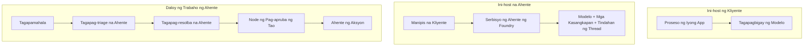
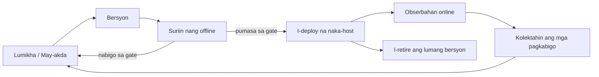
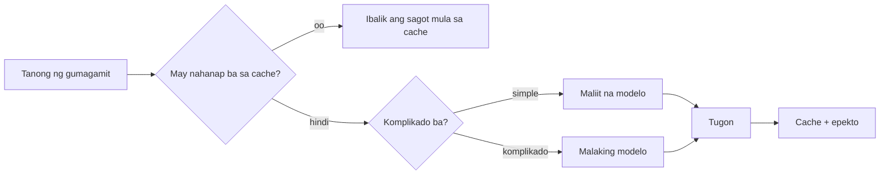
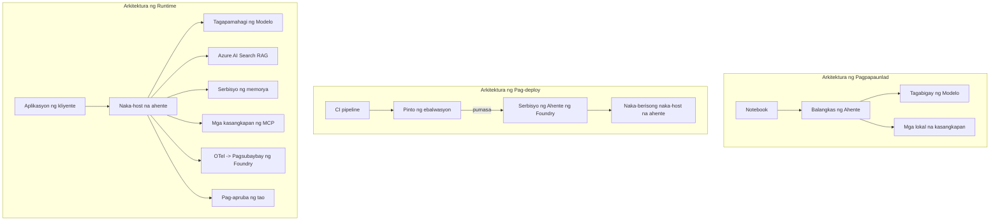

# Pag-deploy ng Scalable Agents gamit ang Microsoft Foundry


Hanggang sa puntong ito sa kurso ay nakabuo ka na ng mga agents na tumatakbo sa iyong laptop, sa loob ng notebook, na pinapagana ng `az login` at ilang environment variables. Iyan ang tamang paraan upang matuto. Hindi ito ang tamang paraan para magpatakbo ng agent na umaasa ang libu-libong customer sa oras na alas-3 ng umaga.

Ang araling ito ay tungkol sa agwat sa pagitan ng "gumagana ito sa aking makina" at "gumagana ito, nang maaasahan at abot-kaya, sa produksyon." Isinasara namin ang agwat na iyon gamit ang **Microsoft Foundry** at ang **Microsoft Foundry Agent Service**, at ginagawa namin ito sa pamamagitan ng paggawa ng isang totoong customer support agent na may mga tool, retrieval, memorya, pagsusuri, at pagmamanman.

## Panimula

Sasaklawin ng araling ito:

- Ang pagkakaiba sa pagitan ng isang **prototype agent** at isang **deployed agent**, at bakit karamihan sa paglipat ay tungkol sa lahat ng bagay *palibot* ng modelo.
- **Pattern ng deployment** para sa mga agent: client-hosted, service-hosted (Hosted Agents), at workflow-orchestrated.
- Ang **agent lifecycle** sa Microsoft Foundry — gumawa, mag-version, i-deploy, suriin, obserbahan, i-retire.
- **Mga estratehiya sa scaling**: modelo routing, caching, concurrency, at stateless na disenyo.
- **Observability** gamit ang OpenTelemetry at Foundry tracing.
- **Pagsasaayos ng gastos** sa pamamagitan ng pagpili ng modelo, routing, at mga evaluation gate.
- **Mga pagsasaalang-alang sa enterprise**: governance, human approval, at ligtas na pagpapatakbo ng MCP servers sa produksyon.

## Mga Layunin sa Pagkatuto

Pagkatapos makumpleto ang araling ito, malalaman mo kung paano:

- Pumili ng tamang pattern ng deployment para sa isang partikular na workload ng agent.
- I-deploy ang isang agent sa Microsoft Foundry Agent Service upang ito ay ma-version, ma-govern, at maging observable.
- I-instrument ang isang agent para sa tracing at itakda ang evaluation pipeline na tumatakbo bago ang bawat release.
- Mag-apply ng model routing at caching upang mapanatili ang latency at gastos sa kontrol sa malaking sukat.
- Magdagdag ng human approval gate para sa mga high-risk na aksyon at isama ang isang MCP server sa isang ligtas na paraan para sa produksyon.

## Mga Kinakailangan

Ipinapalagay ng araling ito na nakumpleto mo na ang mga naunang aralin at komportable ka sa:

- Pagbuo ng mga agent gamit ang [Microsoft Agent Framework](../14-microsoft-agent-framework/README.md) (Aralin 14).
- [Paggamit ng Tool](../04-tool-use/README.md) (Aralin 4) at [Agentic RAG](../05-agentic-rag/README.md) (Aralin 5).
- [Memorya ng Agent](../13-agent-memory/README.md) (Aralin 13) at [Agentic Protocols / MCP](../11-agentic-protocols/README.md) (Aralin 11).
- [Observability at Pagsusuri](../10-ai-agents-production/README.md) (Aralin 10) — direktang sumusuporta ang araling ito rito.

Kailangan mo rin ng:

- Isang **Azure subscription** at isang **Microsoft Foundry project** na may hindi bababa sa isang deployed chat model.
- Ang **Azure CLI** na nakapag-authenticate (`az login`).
- Python 3.12+ at ang mga packages sa repository [`requirements.txt`](../../../requirements.txt).

## Mula Prototype hanggang Produksyon: Ano ang Talagang Nagbabago

Ang prototype agent at production agent ay may parehong pangunahing loop — mag-isip, tumawag ng mga tool, tumugon. Ang nagbabago ay lahat ng nakapaloob sa loop na iyon. Ang modelo ay marahil 20% lamang ng isang production agent; ang natitirang 80% ay ang operational skeleton.

| Alalahanin | Prototype | Produksyon |
| --- | --- | --- |
| **Pagho-host** | Tumakbo sa iyong notebook | Tumakbo bilang isang hosted service, may version at pinalalabas |
| **Pagkakakilanlan** | Ang iyong `az login` token | Managed identity na may scoped RBAC |
| **Estado** | In-memory, nawawala kapag nirestart | Externalized (thread store, memory service) |
| **Pagkabigo** | Nakikita mo ang traceback | May retries, fallback, dead-letter, alerts |
| **Gastos** | "Ilang sentimo lang" | Sinusubaybayan kada request, naka-route, naka-cache, naka-budget |
| **Kalidad** | Tinitingnan mo lang ang resulta | Awtomatikong sinusuri bago ang bawat release |
| **Tiwala** | Inaaprubahan mo ang bawat aksyon | Patakaran + human-in-the-loop para sa mga mapanganib na aksyon |

Tandaan ang talahanayang ito. Bawat seksyon sa ibaba ay tumutukoy sa isa sa mga linyang ito.

## Mga Pattern sa Pag-deploy ng Agent

Mayroong tatlong pattern na gagamitin mo, madalas ay magkasama.

### 1. Client-Hosted Agents

Ang agent object ay nabubuhay sa loob ng *iyong* application process. Direktang tumatawag ang iyong code sa model provider; ang reasoning loop ay tumatakbo sa iyong serbisyo. Ito ang ginawa sa lahat ng mga naunang aralin.

- **Gamitin ito kapag** kailangan mo ng buong kontrol sa loop, custom middleware, o inilalagay mo ang agent sa loob ng umiiral na backend.
- **Trade-off**: ikaw ang may-ari ng scaling, estado, at resilienza.

### 2. Hosted Agents (Foundry Agent Service)

Ang agent ay *nirerehistro bilang isang resource* sa Microsoft Foundry. Ang Foundry ang nagho-host ng reasoning loop, nag-iimbak ng mga thread, nagpapatupad ng content safety at RBAC, at ginagawa ang agent na nakikita sa Foundry portal. Ang iyong app ay nagiging payat na client na lumilikha ng mga thread at bumabasa ng mga sagot.

- **Gamitin ito kapag** gusto mo ng tibay, built-in na observability, pamamahala, at mas kaunting operational surface area.
- **Trade-off**: mas kaunting mababang-lebel na kontrol kapalit ng managed runtime.

### 3. Agent Workflows

Maramihang mga agent (at tool) ang pinagsama sa isang graph na may malinaw na control flow — sekwensyal na mga hakbang, branching, human approval nodes, at mga matibay na checkpoint na maaaring mag-pause at mag-resume. Ito ang capability ng Microsoft Agent Framework **Workflows** na inilalapat sa scale ng deployment.

- **Gamitin ito kapag** ang isang gawain ay sumasaklaw sa ilang espesyalisadong agent o nangangailangan ng approval step sa gitna.
- **Trade-off**: mas maraming gumagalaw na bahagi; kailangan ng observability sa antas ng orchestration.



## Ang Lifecycle ng Agent sa Microsoft Foundry

Ang pag-deploy ng agent ay hindi isang beses lang na `push`. Ito ay isang loop, at kahawig ito ng software release cycle dahil iyan ang totoong nangyayari.



Ang pangunahing ideya, na galing sa [Lesson 10](../10-ai-agents-production/README.md): **offline evaluation ay isang gate, hindi isang afterthought.** Hindi nagpapadala ng bagong version ng agent maliban kung nalampasan nito ang iyong mga threshold sa pagsusuri. Ang online observability ang nagpapakain ng totoong mga pagkabigo pabalik sa iyong offline test set. Iyan ang buong loop.

## Mga Estratehiya sa Scaling

Ang pag-scale ng agent ay iba sa pag-scale ng stateless web API, dahil bawat request ay maaaring mag-trigger ng maramihang mahal na mga tawag sa modelo at tool. Apat na teknik ang bumubuhat ng karamihan sa load.

**Stateless na paghawak ng request.** Huwag magpanatili ng per-user state sa memorya ng iyong proseso. I-save ang mga conversation thread sa Foundry thread store o memory service upang anumang instance ay makaaasikaso ng anumang request. Ito ang nagpapahintulot sa iyo na mag-scale nang pahalang — magdagdag ng mga instance, walang sticky sessions.

**Model routing.** Hindi lahat ng request ay kailangan ang iyong pinakamakapangyarihan (at pinakamahal) na modelo. I-route ang mga simpleng request — pag-uuri ng intensyon, maikling factual na sagot — sa maliit at mabilis na modelo, at ireserba ang malaking modelo para sa tunay na pangangatwiran. Ang **Model Router** ng Foundry ang pwedeng gawin ito para sa iyo, o maaari kang gumawa ng magaang classifier mismo. Gagawa ka ng DIY na bersyon sa lab.

**Response caching.** Maraming support queries ang halos-pareho ("paano ko i-reset ang password ko?"). I-cache ang mga sagot sa mga karaniwang tanong at ibigay ang mga ito nang hindi tinatamaan ang modelo. Kahit ang katamtamang cache hit rate ay makabuluhang nagpapababa ng gastos at latency.

**Concurrency at backpressure.** May mga rate limit ang mga model provider. I-limit ang concurrency, gamitin ang retries na may exponential backoff, at mag-fail nang maayos (ang nakapila na "ginagawa namin ito" na sagot ay mas mabuti kaysa 500 error).



## Observability sa Produksyon

Hindi mo mapapatakbo ang isang bagay na hindi mo nakikita. Tulad ng tinalakay sa Aralin 10, ang Microsoft Agent Framework ay naglalabas ng **OpenTelemetry** traces nang native — bawat tawag sa modelo, invocation ng tool, at hakbang ng orchestration ay nagiging span. Sa produksyon, ine-export mo ang mga itong span sa Microsoft Foundry (o anumang OTel-compatible backend) upang magawa mong:

- Sundan ang isang reklamo ng customer mula umpisa hanggang dulo sa bawat tawag sa modelo at tool.
- Bantayan ang p50/p95 na latency at gastos kada request sa paglipas ng panahon.
- Mag-alerto sa mga spike sa error rate at anomalies sa gastos bago pa man ito mapansin ng iyong mga user (o ng iyong finance team).

```python
from agent_framework.observability import get_tracer

tracer = get_tracer()

with tracer.start_as_current_span("support_request") as span:
    span.set_attribute("customer.tier", "enterprise")
    span.set_attribute("routed.model", "gpt-5-nano")
    # ang pagsubaybay ng pagpapatupad ng ahente ay awtomatikong ginagawa sa loob ng span na ito
```

Ang mga attribute tulad ng `customer.tier` at `routed.model` ang siyang nagbabago ng maraming traces na maging mga tanong na maaaring masagot ("madalas bang nire-route ang mga enterprise customer sa maliit na modelo?").

## Pagsasaayos ng Gastos

Ang gastos sa production agents ay pinapangibabawan ng tokens. Tatlong lever, ayon sa epekto:

1. **Piliin ang tamang laki ng modelo.** Halos palaging mas mura ang maliit na modelo na pumasa sa iyong evaluation gate kaysa sa malaking modelo na pumasa rin. Gamitin ang pagsusuri upang *patunayan* na sapat na ang maliit na modelo kaysa mag-default sa pinakamalaki dahil sa pag-iingat.
2. **Route ayon sa komplikasyon.** Gaya ng nasa itaas — magbayad ng presyo ng malaking modelo lamang para sa mga request na nangangailangan ng pangangatwiran gamit ang malaking modelo.
3. **Mag-cache ng agresibo.** Ang pinakamurang tawag sa modelo ay yung hindi mo ginawa.

Ang evaluation gates at kontrol sa gastos ay parehas na disiplina na tinitingnan mula sa dalawang anggulo: nagsasabi ang pagsusuri ng *quality floor*, pinananatili kang malapit sa *gastos* ng ahalintulad na floor ng routing at caching.

## Mga Pagsasaalang-alang sa Enterprise Deployment

**Gobernansa.** Ang Hosted Agents ay namamana ang RBAC, content safety, at auditing ng Foundry. Bigyan ang bawat agent ng managed identity na may pinakamababang pribilehiyo na kailangan nito — read-only access sa knowledge base, scoped access sa ticketing API, at wala nang iba pa.

**Human-in-the-loop.** May mga aksyon na napakahalaga para awtomatikong gawin — pag-isyu ng refund, pagtanggal ng account, pagrereklamo sa legal na koponan. Sinusuportahan ng Microsoft Agent Framework ang mga tool na nangangailangan ng **approval-required**: inilalahad ng agent ang aksyon, habang naka-pause ang execution, isang tao ang nag-aapruba o nagtatanggil, at nagpapatuloy ang workflow. Nakita mo ang primitive nito sa [Lesson 6](../06-building-trustworthy-agents/README.md); dito mo ito ida-deploy.

**MCP sa Produksyon.** Pinapayagan ng [MCP](../11-agentic-protocols/README.md) ang iyong agent na kumonsumo ng mga external na tool sa pamamagitan ng standard na interface. Sa produksyon, ituring ang bawat MCP server bilang isang hindi pinagkakatiwalaang hangganan: i-pin ang bersyon ng server, patakbuhin gamit ang scoped identity, suriin ang mga output nito, at huwag kailanman ibunyag ang mga lihim dito. Ang MCP server ay isang dependency, at ang mga dependency ay ina-audit, pine-patch, at nililimitahan ang rate.



Ang tatlong diagram na iyon — development, deployment, runtime — ay iisang agent sa tatlong yugto ng buhay nito. Ang susunod na lab ay maglalakad sa'yo sa pagbuo nito.

## Hands-On Lab: Isang Production-Ready Customer Support Agent

Buksan ang [`code_samples/16-python-agent-framework.ipynb`](./code_samples/16-python-agent-framework.ipynb) at gawin ito mula umpisa hanggang dulo. Bubuuin mo ang isang **Contoso customer support agent** na may lahat ng pagsasaalang-alang sa produksyon na naka-wire:

1. **Pagtawag sa tool** — tingnan ang status ng order at magbukas ng support tickets.
2. **RAG** — sagutin ang mga tanong ukol sa polisiya mula sa knowledge base (Azure AI Search, na may in-memory fallback para tumakbo ang notebook nang walang Search resource).
3. **Memorya** — alalahanin ang customer sa bawat bahagi ng usapan.
4. **Model routing** — isang complexity classifier na nagru-route ng bawat request sa maliit o malaking modelo.
5. **Response caching** — ang mga paulit-ulit na tanong ay sinasagot mula sa cache.
6. **Pagtanggap ng tao** — humihinto para sa pag-apruba ng tao ang mga refund na lampas sa threshold.
7. **Evaluation pipeline** — maliit na offline na test set na nagsusuri sa agent at nagsisilbing release gate.
8. **Observability** — OpenTelemetry tracing sa bawat request.

### Gabay sa Pagsunod

Ang notebook ay inayos upang bawat isyu sa produksyon ay isang nakahiwalay at tumatakbong seksyon. Ang puso nito ay ang routing-plus-caching request handler:

```python
async def handle_support_request(query: str, customer_id: str) -> str:
    # 1. Maglingkod mula sa cache kapag maaari.
    cached = response_cache.get(normalize(query))
    if cached:
        return cached

    # 2. Mag-route ayon sa pagiging kumplikado upang kontrolin ang gastos.
    model = "gpt-5-nano" if is_simple(query) else "gpt-5-mini"

    # 3. Patakbuhin ang agent sa loob ng isang trace span para sa obserbabilidad.
    with tracer.start_as_current_span("support_request") as span:
        span.set_attribute("routed.model", model)
        span.set_attribute("customer.id", customer_id)
        response = await support_agent.run(query, model=model)

    # 4. I-cache at ibalik.
    response_cache.set(normalize(query), response.text)
    return response.text
```

Ang evaluation gate na nagbabantay sa release ay ganito:

```python
async def evaluation_gate(agent, test_cases, threshold: float = 0.8) -> bool:
    passed = 0
    for case in test_cases:
        result = await agent.run(case["input"])
        if score_response(result.text, case["expected"]) >= 0.8:
            passed += 1
    pass_rate = passed / len(test_cases)
    print(f"Evaluation pass rate: {pass_rate:.0%} (gate: {threshold:.0%})")
    return pass_rate >= threshold  # i-deploy lamang kung pumasa ang gate
```

Basahin ang bawat linya — intentionally maikli ang mga primitive upang walang nakatago sa likod ng framework call.

## Pag-validate ng Deployed Agent gamit ang Smoke Tests

Ang evaluation gate sa itaas ay tumatakbo *offline* laban sa iyong agent object. Kapag na-deploy na bilang Hosted Agent ang agent, kailangan mo ng isa pa, mas mura pang tsek: **tumugon ba ang deployed endpoint?**

Ang "successful" na deployment ay nagpapatunay lamang na tinanggap ng control plane ang definition — hindi nito pinapatunayan na tumutugon ang agent. Ang nawawalang dependency, maling model routing, o expired na koneksyon ay maaaring mag-iwan ng green deployment na walang sagot. Ang **smoke test** ay tumutuklas nito sa ilang segundo, sa bawat deploy, nang hindi kasing gastos ng full evaluation.

Nagsasama ang repository na ito ng ready-to-use na smoke-test pipeline na nakabase sa [AI Smoke Test](https://github.com/marketplace/actions/ai-smoke-test) GitHub Action:

- **Catalog** — ang [`tests/lesson-16-smoke-tests.json`](../../../tests/lesson-16-smoke-tests.json) ay naglalaman ng mga prompt at assertions para sa Contoso support agent (mga sagot na grounded sa polisiya, order lookup, pananatili sa paksa, at multi-turn thread continuity). May kasamang catalog para sa mga agents ng ibang aralin na kalakip nito — tingnan ang [`tests/README.md`](../tests/README.md).
- **Workflow** — Ang [`.github/workflows/smoke-test.yml`](../../../.github/workflows/smoke-test.yml) ay nagla-log in gamit ang Azure OIDC at nag-POST ng bawat prompt sa Responses endpoint ng agent, na pinapalusot ang trabaho kapag may kulang sa assertion.

```yaml
- name: Smoke-test hosted agent
  uses: JFolberth/ai-smoketest@v1
  with:
    project_endpoint: ${{ inputs.project_endpoint }}
    agent_name: ContosoSupportAgent
    tests_file: tests/lesson-16-smoke-tests.json
```


Patakbuhin ito mula sa tab na **Actions** kapag na-deploy na ang iyong agent, na nagbibigay ng iyong Foundry project endpoint at pangalan ng agent. Kailangang may **Azure AI User** role ang federated identity sa saklaw ng Foundry project. Isipin ang mga layer bilang isang pyramid: ang smoke tests (maaabot at tumutugon ba?) ay tumatakbo sa bawat deploy, ang offline evaluation (sapat na ba para ipadala?) ay tumatakbo bago ang promotion, at ang online evaluation (kamusta ito sa totoong gamit?) ay patuloy na tumatakbo.

## Pagsusuri ng Kaalaman

Subukan ang iyong pag-unawa bago lumipat sa takdang-aralin.

**1. Tinatayang gaano kalaki ang bahagi ng isang production agent ang "modelo," at ano naman ang natitira?**

<details>
<summary>Sagot</summary>

Ang modelo ay maliit na bahagi ng sistema — madalas na tinutukoy na mga 20%. Ang natitira ay ang operational skeleton: hosting at versioning, identity at RBAC, externalised state, failure handling, pagsusubaybay sa gastos, evaluation, at mga kontrol ng human-in-the-loop. Ang paglipat sa production ay kalimitang tungkol sa pagbuo ng lahat *palibot* ng reasoning loop.
</details>

**2. Kailan mo pipiliin ang Hosted Agent kaysa sa client-hosted agent?**

<details>
<summary>Sagot</summary>

Kapag gusto mo ng managed runtime na may built-in na durability (mga thread na nagpapatuloy at maaaring mag-resume), observability, content safety, at RBAC, at handa kang isuko ang ilang low-level na kontrol sa reasoning loop para sa mas kaunting operational surface area. Mas maganda ang client-hosted kapag kailangan mo ng buong kontrol sa loop o isinasama ang agent sa umiiral na backend.
</details>

**3. Bakit kailangang maging stateless ang isang scalable agent sa sariling process memory nito?**

<details>
<summary>Sagot</summary>

Para kahit anong instance ay makakayanan ang kahit anong kahilingan, na siyang nagpapahintulot ng horizontal scaling nang walang sticky sessions. Ang per-user conversation state ay ni-externalize sa thread store o memory service. Kung ang state ay nasa process memory, mawawala ito kapag ni-restart at hindi mo mailalagay nang malaya ang load.
</details>

**4. Anong problema ang nilulutas ng model routing, at paano ito kaugnay ng evaluation?**

<details>
<summary>Sagot</summary>

Pinapadala ng routing ang mga simpleng request sa maliit, murang, at mabilis na modelo at inilaan ang malaking modelo para sa tunay na reasoning, na kinokontrol ang latency at gastos. Kaugnay ito ng evaluation dahil ang evaluation ang *naglalahad* na ang maliit na modelo ay sapat para sa isang klase ng mga request — ang routing na walang evaluation ay paghuhula lang.
</details>

**5. Ano ang "evaluation gate" at saan ito nakaposisyon sa lifecycle?**

<details>
<summary>Sagot</summary>

Ang evaluation gate ay nagpapatakbo ng offline test set laban sa bagong bersyon ng agent at pinipigilan ang deployment maliban kung ang pass rate ay lampas sa threshold. Ito ay nasa pagitan ng "version" at "deploy" sa lifecycle, ginagawang precondition ng kalidad para sa release sa halip na isang bagay na tinitingnan mo pagkatapos ipadala.
</details>

**6. Bakit dapat ituring bilang hindi pinagkakatiwalaang boundary ang MCP server sa production?**

<details>
<summary>Sagot</summary>

Dahil ito ay isang external dependency na tinatawagan ng iyong agent. Dapat mong itakda ang bersyon nito, patakbuhin ito na may scoped identity, suriin ang mga output nito, limitahan ang rate, at huwag kailanman ibunyag ang mga sikreto dito — ang katulad na disiplina na ginagamit mo sa anumang third-party dependency. Ang mga output nito ay dumadaloy sa reasoning ng iyong agent, kaya ang hindi beripikadong pagtitiwala ay panganib sa seguridad.
</details>

**7. Anong isang pagbabago ang karaniwang may pinakamalaking epekto sa gastos ng production agent, at bakit?**

<details>
<summary>Sagot</summary>

Ang tamang sukat ng modelo — paggamit ng pinakamaliit na modelo na pumapasa sa iyong evaluation gate. Pinamumunuan ng token ang gastos, at ang mas maliit na modelo na nakakatugon sa quality bar ay halos palaging mas mura kaysa sa mas malaki. Pinapababa pa ng caching at routing ang gastos, pero ang pagpili ng tamang base model ang may pinakamalaking unang epekto.
</details>

**8. Anong papel ang ginagampanan ng mga span attribute tulad ng `customer.tier` at `routed.model` sa observability?**

<details>
<summary>Sagot</summary>

Ginagawang mga tanong sa negosyo ang mga raw trace. Kung walang mga attribute ay pader lang ng mga span; kung mayroon, maaari mong itanong "madalas bang pinapadala sa maliit na modelo ang mga enterprise customer?" o "alin ang modelo na humahawak sa pinakamabagal naming request?" Ang mga attribute ay kung paano mo hinihiwa-hiwalay ang telemetry ayon sa mga dimensyong mahalaga sa iyong operasyon.
</details>

## Takdang-Aralin

Kuhanin ang customer support agent mula sa lab at patatagin ito para sa isang partikular na senaryo: **isang subscription billing support agent para sa isang SaaS company.**

Ang iyong isusumite ay dapat:

1. **Palitan ang mga tool** ng mga may kinalaman sa billing: `get_subscription_status`, `get_invoice`, at `issue_credit` (ang mga credit na higit sa $50 ay nangangailangan ng pag-apruba ng tao).
2. **Magdagdag ng tatlong RAG dokumento** na sumasaklaw sa refund policy ng kumpanya, billing cycle, at cancellation policy.
3. **Palawakin ang evaluation set** sa hindi bababa sa walong kaso, kabilang ang hindi bababa sa dalawang dapat mag-trigger ng human-approval path, at kumpirmahin na tama ang pagpasa o pagkabigo ng iyong evaluation gate.
4. **Magdagdag ng isang cost report**: pagkatapos mapatakbo ang sampung halo-halong query sa agent, ipakita kung ilan ang napunta sa maliit na modelo, ilan sa malaking modelo, at ilan ang nai-serve mula sa cache.

Sumulat ng maikling talata (sa isang markdown cell) na nagpapaliwanag kung anong patakaran sa model-routing ang pinili mo at paano mo ito bibilangin gamit ang totoong trapiko. Walang iisang tamang sagot — sinusuri ka kung magkakasundo nang maayos ang mga alalahanin sa production.

## Buod

Sa araling ito, inilipat mo ang isang agent mula prototype hanggang production gamit ang Microsoft Foundry:

- Ang paglipat sa production ay kalimitang tungkol sa **operational skeleton** sa paligid ng modelo — hosting, identity, estado, failure handling, gastos, kalidad, at pagtitiwala.
- Natutunan mo ang tatlong **deployment patterns** — client-hosted, Hosted Agents, at Agent Workflows — at kailan angkop ang bawat isa.
- Nilakad mo ang **agent lifecycle**, kung saan ang offline **evaluation ay nagsisilbing release gate** at ang online observability ay nagsasauli ng failure pabalik sa test set.
- Inilapat mo ang **scaling strategies** — stateless design, model routing, caching, at bounded concurrency — at inugnay ang mga ito sa **pagpapababa ng gastos**.
- Nilagyan mo ng **enterprise controls**: RBAC, human-in-the-loop approval, at production-safe MCP integration.
- Nagtayo ka ng **production-ready customer support agent** na nag-uugnay ng lahat ng mga alalahanin na ito sa isang tatakbuhing code.

Ang susunod na aralin ay ang kabaligtaran na paglalakbay: sa halip na palakihin ang mga agent patungo sa cloud, dadalhin mo sila *pababa* sa isang solong developer machine at patatakbuhin nang lubusan nang lokal.

## Karagdagang Mga Mapagkukunan

- <a href="https://learn.microsoft.com/azure/ai-foundry/what-is-azure-ai-foundry" target="_blank">Microsoft Foundry documentation</a>
- <a href="https://learn.microsoft.com/azure/ai-foundry/agents/overview" target="_blank">Microsoft Foundry Agent Service overview</a>
- <a href="https://learn.microsoft.com/en-us/agent-framework/overview/?wt.mc_id=youtube_26688_organicsocial_reactor&pivots=programming-language-python" target="_blank">Microsoft Agent Framework</a>
- <a href="https://learn.microsoft.com/azure/ai-foundry/concepts/model-router" target="_blank">Model Router in Microsoft Foundry</a>
- <a href="https://learn.microsoft.com/azure/search/search-what-is-azure-search" target="_blank">Azure AI Search</a>
- <a href="https://opentelemetry.io/" target="_blank">OpenTelemetry</a>
- <a href="https://github.com/marketplace/actions/ai-smoke-test" target="_blank">AI Smoke Test GitHub Action</a>
- <a href="https://modelcontextprotocol.io/" target="_blank">Model Context Protocol (MCP)</a>

## Nakaraang Aralin

[Building Computer Use Agents (CUA)](../15-browser-use/README.md)

## Susunod na Aralin

[Creating Local AI Agents](../17-creating-local-ai-agents/README.md)

---

<!-- CO-OP TRANSLATOR DISCLAIMER START -->
**Pagtatanggi**:
Ang dokumentong ito ay isinalin gamit ang serbisyo ng AI translation na [Co-op Translator](https://github.com/Azure/co-op-translator). Bagama't nagsusumikap kami para sa katumpakan, pakatandaan na ang awtomatikong pagsasalin ay maaaring maglaman ng mga pagkakamali o hindi pagkakatugma. Ang orihinal na dokumento sa orihinal nitong wika ang dapat ituring na pangunahing sanggunian. Para sa mahahalagang impormasyon, inirerekomenda ang propesyonal na pagsasalin ng tao. Hindi kami mananagot sa anumang maling pagkakaintindi o maling interpretasyon na nagmula sa paggamit ng pagsasaling ito.
<!-- CO-OP TRANSLATOR DISCLAIMER END -->