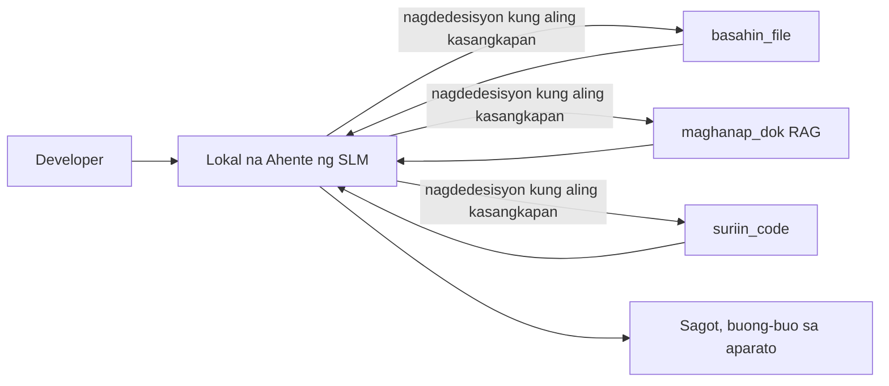
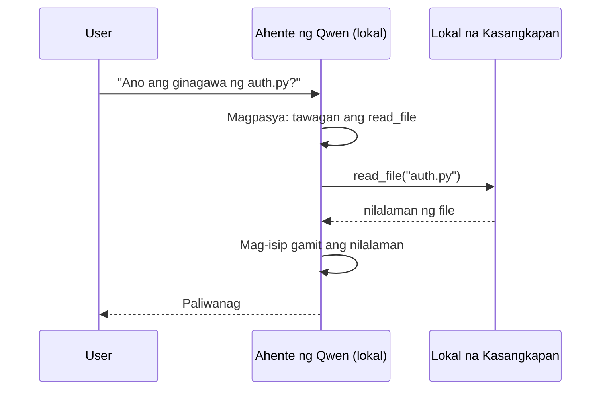
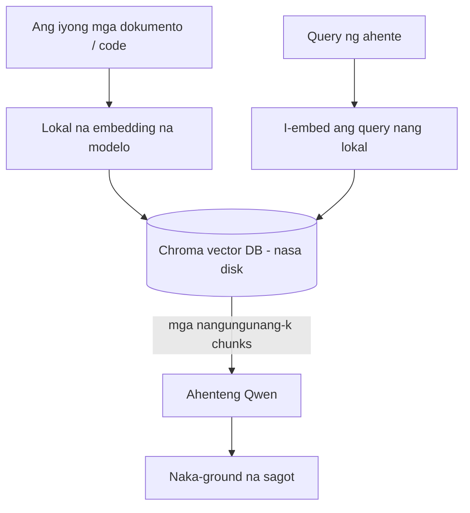
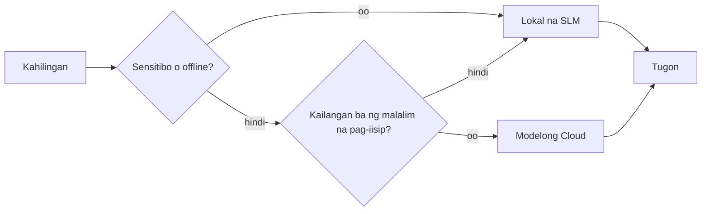

# Paglikha ng Lokal na AI Agents Gamit ang Microsoft Foundry Local at Qwen


Ang nakaraang aralin ay nag-scale ng mga agent *pataas* sa ulap. Ang araling ito ay nagdadala sa kanila *pababa* sa isang solong makina. Sa pagtatapos, magkakaroon ka ng gumaganang engineering assistant na nagrereason, tumatawag ng mga tool, nagbabasa ng iyong mga file, at naghahanap sa iyong dokumentasyon — **nang walang kahit isang ulap na inference call.**

Bakit mo iyon gusto? Tatlong dahilan na madalas lumitaw sa tunay na gawaing engineering:

- **Pagkapribado.** Hindi nalalabas sa makina ang code at mga dokumento. Walang prompt, snippet, o datos ng customer na lumalampas sa hangganan ng network.
- **Gastos.** Walang singil bawat token sa lokal na inference. Puwede kang mag-iterate buong araw sa kapangyarihan ng kuryente lamang.
- **Offline.** Sa eroplano, sa isang secure na pasilidad, o panahon ng outage, gumagana pa rin ang agent.

Ang kapalit ay ang pagpapalitan ng isang frontier cloud model para sa isang **Small Language Model (SLM)** na tumatakbo sa iyong CPU, GPU, o NPU. Ang araling ito ay tungkol sa paggawa ng mga agent na *magaling* sa ilalim ng ganitong limitasyon sa halip na magpanggap na wala ang limitasyong iyon.

## Panimula

Tatalakayin ng araling ito ang mga sumusunod:

- **Small Language Models (SLMs)** — kung ano ang mga ito, saan sila magaling, at saan hindi.
- **Microsoft Foundry Local** — isang runtime na nagda-download at nagseserbisyo ng mga modelo sa device sa pamamagitan ng isang **OpenAI-compatible API**.
- **Qwen function-calling models** — mga SLM na maaasahang gumagawa ng mga tool call, na siyang nagpapagana sa mga lokal na *agent* (hindi lang lokal na chat).
- **Lokal na mga tool, lokal na RAG, at lokal na MCP** — nagbibigay sa agent ng kakayahan nang walang ulap.
- **Hybrid patterns** — kung kailan panatilihin sa lokal at kailan abutin ang ulap.

## Mga Layunin sa Pagkatuto

Pagkatapos tapusin ang araling ito, malalaman mo kung paano:

- Ipaliwanag ang mga trade-off ng SLM at pumili ng tamang kaso ng paggamit para sa lokal na agent.
- Maglingkod ng Qwen model nang lokal gamit ang Foundry Local at kumonekta dito sa pamamagitan ng OpenAI-compatible endpoint.
- Gumawa ng isang tool-calling agent na tumatakbo nang buo sa iyong workstation.
- Magdagdag ng lokal na RAG sa iyong sariling mga dokumento gamit ang lokal na vector database (Chroma).
- Ikonekta ang agent sa isang lokal na MCP server at mag-reason tungkol sa hybrid na lokal/ulap na disenyo.

## Mga Kinakailangan

Ipinapalagay ng araling ito na natapos mo na ang mga naunang aralin at komportable ka sa:

- [Tool Use](../04-tool-use/README.md) (Aralin 4) at [Agentic RAG](../05-agentic-rag/README.md) (Aralin 5).
- [Agentic Protocols / MCP](../11-agentic-protocols/README.md) (Aralin 11).
- Ang [Microsoft Agent Framework](../14-microsoft-agent-framework/README.md) (Aralin 14).

Kailangan mo rin ng:

- Isang developer workstation. **8 GB RAM ang realistic na minimum**; mas kumportable ang 16 GB pataas. Nakakatulong ang GPU o NPU ngunit hindi kinakailangan.
- **Microsoft Foundry Local** na naka-install (tingnan ang seksyon ng setup sa ibaba).
- Python 3.12+ at mga pakete sa repository [`requirements.txt`](../../../requirements.txt), pati ang `foundry-local-sdk`, `openai`, at `chromadb` para sa araling ito.

## Small Language Models: Ang Tamang Kasangkapan para sa Lokal na Trabaho

Ang isang frontier cloud model ay may daan-daang bilyong mga parameter at isang data centre sa likod nito. Ang isang SLM ay may ilang bilyong parameter at kailangang magkasya sa RAM ng iyong laptop. Ang pagkakaibang ito ay nagtatakda ng malinaw na inaasahan.

**Magaling ang mga SLM sa:**

- Mga nakaayos at may hangganang gawain — classification, extraction, pagsubaybay ng buod ng isang kilalang dokumento.
- **Pagtawag ng tool** — pagpapasya kung aling function ang tatawagin at sa anong mga argumento.
- Mabilis, mura, pribadong pag-uulit gamit ang iyong sariling datos.

**Mahina ang mga SLM sa:**

- Bukas na pagsusuri na maraming hakbang sa malaking konteksto.
- Malawak na kaalaman sa mundo (mas kaunti ang nakita nila, at mas madalas makalimutan).

Kaya ang tamang estratehiya para sa mga lokal na agent ay: **hayaan ang SLM ang mag-orchestrate, at hayaang gawin ng mga tool ang mabibigat na gawain.** Hindi kailangang *alam* ng modelo ang iyong codebase — kailangan lamang nitong malaman kung kailan tatawagin ang `read_file` at `search_docs`. Ito ay direktang naaayon sa lakas ng SLM.



## Microsoft Foundry Local

**Microsoft Foundry Local** ay isang magaan na runtime na nagda-download, namamahala, at nagseserbisyo ng mga modelo nang buo sa iyong makina. Ang pinakamahalagang tampok para sa atin ay naipapakita nito ang isang **OpenAI-compatible HTTP endpoint** — na nangangahulugan na ang OpenAI SDK at Microsoft Agent Framework's OpenAI client ay gumagana dito sa pamamagitan ng iisang pagbabago sa `base_url`. Lahat ng iyong natutunan tungkol sa paggawa ng mga agent ay direktang maililipat; ang endpoint lang ang lumilipat mula sa ulap papuntang `localhost`.

Pinipili rin ng Foundry Local ang pinakamagandang build ng modelo para sa iyong hardware nang awtomatiko — CPU build, CUDA/GPU build, o NPU build — kaya hindi mo kailangang mano-manong i-optimize para sa bawat makina.

### Setup

I-install ang Foundry Local (tingnan ang [dokumentasyon](https://learn.microsoft.com/azure/ai-foundry/foundry-local/) para sa iyong OS), pagkatapos kumpirmahin na gumagana ito:

```bash
# I-install (halimbawa; sundin ang mga dokumento para sa iyong plataporma)
winget install Microsoft.FoundryLocal      # Windows
# brew install microsoft/foundrylocal/foundrylocal   # macOS

# I-download at patakbuhin ang isang Qwen na modelo, pagkatapos simulan ang lokal na serbisyo
foundry model run qwen2.5-7b-instruct
foundry service status
```

Kapag tumatakbo na ang serbisyo, mayroon kang lokal na OpenAI-compatible endpoint (karaniwan ay `http://localhost:PORT/v1`). Ginagamit ng notebook ang `foundry-local-sdk` para awtomatikong mahanap ang endpoint, kaya hindi mo na kailangang i-hardcode ang port.

## Qwen Function Calling: Bakit Ito Mahalaga

Isa lang ang agent kung kaya nitong tumawag ng mga tool. Maraming SLM ang puwedeng mag-chat ngunit naglalabas ng mga hindi maaasahan o maling format na tool calls. Ang mga **Qwen** na modelo ay sinanay para sa function calling at palagiang naglalabas ng maayos na mga tool-call structure — na siyang nagpapa–local chat model maging lokal na *agent*.

Ang daloy ay ang karaniwang tool-calling loop na alam mo na, pero tumatakbo sa device:



## Lokal na RAG

Ang paghahanap sa dokumentasyon ang pinanggagalingan ng halaga ng mga lokal na agent. Sa halip na umaasa na natandaan ng SLM ang dokumentasyon ng iyong framework, ini-embed mo ang mga dokumentong iyon sa isang **lokal na vector database** at pinapayagan ang agent na kunin ang mga kaukulang bahagi kapag kailangan.

Ginagamit natin ang **Chroma**, isang embedded vector store na tumatakbo nang sama-sama sa proseso nang walang server na kailangang pamahalaan. Ang pipeline ay ganap na lokal: lokal na embedding model → lokal na vectors → lokal na retrieval → lokal na SLM.



Ito ang parehong Agentic RAG na pattern mula sa Aralin 5 — ang nag-iisang pagbabago ay lahat ng bahagi ay tumatakbo sa iyong makina.

## Lokal na MCP Servers

Ang [MCP](../11-agentic-protocols/README.md) ay isang transport, hindi isang cloud service. Ang isang MCP server ay puwedeng tumakbo bilang lokal na proseso sa `stdio`, na nag-eexpose ng mga tool sa iyong agent sa pamamagitan ng standard na protocol. Pinapayagan kang muling gamitin ang lumalawak na ecosystem ng mga MCP server — filesystem access, git operations, database queries — nang ganap na offline.

Iba ang security posture dito kumpara sa ulap, ngunit hindi ito nawawala: ang lokal na MCP server ay tumatakbo gamit ang permiso ng iyong user, kaya dapat kontrolin mo kung ano lang ang kaya nitong pasukin (halimbawa, isang project directory lang, hindi ang buong home folder mo) at i-validate ang outputs nito bago gamitin.

## Hybrid Cloud-and-Local Patterns

Ang local-first ay hindi nangangahulugang local-only. Ang mga matured na sistema ay nagro-route base sa sensitivity at hirap:

| Sitwasyon | Saan ito tumatakbo |
| --- | --- |
| Sensitibong code / data, o offline | **Lokal na SLM** |
| Simpleng hangganang gawain | **Lokal na SLM** (murang, mabilis) |
| Mahirap na multi-hop reasoning sa hindi sensitibong data | **Cloud model** |
| Lahat ng bagay, habang may outage | **Lokal na SLM** (maayos na pagbagsak) |

Ito ay kahalintulad ng ideya ng **model routing** mula sa Aralin 16 — pero isa sa mga "modelo" ay ang sarili mong makina. Ang matibay na disenyo ay bumabalik sa lokal kapag hindi available ang ulap, kaya ang agent ay bumabagsak nang maayos sa kalidad sa halip na total na pumalya.



## Hands-On Lab: Lokal na Engineering Assistant

Buksan ang [`code_samples/17-local-agent-foundry-local.ipynb`](./code_samples/17-local-agent-foundry-local.ipynb) at gawin ito. Gagawa ka ng isang **lokal na engineering assistant** na tumatakbo nang buo sa iyong workstation at puwedeng:

1. **Tumawag ng mga tool** — sa pamamagitan ng Qwen function calling gamit ang Foundry Local.
2. **Gumawa ng lokal na file operations** — maglista at magbasa ng mga file sa isang project directory.
3. **Mag-analisa ng code** — mag-ulat ng mga pangunahing sukatan sa isang source file.
4. **Maghanap ng dokumentasyon** — lokal na RAG sa isang docs folder gamit ang Chroma.
5. **Gumamit ng MCP** — kumonekta sa isang lokal na MCP server (na may maayos na pagskip kung wala).

Walang ulap na inference ang ginagamit sa kahit anong punto.

### Gabay sa Pagsunod

Kumokonekta ang assistant sa Foundry Local sa pamamagitan ng OpenAI-compatible endpoint, kaya halos pareho lang ang code ng agent sa mga aralin sa ulap — ang nagbabago lang ay ang client:

```python
from foundry_local import FoundryLocalManager
from openai import OpenAI

# Natuklasan/nida-download ng Foundry Local ang modelo at nagbibigay sa atin ng lokal na endpoint.
manager = FoundryLocalManager(\"qwen2.5-7b-instruct\")
client = OpenAI(base_url=manager.endpoint, api_key=manager.api_key)  # Ang api_key ay isang lokal na placeholder
```

Ang mga tool ay mga ordinaryong Python function na naka-scope sa isang project directory:

```python
def read_file(path: str) -> str:
    \"\"\"Read a file, but only inside the sandboxed project directory.\"\"\"
    full = (PROJECT_ROOT / path).resolve()
    if PROJECT_ROOT not in full.parents and full != PROJECT_ROOT:
        return \"Access denied: path is outside the project directory.\"
    return full.read_text(encoding=\"utf-8\")
```

Pansinin ang sandbox check — kahit sa lokal, ang tool na nagbabasa ng mga arbitrary path ay isang panganib. Pinananatili ng notebook na naka-scope ang bawat tool sa iisang project root.

## Pagsusulit sa Kaalaman

Subukan ang iyong pag-unawa bago lumipat sa takdang-aralin.

**1. Magbigay ng dalawang kongkretong dahilan kung bakit patakbuhin ang agent nang lokal kaysa sa ulap.**

<details>
<summary>Sagot</summary>

Bawat isa sa mga sumusunod: **pagkapribado** (hindi lumalabas sa makina ang code at datos), **gastos** (walang singil bawat token sa inference), at **offline capability** (gumagana kahit walang network — sa eroplano, secure na pasilidad, o panahon ng outage). Ang mga regulasyon o compliance na nagbabawal magpadala ng datos sa labas ng device ay karaniwang pwersa ng dahilan sa privacy.
</details>

**2. Ano ang inirerekomendang pamamahagi ng gawain sa pagitan ng SLM at mga tool nito sa isang lokal na agent, at bakit?**

<details>
<summary>Sagot</summary>

Hayaan ang SLM ang **mag-orchestrate** (pagpili kung anong tool ang tatawagin at sa anong mga argumento) at hayaan ang mga **tool ang gumawa ng mabibigat na gawain** (pagbasa ng file, pagkuha ng docs, pagkalkula ng resulta). Malakas ang SLM sa mga hangganang desisyon tulad ng pagpili ng tool ngunit mahina sa malawak na kaalaman at mahahabang multi-hop na pagsusuri, kaya ang pagdepende sa mga tool ay nagpapalakas sa kanila.
</details>

**3. Ano ang nagpapahintulot na magamit muli ang cloud agent code gamit ang Foundry Local?**

<details>
<summary>Sagot</summary>

Nag-eexpose ang Foundry Local ng isang **OpenAI-compatible HTTP endpoint**. Gumagana ang OpenAI SDK at Agent Framework's OpenAI client dito sa pamamagitan ng pagbabago lang ng `base_url` (at paggamit ng lokal na placeholder API key). Ang lahat ng iba pa tungkol sa code ng agent ay pareho pa rin.
</details>

**4. Bakit partikular na ginagamit ang Qwen function-calling model sa halip na alinmang SLM?**

<details>
<summary>Sagot</summary>

Dahil ang isang agent ay kailangang makagawa ng maaasahan, maayos ang porma na **tool calls**. Maraming SLM ay kaya mag-chat ngunit naglalabas ng mali o hindi pare-parehong tool-call na mga istruktura. Ang mga Qwen model ay sinanay para sa function calling at palaging naglalabas ng consistent na tool call, na siyang nagpapagana sa isang lokal na chat model na maging isang lokal na agent.
</details>

**5. Sa lokal na RAG pipeline, alin sa mga bahagi ang tumatakbo sa makina?**

<details>
<summary>Sagot</summary>

Lahat: ang embedding model, ang vector database (Chroma, sa disk), ang retrieval step, at ang SLM. Ang mga dokumento ay ini-embed nang lokal, iniimbak nang lokal, kinukuha nang lokal, at iniisipan ng lokal na modelo — walang komponente ang humahawak sa ulap.
</details>

**6. Ang isang lokal na MCP server ay tumatakbo sa iyong makina. Ibig sabihin ba nito na awtomatikong ligtas ito? Anong pag-iingat ang dapat mong gawin?**

<details>
<summary>Sagot</summary>

Hindi. Ang isang lokal na MCP server ay tumatakbo gamit ang permiso ng iyong user, kaya kaya nitong pasukin kahit anong kaya mong pasukin. Limitahan ito sa kung ano ang kailangan (halimbawa, iisang project directory lang sa halip na buong home folder mo) at ituring ang outputs nito bilang inputs na dapat suriin bago aksyunan.
</details>

**7. Ilahad ang isang makatwirang hybrid routing rule na kasama ang lokal na modelo.**

<details>
<summary>Sagot</summary>

I-route ang sensitibo o offline na mga kahilingan sa lokal na SLM; i-route ang simpleng hangganang gawain sa lokal na SLM para sa bilis at gastos; i-route ang mahirap na multi-hop na reasoning sa hindi sensitibong data sa ulap na modelo; at bumalik sa lokal na SLM kung hindi available ang ulap upang ang agent ay bumagsak nang maayos sa kalidad imbis na pumalya nang tuluyan. Ito ang model routing (Aralin 16) kung saan ang lokal na makina ay isa sa mga modelo.
</details>

**8. Ano ang realistic na minimum na RAM para patakbuhin ang lokal na agent sa araling ito, at ano ang nakukuha mo kapag mas marami ang RAM?**

<details>
<summary>Sagot</summary>

Mga humigit-kumulang **8 GB** ang realistic na minimum; mas kumportable ang 16 GB pataas. Mas maraming RAM ay nagbibigay-daan na patakbuhin ang mas malalaki, mas may kakayahang mga modelo at panatilihin ang mas maraming konteksto sa memorya. Ang GPU o NPU ay nagpapabilis ng inference ngunit hindi kinakailangan — pinipili ng Foundry Local ang CPU build kapag walang accelerator.
</details>

## Takdang-Aralin

Palawakin ang lokal na engineering assistant sa isang **lokal na tagasuri ng dokumentasyon** para sa isang maliit na proyekto na pipiliin mo (maaaring gamitin ang isa sa mga lesson folder ng repo kung nais mo).

Ang iyong isusumite ay dapat:

1. **I-index ang isang totoong docs/code folder** sa Chroma (hindi bababa sa limang file).
2. **Magdagdag ng `find_todos` tool** na nag-scan sa proyekto para sa mga `TODO`/`FIXME` na comment at ibalik ang mga ito kasama ang file at line number — panatilihin ang parehong sandbox check gaya ng sa `read_file`.

3. **Magtanong ng tatlong katanungan sa ahente** na pumipilit dito na pagsamahin ang mga kagamitan: isang purong RAG na tanong, isang nangangailangan ng pagbabasa ng isang partikular na file, at isang nangangailangan ng paghahanap ng mga TODO.
4. **Sukatin ito**: sukatin ang bawat isa sa tatlong sagot at itala ito sa isang markdown cell. Magkomento kung ang latency ay katanggap-tanggap para sa iyong inaasahang daloy ng trabaho.

Pagkatapos ay sumulat ng isang maikling talata tungkol sa **ano ang iyong ililipat sa cloud at ano ang iyong panatilihin lokal** para sa tagasuri na ito, at bakit. Ikaw ay susuriin kung ang mga lokal na bahagi ay tama ang pagkakakonekta at kung ang iyong hybrid na pangangatwiran ay matibay — hindi sa kalidad ng modelo.

## Buod

Sa araling ito nagtayo ka ng isang ahente na tumatakbo nang ganap sa iyong sariling makina:

- **Ang SLMs** ay nagpapalit ng lawak para sa privacy, halaga, at offline na operasyon — at nangingibabaw kapag sila ay **nagsasaayos ng mga kagamitan** kaysa buo nilang dalhin ang lahat ng kaalaman.
- **Ang Foundry Local** ay nagsisilbi ng mga modelo sa device sa likod ng isang **OpenAI-compatible endpoint**, kaya ang iyong cloud agent code ay naililipat sa isang linya lang ng pagbabago.
- **Ang mga Qwen function-calling models** ay nagpapagana ng maaasahang lokal na pagtawag sa kagamitan — kaya nagiging posible ang mga lokal na *agents*.
- **Ang Local RAG** (Chroma) at **lokal na MCP** ay nagbibigay kakayahan sa ahente nang hindi umaalis sa makina.
- **Hybrid patterns** ay nagpapahintulot sa iyo na mag-route base sa sensitivity at kahirapan, na may lokal bilang isang magalang na fallback.

Naitapos nito ang deployment arc: Ang Aralin 16 ay nagpalawak ng mga ahente papunta sa Microsoft Foundry, at ang araling ito ay nagpaliit sa kanila patungo sa isang workstation. Ang susunod na aralin ay tumutok sa pagpapanatiling ligtas ang mga deployed agents.

## Karagdagang Mga Sanggunian

- <a href="https://learn.microsoft.com/azure/ai-foundry/foundry-local/" target="_blank">Microsoft Foundry Local documentation</a>
- <a href="https://learn.microsoft.com/azure/ai-foundry/what-is-azure-ai-foundry" target="_blank">Microsoft Foundry documentation</a>
- <a href="https://learn.microsoft.com/en-us/agent-framework/overview/?wt.mc_id=youtube_26688_organicsocial_reactor&pivots=programming-language-python" target="_blank">Microsoft Agent Framework</a>
- <a href="https://qwen.readthedocs.io/en/latest/framework/function_call.html" target="_blank">Qwen function calling documentation</a>
- <a href="https://modelcontextprotocol.io/" target="_blank">Model Context Protocol (MCP)</a>
- <a href="https://docs.trychroma.com/" target="_blank">Chroma vector database</a>

## Nakaraang Aralin

[Deploying Scalable Agents](../16-deploying-scalable-agents/README.md)

## Susunod na Aralin

[Securing AI Agents](../18-securing-ai-agents/README.md)

---

<!-- CO-OP TRANSLATOR DISCLAIMER START -->
**Pagtatanggi**:
Ang dokumentong ito ay isinalin gamit ang serbisyo ng AI translation na [Co-op Translator](https://github.com/Azure/co-op-translator). Bagama't nagsusumikap kami para sa katumpakan, pakatandaan na ang awtomatikong pagsasalin ay maaaring maglaman ng mga pagkakamali o hindi pagkakatugma. Ang orihinal na dokumento sa orihinal nitong wika ang dapat ituring na pangunahing sanggunian. Para sa mahahalagang impormasyon, inirerekomenda ang propesyonal na pagsasalin ng tao. Hindi kami mananagot sa anumang maling pagkakaintindi o maling interpretasyon na nagmula sa paggamit ng pagsasaling ito.
<!-- CO-OP TRANSLATOR DISCLAIMER END -->