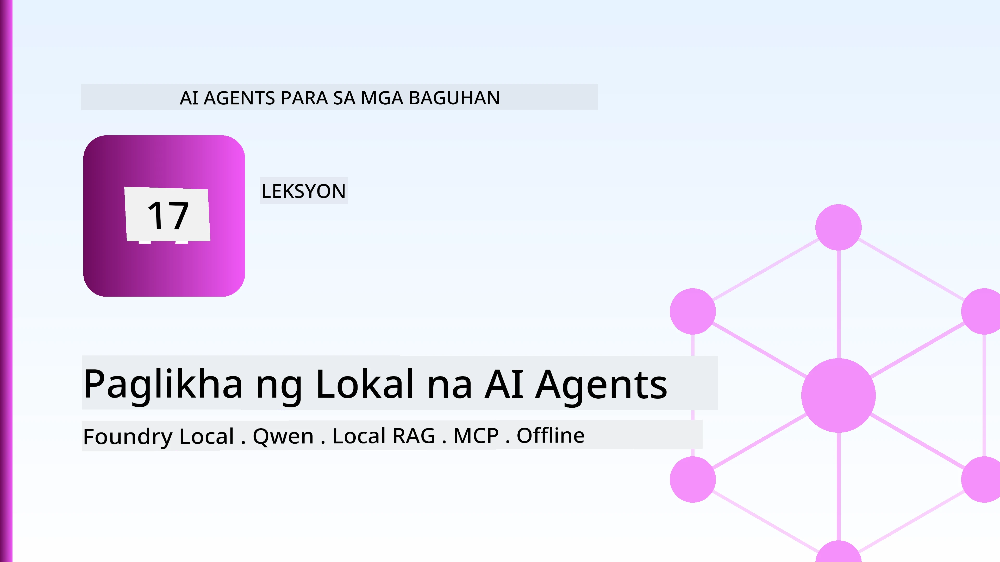
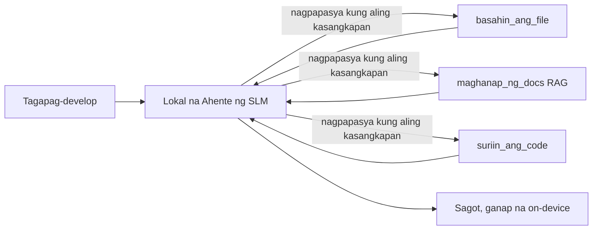
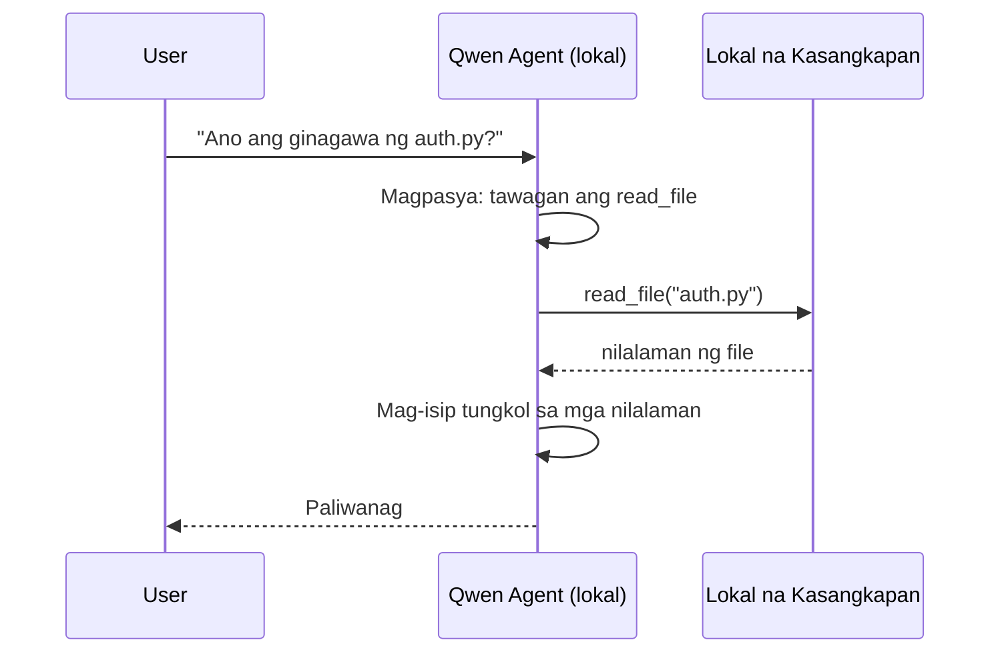
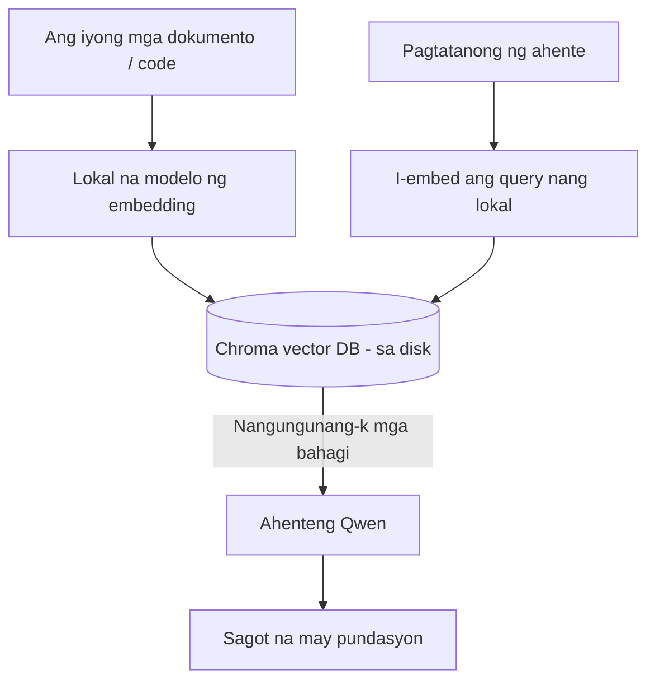
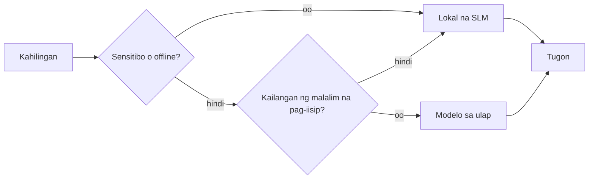

# Paglikha ng Lokal na AI Agents Gamit ang Microsoft Foundry Local at Qwen



Ang naunang aralin ay nagskala ng mga agent *pataas* sa cloud. Ang araling ito ay nagdadala sa kanila *ibaba* sa isang solong makina. Sa katapusan, magkakaroon ka ng gumaganang engineering assistant na nagrarason, tumatawag ng mga tool, nagbabasa ng iyong mga file, at naghahanap sa iyong dokumentasyon — **nang walang kahit isang tawag sa cloud inference.**

Bakit mo gusto iyon? Tatlong dahilan na madalas lumabas sa totoong gawaing engineering:

- **Privacy.** Hindi kailanman umaalis sa makina ang code at mga dokumento. Walang prompt, walang snippet, walang data ng customer na tumatawid sa hangganan ng network.
- **Gastos.** Walang bayad kada-token para sa lokal na inference. Maaari kang mag-iterate buong araw sa presyo ng kuryente lang.
- **Offline.** Sa eroplano, sa isang secure na pasilidad, o sa panahon ng outage, gumagana pa rin ang agent.

Ang kapalit ay nagpapalitan ka ng isang frontier cloud model para sa isang **Small Language Model (SLM)** na tumatakbo sa iyong CPU, GPU, o NPU. Ang araling ito ay tungkol sa paggawa ng mga agent na *magaling* sa ilalim ng limitasyong iyon sa halip na magpanggap na wala ang limitasyon.

## Panimula

Saklaw ng araling ito:

- **Small Language Models (SLMs)** — kung ano ang mga ito, saan sila mahusay, at saan hindi.
- **Microsoft Foundry Local** — isang runtime na nagda-download at nagseserbisyo ng mga modelo sa device sa pamamagitan ng isang **OpenAI-compatible API**.
- **Qwen function-calling models** — mga SLM na maaasahang gumagawa ng mga tawag sa tool, na siyang nagpapagana sa mga lokal na *agent* (hindi lamang lokal na chat).
- **Mga lokal na tool, lokal na RAG, at lokal na MCP** — nagbibigay-kakayahan sa agent nang walang cloud.
- **Hybrid patterns** — kung kailan panatilihin ang mga bagay sa lokal at kailan kukuha sa cloud.

## Mga Layunin sa Pagkatuto

Pagkatapos makumpleto ang araling ito, malalaman mo kung paano:

- Ipaliwanag ang mga trade-off ng SLMs at pumili ng angkop na gamit para sa lokal na agent.
- Magserbisyo ng isang Qwen model nang lokal gamit ang Foundry Local at kumonekta dito sa pamamagitan ng OpenAI-compatible endpoint.
- Bumuo ng isang tool-calling agent na tumatakbo nang buo sa iyong workstation.
- Magdagdag ng lokal na RAG sa iyong sariling mga dokumento gamit ang lokal na vector database (Chroma).
- Ikonekta ang agent sa isang lokal na MCP server at mag-ramdam ng mga hybrid na disenyo ng local/cloud.

## Mga Paunang Kaalaman

Ipinapalagay ng araling ito na nakumpleto mo na ang mga naunang aralin at kumportable ka sa:

- [Paggamit ng Tool](../04-tool-use/README.md) (Aralin 4) at [Agentic RAG](../05-agentic-rag/README.md) (Aralin 5).
- [Agentic Protocols / MCP](../11-agentic-protocols/README.md) (Aralin 11).
- Ang [Microsoft Agent Framework](../14-microsoft-agent-framework/README.md) (Aralin 14).

Kailangan mo rin:

- Isang developer workstation. **8 GB RAM ang makatotohanang minimum**; 16 GB+ ay komportable. Nakakatulong ang GPU o NPU pero hindi ito kailangan.
- **Microsoft Foundry Local** na naka-install (tingnan ang seksyon ng setup sa ibaba).
- Python 3.12+ at ang mga pakete sa repository [`requirements.txt`](../../../requirements.txt), kasama ang `foundry-local-sdk`, `openai`, at `chromadb` para sa araling ito.

## Small Language Models: Ang Tamang Tool para sa Lokal na Trabaho

Ang isang frontier cloud model ay may daan-daang bilyong parametro at may data centre sa likod nito. Ang SLM ay may ilang bilyong parametro at kailangang magkasya sa RAM ng iyong laptop. Ang pagkakaibang iyon ay nagtatakda ng malinaw na mga inaasahan.

**Ang mga SLM ay magaling sa:**

- Mga struktura, limitado na gawain — klasipikasyon, pagkuha, pagbubuod ng isang kilalang dokumento.
- **Pagtawag sa tool** — pagpapasya kung alin na function ang tatawagin at anong mga argumento ang gagamitin.
- Mabilis, mura, pribadong pag-ikot sa iyong sariling data.

**Mga kahinaan ng SLMs:**

- Bukas na-ended, multi-hop na pagrarason sa malawak na konteksto.
- Malawak na kaalaman sa mundo (mas kakaunti ang nakita, at mas madali makalimutan).

Ang panalong estratehiya para sa mga lokal na agent ay: **hayaan ang SLM na mag-orchestrate, at hayaan ang mga tool na gawin ang mabibigat na gawain.** Hindi kailangang *malaman* ng modelo ang iyong codebase — kailangan nitong malaman kung kailan tatawagin ang `read_file` at `search_docs`. Direktang tumutugma ito sa lakas ng SLM.



## Microsoft Foundry Local

**Ang Microsoft Foundry Local** ay isang magaan na runtime na nagda-download, namamahala, at nagseserbisyo ng mga modelo nang buo sa iyong makina. Ang pinakamahalagang tampok para sa atin ay naipapakita nito ang isang **OpenAI-compatible HTTP endpoint** — ibig sabihin ay gumagana ang OpenAI SDK at ang Microsoft Agent Framework's OpenAI client dito sa pamamagitan lamang ng pagpapalit ng `base_url`. Lahat ng natutunan mo tungkol sa paggawa ng mga agent ay direktang mailipat; ang endpoint lang ang lumilipat mula cloud patungong `localhost`.

Pinipili rin ng Foundry Local ang pinakamahusay na build ng modelo para sa iyong hardware nang awtomatiko — CPU build, CUDA/GPU build, o NPU build — kaya hindi mo kailangang i-optimize ng mano-mano bawat makina.

### Setup

I-install ang Foundry Local (tingnan ang [dokumentasyon](https://learn.microsoft.com/azure/ai-foundry/foundry-local/) para sa iyong OS), pagkatapos kumpirmahin na gumagana ito:

```bash
# Mag-install (halimbawa; sundin ang mga dokumento para sa iyong plataporma)
winget install Microsoft.FoundryLocal      # Windows
# brew install microsoft/foundrylocal/foundrylocal   # macOS

# I-download at patakbuhin ang isang Qwen na modelo, pagkatapos simulan ang lokal na serbisyo
foundry model run qwen2.5-7b-instruct
foundry service status
```

Kapag tumatakbo na ang serbisyo mayroon kang lokal na OpenAI-compatible endpoint (karaniwang nasa `http://localhost:PORT/v1`). Ginagamit ng notebook ang `foundry-local-sdk` para awtomatikong matagpuan ang endpoint, kaya hindi mo na kailangang hard-code ang port.

## Qwen Function Calling: Bakit Ito Mahalaga

Ang isang agent ay agent lang kung kaya nitong tumawag ng mga tool. Marami sa mga SLM ay kaya makipag-chat ngunit gumagawa ng mga hindi maaasahan, maling porma ng tawag sa tool. **Ang Qwen** models ay sinanay para sa function calling at palaging nagbibigay ng maayos na porma ng tool-call na istruktura — na siyang nagpapabago ng isang lokal na chat model sa isang lokal na *agent*.

Ang proseso ay ang karaniwang tool-calling loop na alam mo na, ngunit tumatakbo sa device:



## Lokal na RAG

Ang paghahanap ng dokumentasyon ang dahilan kung bakit mahalaga ang mga lokal na agent. Sa halip na umaasa sa SLM na maalala ang dokumentasyon ng iyong framework, ini-embed mo ang mga dokumentong iyon sa isang **lokal na vector database** at hinahayaan ang agent na kunin ang mga kaugnay na bahagi ayon sa pangangailangan.

Ginagamit natin ang **Chroma**, isang embedded na vector store na tumatakbo sa proseso nang walang server na kailangang pamahalaan. Ang pipeline ay ganap na lokal: lokal na embedding model → lokal na vectors → lokal na retrieval → lokal na SLM.



Ito ay kapareho ng Agentic RAG na pattern mula sa Aralin 5 — ang nag-iisang pagbabago ay lahat ng bahagi ay tumatakbo sa iyong makina.

## Lokal na MCP Servers

Ang [MCP](../11-agentic-protocols/README.md) ay isang transport, hindi isang cloud service. Ang MCP server ay maaaring tumakbo bilang isang lokal na proseso sa `stdio`, na nag-eexpose ng mga tool sa iyong agent sa pamamagitan ng standard protocol. Pinapayagan ka nitong magamit muli ang lumalawak na ekosistema ng MCP servers — access sa filesystem, operasyon sa git, mga query sa database — na ganap na offline.

Iba ang seguridad kaysa sa cloud, pero hindi ito wala: ang lokal na MCP server ay tumatakbo pa rin gamit ang permiso ng iyong user, kaya tukuyin kung ano lang ang maaaring ma-access nito (isang direktoryo ng proyekto lang, hindi ang buong home folder mo) at tratuhin ang mga output nito bilang mga input upang beripikahin.

## Hybrid na Mga Pattern sa Cloud at Lokal

Ang local-first ay hindi nangangahulugang local-only. Ang mga mature na sistema ay nagruruta ayon sa sensitibo at kahirapan:

| Sitwasyon | Saan ito tumatakbo |
| --- | --- |
| Sensitibong code / data, o offline | **Lokal na SLM** |
| Simpleng, limitadong gawain | **Lokal na SLM** (mura, mabilis) |
| Mahirap na multi-hop na pagrarason sa hindi sensitibong data | **Cloud model** |
| Lahat, sa panahon ng outage | **Lokal na SLM** (maayos na pagbaba ng kalidad) |

Tinatapatan nito ang ideya ng **model routing** mula sa Aralin 16 — maliban ang isang "modelo" ay ang sarili mong makina na ngayon. Ang matibay na disenyo ay bumabalik sa lokal kapag hindi available ang cloud, kaya ang agent ay bumababa lang ang kalidad sa halip na tuluyang mabigo.



## Hands-On Lab: Isang Lokal na Engineering Assistant

Buksan ang [`code_samples/17-local-agent-foundry-local.ipynb`](./code_samples/17-local-agent-foundry-local.ipynb) at sundan ito. Bubuuin mo ang isang **lokal na engineering assistant** na tumatakbo nang buo sa iyong workstation at kayang:

1. **Tumawag ng mga tool** — sa pamamagitan ng Qwen function calling gamit ang Foundry Local.
2. **Gumawa ng lokal na file operations** — maglista at magbasa ng mga file sa direktoryo ng proyekto.
3. **Mag-analisa ng code** — mag-ulat ng mga pangunahing metric sa isang source file.
4. **Maghanap ng dokumentasyon** — lokal na RAG sa isang folder ng docs gamit ang Chroma.
5. **Gumamit ng MCP** — kumonekta sa isang lokal na MCP server (na may maayos na pag-skip kung wala).

Walang cloud inference na ginamit kahit saan.

### Paglalakad sa Proseso

Kumokonekta ang assistant sa Foundry Local sa pamamagitan ng OpenAI-compatible endpoint, kaya halos pareho lang ang code sa cloud lessons — ang client lang ang nagbabago:

```python
from foundry_local import FoundryLocalManager
from openai import OpenAI

# Natutuklasan/nida-download ng Foundry Local ang modelo at nagbibigay sa atin ng lokal na endpoint.
manager = FoundryLocalManager(\"qwen2.5-7b-instruct\")
client = OpenAI(base_url=manager.endpoint, api_key=manager.api_key)  # ang api_key ay isang lokal na pansamantalang placeholder
```

Ang mga tool ay ordinaryong mga Python function na naka-scope sa isang direktoryo ng proyekto:

```python
def read_file(path: str) -> str:
    \"\"\"Read a file, but only inside the sandboxed project directory.\"\"\"
    full = (PROJECT_ROOT / path).resolve()
    if PROJECT_ROOT not in full.parents and full != PROJECT_ROOT:
        return \"Access denied: path is outside the project directory.\"
    return full.read_text(encoding=\"utf-8\")
```

Pansinin ang sandbox check — kahit na lokal, isang liability ang tool na nagbabasa ng arbitrary path. Pinananatili ng notebook ang bawat tool na nakapaloob lamang sa isang project root.

## Pag-check ng Kaalaman

Subukan ang iyong pagkaunawa bago lumipat sa takdang-aralin.

**1. Magbigay ng dalawang kongkretong dahilan upang patakbuhin ang isang agent nang lokal kaysa sa cloud.**

<details>
<summary>Sagot</summary>

Anumang dalawa sa: **privacy** (hindi umaalis ng makina ang code at data), **gastos** (walang bayad kada-token sa inference), at **offline capability** (gumagana kahit walang network — sa eroplano, sa secure na pasilidad, o sa panahon ng outage). Ang mga regulasyon o pagsunod na nagbabawal magpadala ng data palabas ng device ay karaniwang dahilan ng privacy.
</details>

**2. Ano ang inirerekomendang paghati ng gawain sa pagitan ng SLM at mga tool nito sa isang lokal na agent, at bakit?**

<details>
<summary>Sagot</summary>

Hayaan ang SLM na **mag-orchestrate** (magdesisyon kung anong tool ang tatawagin at anong mga argumento ang gagamitin) at hayaan ang **mga tool na gawin ang mabibigat na gawain** (magbasa ng files, kumuha ng docs, magcompute ng resulta). Matalino ang SLM sa mga limitadong desisyon tulad ng pagpili ng tool pero mahina sa malawak na kaalaman at mahabang multi-hop na pag-rarason, kaya dapat umasa sa mga tool para sa kanilang lakas.
</details>

**3. Ano ang dahilan kung bakit posible muling gamitin ang cloud agent code sa Foundry Local?**

<details>
<summary>Sagot</summary>

Nagbibigay ang Foundry Local ng isang **OpenAI-compatible HTTP endpoint**. Gumagana ang OpenAI SDK at ang Agent Framework's OpenAI client dito sa pamamagitan lamang ng pagpapalit ng `base_url` (at gumagamit ng lokal na placeholder API key). Pareho ang iba pang bahagi ng code.
</details>

**4. Bakit partikular na gumagamit tayo ng Qwen function-calling model sa halip na anumang SLM?**

<details>
<summary>Sagot</summary>

Dahil dapat makagawa ang agent ng mapagkakatiwalaan at maayos na porma ng **tool calls**. Maraming SLM ang kaya makipag-chat ngunit gumagawa ng maling porma o inconsistent na mga tool-call structure. Ang Qwen models ay sinanay para sa function calling at palagiang nagbibigay ng consistent tool calls, kaya nagiging gumaganang lokal na agent ang isang lokal na chat model.
</details>

**5. Sa lokal na RAG na pipeline, aling mga bahagi ang tumatakbo sa makina?**

<details>
<summary>Sagot</summary>

Lahat: ang embedding model, ang vector database (Chroma, sa disk), ang retrieval step, at ang SLM. Ang mga dokumento ay ini-embed, iniimbak, kinukuha, at pinaparaan ng isang lokal na modelo — walang bahagi ang kumokonekta sa cloud.
</details>

**6. Isang lokal na MCP server ang tumatakbo sa iyong makina. Ginagawa ba nitong awtomatikong ligtas ito? Anong pag-iingat ang dapat mo pa ring gawin?**

<details>
<summary>Sagot</summary>

Hindi. Tumakbo ang lokal na MCP server gamit ang permiso ng iyong user, kaya may akses ito sa kahit ano na kaya mo. Tukuyin ang sakop nito (halimbawa, isang direktoryo lang ng proyekto kaysa sa buong home folder) at ituring ang mga output nito bilang input na dapat beripikahin bago gawin ang mga aksyon.
</details>

**7. Ilarawan ang isang makatuwirang hybrid na patakaran sa pag-ruruta na kasama ang isang lokal na modelo.**

<details>
<summary>Sagot</summary>

I-ruruta ang mga sensitibo o offline na kahilingan sa lokal na SLM; i-ruruta ang simpleng limitadong gawain sa lokal na SLM para sa bilis at gastos; i-ruruta ang mahirap na multi-hop na pagrarason sa hindi sensitibong data sa isang cloud model; at bumalik sa lokal na SLM kapag hindi available ang cloud para maayos na bumaba ang kalidad kaysa tuluyang mabigo. Ito ang model routing (Aralin 16) na ang lokal na makina ay isa sa mga modelo.
</details>

**8. Ano ang makatotohanang minimum na RAM para tumakbo ang lokal na agent sa araling ito, at ano ang benepisyo ng mas maraming RAM?**

<details>
<summary>Sagot</summary>

Mga **8 GB** ang makatotohanang minimum; 16 GB+ ay komportable. Mas maraming RAM ang nagpapahintulot sa iyo na magpatakbo ng mas malaki, mas kayang mga modelo at mapanatili ang mas maraming konteksto sa memorya. Pinapabilis ng GPU o NPU ang inference pero hindi kailangan — pinipili ng Foundry Local ang CPU build kapag walang accelerator.
</details>

## Takdang-Aralin

Palawakin ang lokal na engineering assistant sa isang **lokal na tagasuri ng dokumentasyon** para sa isang maliit na proyekto na iyong pipiliin (maaari kang gumamit ng isa sa mga lesson folder ng repo na ito kung gusto mo).

Ang iyong isusumite ay dapat:

1. **I-index ang isang tunay na docs/code folder** sa Chroma (hindi bababa sa limang file).
2. **Magdagdag ng isang `find_todos` tool** na nagsusuri sa proyekto para sa mga `TODO`/`FIXME` na mga comment at ibinalik ang mga ito kasama ang pangalan ng file at numero ng linya — panatilihin ang parehong sandbox check tulad ng sa `read_file`.

3. **Magtanong sa agent ng tatlong katanungan** na pipilitin itong pagsamahin ang mga kasangkapan: isang purong katanungan na RAG, isa na nangangailangan magbasa ng isang partikular na file, at isa na nangangailangan maghanap ng TODOs.
4. **Sukatin ito**: sukatin ang oras ng bawat isa sa tatlong sagot at itala ito sa isang markdown cell. Magkomento kung ang latency ay katanggap-tanggap para sa iyong nilalayong workflow.

Pagkatapos ay sumulat ng maikling talata tungkol sa **kung ano ang ililipat mo sa cloud at ano ang pananatili mong local** para sa reviewer na ito, at bakit. Susukatin ka base sa kung ang mga lokal na bahagi ay maayos na naka-wire kasama at kung ang iyong hybrid na pangangatwiran ay tama — hindi sa kalidad ng modelo.

## Buod

Sa leksyong ito, gumawa ka ng isang agent na tumatakbo nang buo sa iyong sariling makina:

- **SLMs** nagpapalitan ng lawak para sa privacy, gastos, at pag-operate offline — at namumukod-tangi kapag sila ay **naga-orchestrate ng mga kasangkapan** sa halip na dalhin ang lahat ng kaalaman para sa kanilang sarili.
- **Foundry Local** ay nagsisilbi ng mga modelo sa device sa likod ng isang **OpenAI-compatible endpoint**, kaya ang iyong cloud agent code ay naipapasa gamit ang isang linya ng pagbabago.
- **Qwen function-calling models** ay gumagawa ng maaasahang lokal na pagtawag ng kasangkapan — at samakatuwid lokal na *agents* — posible.
- **Local RAG** (Chroma) at **local MCP** ay nagbibigay kakayahan sa agent nang hindi umaalis ang makina.
- **Hybrid patterns** ay nagpapahintulot sa iyo na mag-route ayon sa sensitivity at hirap, na may lokal bilang isang magalang na fallback.

Tinatapos nito ang deployment arc: Ang Leksiyon 16 ay nag-scale ng mga agent papunta sa Microsoft Foundry, at ang leksyong ito ay nag-scale pababa sa isang workstation lamang. Ang susunod na leksyon ay tututok sa pagpapanatiling ligtas ng mga na-deploy na agent.

## Karagdagang Mga Sanggunian

- <a href="https://learn.microsoft.com/azure/ai-foundry/foundry-local/" target="_blank">Microsoft Foundry Local documentation</a>
- <a href="https://learn.microsoft.com/azure/ai-foundry/what-is-azure-ai-foundry" target="_blank">Microsoft Foundry documentation</a>
- <a href="https://learn.microsoft.com/en-us/agent-framework/overview/?wt.mc_id=youtube_26688_organicsocial_reactor&pivots=programming-language-python" target="_blank">Microsoft Agent Framework</a>
- <a href="https://qwen.readthedocs.io/en/latest/framework/function_call.html" target="_blank">Qwen function calling documentation</a>
- <a href="https://modelcontextprotocol.io/" target="_blank">Model Context Protocol (MCP)</a>
- <a href="https://docs.trychroma.com/" target="_blank">Chroma vector database</a>

## Nakaraang Leksiyon

[Deploying Scalable Agents](../16-deploying-scalable-agents/README.md)

## Susunod na Leksiyon

[Securing AI Agents](../18-securing-ai-agents/README.md)

---

<!-- CO-OP TRANSLATOR DISCLAIMER START -->
**Pagtatanggi**:
Ang dokumentong ito ay isinalin gamit ang serbisyo ng AI translation na [Co-op Translator](https://github.com/Azure/co-op-translator). Bagama't nagsusumikap kami para sa katumpakan, pakatandaan na ang awtomatikong pagsasalin ay maaaring maglaman ng mga pagkakamali o hindi pagkakatugma. Ang orihinal na dokumento sa orihinal nitong wika ang dapat ituring na pangunahing sanggunian. Para sa mahahalagang impormasyon, inirerekomenda ang propesyonal na pagsasalin ng tao. Hindi kami mananagot sa anumang maling pagkakaintindi o maling interpretasyon na nagmula sa paggamit ng pagsasaling ito.
<!-- CO-OP TRANSLATOR DISCLAIMER END -->