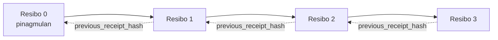

[Panoorin ang video ng leksyon: Pag-secure sa mga AI Agent gamit ang Cryptographic Receipts](https://youtu.be/PLACEHOLDER_VIDEO_ID)

> _(Ang video ng leksyon at thumbnail ay idaragdag ng Microsoft content team pagkatapos ng pagsasanib, na tumutugma sa pattern ng leksyon 14 / 15.)_

# Pag-secure sa mga AI Agent gamit ang Cryptographic Receipts

## Panimula

Saklaw ng leksyong ito:

- Bakit mahalaga ang audit trails para sa mga AI agent sa pagsunod, pag-debug, at pagtitiwala.
- Ano ang isang cryptographic receipt at paano ito naiiba sa isang unsigned log line.
- Paano gumawa ng isang signed receipt para sa tawag ng tool ng isang agent gamit ang plain Python.
- Paano i-verify ang isang receipt offline at matuklasan ang pamemeke.
- Paano i-chain ang mga receipt upang ang pagtanggal o pagbabago ng isa ay masira ang chain.
- Ano ang pinatutunayan ng mga receipt at ano ang hindi nila pinatutunayan.

## Mga Layunin ng Pagkatuto

Pagkatapos makumpleto ang leksyong ito, malalaman mo kung paano:

- Tukuyin ang mga failure modes na nagpapakilos sa cryptographic provenance para sa mga aksyon ng agent.
- Gumawa ng Ed25519-signed receipt sa isang canonical JSON payload.
- I-verify ang isang receipt nang independiyente gamit lamang ang pampublikong susi ng nag-sign.
- Matuklasan ang pamemeke sa pamamagitan ng muling pagpapatakbo ng verification sa isang binagong receipt.
- Bumuo ng isang hash-chained na sunud-sunod na mga receipt at ipaliwanag kung bakit mahalaga ang chain.
- Kilalanin ang hangganan sa pagitan ng pinatutunayan ng mga receipt (atribusyon, integridad, pagkakasunod-sunod) at kung ano ang hindi nila pinatutunayan (katumpakan ng aksyon, ningas ng polisiya).

## Ang Problema: Audit Trail ng Iyong Agent

Isipin mong mayroon kang isang AI agent para sa Contoso Travel. Binabasa ng agent ang mga kahilingan ng customer, tumatawag ng flights API para maghanap ng mga opsyon, at nagbu-book ng mga upuan para sa customer. Noong nakaraang quarter, ang agent ay nagproseso ng 50,000 booking.

Ngayon, dumating ang isang auditor. Nagtanong siya ng simpleng tanong: "Ipakita mo sa akin ang ginawa ng iyong agent."

Ibinigay mo ang iyong mga log file. Tiningnan ng auditor ang mga iyon at nagtanong ng mas mahirap: "Paano ko malalaman na hindi inedit ang mga log na ito?"

Ito ang problema ng audit trail. Karamihan sa mga deployment ng agent ngayon ay umaasa sa:

- **Mga application log**: isinusulat ng agent mismo, maaaring i-edit ng sinumang may access sa file system.
- **Cloud logging services**: tamper-evident sa platform level pero kailangan ng tiwala ng auditor sa operator ng platform.
- **Database transaction logs**: angkop para sa mga pagbabago sa database pero hindi para sa mga arbitrary na tawag ng tool.

Walang alinman ang makakasagot sa tanong ng auditor nang hindi kinakailangang pagkatiwalaan niya ang isang tao (ikaw, ang iyong cloud provider, o ang iyong database vendor). Para sa internal na gamit, madalas ay katanggap-tanggap ang tiwalang iyon. Para sa mga regulated na trabaho (pananalapi, pangangalagang pangkalusugan, kahit ano na saklaw ng EU AI Act), hindi ito tinatanggap.

Nilulutas ng cryptographic receipts ito sa pamamagitan ng paggawa ng bawat aksyon ng agent na independently verifiable. Hindi na kailangang pagkatiwalaan ng auditor ang iyo. Kailangan niya lamang ang iyong pampublikong susi at ang mismong receipt.

## Ano ang Cryptographic Receipt?

Ang receipt ay isang JSON object na nagtatala ng ginawa ng isang agent, na nilagdaan gamit ang digital signature.


Ang isang minimal na receipt ay ganito:

```json
{
  "type": "agent.tool_call.v1",
  "agent_id": "contoso-travel-bot",
  "tool_name": "lookup_flights",
  "tool_args_hash": "sha256:a3f9c1...",
  "result_hash": "sha256:7b2e1d...",
  "policy_id": "contoso-travel-policy-v3",
  "timestamp": "2026-04-25T14:30:00Z",
  "sequence": 47,
  "previous_receipt_hash": "sha256:9d4e6a...",
  "signature": {
    "alg": "EdDSA",
    "sig": "c5af83...",
    "public_key": "8f3b2c..."
  }
}
```

Tatlong properties ang gumagawa ng trabaho:

1. **Ang signature**. Nilalagdaan ang receipt ng gateway ng agent gamit ang isang Ed25519 private key. Sinuman na may katugmang public key ay maaaring i-verify ang signature offline. Ang pamemeke sa anumang field ay nagpapawalang bisa ng signature.

2. **Canonical encoding**. Bago lagdaan, isinasagawa ang serializing ng receipt gamit ang JSON Canonicalization Scheme (JCS, RFC 8785). Tinitiyak nito na ang dalawang implementasyon na gumagawa ng kaparehong lohikal na receipt ay magkakaroon ng byte-identical na output. Kung walang canonicalization, iba't ibang JSON serializer ang gagawa ng magkakaibang signature para sa iisang nilalaman.

3. **Hash chaining**. Ang field na `previous_receipt_hash` ay nag-uugnay ng bawat receipt sa naunang receipt. Ang pagtanggal o pagbabago ng isang receipt ay nagwawasak ng bawat receipt na sumusunod dito. Nagiging visible ang pamemeke sa antas ng chain kahit na lampas sa individual na mga signature.

Sama-sama, nagbibigay ang mga properties na ito ng tatlong garantiya:

- **Atribusyon**: pinirmahan ng susi ang nilalamang ito.
- **Integridad**: hindi nabago ang nilalaman mula nang pirmahan.
- **Pagkakasunod-sunod**: ang resitong ito ay sumunod sa isang receipt sa chain.

## Paggawa ng Receipt sa Python

Hindi mo kailangan ng espesyal na library para gumawa ng receipt. Malawak ang availability ng cryptographic primitives at ilan lang na linya ng Python ang logic.

Ang hands-on exercises sa `code_samples/18-signed-receipts.ipynb` ay naglalakad sa buong proseso. Ang pinaikling bersyon:

```python
import json
import hashlib
import base64
from nacl import signing
from jcs import canonicalize  # RFC 8785 canonical JSON

def b64url_nopad(data: bytes) -> str:
    return base64.urlsafe_b64encode(data).decode("ascii").rstrip("=")

def sha256_canonical(obj) -> str:
    """SHA-256 of a Python object's JCS-canonical JSON form."""
    return f"sha256:{hashlib.sha256(canonicalize(obj)).hexdigest()}"

# Bumuo o mag-load ng signing key (sa produksyon, itago sa key vault)
signing_key = signing.SigningKey.generate()
verify_key = signing_key.verify_key

# Ibuo ang payload ng resibo (walang lagda muna)
tool_args = {"origin": "SYD", "destination": "LAX"}
tool_result = [{"flight": "QF11", "price": 1850, "stops": 0}]

payload = {
    "type": "agent.tool_call.v1",
    "agent_id": "contoso-travel-bot",
    "tool_name": "lookup_flights",
    "tool_args_hash": sha256_canonical(tool_args),
    "result_hash": sha256_canonical(tool_result),
    "policy_id": "contoso-travel-policy-v3",
    "timestamp": "2026-04-25T14:30:00Z",
    "sequence": 0,
    "previous_receipt_hash": None,
}

# Gawing canonical, i-hash, lagdaan.
canonical_bytes = canonicalize(payload)
message_hash = hashlib.sha256(canonical_bytes).digest()
signature_bytes = signing_key.sign(message_hash).signature

# Ilakip ang nakaayos na signature object.
receipt = {
    **payload,
    "signature": {
        "alg": "EdDSA",
        "sig": b64url_nopad(signature_bytes),
        "public_key": b64url_nopad(bytes(verify_key)),
    },
}
```

Iyan ang buong signing pipeline. Ang mga pagsasanay sa notebook ay sunud-sunod na nagpapakita ng bawat hakbang.

## Pag-verify ng Receipt at Pagtuklas ng Pamemeke

Ang verification ay ang kabaligtaran na operasyon:

```python
import base64
import hashlib
from nacl import signing
from nacl.exceptions import BadSignatureError
from jcs import canonicalize

def b64url_decode(s: str) -> bytes:
    padding = "=" * ((4 - len(s) % 4) % 4)
    return base64.urlsafe_b64decode(s + padding)

def verify_receipt(receipt: dict) -> bool:
    # Ang pirma ay isang istrukturadong bagay: {"alg", "sig", "public_key"}.
    sig_obj = receipt.get("signature")
    if not sig_obj or sig_obj.get("alg") != "EdDSA":
        return False

    # I-rekonstrukt ang payload na talaga namang pinirmahan (lahat maliban sa pirma).
    payload = {k: v for k, v in receipt.items() if k != "signature"}

    canonical_bytes = canonicalize(payload)
    message_hash = hashlib.sha256(canonical_bytes).digest()

    try:
        verify_key = signing.VerifyKey(b64url_decode(sig_obj["public_key"]))
        verify_key.verify(message_hash, b64url_decode(sig_obj["sig"]))
        return True
    except BadSignatureError:
        return False
```

Tumatanggap ang function na ito ng isang receipt at nagbabalik ng `True` kung valid ang signature, `False` kung hindi. Walang network call, walang dependency sa serbisyo, walang kailangang tiwala sa anumang third party.

Para makita ang pagtuklas ng pamemeke sa aksyon, ipinapakita ng notebook ang:

1. Paglikha ng valid na receipt at pagkumpirma na ma-verify ito.
2. Pagbabago ng isang byte sa field na `tool_args_hash`.
3. Muling pagpapatakbo ng verification at pagtingin na nabigo ito.

Ito ang praktikal na demonstrasyon na ang mga receipt ay tamper-evident: anumang pag-modify, gaano man kaliit, ay sumisira sa signature.

## Pagkakabit-kabit ng Mga Receipt para sa Mga Multi-Step na Agent

Isang solong signed receipt ang pumoprotekta sa isang aksyon. Isang chain ng mga receipt ang pumoprotekta sa isang sunod-sunod.



Nagtatala ang bawat receipt ng hash ng naunang receipt. Para tanggalin nang palihim ang receipt 2, kailangang:

- Baguhin ang `previous_receipt_hash` ng receipt 3 (lalabag sa signature ng receipt 3), O
- Gumawa ng bagong signature sa binagong receipt 3 (kailangan ang private key ng agent).

Kung ang private key ay nasa hardware key vault at nailathala mo ang public key kasama ng bawat receipt, walang alinman sa mga pag-atakeng iyon ang posibleng gawin nang hindi nadedetect.

Pinapakita ng notebook ang:

1. Pagbuo ng chain ng tatlong receipt.
2. Pagve-verify na tumutugma ang `previous_receipt_hash` ng bawat receipt sa tunay na hash ng naunang receipt.
3. Pagmeme-mani sa isang receipt sa gitna ng chain at pagtingin na nabasag ang chain sa eksaktong puntong iyon.

Ganito ka gumagawa ng audit trail na maaaring i-verify ng panlabas na auditor nang hindi pinagkakatiwalaan ka.

## Ano ang Pinatutunayan ng Mga Receipt (at Ano ang Hindi)

Ito ang pinakamahalagang seksyon ng leksyong ito. Malakas ang mga receipt ngunit may hangganan ang kanilang kapangyarihan.

**Tatlong bagay ang pinatutunayan ng mga receipt:**

1. **Atribusyon**: isang partikular na susi ang pumirma sa isang partikular na payload.
2. **Integridad**: hindi nagbago ang payload mula nang pirmahan.
3. **Pagkakasunod-sunod**: ang resitong ito ay sumunod sa isa pang receipt sa hash chain.

**Hindi pinatutunayan ng mga receipt:**

1. **Katumpakan**: na ang aksyon ng agent ay ang tamang aksyon. Maaaring pirmahan ang isang receipt para sa maling sagot nang kasing-linis ng para sa tamang sagot.
2. **Pagsunod sa polisiya**: na ang polisiya na tinukoy sa `policy_id` ay talagang na-evaluate, o na papayagan sana ang aksyon kung sinuri. Itinatala ng receipt ang inangkin, hindi ang ipinapatupad.
3. **Pagkakakilanlan bukod sa susi**: sinasabi ng receipt na "nilagdaan ng susi na ito ang nilalamang ito." Hindi nito sinasabi na "ininutos ito ng taong ito." Ang pag-uugnay ng susi sa tao o organisasyon ay nangangailangan ng hiwalay na identity infrastructure (directory, public key registry, atbp.).
4. **Katotohanan ng mga input**: kung makatanggap ang agent ng manipuladong prompt at kikilos base rito, tapat na itinatala ng receipt ang aksyon. Ang mga receipt ay nasa downstream ng input validation, hindi kapalit nito.

Mahalaga ang hangganang ito dahil:

- Ito ang nagsasabi kung para saan kapaki-pakinabang ang mga receipt: ginagawa nitong audit na ma-track at hindi madaling manipulahin ang kilos ng agent, kahit pa sa pagitan ng mga organisasyon.
- Ito ang nagsasabi kung anong dagdag na layer ang kailangan mo pa: input validation (Leksiyon 6), pagpapatupad ng polisiya (maikling tinalakay sa ibaba), at identity infrastructure (hindi saklaw ng leksyong ito).

Karaniwang pagkakamali ang isipin na "may receipts tayo" ay nangangahulugang "napapamahalaan na tayo." Hindi iyan totoo. Ang mga receipt ay pundasyon. Ang pamamahala ay ang sistemang itinatayo mo sa ibabaw nito.

## Mga Sanggunian para sa Produksyon

Ang Python code sa leksyong ito ay sinadyang minimal para mabasa mo ang bawat linya at maintindihan nang eksakto ang nangyayari. Sa produksyon, may dalawang opsyon ka:

1. **Direktang gumamit ng cryptographic primitives.** Ang 50 linya na ipinakita sa itaas ay sapat na para sa maraming gamit. Ang PyNaCl (Ed25519) at ang package na `jcs` (canonical JSON) ay mahusay na pinapanatili at inaudit na mga library.

2. **Gumamit ng production receipt library.** May ilang open-source proyekto na nagpapatupad ng parehong pattern na may dagdag na features (key rotation, batch verification, JWK Set distribution, integration sa mga policy engine):
   - Ang format ng receipt na ginamit sa leksyong ito ay sumusunod sa IETF Internet-Draft (`draft-farley-acta-signed-receipts`) na kasalukuyang nasa proseso ng pagiging standard.
   - Ang Microsoft Agent Governance Toolkit ay nagsasama ng receipts sa Cedar-based na mga desisyon ng polisiya; tingnan ang Tutorial 33 sa repositong iyon para sa end-to-end na halimbawa.
   - Ang mga package na `protect-mcp` (npm) at `@veritasacta/verify` (npm) ay nagbibigay ng Node-based na implementasyon ng pag-sign ng receipt at offline na verification, na nilayon para balutan ang anumang MCP server na may tamper-evident audit trail.

Ang pagpili sa pagitan ng paggawa ng sarili mo at paggamit ng isang library ay katulad ng pagpili sa pagitan ng pagsulat ng JWT library mo o paggamit ng subok na library: parehong makatwiran; nakakatipid ang library ng oras at nagpapababa ng audit surface; pinipilitan kang maunawaan nang bawat primitive kapag ikaw ang gumawa. Tinuruan ka ng leksyong ito sa pagpipiliang gumawa mula sa simula upang magkaroon ka ng pundasyon para sa kahit anong pagpili.

## Pagsusulit sa Kaalaman

Subukan ang iyong pag-unawa bago pumunta sa practice exercise.

**1. Nilalagdaan ang isang receipt gamit ang pribadong Ed25519 key ng agent. Ang auditor ay may pampublikong susi lamang. Maaari ba niyang i-verify ang receipt offline?**

<details>
<summary>Sagot</summary>

Oo. Ang Ed25519 verification ay nangangailangan lamang ng pampublikong susi at ang mga nilagdaang bytes. Walang network call, walang dependency sa serbisyo. Ito ang katangian na nagpapakinabang sa mga receipt sa mga air-gapped, multi-organization, o mababang tiwala na mga audit na kapaligiran.
</details>

**2. Binago ng attacker ang field na `policy_id` ng isang receipt upang iangkin na ito ay pinamamahalaan ng mas payapang patakaran. Ang signature ay ginawa sa orihinal na payload. Ano ang mangyayari sa verification?**

<details>
<summary>Sagot</summary>

Bubigo ang verification. Ang signature ay na-kompyut sa canonical bytes ng orihinal na payload; ang pagbabago ng anumang field ay nagbabago sa canonical bytes, na nagbabago sa SHA-256 hash, na nagpapawalang-bisa ng signature. Kailangan ng attacker ang private key upang gumawa ng bagong valid na signature, na wala siya.
</details>

**3. Bakit kasama sa receipt ang `tool_args_hash` at `result_hash` sa halip na ang raw na argumento at resulta?**

<details>
<summary>Sagot</summary>

Dalawang dahilan. Una, maaaring kailanganin i-archive o ipasa ang receipt sa mga environment kung saan ang pag-leak ng raw content (PII, data ng negosyo) ay problema. Pinananatili ng hashing ang laki ng receipt ng maliit at pribado ang nilalaman; kinukumpirma ng auditor na tumutugma ang hash sa hiwalay na nakaimbak na kopya ng aktwal na nilalaman. Pangalawa, may fixed na laki ang hashes; ang receipt na may hashes ay may limitadong laki kahit gaano kalaki ang inputs at outputs.
</details>

**4. Nag-uugnay ang field na `previous_receipt_hash` ng bawat receipt sa nauna nito. Kung palihim na tatanggalin ng attacker ang isang receipt mula sa gitna ng chain, ano ang nagiging invalid?**

<details>
<summary>Sagot</summary>

Lahat ng receipt na sumusunod sa tinanggal na receipt. Hindi na tumutugma ang kanilang mga `previous_receipt_hash` sa tunay na chain (dahil wala na ang receipt na kanilang nire-refer, o iba na ang tinutukoy ng chain). Para itago ang pagtanggal, kailangang muling lagdaan ng attacker ang bawat mas huling receipt, na nangangailangan ng private key.
</details>

**5. Malinis na na-verify ang isang receipt. Patutunayan ba nito na tama, matibay, o sumusunod sa polisiya ang aksyon ng agent?**

<details>
<summary>Sagot</summary>

Hindi. Ang valid na receipt ay nagpapatunay ng tatlong bagay: atribusyon (pirmado ng isang key ang nilalaman), integridad (hindi nagbago ang nilalaman), at pagkakasunod-sunod (ang receipt ay sumunod sa isa pa). Hindi nito pinapatunayan na tama ang aksyon, na na-evaluate ang polisiya sa `policy_id`, o na sinunod ng agent ang lahat ng panuntunan. Ginagawa ng mga receipt na audit na ma-track ang kilos ng agent, hindi na ang dapat na tama ito. Ito ang pinakamahalagang hangganan sa leksyon.
</details>

## Practice Exercise

Buksan ang `code_samples/18-signed-receipts.ipynb` at kumpletuhin ang apat na seksyon:

1. **Seksiyon 1**: Pirmahan ang iyong unang receipt at i-verify ito.
2. **Seksiyon 2**: Mahananap ang receipt at obserbahan ang pagpalpak ng verification.
3. **Seksiyon 3**: Bumuo ng chain ng tatlong receipt at i-verify ang integridad ng chain.
4. **Seksiyon 4**: I-apply ang pattern sa isang agent na ginawa gamit ang Microsoft Agent Framework: balutan ang tawag ng tool sa pag-sign ng receipt, pagkatapos ay i-verify nang independiyente.

**Pang-extend na hamon 1:** dagdagan ang schema ng receipt ng isa pang field na pinili mo (halimbawa, isang request ID para sa pagsubaybay), i-update ang canonical signing logic para isama ito, at kumpirmahin na ang receipt ay dumaan pa rin sa verification. Pagkatapos baguhin ang field pagkatapos ng pagpirma at tiyaking bumigo ang verification. Ito ay pipilitin kang maintindihan kung paano nakakatulong ang bawat byte ng canonical encoding sa signature.
**Hamong pag-unat 2:** I-SHA-256-hash ang dalawa sa iyong mga resibo nang magkasama (pagsamahin ang kanilang mga canonical bytes sa isang tiyak na pagkakasunod-sunod) at isama ang nagresultang digest bilang isang bagong patlang sa isang ikatlong resibo bago ito pirmahan. Patunayan na ang lahat ng tatlong resibo ay maaari pa ring dumaan sa round-trip. Nakabuo ka lang ng isang one-step inclusion proof: sinumang may hawak ng ikatlong resibo ay maaaring patunayan na ang unang dalawang resibo ay umiiral noong ito ay pirmado, nang hindi kinakailangang ibunyag ang kanilang nilalaman. Ito ang pattern na ginagamit ng selective-disclosure receipts sa malakihang sukat (Merkle commitments, RFC 6962).

## Konklusyon

Ang mga cryptographic receipts ay nagbibigay sa mga AI agent ng audit trail na:

- **Maaaring mapatunayan nang hindi nakadepende:** sinumang partido na may public key ay maaaring mag-verify, walang serbisyo na kinakailangang pagkatiwalaan.
- **Tamper-evident:** anumang pagbabago ay nagpapawalang-bisa sa pirma.
- **Madaling dalhin:** isang maliit na file na JSON ang resibo; maaaring i-archive, ipadala, at beripikahin saanman.
- **Alinsunod sa mga pamantayan:** nakabatay sa Ed25519 (RFC 8032), JCS (RFC 8785), at SHA-256, lahat ay malawakang ginagamit na mga primitive.

Hindi ito kapalit ng input validation, pagpapatupad ng polisiya, o identity infrastructure. Ito ay pundasyon para sa mga layer na iyon. Kapag nagde-deploy ka ng mga agent sa regulated na mga workload, workflows ng maraming organisasyon, o anumang lugar kung saan hindi maaaring asahan ng isang hinaharap na auditor na pagkatiwalaan ka, ang mga resibo ang paraan upang gawing totoo ang audit trail.

Ang pinakamahalagang aral: pinapatunayan ng mga resibo kung sino ang nagsabi ng ano, at kailan. Hindi nito pinatutunayan na ang sinabi ay totoo o tama. Mahigpit na hawakan ang pagkakaibang iyon. Ito ang pagkakaiba sa pagitan ng isang matapat na sistema ng provenance at isang nakalilinlang.

## Production Checklist

Kapag handa ka nang umusad mula sa leksyong ito patungo sa pag-deploy ng mga receipt-signed agents sa totoong kapaligiran:

- [ ] **Ilipat ang signing key mula sa developer laptop.** Gumamit ng Azure Key Vault, AWS KMS, o isang hardware security module. Ang private key na pumipirma sa mga resibo mo ay hindi kailanman dapat mabuhay sa source control o sa plaintext sa mga application machine.
- [ ] **I-publish ang verification public key.** Kailangan ito ng mga auditor para mag-verify offline. Ang karaniwang pattern ay isang JWK Set sa isang kilalang URL (RFC 7517), hal., `https://your-org.example.com/.well-known/agent-keys.json`.
- [ ] **I-anchor ang chain nang eksternal.** Paminsan-minsan isulat ang pinakabagong chain head hash sa isang transparency log (Sigstore Rekor, RFC 3161 timestamp authority, o pangalawang internal system) upang makumpirma ng panlabas na partido na "umiiral ang chain na ito sa oras na ito."
- [ ] **I-imbak ang mga resibo nang hindi mababago.** Ang append-only blob storage (Azure Storage na may immutability policies, AWS S3 Object Lock) ay pumipigil sa isang insider na baguhin ang kasaysayan sa storage layer.
- [ ] **Magdesisyon sa retention.** Maraming mga compliance regime ang nangangailangan ng multi-taong retention. Magplano para sa paglago ng resibo (ang bawat resibo ay ~500 bytes; ang isang agent na gumagawa ng 10K tawag kada araw ay naglalabas ng ~1.8 GB kada taon).
- [ ] **Idokumento kung ano ang hindi sakop ng mga resibo.** Pinapatunayan ng mga resibo ang attribution, integridad, at pagkakasunod-sunod. Dapat malinaw nakalista sa iyong runbook kung ano pang mga kontrol (input validation, pagpapatupad ng polisiya, rate limiting, identity infrastructure) ang kasama sa mga resibo sa iyong governance posture.

### May Iba Pang Tanong Tungkol sa Pag-secure ng AI Agents?

Sumali sa [Microsoft Foundry Discord](https://aka.ms/ai-agents/discord) upang makipagkita sa iba pang mga nag-aaral, dumalo sa office hours, at sagutin ang iyong mga tanong tungkol sa AI Agents.

## Lampas sa Leksiyong Ito

Sinasaklaw ng leksyong ito ang single-receipt signing at hash-chained sequences. Ang parehong mga primitive ay bumubuo ng iba pang mas advanced na mga pattern na maaari mong matugunan habang lumalalim ang iyong governance posture:

- **Selective disclosure.** Kapag ang mga patlang ng resibo ay independently committed (RFC 6962-style Merkle tree), maaari mong ibunyag ang mga partikular na patlang sa mga partikular na auditor at patunayan na ang iba ay hindi nabago nang hindi isiniwalat ang mga ito. Kapaki-pakinabang kung ang parehong resibo ay kailangang sumunod sa parehong komprehensibong audit (na nais ng pagiging kumpleto) at data-minimization regulations tulad ng GDPR (na nais makita ng auditor ang pinakamaliit na kinakailangan).
- **Pag-revoke ng resibo.** Kung nasira ang signing key, kailangan mo ng paraan upang markahan lahat ng resibo na pirmado ng key na iyon bilang hindi mapagkakatiwalaan mula sa isang punto ng panahon pasulong. Mga karaniwang pattern: short-lived signing keys na may inilathalang revocation list, o isang transparency log na may entry ng revocation.
- **Bilateral / split-signature receipts.** Ang ilan ay naghahati ng signed payload sa pre-execution (`authorization_*`) at post-execution (`result_*`) na kalahati na may independenteng mga pirma, kapaki-pakinabang kapag ang desisyon sa authorization at ang naobserbahang resulta ay ginawa ng magkaibang partido o sa magkaibang oras. Ito ay komposisyunal na idinadagdag sa format ng resibo na itinuro sa leksyong ito.
- **Payload composition.** Ang resibo ay nagsisilbing selyo ng anumang bytes na ilalagay mo sa `result_hash`. Ang mga totoong payload ay madalas na mas masagana kaysa sa resulta ng isang tool call: ang pre-decision reasoning (model prediction, mga opsyong isinasaalang-alang, ebidensya at pagiging kumpleto nito, risk posture, chain ng pananagutan, resulta ng gate) ay maaaring naroon sa loob ng payload na selyado ng isang resibo. Pinapanatili nitong minimal ang format ng resibo habang pinapayagan ang pag-evolve ng mga schema ng payload ayon sa domain.
- **Cross-implementation conformance.** Maraming independenteng implementasyon ng parehong format ng resibo (Python, TypeScript, Rust, Go) ang nagve-verify gamit ang shared test vectors. Kung gagawa ka ng sariling implementasyon, ang pag-validate gamit ang inilathalang vectors ay nagpapatunay ng compatibility sa wire.
- **Post-quantum migration.** Malawakang ginagamit ngayon ang Ed25519 ngunit hindi ito quantum-resistant. Algorithm-agile ang format ng resibo: ang field na `signature.alg` ay maaaring magdala ng `ML-DSA-65` (ang NIST post-quantum signature standard) kapag kailangan mong mag-migrate. Magplano para sa transition period kung saan ang mga resibo ay may dual-signature.

## Karagdagang Mga Mapagkukunan

- <a href="https://datatracker.ietf.org/doc/draft-farley-acta-signed-receipts/" target="_blank">IETF Internet-Draft: Naka-Pirmang Decision Receipts para sa Machine-to-Machine Access Control</a>
- <a href="https://learn.microsoft.com/azure/ai-studio/responsible-use-of-ai-overview" target="_blank">Pangkalahatang-ideya ng Responsible AI (Azure AI)</a>
- <a href="https://datatracker.ietf.org/doc/html/rfc8032" target="_blank">RFC 8032: Edwards-Curve Digital Signature Algorithm (EdDSA)</a>
- <a href="https://datatracker.ietf.org/doc/html/rfc8785" target="_blank">RFC 8785: JSON Canonicalization Scheme (JCS)</a>
- <a href="https://datatracker.ietf.org/doc/html/rfc6962" target="_blank">RFC 6962: Certificate Transparency</a> (Merkle-tree construction na ginagamit ng selective-disclosure receipts)
- <a href="https://github.com/microsoft/agent-governance-toolkit/blob/main/docs/tutorials/33-offline-verifiable-receipts.md" target="_blank">Microsoft Agent Governance Toolkit, Tutorial 33: Offline-Verifiable Decision Receipts</a>
- <a href="https://github.com/ScopeBlind/agent-governance-testvectors" target="_blank">Cross-implementation conformance test vectors</a> para sa format ng resibo na ginamit sa leksyong ito (Apache-2.0)
- <a href="https://pynacl.readthedocs.io/" target="_blank">PyNaCl documentation</a> (Ed25519 sa Python)

## Nakaraang Leksiyon

[Pagbuo ng mga Computer Use Agents (CUA)](../15-browser-use/README.md)

## Susunod na Leksiyon

_(Itatakda ng mga tagapangasiwa ng kurikulum)_

---

<!-- CO-OP TRANSLATOR DISCLAIMER START -->
**Pagtatanggi**:
Ang dokumentong ito ay isinalin gamit ang serbisyo ng AI translation na [Co-op Translator](https://github.com/Azure/co-op-translator). Bagama't nagsusumikap kami para sa katumpakan, pakatandaan na ang awtomatikong pagsasalin ay maaaring maglaman ng mga pagkakamali o hindi pagkakatugma. Ang orihinal na dokumento sa orihinal nitong wika ang dapat ituring na pangunahing sanggunian. Para sa mahahalagang impormasyon, inirerekomenda ang propesyonal na pagsasalin ng tao. Hindi kami mananagot sa anumang maling pagkakaintindi o maling interpretasyon na nagmula sa paggamit ng pagsasaling ito.
<!-- CO-OP TRANSLATOR DISCLAIMER END -->