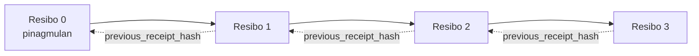

[Watch the lesson video: Securing AI Agents with Cryptographic Receipts](https://youtu.be/PLACEHOLDER_VIDEO_ID)

> _(Lesson video and thumbnail to be added by the Microsoft content team post-merge, matching the lesson 14 / 15 pattern.)_

# Securing AI Agents with Cryptographic Receipts

## Panimula

Tatalakayin sa leksyong ito ang:

- Bakit mahalaga ang audit trails para sa mga AI agent sa pagsunod sa batas, pag-debug, at pagtitiwala.
- Ano ang cryptographic receipt at paano ito naiiba sa isang unsigned na log line.
- Paano gumawa ng signed receipt para sa pagtawag ng tool ng agent gamit ang plain Python.
- Paano i-verify ang isang receipt nang offline at matukoy ang pagbabago o panlilinlang.
- Paano gumawa ng chain ng mga receipt para kapag may tinanggal o inayos na isa ay masira ang chain.
- Ano ang pinatutunayan ng mga receipt at ano ang hindi nila pinatutunayan nang hayagan.

## Mga Layunin sa Pagkatuto

Pagkatapos ng leksyong ito, malalaman mo kung paano:

- Tukuyin ang mga failure mode na nagtutulak sa cryptographic provenance para sa mga aksyon ng agent.
- Gumawa ng Ed25519-signed na receipt gamit ang canonical JSON payload.
- I-verify nang independent ang receipt gamit lamang ang public key ng nag-sign.
- Matukoy ang panlilinlang sa pamamagitan ng muling pag-verify sa binagong receipt.
- Bumuo ng hash-chained na sunod-sunod na mga receipt at ipaliwanag kung bakit mahalaga ang chain.
- Kilalanin ang hangganan ng pinatutunayan ng mga receipt (attribution, integridad, pagkakasunod) at ng hindi nila pinatutunayan (katumpakan ng aksyon, katibayan ng polisiya).

## Ang Problema: Audit Trail ng Iyong Agent

Isipin na nag-deploy ka ng AI agent para sa Contoso Travel. Binabasa ng agent ang mga kahilingan ng customer, tumatawag sa flights API para maghanap ng mga opsyon, at nagbubook ng mga upuan para sa customer. Noong nakaraang quarter, nakaproseso ang agent ng 50,000 bookings.

Ngayon, dumating ang auditor. Tinanong nila nang simple: "Ipakita mo sa akin ang ginawa ng iyong agent."

Ibinigay mo ang mga log files. Tiningnan ito ng auditor at tinanong ang mas mahirap na tanong: "Paano ko malalaman na hindi binago ang mga log na ito?"

Ito ang problema ng audit trail. Karamihan sa mga deployment ngayon ay umaasa sa:

- **Application logs**: isinulat ng mismong agent, maaaring i-edit ng sinumang may access sa file system.
- **Cloud logging services**: may tamper-evident sa platform level pero kailangan magtiwala ang auditor sa operator ng platform.
- **Database transaction logs**: angkop para sa mga pagbabago sa database pero hindi para sa arbitrary tool calls.

Walang isa man dito ang makakasagot ng tanong ng auditor nang hindi kailangan magtiwala sa isang tao (sino ka man, cloud provider mo, o vendor ng database mo). Para sa internal na gamit, madalas tanggap ang pagtitiwala na ito. Para sa mga regulated workloads (pananalapi, pangangalagang pangkalusugan, anumang sakop ng EU AI Act), hindi ito katanggap-tanggap.

Nilulutas ng cryptographic receipts ito sa pamamagitan ng paggawa ng bawat aksyon ng agent na maaaring i-verify nang independent. Hindi kailangang magtiwala ang auditor sa iyo. Kailangan lang nila ang iyong public key at ang receipt mismo.

## Ano ang Cryptographic Receipt?

Ang receipt ay isang JSON na bagay na nagrerekord ng ginawa ng agent, na nilagdaan gamit ang digital signature.


Ang isang minimal na receipt ay ganito:

```json
{
  "type": "agent.tool_call.v1",
  "agent_id": "contoso-travel-bot",
  "tool_name": "lookup_flights",
  "tool_args_hash": "sha256:a3f9c1...",
  "result_hash": "sha256:7b2e1d...",
  "policy_id": "contoso-travel-policy-v3",
  "timestamp": "2026-04-25T14:30:00Z",
  "sequence": 47,
  "previous_receipt_hash": "sha256:9d4e6a...",
  "signature": {
    "alg": "EdDSA",
    "sig": "c5af83...",
    "public_key": "8f3b2c..."
  }
}
```

Tatlong katangian ang gumagana:

1. **Ang lagda**. Nilagdaan ang receipt ng gateway ng agent gamit ang Ed25519 private key. Sinumang may kaukulang public key ay maaaring i-verify ang lagda nang offline. Ang pagbabago ng kahit anong field ay magpapawalang-bisa sa lagda.

2. **Canonical encoding**. Bago paglagdaan, isinerializa ang receipt gamit ang JSON Canonicalization Scheme (JCS, RFC 8785). Tinitiyak nito na ang dalawang implementasyon na gumagawa ng parehong lohikal na receipt ay maglalabas ng eksaktong kaparehong bytes. Kung wala ito, iba’t ibang JSON serializers ang magbibigay ng ibang lagda para sa parehong nilalaman.

3. **Hash chaining**. Ang field na `previous_receipt_hash` ay nag-uugnay sa bawat receipt sa naunang receipt. Kapag tinanggal o inayos ang isang receipt, nasisira ang lahat ng kasunod na receipt. Nagiging visible ang panlilinlang sa antas ng chain kahit na malampasan ang indibidwal na mga lagda.

Sama-sama, ang mga katangiang ito ay nagbibigay ng tatlong garantiya:

- **Attribution**: ang susi na ito ang pumirma sa nilalamang ito.
- **Integridad**: hindi nagbago ang nilalaman mula nang pirmahan.
- **Pagkakasunod**: ang receipt na ito ay nauna pagkatapos ng tinukoy na receipt sa chain.

## Paggawa ng Receipt sa Python

Hindi mo kailangan ng espesyal na library para gumawa ng receipt. Malawak na available ang mga cryptographic primitive at ang lohika ay ilang dosenang linya lang ng Python.

Ang hands-on exercises sa `code_samples/18-signed-receipts.ipynb` ay naglalakad sa buong proseso. Ang buod:

```python
import json
import hashlib
import base64
from nacl import signing
from jcs import canonicalize  # RFC 8785 na canonical JSON

def b64url_nopad(data: bytes) -> str:
    return base64.urlsafe_b64encode(data).decode("ascii").rstrip("=")

def sha256_canonical(obj) -> str:
    """SHA-256 of a Python object's JCS-canonical JSON form."""
    return f"sha256:{hashlib.sha256(canonicalize(obj)).hexdigest()}"

# Gumawa o mag-load ng signing key (sa produksyon, itago sa key vault)
signing_key = signing.SigningKey.generate()
verify_key = signing_key.verify_key

# Buuhin ang receipt payload (walang lagda pa)
tool_args = {"origin": "SYD", "destination": "LAX"}
tool_result = [{"flight": "QF11", "price": 1850, "stops": 0}]

payload = {
    "type": "agent.tool_call.v1",
    "agent_id": "contoso-travel-bot",
    "tool_name": "lookup_flights",
    "tool_args_hash": sha256_canonical(tool_args),
    "result_hash": sha256_canonical(tool_result),
    "policy_id": "contoso-travel-policy-v3",
    "timestamp": "2026-04-25T14:30:00Z",
    "sequence": 0,
    "previous_receipt_hash": None,
}

# Canonicalize, hash, lagdaan.
canonical_bytes = canonicalize(payload)
message_hash = hashlib.sha256(canonical_bytes).digest()
signature_bytes = signing_key.sign(message_hash).signature

# Idikit ang isang structured na signature object.
receipt = {
    **payload,
    "signature": {
        "alg": "EdDSA",
        "sig": b64url_nopad(signature_bytes),
        "public_key": b64url_nopad(bytes(verify_key)),
    },
}
```

Iyan ang buong signing pipeline. Tinuturuan ng exercises sa notebook ang bawat hakbang.

## Pag-verify ng Receipt at Pagtuklas ng Panlilinlang

Ang pag-verify ay ang kabaligtarang operasyon:

```python
import base64
import hashlib
from nacl import signing
from nacl.exceptions import BadSignatureError
from jcs import canonicalize

def b64url_decode(s: str) -> bytes:
    padding = "=" * ((4 - len(s) % 4) % 4)
    return base64.urlsafe_b64decode(s + padding)

def verify_receipt(receipt: dict) -> bool:
    # Ang pirma ay isang istrukturadong bagay: {"alg", "sig", "public_key"}.
    sig_obj = receipt.get("signature")
    if not sig_obj or sig_obj.get("alg") != "EdDSA":
        return False

    # I-rekonstruksyon ang payload na talaga namang pinirmahan (lahat maliban sa pirma).
    payload = {k: v for k, v in receipt.items() if k != "signature"}

    canonical_bytes = canonicalize(payload)
    message_hash = hashlib.sha256(canonical_bytes).digest()

    try:
        verify_key = signing.VerifyKey(b64url_decode(sig_obj["public_key"]))
        verify_key.verify(message_hash, b64url_decode(sig_obj["sig"]))
        return True
    except BadSignatureError:
        return False
```

Tumatanggap ang function na ito ng receipt at nagbabalik ng `True` kung valid ang lagda, `False` kung hindi. Walang network call, walang dependency sa serbisyo, at walang kailangang pagtitiwala sa sinumang third party.

Para makita ang pagtuklas ng panlilinlang sa aksyon, tinuturo ng notebook ang sumusunod:

1. Gumawa ng valid na receipt at kumpirmahing ito ay nare-verify.
2. Baguhin ang isang byte ng `tool_args_hash` field.
3. Muling patakbuhin ang verification at makita itong bumagsak.

Ito ang praktikal na demonstasyon na ang mga receipt ay tamper-evident: anumang pagbabago, gaano man kaliit, ay sumisira sa lagda.

## Paggawa ng Chain ng mga Receipt para sa Mga Multi-Step na Agent

Isang signed receipt ang nagpoprotekta sa isang aksyon. Ang chain ng mga receipt ay nagpoprotekta sa sunod-sunod na mga aksyon.



Itinatala ng bawat receipt ang hash ng naunang receipt. Para tahimik na tanggalin ang receipt 2, kailangang gawin ng attacker ang alinman sa:

- Baguhin ang `previous_receipt_hash` field ng receipt 3 (magpapa-invalid sa lagda ng receipt 3), O
- Gumawa ng bagong lagda sa binagong receipt 3 (kailangan ang private key ng agent).

Kung ang private key ay nasa hardware key vault at inilalathala mo ang public key kasama ng bawat receipt, hindi praktikal ang alin mang pag-atake nang hindi natutuklasan.

Pinapakita ng notebook ang:

1. Pagbuo ng chain ng tatlong receipt.
2. Pag-verify na ang `previous_receipt_hash` ng bawat receipt ay tumutugma sa aktwal na hash ng naunang receipt.
3. Pagbabago ng isang receipt sa gitna at pagtingin kung paano nasisira ang chain sa puntong iyon.

Ganito mo magagawa ang audit trail na maaaring i-verify ng external auditor nang hindi kailangan magtiwala sa iyo.

## Ano ang Pinapakita ng Mga Receipt (At Ano ang Hindi)

Ito ang pinakaimportanteng bahagi ng leksyong ito. Malakas ang kapangyarihan ng mga receipt pero may hangganan ito.

**Pinapatunayan ng mga receipt ang tatlong bagay:**

1. **Attribution**: isang partikular na key ang pumirma sa isang partikular na payload.
2. **Integridad**: hindi nagbago ang payload mula nang pirmahan.
3. **Pagkakasunod**: ang receipt na ito ay sumunod sa receipt na ito sa hash chain.

**Hindi pinatutunayan ng mga receipt:**

1. **Katumpakan**: na ang aksyon ng agent ay tama. Maaari ring pipirmahan ang receipt para sa maling sagot nang kasing linis ng tamang sagot.
2. **Pagsunod sa polisiya**: na ang polisiya na tinukoy sa `policy_id` ay totoong na-evaluate, o na papayagan nito ang aksyon kung susuriin. Itinatala ng receipt ang inangkin, hindi ang ipinatupad.
3. **Pagkakakilanlan lampas sa key**: sinasabi ng receipt na "ang key na ito ang pumirma sa nilalaman." Hindi nito sinasabi na "ang taong ito ang nag-authorize." Nangangailangan ng hiwalay na identity infrastructure (directory, public key registry, atbp.) para iugnay ang key sa tao o organisasyon.
4. **Katotohanan ng mga input**: kung nakatanggap ang agent ng manipulado o binagong prompt at kumilos base dito, tapat na itinatala ng receipt ang aksyon. Downstream ang mga receipt sa input validation, hindi kapalit nito.

Mahalaga ang hangganan na ito dahil:

- Sinasabi nito kung saan kapaki-pakinabang ang mga receipt: gawing auditableng behavior ng agent at notices ang panlilinlang, kahit sa mga organisasyong magkakaiba.
- Sinasabi rin nito kung ano ang mga dagdag na layer na kailangan mo pa: input validation (Lesson 6), pagpapatupad ng polisiya (pinaikling tinalakay sa ibaba), at identity infrastructure (hindi saklaw ng araling ito).

Karaniwang maling palagay ang akalaing kapag "may mga receipt tayo" ay ibig sabihin "nasa ilalim na tayo ng pamamahala." Hindi. Ang mga receipt ay pundasyon. Ang pamamahala ay ang sistemang itinatayo pagkatapos nito.

## Mga Sanggunian sa Produksyon

Ang Python code sa leksyong ito ay sinadyang minimal upang mabasa mo ang bawat linya at maintindihan nang eksakto kung ano ang nangyayari. Sa produksyon, may dalawang opsyon ka:

1. **Gumawa nang diretso mula sa cryptographic primitives.** Ang 50 linya na nakita mo sa itaas ay sapat para sa maraming gamit. Ang PyNaCl (Ed25519) at ang `jcs` package (canonical JSON) ay mga mahusay at na-audit na libraries.

2. **Gumamit ng production receipt library.** May ilang open-source na proyekto na nag-iimplementa ng parehong pattern na may dagdag na features (key rotation, batch verification, JWK Set distribution, integration sa policy engines):
   - Ang format ng receipt na ginamit sa leksyong ito ay sumusunod sa IETF Internet-Draft (`draft-farley-acta-signed-receipts`) na kasalukuyang nasa proseso ng pag-standardize.
   - Ang Microsoft Agent Governance Toolkit ay nagko-compose ng mga receipt sa cedar-based policy decisions; tingnan ang Tutorial 33 sa repository na iyon para sa end-to-end na halimbawa.
   - Ang `protect-mcp` (npm) at `@veritasacta/verify` (npm) packages ay may Node-based na implementasyon ng receipt signing at offline verification, na dinisenyo para balutin ang anumang MCP server na may tamper-evident audit trail.
   - Ang **[nobulex](https://github.com/arian-gogani/nobulex)** Python SDK (`pip install nobulex`) ay nagbibigay ng parehong Ed25519 + JCS signing pattern sa Python na may LangChain at CrewAI integration, kabilang ang inilathalang cross-validation test vectors at compliance mapping na ambag ng [OWASP PR #2210](https://github.com/OWASP/CheatSheetSeries/pull/2210).

Ang pagpili sa pagitan ng paggawa ng sarili at paggamit ng library ay katulad ng pagpili sa pagitan ng pagsusulat ng sariling JWT library at paggamit ng isang nasubok na library: parehong makatwiran; nakakatipid ng oras at bumabawasan ang audit surface ang library; pinipilit kang maintindihan ang bawat primitive ang paraan na gawa mula sa simula. Itinuturo ng leksyong ito ang paggawa mula sa simula para may pundasyon ka kahit alin ang piliin.

## Knowledge Check

Subukan ang iyong pag-unawa bago lumipat sa practice exercise.

**1. Ang isang receipt ay nilagdaan gamit ang private Ed25519 key ng agent. Ang auditor ay may public key lamang. Maaari bang i-verify ng auditor ang receipt nang offline?**

<details>
<summary>Sagot</summary>

Oo. Ang Ed25519 verification ay nangangailangan lamang ng public key at ng signed bytes. Walang network call, walang dependency sa serbisyo. Ito ang katangian na nagpapagamit ng mga receipt sa mga air-gapped, multi-organization, o low-trust audit na setup.
</details>

**2. Binago ng attacker ang `policy_id` field sa isang receipt upang igiit na mas permissive ang polisiya. Ang lagda ay ginawa sa orihinal na payload. Ano ang nangyayari sa verification?**

<details>
<summary>Sagot</summary>

Bumagsak ang verification. Ang lagda ay kinompyut sa canonical bytes ng orihinal na payload; ang pagbabago ng kahit anong field ay nagbabago ng canonical bytes, na nagbabago sa SHA-256 na hash, at nagpapawalang-bisa ng lagda. Kailangan ng attacker ang private key para makagawa ng bagong valid na lagda, na wala siya.
</details>

**3. Bakit kasama sa receipt ang `tool_args_hash` at `result_hash` sa halip na ang raw arguments at resulta?**

<details>
<summary>Sagot</summary>

Dalawang dahilan. Una, maaaring kailanganin i-archive o i-transmit ang receipt sa mga environment kung saan problema ang pag-leak ng raw na nilalaman (PII, business data). Pinananatiling maliit at pribado ng pag-hash ang receipt; kino-confirm ng auditor na tugma ang hash sa hiwalay na nakaimbak na kopya ng aktwal na nilalaman. Pangalawa, ang mga hash ay may fixed size; ang receipt na may hash ay may limitadong laki kahit gaano kalaki ang inputs at outputs.
</details>

**4. Ang `previous_receipt_hash` field ay nag-uugnay sa bawat receipt sa naunang receipt. Kung tahimik na tinanggal ng attacker ang isang receipt sa gitna ng chain, ano ang magiging invalid?**

<details>
<summary>Sagot</summary>

Lahat ng receipt na sumunod sa tinanggal ay nagiging invalid. Hindi na tumutugma ang kanilang `previous_receipt_hash` sa aktwal na chain (dahil ang receipt na tinutukoy ay wala na, o nagbago ang chain na tumutukoy sa ibang predecessor). Para itago ang pagtanggal, kailangang i-re-sign ng attacker ang lahat ng susunod na receipt, na nangangailangan ng private key.
</details>

**5. Ang isang receipt ay malinis na na-verify. Ipinapakita ba nito na tama, matibay, o sumusunod sa polisiya ang aksyon ng agent?**

<details>
<summary>Sagot</summary>

Hindi. Ang valid na receipt ay nagpapatunay ng tatlong bagay: attribution (ang key na ito ang pumirma), integridad (hindi nagbago ang nilalaman), at pagkakasunod (ang receipt ay sumunod sa isa pa). Hindi nito pinatutunayan na ang aksyon ay tama, na ang polisiya sa `policy_id` ay tunay na in-evaluate, o na sinunod ng agent ang bawat patakaran. Ginagawa ng mga receipt na auditableng tumugon ang agent, hindi kailangan na tama. Ito ang pinakaimportanteng hangganan sa leksyon.
</details>

## Practice Exercise

Buksan ang `code_samples/18-signed-receipts.ipynb` at kumpletuhin ang apat na seksyon:

1. **Seksyon 1**: Lagdaan ang iyong unang receipt at i-verify ito.
2. **Seksyon 2**: Baguhin ang receipt at obserbahan ang pagkabigo sa verification.
3. **Seksyon 3**: Bumuo ng chain ng tatlong receipt at i-verify ang integridad ng chain.
4. **Seksyon 4**: I-apply ang pattern sa isang agent na ginawa gamit ang Microsoft Agent Framework: balutin ang pagtawag ng tool sa receipt-signing, pagkatapos ay i-verify ang receipt nang independent.
**Stretch challenge 1:** palawakin ang receipt schema gamit ang karagdagang field na pinili mo (halimbawa, isang request ID para sa pagsubaybay), i-update ang canonical signing logic para isama ito, at tiyaking ang receipt ay dumadaan pa rin sa verification. Pagkatapos ay baguhin ang field matapos ang pag-sign at tiyaking nabibigo ang verification. Pinipilit ka nitong unawain kung paanong ang bawat byte ng canonical encoding ay nakakatulong sa signature.

**Stretch challenge 2:** i-SHA-256 hash ang dalawang receipts mo nang magkasama (pagdikitin ang kanilang canonical bytes sa isang deterministic na pagkakasunod) at ipaloob ang nagresultang digest bilang bagong field sa isang pangatlong receipt bago ito pirmahan. Patunayan na ang lahat ng tatlong receipts ay dumadaan pa rin sa round-trip. Nakagawa ka lang ng one-step inclusion proof: sinumang may hawak ng pangatlong receipt ay maaaring patunayan na ang unang dalawang receipts ay umiiral noong pinirmahan ito, nang hindi kinakailangang ibunyag ang kanilang mga nilalaman. Ito ang pattern na ginagamit ng selective-disclosure receipts sa malawakang sukat (Merkle commitments, RFC 6962).

## Konklusyon

Ang cryptographic receipts ay nagbibigay sa mga AI agent ng audit trail na:

- **Independently verifiable**: kahit sinong partido na may public key ay maaaring mag-verify, walang dependency sa serbisyo.
- **Tamper-evident**: anumang pagbabago ay nagpapawalang-bisa sa signature.
- **Portable**: ang receipt ay isang maliit na JSON file; maaari itong i-archive, ipadala, at i-verify saanman.
- **Standards-aligned**: binuo gamit ang Ed25519 (RFC 8032), JCS (RFC 8785), at SHA-256, lahat ay malawakang ginagamit na primitives.

Hindi ito pamalit sa input validation, pagpapatupad ng patakaran, o identity infrastructure. Ito ay pundasyon para sa mga layer na iyon. Kung magde-deploy ka ng mga agent sa regulated workloads, multi-organization workflows, o anumang sitwasyong hindi maaaring asahan na pagkakatiwalaan ng isang future auditor, ang receipts ang paraan upang gawing tapat ang audit trail.

Ang pinakamahalagang takeaway: pinatutunayan ng receipts kung sino ang nagsabi ng ano, kailan. Hindi nito pinatutunayan na ang sinabi ay totoo o tama. Mahigpit na hawakan ang pagkakaibang iyon. Ito ang pagkakaiba sa pagitan ng isang tapat na provenance system at isang mapanlinlang.

## Production Checklist

Kapag handa ka nang lumipat mula sa araling ito patungo sa pagde-deploy ng receipt-signed agents sa totoong kapaligiran:

- [ ] **Ilagay ang signing key sa labas ng developer laptop.** Gamitin ang Azure Key Vault, AWS KMS, o hardware security module. Ang private key na pumipirma sa iyong mga receipts ay hindi dapat nanirahan sa source control o sa plaintext sa mga application machine.
- [ ] **I-publish ang verification public key.** Kailangan ito ng mga auditor para mag-verify offline. Ang karaniwang pattern ay JWK Set sa isang kilalang URL (RFC 7517), hal., `https://your-org.example.com/.well-known/agent-keys.json`.
- [ ] **I-anchor ang chain externally.** Paminsan-minsan isulat ang pinakabagong chain head hash sa isang transparency log (Sigstore Rekor, RFC 3161 timestamp authority, o isang pangalawang internal na sistema) upang makumpirma ng isang external party na "ang chain na ito ay umiiral sa panahong ito."
- [ ] **I-store ang mga receipts nang hindi nababago.** Ang append-only blob storage (Azure Storage na may immutability policies, AWS S3 Object Lock) ay pumipigil sa insider mula sa muling pagsusulat ng kasaysayan sa layer ng storage.
- [ ] **Magdesisyon tungkol sa retention.** Maraming compliance regimes ang nangangailangan ng multi-taong retention. Magplano para sa paglago ng receipt (ang bawat receipt ay ~500 bytes; isang agent na gumagawa ng 10K calls kada araw ay nakakagawa ng ~1.8 GB kada taon).
- [ ] **Idokumento kung ano ang hindi saklaw ng receipts.** Pinatutunayan ng receipts ang attribution, integrity, at ordering. Dapat malinaw sa iyong runbook kung anong karagdagang kontrol (input validation, policy enforcement, rate limiting, identity infrastructure) ang kasama sa receipts sa iyong governance posture.

### May Ibang Tanong tungkol sa Pag-seguro ng AI Agents?

Sumali sa [Microsoft Foundry Discord](https://aka.ms/ai-agents/discord) upang makipagkita sa iba pang mga nag-aaral, dumalo sa office hours, at masagot ang iyong mga tanong tungkol sa AI Agents.

## Lampas sa Araling Ito

Saklaw ng araling ito ang single-receipt signing at hash-chained sequences. Ang parehong mga primitives ay bumubuo ng ilang mas advanced na pattern na maaari mong matugunan habang lumalalim ang iyong governance posture:

- **Selective disclosure.** Kapag ang mga field ng receipt ay independently committed (RFC 6962-style Merkle tree), maaari mong ipakita ang tiyak na mga field sa tiyak na mga auditor at patunayan na ang iba ay hindi nabago nang hindi inilalantad ang mga ito. Kapaki-pakinabang kapag kailangang masiyahan ng parehong isang comprehensive audit (na gusto ang completeness) at mga regulasyon sa data-minimization tulad ng GDPR (na gusto na makita ng auditor ang kaunti lang).
- **Receipt revocation.** Kung na-kompromiso ang signing key, kailangan mo ng paraan para markahan lahat ng mga receipt na pinirmahan ng key na iyon bilang hindi mapagkakatiwalaan mula sa isang punto ng oras pasulong. Karaniwang pattern: short-lived signing keys kasama ng published revocation list, o transparency log na may revocation entries.
- **Bilateral / split-signature receipts.** Ang ilang implementasyon ay naghahati sa signed payload sa pre-execution (`authorization_*`) at post-execution (`result_*`) na kalahati na may independent signatures, kapaki-pakinabang kapag ang decision ng authorization at ang naobserbahang resulta ay galing sa magkaibang actors o sa magkaibang oras. Ito ay idinadagdag sa ibabaw ng receipt format na itinuro sa araling ito.
- **Payload composition.** Isang receipt ang sumuselyo sa anumang bytes na inilalagay mo sa `result_hash`. Sa totoong mundo, madalas mas mayaman ang payload kaysa sa isang simpleng resulta ng tool call: pre-decision reasoning (model prediction, mga opsyon na kinonsidera, ebidensya at pagiging kumpleto nito, risk posture, accountability chain, resulta ng gate) ay maaaring nasa loob ng payload, na selyado ng isang receipt. Pinananatiling minimal ang format habang pinapayagan ang pag-evolve ng mga payload schema ayon sa domain.
- **Cross-implementation conformance.** Maraming independent na implementasyon ng parehong receipt format (Python, TypeScript, Rust, Go) ang nagko-cross-verify gamit ang shared test vectors. Kung ikaw mismo ay gagawa ng implementasyon, ang pag-validate laban sa mga published vectors ay nagpapatunay ng wire compatibility.
- **Post-quantum migration.** Ang Ed25519 ay malawakang ginagamit ngayon pero hindi ito quantum-resistant. Ang format ng receipt ay algorithm-agile: ang `signature.alg` na field ay maaaring magdala ng `ML-DSA-65` (ang NIST post-quantum signature standard) kapag kailangan mong mag-migrate. Magplano para sa transition period kung saan naka-dual-sign ang mga receipt.

## Karagdagang Sanggunian

- <a href="https://datatracker.ietf.org/doc/draft-farley-acta-signed-receipts/" target="_blank">IETF Internet-Draft: Signed Decision Receipts for Machine-to-Machine Access Control</a>
- <a href="https://learn.microsoft.com/azure/ai-studio/responsible-use-of-ai-overview" target="_blank">Responsible AI overview (Azure AI)</a>
- <a href="https://datatracker.ietf.org/doc/html/rfc8032" target="_blank">RFC 8032: Edwards-Curve Digital Signature Algorithm (EdDSA)</a>
- <a href="https://datatracker.ietf.org/doc/html/rfc8785" target="_blank">RFC 8785: JSON Canonicalization Scheme (JCS)</a>
- <a href="https://datatracker.ietf.org/doc/html/rfc6962" target="_blank">RFC 6962: Certificate Transparency</a> (Merkle-tree construction na ginagamit ng selective-disclosure receipts)
- <a href="https://github.com/microsoft/agent-governance-toolkit/blob/main/docs/tutorials/33-offline-verifiable-receipts.md" target="_blank">Microsoft Agent Governance Toolkit, Tutorial 33: Offline-Verifiable Decision Receipts</a>
- <a href="https://github.com/ScopeBlind/agent-governance-testvectors" target="_blank">Cross-implementation conformance test vectors</a> para sa receipt format na ginamit sa araling ito (Apache-2.0)
- <a href="https://pynacl.readthedocs.io/" target="_blank">PyNaCl documentation</a> (Ed25519 sa Python)

## Nakaraang Aralin

[Building Computer Use Agents (CUA)](../15-browser-use/README.md)

## Susunod na Aralin

_(Itatakda ng mga tagapangasiwa ng kurikulum)_

---

<!-- CO-OP TRANSLATOR DISCLAIMER START -->
**Pagtatanggi**:
Ang dokumentong ito ay isinalin gamit ang serbisyo ng AI translation na [Co-op Translator](https://github.com/Azure/co-op-translator). Bagama't nagsusumikap kami para sa katumpakan, pakatandaan na ang awtomatikong pagsasalin ay maaaring maglaman ng mga pagkakamali o hindi pagkakatugma. Ang orihinal na dokumento sa orihinal nitong wika ang dapat ituring na pangunahing sanggunian. Para sa mahahalagang impormasyon, inirerekomenda ang propesyonal na pagsasalin ng tao. Hindi kami mananagot sa anumang maling pagkakaintindi o maling interpretasyon na nagmula sa paggamit ng pagsasaling ito.
<!-- CO-OP TRANSLATOR DISCLAIMER END -->