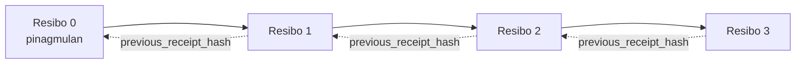

[Panoorin ang video ng aralin: Pag-secure ng mga AI Agent gamit ang mga Cryptographic Receipts](https://youtu.be/PLACEHOLDER_VIDEO_ID)

> _(Ang video ng aralin at thumbnail ay idadagdag ng Microsoft content team pagkatapos ng pagsasama, na sumusunod sa pattern ng aralin 14 / 15.)_

# Pag-secure ng mga AI Agent gamit ang mga Cryptographic Receipts

## Panimula

Tatalakayin sa araling ito ang mga sumusunod:

- Bakit mahalaga ang audit trails para sa mga AI agent sa pagsunod sa regulasyon, pag-debug, at pagtitiwala.
- Ano ang cryptographic receipt at kung paano ito naiiba sa isang unsigned log line.
- Paano gumawa ng isang signed receipt para sa pagtawag ng tool ng isang agent gamit ang plain Python.
- Paano i-verify ang isang receipt offline at makita kung may pandaraya.
- Paano i-chain ang mga receipt para ang pagtanggal o pag-reorder ay makakasira sa chain.
- Ano ang mga pinapatunayan ng mga receipt at ano ang hindi nila pinapatunayan.

## Mga Layunin sa Pagkatuto

Pagkatapos makumpleto ang araling ito, malalaman mo kung paano:

- Tukuyin ang mga failure mode na nagtutulak sa cryptographic provenance para sa mga aksyon ng agent.
- Gumawa ng Ed25519-signed receipt gamit ang canonical JSON payload.
- I-verify ang receipt nang independente gamit lang ang pampublikong susi ng signer.
- Matuklasan ang pandaraya sa pamamagitan ng muling pag-verify sa isang binagong receipt.
- Bumuo ng hash-chained sequence ng mga receipt at ipaliwanag kung bakit mahalaga ang chain.
- Kilalanin ang hangganan ng mga pinapatunayan ng mga receipt (atribusyon, integridad, pagkakasunud-sunod) at ang mga hindi nito pinapatunayan (katumpakan ng aksyon, pagiging makatwiran ng polisiya).

## Ang Problema: Ang Audit Trail ng Iyong Agent

Isipin na nag-deploy ka ng AI agent para sa Contoso Travel. Binabasa ng agent ang mga kahilingan ng customer, tumatawag sa flights API para maghanap ng mga pagpipilian, at nagbu-book ng mga upuan para sa customer. Noong nakaraang quarter, naproseso ng agent ang 50,000 booking.

Ngayon ay dumating ang isang auditor. Nagtanong siya ng isang simpleng tanong: "Ipakita mo sa akin ang ginawa ng iyong agent."

Ibinigay mo ang mga log file mo. Tiningnan ito ng auditor at tinanong ang mas mahirap na tanong: "Paano ko malalaman na hindi na-edit ang mga log na ito?"

Ito ang problema sa audit trail. Karamihan sa mga deployment ng agent ngayon ay umaasa sa:

- **Application logs**: isinulat mismo ng agent, ngunit maaaring i-edit ng sinuman na may access sa file system.
- **Cloud logging services**: may tamper-evident na katangian sa platform level ngunit kailangan ng tiwala sa operator ng platform ng auditor.
- **Database transaction logs**: angkop para sa mga pagbabago sa database ngunit hindi para sa arbitrary tool calls.

Wala sa mga ito ang makakasagot sa tanong ng auditor nang hindi kinakailangang magtiwala ang auditor sa sinuman (sa iyo, sa cloud provider mo, o sa vendor ng database). Para sa internal na gamit, madalas tanggap ang tiwalang iyon. Para sa mga regulated na workload (finance, healthcare, o anumang sakop ng EU AI Act), hindi.

Nilulutas ng cryptographic receipts ito sa pamamagitan ng paggawa ng bawat aksyon ng agent na independently verifiable. Hindi kailangan ng auditor na magtiwala sa iyo. Kailangan lang nila ang iyong public key at ang receipt mismo.

## Ano ang Cryptographic Receipt?

Ang receipt ay isang JSON object na nagrerecord ng ginawa ng agent, na pinirmahan gamit ang digital signature.


```mermaid
flowchart LR
    A[Nagpapatakbo ang ahente ng isang kasangkapan] --> B[Bumuo ng payload ng resibo]
    B --> C[Canonicalize JSON RFC 8785]
    C --> D[SHA-256 hash]
    D --> E[Ed25519 lagdaan]
    E --> F[Resibo na may lagda]
    F --> G[Sinusuri ng auditor offline]
    G --> H{Wasto ba ang lagda?}
    H -- yes --> I[Patunay na kapansin-pansin ang pagbabago]
    H -- no --> J[Tinanggihan ang resibo]
```

Ang isang minimal na receipt ay ganito:

```json
{
  "type": "agent.tool_call.v1",
  "agent_id": "contoso-travel-bot",
  "tool_name": "lookup_flights",
  "tool_args_hash": "sha256:a3f9c1...",
  "result_hash": "sha256:7b2e1d...",
  "policy_id": "contoso-travel-policy-v3",
  "timestamp": "2026-04-25T14:30:00Z",
  "sequence": 47,
  "previous_receipt_hash": "sha256:9d4e6a...",
  "signature": {
    "alg": "EdDSA",
    "sig": "c5af83...",
    "public_key": "8f3b2c..."
  }
}
```

Tatlong properties ang gumagawa ng trabaho:

1. **Ang pirma**. Pinipirmahan ang receipt ng gateway ng agent gamit ang Ed25519 private key. Sinumang may katumbas na public key ay maaaring mag-verify ng pirma offline. Ang anumang pakikialam sa alinmang field ay nagpapawalang bisa sa pirma.

2. **Canonical encoding**. Bago pumirma, ang receipt ay isinasalin gamit ang JSON Canonicalization Scheme (JCS, RFC 8785). Ito’y nagsisiguro na ang dalawang implementasyon na gumagawa ng parehong lohikal na receipt ay gumagawa ng byte-identical na output. Kung wala ang canonicalization, magkakaiba ang mga serializer ng JSON sa paggawa ng pirma para sa parehong nilalaman.

3. **Hash chaining**. Ang field na `previous_receipt_hash` ay nag-uugnay ng bawat receipt sa naunang receipt. Ang pagtanggal o pag-reorder ng isang receipt ay nagpapasira sa bawat receipt na sumusunod dito. Nakikita ang pandaraya sa antas ng chain kahit na malagpasan ang individual signatures.

Sama-sama, nagbibigay ang mga properties na ito ng tatlong garantiya:

- **Atribusyon**: pinirmahan ng susi na ito ang nilalaman na ito.
- **Integridad**: hindi nagbago ang nilalaman mula nang pumirma.
- **Pagkakasunud-sunod**: ang receipt na ito ay dumating pagkatapos ng receipt na iyon sa chain.

## Paggawa ng Receipt sa Python

Hindi mo kailangan ng espesyal na library para gumawa ng receipt. Malawak ang pagkakaroon ng cryptographic primitives at ilan lamang ang linya ng Python ng lohika.

Ang hands-on na mga pagsasanay sa `code_samples/18-signed-receipts.ipynb` ay nagpapakita ng buong prosesong ito. Ang buod na bersyon:

```python
import json
import hashlib
import base64
from nacl import signing
from jcs import canonicalize  # RFC 8785 canonical JSON

def b64url_nopad(data: bytes) -> str:
    return base64.urlsafe_b64encode(data).decode("ascii").rstrip("=")

def sha256_canonical(obj) -> str:
    """SHA-256 of a Python object's JCS-canonical JSON form."""
    return f"sha256:{hashlib.sha256(canonicalize(obj)).hexdigest()}"

# Gumawa o mag-load ng signing key (sa produksyon, itago sa key vault)
signing_key = signing.SigningKey.generate()
verify_key = signing_key.verify_key

# Buoin ang payload ng resibo (walang pirma pa)
tool_args = {"origin": "SYD", "destination": "LAX"}
tool_result = [{"flight": "QF11", "price": 1850, "stops": 0}]

payload = {
    "type": "agent.tool_call.v1",
    "agent_id": "contoso-travel-bot",
    "tool_name": "lookup_flights",
    "tool_args_hash": sha256_canonical(tool_args),
    "result_hash": sha256_canonical(tool_result),
    "policy_id": "contoso-travel-policy-v3",
    "timestamp": "2026-04-25T14:30:00Z",
    "sequence": 0,
    "previous_receipt_hash": None,
}

# I-canonicalize, i-hash, pirmahan.
canonical_bytes = canonicalize(payload)
message_hash = hashlib.sha256(canonical_bytes).digest()
signature_bytes = signing_key.sign(message_hash).signature

# Idikit ang isang nakaayos na signature object.
receipt = {
    **payload,
    "signature": {
        "alg": "EdDSA",
        "sig": b64url_nopad(signature_bytes),
        "public_key": b64url_nopad(bytes(verify_key)),
    },
}
```

Iyon ang buong pipeline sa pagpirma. Pinapaliwanag ng mga pagsasanay sa notebook ang bawat hakbang.

## Pag-verify ng Receipt at Pagtuklas ng Pandaraya

Ang pag-verify ay ang inverse na operasyon:

```python
import base64
import hashlib
from nacl import signing
from nacl.exceptions import BadSignatureError
from jcs import canonicalize

def b64url_decode(s: str) -> bytes:
    padding = "=" * ((4 - len(s) % 4) % 4)
    return base64.urlsafe_b64decode(s + padding)

def verify_receipt(receipt: dict) -> bool:
    # Ang pirma ay isang nakaayos na bagay: {"alg", "sig", "public_key"}.
    sig_obj = receipt.get("signature")
    if not sig_obj or sig_obj.get("alg") != "EdDSA":
        return False

    # Ibalik ang payload na aktwal na nilagdaan (lahat maliban sa pirma).
    payload = {k: v for k, v in receipt.items() if k != "signature"}

    canonical_bytes = canonicalize(payload)
    message_hash = hashlib.sha256(canonical_bytes).digest()

    try:
        verify_key = signing.VerifyKey(b64url_decode(sig_obj["public_key"]))
        verify_key.verify(message_hash, b64url_decode(sig_obj["sig"]))
        return True
    except BadSignatureError:
        return False
```

Ang function na ito ay tumatanggap ng receipt at nagbabalik ng `True` kung wasto ang pirma, `False` kung hindi. Walang tawag sa network, walang dependency sa serbisyo, at walang kailangang tiwala sa anumang third party.

Upang makita ang pagtuklas ng pandaraya sa aksyon, pinapaliwanag sa notebook ang mga sumusunod:

1. Paggawa ng wastong receipt at pagtitiyak na ito ay na-verify.
2. Pagbabago ng isang byte sa `tool_args_hash` na field.
3. Muling pag-verify at pagkadiskubre ng pagkabigo.

Ito ang praktikal na demonstrasyon na ang mga receipt ay tamper-evident: anumang pagbabago, gaano man kaliit, ay nagpapasira sa pirma.

## Pag-chain ng Mga Receipt para sa Multi-Step na mga Agent

Isang signed receipt ang pumoprotekta sa isang aksyon. Ang chain ng mga receipt ay pumoprotekta sa isang sunod-sunod na gawain.


```mermaid
flowchart LR
    R0[Resibo 0<br/>pinagmulan] --> R1[Resibo 1]
    R1 --> R2[Resibo 2]
    R2 --> R3[Resibo 3]
    R1 -. previous_receipt_hash .-> R0
    R2 -. previous_receipt_hash .-> R1
    R3 -. previous_receipt_hash .-> R2
```

Nire-record ng bawat receipt ang hash ng naunang receipt. Upang tahimik na tanggalin ang receipt 2, kailangang gawin ng attacker ang isa sa mga ito:

- Baguhin ang `previous_receipt_hash` ng receipt 3 (sumisira sa pirma ng receipt 3), O
- Gumawa ng bagong pirma sa binagong receipt 3 (kailangan ng private key ng agent).

Kung ang private key ay nasa hardware key vault at ikaw ay naglalathala ng public key sa bawat receipt, wala sa mga atakeng ito ang maaaring gawin nang hindi nadedetect.

Pinapaliwanag ng notebook ang:

1. Pagbuo ng chain ng tatlong receipt.
2. Pag-verify na ang `previous_receipt_hash` ng bawat receipt ay tumutugma sa aktwal na hash ng naunang receipt.
3. Pandaraya sa isang receipt sa gitna at pagtingin sa pagkasira ng chain sa eksaktong puntong iyon.

Ganito ka gumagawa ng audit trail na maaaring i-verify ng external auditor nang hindi na kailangang magtiwala sa iyo.

## Ano ang Pinapatunayan ng Mga Receipt (at Ano ang Hindi)

Ito ang pinakamahalagang bahagi ng araling ito. Makapangyarihan ang mga receipt ngunit may hangganan ang kanilang lakas.

**Tatlong bagay ang pinapatunayan ng mga receipt:**

1. **Atribusyon**: isang partikular na susi ang pumirma sa isang partikular na payload.
2. **Integridad**: ang payload ay hindi nagbago mula nang pumirma.
3. **Pagkakasunud-sunod**: ang receipt na ito ay dumating pagkatapos ng receipt na iyon sa hash chain.

**Hindi pinapatunayan ng mga receipt:**

1. **Katumpakan**: na ang ginawa ng agent ay ang tamang aksyon. Maaaring mapirmahan ang receipt para sa maling sagot nang kasing dali ng para sa tamang sagot.
2. **Pagsunod sa polisiya**: na ang polisiya na tinutukoy sa `policy_id` ay aktuwal na na-evaluate, o na papayagan nito ang aksyon kung sinuri. Ang receipt ay nagrerecord ng sinabing ginawa, hindi ang naipatupad.
3. **Pagkakakilanlan lampas sa susi**: sinasabi ng receipt na "pinirmahan ng susi na ito ang nilalaman na ito." Hindi nito sinasabi "pinahintulutan ito ng tao." Ang pagkonekta ng susi sa tao o organisasyon ay nangangailangan ng hiwalay na identity infrastructure (directory, public key registry, atbp.).
4. **Katotohanan ng mga input**: kung nakatanggap ang agent ng na-manipulang prompt at kumilos base dito, tapat na rerekord ng receipt ang aksyon. Ang mga receipt ay nasa downstream ng input validation, hindi kapalit nito.

Mahalaga ang hangganang ito para sa dalawang dahilan:

- Sinabi nito kung para saan kapaki-pakinabang ang mga receipt: paggawa ng agent behavior na ma-audit at tamper-evident, kahit na across organizational boundaries.
- Sinabi nito kung anong dagdag na layer pa ang kailangan mo: input validation (Aralin 6), pagpapatupad ng polisiya (pansamantalang tatalakayin sa ibaba), at identity infrastructure (hindi saklaw ng araling ito).

Isang karaniwang pagkakamali ang isipin na "meron tayo ng mga receipt" ay nangangahulugang "nai-gobernahan tayo." Hindi iyon totoo. Ang mga receipt ay pundasyon. Ang governance ay sistemang itinatayo mo sa ibabaw nito.

## Mga Sanggunian para sa Produksyon

Ang Python code sa araling ito ay sadyang minimal para mabasa mo ang bawat linya at maintindihan nang eksakto ang nangyayari. Sa produksyon, may dalawang opsyon ka:

1. **Mag-build nang diretso gamit ang cryptographic primitives.** Ang 50 linya na nakita mo sa itaas ay sapat sa maraming kaso. Ang PyNaCl (Ed25519) at ang `jcs` package (canonical JSON) ay mahusay na na-mementina at na-audit na mga library.

2. **Gumamit ng production receipt library.** May ilang open-source projects na nag-iimplementa ng parehong pattern na may dagdag na features (key rotation, batch verification, pamamahagi ng JWK Set, integrasyon sa mga policy engine):
   - Ang format ng receipt na ginamit sa araling ito ay sumusunod sa IETF Internet-Draft (`draft-farley-acta-signed-receipts`) na kasalukuyang nasa proseso ng pamantayan.
   - Ang Microsoft Agent Governance Toolkit ay nagsasama ng receipts sa mga desisyon sa polisiya gamit ang Cedar; tingnan ang Tutorial 33 sa repositori na iyon para sa isang end-to-end na halimbawa.
   - Ang `protect-mcp` (npm) at `@veritasacta/verify` (npm) packages ay nagbibigay ng Node-based implementation ng receipt signing at offline verification, na nilayon para balutin ang anumang MCP server ng tamper-evident audit trail.
   - Ang **[nobulex](https://github.com/arian-gogani/nobulex)** Python SDK (`pip install nobulex`) ay nagbibigay ng parehong Ed25519 + JCS signing pattern sa Python na may LangChain at CrewAI integrations, kasama ang published cross-validation test vectors at compliance mapping na inambag sa pamamagitan ng [OWASP PR #2210](https://github.com/OWASP/CheatSheetSeries/pull/2210).

Ang desisyon sa pagitan ng sarili mong paggawa at paggamit ng library ay kahalintulad ng pagpili sa pagitan ng pagsusulat ng sarili mong JWT library at paggamit ng isang nasubok na isa: pareho ay makatwiran; nakakatipid ng oras at nagpapababa ng audit surface ang library; pinipilit kang maintindihan ang bawat primitive ang sariling paggawa. Itinuturo ng araling ito ang sarili mong pagbuo para magkaroon ka ng pundasyon para sa alinman sa mga pagpipilian.

## Pagsusulit sa Kaalaman

Subukan ang iyong pagkaunawa bago pumunta sa practice exercise.

**1. Ang isang receipt ay pinirmahan gamit ang private Ed25519 key ng agent. Ang auditor ay may pampublikong susi lamang. Maaari bang ma-verify ng auditor ang receipt offline?**

<details>
<summary>Sagot</summary>

Oo. Ang Ed25519 verification ay nangangailangan lamang ng pampublikong susi at ang pinirmang bytes. Walang tawag sa network, walang serbisyo na kinakailangan. Ito ang property na nagpapakinabang sa mga receipt sa air-gapped, multi-organisasyon, o mababang-trust na mga audit settings.
</details>

**2. Binago ng attacker ang `policy_id` field ng isang receipt para ipakitang ito ay sakop ng mas maluwag na polisiya. Ang pirma ay ginawa sa orihinal na payload. Ano ang nangyayari sa panahon ng verification?**

<details>
<summary>Sagot</summary>

Nabigo ang verification. Ang pirma ay ginawa sa canonical bytes ng orihinal na payload; ang pagbago ng kahit anong field ay nagbabago ng canonical bytes, na nagbabago ng SHA-256 hash, na nagpapawalang-bisa sa pirma. Kailangan ng private key ang attacker para makagawa ng valid na bagong pirma, na wala sila.
</details>

**3. Bakit may `tool_args_hash` at `result_hash` ang receipt sa halip na raw na mga argumento at resulta?**

<details>
<summary>Sagot</summary>

Dalawang dahilan. Una, maaaring kailanganin ang receipt na i-archive o ipadala sa mga kapaligiran kung saan problema ang pag-leak ng raw content (PII, data ng negosyo). Pinananatiling maliit at pribado ng pag-hash ang receipt; tine-verify ng auditor na tumutugma ang hash sa hiwalay na naka-store na kopya ng aktwal na content. Pangalawa, may fixed size ang mga hash; ang receipt na may hash ay may limitadong laki kahit gaano kalaki ang inputs at outputs.
</details>

**4. Ang field na `previous_receipt_hash` ay nag-uugnay ng bawat receipt sa nauna nito. Kung tahimik na tinanggal ng attacker ang isang receipt mula sa gitna ng chain, ano ang magiging invalid?**

<details>
<summary>Sagot</summary>

Lahat ng mga receipt na sumunod sa tinanggal. Hindi na tumutugma ang kanilang mga `previous_receipt_hash` sa aktwal na chain (dahil wala na ang receipt na tinukoy nila o iba na ang itinuro ng chain na nauna). Upang itago ang pagtanggal, kailangang muling pirmahan ng attacker ang lahat ng sumunod na receipt, na nangangailangan ng private key.
</details>

**5. Maging valid man ang pag-verify ng receipt, pinapatunayan ba nito na tama, makatwiran, o sumusunod sa polisiya ang aksyon ng agent?**

<details>
<summary>Sagot</summary>

Hindi. Ang valid na receipt ay nagpapatunay ng tatlong bagay: atribusyon (pinirmahan ng key na ito ang content na ito), integridad (hindi nagbago ang content), at pagkakasunud-sunod (ang receipt na ito ay sumunod sa receipt na iyon). Hindi nito pinapatunayan na tama ang aksyon, na ang polisiya sa `policy_id` ay na-evaluate, o na sinunod ng agent ang lahat ng patakaran. Ginagawa ng mga receipt ang ugali ng agent na ma-audit, hindi ni kinakailangang maging tama. Ito ang pinakamahalagang hangganan sa aralin.
</details>

## Practice Exercise

Buksan ang `code_samples/18-signed-receipts.ipynb` at kumpletuhin ang lahat ng apat na seksyon:

1. **Seksyon 1**: Pirmahan ang iyong unang receipt at i-verify ito.
2. **Seksyon 2**: Pasadya ang receipt at obserbahan ang pagkabigo sa verification.
3. **Seksyon 3**: Bumuo ng chain ng tatlong receipt at i-verify ang integridad ng chain.
4. **Seksyon 4**: I-apply ang pattern sa isang agent na ginawa gamit ang Microsoft Agent Framework: balutin ang pagtawag ng tool sa pagpirma ng receipt, pagkatapos i-verify ang receipt nang independente.


**Hamong Pang-extend 1:** palawakin ang schema ng resibo gamit ang karagdagang larangan na iyong pipiliin (halimbawa, isang request ID para sa pagsubaybay), i-update ang canonical signing na lohika upang isama ito, at tiyakin na ang resibo ay maaari pa ring dumaan sa verification. Pagkatapos, baguhin ang larangan pagkatapos ng paglagda at tiyakin na mabibigo ang verification. Pinipilit ka nitong maintindihan kung paano ang bawat byte ng canonical encoding ay nakakatulong sa lagda.

**Hamong Pang-extend 2:** i-SHA-256-hash ang dalawang resibo mo nang magkakasama (i-concatenate ang kanilang canonical bytes sa isang deterministic na pagkakasunod) at ilagay ang resulting digest bilang bagong larangan sa ikatlong resibo bago ito lagdaan. I-verify na ang lahat ng tatlong resibo ay maaari pa ring dumaan sa round-trip. Kagawa ka lang ng isang one-step inclusion proof: sinumang may hawak ng ikatlong resibo ay maaaring patunayan na ang unang dalawa ay umiiral noong oras ng paglagda, nang hindi kailangan ibunyag ang nilalaman nito. Ito ang pattern na ginagamit ng selective-disclosure receipts sa malawakang sukatan (Merkle commitments, RFC 6962).

## Konklusyon

Ang mga cryptographic na resibo ay nagbibigay sa mga AI agent ng audit trail na:

- **Maaaring beripikahin nang independyente**: sinumang may pampublikong susi ay maaaring mag-verify, walang kailangan na serbisyo.
- **Nagpapakita kung may pagbabago**: anumang pagbabago ay nagpapawalang bisa ng lagda.
- **Nadadala**: ang resibo ay isang maliit na JSON file; maaaring i-archive, ipadala, at i-verify kahit saan.
- **Alinsunod sa mga pamantayan**: nakabatay sa Ed25519 (RFC 8032), JCS (RFC 8785), at SHA-256, lahat ay malawakang gamit na mga primitives.

Hindi ito kapalit ng input validation, pagpapatupad ng polisiya, o identity infrastructure. Ito ay pundasyon para sa mga patong na iyon. Kapag nagde-deploy ka ng mga agent sa mga reguladong trabaho, workflows na may maramihang organisasyon, o anumang lugar kung saan hindi pwedeng asahan ng isang hinaharap na auditor na pagkakatiwalaan ka, ang mga resibo ang paraan para gawing tapat ang audit trail.

Ang pinakamahalagang aral: pinatutunayan ng mga resibo kung sino ang nagsabi ng ano, kailan. Hindi nito pinatutunayan na ang sinabi ay totoo o tama. Hawakan nang mahigpit ang pagkakaibang iyon. Ito ang pagkakaiba sa pagitan ng isang tapat na provenance system at isang mapanlinlang.

## Checklist para sa Produksyon

Kapag handa ka nang lumipat mula sa leksyon na ito papunta sa pag-deploy ng mga agent na may lagdang resibo sa totoong kapaligiran:

- [ ] **Ilipat ang signing key mula sa developer laptop.** Gamitin ang Azure Key Vault, AWS KMS, o hardware security module. Ang pribadong susi na lumalagda sa iyong mga resibo ay hindi dapat kailanman mapunta sa source control o sa plaintext sa mga application machine.
- [ ] **I-publish ang pampublikong susi para sa verification.** Kailangan ito ng mga auditor para mag-verify nang offline. Ang karaniwang pattern ay isang JWK Set sa isang kilalang URL (RFC 7517), hal., `https://your-org.example.com/.well-known/agent-keys.json`.
- [ ] **I-angkla ang chain sa labas.** Panandaliang isulat ang pinakabagong hash ng chain head sa isang transparency log (Sigstore Rekor, RFC 3161 timestamp authority, o pangalawang internal na sistema) upang makumpirma ng panlabas na partido na "umiral ang chain na ito sa oras na ito."
- [ ] **Itago ang mga resibo nang hindi nababago.** Ang append-only blob storage (Azure Storage na may immutability policies, AWS S3 Object Lock) ay pumipigil sa isang insider na i-rewrite ang kasaysayan sa storage layer.
- [ ] **Magplano ng retention.** Maraming compliance regime ang nangangailangan ng multi-taong retention. Maghanda para sa paglago ng mga resibo (ang bawat resibo ay humigit-kumulang 500 bytes; isang agent na gumagawa ng 10K call kada araw ay magbubunga ng ~1.8 GB kada taon).
- [ ] **I-dokumento kung ano ang hindi sakop ng mga resibo.** Pinapatunayan ng mga resibo ang attribution, integridad, at pagkakasunod-sunod. Dapat ay malinaw sa iyong runbook kung ano pang kontrol (input validation, pagpapatupad ng polisiya, rate limiting, identity infrastructure) ang kasama kasama ng mga resibo sa iyong patakaran sa pamamahala.

### Marami Ka Pang Tanong tungkol sa Pag-secure ng AI Agents?

Sumali sa [Microsoft Foundry Discord](https://aka.ms/ai-agents/discord) para makipagkita sa iba pang nag-aaral, dumalo sa office hours, at makuha ang sagot sa iyong mga tanong tungkol sa AI Agents.

## Higit Pa sa Leksiyong Ito

Tinatalakay ng leksiyong ito ang single-receipt signing at hash-chained sequences. Ang parehong mga primitives ay bumubuo sa ilang mas advanced na mga pattern na maaari mong matagpuan habang lumalago ang iyong patakaran sa pamamahala:

- **Selective disclosure.** Kapag ang mga larangan ng resibo ay independyenteng nakatalaga (RFC 6962-style Merkle tree), maaari mong ipakita ang partikular na mga larangan sa mga tiyak na auditor at patunayan na ang iba ay hindi nabago nang hindi inilalantad ang mga ito. Kapaki-pakinabang kapag ang parehong resibo ay kailangang sumunod sa parehong komprehensibong audit (na gusto ng kumpletong data) at regulasyon sa data-minimization tulad ng GDPR (na gusto ng auditor na makita ang kaunti lamang na kinakailangan).
- **Receipt revocation.** Kung ang signing key ay naapektuhan, kailangan mong may paraan na markahan lahat ng resibo na nilagdaan ng susi na iyon bilang hindi mapagkakatiwalaan mula sa isang tiyak na oras pasulong. Karaniwang pattern: mga panandaliang signing key kasama ang publiko na listahan ng revocation, o isang transparency log na may mga entry ng revocation.
- **Bilateral / split-signature receipts.** Ang ilang implementasyon ay naghahati sa nilagdang payload sa pre-execution (`authorization_*`) at post-execution (`result_*`) na mga bahagi na may sariling lagda, kapaki-pakinabang kapag ang desisyon sa awtorisasyon at ang nasuring resulta ay ginawa ng magkaibang aktor o sa magkaibang oras. Ito ay dagdag na komposisyon sa format ng resibo na itinuro sa leksiyong ito.
- **Pagbuo ng payload.** Pinipirmahan ng resibo ang mga byte na inilagay mo sa `result_hash`. Ang mga tunay na payload ay kadalasan ay mas kumpleto kaysa sa isang resulta lang ng tool call: maaaring kabilang dito ang pre-decision reasoning (model prediction, mga opisyong isinasaalang-alang, ebidensiya at ang kabuuan nito, risk posture, kadena ng pananagutan, resulta ng gate) na maaaring nasa loob ng payload, na pinipirmahan ng iisang resibo. Pinananatili nitong minimal ang format ng resibo habang pinapayagan ang schema ng payload na umunlad ayon sa domain.
- **Conformance sa iba't ibang implementasyon.** Maraming independiyenteng implementasyon ng parehong format ng resibo (Python, TypeScript, Rust, Go) ang nagko-cross-verify gamit ang mga shared test vector. Kung gagawa ka ng sarili mong implementasyon, ang pag-validate laban sa mga publisadong vector ay nagpapatunay ng compatibility sa wire.
- **Post-quantum migration.** Ang Ed25519 ay malawakang ginagamit ngayon ngunit hindi quantum-resistant. Ang format ng resibo ay algorithm-agile: ang `signature.alg` na larangan ay maaaring maglaman ng `ML-DSA-65` (ang NIST post-quantum signature standard) kapag kinakailangan ng migration. Magplano para sa panahon ng transition kung saan ang mga resibo ay dual-signed.

## Karagdagang Mga Resources

- <a href="https://datatracker.ietf.org/doc/draft-farley-acta-signed-receipts/" target="_blank">IETF Internet-Draft: Signed Decision Receipts for Machine-to-Machine Access Control</a>
- <a href="https://learn.microsoft.com/azure/ai-studio/responsible-use-of-ai-overview" target="_blank">Pananagutang Paggamit ng AI (Azure AI)</a>
- <a href="https://datatracker.ietf.org/doc/html/rfc8032" target="_blank">RFC 8032: Edwards-Curve Digital Signature Algorithm (EdDSA)</a>
- <a href="https://datatracker.ietf.org/doc/html/rfc8785" target="_blank">RFC 8785: JSON Canonicalization Scheme (JCS)</a>
- <a href="https://datatracker.ietf.org/doc/html/rfc6962" target="_blank">RFC 6962: Certificate Transparency</a> (Merkle-tree construction na ginagamit ng selective-disclosure receipts)
- <a href="https://github.com/microsoft/agent-governance-toolkit/blob/main/docs/tutorials/33-offline-verifiable-receipts.md" target="_blank">Microsoft Agent Governance Toolkit, Tutorial 33: Offline-Verifiable Decision Receipts</a>
- <a href="https://github.com/ScopeBlind/agent-governance-testvectors" target="_blank">Test vector para sa cross-implementation conformance</a> ng format ng resibo na ginamit sa leksiyong ito (Apache-2.0)
- <a href="https://pynacl.readthedocs.io/" target="_blank">PyNaCl dokumentasyon</a> (Ed25519 sa Python)

## Nakaraang Leksiyon

[Paggawa ng Computer Use Agents (CUA)](../15-browser-use/README.md)

---

<!-- CO-OP TRANSLATOR DISCLAIMER START -->
**Pagtatanggi**:
Ang dokumentong ito ay isinalin gamit ang serbisyo ng AI translation na [Co-op Translator](https://github.com/Azure/co-op-translator). Bagama't nagsusumikap kami para sa katumpakan, pakatandaan na ang awtomatikong pagsasalin ay maaaring maglaman ng mga pagkakamali o hindi pagkakatugma. Ang orihinal na dokumento sa orihinal nitong wika ang dapat ituring na pangunahing sanggunian. Para sa mahahalagang impormasyon, inirerekomenda ang propesyonal na pagsasalin ng tao. Hindi kami mananagot sa anumang maling pagkakaintindi o maling interpretasyon na nagmula sa paggamit ng pagsasaling ito.
<!-- CO-OP TRANSLATOR DISCLAIMER END -->