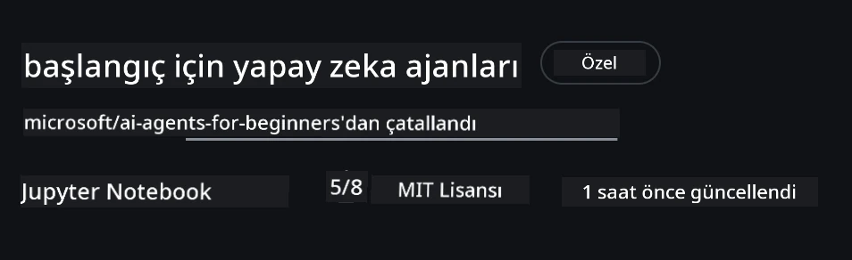

# Kurs Kurulumu

## Giriş

Bu ders, bu kursun kod örneklerini nasıl çalıştıracağınızı anlatacaktır.

## Diğer Öğrenenlere Katılın ve Yardım Alın

Depoyu klonlamaya başlamadan önce, kurulumla ilgili yardım almak, kurs hakkında sorular sormak veya diğer öğrenenlerle bağlantı kurmak için [AI Agents For Beginners Discord kanalı](https://aka.ms/ai-agents/discord)'na katılın.

## Bu Depoyu Kopyalayın veya Forklayın

Başlamak için lütfen GitHub deposunu klonlayın veya fork'layın. Bu, kodu çalıştırıp, test edip ve değiştirebilmeniz için kurs materyalinin kendi sürümünüzü oluşturur!

Bu, <a href="https://github.com/microsoft/ai-agents-for-beginners/fork" target="_blank">deponun forkunu oluştur</a> bağlantısını tıklayarak yapılabilir

Şu anda bu kursun kendi forklanmış sürümüne şu bağlantıdan sahip olmalısınız:



### Sığ Klon (çalıştay / Codespaces için önerilir)

  >Tam depo, tam geçmişi ve tüm dosyaları indirdiğinizde büyük olabilir (~3 GB). Eğer yalnızca çalıştaya katılıyorsanız veya yalnızca birkaç ders klasörüne ihtiyacınız varsa, bir sığ klon (veya bir sparse klon) geçmişi kısaltarak ve/veya blob'ları atlayarak bu indirmelerin çoğundan kaçınır.

#### Hızlı sığ klon — minimal geçmiş, tüm dosyalar

Replace `<your-username>` in the below commands with your fork URL (or the upstream URL if you prefer).

To clone only the latest commit history (small download):

```bash|powershell
git clone --depth 1 https://github.com/<your-username>/ai-agents-for-beginners.git
```

To clone a specific branch:

```bash|powershell
git clone --depth 1 --branch <branch-name> https://github.com/<your-username>/ai-agents-for-beginners.git
```

#### Kısmi (sparse) klon — minimal blob'lar + sadece seçili klasörler

This uses partial clone and sparse-checkout (requires Git 2.25+ and recommended modern Git with partial clone support):

```bash|powershell
git clone --depth 1 --filter=blob:none --sparse https://github.com/<your-username>/ai-agents-for-beginners.git
```

Traverse into the repo folder:

```bash|powershell
cd ai-agents-for-beginners
```

Then specify which folders you want (example below shows two folders):

```bash|powershell
git sparse-checkout set 00-course-setup 01-intro-to-ai-agents
```

After cloning and verifying the files, if you only need files and want to free space (no git history), please delete the repository metadata (💀irreversible — you will lose all Git functionality: no commits, pulls, pushes, or history access).

```bash
# zsh/bash
rm -rf .git
```

```powershell
# PowerShell
Remove-Item -Recurse -Force .git
```

#### GitHub Codespaces Kullanımı (yerel büyük indirmelerden kaçınmak için önerilir)

- Create a new Codespace for this repo via the [GitHub UI](https://github.com/codespaces).  

- In the terminal of the newly created codespace, run one of the shallow/sparse clone commands above to bring only the lesson folders you need into the Codespace workspace.
- Optional: after cloning inside Codespaces, remove .git to reclaim extra space (see removal commands above).
- Note: If you prefer to open the repo directly in Codespaces (without an extra clone), be aware Codespaces will construct the devcontainer environment and may still provision more than you need. Cloning a shallow copy inside a fresh Codespace gives you more control over disk usage.

#### İpuçları

- Always replace the clone URL with your fork if you want to edit/commit.
- If you later need more history or files, you can fetch them or adjust sparse-checkout to include additional folders.

## Kodu Çalıştırma

Bu kurs, AI Ajanları oluşturma konusunda uygulamalı deneyim kazanmanızı sağlayacak bir dizi Jupyter Notebook sunar.

Kod örnekleri, `AzureAIProjectAgentProvider` ile **Microsoft Agent Framework (MAF)** kullanır; bu, **Microsoft Foundry** aracılığıyla **Azure AI Agent Service V2**'ye (Responses API) bağlanır.

Tüm Python notebook'ları `*-python-agent-framework.ipynb` olarak etiketlenmiştir.

## Gereksinimler

- Python 3.12+
  - **NOT:** Eğer Python3.12 yüklü değilse, lütfen yükleyin. Ardından `requirements.txt` dosyasından doğru sürümlerin yüklendiğinden emin olmak için venv'inizi python3.12 ile oluşturun.
  
    >Örnek

    Python venv dizini oluşturun:

    ```bash|powershell
    python -m venv venv
    ```

    Ardından venv ortamını şu için etkinleştirin:

    ```bash
    # zsh/bash
    source venv/bin/activate
    ```
  
    ```dos
    # Command Prompt for Windows
    venv\Scripts\activate
    ```

- .NET 10+: .NET kullanan örnek kodlar için [.NET 10 SDK](https://dotnet.microsoft.com/download/dotnet/10.0) veya daha yenisini yüklediğinizden emin olun. Ardından yüklü .NET SDK sürümünüzü kontrol edin:

    ```bash|powershell
    dotnet --list-sdks
    ```

- **Azure CLI** — Kimlik doğrulama için gereklidir. [aka.ms/installazurecli](https://aka.ms/installazurecli) adresinden yükleyin.
- **Azure Subscription** — Microsoft Foundry ve Azure AI Agent Service erişimi için.
- **Microsoft Foundry Project** — Dağıtılmış bir modele sahip bir proje (ör. `gpt-4o`). Aşağıdaki [Adım 1](../../../00-course-setup) bölümüne bakın.

Bu depoda, kod örneklerini çalıştırmak için gerekli tüm Python paketlerini içeren bir `requirements.txt` dosyası kök dizine eklenmiştir.

Deponun kök dizininde terminalde aşağıdaki komutu çalıştırarak bunları yükleyebilirsiniz:

```bash|powershell
pip install -r requirements.txt
```

Herhangi bir çakışma ve sorunu önlemek için bir Python sanal ortamı oluşturmanızı öneririz.

## VSCode Kurulumu

VSCode'da doğru Python sürümünü kullandığınızdan emin olun.


## Microsoft Foundry ve Azure AI Agent Service'i Kurma

### Adım 1: Bir Microsoft Foundry Projesi Oluşturun

Notebook'ları çalıştırmak için dağıtılmış bir modele sahip bir Azure AI Foundry **hub**'ına ve bir **proje**'ye ihtiyacınız var.

1. [ai.azure.com](https://ai.azure.com) adresine gidin ve Azure hesabınızla oturum açın.
2. Bir **hub** oluşturun (veya mevcut bir hub kullanın). Bakınız: [Hub kaynaklarına genel bakış](https://learn.microsoft.com/azure/ai-foundry/concepts/ai-resources).
3. Hub içinde bir **proje** oluşturun.
4. **Models + Endpoints** → **Deploy model** üzerinden bir model dağıtın (ör. `gpt-4o`).

### Adım 2: Proje Uç Noktanızı ve Model Dağıtım Adını Alın

Microsoft Foundry portalındaki projenizden:

- **Proje Uç Noktası** — **Overview** sayfasına gidin ve uç nokta URL'sini kopyalayın.


- **Model Dağıtım Adı** — **Models + Endpoints**'e gidin, dağıttığınız modeli seçin ve **Dağıtım adı**'nı not edin (ör. `gpt-4o`).

### Adım 3: `az login` ile Azure'a oturum açın

Tüm notebook'lar kimlik doğrulama için **`AzureCliCredential`** kullanır — yönetilecek API anahtarı yoktur. Bu, Azure CLI ile oturum açmanızı gerektirir.

1. **Azure CLI**'yi henüz yüklemediyseniz yükleyin: [aka.ms/installazurecli](https://aka.ms/installazurecli)

2. **Oturum açın** by running:

    ```bash|powershell
    az login
    ```

    Veya uzak/Codespace ortamında bir tarayıcı yoksa:

    ```bash|powershell
    az login --use-device-code
    ```

3. İstendiğinde **aboneliğinizi seçin** — Foundry projenizi içeren aboneliği seçin.

4. Oturum açtığınızı **doğrulayın**:

    ```bash|powershell
    az account show
    ```

> **Neden `az login`?** Notebook'lar `azure-identity` paketinden `AzureCliCredential` kullanarak kimlik doğrulaması yapar. Bu, Azure CLI oturumunuzun kimlik bilgilerini sağladığı anlamına gelir — `.env` dosyanızda API anahtarları veya sırlar yoktur. Bu bir [güvenlik en iyi uygulamasıdır](https://learn.microsoft.com/azure/developer/ai/keyless-connections).

### Adım 4: `.env` Dosyanızı Oluşturun

Örnek dosyayı kopyalayın:

```bash
# zsh/bash
cp .env.example .env
```

```powershell
# PowerShell
Copy-Item .env.example .env
```

`.env` dosyasını açın ve bu iki değeri doldurun:

```env
AZURE_AI_PROJECT_ENDPOINT=https://<your-project>.services.ai.azure.com/api/projects/<your-project-id>
AZURE_AI_MODEL_DEPLOYMENT_NAME=gpt-4o
```

| Değişken | Nerede bulunur |
|----------|-----------------|
| `AZURE_AI_PROJECT_ENDPOINT` | Foundry portalı → projeniz → **Overview** sayfası |
| `AZURE_AI_MODEL_DEPLOYMENT_NAME` | Foundry portalı → **Models + Endpoints** → dağıttığınız modelin adı |

Çoğu ders için bu kadar! Notebook'lar `az login` oturumunuz aracılığıyla otomatik olarak kimlik doğrulaması yapacaktır.

### Adım 5: Python Bağımlılıklarını Yükleyin

```bash|powershell
pip install -r requirements.txt
```

Bunu daha önce oluşturduğunuz sanal ortam içinde çalıştırmanızı öneririz.

## Ders 5 için Ek Kurulum (Agentic RAG)

Ders 5, retrieval-augmented generation için **Azure AI Search** kullanır. Bu dersi çalıştırmayı planlıyorsanız `.env` dosyanıza bu değişkenleri ekleyin:

| Değişken | Nerede bulunur |
|----------|-----------------|
| `AZURE_SEARCH_SERVICE_ENDPOINT` | Azure portalı → sizin **Azure AI Search** kaynağınız → **Overview** → URL |
| `AZURE_SEARCH_API_KEY` | Azure portalı → sizin **Azure AI Search** kaynağınız → **Settings** → **Keys** → birincil yönetici anahtarı |

## Ders 6 ve Ders 8 için Ek Kurulum (GitHub Modelleri)

Ders 6 ve 8'deki bazı notebook'lar Azure AI Foundry yerine **GitHub Models** kullanır. Bu örnekleri çalıştırmayı planlıyorsanız `.env` dosyanıza bu değişkenleri ekleyin:

| Değişken | Nerede bulunur |
|----------|-----------------|
| `GITHUB_TOKEN` | GitHub → **Settings** → **Developer settings** → **Personal access tokens** |
| `GITHUB_ENDPOINT` | Use `https://models.inference.ai.azure.com` (default value) |
| `GITHUB_MODEL_ID` | Kullanılacak model adı (ör. `gpt-4o-mini`) |

## Ders 8 için Ek Kurulum (Bing Grounding İş Akışı)

Ders 8'deki koşullu iş akışı notebook'u Azure AI Foundry üzerinden **Bing grounding** kullanır. Bu örneği çalıştırmayı planlıyorsanız bu değişkeni `.env` dosyanıza ekleyin:

| Değişken | Nerede bulunur |
|----------|-----------------|
| `BING_CONNECTION_ID` | Azure AI Foundry portalı → projeniz → **Management** → **Connected resources** → Bing bağlantınız → bağlantı kimliğini kopyalayın |

## Sorun Giderme

### macOS'te SSL Sertifika Doğrulama Hataları

macOS kullanıyorsanız ve şu gibi bir hata alırsanız:

```plaintext
ssl.SSLCertVerificationError: [SSL: CERTIFICATE_VERIFY_FAILED] certificate verify failed: self-signed certificate in certificate chain
```

Bu, sistem SSL sertifikalarının otomatik olarak güvenilmeyen Python'un macOS'taki bilinen bir sorunudur. Aşağıdaki çözümleri sırayla deneyin:

**Seçenek 1: Python'un Sertifikaları Kurma betiğini çalıştırın (önerilir)**

```bash
# Yüklü Python sürümünüzle 3.XX'i değiştirin (ör. 3.12 veya 3.13):
/Applications/Python\ 3.XX/Install\ Certificates.command
```

**Seçenek 2: Notebook'unuzda `connection_verify=False` kullanın (sadece GitHub Models notebook'ları için)**

Ders 6 notebook'unda (`06-building-trustworthy-agents/code_samples/06-system-message-framework.ipynb`), zaten yorum satırı halindeki bir geçici çözüm bulunur. İstemci oluştururken `connection_verify=False` satırının yorumunu kaldırın:

```python
client = ChatCompletionsClient(
    endpoint=endpoint,
    credential=AzureKeyCredential(token),
    connection_verify=False,  # Sertifika hatalarıyla karşılaşırsanız SSL doğrulamasını devre dışı bırakın
)
```

> **⚠️ Uyarı:** SSL doğrulamasını devre dışı bırakmak (`connection_verify=False`) sertifika doğrulamasını atlayarak güvenliği azaltır. Bunu yalnızca geliştirme ortamlarında geçici bir çözüm olarak kullanın, asla üretimde kullanmayın.

**Seçenek 3: `truststore` yükleyin ve kullanın**

```bash
pip install truststore
```

Ardından ağ çağrısı yapmadan önce notebook'unuzun veya betiğinizin en üstüne aşağıdakileri ekleyin:

```python
import truststore
truststore.inject_into_ssl()
```

## Bir Yerde Takıldınız mı?

Eğer bu kurulumu çalıştırırken herhangi bir sorun yaşarsanız, <a href="https://discord.gg/kzRShWzttr" target="_blank">Azure AI Community Discord</a> kanalımıza katılın veya <a href="https://github.com/microsoft/ai-agents-for-beginners/issues?WT.mc_id=academic-105485-koreyst" target="_blank">bir issue oluşturun</a>.

## Sonraki Ders

Artık bu kursun kodlarını çalıştırmaya hazırsınız. AI Ajanları dünyası hakkında daha fazlasını öğrenirken iyi çalışmalar! 

[AI Ajanlarına Giriş ve Ajan Kullanım Durumları](../01-intro-to-ai-agents/README.md)

---

<!-- CO-OP TRANSLATOR DISCLAIMER START -->
**Sorumluluk Reddi**:
Bu belge, yapay zekâ çeviri hizmeti [Co-op Translator](https://github.com/Azure/co-op-translator) kullanılarak çevrilmiştir. Doğruluk için çaba göstersek de, otomatik çevirilerin hatalar veya yanlışlıklar içerebileceğini lütfen unutmayın. Orijinal belgenin kendi dilindeki sürümü yetkili kaynak olarak kabul edilmelidir. Kritik bilgiler için profesyonel bir insan çevirisi önerilir. Bu çevirinin kullanılması sonucu ortaya çıkabilecek herhangi bir yanlış anlama veya yanlış yorumlamadan sorumlu değiliz.
<!-- CO-OP TRANSLATOR DISCLAIMER END -->