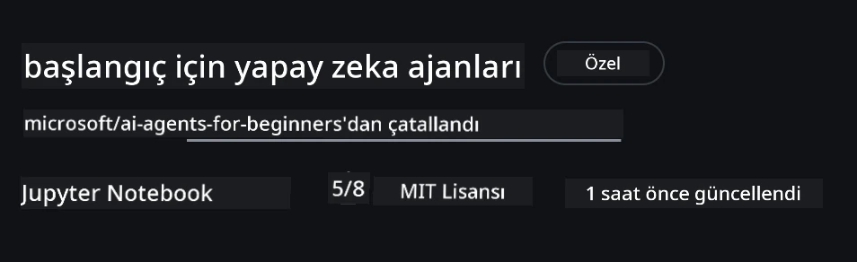
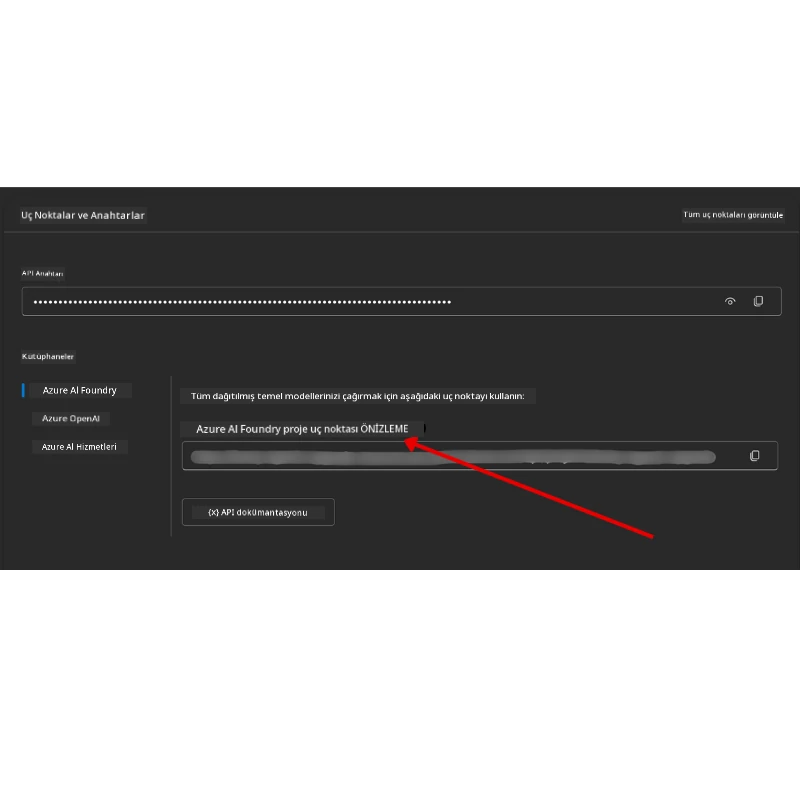

# Kurs Kurulumu

## Giriş

Bu ders, bu kursun kod örneklerinin nasıl çalıştırılacağını kapsayacaktır.

## Diğer Öğrenenlere Katılın ve Yardım Alın

Repounuzu kopyalamaya başlamadan önce, kurulumda yardım almak, kursla ilgili sorular sormak veya diğer öğrenenlerle bağlantı kurmak için [AI Agents For Beginners Discord kanalına](https://aka.ms/ai-agents/discord) katılın.

## Bu Repoyu Klonlayın veya Forklayın

Başlamak için lütfen GitHub Deposunu klonlayın veya forklayın. Bu, kodu çalıştırabilmeniz, test edebilmeniz ve değiştirebilmeniz için kurs materyalinin kendi versiyonunuzu oluşturacaktır!

Bu, <a href="https://github.com/microsoft/ai-agents-for-beginners/fork" target="_blank">depoları fork etmek</a> için bağlantıya tıklayarak yapılabilir.

Şimdi bu kursun kendi fork edilmiş versiyonuna aşağıdaki bağlantıdan sahip olmalısınız:



### Sığ Klon (atölye / Codespaces için önerilir)

  > Tüm geçmişi ve tüm dosyaları indirirken tam depo büyük olabilir (~3 GB). Sadece atölyeye katılıyorsanız veya sadece birkaç ders klasörüne ihtiyacınız varsa, sığ klon (veya seyrek klon) çok daha az indirir.

#### Hızlı sığ klon — minimum geçmiş, tüm dosyalar

Aşağıdaki komutlarda `<your-username>` yerine kendi fork URL'nizi (veya tercihinize bağlı olarak upstream URL'sini) koyun.

Sadece en son commit geçmişini klonlamak için (küçük indirme):

```bash
git clone --depth 1 https://github.com/<your-username>/ai-agents-for-beginners.git
```

Belirli bir dalı klonlamak için:

```bash
git clone --depth 1 --branch <branch-name> https://github.com/<your-username>/ai-agents-for-beginners.git
```

#### Kısmi (seyrek) klon — minimum blob + sadece seçilen klasörler

Bu kısmi klon ve seyrek checkout kullanır (Git 2.25+ gerekir ve kısmi klon desteği olan modern Git önerilir):

```bash
git clone --depth 1 --filter=blob:none --sparse https://github.com/<your-username>/ai-agents-for-beginners.git
```

Depo klasörüne gidin:

```bash
cd ai-agents-for-beginners
```

Ardından hangi klasörleri istediğinizi belirtin (aşağıdaki örnek iki klasörü gösterir):

```bash
git sparse-checkout set 00-course-setup 01-intro-to-ai-agents
```

Klonladıktan ve dosyaları doğruladıktan sonra, sadece dosyalara ihtiyacınız varsa ve alan açmak istiyorsanız (git geçmişi olmadan), lütfen depo meta verilerini silin (💀geri alınamaz — tüm Git işlevselliğini kaybedersiniz):

```bash
# zsh/bash
rm -rf .git
```

```powershell
# PowerShell
Remove-Item -Recurse -Force .git
```

#### GitHub Codespaces Kullanımı (yerel büyük indirmelerden kaçınmak için önerilir)

- Bu repo için [GitHub UI](https://github.com/codespaces) üzerinden yeni bir Codespace oluşturun.  

- Yeni oluşturulan Codespace terminalinde, sadece ihtiyacınız olan ders klasörlerini Codespace çalışma alanına getirmek için yukarıdaki sığ/seyrek klon komutlarından birini çalıştırın.
- Opsiyonel: Codespaces içinde klonladıktan sonra, alan açmak için .git'i kaldırın (yukarıdaki kaldırma komutlarına bakın).
- Not: Repo'yu doğrudan Codespaces'da açmayı tercih ederseniz (ekstra klon olmadan), Codespaces geliştirme konteyner ortamını oluşturacak ve yine de ihtiyacınız olandan fazla kaynak sağlayabilir.

#### İpuçları

- Düzenleme/commit yapmak istiyorsanız klon URL'sini her zaman kendi fork'unuzla değiştirin.
- Daha sonra daha fazla geçmiş veya dosyaya ihtiyacınız olursa, onları getirebilir veya seyrek-checkout'u ek klasörler için ayarlayabilirsiniz.

## Kodu Çalıştırma

Bu kurs, AI Ajanları oluşturma konusunda pratik yapmanız için çalıştırabileceğiniz bir dizi Jupyter Defteri sunar.

Kod örnekleri, **Microsoft Agent Framework (MAF)** ile `FoundryChatClient` kullanır; bu, **Microsoft Foundry Agent Service V2** (Responses API) aracılığıyla **Microsoft Foundry**'ye bağlanır.

Tüm Python defterleri `*-python-agent-framework.ipynb` olarak etiketlenmiştir.

## Gereksinimler

- Python 3.12+
  - **NOT:** Eğer Python3.12 yüklü değilse, kurulumunu yapın. Sonra requirements.txt dosyasından doğru sürümlerin kurulduğundan emin olmak için python3.12 ile venv'inizi oluşturun.
  
    > Örnek

    Python venv dizini oluşturun:

    ```bash
    python -m venv venv
    ```

    Sonra venv ortamını etkinleştirin:

    ```bash
    # zsh/bash
    source venv/bin/activate
    ```
  
    ```dos
    # Command Prompt for Windows
    venv\Scripts\activate
    ```

- .NET 10+: .NET kullanan örnek kodlar için, [.NET 10 SDK](https://dotnet.microsoft.com/download/dotnet/10.0) veya daha yenisini kurduğunuzdan emin olun. Sonra kurulu .NET SDK versiyonunuzu kontrol edin:

    ```bash
    dotnet --list-sdks
    ```

- **Azure CLI** — Kimlik doğrulama için gerekli. [aka.ms/installazurecli](https://aka.ms/installazurecli) adresinden yükleyin.
- **Azure Aboneliği** — Microsoft Foundry ve Microsoft Foundry Agent Service erişimi için.
- **Microsoft Foundry Projesi** — Yayınlanmış bir modele sahip bir proje (örneğin, `gpt-5-mini`). Aşağıdaki [Adım 1](#1-adım-microsoft-foundry-projesi-oluşturma) sayfasına bakın.

Bu deposunun kökünde, kod örneklerini çalıştırmak için gerekli tüm Python paketlerini içeren `requirements.txt` dosyası bulunmaktadır.

Bunları, deponun kökünde terminalde aşağıdaki komutu çalıştırarak kurabilirsiniz:

```bash
pip install -r requirements.txt
```

Çakışma ve sorunlardan kaçınmak için Python sanal ortamı oluşturmanızı öneririz.

## VSCode Kurulumu

VSCode'da doğru Python sürümünü kullandığınızdan emin olun.


## Microsoft Foundry ve Microsoft Foundry Agent Service Kurulumu

### 1. Adım: Microsoft Foundry Projesi Oluşturma

Defterleri çalıştırmak için dağıtılmış bir modele sahip bir Microsoft Foundry **hub** ve **projeye** ihtiyacınız var.

1. [ai.azure.com](https://ai.azure.com) adresine gidin ve Azure hesabınız ile oturum açın.
2. Bir **hub** oluşturun (veya mevcut birini kullanın). Bakınız: [Hub kaynakları genel bakışı](https://learn.microsoft.com/azure/ai-foundry/concepts/ai-resources).
3. Hub içinde bir **proje** oluşturun.
4. **Models + Endpoints** → **Deploy model** yoluyla bir model dağıtın (örneğin, `gpt-5-mini`).

### 2. Adım: Proje Uç Noktası ve Model Dağıtım Adını Alın

Microsoft Foundry portalındaki projenizden:

- **Proje Uç Noktası** — **Overview** sayfasına gidin ve uç nokta URL'sini kopyalayın.



- **Model Dağıtım Adı** — **Models + Endpoints**'e gidin, dağıtılmış modelinizi seçin ve **Deployment name** (örneğin, `gpt-5-mini`) not edin.

### 3. Adım: Azure’a `az login` ile Giriş Yapma

Çoğu defter, `azure-identity` paketindeki `AzureCliCredential` veya `DefaultAzureCredential` (ikisi de `az login` oturumunuzu kullanır) ile **Azure CLI oturumunuz** üzerinden kimlik doğrulaması yapar; dolayısıyla API anahtarlarına ihtiyaç yoktur. Bazı dersler ve isteğe bağlı entegrasyonlar API anahtarı kullanabilir; her dersin ön koşullarını kontrol edin. Bu, Azure CLI ile oturum açmanızı gerektirir.

1. Henüz kurmadıysanız **Azure CLI'yi yükleyin**: [aka.ms/installazurecli](https://aka.ms/installazurecli)

2. Aşağıdakini çalıştırarak **giriş yapın**:

    ```bash
    az login
    ```

    Veya tarayıcı olmayan uzak/Codespace ortamındaysanız:

    ```bash
    az login --use-device-code
    ```

3. İstenirse **aboneliğinizi seçin** — Foundry projenizi içeren aboneliği seçin.

4. Giriş yaptığınızı **doğrulayın**:

    ```bash
    az account show
    ```

> **Neden `az login`?** Defterler `azure-identity` paketindeki `AzureCliCredential` (veya `DefaultAzureCredential`) kullanarak kimlik doğrulaması yapar, böylece Azure CLI oturumunuz kimlik bilgilerini sağlar — API anahtarı veya `.env` dosyasındaki sır gerektirmez. Bu, bir [güvenlik en iyi uygulamasıdır](https://learn.microsoft.com/azure/developer/ai/keyless-connections).

### 4. Adım: `.env` Dosyanızı Oluşturun

Örnek dosyayı kopyalayın:

```bash
# zsh/bash
cp .env.example .env
```

```powershell
# PowerShell
Copy-Item .env.example .env
```

`.env` dosyasını açın ve bu iki değeri doldurun:

```env
AZURE_AI_PROJECT_ENDPOINT=https://<your-project>.services.ai.azure.com/api/projects/<your-project-id>
AZURE_AI_MODEL_DEPLOYMENT_NAME=gpt-5-mini
```

| Değişken | Nerede bulunur |
|----------|-----------------|
| `AZURE_AI_PROJECT_ENDPOINT` | Foundry portal → projeniz → **Overview** sayfası |
| `AZURE_AI_MODEL_DEPLOYMENT_NAME` | Foundry portal → **Models + Endpoints** → dağıtılan modelinizin adı |

Çoğu ders için bu kadar! Defterler `az login` oturumunuz üzerinden otomatik olarak kimlik doğrulaması yapacaktır.

### 5. Adım: Python Bağımlılıklarını Kurun

```bash
pip install -r requirements.txt
```

Bunu daha önce oluşturduğunuz sanal ortam içinde çalıştırmanız önerilir.

## İsteğe Bağlı Kurulum: Azure AI Search (Dersler 5 ve 16)

Ders 5 (Agentic RAG) ve Ders 16 defterleri, ekstra Azure kaynağı gerektirmeyen bir **bellek içi bilgi tabanı** ile çalışır. Onları gerçek bir **Azure AI Search** dizini ile desteklemek isterseniz, Ders 16 defteri şu anda **anahtarla kimlik doğrulama kullanmaktadır**: in-memory aramadan Azure AI Search’e ancak **hem** `AZURE_SEARCH_SERVICE_ENDPOINT` **ve** `AZURE_SEARCH_API_KEY` ayarlandığında geçer, yoksa bellekte kalır — gerçek bir indeks ile çalıştırmak için yönetici anahtarını da ayarlamalısınız. Kendi üretim kodunuz için, kursun diğer yerlerinde kullanılan `az login` akışına uygun anahtarsız Microsoft Entra ID (RBAC) kimlik doğrulaması önerilir.

Aşağıdaki RBAC adımları kurulum rehberi örnekleri ve kendi kodunuz için geçerlidir. Ders 16 defterinde anahtarsız kimlik doğrulamayı etkinleştirmez; Ders 16 için hem uç nokta hem de yönetici anahtarı gerekir.

1. Arama servisinize **rollere dayalı erişim** etkinleştirin:

    ```bash
    az search service update --name <service-name> --resource-group <resource-group> --auth-options aadOrApiKey
    ```

2. Kendinize gerekli rolleri **atan** (indeks oluşturma/yükleme ve sorgulama):

    ```bash
    az role assignment create --assignee <your-user-or-principal-id> --role "Search Service Contributor" --scope $(az search service show -g <resource-group> -n <service-name> --query id -o tsv)
    az role assignment create --assignee <your-user-or-principal-id> --role "Search Index Data Contributor" --scope $(az search service show -g <resource-group> -n <service-name> --query id -o tsv)
    ```

3. Uç noktayı `.env` dosyanıza **ekleyin**:

| Değişken | Nerede bulunur |
|----------|-----------------|
| `AZURE_SEARCH_SERVICE_ENDPOINT` | Azure portal → **Azure AI Search** kaynağınız → **Overview** → URL |
| `AZURE_SEARCH_API_KEY` | Ders 16 defterinin anahtarla kimlik doğrulamasını etkinleştirmek için gerekli (uç noktası ile birlikte). Azure portal → **Settings** → **Keys** → birincil yönetici anahtarı |

> **Neden anahtarsız?** Yönetici anahtarları arama servisinize tam yazma erişimi verir ve `.env` dosyalarına sızabilir. RBAC ile `az login` kimliğiniz kullanılır — kurs defterlerinin kullandığı aynı anahtarsız Entra ID modeli (`AzureCliCredential` / `DefaultAzureCredential`). Bakınız [Roller kullanarak Azure AI Search'e bağlanma](https://learn.microsoft.com/azure/search/search-security-rbac).

Python ve .NET için tam indeks oluşturma örnekleri için [Azure AI Search kurulum rehberine](./AzureSearch.md) bakın.

## Azure OpenAI’ye Doğrudan Çağrı Yapan Dersler İçin Ek Kurulum (Dersler 6 ve 8)

Ders 6 ve 8'deki bazı defterler, Microsoft Foundry projesi yerine doğrudan **Azure OpenAI'yi** (Responses API'yi kullanarak) çağırır. Bu örnekler daha önce GitHub Models kullanıyordu; bu modül artık kullanılmamaktadır ve Responses API’yi desteklemez. Aşağıdaki değişkenleri `.env` dosyanıza ekleyin:

| Değişken | Nerede bulunur |
|----------|-----------------|
| `AZURE_OPENAI_ENDPOINT` | Azure portal → **Azure OpenAI** kaynağınız → **Keys and Endpoint** → Uç Nokta (ör. `https://<your-resource>.openai.azure.com`) |
| `AZURE_OPENAI_DEPLOYMENT` | Responses API destekleyen dağıtılmış modelinizin adı (ör. `gpt-5-mini`) |
| `AZURE_OPENAI_API_KEY` | Opsiyonel — `az login` / Entra ID yerine anahtarla kimlik doğrulama kullanırsanız |

> Responses API stabil `/openai/v1/` uç noktasını kullanır, bu yüzden `api-version` gerekmez. Anahtarsız Entra ID kimlik doğrulaması için `az login` ile oturum açın.

## Alternatif Sağlayıcı: MiniMax (OpenAI Uyumlu)

[MiniMax](https://platform.minimaxi.com/) OpenAI uyumlu API aracılığıyla büyük bağlamlı modeller (204K token’a kadar) sağlar. Microsoft Agent Framework'ün `OpenAIChatClient`'ı herhangi bir OpenAI uyumlu uç noktayla çalıştığından, `OpenAIChatClient` kullanan dersler için MiniMax’ı direkt alternatif olarak kullanabilirsiniz.

Değişkenleri `.env` dosyanıza ekleyin:

| Değişken | Nerede bulunur |
|----------|-----------------|
| `MINIMAX_API_KEY` | [MiniMax Platform](https://platform.minimaxi.com/) → API Anahtarları |
| `MINIMAX_BASE_URL` | `https://api.minimax.io/v1` (varsayılan değer) kullanın |
| `MINIMAX_MODEL_ID` | Kullanılacak model adı (örneğin, `MiniMax-M3`) |

**Örnek modeller**: `MiniMax-M3` (önerilen), `MiniMax-M2.7`, `MiniMax-M2.7-highspeed` (daha hızlı yanıtlar). Model isimleri ve uygunluk zamanla değişebilir; bir modele erişiminiz hesabınıza bağlı olabilir.

`OpenAIChatClient` kullanan kod örnekleri (örneğin, Ders 14 otel rezervasyon iş akışı) `MINIMAX_API_KEY` ayarlandığında MiniMax yapılandırmanızı otomatik olarak algılar ve kullanır.


## Alternatif Sağlayıcı: Foundry Local (Modelleri Cihazda Çalıştırın)

[Foundry Local](https://foundrylocal.ai), dil modellerini **tamamen kendi makinenizde** OpenAI uyumlu bir API aracılığıyla indiren, yöneten ve sunan hafif bir çalışma zamanı ortamıdır — bulut gerektirmez.

Microsoft Agent Framework'ün `OpenAIChatClient`'ı herhangi bir OpenAI uyumlu uç noktasıyla çalıştığından, Foundry Local Azure OpenAI için yerel bir alternatif olarak kullanılabilir.

**1. Foundry Local'ı yükleyin**

```bash
# Windows
winget install Microsoft.FoundryLocal

# macOS
brew install foundrylocal
```

**2. Bir model indirin ve çalıştırın** (bu aynı zamanda yerel hizmeti de başlatır):

```bash
foundry model list          # mevcut modelleri gör
foundry model run phi-4-mini
```

**3. Yerel uç noktayı keşfetmek için kullanılan Python SDK'yı yükleyin:**

```bash
pip install foundry-local-sdk
```

**4. Microsoft Agent Framework'ü yerel modelinize yönlendirin:**

```python
from foundry_local import FoundryLocalManager
from agent_framework.openai import OpenAIChatClient

# Modeli (gerekirse) indirir ve yerel olarak sunar, ardından uç noktayı/portu keşfeder.
manager = FoundryLocalManager("phi-4-mini")

chat_client = OpenAIChatClient(
    base_url=manager.endpoint,      # örn. http://localhost:<port>/v1
    api_key=manager.api_key,        # Foundry Local için her zaman "gerekli değil"
    model_id=manager.get_model_info("phi-4-mini").id,
)

agent = chat_client.as_agent(
    name="LocalAgent",
    instructions="You are a helpful assistant running fully on-device.",
)
```

> **Not:** Foundry Local, OpenAI uyumlu bir **Chat Completions** uç noktası sağlar. Yerel geliştirme ve çevrimdışı senaryolar için kullanın. Tam **Responses API** özellik seti (durumlu konuşmalar vb.) için Azure OpenAI veya Microsoft Foundry projesini kullanın.

## Ders 8 İçin Ek Kurulum (Bing Grounding İş Akışı)

Ders 8’deki koşullu iş akışı not defteri Microsoft Foundry aracılığıyla **Bing grounding** kullanır. Bu örneği çalıştırmayı planlıyorsanız, `.env` dosyanıza aşağıdaki değişkeni ekleyin:

| Değişken | Nereden Bulunur |
|----------|-----------------|
| `BING_CONNECTION_ID` | Microsoft Foundry portalı → projeniz → **Yönetim** → **Bağlantılı kaynaklar** → Bing bağlantınız → bağlantı kimliğini kopyalayın |

## Sorun Giderme

### macOS’te SSL Sertifika Doğrulama Hataları

macOS kullanıyorsanız ve şu gibi bir hata ile karşılaşıyorsanız:

```plaintext
ssl.SSLCertVerificationError: [SSL: CERTIFICATE_VERIFY_FAILED] certificate verify failed: self-signed certificate in certificate chain
```

Bu, macOS’te Python'un sistem SSL sertifikalarının otomatik olarak güvenilir olmadığının bilinen bir sorunudur. Aşağıdaki çözümleri sırasıyla deneyin:

**Seçenek 1: Python Sertifikaları Yükleme betiğini çalıştırın (önerilen)**

```bash
# Yüklü Python sürümünüzü 3.XX ile değiştirin (örneğin, 3.12 veya 3.13):
/Applications/Python\ 3.XX/Install\ Certificates.command
```

**Seçenek 2: Notebook’unuzda `connection_verify=False` kullanın (yalnızca GitHub Modelleri not defterleri için)**

Ders 6 not defterinde (`06-building-trustworthy-agents/code_samples/06-system-message-framework.ipynb`), zaten yorum satırı halinde bir geçici çözüm bulunmaktadır. Sertifika hatalarıyla karşılaştığınızda `connection_verify=False` satırının yorumunu kaldırın:

```python
client = ChatCompletionsClient(
    endpoint=endpoint,
    credential=AzureKeyCredential(token),
    connection_verify=False,  # Sertifika hatalarıyla karşılaşırsanız SSL doğrulamayı devre dışı bırakın
)
```

> **⚠️ Uyarı:** SSL doğrulamasını devre dışı bırakmak (`connection_verify=False`), sertifika doğrulamasını atlayarak güvenliği azaltır. Bunu sadece geliştirme ortamlarında geçici bir çözüm olarak kullanın. Üretimde asla kullanmayın.

**Seçenek 3: `truststore` yükleyin ve kullanın**

```bash
pip install truststore
```

Ardından, ağ çağrıları yapmadan önce not defterinizin veya betiğinizin en üstüne aşağıdakini ekleyin:

```python
import truststore
truststore.inject_into_ssl()
```

## Bir Yerde Takıldınız Mı?

Bu kurulumu çalıştırırken herhangi bir sorun yaşarsanız, <a href="https://discord.gg/kzRShWzttr" target="_blank">Azure AI Community Discord</a>'a katılın veya <a href="https://github.com/microsoft/ai-agents-for-beginners/issues?WT.mc_id=academic-105485-koreyst" target="_blank">bir sorun oluşturun</a>.

## Sonraki Ders

Şimdi bu kursun kodunu çalıştırmaya hazırsınız. AI Ajan dünyası hakkında daha fazla bilgi edinirken iyi öğrenmeler!

[AI Ajanlarına ve Ajan Kullanım Durumlarına Giriş](../01-intro-to-ai-agents/README.md)

---

<!-- CO-OP TRANSLATOR DISCLAIMER START -->
**Feragatname**:
Bu belge, AI çeviri hizmeti [Co-op Translator](https://github.com/Azure/co-op-translator) kullanılarak çevrilmiştir. Doğruluk için çaba sarf etsek de, otomatik çevirilerin hata veya yanlışlık içerebileceğini lütfen unutmayınız. Orijinal belge, kendi dilinde yetkili kaynak olarak kabul edilmelidir. Kritik bilgiler için profesyonel insan çevirisi önerilir. Bu çevirinin kullanımı sonucu ortaya çıkabilecek yanlış anlamalardan veya yanlış yorumlamalardan sorumlu değiliz.
<!-- CO-OP TRANSLATOR DISCLAIMER END -->