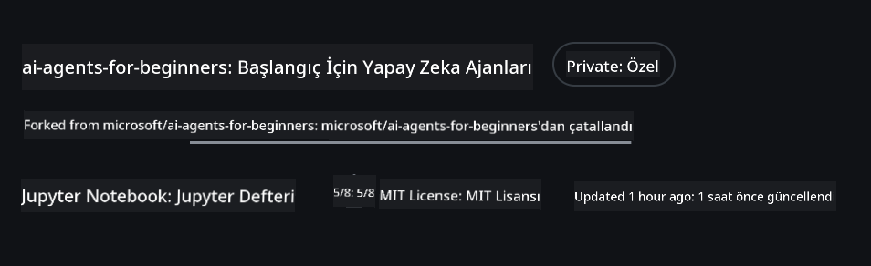
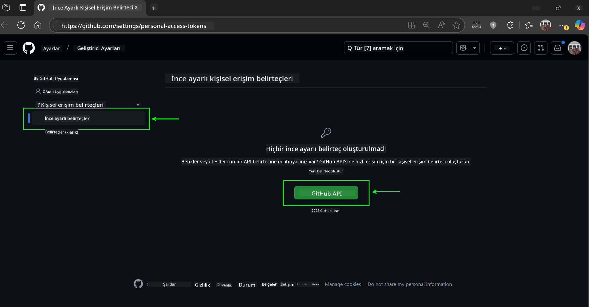
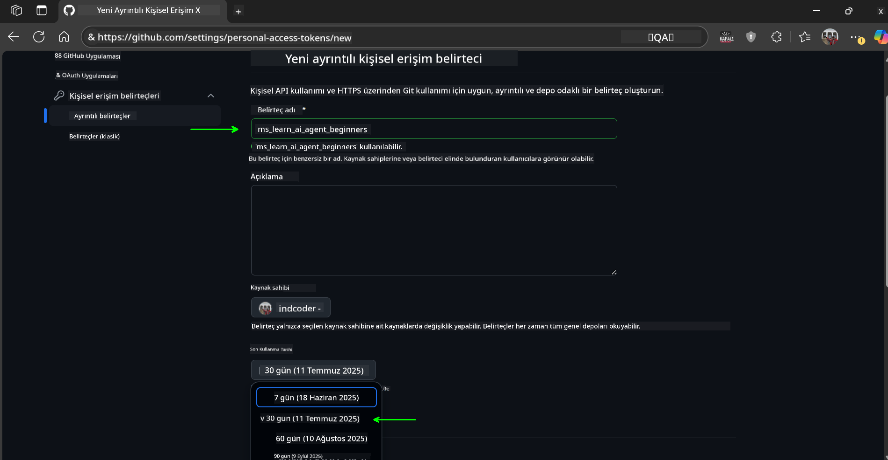
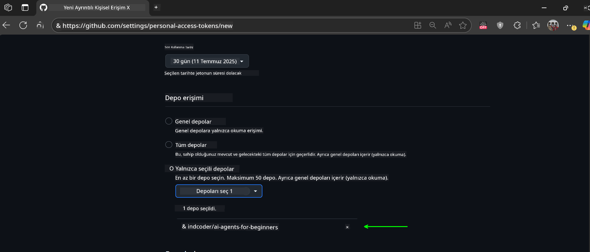
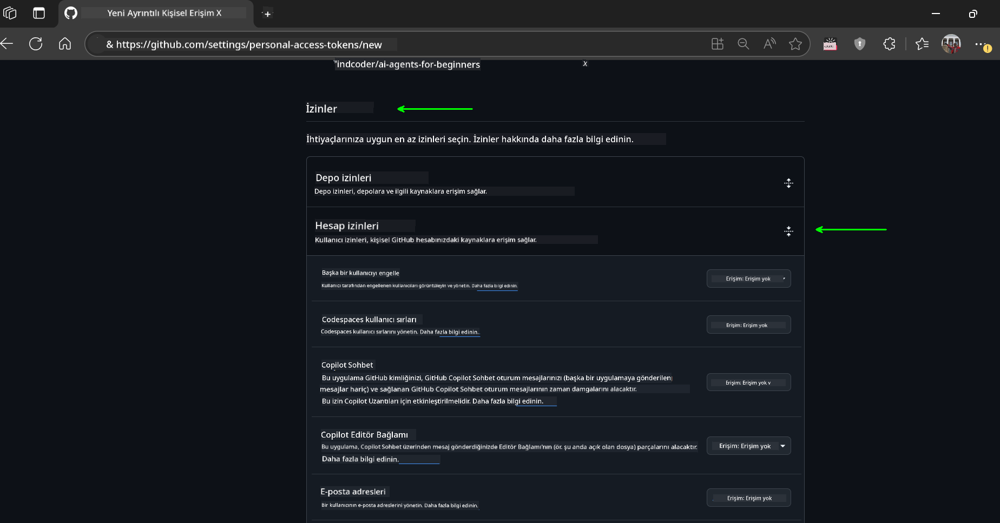
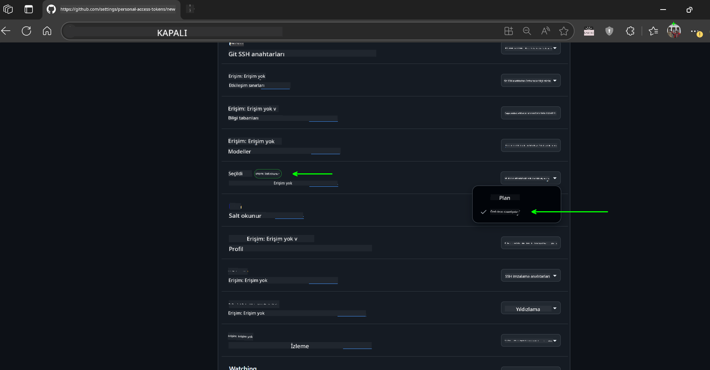
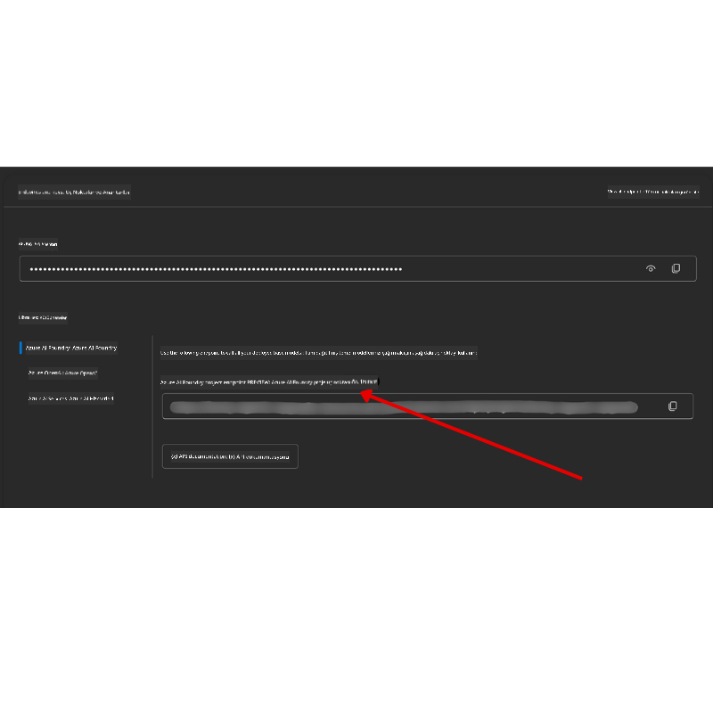

<!--
CO_OP_TRANSLATOR_METADATA:
{
  "original_hash": "c6a79c8f2b56a80370ff7e447765524f",
  "translation_date": "2025-07-24T08:20:52+00:00",
  "source_file": "00-course-setup/README.md",
  "language_code": "tr"
}
-->
# Kurs Kurulumu

## Giriş

Bu ders, kursun kod örneklerini nasıl çalıştıracağınızı ele alacaktır.

## Bu Depoyu Klonlayın veya Çatallayın

Başlamak için lütfen GitHub deposunu klonlayın veya çatallayın. Bu, kurs materyallerinin kendi versiyonunu oluşturmanızı sağlar, böylece kodu çalıştırabilir, test edebilir ve üzerinde değişiklik yapabilirsiniz!

Bunu yapmak için bağlantıya tıklayın:



## Kodun Çalıştırılması

Bu kurs, AI Ajanları oluşturma konusunda pratik deneyim kazanmanız için çalıştırabileceğiniz bir dizi Jupyter Notebook sunar.

Kod örnekleri şu seçenekleri kullanır:

**GitHub Hesabı Gerektirir - Ücretsiz**:

1) Semantic Kernel Agent Framework + GitHub Models Marketplace. Etiketli: (semantic-kernel.ipynb)
2) AutoGen Framework + GitHub Models Marketplace. Etiketli: (autogen.ipynb)

**Azure Aboneliği Gerektirir**:
3) Azure AI Foundry + Azure AI Agent Service. Etiketli: (azureaiagent.ipynb)

Üç tür örneği de denemenizi öneririz, böylece hangisinin sizin için en iyi çalıştığını görebilirsiniz.

Hangi seçeneği seçerseniz seçin, aşağıdaki kurulum adımlarını belirleyecektir:

## Gereksinimler

- Python 3.12+
  - **NOT**: Python3.12 yüklü değilse, yüklediğinizden emin olun. Ardından, requirements.txt dosyasından doğru sürümlerin yüklendiğinden emin olmak için python3.12 kullanarak sanal ortamınızı oluşturun.
- GitHub Hesabı - GitHub Models Marketplace'e erişim için
- Azure Aboneliği - Azure AI Foundry'e erişim için
- Azure AI Foundry Hesabı - Azure AI Agent Service'e erişim için

Bu depoda, kod örneklerini çalıştırmak için gereken tüm Python paketlerini içeren bir `requirements.txt` dosyası bulunmaktadır.

Bu paketleri, depo kök dizininde terminalinizde aşağıdaki komutu çalıştırarak yükleyebilirsiniz:

```bash
pip install -r requirements.txt
```
Herhangi bir çakışma ve sorun yaşamamak için bir Python sanal ortamı oluşturmanızı öneririz.

## VSCode Kurulumu
VSCode'da doğru Python sürümünü kullandığınızdan emin olun.


## GitHub Modellerini Kullanarak Örnekler için Kurulum 

### Adım 1: GitHub Kişisel Erişim Jetonunuzu (PAT) Alın

Bu kurs, GitHub Models Marketplace'i kullanır ve AI Ajanları oluşturmak için kullanacağınız Büyük Dil Modellerine (LLM'ler) ücretsiz erişim sağlar.

GitHub Modellerini kullanmak için bir [GitHub Kişisel Erişim Jetonu](https://docs.github.com/en/authentication/keeping-your-account-and-data-secure/managing-your-personal-access-tokens) oluşturmanız gerekecek.

Bunu GitHub hesabınıza giderek yapabilirsiniz.

Lütfen jetonunuzu oluştururken [En Az Ayrıcalık İlkesi](https://docs.github.com/en/get-started/learning-to-code/storing-your-secrets-safely) ilkesini takip edin. Bu, jetona yalnızca bu kurstaki kod örneklerini çalıştırmak için gereken izinleri vermeniz gerektiği anlamına gelir.

1. Ekranınızın sol tarafında `Fine-grained tokens` seçeneğini seçin.

    Ardından `Generate new token` seçeneğini seçin.

    

1. Jetonunuz için amacını yansıtan açıklayıcı bir ad girin, böylece daha sonra kolayca tanımlayabilirsiniz. Bir son kullanma tarihi belirleyin (önerilen: 30 gün; daha güvenli bir duruş için 7 gün gibi daha kısa bir süre seçebilirsiniz).

    

1. Jetonun kapsamını bu deponun çatallanmış versiyonuyla sınırlayın.

    

1. Jetonun izinlerini kısıtlayın: **Permissions** altında, **Account Permissions**'ı açın, **Models**'a gidin ve yalnızca GitHub Modelleri için gereken okuma erişimini etkinleştirin.

    

    

Yeni oluşturduğunuz jetonu kopyalayın. Şimdi bunu bu kursa dahil edilen `.env` dosyasına ekleyeceksiniz.

### Adım 2: `.env` Dosyanızı Oluşturun

`.env` dosyanızı oluşturmak için terminalinizde aşağıdaki komutu çalıştırın.

```bash
cp .env.example .env
```

Bu, örnek dosyayı kopyalayacak ve dizininizde bir `.env` dosyası oluşturacaktır. Çevre değişkenleri için değerleri buraya doldurabilirsiniz.

Jetonunuzu kopyaladıktan sonra, `.env` dosyasını favori metin düzenleyicinizde açın ve jetonunuzu `GITHUB_TOKEN` alanına yapıştırın.

Artık bu kursun kod örneklerini çalıştırabilirsiniz.

## Azure AI Foundry ve Azure AI Agent Service Kullanarak Örnekler için Kurulum

### Adım 1: Azure Proje Uç Noktanızı Alın

Azure AI Foundry'de bir hub ve proje oluşturma adımlarını takip edin: [Hub kaynakları genel bakış](https://learn.microsoft.com/en-us/azure/ai-foundry/concepts/ai-resources)

Projenizi oluşturduktan sonra, projeniz için bağlantı dizesini almanız gerekecek.

Bunu Azure AI Foundry portalındaki projenizin **Genel Bakış** sayfasına giderek yapabilirsiniz.



### Adım 2: `.env` Dosyanızı Oluşturun

`.env` dosyanızı oluşturmak için terminalinizde aşağıdaki komutu çalıştırın.

```bash
cp .env.example .env
```

Bu, örnek dosyayı kopyalayacak ve dizininizde bir `.env` dosyası oluşturacaktır. Çevre değişkenleri için değerleri buraya doldurabilirsiniz.

Jetonunuzu kopyaladıktan sonra, `.env` dosyasını favori metin düzenleyicinizde açın ve jetonunuzu `PROJECT_ENDPOINT` alanına yapıştırın.

### Adım 3: Azure'a Giriş Yapın

Bir güvenlik en iyi uygulaması olarak, Microsoft Entra ID ile Azure OpenAI'ye [anahtarsız kimlik doğrulama](https://learn.microsoft.com/azure/developer/ai/keyless-connections?tabs=csharp%2Cazure-cli?WT.mc_id=academic-105485-koreyst) kullanacağız.

Sonraki adımda, bir terminal açın ve Azure hesabınıza giriş yapmak için `az login --use-device-code` komutunu çalıştırın.

Giriş yaptıktan sonra, terminalde aboneliğinizi seçin.

## Ek Çevre Değişkenleri - Azure Search ve Azure OpenAI 

Agentic RAG Dersi - Ders 5 - Azure Search ve Azure OpenAI kullanan örnekler içerir.

Bu örnekleri çalıştırmak istiyorsanız, `.env` dosyanıza aşağıdaki çevre değişkenlerini eklemeniz gerekecek:

### Genel Bakış Sayfası (Proje)

- `AZURE_SUBSCRIPTION_ID` - Projenizin **Genel Bakış** sayfasındaki **Proje detayları** bölümünü kontrol edin.

- `AZURE_AI_PROJECT_NAME` - Projenizin **Genel Bakış** sayfasının üst kısmına bakın.

- `AZURE_OPENAI_SERVICE` - **Azure OpenAI Service** için **Dahil edilen yetenekler** sekmesinde bulun.

### Yönetim Merkezi

- `AZURE_OPENAI_RESOURCE_GROUP` - **Yönetim Merkezi**'ndeki **Genel Bakış** sayfasında **Proje özellikleri** bölümüne gidin.

- `GLOBAL_LLM_SERVICE` - **Bağlı kaynaklar** altında **Azure AI Services** bağlantı adını bulun. Listelenmemişse, **Azure portalı**'nda kaynak grubunuzdaki AI Services kaynak adını kontrol edin.

### Modeller + Uç Noktalar Sayfası

- `AZURE_OPENAI_EMBEDDING_DEPLOYMENT_NAME` - Gömme modelinizi seçin (ör. `text-embedding-ada-002`) ve model detaylarından **Dağıtım adını** not alın.

- `AZURE_OPENAI_CHAT_DEPLOYMENT_NAME` - Sohbet modelinizi seçin (ör. `gpt-4o-mini`) ve model detaylarından **Dağıtım adını** not alın.

### Azure Portalı

- `AZURE_OPENAI_ENDPOINT` - **Azure AI services**'ı bulun, üzerine tıklayın, ardından **Kaynak Yönetimi**, **Anahtarlar ve Uç Noktalar**'a gidin, "Azure OpenAI endpoints" bölümüne kadar aşağı kaydırın ve "Dil API'leri" yazan uç noktayı kopyalayın.

- `AZURE_OPENAI_API_KEY` - Aynı ekrandan, ANAHTAR 1 veya ANAHTAR 2'yi kopyalayın.

- `AZURE_SEARCH_SERVICE_ENDPOINT` - **Azure AI Search** kaynağınızı bulun, üzerine tıklayın ve **Genel Bakış** bölümünü kontrol edin.

- `AZURE_SEARCH_API_KEY` - Ardından **Ayarlar** ve **Anahtarlar** bölümüne giderek birincil veya ikincil yönetici anahtarını kopyalayın.

### Harici Web Sayfası

- `AZURE_OPENAI_API_VERSION` - [API sürüm yaşam döngüsü](https://learn.microsoft.com/en-us/azure/ai-services/openai/api-version-deprecation#latest-ga-api-release) sayfasını **En Son GA API sürümü** altında ziyaret edin.

### Anahtarsız Kimlik Doğrulama Kurulumu

Kimlik bilgilerinizi kodda sabitlemek yerine, Azure OpenAI ile anahtarsız bir bağlantı kullanacağız. Bunu yapmak için `DefaultAzureCredential`'ı içe aktaracağız ve daha sonra kimlik bilgilerini almak için `DefaultAzureCredential` fonksiyonunu çağıracağız.

```python
from azure.identity import DefaultAzureCredential, InteractiveBrowserCredential
```

## Bir Yerde Takıldınız mı?

Bu kurulumu çalıştırırken herhangi bir sorun yaşarsanız, bizimle iletişime geçin.

## Sonraki Ders

Artık bu kursun kodunu çalıştırmaya hazırsınız. AI Ajanları dünyası hakkında daha fazla şey öğrenirken iyi eğlenceler!

[AI Ajanlarına Giriş ve Ajan Kullanım Durumları](../01-intro-to-ai-agents/README.md)

**Feragatname**:  
Bu belge, AI çeviri hizmeti [Co-op Translator](https://github.com/Azure/co-op-translator) kullanılarak çevrilmiştir. Doğruluk için çaba göstersek de, otomatik çevirilerin hata veya yanlışlıklar içerebileceğini lütfen unutmayın. Belgenin orijinal dili, yetkili kaynak olarak kabul edilmelidir. Kritik bilgiler için profesyonel insan çevirisi önerilir. Bu çevirinin kullanımından kaynaklanan yanlış anlamalar veya yanlış yorumlamalar için sorumluluk kabul etmiyoruz.