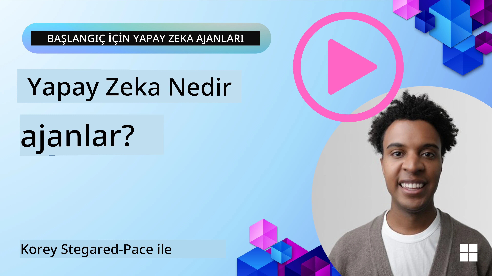
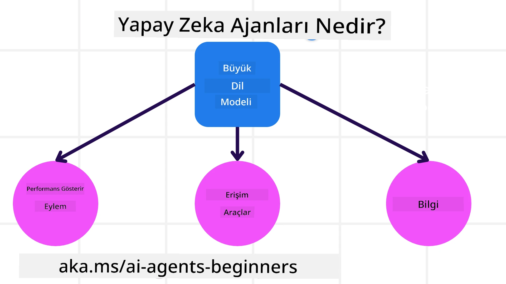
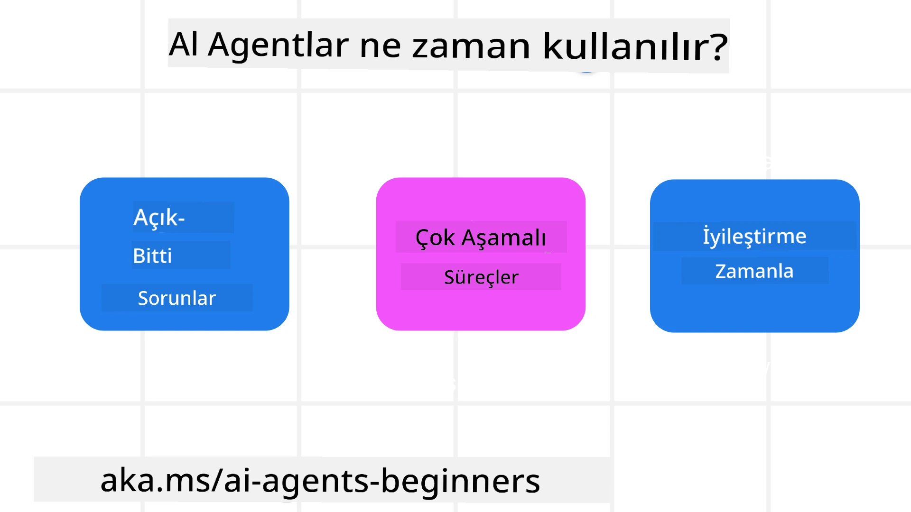

> _(Bu dersin videosunu izlemek için yukarıdaki resme tıklayın)_

# Yapay Zeka Ajanlarına ve Ajan Kullanım Senaryolarına Giriş

Welcome to the "AI Agents for Beginners" course! This course provides fundamental knowledge and applied samples for building AI Agents.

Join the <a href="https://discord.gg/kzRShWzttr" target="_blank">Azure AI Discord Topluluğu</a> to meet other learners and AI Agent Builders and ask any questions you have about this course.

To start this course, we begin by getting a better understanding of what AI Agents are and how we can use them in the applications and workflows we build.

## Giriş

This lesson covers:

- What are AI Agents and what are the different types of agents?
- What use cases are best for AI Agents and how can they help us?
- What are some of the basic building blocks when designing Agentic Solutions?

## Öğrenme Hedefleri
After completing this lesson, you should be able to:

- Understand AI Agent concepts and how they differ from other AI solutions.
- Apply AI Agents most efficiently.
- Design Agentic solutions productively for both users and customers.

## Yapay Zeka Ajanlarını Tanımlama ve Ajan Türleri

### Yapay Zeka Ajanları nedir?

AI Agents are **systems** that enable **Large Language Models(LLMs)** to **perform actions** by extending their capabilities by giving LLMs **access to tools** and **knowledge**.

Let's break this definition into smaller parts:

- **Sistem** - Ajanları sadece tek bir bileşen olarak değil, birçok bileşenden oluşan bir sistem olarak düşünmek önemlidir. Temel düzeyde, bir Yapay Zeka Ajanının bileşenleri şunlardır:
  - **Ortam** - Yapay Zeka Ajanının çalıştığı tanımlanmış alan. Örneğin, bir seyahat rezervasyon yapma ajanımız olsaydı, ortam ajanın görevleri tamamlamak için kullandığı seyahat rezervasyon sistemi olabilir.
  - **Sensörler** - Ortamların bilgisi vardır ve geri bildirim sağlar. Yapay Zeka Ajanları, ortamın mevcut durumu hakkında bu bilgiyi toplamak ve yorumlamak için sensörleri kullanır. Seyahat Rezervasyon Ajanı örneğinde, rezervasyon sistemi otel müsaitliği veya uçuş fiyatları gibi bilgiler sağlayabilir.
  - **Eyleyiciler** - Yapay Zeka Ajanı ortamın mevcut durumunu aldıktan sonra, mevcut görev için ortamı değiştirmek üzere hangi eylemi gerçekleştireceğine karar verir. Seyahat rezervasyon ajanı için bu, kullanıcı için müsait bir odayı rezerve etmek olabilir.

**Large Language Models** - Ajan kavramı LLMs'in oluşturulmasından önce de vardı. LLM'lerle Yapay Zeka Ajanları oluşturmanın avantajı, insan dilini ve verileri yorumlama yetenekleridir. Bu yetenek, LLM'lerin çevresel bilgileri yorumlamasını ve ortamı değiştirmek için bir plan tanımlamasını sağlar.

**Eylem Gerçekleştirme** - Yapay Zeka Ajanı sistemleri dışında, LLM'ler kullanıcının prompt'una dayalı içerik veya bilgi üretme eylemiyle sınırlıdır. Yapay Zeka Ajanı sistemleri içinde, LLM'ler kullanıcının isteğini yorumlayarak ve ortamlarında bulunan araçları kullanarak görevleri tamamlayabilir.

**Araçlara Erişim** - LLM'nin hangi araçlara erişimi olduğu 1) çalıştığı ortam ve 2) ajanı geliştiren kişi tarafından belirlenir. Seyahat ajanı örneğimizde, ajanın araçları rezervasyon sisteminde bulunan işlemlerle sınırlıdır ve/veya geliştirici ajanın sadece uçuşlara erişimini sınırlayabilir.

**Bellek+Bilgi** - Bellek, kullanıcı ile ajan arasındaki konuşma bağlamında kısa süreli olabilir. Uzun vadede, ortam tarafından sağlanan bilginin dışında, Yapay Zeka Ajanları diğer sistemlerden, servislerden, araçlardan ve hatta diğer ajanlardan bilgi alabilir. Seyahat ajanı örneğinde, bu bilgi müşterinin seyahat tercihleri hakkındaki bilginin müşteri veritabanında bulunması olabilir.

### Ajanların farklı türleri

Now that we have a general definition of AI Agents, let us look at some specific agent types and how they would be applied to a travel booking AI agent.

| **Agent Type**                | **Description**                                                                                                                       | **Example**                                                                                                                                                                                                                   |
| ----------------------------- | ------------------------------------------------------------------------------------------------------------------------------------- | ----------------------------------------------------------------------------------------------------------------------------------------------------------------------------------------------------------------------------- |
| **Simple Reflex Agents**      | Önceden tanımlanmış kurallara dayalı olarak anında eylemler gerçekleştirir.                                                                                  | Seyahat ajanı e-postanın bağlamını yorumlar ve seyahat şikayetlerini müşteri hizmetlerine iletir.                                                                                                                          |
| **Model-Based Reflex Agents** | Dünya modeline ve o modeldeki değişikliklere dayalı eylemler gerçekleştirir.                                                              | Seyahat ajanı, geçmiş fiyatlandırma verilerine erişim temelinde önemli fiyat değişiklikleri olan rotaları önceliklendirir.                                                                                                             |
| **Goal-Based Agents**         | Hedefi yorumlayıp hedefe ulaşmak için eylemleri belirleyerek belirli hedeflere ulaşmak için planlar oluşturur.                                  | Seyahat ajanı, geçerli konumdan varış noktasına kadar gerekli seyahat düzenlemelerini (araba, toplu taşıma, uçuşlar) belirleyerek bir yolculuk rezerve eder.                                                                                |
| **Utility-Based Agents**      | Tercihleri dikkate alır ve hedeflere nasıl ulaşılacağını belirlemek için takasları sayısal olarak tartar.                                               | Seyahat ajanı, seyahati rezerve ederken konfor ile maliyeti tartarak faydayı maksimize eder.                                                                                                                                          |
| **Learning Agents**           | Geri bildirimlere yanıt vererek ve buna göre eylemleri ayarlayarak zaman içinde gelişir.                                                        | Seyahat ajanı, seyahat sonrası anketlerden gelen müşteri geri bildirimlerini kullanarak gelecekteki rezervasyonlarda iyileştirmeler yapar.                                                                                                               |
| **Hierarchical Agents**       | Çok seviyeli bir sistemde birden fazla ajanın yer aldığı, üst düzey ajanların görevleri alt düzey ajanlar için alt görevlere böldüğü sistemler. | Seyahat ajanı, görevi alt görevlere bölerek (örneğin belirli rezervasyonları iptal etme) bir geziyi iptal eder ve alt düzey ajanlar bunları tamamlayıp üst düzey ajana rapor verir.                                     |
| **Multi-Agent Systems (MAS)** | Ajanlar görevleri bağımsız olarak, işbirlikçi veya rekabetçi şekilde tamamlar.                                                           | İşbirlikçi: Birden fazla ajan oteller, uçuşlar ve eğlence gibi belirli seyahat hizmetlerini rezerve eder. Rekabetçi: Birden fazla ajan ortak bir otel rezervasyon takviminde müşterileri otele yerleştirmek için yönetir ve rekabet eder. |

## Yapay Zeka Ajanları Ne Zaman Kullanılır?

In the earlier section, we used the Travel Agent use-case to explain how the different types of agents can be used in different scenarios of travel booking. We will continue to use this application throughout the course.

Let's look at the types of use cases that AI Agents are best used for:

- **Açık Uçlu Sorunlar** - LLM'nin bir görevi tamamlamak için gereken adımları belirlemesine izin vermek; çünkü bunlar her zaman bir iş akışına sert kodlanamaz.
- **Çok Adımlı Süreçler** - AI Ajanının tek seferlik alım yerine birden fazla tur boyunca araçları veya bilgileri kullanması gereken bir karmaşıklık düzeyi gerektiren görevler.  
- **Zaman İçinde İyileşme** - Ajanın, daha iyi fayda sağlamak için ortamından veya kullanıcılardan geri bildirim alarak zaman içinde gelişebileceği görevler.

We cover more considerations of using AI Agents in the Building Trustworthy AI Agents lesson.

## Ajanik Çözümlerin Temelleri

### Ajan Geliştirme

The first step in designing an AI Agent system is to define the tools, actions, and behaviors. In this course, we focus on using the **Azure AI Agent Service** to define our Agents. It offers features like:

- Seçim için Açık Modeller (ör. OpenAI, Mistral ve Llama)
- Tripadvisor gibi sağlayıcılar aracılığıyla lisanslı verilerin kullanımı
- Standart OpenAPI 3.0 araçlarının kullanımı

### Ajanik Desenler

LLM'lerle iletişim istemler (prompts) aracılığıyla gerçekleşir. Yapay Zeka Ajanlarının yarı otonom doğası göz önüne alındığında, ortamda bir değişiklikten sonra LLM'yi manuel olarak tekrar istemlemek her zaman mümkün veya gerekli olmayabilir. LLM'yi çok adımda daha ölçeklenebilir bir şekilde istememize olanak sağlayan **Agentic Patterns** kullanıyoruz.

This course is divided into some of the current popular Agentic patterns.

### Ajanik Çerçeveler

Ajanik Çerçeveler, geliştiricilerin ajanik desenleri kod yoluyla uygulamalarına olanak tanır. Bu çerçeveler, daha iyi AI Ajanı işbirliği için şablonlar, eklentiler ve araçlar sunar. Bu faydalar, AI Ajanı sistemlerinin daha iyi izlenebilirlik ve sorun giderme yeteneklerine sahip olmasını sağlar.

In this course, we will explore the Microsoft Agent Framework (MAF) for building production-ready AI agents.

## Örnek Kodlar

- Python: [Ajan Çerçevesi](./code_samples/01-python-agent-framework.ipynb)
- .NET: [Ajan Çerçevesi](./code_samples/01-dotnet-agent-framework.md)

## Yapay Zeka Ajanları Hakkında Daha Fazla Sorunuz mu Var?

Join the [Microsoft Foundry Discord](https://aka.ms/ai-agents/discord) to meet with other learners, attend office hours and get your AI Agents questions answered.

## Önceki Ders

[Course Setup](../00-course-setup/README.md)

## Sonraki Ders

[Ajanik Çerçeveleri Keşfetme](../02-explore-agentic-frameworks/README.md)

---

<!-- CO-OP TRANSLATOR DISCLAIMER START -->
Feragatname:
Bu belge, yapay zeka çeviri hizmeti [Co-op Translator](https://github.com/Azure/co-op-translator) kullanılarak çevrilmiştir. Doğruluk için çaba göstermemize rağmen, otomatik çevirilerin hatalar veya yanlışlıklar içerebileceğini lütfen unutmayın. Belgenin orijinal dili, yetkili kaynak olarak kabul edilmelidir. Kritik bilgiler için profesyonel insan çevirisi önerilir. Bu çevirinin kullanılması sonucu ortaya çıkabilecek herhangi bir yanlış anlama veya yanlış yorumlamadan sorumlu değiliz.
<!-- CO-OP TRANSLATOR DISCLAIMER END -->