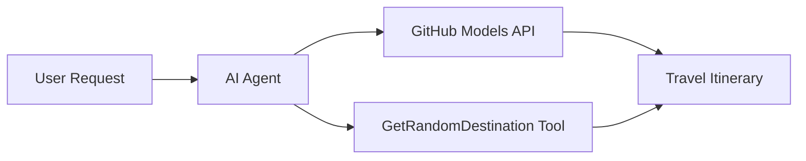

<!--
CO_OP_TRANSLATOR_METADATA:
{
  "original_hash": "23afd9be7b6ba5b69a44c3b6a78e07f6",
  "translation_date": "2025-11-06T10:04:04+00:00",
  "source_file": "01-intro-to-ai-agents/code_samples/01-dotnet-agent-framework.md",
  "language_code": "tr"
}
-->
# 🌍 Microsoft Agent Framework (.NET) ile AI Seyahat Acentası

## 📋 Senaryo Özeti

Bu not defteri, Microsoft Agent Framework for .NET kullanarak akıllı bir seyahat planlama acentası oluşturmayı gösterir. Acenta, dünya çapında rastgele destinasyonlar için kişiselleştirilmiş günlük gezi planlarını otomatik olarak oluşturabilir.

**Ana Özellikler:**
- 🎲 **Rastgele Destinasyon Seçimi**: Tatil yerlerini seçmek için özel bir araç kullanır
- 🗺️ **Akıllı Gezi Planlama**: Günlük detaylı gezi planları oluşturur
- 🔄 **Gerçek Zamanlı Akış**: Hem anlık hem de akış yanıtlarını destekler
- 🛠️ **Özel Araç Entegrasyonu**: Acenta yeteneklerini genişletmeyi gösterir

## 🔧 Teknik Mimari

### Temel Teknolojiler
- **Microsoft Agent Framework**: AI acenta geliştirme için en son .NET uygulaması
- **GitHub Modelleri Entegrasyonu**: GitHub'ın AI model çıkarım hizmetini kullanır
- **OpenAI API Uyumluluğu**: Özel uç noktalarla OpenAI istemci kütüphanelerinden yararlanır
- **Güvenli Yapılandırma**: Çevreye dayalı API anahtar yönetimi

### Ana Bileşenler
1. **AIAgent**: Konuşma akışını yöneten ana acenta düzenleyici
2. **Özel Araçlar**: Acentaya sunulan `GetRandomDestination()` fonksiyonu
3. **Sohbet İstemcisi**: GitHub Modelleri destekli konuşma arayüzü
4. **Akış Desteği**: Gerçek zamanlı yanıt oluşturma yetenekleri

### Entegrasyon Deseni


## 🚀 Başlarken

**Ön Koşullar:**
- .NET 10.0 veya üstü
- GitHub Modelleri API erişim tokeni
- `.env` dosyasında yapılandırılmış çevre değişkenleri

**Gerekli Çevre Değişkenleri:**
```env
GITHUB_TOKEN=your_github_token
GITHUB_ENDPOINT=https://models.inference.ai.azure.com
GITHUB_MODEL_ID=gpt-4o-mini
```

Aşağıdaki kod örneğini sırayla çalıştırarak seyahat acentasını iş başında görebilirsiniz!

---

## .NET Tek Dosya Uygulaması: AI Seyahat Acentası Örneği

Tam çalıştırılabilir kod örneği için `01-dotnet-agent-framework.cs` dosyasına bakın.

```bash
dotnet run 01-dotnet-agent-framework.cs
```

### Örnek Kod

```csharp
static string GetRandomDestination()
{
    var destinations = new List<string>
    {
        "Paris, France",
        "Tokyo, Japan",
        "New York City, USA",
        "Sydney, Australia",
        "Rome, Italy",
        "Barcelona, Spain",
        "Cape Town, South Africa",
        "Rio de Janeiro, Brazil",
        "Bangkok, Thailand",
        "Vancouver, Canada"
    };
    var random = new Random();
    int index = random.Next(destinations.Count);
    return destinations[index];
}

// Extract configuration from environment variables
var github_endpoint = Environment.GetEnvironmentVariable("GITHUB_ENDPOINT") ?? throw new InvalidOperationException("GITHUB_ENDPOINT is not set.");
var github_model_id = Environment.GetEnvironmentVariable("GITHUB_MODEL_ID") ?? "gpt-4o-mini";
var github_token = Environment.GetEnvironmentVariable("GITHUB_TOKEN") ?? throw new InvalidOperationException("GITHUB_TOKEN is not set.");

// Configure OpenAI Client Options
var openAIOptions = new OpenAIClientOptions()
{
    Endpoint = new Uri(github_endpoint)
};

// Initialize OpenAI Client with GitHub Models Configuration
var openAIClient = new OpenAIClient(new ApiKeyCredential(github_token), openAIOptions);

// Create AI Agent with Travel Planning Capabilities
AIAgent agent = openAIClient
    .GetChatClient(github_model_id)
    .CreateAIAgent(
        instructions: "You are a helpful AI Agent that can help plan vacations for customers at random destinations",
        tools: [AIFunctionFactory.Create(GetRandomDestination)]
    );

// Execute Agent: Plan a Day Trip (Non-Streaming)
Console.WriteLine(await agent.RunAsync("Plan me a day trip"));

// Execute Agent: Plan a Day Trip (Streaming Response)
await foreach (var update in agent.RunStreamingAsync("Plan me a day trip"))
{
    Console.Write(update);
}
```

---

**Feragatname**:  
Bu belge, AI çeviri hizmeti [Co-op Translator](https://github.com/Azure/co-op-translator) kullanılarak çevrilmiştir. Doğruluk için çaba göstersek de, otomatik çevirilerin hata veya yanlışlıklar içerebileceğini lütfen unutmayın. Belgenin orijinal dili, yetkili kaynak olarak kabul edilmelidir. Kritik bilgiler için profesyonel insan çevirisi önerilir. Bu çevirinin kullanımından kaynaklanan yanlış anlamalar veya yanlış yorumlamalar için sorumluluk kabul edilmez.