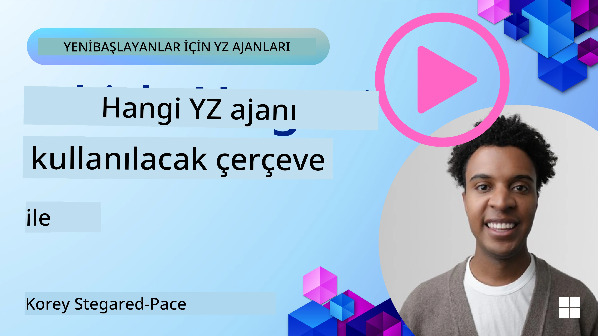

[](https://youtu.be/ODwF-EZo_O8?si=1xoy_B9RNQfrYdF7)

> _(Bu dersin videosunu izlemek için yukarıdaki görsele tıklayın)_

# AI Ajan Çerçevelerini Keşfedin

AI ajan çerçeveleri, AI ajanlarının oluşturulmasını, dağıtımını ve yönetimini basitleştirmek için tasarlanmış yazılım platformlarıdır. Bu çerçeveler, geliştiricilere karmaşık AI sistemlerinin geliştirilmesini kolaylaştıran önceden oluşturulmuş bileşenler, soyutlamalar ve araçlar sağlar.

Bu çerçeveler, geliştiricilerin AI ajan geliştirmedeki ortak zorluklara yönelik standart yaklaşımlar sunarak uygulamalarının benzersiz yönlerine odaklanmalarına yardımcı olur. Ölçeklenebilirlik, erişilebilirlik ve verimlilik açısından AI sistemleri oluşturmayı geliştirirler.

## Giriş 

Bu ders şunları kapsayacaktır:

- AI Ajan Çerçeveleri nedir ve geliştiricilerin neler yapmasını sağlar?
- Takımlar bu çerçeveleri kullanarak ajanlarının yeteneklerini nasıl hızlıca prototipleyebilir, yineleyebilir ve geliştirebilir?
- Microsoft tarafından oluşturulan çerçeveler ve araçlar arasındaki farklar nelerdir (<a href="https://aka.ms/ai-agents-beginners/ai-agent-service" target="_blank">Azure AI Agent Service</a> ve <a href="https://learn.microsoft.com/azure/ai-services/openai/how-to/responses" target="_blank">Microsoft Ajan Çerçevesi</a>)?
- Mevcut Azure ekosistem araçlarımı doğrudan entegre edebilir miyim, yoksa bağımsız çözümler mi gerekir?
- Azure AI Agents hizmeti nedir ve bu bana nasıl yardımcı oluyor?

## Öğrenme hedefleri

Bu dersin hedefleri şunları anlamanıza yardımcı olmaktır:

- AI geliştirmedeki AI Ajan Çerçevelerinin rolü.
- Akıllı ajanlar oluşturmak için AI Ajan Çerçevelerini nasıl kullanacağınız.
- AI Ajan Çerçevelerinin sağladığı temel yetenekler.
- Microsoft Ajan Çerçevesi ile Azure AI Agent Service arasındaki farklar.

## AI Ajan Çerçeveleri nedir ve geliştiricilerin neler yapmasını sağlar?

Geleneksel AI Çerçeveleri, AI’yı uygulamalarınıza entegre etmenize ve bu uygulamaları aşağıdaki şekillerde geliştirmenize yardımcı olabilir:

- **Kişiselleştirme**: AI, kullanıcı davranışını ve tercihlerini analiz ederek kişiselleştirilmiş öneriler, içerikler ve deneyimler sağlayabilir.
Örnek: Netflix gibi yayın hizmetleri, izleme geçmişine göre film ve dizi önerileri sunmak için AI kullanır; bu da kullanıcı etkileşimlerini ve memnuniyetini artırır.
- **Otomasyon ve Verimlilik**: AI, tekrarlayan görevleri otomatikleştirip iş akışlarını düzene sokarak operasyonel verimliliği artırabilir.
Örnek: Müşteri hizmetleri uygulamaları, sık sorulan soruları yanıtlamak için AI destekli chatbotlar kullanarak yanıt sürelerini kısaltır ve insan temsilcileri daha karmaşık konulara odaklanmaya olanak tanır.
- **Geliştirilmiş Kullanıcı Deneyimi**: AI, ses tanıma, doğal dil işleme ve tahmini metin gibi akıllı özellikler sunarak genel kullanıcı deneyimini artırabilir.
Örnek: Siri ve Google Assistant gibi sanal asistanlar, sesli komutları anlamak ve yanıtlamak için AI kullanarak kullanıcıların cihazlarıyla etkileşimini kolaylaştırır.

### Hepsi güzel de, peki neden AI Ajan Çerçevesine ihtiyacımız var?

AI Ajan çerçeveleri sadece AI çerçevelerinden daha fazlasını temsil eder. Bu çerçeveler, belirli hedeflere ulaşmak için kullanıcılarla, diğer ajanlarla ve çevreyle etkileşim kurabilen akıllı ajanların oluşturulmasını mümkün kılmak üzere tasarlanmıştır. Bu ajanlar özerk davranış gösterebilir, kararlar alabilir ve değişen koşullara uyum sağlayabilir. AI Ajan Çerçevelerinin sağladığı bazı temel yeteneklere bakalım:

- **Ajan İşbirliği ve Koordinasyonu**: Birden fazla AI ajanının birlikte çalışmasını, iletişim kurmasını ve koordinasyon sağlayarak karmaşık görevleri çözmesini sağlar.
- **Görev Otomasyonu ve Yönetimi**: Çok adımlı iş akışlarını otomatikleştirme, görev devri ve ajanlar arasında dinamik görev yönetimi için mekanizmalar sunar.
- **Bağlamsal Anlayış ve Uyarlanma**: Ajanları bağlamı anlama, değişen ortamlara uyum sağlama ve gerçek zamanlı bilgilere dayalı kararlar alma yeteneğiyle donatır.

Özetle, ajanlar daha fazlasını yapmanızı sağlar; otomasyonu bir sonraki seviyeye taşır; çevrelerinden öğrenebilen ve uyum sağlayabilen daha akıllı sistemler oluşturmanıza imkan verir.

## Ajanın yeteneklerini hızlıca prototipleyip yineleyip geliştirmek nasıl yapılır?

Bu alan hızla değişiyor, ancak çoğu AI Ajan Çerçevesinde modüler bileşenler, işbirliği araçları ve gerçek zamanlı öğrenme gibi hızlı prototip ve yineleme yapmanıza yardımcı olacak ortak öğeler vardır. Bunlara daha yakından bakalım:

- **Modüler Bileşenler Kullanın**: AI SDK’ları AI ve Bellek bağlayıcıları, doğal dil veya kod eklentileri aracılığıyla fonksiyon çağırma, prompt şablonları ve daha fazlası gibi önceden oluşturulmuş bileşenler sunar.
- **İşbirliği Araçlarından Yararlanın**: Ajanları belirli roller ve görevlerle tasarlayarak işbirlikçi iş akışlarını test etme ve iyileştirme imkanı sağlayın.
- **Gerçek Zamanlı Öğrenme**: Ajanların etkileşimlerden öğrenip davranışlarını dinamik olarak ayarladığı geri bildirim döngüleri uygulayın.

### Modüler Bileşenler Kullanın

Microsoft Ajan Çerçevesi gibi SDK’lar AI bağlayıcıları, araç tanımları ve ajan yönetimi gibi önceden oluşturulmuş bileşenler sunar.

**Takımlar bunları nasıl kullanabilir**: Takımlar, sıfırdan başlamak zorunda kalmadan bu bileşenleri hızla bir araya getirip işlevsel bir prototip oluşturabilir, bu da hızlı deney ve yinelemeye imkan verir.

**Uygulamada nasıl çalışır**: Kullanıcı girdisinden bilgi çıkarmak için önceden oluşturulmuş bir ayrıştırıcı, verileri saklamak ve geri getirmek için bir bellek modülü ve kullanıcılarla etkileşim kurmak için bir prompt oluşturucu kullanabilirsiniz; tüm bunlar bu bileşenleri sıfırdan inşa etmek zorunda kalmadan yapılabilir.

**Örnek kod**. Modelin kullanıcı girdisine araç çağırma ile yanıt vermesi için Microsoft Ajan Çerçevesini `AzureAIProjectAgentProvider` ile nasıl kullanabileceğinize dair bir örneğe bakalım:

``` python
# Microsoft Agent Framework Python Örneği

import asyncio
import os
from typing import Annotated

from agent_framework.azure import AzureAIProjectAgentProvider
from azure.identity import AzureCliCredential


# Seyahat rezervasyonu yapmak için örnek araç fonksiyonu tanımlayın
def book_flight(date: str, location: str) -> str:
    """Book travel given location and date."""
    return f"Travel was booked to {location} on {date}"


async def main():
    provider = AzureAIProjectAgentProvider(credential=AzureCliCredential())
    agent = await provider.create_agent(
        name="travel_agent",
        instructions="Help the user book travel. Use the book_flight tool when ready.",
        tools=[book_flight],
    )

    response = await agent.run("I'd like to go to New York on January 1, 2025")
    print(response)
    # Örnek çıktı: 1 Ocak 2025'te New York'a olan uçuşunuz başarıyla rezerve edildi. İyi yolculuklar! ✈️🗽


if __name__ == "__main__":
    asyncio.run(main())
```

Bu örnekten görebileceğiniz, kullanıcı girdisinden uçuş rezervasyonu isteğinin kalkış noktası, varış noktası ve tarihi gibi anahtar bilgileri çıkarmak için önceden oluşturulmuş bir ayrıştırıcıyı nasıl kullanabileceğinizdir. Bu modüler yaklaşım, yüksek seviyeli mantığa odaklanmanızı sağlar.

### İşbirliği Araçlarından Yararlanın

Microsoft Ajan Çerçevesi gibi çerçeveler birlikte çalışabilen birden çok ajan oluşturmayı kolaylaştırır.

**Takımlar bunları nasıl kullanabilir**: Takımlar, ajanları belirli roller ve görevlerle tasarlayarak işbirlikçi iş akışlarını test edip iyileştirebilir ve genel sistem verimliliğini artırabilir.

**Uygulamada nasıl çalışır**: Veri alma, analiz veya karar verme gibi uzmanlaşmış işlevlere sahip ajanlardan oluşan bir takım oluşturabilirsiniz. Bu ajanlar ortak bir hedefe ulaşmak için iletişim kurup bilgi paylaşabilir; örneğin bir kullanıcı sorgusunu yanıtlamak veya bir görevi tamamlamak gibi.

**Örnek kod (Microsoft Ajan Çerçevesi)**:

```python
# Microsoft Agent Framework kullanarak birlikte çalışan birden fazla temsilci oluşturma

import os
from agent_framework.azure import AzureAIProjectAgentProvider
from azure.identity import AzureCliCredential

provider = AzureAIProjectAgentProvider(credential=AzureCliCredential())

# Veri Çekme Temsilcisi
agent_retrieve = await provider.create_agent(
    name="dataretrieval",
    instructions="Retrieve relevant data using available tools.",
    tools=[retrieve_tool],
)

# Veri Analiz Temsilcisi
agent_analyze = await provider.create_agent(
    name="dataanalysis",
    instructions="Analyze the retrieved data and provide insights.",
    tools=[analyze_tool],
)

# Temsilcileri bir görev üzerinde sırayla çalıştırma
retrieval_result = await agent_retrieve.run("Retrieve sales data for Q4")
analysis_result = await agent_analyze.run(f"Analyze this data: {retrieval_result}")
print(analysis_result)
```

Önceki kodda gördüğünüz, birden fazla ajanın birlikte çalışmasını gerektiren bir görevin nasıl oluşturulabileceğidir. Her ajan belirli bir işlevi gerçekleştirir ve istenen sonucu elde etmek için ajanların koordinasyonu ile görev yürütülür. Uzmanlaşmış rollere sahip ayrılmış ajanlar oluşturarak görev verimliliğini ve performansını artırabilirsiniz.

### Gerçek Zamanlı Öğrenme

Gelişmiş çerçeveler gerçek zamanlı bağlam anlama ve uyarlanma yetenekleri sağlar.

**Takımlar bunları nasıl kullanabilir**: Takımlar, ajanların etkileşimlerden öğrenip davranışlarını dinamik olarak ayarladığı geri bildirim döngüleri uygulayarak yeteneklerin sürekli iyileştirilmesini ve rafine edilmesini sağlayabilir.

**Uygulamada nasıl çalışır**: Ajanlar kullanıcı geri bildirimlerini, çevresel verileri ve görev sonuçlarını analiz ederek bilgi tabanlarını güncelleyebilir, karar alma algoritmalarını ayarlayabilir ve zaman içinde performansı artırabilir. Bu yinelemeli öğrenme süreci ajanların değişen koşullara ve kullanıcı tercihlerini uyum sağlamasına imkan vererek genel sistem etkinliğini artırır.

## Microsoft Ajan Çerçevesi ile Azure AI Agent Service arasındaki farklar nelerdir?

Bu yaklaşımları karşılaştırmanın birçok yolu vardır; ancak tasarımları, yetenekleri ve hedef kullanım durumları açısından bazı temel farklara bakalım:

## Microsoft Ajan Çerçevesi (MAF)

Microsoft Ajan Çerçevesi, `AzureAIProjectAgentProvider` kullanarak AI ajanları oluşturmak için sadeleştirilmiş bir SDK sağlar. Geliştiricilerin Azure OpenAI modellerinden yararlanarak yerleşik araç çağırma, konuşma yönetimi ve Azure kimliği aracılığıyla kurumsal düzeyde güvenlik ile ajanlar oluşturmasına olanak tanır.

**Kullanım Durumları**: Araç kullanımı, çok adımlı iş akışları ve kurumsal entegrasyon senaryoları ile üretime hazır AI ajanları oluşturma.

Microsoft Ajan Çerçevesinin bazı önemli temel kavramları şunlardır:

- **Ajanlar**. Bir ajan `AzureAIProjectAgentProvider` aracılığıyla oluşturulur ve bir ad, talimatlar ve araçlarla yapılandırılır. Ajan:
  - **Kullanıcı mesajlarını işleyebilir** ve Azure OpenAI modellerini kullanarak yanıtlar oluşturabilir.
  - **Araçları çağırabilir** konuşma bağlamına göre otomatik olarak.
  - **Konuşma durumunu koruyabilir** birden çok etkileşim boyunca.

  Ajan oluşturmayı gösteren bir kod parçası:

    ```python
    import os
    from agent_framework.azure import AzureAIProjectAgentProvider
    from azure.identity import AzureCliCredential

    provider = AzureAIProjectAgentProvider(credential=AzureCliCredential())
    agent = await provider.create_agent(
        name="my_agent",
        instructions="You are a helpful assistant.",
    )

    response = await agent.run("Hello, World!")
    print(response)
    ```

- **Araçlar**. Çerçeve, ajanın otomatik olarak çağırabileceği Python işlevleri olarak araçların tanımlanmasını destekler. Araçlar ajanın oluşturulması sırasında kayıt edilir:

    ```python
    def get_weather(location: str) -> str:
        """Get the current weather for a location."""
        return f"The weather in {location} is sunny, 72\u00b0F."

    agent = await provider.create_agent(
        name="weather_agent",
        instructions="Help users check the weather.",
        tools=[get_weather],
    )
    ```

- **Çoklu Ajan Koordinasyonu**. Farklı uzmanlıklara sahip birden çok ajan oluşturabilir ve çalışmalarını koordine edebilirsiniz:

    ```python
    planner = await provider.create_agent(
        name="planner",
        instructions="Break down complex tasks into steps.",
    )

    executor = await provider.create_agent(
        name="executor",
        instructions="Execute the planned steps using available tools.",
        tools=[execute_tool],
    )

    plan = await planner.run("Plan a trip to Paris")
    result = await executor.run(f"Execute this plan: {plan}")
    ```

- **Azure Kimlik Entegrasyonu**. Çerçeve, güvenli ve anahtarsız kimlik doğrulama için `AzureCliCredential` (veya `DefaultAzureCredential`) kullanır; bu da API anahtarlarını doğrudan yönetme ihtiyacını ortadan kaldırır.

## Azure AI Agent Service

Azure AI Agent Service, Microsoft Ignite 2024'te tanıtılan daha yeni bir ektir. Llama 3, Mistral ve Cohere gibi açık kaynak LLM'leri doğrudan çağırmak gibi daha esnek modellerle ajan geliştirme ve dağıtımına olanak tanır.

Azure AI Agent Service daha güçlü kurumsal güvenlik mekanizmaları ve veri depolama yöntemleri sağlar, bu da onu kurumsal uygulamalar için uygun hale getirir.

Microsoft Ajan Çerçevesi ile birlikte kutudan çıktığı haliyle ajan oluşturma ve dağıtım için çalışır.

Bu hizmet şu anda Genel Önizleme aşamasındadır ve ajan oluşturmak için Python ve C# destekler.

Azure AI Agent Service Python SDK'sını kullanarak, kullanıcı tanımlı bir araçla bir ajan oluşturabiliriz:

```python
import asyncio
from azure.identity import DefaultAzureCredential
from azure.ai.projects import AIProjectClient

# Araç fonksiyonlarını tanımla
def get_specials() -> str:
    """Provides a list of specials from the menu."""
    return """
    Special Soup: Clam Chowder
    Special Salad: Cobb Salad
    Special Drink: Chai Tea
    """

def get_item_price(menu_item: str) -> str:
    """Provides the price of the requested menu item."""
    return "$9.99"


async def main() -> None:
    credential = DefaultAzureCredential()
    project_client = AIProjectClient.from_connection_string(
        credential=credential,
        conn_str="your-connection-string",
    )

    agent = project_client.agents.create_agent(
        model="gpt-4o-mini",
        name="Host",
        instructions="Answer questions about the menu.",
        tools=[get_specials, get_item_price],
    )

    thread = project_client.agents.create_thread()

    user_inputs = [
        "Hello",
        "What is the special soup?",
        "How much does that cost?",
        "Thank you",
    ]

    for user_input in user_inputs:
        print(f"# User: '{user_input}'")
        message = project_client.agents.create_message(
            thread_id=thread.id,
            role="user",
            content=user_input,
        )
        run = project_client.agents.create_and_process_run(
            thread_id=thread.id, agent_id=agent.id
        )
        messages = project_client.agents.list_messages(thread_id=thread.id)
        print(f"# Agent: {messages.data[0].content[0].text.value}")


if __name__ == "__main__":
    asyncio.run(main())
```

### Temel kavramlar

Azure AI Agent Service aşağıdaki temel kavramlara sahiptir:

- **Ajan**. Azure AI Agent Service Microsoft Foundry ile entegre olur. AI Foundry içinde bir AI Ajan, soruları yanıtlamak (RAG), eylemler gerçekleştirmek veya iş akışlarını tamamen otomatikleştirmek için kullanılabilen "akıllı" bir mikro hizmet olarak hareket eder. Bunu, üretken AI modellerinin gücünü gerçek dünya veri kaynaklarına erişmesini ve bunlarla etkileşim kurmasını sağlayan araçlarla birleştirerek başarır. İşte bir ajan örneği:

    ```python
    agent = project_client.agents.create_agent(
        model="gpt-4o-mini",
        name="my-agent",
        instructions="You are helpful agent",
        tools=code_interpreter.definitions,
        tool_resources=code_interpreter.resources,
    )
    ```

    Bu örnekte, `gpt-4o-mini` modeli, `my-agent` adı ve `You are helpful agent` talimatı ile bir ajan oluşturulmuştur. Ajan kod yorumlama görevlerini gerçekleştirmek için araçlar ve kaynaklarla donatılmıştır.

- **İletişim dizisi (thread) ve mesajlar**. İletişim dizisi başka bir önemli kavramdır. Bu, bir ajan ile kullanıcı arasındaki konuşmayı veya etkileşimi temsil eder. Dizinler, bir konuşmanın ilerlemesini izlemek, bağlam bilgisi depolamak ve etkileşimin durumunu yönetmek için kullanılabilir. İşte bir dizinin örneği:

    ```python
    thread = project_client.agents.create_thread()
    message = project_client.agents.create_message(
        thread_id=thread.id,
        role="user",
        content="Could you please create a bar chart for the operating profit using the following data and provide the file to me? Company A: $1.2 million, Company B: $2.5 million, Company C: $3.0 million, Company D: $1.8 million",
    )
    
    # Ask the agent to perform work on the thread
    run = project_client.agents.create_and_process_run(thread_id=thread.id, agent_id=agent.id)
    
    # Fetch and log all messages to see the agent's response
    messages = project_client.agents.list_messages(thread_id=thread.id)
    print(f"Messages: {messages}")
    ```

    Önceki kodda bir ileti dizisi oluşturulur. Ardından, diziye bir mesaj gönderilir. `create_and_process_run` çağrılarak ajandan dizide çalışması istenir. Son olarak, ajan yanıtını görmek için mesajlar alınır ve günlüklenir. Mesajlar, kullanıcı ile ajan arasındaki konuşmanın ilerlemesini gösterir. Ayrıca mesajların metin, resim veya dosya gibi farklı türlerde olabileceğini anlamak önemlidir; örneğin ajanın çalışması sonucunda bir resim veya metin yanıtı oluşmuş olabilir. Bir geliştirici olarak bu bilgiyi yanıtı daha ileri işlemden geçirmek veya kullanıcıya sunmak için kullanabilirsiniz.

- **Microsoft Ajan Çerçevesi ile entegrasyon**. Azure AI Agent Service, Microsoft Ajan Çerçevesi ile sorunsuz çalışır; bu da `AzureAIProjectAgentProvider` kullanarak ajan oluşturabileceğiniz ve üretim senaryoları için Agent Service aracılığıyla dağıtabileceğiniz anlamına gelir.

**Kullanım Durumları**: Azure AI Agent Service, güvenli, ölçeklenebilir ve esnek AI ajan dağıtımı gerektiren kurumsal uygulamalar için tasarlanmıştır.

## Bu yaklaşımlar arasındaki farklar nelerdir?
 
Bir örtüşme olduğu doğru, ancak tasarım, yetenekler ve hedef kullanım durumları açısından bazı temel farklar vardır:
 
- **Microsoft Ajan Çerçevesi (MAF)**: AI ajanları oluşturmak için üretime hazır bir SDK'dır. Araç çağırma, konuşma yönetimi ve Azure kimlik entegrasyonu ile ajan oluşturmak için sadeleştirilmiş bir API sağlar.
- **Azure AI Agent Service**: Ajanlar için Foundry içinde bir platform ve dağıtım servisidir. Azure OpenAI, Azure AI Search, Bing Search ve kod yürütme gibi hizmetlere yerleşik bağlantılar sunar.
 
Hangi seçeneği seçeceğinizden hala emin değil misiniz?

### Kullanım Durumları
 
Bazı yaygın kullanım durumlarını gözden geçirerek yardımcı olmaya çalışalım:
 
> Q: Üretim AI ajan uygulamaları geliştiriyorum ve hızlıca başlamak istiyorum
>
> A: Microsoft Ajan Çerçevesi harika bir seçimdir. `AzureAIProjectAgentProvider` aracılığıyla araçlar ve talimatlar tanımlamanıza olanak tanıyan basit, Pythonik bir API sağlar; birkaç satır kodla ajanlar oluşturabilirsiniz.
>
> Q: Search ve kod yürütme gibi Azure entegrasyonlarına sahip kurumsal düzeyde dağıtım ihtiyacım var
>
> A: Azure AI Agent Service en uygun olanıdır. Birden çok model, Azure AI Search, Bing Search ve Azure Functions için yerleşik yetenekler sunan bir platform servisidir. Foundry Portal'da ajanlarınızı kolayca oluşturup ölçekli bir şekilde dağıtmanızı sağlar.
 
> Q: Hâlâ karışık durumdayım, bana tek bir seçenek verin
>
> A: Ajanlarınızı oluşturmak için Microsoft Ajan Çerçevesi ile başlayın; üretimde dağıtım ve ölçeklendirme ihtiyaçlarınız olduğunda Azure AI Agent Service'i kullanın. Bu yaklaşım, ajan mantığınız üzerinde hızlı yineleme yaparken kurumsal dağıtıma net bir yol sağlar.
 
Önemli farkları bir tablo halinde özetleyelim:

| Framework | Odak | Temel Kavramlar | Kullanım Durumları |
| --- | --- | --- | --- |
| Microsoft Ajan Çerçevesi | Araç çağırma özellikli sadeleştirilmiş ajan SDK'sı | Ajanlar, Araçlar, Azure Kimlik | AI ajanları oluşturma, araç kullanımı, çok adımlı iş akışları |
| Azure AI Agent Service | Esnek modeller, kurumsal güvenlik, Kod üretimi, Araç çağırma | Modülerlik, İşbirliği, Süreç Orkestrasyonu | Güvenli, ölçeklenebilir ve esnek AI ajan dağıtımı |

## Mevcut Azure ekosistem araçlarımı doğrudan entegre edebilir miyim, yoksa bağımsız çözümler mi gerekir?
Cevap evet — mevcut Azure ekosistemi araçlarınızı özellikle Azure AI Agent Service ile doğrudan entegre edebilirsiniz; bu hizmet diğer Azure servisleriyle sorunsuz çalışacak şekilde tasarlanmıştır. Örneğin Bing, Azure AI Search ve Azure Functions'ı entegre edebilirsiniz. Ayrıca Microsoft Foundry ile de derin bir entegrasyon bulunmaktadır.

Microsoft Agent Framework ayrıca `AzureAIProjectAgentProvider` ve Azure kimliği aracılığıyla Azure servisleriyle bütünleşir; bu sayede ajan araçlarınızdan Azure servislerini doğrudan çağırabilirsiniz.

## Örnek Kodlar

- Python: [Ajan Çerçevesi](./code_samples/02-python-agent-framework.ipynb)
- .NET: [Ajan Çerçevesi](./code_samples/02-dotnet-agent-framework.md)

## AI Ajan Çerçeveleri hakkında daha fazla sorunuz mu var?

Diğer öğrenenlerle tanışmak, ofis saatlerine katılmak ve AI Ajanlarıyla ilgili sorularınızı yanıtlatmak için [Microsoft Foundry Discord](https://aka.ms/ai-agents/discord) sunucusuna katılın.

## References

- <a href="https://techcommunity.microsoft.com/blog/azure-ai-services-blog/introducing-azure-ai-agent-service/4298357" target="_blank">Azure Agent Hizmeti</a>
- <a href="https://learn.microsoft.com/azure/ai-services/openai/how-to/responses" target="_blank">Microsoft Agent Framework - Azure OpenAI Yanıtları</a>
- <a href="https://learn.microsoft.com/azure/ai-services/agents/overview" target="_blank">Azure AI Agent hizmeti</a>

## Önceki Ders

[AI Ajanlarına Giriş ve Ajan Kullanım Durumları](../01-intro-to-ai-agents/README.md)

## Sonraki Ders

[Ajanik Tasarım Desenlerini Anlamak](../03-agentic-design-patterns/README.md)

---

<!-- CO-OP TRANSLATOR DISCLAIMER START -->
Feragatname:
Bu belge, Yapay Zeka (AI) çeviri hizmeti [Co-op Translator](https://github.com/Azure/co-op-translator) kullanılarak çevrilmiştir. Doğruluk için çaba sarf etsek de, otomatik çevirilerin hatalar veya yanlışlıklar içerebileceğini lütfen unutmayın. Orijinal belge, kendi dilindeki versiyonu yetkili kaynak olarak kabul edilmelidir. Kritik bilgiler için profesyonel insan çevirisi önerilir. Bu çevirinin kullanılması sonucu ortaya çıkabilecek herhangi bir yanlış anlaşılma veya yanlış yorumlamadan sorumlu değiliz.
<!-- CO-OP TRANSLATOR DISCLAIMER END -->