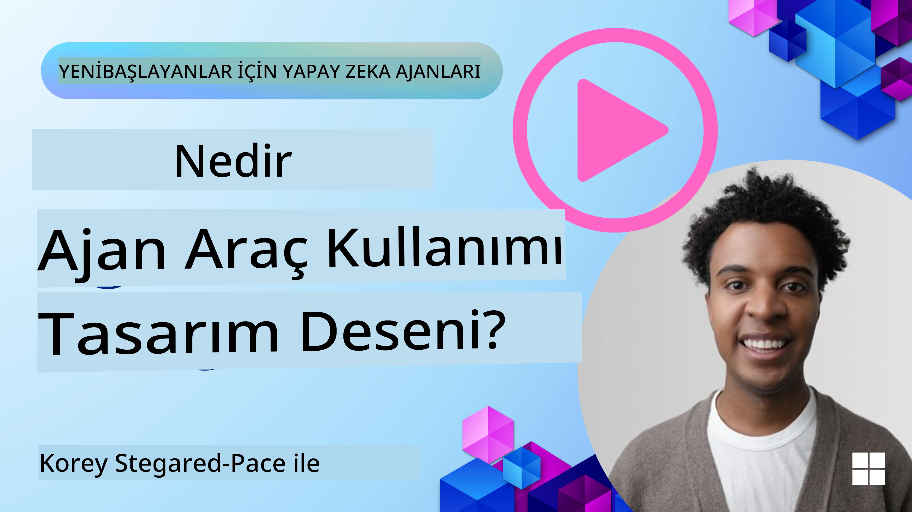
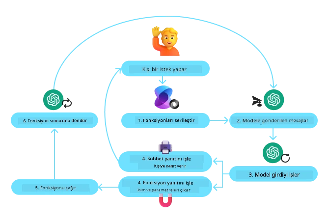
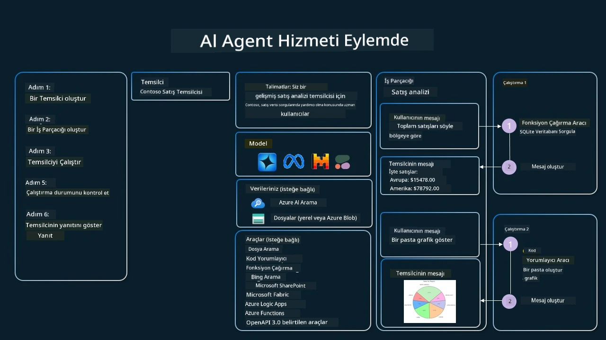

[](https://youtu.be/vieRiPRx-gI?si=cEZ8ApnT6Sus9rhn)

> _(Bu dersin videosunu izlemek için yukarıdaki görsele tıklayın)_

# Araç Kullanımı Tasarım Deseni

Araçlar ilginçtir çünkü AI ajanlarının daha geniş bir yetenek yelpazesine sahip olmasını sağlar. Ajanın gerçekleştirebileceği sınırlı bir eylem kümesi yerine, bir araç ekleyerek ajan artık çok çeşitli eylemler yapabilir. Bu bölümde, AI ajanlarının belirli araçları kullanarak hedeflerine nasıl ulaşabileceğini tanımlayan Araç Kullanımı Tasarım Deseni'ni inceleyeceğiz.

## Giriş

Bu derste aşağıdaki soruları cevaplamaya çalışıyoruz:

- Araç kullanımı tasarım deseni nedir?
- Hangi kullanım durumlarında uygulanabilir?
- Tasarım desenini uygulamak için gereken unsurlar/ yapı taşları nelerdir?
- Güvenilir AI ajanları oluşturmak için Araç Kullanımı Tasarım Deseni'nin özel değerlendirmeleri nelerdir?

## Öğrenme Hedefleri

Bu dersi tamamladıktan sonra şunları yapabileceksiniz:

- Araç Kullanımı Tasarım Deseni’ni ve amacını tanımlamak.
- Araç Kullanımı Tasarım Deseni’nin uygulanabilir olduğu kullanım durumlarını tanımlamak.
- Tasarım desenini uygulamak için gereken temel unsurları anlamak.
- Bu tasarım desenini kullanan AI ajanlarında güvenilirliği sağlamak için değerlendirmeleri fark etmek.

## Araç Kullanımı Tasarım Deseni Nedir?

**Araç Kullanımı Tasarım Deseni**, büyük dil modellerine (LLM’lere) belirli hedeflere ulaşmak için harici araçlarla etkileşime geçme yeteneği kazandırmaya odaklanır. Araçlar, bir ajan tarafından eylem gerçekleştirmek üzere çalıştırılabilen kodlardır. Bir araç, hesap makinesi gibi basit bir fonksiyon ya da hisse senedi fiyat sorgulama veya hava durumu tahmini gibi üçüncü taraf bir servise yapılan API çağrısı olabilir. AI ajanları bağlamında araçlar, **model tarafından oluşturulan fonksiyon çağrılarına** yanıt olarak ajanlar tarafından çalıştırılmak üzere tasarlanmıştır.

## Hangi kullanım durumlarında uygulanabilir?

AI Ajanları, karmaşık görevleri tamamlamak, bilgi almak veya karar vermek için araçlardan yararlanabilir. Araç kullanımı tasarım deseni, veritabanları, web servisleri veya kod yorumlayıcılar gibi harici sistemlerle dinamik etkileşim gerektiren senaryolarda sıklıkla kullanılır. Bu yetenek çeşitli farklı kullanım alanları için faydalıdır:

- **Dinamik Bilgi Alma:** Ajanlar, güncel verileri almak için harici API’leri veya veritabanlarını sorgulayabilir (örneğin, veri analizi için SQLite veritabanı sorgulama, hisse senedi fiyatları veya hava durumu bilgisi alma).
- **Kod Çalıştırma ve Yorumlama:** Ajanlar matematiksel problemleri çözmek, raporlar oluşturmak veya simülasyonlar yapmak için kod ya da komut dosyaları çalıştırabilir.
- **İş Akışı Otomasyonu:** Görev zamanlayıcıları, e-posta hizmetleri veya veri işleme hatları gibi araçları entegre ederek tekrarlanan veya çok adımlı iş akışlarını otomatikleştirmek.
- **Müşteri Desteği:** Ajanlar CRM sistemleri, destek talepleri platformları veya bilgi tabanlarıyla etkileşime geçerek kullanıcı sorgularını çözebilir.
- **İçerik Üretimi ve Düzenleme:** Dilbilgisi denetleyicileri, metin özetleyicileri veya içerik güvenliği değerlendirme araçları gibi araçlardan yararlanarak içerik oluşturma görevlerine yardımcı olmak.

## Araç kullanımı tasarım desenini uygulamak için gereken unsurlar/yapı taşları nelerdir?

Bu yapı taşları AI ajanının geniş bir görev yelpazesi gerçekleştirmesini sağlar. Araç Kullanımı Tasarım Deseni’ni uygulamak için gereken temel unsurlara bakalım:

- **Fonksiyon/Araç Şemaları**: Mevcut araçların ayrıntılı tanımları; fonksiyon adı, amacı, gereken parametreler ve beklenen çıktıların dahil olduğu bilgiler. Bu şemalar, LLM’nin hangi araçların kullanılabilir olduğunu ve geçerli isteklerin nasıl oluşturulacağını anlamasını sağlar.

- **Fonksiyon Çalıştırma Mantığı**: Araçların ne zaman ve nasıl çağrılacağını; kullanıcının niyeti ve konuşma bağlamına göre kontrol eden planlayıcı modüller, yönlendirme mekanizmaları veya koşullu akışlar içerebilir.

- **Mesaj Yönetim Sistemi**: Kullanıcı girdileri, LLM yanıtları, araç çağrıları ve araç çıktıları arasındaki konuşma akışını yöneten bileşenler.

- **Araç Entegrasyon Çerçevesi**: Basit fonksiyonlar veya karmaşık harici servisler olsun, ajanı çeşitli araçlara bağlayan altyapı.

- **Hata Yönetimi ve Doğrulama**: Araç yürütme hatalarını yönetme, parametreleri doğrulama ve beklenmeyen yanıtları yönetme mekanizmaları.

- **Durum Yönetimi**: Çok turlu etkileşimlerde tutarlılığı sağlamak için konuşma bağlamı, önceki araç etkileşimleri ve kalıcı verileri takip eder.

Şimdi Fonksiyon/Araç Çağrısını daha ayrıntılı inceleyelim.

### Fonksiyon/Araç Çağrısı

Fonksiyon çağrısı, Büyük Dil Modelleri'nin (LLM'ler) araçlarla etkileşim kurmasını sağlamak için kullanılan temel yöntemdir. 'Fonksiyon' ve 'Araç' terimlerinin sıklıkla eşanlamlı olarak kullanıldığını görürsünüz çünkü 'fonksiyonlar' (yeniden kullanılabilir kod blokları) ajanların görevleri yerine getirmek için kullandığı 'araçlardır'. Bir fonksiyonun kodunun çağrılabilmesi için, bir LLM'nin kullanıcının isteğini fonksiyon açıklamasıyla karşılaştırması gerekir. Bunun için mevcut tüm fonksiyonların açıklamalarını içeren bir şema LLM'ye gönderilir. LLM, göreve en uygun fonksiyonu seçer ve onun adını ve argümanlarını döner. Seçilen fonksiyon çağrılır, yanıtı LLM'ye iletilir ve LLM bu bilgiyi kullanıcı isteğine yanıt vermek için kullanır.

Fonksiyon çağrısını ajanlar için uygulamak isteyen geliştiricilerin ihtiyacı olanlar:

1. Fonksiyon çağrısını destekleyen bir LLM modeli
2. Fonksiyon açıklamalarını içeren bir şema
3. Tanımlanan her fonksiyonun kodu

Bir şehre ait güncel zamanın alınması örneğini kullanarak açıklayalım:

1. **Fonksiyon çağrısını destekleyen bir LLM başlatın:**

    Tüm modeller fonksiyon çağrısını desteklemez, bu yüzden kullandığınız LLM'nin desteklediğinden emin olmak önemlidir. <a href="https://learn.microsoft.com/azure/ai-services/openai/how-to/function-calling" target="_blank">Azure OpenAI</a> fonksiyon çağrısını destekler. Azure OpenAI istemcisini başlatarak başlayabiliriz.

    ```python
    # Azure OpenAI istemcisini başlat
    client = AzureOpenAI(
        azure_endpoint = os.getenv("AZURE_AI_PROJECT_ENDPOINT"), 
        api_key=os.getenv("AZURE_OPENAI_API_KEY"),  
        api_version="2024-05-01-preview"
    )
    ```

2. **Bir Fonksiyon Şeması Oluşturun:**

    Daha sonra fonksiyonun adını, fonksiyonun ne yaptığını açıklayan açıklamayı ve fonksiyon parametrelerinin isimleri ve açıklamalarını içeren bir JSON şeması tanımlayacağız.
    Bu şemayı, önceden oluşturduğumuz istemciye ve San Francisco'daki zamanın bulunması için kullanıcının isteğine ileteceğiz. Önemli olan, **araç çağrısının** döndürülmesi, sorunun nihai cevabının **değil** verilmesidir. Daha önce belirtildiği gibi, LLM görev için seçtiği fonksiyonun adını ve ona iletilecek argümanları döner.

    ```python
    # Modelin okuyabilmesi için fonksiyon açıklaması
    tools = [
        {
            "type": "function",
            "function": {
                "name": "get_current_time",
                "description": "Get the current time in a given location",
                "parameters": {
                    "type": "object",
                    "properties": {
                        "location": {
                            "type": "string",
                            "description": "The city name, e.g. San Francisco",
                        },
                    },
                    "required": ["location"],
                },
            }
        }
    ]
    ```
   
    ```python
  
    # İlk kullanıcı mesajı
    messages = [{"role": "user", "content": "What's the current time in San Francisco"}] 
  
    # İlk API çağrısı: Modelden fonksiyonu kullanmasını iste
      response = client.chat.completions.create(
          model=deployment_name,
          messages=messages,
          tools=tools,
          tool_choice="auto",
      )
  
      # Modelin yanıtını işle
      response_message = response.choices[0].message
      messages.append(response_message)
  
      print("Model's response:")  

      print(response_message)
  
    ```

    ```bash
    Model's response:
    ChatCompletionMessage(content=None, role='assistant', function_call=None, tool_calls=[ChatCompletionMessageToolCall(id='call_pOsKdUlqvdyttYB67MOj434b', function=Function(arguments='{"location":"San Francisco"}', name='get_current_time'), type='function')])
    ```
  
3. **Görevi yerine getirmek için gereken fonksiyon kodu:**

    LLM hangi fonksiyonun çalıştırılması gerektiğini seçtikten sonra, görevi yerine getiren kod uygulamaya konulmalı ve çalıştırılmalıdır.
    Şu anki zamanı Python ile alma kodunu yazabiliriz. Sonucu elde etmek için yanıt_mesajından isim ve argümanları çıkaran kodu da yazmamız gerekecek.

    ```python
      def get_current_time(location):
        """Get the current time for a given location"""
        print(f"get_current_time called with location: {location}")  
        location_lower = location.lower()
        
        for key, timezone in TIMEZONE_DATA.items():
            if key in location_lower:
                print(f"Timezone found for {key}")  
                current_time = datetime.now(ZoneInfo(timezone)).strftime("%I:%M %p")
                return json.dumps({
                    "location": location,
                    "current_time": current_time
                })
      
        print(f"No timezone data found for {location_lower}")  
        return json.dumps({"location": location, "current_time": "unknown"})
    ```

     ```python
     # Fonksiyon çağrılarını işleyin
      if response_message.tool_calls:
          for tool_call in response_message.tool_calls:
              if tool_call.function.name == "get_current_time":
     
                  function_args = json.loads(tool_call.function.arguments)
     
                  time_response = get_current_time(
                      location=function_args.get("location")
                  )
     
                  messages.append({
                      "tool_call_id": tool_call.id,
                      "role": "tool",
                      "name": "get_current_time",
                      "content": time_response,
                  })
      else:
          print("No tool calls were made by the model.")  
  
      # İkinci API çağrısı: Modelden nihai yanıtı alın
      final_response = client.chat.completions.create(
          model=deployment_name,
          messages=messages,
      )
  
      return final_response.choices[0].message.content
     ```

     ```bash
      get_current_time called with location: San Francisco
      Timezone found for san francisco
      The current time in San Francisco is 09:24 AM.
     ```

Fonksiyon Çağrısı çoğu, hatta tüm ajan araç kullanımı tasarımlarının merkezindedir; ancak sıfırdan uygulamak bazen zorlayıcı olabilir. 
[Lesson 2](../../../02-explore-agentic-frameworks) dersinde öğrendiğimiz gibi, ajan çerçeveleri araç kullanımını uygulamak için önceden hazırlanmış yapı taşları sağlar.
 
## Ajanik Çerçeveler ile Araç Kullanımı Örnekleri

Farklı ajanik çerçeveler kullanarak Araç Kullanımı Tasarım Deseni’nin nasıl uygulanabileceğine dair bazı örnekler:

### Microsoft Ajan Çerçevesi

<a href="https://learn.microsoft.com/azure/ai-services/agents/overview" target="_blank">Microsoft Ajan Çerçevesi</a>, AI ajanları oluşturmak için açık kaynaklı bir AI çerçevesidir. Araçları Python fonksiyonları olarak `@tool` dekoratörü ile tanımlamanıza izin vererek fonksiyon çağrısı sürecini basitleştirir. Çerçeve, model ile kodunuz arasında karşılıklı iletişimi yönetir. Ayrıca `AzureAIProjectAgentProvider` üzerinden Dosya Arama ve Kod Yorumlayıcı gibi önceden hazırlanmış araçlara erişim sağlar.

Aşağıdaki diyagram Microsoft Ajan Çerçevesi ile fonksiyon çağrısı sürecini gösterir:



Microsoft Ajan Çerçevesinde, araçlar dekoratörlü fonksiyonlar olarak tanımlanır. Daha önce gördüğümüz `get_current_time` fonksiyonunu `@tool` dekoratörüyle araç haline dönüştürebiliriz. Çerçeve fonksiyon ve parametrelerini otomatik olarak serileştirir ve LLM’ye gönderilecek şemayı oluşturur.

```python
from agent_framework import tool
from agent_framework.azure import AzureAIProjectAgentProvider
from azure.identity import AzureCliCredential

@tool
def get_current_time(location: str) -> str:
    """Get the current time for a given location"""
    ...

# İstemciyi oluştur
provider = AzureAIProjectAgentProvider(credential=AzureCliCredential())

# Bir ajan oluştur ve aracı ile çalıştır
agent = await provider.create_agent(name="TimeAgent", instructions="Use available tools to answer questions.", tools=get_current_time)
response = await agent.run("What time is it?")
```
  
### Azure AI Ajan Servisi

<a href="https://learn.microsoft.com/azure/ai-services/agents/overview" target="_blank">Azure AI Ajan Servisi</a>, geliştiricilerin altyapı kaynaklarını yönetmeden güvenli, yüksek kaliteli ve genişletilebilir AI ajanları oluşturmasını, dağıtmasını ve ölçeklendirmesini sağlayan daha yeni bir ajanik çerçevedir. Kurumsal uygulamalar için özellikle uygundur çünkü tamamen yönetilen, kurumsal düzeyde güvenlik sunan bir servistir.

Doğrudan LLM API ile geliştirmeye kıyasla Azure AI Agent Service şu avantajları sağlar:

- Otomatik araç çağrısı – bir araç çağrısını ayrıştırma, aracı çağırma ve yanıtı yönetme ihtiyacı yok; tüm bunlar sunucu tarafında yapılır
- Güvenli yönetilen veri – kendi konuşma durumunuzu yönetmek yerine, ihtiyacınız olan tüm bilgileri depolamak için thread’lere güvenebilirsiniz
- Kutudan çıkar çıkmaz araçlar – Bing, Azure AI Arama ve Azure Functions gibi veri kaynaklarıyla etkileşim için kullanabileceğiniz araçlar.

Azure AI Agent Service'de bulunan araçlar iki kategoriye ayrılır:

1. Bilgi Araçları:
    - <a href="https://learn.microsoft.com/azure/ai-services/agents/how-to/tools/bing-grounding?tabs=python&pivots=overview" target="_blank">Bing Arama ile Dayandırma</a>
    - <a href="https://learn.microsoft.com/azure/ai-services/agents/how-to/tools/file-search?tabs=python&pivots=overview" target="_blank">Dosya Arama</a>
    - <a href="https://learn.microsoft.com/azure/ai-services/agents/how-to/tools/azure-ai-search?tabs=azurecli%2Cpython&pivots=overview-azure-ai-search" target="_blank">Azure AI Arama</a>

2. Eylem Araçları:
    - <a href="https://learn.microsoft.com/azure/ai-services/agents/how-to/tools/function-calling?tabs=python&pivots=overview" target="_blank">Fonksiyon Çağrısı</a>
    - <a href="https://learn.microsoft.com/azure/ai-services/agents/how-to/tools/code-interpreter?tabs=python&pivots=overview" target="_blank">Kod Yorumlayıcı</a>
    - <a href="https://learn.microsoft.com/azure/ai-services/agents/how-to/tools/openapi-spec?tabs=python&pivots=overview" target="_blank">OpenAPI tanımlı araçlar</a>
    - <a href="https://learn.microsoft.com/azure/ai-services/agents/how-to/tools/azure-functions?pivots=overview" target="_blank">Azure Functions</a>

Agent Service bunları `toolset` olarak birlikte kullanabilmemizi sağlar. Ayrıca belli bir konuşmanın mesaj geçmişini takip eden `thread` yapısını kullanır.

Kendinizi Contoso adlı bir şirkette satış temsilcisi olarak hayal edin. Satış verilerinizle ilgili soruları cevaplayabilen bir sohbet ajanı geliştirmek istiyorsunuz.

Aşağıdaki görsel Azure AI Agent Service’i kullanarak satış verilerinizi nasıl analiz edebileceğinizi gösterir:



Bu servisle herhangi bir aracı kullanmak için bir istemci oluşturup bir araç veya araç seti tanımlayabiliriz. Bunu uygulamak için aşağıdaki Python kodunu kullanabiliriz. LLM araç setine bakarak kullanıcı tarafından oluşturulan `fetch_sales_data_using_sqlite_query` fonksiyonunu mu yoksa önceden hazırlanmış Kod Yorumlayıcı'yı mı kullanacağına karar verebilir.

```python 
import os
from azure.ai.projects import AIProjectClient
from azure.identity import DefaultAzureCredential
from fetch_sales_data_functions import fetch_sales_data_using_sqlite_query # fetch_sales_data_functions.py dosyasında bulunan fetch_sales_data_using_sqlite_query fonksiyonu.
from azure.ai.projects.models import ToolSet, FunctionTool, CodeInterpreterTool

project_client = AIProjectClient.from_connection_string(
    credential=DefaultAzureCredential(),
    conn_str=os.environ["PROJECT_CONNECTION_STRING"],
)

# Araç setini başlat
toolset = ToolSet()

# fetch_sales_data_using_sqlite_query fonksiyonu ile fonksiyon çağırma ajanını başlat ve araç setine ekle
fetch_data_function = FunctionTool(fetch_sales_data_using_sqlite_query)
toolset.add(fetch_data_function)

# Kod Yorumlayıcı aracını başlat ve araç setine ekle.
code_interpreter = code_interpreter = CodeInterpreterTool()
toolset.add(code_interpreter)

agent = project_client.agents.create_agent(
    model="gpt-4o-mini", name="my-agent", instructions="You are helpful agent", 
    toolset=toolset
)
```

## Güvenilir AI ajanları oluşturmak için Araç Kullanımı Tasarım Deseni kullanırken özel değerlendirmeler nelerdir?

LLM’ler tarafından dinamik olarak oluşturulan SQL ile ilgili yaygın bir endişe güvenliktir; özellikle SQL enjeksiyonu veya veritabanına zarar verme, veritabanını silme gibi kötü niyetli eylemler riski. Bu endişeler geçerli olmakla birlikte, veritabanı erişim izinlerinin doğru yapılandırılmasıyla etkin şekilde azaltılabilir. Çoğu veritabanı için veritabanını salt okunur olarak yapılandırmak gereklidir. PostgreSQL veya Azure SQL gibi veritabanı servislerinde ise uygulamanın salt okunur (SELECT) rolü atanmalıdır.

Uygulamanın güvenli bir ortamda çalıştırılması korumayı daha da artırır. Kurumsal senaryolarda, veri genellikle operasyonel sistemlerden çıkarılır, dönüştürülür ve kullanıcı dostu şemaya sahip salt okunur bir veritabanı veya veri ambarına aktarılır. Bu yaklaşım verinin güvenli, performans ve erişilebilirlik açısından optimize edilmiş olmasını sağlar ve uygulamanın sınırlı, salt okunur erişimine izin verir.

## Örnek Kodlar

- Python: [Agent Framework](./code_samples/04-python-agent-framework.ipynb)
- .NET: [Agent Framework](./code_samples/04-dotnet-agent-framework.md)

## Araç Kullanımı Tasarım Desenleri Hakkında Daha Fazla Sorunuz mu Var?

Diğer öğrenenlerle tanışmak, ofis saatlerine katılmak ve AI Ajanları sorularınızı cevaplamak için [Microsoft Foundry Discord](https://aka.ms/ai-agents/discord)'a katılın.

## Ek Kaynaklar

- <a href="https://microsoft.github.io/build-your-first-agent-with-azure-ai-agent-service-workshop/" target="_blank">Azure AI Agents Service Atölyesi</a>
- <a href="https://github.com/Azure-Samples/contoso-creative-writer/tree/main/docs/workshop" target="_blank">Contoso Creative Writer Çoklu Ajan Atölyesi</a>
- <a href="https://learn.microsoft.com/azure/ai-services/agents/overview" target="_blank">Microsoft Agent Framework Genel Bakış</a>

## Önceki Ders

[Agentik Tasarım Desenlerini Anlamak](../03-agentic-design-patterns/README.md)

## Sonraki Ders
[Ajantik RAG](../05-agentic-rag/README.md)

---

<!-- CO-OP TRANSLATOR DISCLAIMER START -->
**Feragatname**:  
Bu belge, AI çeviri hizmeti [Co-op Translator](https://github.com/Azure/co-op-translator) kullanılarak çevrilmiştir. Doğruluk için çaba göstersek de, otomatik çevirilerin hatalar veya yanlışlıklar içerebileceğini lütfen unutmayın. Orijinal belge, kendi dilindeki versiyonu ile kesin ve yetkili kaynak olarak kabul edilmelidir. Kritik bilgiler için profesyonel insan çevirisi önerilir. Bu çevirinin kullanımı sonucunda oluşabilecek yanlış anlamalar veya hatalı yorumlamalardan dolayı sorumluluk kabul edilmez.
<!-- CO-OP TRANSLATOR DISCLAIMER END -->