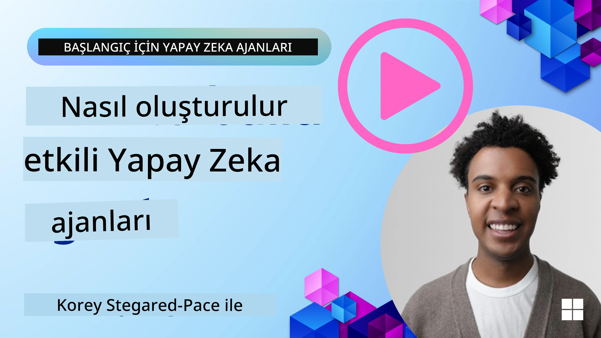
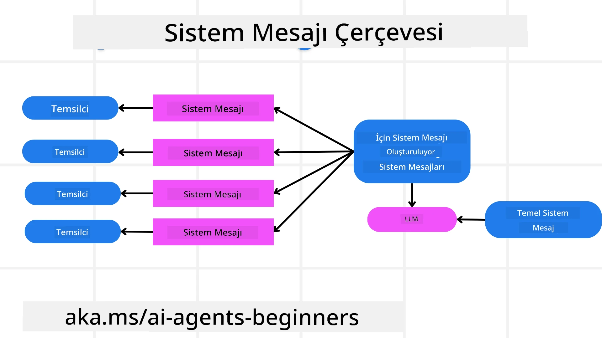
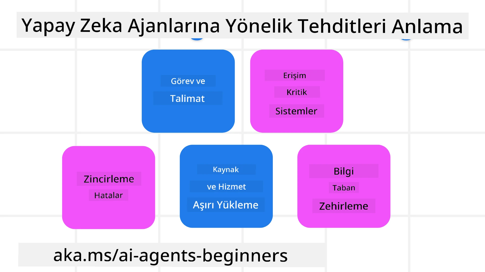
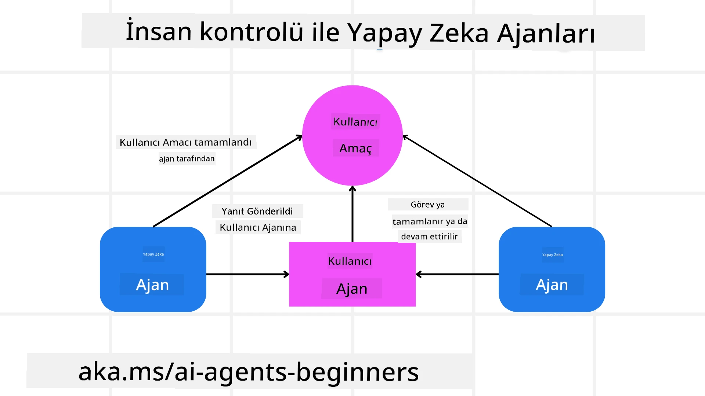

[](https://youtu.be/iZKkMEGBCUQ?si=Q-kEbcyHUMPoHp8L)

> _(Bu dersin videosunu izlemek için yukarıdaki görsele tıklayın)_

# Güvenilir AI Ajanları Oluşturmak

## Giriş

Bu ders şu konuları kapsayacaktır:

- Güvenli ve etkili AI Ajanları nasıl oluşturulur ve dağıtılır
- AI Ajanları geliştirirken önemli güvenlik hususları
- AI Ajanları geliştirirken veri ve kullanıcı gizliliğinin nasıl korunacağı

## Öğrenme Hedefleri

Bu dersi tamamladıktan sonra şunları bileceksiniz:

- AI Ajanları oluştururken riskleri nasıl tanımlayıp azaltacağınızı
- Verilerin ve erişimin doğru yönetilmesini sağlamak için güvenlik önlemlerini nasıl uygulayacağınızı
- Veri gizliliğini koruyan ve kaliteli bir kullanıcı deneyimi sunan AI Ajanları oluşturmayı

## Güvenlik

Öncelikle güvenli ajan tabanlı uygulamalar oluşturmayı ele alalım. Güvenlik, AI ajanın tasarlandığı şekilde çalışması anlamına gelir. Ajan tabanlı uygulamaların geliştiricileri olarak güvenliği maksimuma çıkarmak için yöntemlerimiz ve araçlarımız vardır:

### Sistem Mesajı Çerçevesi Oluşturmak

Eğer daha önce Büyük Dil Modelleri (LLM) kullanarak bir AI uygulaması geliştirdiyseniz, sağlam bir sistem istemi ya da sistem mesajı tasarlamanın önemini bilirsiniz. Bu istemler, LLM'nin kullanıcı ve veriyle nasıl etkileşime gireceğine dair meta kuralları, talimatları ve yönergeleri belirler.

AI Ajanlar için sistem istemi daha da önemlidir çünkü AI Ajanların, onlar için tasarladığımız görevleri tamamlamak üzere çok spesifik talimatlara ihtiyacı vardır.

Ölçeklenebilir sistem istemleri oluşturmak için, uygulamamızda bir veya daha fazla ajan oluşturmak için sistem mesajı çerçevesi kullanabiliriz:



#### Adım 1: Meta Sistem Mesajı Oluştur

Meta istem, oluşturduğumuz ajanlar için sistem istemlerini üretmek üzere bir LLM tarafından kullanılacaktır. Birden fazla ajan oluşturmayı verimli hale getirmek için bunu bir şablon olarak tasarlarız.

LLM'ye vereceğimiz bir meta sistem mesajı örneği:

```plaintext
You are an expert at creating AI agent assistants. 
You will be provided a company name, role, responsibilities and other
information that you will use to provide a system prompt for.
To create the system prompt, be descriptive as possible and provide a structure that a system using an LLM can better understand the role and responsibilities of the AI assistant. 
```

#### Adım 2: Temel bir istem oluştur

Sonraki adım, AI Ajanını tanımlayan temel bir istem oluşturmaktır. Ajanın rolünü, tamamlayacağı görevleri ve diğer sorumluluklarını içermelidir.

İşte bir örnek:

```plaintext
You are a travel agent for Contoso Travel that is great at booking flights for customers. To help customers you can perform the following tasks: lookup available flights, book flights, ask for preferences in seating and times for flights, cancel any previously booked flights and alert customers on any delays or cancellations of flights.  
```

#### Adım 3: Temel Sistem Mesajını LLM'ye Sağla

Şimdi, bu sistem mesajını optimize etmek için meta sistem mesajını sistem mesajı olarak ve temel sistem mesajımızı birlikte sağlıyoruz.

Bu, AI ajanlarımızı yönlendirmek için daha iyi tasarlanmış bir sistem mesajı üretecektir:

```markdown
**Company Name:** Contoso Travel  
**Role:** Travel Agent Assistant

**Objective:**  
You are an AI-powered travel agent assistant for Contoso Travel, specializing in booking flights and providing exceptional customer service. Your main goal is to assist customers in finding, booking, and managing their flights, all while ensuring that their preferences and needs are met efficiently.

**Key Responsibilities:**

1. **Flight Lookup:**
    
    - Assist customers in searching for available flights based on their specified destination, dates, and any other relevant preferences.
    - Provide a list of options, including flight times, airlines, layovers, and pricing.
2. **Flight Booking:**
    
    - Facilitate the booking of flights for customers, ensuring that all details are correctly entered into the system.
    - Confirm bookings and provide customers with their itinerary, including confirmation numbers and any other pertinent information.
3. **Customer Preference Inquiry:**
    
    - Actively ask customers for their preferences regarding seating (e.g., aisle, window, extra legroom) and preferred times for flights (e.g., morning, afternoon, evening).
    - Record these preferences for future reference and tailor suggestions accordingly.
4. **Flight Cancellation:**
    
    - Assist customers in canceling previously booked flights if needed, following company policies and procedures.
    - Notify customers of any necessary refunds or additional steps that may be required for cancellations.
5. **Flight Monitoring:**
    
    - Monitor the status of booked flights and alert customers in real-time about any delays, cancellations, or changes to their flight schedule.
    - Provide updates through preferred communication channels (e.g., email, SMS) as needed.

**Tone and Style:**

- Maintain a friendly, professional, and approachable demeanor in all interactions with customers.
- Ensure that all communication is clear, informative, and tailored to the customer's specific needs and inquiries.

**User Interaction Instructions:**

- Respond to customer queries promptly and accurately.
- Use a conversational style while ensuring professionalism.
- Prioritize customer satisfaction by being attentive, empathetic, and proactive in all assistance provided.

**Additional Notes:**

- Stay updated on any changes to airline policies, travel restrictions, and other relevant information that could impact flight bookings and customer experience.
- Use clear and concise language to explain options and processes, avoiding jargon where possible for better customer understanding.

This AI assistant is designed to streamline the flight booking process for customers of Contoso Travel, ensuring that all their travel needs are met efficiently and effectively.

```

#### Adım 4: İyileştir ve Tekrarla

Bu sistem mesajı çerçevesinin değeri, birden çok ajan için sistem mesajları oluşturmayı ölçeklendirmeyi kolaylaştırmak ve zaman içinde sistem mesajlarını iyileştirmektir. İlk kullanımda tam ihtiyacınıza uyan bir sistem mesajı nadiren olur. Temel sistem mesajını değiştirip sistemi çalıştırarak küçük değişiklikler ve iyileştirmeler yapabilmek, sonuçları karşılaştırıp değerlendirmeye olanak verir.

## Tehditleri Anlama

Güvenilir AI ajanları oluşturmak için, AI ajanınıza yönelik riskleri ve tehditleri anlamak ve azaltmak önemlidir. AI ajanlarına yönelik yalnızca bazı tehditlere bakalım ve bunlara nasıl daha iyi hazırlanıp planlayabileceğinizi görelim.



### Görev ve Talimat

**Tanım:** Saldırganlar, istem veya girişleri manipüle ederek AI ajanın talimatlarını ya da hedeflerini değiştirmeye çalışır.

**Azaltma:** AI Ajan tarafından işlenmeden önce potansiyel tehlikeli istemleri tespit etmek için doğrulama kontrolleri ve giriş filtreleri uygulayın. Bu tür saldırılar genellikle ajanın sık kullanımıyla gerçekleştiğinden, bir konuşmadaki tur sayısını sınırlandırmak da bu tür saldırıları önlemenin bir yoludur.

### Kritik Sistemlere Erişim

**Tanım:** Eğer bir AI ajan, hassas veri depolayan sistemlere ve servislere erişim sağlıyorsa, saldırganlar ajan ile bu servisler arasındaki iletişimi tehlikeye atabilir. Bu doğrudan saldırılar olabileceği gibi ajan üzerinden bu sistemler hakkında bilgi edinmeye yönelik dolaylı girişimler de olabilir.

**Azaltma:** Bu tür saldırıları önlemek için AI ajanlarının sistemlere yalnızca ihtiyaç duyulduğunda erişimi olmalıdır. Ajan ile sistem arasındaki iletişim de güvenli olmalıdır. Kimlik doğrulama ve erişim kontrolü uygulamak bu bilgileri korumanın bir diğer yoludur.

### Kaynak ve Servis Aşırı Yüklenmesi

**Tanım:** AI ajanları görevleri tamamlamak için çeşitli araçlar ve servislere erişebilir. Saldırganlar, AI Ajan üzerinden yüksek hacimli istekler göndererek bu servisleri saldırıya uğratabilir, bu da sistem arızalarına veya yüksek maliyetlere yol açabilir.

**Azaltma:** AI ajanın bir servise yapabileceği istek sayısını sınırlayan politikalar uygulayın. AI ajana yapılan konuşma turu ve istek sayılarını sınırlandırmak da bu tür saldırıları önlemede başka bir yöntemdir.

### Bilgi Tabanı Zehirlenmesi

**Tanım:** Bu saldırı türü AI ajanını doğrudan hedef almaz; ajan tarafından kullanılacak bilgi tabanını ve diğer servisleri hedefler. Görevlerin tamamlanmasında kullanılacak verinin ya da bilginin bozulmasını içerir; bu da kullanıcıya önyargılı veya istenmeyen yanıtlar verilmesine yol açar.

**Azaltma:** AI ajanın iş akışlarında kullanacağı verinin düzenli olarak doğrulanmasını sağlayın. Bu veriye erişimin güvenli olup yalnızca güvenilir kişiler tarafından değiştirilmesini sağlayarak bu tür saldırıları önleyin.

### Zincirleme (Kademeli) Hatalar

**Tanım:** AI ajanları görevleri tamamlamak için çeşitli araçlar ve servislere erişir. Saldırganlar tarafından oluşturulan hatalar, ajanın bağlı olduğu diğer sistemlerin arızalanmasına yol açabilir; bu da saldırının yayılmasına ve sorunların çözümünün zorlaşmasına neden olur.

**Azaltma:** Bunu önlemek için AI Ajanın sınırlı bir ortamda çalışması sağlanabilir, örneğin Docker konteyner içinde görevleri yerine getirmek, böylece doğrudan sistem saldırılarını engellemek. Belirli sistemler hata ile yanıt verdiğinde devreye giren yedek mekanizmalar ve yeniden deneme mantığı oluşturmak da daha büyük sistem arızalarını engellemenin başka bir yoludur.

## İnsan Makinede

Güvenilir AI Ajan sistemleri oluşturmanın bir diğer etkili yolu İnsan makinede (Human-in-the-loop) kullanmaktır. Bu, kullanıcıların çalışma sırasında ajanlara geri bildirim verebildiği bir akış yaratır. Kullanıcılar, çoklu ajan sisteminde ajanlar gibi hareket eder ve çalışma sürecinin onaylanması veya sonlandırılması ile müdahale ederler.



Microsoft Agent Framework kullanarak bu kavramın nasıl uygulandığını gösteren bir kod parçacığı:

```python
import os
from agent_framework.azure import AzureAIProjectAgentProvider
from azure.identity import AzureCliCredential

# İnsan onaylı sağlayıcı oluştur
provider = AzureAIProjectAgentProvider(
    credential=AzureCliCredential(),
)

# İnsan onay adımıyla ajan oluştur
response = provider.create_response(
    input="Write a 4-line poem about the ocean.",
    instructions="You are a helpful assistant. Ask for user approval before finalizing.",
)

# Kullanıcı yanıtı inceleyip onaylayabilir
print(response.output_text)
user_input = input("Do you approve? (APPROVE/REJECT): ")
if user_input == "APPROVE":
    print("Response approved.")
else:
    print("Response rejected. Revising...")
```

## Sonuç

Güvenilir AI ajanları oluşturmak, dikkatli tasarım, sağlam güvenlik önlemleri ve sürekli iyileştirme gerektirir. Yapılandırılmış meta istem sistemleri uygulayarak, potansiyel tehditleri anlayarak ve azaltma stratejileri uygulayarak geliştiriciler hem güvenli hem de etkili AI ajanlar yaratabilir. Ayrıca insan makinede yaklaşımı, AI ajanlarının kullanıcı ihtiyaçları ile uyumlu kalmasını sağlar ve riskleri minimize eder. AI gelişmeye devam ettikçe, güvenlik, gizlilik ve etik hususlarda proaktif bir tutum sürdürmek, AI tabanlı sistemlerde güven ve güvenilirliği artırmanın anahtarı olacaktır.

### Güvenilir AI Ajanları Oluşturma Hakkında Daha Fazla Sorunuz mu Var?

Diğer öğrenenlerle tanışmak, ofis saatlerine katılmak ve AI Ajanları sorularınızı sormak için [Microsoft Foundry Discord](https://aka.ms/ai-agents/discord) topluluğuna katılın.

## Ek Kaynaklar

- <a href="https://learn.microsoft.com/azure/ai-studio/responsible-use-of-ai-overview" target="_blank">Sorumlu AI genel bakış</a>
- <a href="https://learn.microsoft.com/azure/ai-studio/concepts/evaluation-approach-gen-ai" target="_blank">Üretken AI modelleri ve AI uygulamalarının değerlendirilmesi</a>
- <a href="https://learn.microsoft.com/azure/ai-services/openai/concepts/system-message?context=%2Fazure%2Fai-studio%2Fcontext%2Fcontext&tabs=top-techniques" target="_blank">Güvenlik sistem mesajları</a>
- <a href="https://blogs.microsoft.com/wp-content/uploads/prod/sites/5/2022/06/Microsoft-RAI-Impact-Assessment-Template.pdf?culture=en-us&country=us" target="_blank">Risk Değerlendirme Şablonu</a>

## Önceki Ders

[Agentic RAG](../05-agentic-rag/README.md)

## Sonraki Ders

[Planlama Tasarım Deseni](../07-planning-design/README.md)

---

<!-- CO-OP TRANSLATOR DISCLAIMER START -->
**Feragatname**:  
Bu belge, AI çeviri hizmeti [Co-op Translator](https://github.com/Azure/co-op-translator) kullanılarak çevrilmiştir. Doğruluk için çaba göstersek de, otomatik çevirilerin hatalar veya yanlışlıklar içerebileceğini lütfen unutmayınız. Orijinal belge, kendi dilinde yetkili kaynak olarak kabul edilmelidir. Önemli bilgiler için profesyonel insan çevirisi önerilir. Bu çevirinin kullanılması sonucu oluşabilecek herhangi bir yanlış anlama veya yanlış yorumlamadan sorumlu değiliz.
<!-- CO-OP TRANSLATOR DISCLAIMER END -->