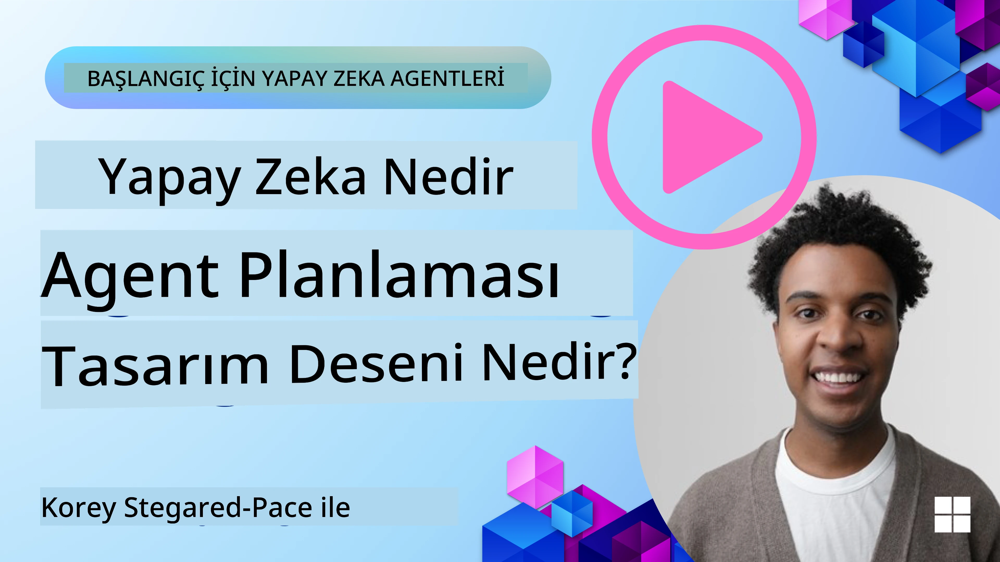
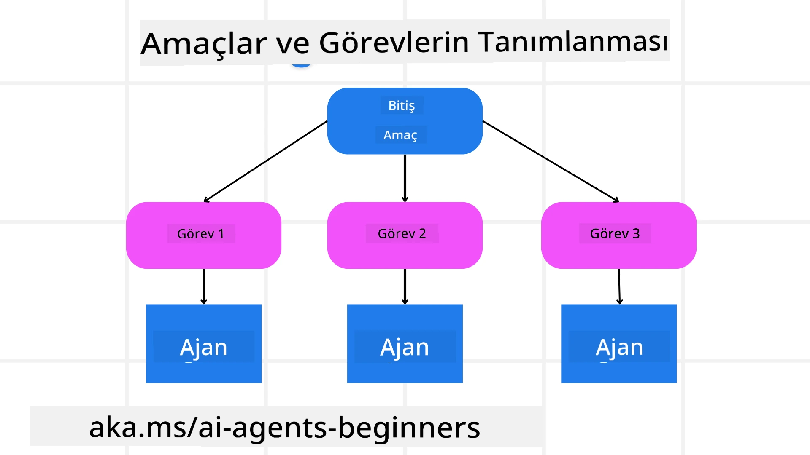

[](https://youtu.be/kPfJ2BrBCMY?si=9pYpPXp0sSbK91Dr)

> _(Bu dersin videosunu izlemek için yukarıdaki görsele tıklayın)_

# Planlama Tasarımı

## Giriş

Bu ders şu konuları kapsayacaktır

* Açık bir genel hedef tanımlamak ve karmaşık bir görevi yönetilebilir görevlere bölmek.
* Daha güvenilir ve makine tarafından okunabilir yanıtlar için yapılandırılmış çıktıyı kullanmak.
* Dinamik görevleri ve beklenmedik girdileri ele almak için olay odaklı bir yaklaşım uygulamak.

## Öğrenme Hedefleri

Bu dersi tamamladıktan sonra şunları anlayabileceksiniz:

* Bir yapay zeka ajanı için genel bir hedef belirlemek ve bu hedefin neyin başarılması gerektiğini açıkça bilmesini sağlamak.
* Karmaşık bir görevi yönetilebilir alt görevlere bölmek ve bunları mantıklı bir sıraya koymak.
* Ajanları doğru araçlarla (örneğin, arama araçları veya veri analiz araçları) donatmak, ne zaman ve nasıl kullanılacaklarına karar vermek ve ortaya çıkan beklenmedik durumları yönetmek.
* Alt görev sonuçlarını değerlendirmek, performansı ölçmek ve nihai çıktıyı iyileştirmek için eylemleri yinelemek.

## Genel Hedefin Tanımlanması ve Görevin Parçalara Ayrılması



Çoğu gerçek dünya görevi tek adımda ele alınamayacak kadar karmaşıktır. Bir yapay zeka ajanının planlamasını ve hareketlerini yönlendirecek kısa ve öz bir amacı olması gerekir. Örneğin, şu hedefi düşünün:

    "3 günlük bir seyahat programı oluştur."

Bu ifade basit olmakla birlikte hala netleştirilmesi gerekir. Hedef ne kadar net olursa, ajan (ve varsa insan işbirlikçileri) doğru sonucu elde etmeye o kadar iyi odaklanabilir; örneğin, uçak seçenekleri, otel önerileri ve etkinlik tavsiyeleri içeren kapsamlı bir program oluşturmak gibi.

### Görevin Parçalara Ayrılması

Büyük veya karmaşık görevler, daha küçük ve hedef odaklı alt görevlere bölündüğünde daha yönetilebilir hale gelir.
Seyahat programı örneğinde, hedef şu alt görevlere bölünebilir:

* Uçak Rezervasyonu
* Otel Rezervasyonu
* Araç Kiralama
* Kişiselleştirme

Her alt görev, özel ajanlar veya süreçler tarafından ele alınabilir. Örneğin bir ajan en iyi uçak fırsatlarını aramakta uzmanlaşabilir, bir diğeri otel rezervasyonlarına odaklanır ve benzeri. Koordinatör veya “aşağı akış” ajanı bu sonuçları son kullanıcıya tek bir uyumlu program halinde derleyebilir.

Bu modüler yaklaşım aynı zamanda kademeli geliştirmelere de olanak tanır. Örneğin, Yemek Önerileri veya Yerel Etkinlik Tavsiyeleri için özel ajanlar ekleyebilir ve programı zamanla iyileştirebilirsiniz.

### Yapılandırılmış çıktılar

Büyük Dil Modelleri (LLM’ler), aşağı akış ajanları veya servislerin daha kolay ayrıştırıp işleyebileceği yapılandırılmış çıktı (örneğin JSON) üretilebilir. Bu, planlama çıktısı alındıktan sonra bu görevlerin harekete geçirilmesi gereken çok ajanlı bağlamlarda özellikle faydalıdır.

Aşağıdaki Python kodu, bir planlayıcı ajanın bir hedefi alt görevlere bölmesi ve yapılandırılmış bir plan oluşturmasını göstermektedir:

```python
from pydantic import BaseModel
from enum import Enum
from typing import List, Optional, Union
import json
import os
from typing import Optional
from pprint import pprint
from agent_framework.azure import AzureAIProjectAgentProvider
from azure.identity import AzureCliCredential

class AgentEnum(str, Enum):
    FlightBooking = "flight_booking"
    HotelBooking = "hotel_booking"
    CarRental = "car_rental"
    ActivitiesBooking = "activities_booking"
    DestinationInfo = "destination_info"
    DefaultAgent = "default_agent"
    GroupChatManager = "group_chat_manager"

# Seyahat Alt Görev Modeli
class TravelSubTask(BaseModel):
    task_details: str
    assigned_agent: AgentEnum  # görevi ajana atamak istiyoruz

class TravelPlan(BaseModel):
    main_task: str
    subtasks: List[TravelSubTask]
    is_greeting: bool

provider = AzureAIProjectAgentProvider(credential=AzureCliCredential())

# Kullanıcı mesajını tanımla
system_prompt = """You are a planner agent.
    Your job is to decide which agents to run based on the user's request.
    Provide your response in JSON format with the following structure:
{'main_task': 'Plan a family trip from Singapore to Melbourne.',
 'subtasks': [{'assigned_agent': 'flight_booking',
               'task_details': 'Book round-trip flights from Singapore to '
                               'Melbourne.'}
    Below are the available agents specialised in different tasks:
    - FlightBooking: For booking flights and providing flight information
    - HotelBooking: For booking hotels and providing hotel information
    - CarRental: For booking cars and providing car rental information
    - ActivitiesBooking: For booking activities and providing activity information
    - DestinationInfo: For providing information about destinations
    - DefaultAgent: For handling general requests"""

user_message = "Create a travel plan for a family of 2 kids from Singapore to Melbourne"

response = client.create_response(input=user_message, instructions=system_prompt)

response_content = response.output_text
pprint(json.loads(response_content))
```

### Çok Ajanlı Orkestrasyon ile Planlama Ajanı

Bu örnekte, Semantik Yönlendirici Ajan, kullanıcıdan bir istek alır (örneğin, "Seyahatim için bir otel planına ihtiyacım var.").

Planlayıcı daha sonra:

* Otel Planını Alır: Planlayıcı, kullanıcının mesajını ve sistem istemini kullanarak (mevcut ajan bilgileri dahil) yapılandırılmış bir seyahat planı oluşturur.
* Ajanları ve Araçlarını Listeler: Ajan kayıt defteri, uçak, otel, araç kiralama ve etkinlikler için sunulan işlevler veya araçlarla birlikte ajan listesini tutar.
* Planı İlgili Ajanlara Yönlendirir: Alt görev sayısına bağlı olarak, planlayıcı mesajı ya tek görevli durumlarda doğrudan ilgili ajana gönderir ya da çoklu ajan işbirliği için grup sohbet yöneticisi üzerinden koordine eder.
* Sonucu Özetler: Son olarak, planlayıcı oluşturulan planı netlik için özetler.
Aşağıdaki Python kod örneği bu adımları göstermektedir:

```python

from pydantic import BaseModel

from enum import Enum
from typing import List, Optional, Union

class AgentEnum(str, Enum):
    FlightBooking = "flight_booking"
    HotelBooking = "hotel_booking"
    CarRental = "car_rental"
    ActivitiesBooking = "activities_booking"
    DestinationInfo = "destination_info"
    DefaultAgent = "default_agent"
    GroupChatManager = "group_chat_manager"

# Seyahat AltGörev Modeli

class TravelSubTask(BaseModel):
    task_details: str
    assigned_agent: AgentEnum # Görevi ajana atamak istiyoruz

class TravelPlan(BaseModel):
    main_task: str
    subtasks: List[TravelSubTask]
    is_greeting: bool
import json
import os
from typing import Optional

from agent_framework.azure import AzureAIProjectAgentProvider
from azure.identity import AzureCliCredential

# İstemciyi oluştur

provider = AzureAIProjectAgentProvider(credential=AzureCliCredential())

from pprint import pprint

# Kullanıcı mesajını tanımla

system_prompt = """You are a planner agent.
    Your job is to decide which agents to run based on the user's request.
    Below are the available agents specialized in different tasks:
    - FlightBooking: For booking flights and providing flight information
    - HotelBooking: For booking hotels and providing hotel information
    - CarRental: For booking cars and providing car rental information
    - ActivitiesBooking: For booking activities and providing activity information
    - DestinationInfo: For providing information about destinations
    - DefaultAgent: For handling general requests"""

user_message = "Create a travel plan for a family of 2 kids from Singapore to Melbourne"

response = client.create_response(input=user_message, instructions=system_prompt)

response_content = response.output_text

# Yanıt içeriğini JSON olarak yükledikten sonra yazdır

pprint(json.loads(response_content))
```

Aşağıda önceki kodun çıktısı vardır ve bu yapılandırılmış çıkışı `assigned_agent` konumuna yönlendirmek ve seyahat planını son kullanıcıya özetlemek için kullanabilirsiniz.

```json
{
    "is_greeting": "False",
    "main_task": "Plan a family trip from Singapore to Melbourne.",
    "subtasks": [
        {
            "assigned_agent": "flight_booking",
            "task_details": "Book round-trip flights from Singapore to Melbourne."
        },
        {
            "assigned_agent": "hotel_booking",
            "task_details": "Find family-friendly hotels in Melbourne."
        },
        {
            "assigned_agent": "car_rental",
            "task_details": "Arrange a car rental suitable for a family of four in Melbourne."
        },
        {
            "assigned_agent": "activities_booking",
            "task_details": "List family-friendly activities in Melbourne."
        },
        {
            "assigned_agent": "destination_info",
            "task_details": "Provide information about Melbourne as a travel destination."
        }
    ]
}
```

Önceki kod örneği ile ilgili örnek defter [burada](07-python-agent-framework.ipynb) mevcuttur.

### Yinelemeli Planlama

Bazı görevler ileri-geri veya yeniden planlama gerektirir; bir alt görevin sonucu bir sonraki alt görevi etkileyebilir. Örneğin, ajan uçak bileti rezerve ederken beklenmeyen bir veri formatı keşfederse, otel rezervasyonlarına geçmeden önce stratejisini uyarlaması gerekebilir.

Ayrıca, kullanıcı geri bildirimi (örneğin, bir insanın daha erken bir uçuş tercih etmesi) kısmi yeniden planlamayı tetikleyebilir. Bu dinamik ve yinelemeli yaklaşım, nihai çözümün gerçek dünya kısıtlamalarına ve kullanıcı tercihlerinin değişimine uyumlu olmasını sağlar.

örnek kod

```python
from agent_framework.azure import AzureAIProjectAgentProvider
from azure.identity import AzureCliCredential
#.. önceki kodla aynı ve kullanıcı geçmişini, mevcut planı aktar

system_prompt = """You are a planner agent to optimize the
    Your job is to decide which agents to run based on the user's request.
    Below are the available agents specialized in different tasks:
    - FlightBooking: For booking flights and providing flight information
    - HotelBooking: For booking hotels and providing hotel information
    - CarRental: For booking cars and providing car rental information
    - ActivitiesBooking: For booking activities and providing activity information
    - DestinationInfo: For providing information about destinations
    - DefaultAgent: For handling general requests"""

user_message = "Create a travel plan for a family of 2 kids from Singapore to Melbourne"

response = client.create_response(
    input=user_message,
    instructions=system_prompt,
    context=f"Previous travel plan - {TravelPlan}",
)
# .. yeniden planla ve görevleri ilgili ajanlara gönder
```

Daha kapsamlı planlama için karmaşık görevleri çözmek adına Magnetic One <a href="https://www.microsoft.com/research/articles/magentic-one-a-generalist-multi-agent-system-for-solving-complex-tasks" target="_blank">Blog yazısını</a> inceleyebilirsiniz.

## Özet

Bu yazıda, tanımlı kullanılabilir ajanları dinamik olarak seçebilen bir planlayıcı nasıl oluşturabileceğimizi gördük. Planlayıcının çıktısı görevleri parçalara ayırır ve ajanlara atar, böylece bunlar yürütülebilir. Ajanların görevi yerine getirmek için gereken işlev ve araçlara erişimi olduğu varsayılır. Ajanlara ek olarak, yansıtma, özetleyici ve round robin sohbet gibi başka desenler de özelleştirme için eklenebilir.

## Ek Kaynaklar

Magentic One - Karmaşık görevleri çözmek için genel amaçlı bir çok ajanlı sistemdir ve zorlu ajanlı benchmarklarda etkileyici sonuçlar elde etmiştir. Referans: <a href="https://www.microsoft.com/research/articles/magentic-one-a-generalist-multi-agent-system-for-solving-complex-tasks" target="_blank">Magentic One</a>. Bu uygulamada orkestratör görev bazlı planlar oluşturur ve bu görevleri mevcut ajanlara devreder. Planlamanın yanı sıra orkestratör, görevin ilerlemesini izlemek ve gerektiğinde yeniden planlamayı sağlamak için izleme mekanizması da kullanır.

### Planlama Tasarım Deseni ile İlgili Daha Fazla Sorunuz mu Var?

Diğer öğrenenlerle tanışmak, ofis saatlerine katılmak ve AI Ajanlarınız ile ilgili sorularınızı yanıtlamak için [Microsoft Foundry Discord](https://aka.ms/ai-agents/discord) topluluğuna katılın.

## Önceki Ders

[Güvenilir AI Ajanları Oluşturma](../06-building-trustworthy-agents/README.md)

## Sonraki Ders

[Çok Ajanlı Tasarım Deseni](../08-multi-agent/README.md)

---

<!-- CO-OP TRANSLATOR DISCLAIMER START -->
**Feragatname**:
Bu belge, AI çeviri servisi [Co-op Translator](https://github.com/Azure/co-op-translator) kullanılarak çevrilmiştir. Doğruluk için çaba göstersek de, otomatik çevirilerin hatalar veya yanlışlıklar içerebileceğini lütfen unutmayın. Orijinal belge, kendi ana dilinde yetkili kaynak olarak kabul edilmelidir. Kritik bilgiler için profesyonel insan çevirisi önerilir. Bu çevirinin kullanımı sonucu oluşabilecek yanlış anlaşılma veya yanlış yorumlamalardan sorumlu değiliz.
<!-- CO-OP TRANSLATOR DISCLAIMER END -->