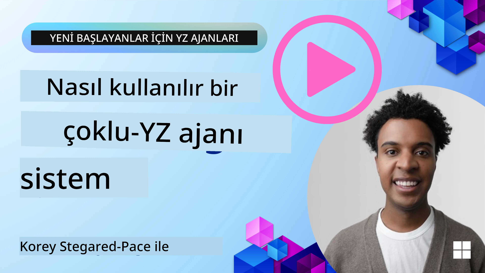
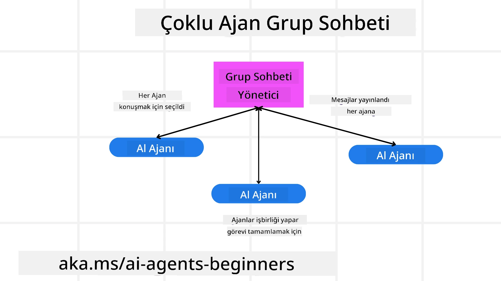
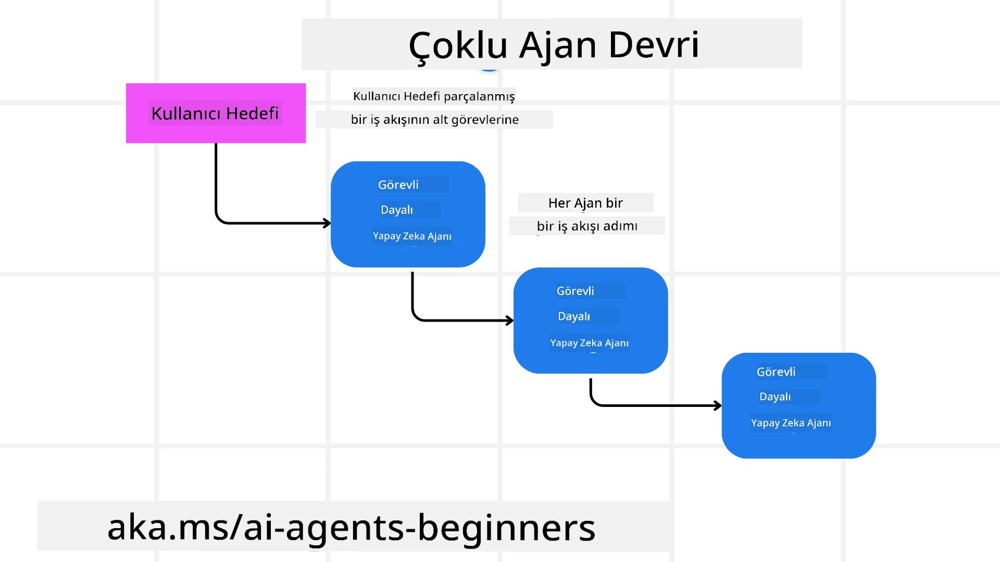
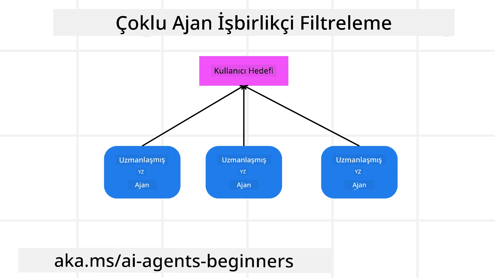

> _(Bu dersin videosunu izlemek için yukarıdaki resme tıklayın)_

# Çoklu ajan tasarım desenleri

Birden çok ajan içeren bir projede çalışmaya başladığınızda, çoklu ajan tasarım desenini göz önünde bulundurmanız gerekir. Ancak, ne zaman çoklu ajanlara geçileceği ve avantajlarının ne olduğu hemen anlaşılamayabilir.

## Giriş

Bu derste şu sorulara yanıt bulmaya çalışıyoruz:

- Çoklu ajanların uygulanabileceği senaryolar nelerdir?
- Bir ajanın birden çok görev yapmasına kıyasla çoklu ajan kullanmanın avantajları nelerdir?
- Çoklu ajan tasarım deseninin uygulanmasının yapı taşları nelerdir?
- Çoklu ajanların birbirleriyle nasıl etkileşimde bulunduğunu nasıl görebiliriz?

## Öğrenme Hedefleri

Bu dersten sonra şunları yapabilmelisiniz:

- Çoklu ajanların uygulanabileceği senaryoları tanımlamak
- Bir tek ajan yerine çoklu ajan kullanmanın avantajlarını fark etmek
- Çoklu ajan tasarım deseninin yapı taşlarını kavramak

Daha geniş resim nedir?

*Çoklu ajanlar, birden fazla ajanın ortak bir hedefe ulaşmak için birlikte çalışmasına olanak tanıyan bir tasarım desenidir*.

Bu desen robotik, otonom sistemler ve dağıtık hesaplama gibi çeşitli alanlarda yaygın olarak kullanılır.

## Çoklu Ajanların Uygulanabildiği Senaryolar

Peki, çoklu ajanların iyi bir kullanım örneği olduğu senaryolar nelerdir? Cevap, özellikle şu durumlarda birçok senaryoda birden fazla ajan kullanmanın faydalı olduğudur:

- **Büyük iş yükleri**: Büyük iş yükleri daha küçük görevlere bölünebilir ve farklı ajanlara atanabilir; bu sayede paralel işlem ve daha hızlı tamamlanma sağlanır. Bunun örneği büyük veri işleme görevidir.
- **Karmaşık görevler**: Büyük iş yüklerinde olduğu gibi karmaşık görevler de daha küçük alt görevlere bölünerek, her biri görevin belirli bir yönünde uzmanlaşmış farklı ajanlara atanabilir. Örneğin, otonom araçlarda farklı ajanlar navigasyon, engel tespiti ve diğer araçlarla iletişimle ilgilenir.
- **Çeşitli uzmanlıklar**: Farklı ajanlar çeşitli uzmanlıklara sahip olabilir, böylece tek bir ajan yerine görevin farklı yönlerini daha etkili bir şekilde ele alabilirler. Sağlık hizmetlerinde bir ajan tanı, bir diğeri tedavi planı, bir diğeri hasta izlemesi ile ilgilenmek gibi.

## Çoklu Ajanların Tek Bir Ajan Üzerindeki Avantajları

Tek bir ajan sistemi basit görevler için işe yarayabilir, ancak daha karmaşık görevler için çoklu ajan kullanımı birkaç avantaj sağlar:

- **Uzmanlaşma**: Her ajan belirli bir görevde uzmanlaşabilir. Tek ajandaki uzmanlık eksikliği, her şeyi yapabilen ama karmaşık bir görevle karşılaştığında ne yapacağı konusunda kararsız kalan bir ajana sahip olmak demektir. Örneğin, en uygun olmadığı bir görevi yapabilir.
- **Ölçeklenebilirlik**: Sistemi ölçeklendirmek, tek bir ajanı aşırı yüklemek yerine daha fazla ajan ekleyerek daha kolaydır.
- **Hata Toleransı**: Bir ajan başarısız olursa, diğerleri çalışmaya devam edebilir ve sistemin güvenilirliği sağlanır.

Bir örnek alalım, bir kullanıcı için seyahat rezervasyonu yapalım. Tek ajan sistemi, uçuşlardan otel ve araç kiralamaya kadar seyahat sürecinin tüm yönlerini ele almak zorunda kalır. Tek ajanla bunu başarmak için tüm bu görevleri yapacak araçlara sahip olması gerekir. Bu, bakımı ve ölçeklendirmesi zor, karmaşık ve birleşik bir sistem doğurabilir. Çoklu ajan sistemi ise, uçuşları bulma, otel ve araç kiralamada uzmanlaşmış farklı ajanlara sahip olabilir. Böylece sistem daha modüler, bakımı daha kolay ve ölçeklenebilir olur.

Bunu, bir seyahat acentesinin aile işletmesi olarak mı yoksa franchise olarak mı yönetildiği ile karşılaştırabilirsiniz. Aile işletmesi tüm süreci tek ajanla yönetirken, franchise farklı alanlar için farklı ajanlara sahip olur.

## Çoklu Ajan Tasarım Deseninin Uygulanmasının Yapı Taşları

Çoklu ajan tasarım desenini uygulamadan önce, deseni oluşturan yapı taşlarını anlamanız gerekir.

Bunu daha somut yapmak için tekrar bir kullanıcı için seyahat rezervasyonu örneğine bakalım. Bu durumda yapı taşları şunları içerir:

- **Ajan İletişimi**: Uçuşları bulma, otel ve araç kiralama ajanlarının kullanıcı tercihleri ve kısıtlamaları hakkında bilgi alışverişi yapmaları gerekir. Bu iletişim için protokolleri ve yöntemleri belirlemeniz gerekir. Somut anlamda, uçuşları bulma ajanı otel rezervasyon ajanınla iletişim kurmalı, otelin uçuş tarihleriyle aynı dönem için rezervasyon yaptığından emin olmalıdır. Bu da ajanların *hangi bilgileri paylaştığı ve nasıl paylaştığını* belirlemeniz gerektiği anlamına gelir.
- **Koordinasyon Mekanizmaları**: Ajanlar, kullanıcının tercih ve kısıtlamalarının karşılanması için eylemlerini koordine etmelidir. Örneğin, kullanıcı tercihi havalimanına yakın bir otel olabilir; kısıtlama ise araç kiralamanın ancak havalimanında mümkün olmasıdır. Bu yüzden otel rezervasyon ajanın araç kiralama ajanınla koordine olmalıdır. Bu da *ajanların eylemlerini nasıl koordine ettiklerini* belirlemeniz gerektiği anlamına gelir.
- **Ajan Mimarisi**: Ajanların karar alma yeteneği ve kullanıcı etkileşimlerinden öğrenme kapasitesi olmalıdır. Uçuşları bulma ajanı, hangi uçuşların önerileceğine karar verebilmelidir. Bu da *ajanların nasıl karar aldığı ve kullanıcının etkileşimlerinden nasıl öğrendiği* anlamına gelir. Öğrenmeye örnek olarak, uçuşları bulma ajanı geçmiş tercihlere göre makine öğrenimi modeli kullanabilir.
- **Çoklu Ajan Etkileşimlerinde Görünürlük**: Çoklu ajanların birbirleriyle nasıl etkileştiğini görebilmeniz gerekir. Bunun için ajan etkinlikleri ve etkileşimlerinin takibi için araçlar ve teknikler olmalıdır. Bu, kayıt ve izleme araçları, görselleştirme araçları ve performans ölçütleri biçiminde olabilir.
- **Çoklu Ajan Desenleri**: Çoklu ajan sistemlerini uygulamak için merkezi, merkezi olmayan ve hibrit mimariler gibi farklı desenler vardır. Kullanım durumunuza en uygun deseni seçmelisiniz.
- **İnsan Müdahalesi**: Çoğu durumda bir insan müdahale edecektir ve ajanlara ne zaman insan müdahalesi isteyeceklerini öğretmeniz gerekir. Bu, ajanların önermediği bir otel veya uçuş için kullanıcıdan istekte bulunması veya rezervasyon öncesi onay istemesi şeklinde olabilir.

## Çoklu Ajan Etkileşimlerinde Görünürlük

Çoklu ajanların birbirleriyle nasıl etkileştiğini görmek önemlidir. Bu görünürlük, hata ayıklama, optimizasyon ve sistemin genel etkinliği için elzemdir. Bunu sağlamak için ajan etkinlikleri ve etkileşimlerinin takibi için araçlar ve teknikler gerekir. Bu, kayıt ve izleme araçları, görselleştirme araçları ve performans ölçütleri biçiminde olabilir.

Örneğin, kullanıcı için seyahat rezervasyonu yaparken, her ajanın durumu, kullanıcının tercih ve kısıtlamaları ile ajanlar arasındaki etkileşimleri gösteren bir kontrol paneliniz olabilir. Bu panel, kullanıcının seyahat tarihleri, uçuş ajanının önerdiği uçuşlar, otel ajanının önerdiği oteller ve araç kiralama ajanının önerdiği araçları gösterir. Böylece ajanların birbirleriyle nasıl etkileştiği ve kullanıcının tercih ve kısıtlamalarının karşılanıp karşılanmadığı net görülür.

Her birini daha detaylı inceleyelim.

- **Kayıt ve İzleme Araçları**: Her ajan tarafından yapılan işlem için kayıt tutulmasını istersiniz. Bu kayıtta işlemi yapan ajan, yapılan işlem, işlem zamanı ve sonucu yer alabilir. Bu bilgiler hata ayıklama, optimizasyon ve daha fazlasında kullanılabilir.
- **Görselleştirme Araçları**: Görselleştirme araçları, ajanlar arasındaki etkileşimleri daha sezgisel görmenize yardımcı olur. Örneğin, bilgi akışını gösteren bir grafik olabilir. Bu, sistemdeki darboğazları, verimsizlikleri ve diğer sorunları belirlemenizi sağlar.
- **Performans Ölçütleri**: Performans ölçütleri, çoklu ajan sisteminin etkinliğini takip etmenize yardımcı olur. Örneğin, bir görevin tamamlanma süresini, birim zamandaki tamamlanan görev sayısını ve ajanların yaptığı önerilerin doğruluğunu takip edebilirsiniz. Bu bilgiler gelişim alanları belirleyip sistemi optimize etmeye yarar.

## Çoklu Ajan Desenleri

Çoklu ajan uygulamaları oluşturmak için kullanabileceğimiz bazı somut desenlere bakalım. İşte dikkate değer birkaç desen:

### Grup sohbeti

Bu desen, birden çok ajanın birbirleriyle iletişim kurabildiği bir grup sohbet uygulaması oluşturmak istediğinizde yararlıdır. Bu desenin tipik kullanım alanları arasında ekip iş birliği, müşteri desteği ve sosyal ağlar bulunur.

Bu desende, her ajan grup sohbetindeki bir kullanıcıyı temsil eder ve mesajlar ajanlar arasında bir mesajlaşma protokolü kullanılarak alışveriş edilir. Ajanlar grup sohbetine mesaj gönderebilir, grup sohbetinden mesaj alabilir ve diğer ajanlardan gelen mesajlara yanıt verebilir.

Bu desen, tüm mesajların merkezi bir sunucu üzerinden yönlendirildiği merkezi mimari veya mesajların doğrudan değiş tokuş edildiği merkezi olmayan mimari olarak uygulanabilir.

### Devir (Hand-off)

Bu desen, birden çok ajanın görevleri birbirine devrettiği bir uygulama oluşturmak istediğinizde yararlıdır.

Tipik kullanım alanları müşteri hizmetleri, görev yönetimi ve iş akışı otomasyonudur.

Bu desende, her ajan bir görev veya iş akışındaki bir adımı temsil eder ve ajanlar önceden tanımlanmış kurallara göre görevleri diğer ajanlara devredebilir.

### İş birliğine dayalı filtreleme (Collaborative filtering)

Bu desen, birden çok ajanın kullanıcılar için önerilerde bulunmak üzere iş birliği yaptığı bir uygulama oluşturmak istediğinizde yararlıdır.

Neden birden çok ajanın iş birliği yapmasını istersiniz? Çünkü her ajanın farklı uzmanlıkları olabilir ve öneri sürecine farklı şekillerde katkıda bulunabilirler.

Bir örnek alalım: bir kullanıcı borsada satın alınacak en iyi hisse senedi hakkında öneri istiyor.

- **Sektör uzmanı**: Bir ajan belirli bir sektörde uzman olabilir.
- **Teknik analiz**: Başka bir ajan teknik analiz uzmanı olabilir.
- **Temel analiz**: Bir diğer ajan temel analiz uzmanı olabilir. Bu ajanlar iş birliği yaparak kullanıcıya daha kapsamlı bir öneri sunabilir.

## Senaryo: İade süreci

Bir müşterinin ürün iadesi talep ettiği bir senaryoyu düşünün, bu süreçte birçok ajan olabilir ama bunları iade sürecine özel ajanlar ve diğer süreçlerde kullanılabilecek genel ajanlar olarak ayıralım.

**İade sürecine özel ajanlar**:

İade sürecinde yer alabilecek bazı ajanlar şunlardır:

- **Müşteri ajanı**: Müşteriyi temsil eder ve iade sürecini başlatmaktan sorumludur.
- **Satıcı ajanı**: Satıcıyı temsil eder ve iade işlemini yürütmekle sorumludur.
- **Ödeme ajanı**: Ödeme sürecini temsil eder ve müşterinin ödemesinin iadesinden sorumludur.
- **Çözüm ajanı**: Çözüm sürecini temsil eder ve iade sürecinde ortaya çıkan sorunları çözmekle sorumludur.
- **Uyumluluk ajanı**: Uyumluluk sürecini temsil eder ve iade sürecinin düzenlemeler ve politikalarla uyumlu olmasını sağlar.

**Genel ajanlar**:

Bu ajanlar işinizin diğer kısımlarında da kullanılabilir.

- **Nakliyat ajanı**: Nakliye sürecini temsil eder ve ürünü satıcıya geri gönderilmesinden sorumludur. Bu ajan hem iade sürecinde hem de örneğin bir satın alma sırasında genel nakliyede kullanılabilir.
- **Geri bildirim ajanı**: Geri bildirim sürecini temsil eder ve müşteriden geri bildirim toplamaktan sorumludur. Geri bildirim her zaman alınabilir, sadece iade süreciyle sınırlı değildir.
- **Yükseltme ajanı**: Yükseltme sürecini temsil eder ve sorunları daha üst destek seviyesine yükseltmekten sorumludur. Sorun yükseltmenin gerektiği herhangi bir süreçte bu ajan türü kullanılabilir.
- **Bildirim ajanı**: Bildirim sürecini temsil eder ve iade sürecinin çeşitli aşamalarında müşteriye bildirim göndermekten sorumludur.
- **Analitik ajan**: Analitik sürecini temsil eder ve iade süreciyle ilgili verileri analiz etmekten sorumludur.
- **Denetim ajanı**: Denetim sürecini temsil eder ve iade sürecinin doğru yürütüldüğünü denetlemekten sorumludur.
- **Raporlama ajanı**: Raporlama sürecini temsil eder ve iade süreciyle ilgili raporlar oluşturur.
- **Bilgi ajanı**: Bilgi sürecini temsil eder ve iade süreciyle ilgili bilgi tabanını yönetir. Bu ajan iade konusu yanı sıra işinizin diğer alanları hakkında da bilgi sahibi olabilir.
- **Güvenlik ajanı**: Güvenlik sürecini temsil eder ve iade sürecinin güvenliğini sağlar.
- **Kalite ajanı**: Kalite sürecini temsil eder ve iade sürecinin kalitesini sağlar.

Önceki listede iade sürecine özgü ajanların yanı sıra işinizin diğer bölümlerinde kullanılabilecek genel ajanlar da oldukça fazladır. Umarım bu, çoklu ajan sisteminizde hangi ajanları kullanacağınıza nasıl karar verebileceğiniz hakkında fikir verir.

## Ödev

Bir müşteri destek süreci için çoklu ajan sistemi tasarlayın. Süreçte yer alan ajanları, rollerini ve sorumluluklarını tanımlayın ve birbirleriyle nasıl etkileştiklerini açıklayın. Hem müşteri destek sürecine özgü ajanları hem de işinizin diğer bölümlerinde kullanılabilecek genel ajanları göz önünde bulundurun.
> Aşağıdaki çözümü okumadan önce düşünün, düşündüğünüzden daha fazla ajana ihtiyacınız olabilir.

> İPUCU: Müşteri destek sürecinin farklı aşamalarını düşünün ve ayrıca herhangi bir sistem için gereken ajanları da göz önünde bulundurun.

## Çözüm

[Çözüm](./solution/solution.md)

## Bilgi Kontrolleri

Soru: Çoklu ajan kullanımını ne zaman düşünmelisiniz?

- [ ] A1: Küçük bir iş yükünüz ve basit bir göreviniz olduğunda.
- [ ] A2: Büyük bir iş yükünüz olduğunda
- [ ] A3: Basit bir göreviniz olduğunda.

[Çözüm sınavı](./solution/solution-quiz.md)

## Özet

Bu derste, çoklu ajan tasarım desenine baktık; çoklu ajanların uygulanabilir olduğu senaryoları, tek bir ajana kıyasla çoklu ajan kullanmanın avantajlarını, çoklu ajan tasarım deseninin uygulanmasının yapı taşlarını ve birden fazla ajanın birbirleriyle nasıl etkileşimde bulunduğunu nasıl görebileceğimizi ele aldık.

### Çoklu Ajan Tasarım Deseni ile İlgili Daha Fazla Sorunuz mu Var?

Diğer öğrenenlerle tanışmak, ofis saatlerine katılmak ve AI Ajanlar sorularınıza yanıt almak için [Microsoft Foundry Discord](https://aka.ms/ai-agents/discord) topluluğuna katılın.

## Ek kaynaklar

- <a href="https://learn.microsoft.com/azure/ai-services/agents/overview" target="_blank">Microsoft Agent Framework dokümantasyonu</a>
- <a href="https://www.analyticsvidhya.com/blog/2024/10/agentic-design-patterns/" target="_blank">Agentic tasarım desenleri</a>

## Önceki Ders

[Tasarım Planlama](../07-planning-design/README.md)

## Sonraki Ders

[AI Ajanlarında Metabiliş](../09-metacognition/README.md)

---

<!-- CO-OP TRANSLATOR DISCLAIMER START -->
**Feragatname**:  
Bu belge, AI çeviri hizmeti [Co-op Translator](https://github.com/Azure/co-op-translator) kullanılarak çevrilmiştir. Doğruluk için çaba gösterilse de, otomatik çevirilerin hatalar veya yanlışlıklar içerebileceğini lütfen unutmayınız. Orijinal belge, kendi ana dilinde yetkili kaynak olarak kabul edilmelidir. Kritik bilgiler için profesyonel insan çevirisi önerilir. Bu çevirinin kullanımı sonucunda doğabilecek herhangi bir yanlış anlama veya yanlış yorumlamadan sorumlu değiliz.
<!-- CO-OP TRANSLATOR DISCLAIMER END -->