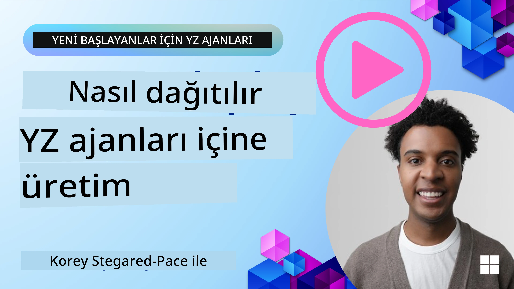

# Üretimde AI Ajanları: Gözlemlenebilirlik & Değerlendirme

[](https://youtu.be/l4TP6IyJxmQ?si=reGOyeqjxFevyDq9)

AI ajanları deneysel prototiplerden gerçek dünya uygulamalarına geçerken, davranışlarını anlamak, performanslarını izlemek ve çıktılarını sistematik olarak değerlendirmek önem kazanır.

## Öğrenme Hedefleri

Bu dersi tamamladıktan sonra nasıl/şunu anlayacak veya bileceksiniz:
- Ajan gözlemlenebilirliği ve değerlendirmesinin temel kavramları
- Ajanların performansını, maliyetlerini ve etkinliğini iyileştirme teknikleri
- AI ajanlarınızı sistematik olarak neyi ve nasıl değerlendireceğiniz
- AI ajanlarını üretime dağıtırken maliyetleri nasıl kontrol edeceğiniz
- Microsoft Agent Framework ile oluşturulan ajanları nasıl enstrümante edeceğiniz

Amaç, "kara kutu" ajanlarınızı şeffaf, yönetilebilir ve güvenilir sistemlere dönüştürme bilgisiyle donatmaktır.

_**Not:** Güvenli ve güvenilir AI Ajanları dağıtmak önemlidir. Ayrıca [Building Trustworthy AI Agents](./06-building-trustworthy-agents/README.md) dersine göz atın._

## İzler ve Spans

[Langfuse](https://langfuse.com/) veya [Microsoft Foundry](https://learn.microsoft.com/en-us/azure/ai-foundry/what-is-azure-ai-foundry) gibi gözlemlenebilirlik araçları genellikle ajan çalıştırmalarını izler (trace) ve adımlar (spans) olarak temsil eder.

- **Trace** bir ajan görevini baştan sona (ör. bir kullanıcı sorgusunu işleme) temsil eder.
- **Spans** iz içindeki bireysel adımlardır (ör. bir dil modelini çağırma veya veri alma).


<!-- Image URL retained for illustration purposes -->

Gözlemlenebilirlik olmadan, bir AI ajanı "kara kutu" gibi hissedilebilir — iç durumu ve muhakemesi opaktır, bu da sorunları teşhis etmeyi veya performansı optimize etmeyi zorlaştırır. Gözlemlenebilirlikle ajanlar "cam kutulara" dönüşür; bu şeffaflık, güven oluşturmak ve beklenen şekilde çalıştıklarından emin olmak için hayati önemdedir. 

## Üretim Ortamlarında Gözlemlenebilirliğin Önemi

AI ajanlarını üretim ortamlarına geçirmek yeni zorluklar ve gereksinimler getirir. Gözlemlenebilirlik artık "iyi olur" değil, kritik bir yetenektir:

*   **Hata Ayıklama ve Kök Neden Analizi**: Bir ajan başarısız olduğunda veya beklenmeyen bir çıktı ürettiğinde, gözlemlenebilirlik araçları hatanın kaynağını belirlemek için gereken izleri sağlar. Bu, birden fazla LLM çağrısı, araç etkileşimleri ve koşullu mantık içerebilen karmaşık ajanlar için özellikle önemlidir.
*   **Gecikme ve Maliyet Yönetimi**: AI ajanları genellikle token veya çağrı başına faturalandırılan LLM'lere ve diğer dış API'lere dayanır. Gözlemlenebilirlik bu çağrıların hassas izlenmesine olanak tanır ve aşırı yavaş veya pahalı olan işlemleri belirlemeye yardımcı olur. Bu, ekiplerin istemleri optimize etmesine, daha verimli modeller seçmesine veya operasyonel maliyetleri yönetmek ve iyi bir kullanıcı deneyimi sağlamak için iş akışlarını yeniden tasarlamasına olanak verir.
*   **Güven, Güvenlik ve Uyumluluk**: Birçok uygulamada ajanların güvenli ve etik davranmasını sağlamak önemlidir. Gözlemlenebilirlik ajan eylemlerinin ve kararlarının denetim izini sağlar. Bu, prompt injection, zararlı içerik üretimi veya kişisel olarak tanımlanabilir bilgilerin (PII) yanlış kullanımı gibi sorunları tespit etmek ve hafifletmek için kullanılabilir. Örneğin, bir ajanın belirli bir yanıt vermesinin veya belirli bir aracı kullanmasının nedenini anlamak için izleri inceleyebilirsiniz.
*   **Sürekli İyileştirme Döngüleri**: Gözlemlenebilirlik verileri, yinelemeli geliştirme sürecinin temelidir. Ajanların gerçek dünyadaki performansını izleyerek ekipler iyileştirme alanlarını belirleyebilir, ince ayar için veri toplayabilir ve yapılan değişikliklerin etkisini doğrulayabilir. Bu, çevrimiçi değerlendirmeden elde edilen üretim içgörülerinin çevrimdışı denemeleri ve iyileştirmeleri bilgilendirdiği bir geri bildirim döngüsü yaratır ve ajan performansının kademeli olarak artmasını sağlar.

## İzlenecek Temel Metrikler

Ajan davranışını izlemek ve anlamak için çeşitli metrik ve sinyaller izlenmelidir. Belirli metrikler ajanın amacına göre değişebilir, ancak bazıları evrensel olarak önemlidir.

Gözlemlenebilirlik araçlarının izlediği en yaygın metriklerden bazıları şunlardır:

**Gecikme:** Ajan ne kadar hızlı yanıt veriyor? Uzun bekleme süreleri kullanıcı deneyimini olumsuz etkiler. Ajan çalıştırmalarını izleyerek görevlerin ve bireysel adımların gecikmesini ölçmelisiniz. Örneğin, tüm model çağrıları için 20 saniye süren bir ajan, daha hızlı bir model kullanılarak veya model çağrılarını paralel çalıştırarak hızlandırılabilir.

**Maliyetler:** Bir ajan çalıştırmasının maliyeti ne kadar? AI ajanları token bazlı faturalandırılan LLM çağrılarına veya dış API'lere dayanır. Sık araç kullanımı veya birden fazla istem maliyetleri hızla artırabilir. Örneğin, bir ajan kalite artışı için LLM'yi beş kez çağırıyorsa, maliyetin haklı olup olmadığını veya çağrı sayısını azaltıp daha ucuz bir model kullanıp kullanamayacağınızı değerlendirmelisiniz. Gerçek zamanlı izleme, beklenmeyen ani artışları (ör. hatalar nedeniyle aşırı API döngüleri) tespit etmeye de yardımcı olabilir.

**İstek Hataları:** Ajan kaç istekte başarısız oldu? Bu, API hataları veya başarısız araç çağrılarını içerebilir. Ajanınızı üretimde bu tür durumlardan daha dayanıklı hale getirmek için geri dönüşler veya yeniden denemeler ayarlayabilirsiniz. Ör. LLM sağlayıcısı A kapalıysa, yedek olarak LLM sağlayıcısı B'ye geçersiniz.

**Kullanıcı Geri Bildirimi:** Doğrudan kullanıcı değerlendirmelerini uygulamak değerli içgörüler sağlar. Bu, açık derecelendirmeleri (👍beğeni/👎beğenmeme, ⭐1-5 yıldız) veya metinsel yorumları içerebilir. Sürekli olumsuz geri bildirimler, ajanın beklendiği gibi çalışmadığını gösteren bir uyarı olmalıdır.

**Dolaylı Kullanıcı Geri Bildirimi:** Kullanıcı davranışları, açık derecelendirme olmasa bile dolaylı geri bildirim sağlar. Bu, hemen sorunun yeniden ifade edilmesi, tekrar eden sorgular veya yeniden dene düğmesine tıklama gibi davranışları içerebilir. Ör. kullanıcıların aynı soruyu tekrar tekrar sorduğunu görüyorsanız, bu ajanın beklendiği gibi çalışmadığının bir işaretidir.

**Doğruluk:** Ajan ne sıklıkla doğru veya istenen çıktılar üretiyor? Doğruluk tanımları değişir (ör. problem çözme doğruluğu, bilgi getirme doğruluğu, kullanıcı memnuniyeti). İlk adım, ajanın başarı kriterinin ne olduğunu tanımlamaktır. Doğruluğu otomatik kontroller, değerlendirme puanları veya görev tamamlama etiketleri ile takip edebilirsiniz. Örneğin, izleri "başarılı" veya "başarısız" olarak işaretlemek gibi.

**Otomatik Değerlendirme Metrikleri:** Otomatik değerlendirmeler de kurabilirsiniz. Örneğin, bir LLM kullanarak ajanın çıktısını — yardımcı olup olmadığı, doğru olup olmadığı vb. — puanlayabilirsiniz. Ayrıca ajanınızın farklı yönlerini puanlamaya yardımcı olan birkaç açık kaynak kitaplığı vardır. Ör. RAG ajanları için [RAGAS](https://docs.ragas.io/), zararlı dili veya prompt injection'ı tespit etmek için [LLM Guard](https://llm-guard.com/).

Uygulamada, bu metriklerin bir kombinasyonu bir AI ajanın sağlığını en iyi şekilde kapsar. Bu bölümün [örnek not defteri](./code_samples/10-expense_claim-demo.ipynb) gerçek örneklerde bu metriklerin nasıl göründüğünü gösterecek, ancak önce tipik bir değerlendirme iş akışının nasıl göründüğünü öğreneceğiz.

## Ajanınızı Enstrümante Edin

İzleme verisi toplamak için kodunuzu enstrümante etmeniz gerekecek. Amaç, ajan kodunu izler (trace) ve metrikler yayacak şekilde enstrümante etmek, böylece bunlar bir gözlemlenebilirlik platformu tarafından yakalanıp işlenip görselleştirilebilsin.

**OpenTelemetry (OTel):** [OpenTelemetry](https://opentelemetry.io/) LLM gözlemlenebilirliği için bir endüstri standardı olarak öne çıktı. Telemetri verisi oluşturmak, toplamak ve dışa aktarmak için bir dizi API, SDK ve araç sağlar. 

Mevcut ajan çerçevelerini sarıp OpenTelemetry spans'lerini gözlemlenebilirlik aracına kolayca dışa aktaran birçok enstrümantasyon kütüphanesi vardır. Microsoft Agent Framework OpenTelemetry ile yerel entegrasyon sağlar. Aşağıda bir MAF ajanını enstrümante etmeye dair bir örnek bulunmaktadır:

```python
from agent_framework.observability import get_tracer, get_meter

tracer = get_tracer()
meter = get_meter()

with tracer.start_as_current_span("agent_run"):
    # Ajanın yürütülmesi otomatik olarak izlenir
    pass
```

Bu bölümdeki [örnek not defteri](./code_samples/10-expense_claim-demo.ipynb) MAF ajanınızı nasıl enstrümante edeceğinizi gösterecektir.

**Manuel Span Oluşturma:** Enstrümantasyon kütüphaneleri iyi bir temel sağlar, ancak daha ayrıntılı veya özel bilgi gerektiği durumlar sıkça olur. Özel uygulama mantığı eklemek için manuel olarak span oluşturabilirsiniz. Daha da önemlisi, otomatik veya manuel oluşturulan span'ları özel niteliklerle (etiketler veya meta veriler olarak da bilinir) zenginleştirebilirsiniz. Bu nitelikler işe özel veriler, ara hesaplamalar veya hata ayıklama ya da analiz için yararlı olabilecek bağlamları içerebilir; ör. `user_id`, `session_id` veya `model_version`.

[Langfuse Python SDK](https://langfuse.com/docs/sdk/python/sdk-v3) ile izleri ve span'ları manuel oluşturma örneği:

```python
from langfuse import get_client
 
langfuse = get_client()
 
span = langfuse.start_span(name="my-span")
 
span.end()
```

## Ajan Değerlendirmesi

Gözlemlenebilirlik bize metrikler sağlar, ancak değerlendirme, bu verileri (ve testleri) analiz ederek bir AI ajanın ne kadar iyi performans gösterdiğini ve nasıl iyileştirilebileceğini belirleme sürecidir. Diğer bir deyişle, bu izler ve metrikler olduğunda, ajanı nasıl değerlendirir ve kararlar almak için bunları nasıl kullanırsınız?

Düzenli değerlendirme önemlidir çünkü AI ajanları genellikle deterministik değildir ve (güncellemeler veya model davranışındaki sapmalar yoluyla) evrilebilirler — değerlendirme olmadan “akıllı ajanın” gerçekten işini iyi yapıp yapmadığını ya da gerilediğini bilemezsiniz.

AI ajanları için iki değerlendirme kategorisi vardır: **çevrimiçi değerlendirme** ve **çevrimdışı değerlendirme**. Her ikisi de değerlidir ve birbirini tamamlar. Genellikle herhangi bir ajanı dağıtmadan önce asgari gerekli adım olduğu için çevrimdışı değerlendirme ile başlarız.

### Çevrimdışı Değerlendirme


Bu, ajanı kontrollü bir ortamda, genellikle canlı kullanıcı sorguları yerine test veri kümeleri kullanarak değerlendirmeyi içerir. Beklenen çıktı veya doğru davranışı bildiğiniz küratörlü veri kümelerini kullanırsınız ve ardından ajanın bunlar üzerindeki performansını çalıştırırsınız.

Örneğin, bir matematik kelime problemi ajanı oluşturduysanız, bilinen cevapları olan 100 problemden oluşan bir [test veri kümesi](https://huggingface.co/datasets/gsm8k) olabilir. Çevrimdışı değerlendirme genellikle geliştirme sırasında (ve CI/CD boru hatlarının bir parçası olabilir) iyileştirmeleri kontrol etmek veya gerilemeyi önlemek için yapılır. Avantajı, **tekrar edilebilir olması ve zemin gerçeğiniz olduğu için net doğruluk metrikleri elde edebilmenizdir**. Ayrıca kullanıcı sorgularını simüle edip ajanın yanıtlarını ideal cevaplarla karşılaştırabilir veya yukarıda tanımlanan otomatik metrikleri kullanabilirsiniz.

Çevrimdışı değerlendirmenin temel zorluğu, test veri kümenizin kapsamlı ve güncel kalmasını sağlamaktır — ajan sabit bir test setinde iyi performans gösterebilir ancak üretimde çok farklı sorgularla karşılaşabilir. Bu nedenle test setlerini yeni uç vakalar ve gerçek dünya senaryolarını yansıtan örneklerle güncel tutmalısınız. Küçük "duman testi" vakaları ile daha geniş değerlendirme setlerinin karışımı faydalıdır: hızlı kontroller için küçük setler ve daha geniş performans metrikleri için büyük setler.

### Çevrimiçi Değerlendirme


Bu, ajanı canlı, gerçek dünya ortamında, yani üretimdeki gerçek kullanım sırasında değerlendirmeyi ifade eder. Çevrimiçi değerlendirme, ajan performansını gerçek kullanıcı etkileşimlerinde izlemeyi ve sonuçları sürekli olarak analiz etmeyi içerir.

Örneğin, canlı trafiğe ilişkin başarı oranlarını, kullanıcı memnuniyeti puanlarını veya diğer metrikleri izleyebilirsiniz. Çevrimiçi değerlendirmenin avantajı, laboratuvar ortamında öngöremeyebileceğiniz şeyleri yakalamasıdır — model sürüklenmesini zaman içinde gözlemleyebilir (girdi desenleri değiştikçe ajanın etkinliği azalırsa) ve test verilerinizde olmayan beklenmedik sorguları veya durumları tespit edebilirsiniz. Bu, ajanın gerçek dünyadaki davranışının gerçek bir resmini sağlar.

Çevrimiçi değerlendirme genellikle, daha önce tartışıldığı gibi, dolaylı ve doğrudan kullanıcı geri bildirimlerinin toplanmasını ve gölge testleri veya A/B testleri (yeni bir ajan sürümünün eskiyle karşılaştırmak için paralel çalıştırılması) çalıştırmayı içerebilir. Zorluk, canlı etkileşimler için güvenilir etiketler veya puanlar elde etmenin zor olabilmesidir — kullanıcı geri bildirimlerine veya aşağı akış metriklerine (ör. kullanıcı sonuca tıkladı mı) dayanmanız gerekebilir.

### İkisini Birleştirme

Çevrimiçi ve çevrimdışı değerlendirmeler birbirini dışlamaz; birbirlerini büyük ölçüde tamamlarlar. Çevrimiçi izlemeden elde edilen içgörüler (ör. ajanın kötü performans gösterdiği yeni kullanıcı sorgusu türleri) çevrimdışı test veri kümelerini geliştirmek ve genişletmek için kullanılabilir. Tersine, çevrimdışı testlerde iyi performans gösteren ajanlar daha güvenle üretime alınabilir ve çevrimiçi olarak izlenebilir.

Aslında birçok ekip şu döngüyü benimser:

_değerlendir çevrimdışı -> dağıt -> çevrimiçi izle -> yeni hatalı vakaları topla -> çevrimdışı veri kümesine ekle -> ajanı iyileştir -> tekrarla_.

## Yaygın Sorunlar

AI ajanlarını üretime dağıtırken çeşitli zorluklarla karşılaşabilirsiniz. İşte bazı yaygın sorunlar ve olası çözümleri:

| **Sorun**    | **Olası Çözüm**   |
| ------------- | ------------------ |
| AI Ajanı görevleri tutarlı şekilde yerine getirmiyor | - AI Ajanına verilen promptu rafine edin; hedefler konusunda net olun.<br>- Görevleri alt görevlere bölmenin ve bunları birden çok ajanın ele almasının yardımcı olup olmayacağını belirleyin. |
| AI Ajanı sürekli döngülere giriyor  | - Ajanın süreci ne zaman durduracağını bilmesi için net sonlandırma şartları ve koşulları sağlayın.<br>- Muhakeme ve planlama gerektiren karmaşık görevler için muhakeme konusunda uzmanlaşmış daha büyük bir model kullanın. |
| AI Ajanı araç çağrıları iyi performans göstermiyor   | - Aracın çıktısını ajan sistemi dışında test edip doğrulayın.<br>- Tanımlanan parametreleri, promptları ve araç isimlendirmesini rafine edin.  |
| Çok-Ajanlı sistem tutarlı performans göstermiyor | - Her ajana verilen promptları daha belirgin ve birbirinden farklı olacak şekilde rafine edin.<br>- Hangi ajanın doğru olduğunu belirlemek için bir "yönlendirme" veya kontrolör ajan kullanarak hiyerarşik bir sistem kurun. |

Bu sorunların birçoğu gözlemlenebilirlik ile daha etkili bir şekilde tespit edilebilir. Daha önce tartıştığımız izler ve metrikler, ajan iş akışının tam olarak nerede sorun yaşadığını belirlemenize yardımcı olarak hata ayıklama ve optimizasyonu çok daha verimli hale getirir.

## Maliyetleri Yönetme
Here are some strategies to manage the costs of deploying AI agents to production:

**Daha Küçük Modellerin Kullanımı:** Küçük Dil Modelleri (SLMs) bazı ajan odaklı kullanım durumlarında iyi performans gösterebilir ve maliyetleri önemli ölçüde azaltır. Daha önce bahsedildiği gibi, performansı daha büyük modellerle karşılaştırmak ve belirlemek için bir değerlendirme sistemi oluşturmak, bir SLM'in kullanım durumunuzda ne kadar iyi performans göstereceğini anlamanın en iyi yoludur. Basit görevler için, örneğin niyet sınıflandırma veya parametre çıkarımı gibi işler için SLM'leri kullanmayı, karmaşık akıl yürütme için daha büyük modelleri ayırmayı düşünün.

**Bir Yönlendirici Model Kullanımı:** Benzer bir strateji, farklı modellerin ve boyutların çeşitliliğini kullanmaktır. Talepleri karmaşıklığa göre en uygun modellere yönlendirmek için bir LLM/SLM veya serverless işlev kullanabilirsiniz. Bu, doğru görevlerde performansı sağlarken maliyetleri azaltmaya da yardımcı olacaktır. Örneğin, basit sorguları daha küçük, daha hızlı modellere yönlendirin ve yalnızca karmaşık akıl yürütme görevleri için pahalı büyük modelleri kullanın.

**Yanıt Önbellekleme:** Yaygın istekleri ve görevleri belirleyip yanıtları ajan sisteminizden geçmeden önce sağlamak, benzer isteklerin hacmini azaltmanın iyi bir yoludur. Bir isteğin önbelleğe alınmış isteklerinize ne kadar benzediğini belirlemek için daha temel AI modelleri kullanarak bir akış bile uygulayabilirsiniz. Bu strateji, sıkça sorulan sorular veya yaygın iş akışları için maliyetleri önemli ölçüde azaltabilir.

## Bunun pratikte nasıl çalıştığını görelim

Bu bölümün [örnek not defterinde](./code_samples/10-expense_claim-demo.ipynb), ajanımızı izlemek ve değerlendirmek için gözlemlenebilirlik araçlarını nasıl kullanabileceğimize dair örnekler göreceğiz.

### Üretimdeki Yapay Zeka Ajanları Hakkında Daha Fazla Sorunuz mu Var?

Diğer öğrenenlerle tanışmak, ofis saatlerine katılmak ve Yapay Zeka Ajanları ile ilgili sorularınıza yanıt almak için [Microsoft Foundry Discord](https://aka.ms/ai-agents/discord) sunucusuna katılın.

## Önceki Ders

[Metakognisyon Tasarım Deseni](../09-metacognition/README.md)

## Sonraki Ders

[Ajan Protokolleri](../11-agentic-protocols/README.md)

---

<!-- CO-OP TRANSLATOR DISCLAIMER START -->
Feragatname:
Bu belge, yapay zeka çeviri hizmeti Co-op Translator (https://github.com/Azure/co-op-translator) kullanılarak çevrilmiştir. Doğruluk için çaba göstersek de, otomatik çevirilerin hatalar veya yanlışlıklar içerebileceğini lütfen unutmayın. Orijinal belge, kendi dilinde yetkili kaynak olarak kabul edilmelidir. Kritik bilgiler için profesyonel insan çevirisi önerilir. Bu çevirinin kullanımı sonucunda ortaya çıkabilecek herhangi bir yanlış anlaşılma veya yanlış yorumdan sorumlu değiliz.
<!-- CO-OP TRANSLATOR DISCLAIMER END -->