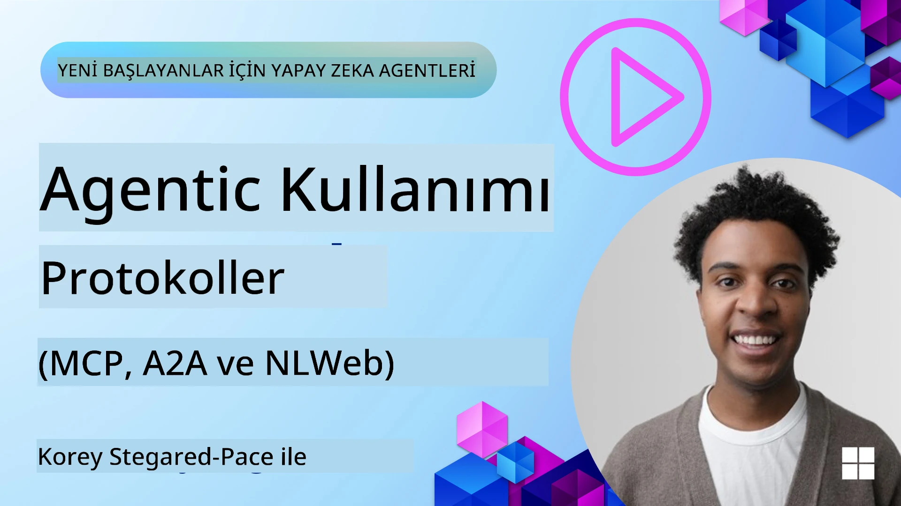
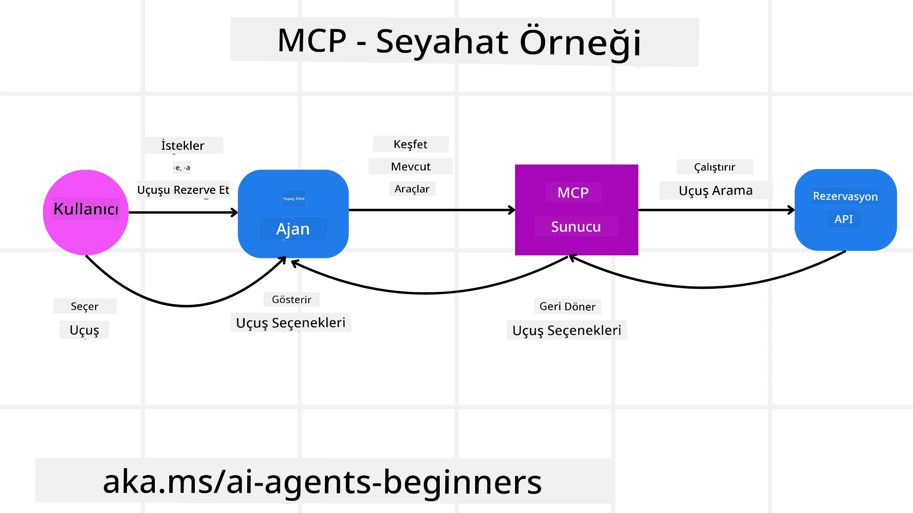
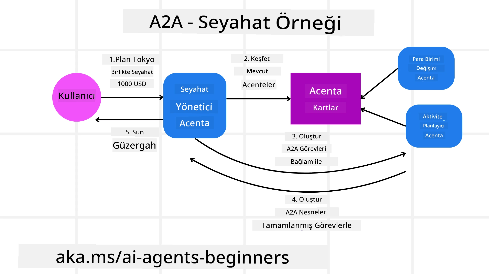
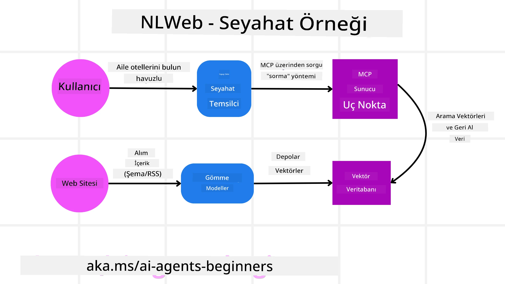

# Agentik Protokollerin Kullanımı (MCP, A2A ve NLWeb)

> _(Üstteki görsele tıklayarak bu dersin videosunu izleyin)_

Yapay zeka ajanlarının kullanımı arttıkça, standardizasyon, güvenlik ve açık inovasyonu destekleyen protokollere olan ihtiyaç da artıyor. Bu derste, bu ihtiyacı karşılamayı amaçlayan 3 protokolü ele alacağız - Model Context Protocol (MCP), Agent to Agent (A2A) ve Natural Language Web (NLWeb).

## Giriş

Bu derste ele alacağımız konular:

• **MCP**'nin AI Ajanlarının kullanıcı görevlerini tamamlamak için harici araçlara ve verilere erişmesini nasıl sağladığı.

• **A2A**'nın farklı AI ajanları arasında iletişim ve iş birliği sağlaması.

• **NLWeb**'in herhangi bir web sitesine doğal dil arayüzleri getirerek AI Ajanlarının içeriği keşfetmesini ve etkileşimde bulunmasını nasıl mümkün kıldığı.

## Öğrenme Hedefleri

• **Tanımlamak**: AI ajanları bağlamında MCP, A2A ve NLWeb'in temel amacı ve faydalarını belirlemek.

• **Açıklamak**: Her bir protokolün LLM'ler, araçlar ve diğer ajanlar arasındaki iletişim ve etkileşimi nasıl kolaylaştırdığını açıklamak.

• **Fark etmek**: Karmaşık ajan tabanlı sistemler inşa ederken her protokolün oynadığı farklı rolleri tanımak.

## Model Context Protocol

**Model Context Protocol (MCP)**, uygulamaların LLM'lere bağlam ve araç sağlaması için standart bir yol sunan açık bir standarttır. Bu, AI Ajanlarının tutarlı bir şekilde bağlanabileceği farklı veri kaynaklarına ve araçlara yönelik bir "evrensel adaptör" olanağı sağlar.

MCP'nin bileşenlerine, doğrudan API kullanımına kıyasla sağladığı faydalara ve AI ajanlarının bir MCP sunucusunu nasıl kullanabileceğine dair bir örneğe bakalım.

### MCP Temel Bileşenleri

MCP, **istemci-sunucu mimarisi** üzerine çalışır ve temel bileşenler şunlardır:

• **Hosts** LLM uygulamalarıdır (örneğin VSCode gibi bir kod editörü) ve MCP Sunucusuna bağlantıları başlatırlar.

• **Clients** host uygulaması içindeki, sunucularla bire bir bağlantıları sürdüren bileşenlerdir.

• **Servers** belirli yetenekleri açığa çıkaran hafif programlardır.

Protokolde yer alan üç temel ilkel ise bir MCP Sunucusunun yeteneklerini oluşturur:

• **Tools**: Bunlar bir AI ajanın bir eylemi gerçekleştirmek için çağırabileceği ayrı eylemler veya fonksiyonlardır. Örneğin, bir hava durumu servisi "hava durumunu al" aracını açığa çıkarabilir veya bir e-ticaret sunucusu "ürün satın al" aracını sunabilir. MCP sunucuları, yetenekler listesinde her aracın adını, açıklamasını ve giriş/çıkış şemasını bildirir.

• **Resources**: Bunlar MCP sunucusunun sağlayabileceği salt okunur veri öğeleri veya belgelerdir ve istemciler bunları talep üzerine alabilir. Örnekler arasında dosya içerikleri, veritabanı kayıtları veya günlük dosyaları bulunur. Kaynaklar metin (ör. kod veya JSON) veya ikili (ör. görüntüler veya PDF'ler) olabilir.

• **Prompts**: Bunlar, daha karmaşık iş akışlarına izin veren önerilen istemleri sağlayan ön tanımlı şablonlardır.

### MCP'nin Faydaları

MCP, AI Ajanları için önemli avantajlar sunar:

• **Dinamik Araç Keşfi**: Ajanlar, sunucudan hangi araçların mevcut olduğunu ve ne yaptıklarına dair açıklamaları dinamik olarak alabilir. Bu, entegrasyonlar için genellikle statik kodlama gerektiren geleneksel API'lerin aksine, herhangi bir API değişikliğinin kod güncellemeleri gerektirmesini engeller. MCP, "bir kez entegre et" yaklaşımı sunarak daha büyük uyarlanabilirlik sağlar.

• **LLM'ler Arası Birlikte Çalışabilirlik**: MCP, farklı LLM'ler arasında çalışır ve daha iyi performans değerlendirmesi için temel modelleri değiştirme esnekliği sağlar.

• **Standardize Güvenlik**: MCP, ilave MCP sunucularına erişim eklerken ölçeklendirilebilirliği artıran standart bir kimlik doğrulama yöntemi içerir. Bu, çeşitli geleneksel API'ler için farklı anahtarlar ve kimlik doğrulama türlerini yönetmekten daha basittir.

### MCP Örneği

Bir kullanıcının MCP destekli bir AI asistanı kullanarak uçak bileti rezervasyonu yapmak istediğini hayal edelim.

1. **Bağlantı**: AI asistanı (MCP istemcisi), bir havayolu tarafından sağlanan MCP sunucusuna bağlanır.

2. **Araç Keşfi**: İstemci, havayolunun MCP sunucusuna "Hangi araçlarınız var?" diye sorar. Sunucu "uçuş ara" ve "uçuş rezervasyonu yap" gibi araçlarla yanıt verir.

3. **Araç Çağrısı**: Daha sonra AI asistanına "Lütfen Portland'dan Honolulu'ya bir uçuş ara" dersiniz. AI asistanı, LLM'ini kullanarak "uçuş ara" aracını çağırması gerektiğini belirler ve ilgili parametreleri (kalkış yeri, varış yeri) MCP sunucusuna iletir.

4. **Yürütme ve Yanıt**: MCP sunucusu, bir sarmalayıcı gibi davranarak havayolunun dahili rezervasyon API'sine gerçek çağrıyı yapar. Ardından uçuş bilgilerini (ör. JSON verisi) alır ve AI asistanına geri gönderir.

5. **İleri Etkileşim**: AI asistanı uçuş seçeneklerini sunar. Bir uçuş seçtiğinizde, asistan aynı MCP sunucusundaki "uçuş rezervasyonu yap" aracını çağırarak rezervasyonu tamamlayabilir.

## Ajanlar Arası Protokol (A2A)

MCP, LLM'leri araçlara bağlamaya odaklanırken, **Agent-to-Agent (A2A) protokolü** bir adım ileri giderek farklı AI ajanları arasında iletişim ve iş birliğini mümkün kılar. A2A, farklı organizasyonlar, ortamlar ve teknoloji yığınları arasındaki AI ajanlarını paylaşılan bir görevi tamamlamak için bağlar.

A2A'nın bileşenlerini ve faydalarını ve seyahat uygulamamızda nasıl uygulanabileceğine dair bir örneği inceleyeceğiz.

### A2A Temel Bileşenleri

A2A, ajanlar arasında iletişimi etkinleştirmeye ve onların kullanıcıya ait bir alt görevi birlikte tamamlamasına odaklanır. Protokolün her bileşeni buna katkıda bulunur:

#### Agent Card

Bir MCP sunucusunun bir araç listesi paylaşmasına benzer şekilde, bir Agent Card şunlara sahiptir:
- Ajanın Adı.
- Tamamladığı genel görevlerin bir **açıklaması**.
- Diğer ajanların (ve hatta insan kullanıcıların) ne zaman ve neden o ajana çağrı yapmak isteyeceklerini anlamalarına yardımcı olacak **açıklamalı belirli beceri listesi**.
- Ajana ait **güncel Endpoint URL**.
- Ajanın **sürümü** ve akış yanıtları ve push bildirimler gibi **yetenekleri**.

#### Agent Executor

Agent Executor, **kullanıcı sohbetinin bağlamını uzak ajana iletmekten** sorumludur; uzak ajanın tamamlanması gereken görevi anlaması için buna ihtiyacı vardır. Bir A2A sunucusunda, bir ajan gelen istekleri çözümlemek ve kendi dahili araçlarını kullanarak görevleri yürütmek için kendi Büyük Dil Modeli'ni (LLM) kullanır.

#### Artifact

Uzak ajan istenen görevi tamamladığında, yaptığı iş bir artifact olarak oluşturulur. Bir artifact, **ajanın çalışmasının sonucunu**, **tamamlanan işin açıklamasını** ve protokol aracılığıyla gönderilen **metin bağlamını** içerir. Artifact gönderildikten sonra, uzak ajanla bağlantı tekrar gerekene kadar kapatılır.

#### Event Queue

Bu bileşen **güncellemeleri işlemek ve mesajları iletmek** için kullanılır. Ajan tabanlı sistemlerde üretimde, görev tamamlanma süreleri daha uzun olabileceğinden, ajanlar arasındaki bağlantının görev tamamlanmadan önce kapanmasını önlemek için özellikle önemlidir.

### A2A'nın Faydaları

• **Gelişmiş İş Birliği**: Farklı satıcılar ve platformlardaki ajanların etkileşimde bulunmasını, bağlam paylaşmasını ve birlikte çalışmasını sağlar; geleneksel olarak bağlantısız sistemler arasında sorunsuz otomasyon kolaylaştırır.

• **Model Seçimi Esnekliği**: Her A2A ajanı, isteklerine hizmet etmek için hangi LLM'yi kullanacağına karar verebilir; bu, bazı MCP senaryolarındaki tek bir LLM bağlantısının aksine, ajan başına optimize edilmiş veya ince ayarlı modellerin kullanılmasına izin verir.

• **Yerleşik Kimlik Doğrulama**: Kimlik doğrulama doğrudan A2A protokolüne entegre edilmiştir ve ajan etkileşimleri için sağlam bir güvenlik çerçevesi sağlar.

### A2A Örneği

Seyahat rezervasyon senaryomuzu A2A kullanarak genişletelim.

1. **Kullanıcının Çok Ajanlı İsteği**: Bir kullanıcı, örneğin "Lütfen önümüzdeki hafta için Honolulu'ya uçuşlar, otel ve kiralık araba dahil tüm bir geziyi rezerve et" diyerek bir "Seyahat Ajanı" A2A istemcisi/ajanı ile etkileşime geçer.

2. **Seyahat Ajanı Tarafından Orkestrasyon**: Seyahat Ajanı bu karmaşık isteği alır. Görev hakkında akıl yürütmek ve diğer uzmanlaşmış ajanlarla etkileşime geçmesi gerektiğini belirlemek için LLM'ini kullanır.

3. **Ajanlar Arası İletişim**: Seyahat Ajanı daha sonra A2A protokolünü kullanarak farklı şirketler tarafından oluşturulmuş "Havayolu Ajanı", "Otel Ajanı" ve "Araç Kiralama Ajanı" gibi alt ajanslarla bağlantı kurar.

4. **Delegasyon Yoluyla Görev Yürütme**: Seyahat Ajanı bu uzman ajanlara belirli görevler gönderir (ör. "Honolulu'ya uçuş bul", "Bir otel rezerve et", "Araç kirala"). Her bir uzman ajan, kendi LLM'leri ve kendi araçlarını (ki bunlar MCP sunucuları da olabilir) kullanarak rezervasyonun kendi kısmını gerçekleştirir.

5. **Birleştirilmiş Yanıt**: Tüm alt ajanlar görevlerini tamamladıktan sonra, Seyahat Ajanı sonuçları (uçuş detayları, otel onayı, araç kiralama rezervasyonu) bir araya getirir ve kullanıcıya kapsamlı, sohbet tarzında bir yanıt gönderir.

## Natural Language Web (NLWeb)

Web siteleri uzun zamandır kullanıcıların internette bilgiye ve verilere erişmesinin birincil yolu olmuştur.

NLWeb'in farklı bileşenlerine, NLWeb'in faydalarına ve seyahat uygulamamız örneği üzerinden NLWeb'in nasıl çalıştığına bakalım.

### NLWeb Bileşenleri

- **NLWeb Application (Core Service Code)**: Doğal dil sorularını işleyen sistem. Platformun farklı parçalarını yanıt oluşturmak için bağlar. Bunu, bir web sitesinin doğal dil özelliklerini çalıştıran **motor** olarak düşünebilirsiniz.

- **NLWeb Protocol**: Bir web sitesiyle doğal dil etkileşimi için temel bir **kurallar seti**dir. Yanıtları JSON formatında (çoğunlukla Schema.org kullanarak) geri gönderir. Amacı, HTML'in belgeleri çevrimiçi paylaşmayı mümkün kıldığı şekilde, “AI Web” için basit bir temel oluşturmaktır.

- **MCP Server (Model Context Protocol Endpoint)**: Her NLWeb kurulumu aynı zamanda bir **MCP sunucusu** olarak da çalışır. Bu, diğer AI sistemleriyle **araçları (ör. bir “ask” metodu) ve verileri paylaşabileceği** anlamına gelir. Pratikte bu, web sitesinin içeriğini ve yeteneklerini AI ajanları tarafından kullanılabilir hale getirir ve sitenin daha geniş “ajan ekosistemi”nin bir parçası olmasını sağlar.

- **Embedding Models**: Bu modeller, web sitesi içeriğini bilgisayarların karşılaştırıp arama yapabileceği şekilde anlamları yakalayan sayısal temsillere, yani vektörlere (embedding) dönüştürmek için kullanılır. Bu vektörler özel bir veritabanında saklanır ve kullanıcılar hangi embedding modelinin kullanılacağını seçebilir.

- **Vector Database (Retrieval Mechanism)**: Bu veritabanı, web sitesi içeriğinin embedding'lerini **saklar**. Birisi bir soru sorduğunda, NLWeb en alakalı bilgileri hızlıca bulmak için vektör veritabanını kontrol eder. Benzerliğe göre sıralanmış olası cevapların hızlı bir listesini sağlar. NLWeb, Qdrant, Snowflake, Milvus, Azure AI Search ve Elasticsearch gibi farklı vektör depolama sistemleriyle çalışır.

### NLWeb Örneği

Tekrar seyahat rezervasyon sitemizi düşünün, ancak bu sefer site NLWeb ile güçlendirilmiş olsun.

1. **Veri Alımı**: Seyahat sitesinin mevcut ürün katalogları (ör. uçuş listeleri, otel açıklamaları, tur paketleri) Schema.org kullanılarak biçimlendirilir veya RSS beslemeleri aracılığıyla yüklenir. NLWeb'in araçları bu yapılandırılmış verileri alır, embedding'ler oluşturur ve bunları yerel veya uzak bir vektör veritabanında depolar.

2. **Doğal Dil Sorgusu (İnsan)**: Bir kullanıcı siteyi ziyaret eder ve menülerde gezinmek yerine sohbet arayüzüne şu soruyu yazar: "Gelecek hafta için Honolulu'da havuzlu, aile dostu bir otel bul".

3. **NLWeb İşleme**: NLWeb uygulaması bu sorguyu alır. Sorguyu anlamak için bir LLM'ye gönderir ve aynı anda vektör veritabanında ilgili otel listelerini arar.

4. **Doğru Sonuçlar**: LLM, veritabanı arama sonuçlarını yorumlamaya, "aile dostu", "havuz" ve "Honolulu" kriterlerine göre en iyi eşleşmeleri belirlemeye ve ardından doğal dil yanıtını formatlamaya yardımcı olur. Önemli olarak, yanıt web sitesinin kataloğundaki gerçek otellere referans verir ve uydurma bilgilerden kaçınır.

5. **AI Ajan Etkileşimi**: NLWeb aynı zamanda bir MCP sunucusu olarak hizmet verdiğinden, harici bir AI seyahat ajanı da bu web sitesinin NLWeb örneğine bağlanabilir. AI ajanı sonra siteye doğrudan sorgu göndermek için `ask("Are there any vegan-friendly restaurants in the Honolulu area recommended by the hotel?")` MCP metodunu kullanabilir. NLWeb örneği, restoran bilgilerinin veritabanını (yüklenmişse) kullanarak bunu işler ve yapılandırılmış bir JSON yanıtı döndürür.

### MCP/A2A/NLWeb hakkında daha fazla sorunuz mu var?

Diğer öğrenenlerle buluşmak, ofis saatlerine katılmak ve AI Ajanlarıyla ilgili sorularınızı yanıtlamak için [Microsoft Foundry Discord](https://aka.ms/ai-agents/discord)'a katılın.

## Kaynaklar

- [MCP for Beginners](https://aka.ms/mcp-for-beginners)  
- [MCP Documentation](https://learn.microsoft.com/python/api/overview/azure/ai-projects-readme)
- [NLWeb Repo](https://github.com/nlweb-ai/NLWeb)
- [Microsoft Agent Framework](https://aka.ms/ai-agents-beginners/agent-framewrok)

---

<!-- CO-OP TRANSLATOR DISCLAIMER START -->
Feragatname:
Bu belge, AI çeviri servisi [Co-op Translator](https://github.com/Azure/co-op-translator) kullanılarak çevrilmiştir. Doğruluk için çaba göstermemize rağmen, otomatik çevirilerin hata veya yanlışlık içerebileceğini lütfen unutmayın. Orijinal belgenin kendi dilindeki sürümü yetkili kaynak olarak kabul edilmelidir. Kritik bilgiler için profesyonel insan çevirisi önerilir. Bu çevirinin kullanımı sonucu ortaya çıkabilecek herhangi bir yanlış anlama veya yanlış yorumdan sorumlu değiliz.
<!-- CO-OP TRANSLATOR DISCLAIMER END -->