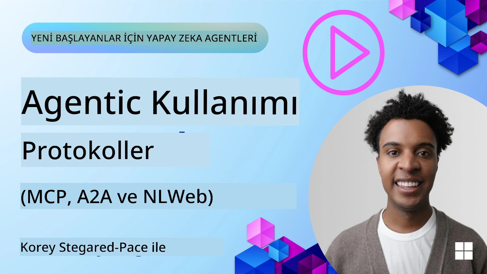
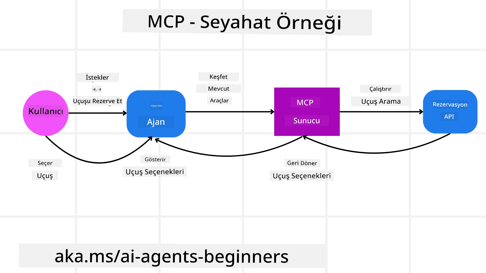
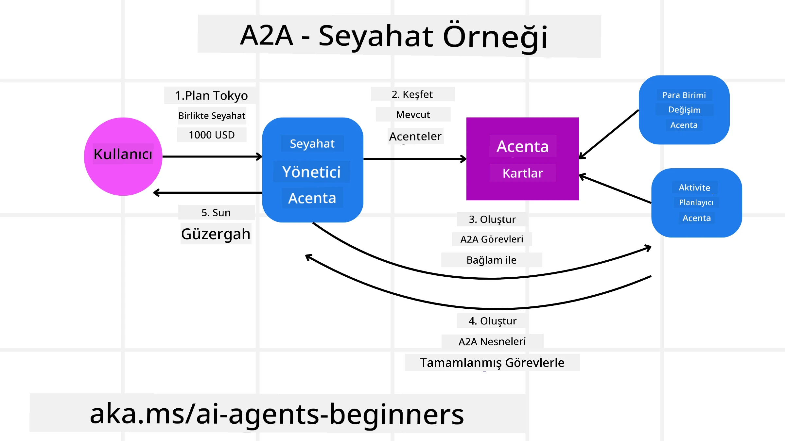
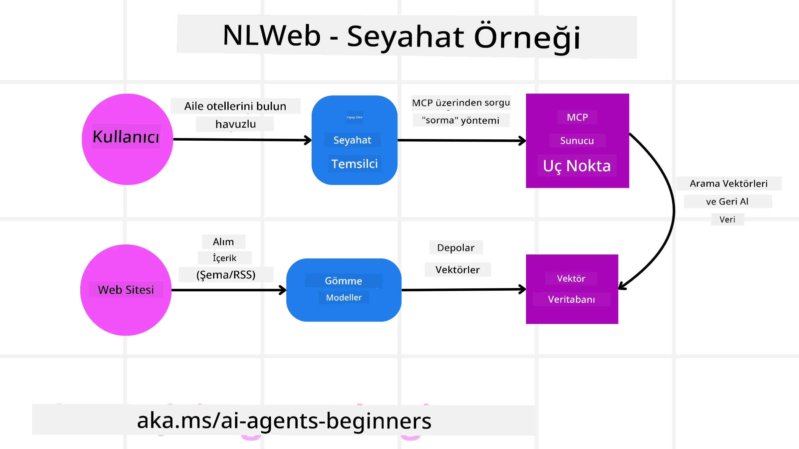

# Agentik Protokollerin Kullanımı (MCP, A2A ve NLWeb)

> _(Bu dersin videosunu izlemek için yukarıdaki görsele tıklayın)_

AI agentlarının kullanımı arttıkça, standartlaşmayı sağlayan, güvenliği garanti eden ve açık inovasyonu destekleyen protokollere olan ihtiyaç da artmaktadır. Bu derste, bu ihtiyacı karşılamaya dönük 3 protokolü ele alacağız - Model Context Protocol (MCP), Agent to Agent (A2A) ve Natural Language Web (NLWeb).

## Giriş

Bu derste şunları ele alacağız:

• **MCP**'nin AI Agentlarının kullanıcı görevlerini tamamlamak için dış araçlara ve verilere erişimini nasıl sağladığını.

• **A2A**'nın farklı AI agentları arasında iletişim ve işbirliğini nasıl mümkün kıldığını.

• **NLWeb**'in doğal dil arayüzlerini herhangi bir web sitesine getirerek AI Agentlarının içeriği keşfetmesini ve etkileşimde bulunmasını nasıl sağladığını.

## Öğrenme Hedefleri

• AI agentları bağlamında MCP, A2A ve NLWeb’in temel amaçlarını ve faydalarını **tanımlamak**.

• Her protokolün LLM’ler, araçlar ve diğer agentlar arasındaki iletişim ve etkileşimi nasıl kolaylaştırdığını **açıklamak**.

• Karmaşık agentik sistemler inşa ederken her protokolün üstlendiği farklı rolleri **görmek**.

## Model Context Protocol

**Model Context Protocol (MCP)**, uygulamaların LLM’lere bağlam ve araçlar sağlaması için standartlaştırılmış açık bir protokoldür. Bu, AI Agentlarının tutarlı bir şekilde bağlanabileceği farklı veri kaynaklarına ve araçlara "evrensel adaptör" niteliği taşır.

MCP'nin bileşenlerine, doğrudan API kullanımına göre avantajlarına ve AI agentlarının bir MCP sunucusunu nasıl kullanabileceğine bir örnek üzerinden bakalım.

### MCP Temel Bileşenleri

MCP, **istemci-sunucu mimarisi** ile çalışır ve temel bileşenleri şunlardır:

• **Hostlar**: MCP Sunucusuna bağlantıları başlatan LLM uygulamalarıdır (örneğin VSCode gibi bir kod editörü).

• **İstemciler**: Host uygulamasındaki, sunucularla bire bir bağlantıları sürdüren bileşenlerdir.

• **Sunucular**: Belirli kabiliyetleri açığa çıkaran hafif programlardır.

Protokolde, bir MCP Sunucusunun kabiliyetleri olarak üç temel ilkel vardır:

• **Araçlar**: AI agentının çağırabileceği ayrı ayrı işlevlerdir. Örneğin, bir hava durumu servisi "hava durumu alma" aracı sunabilir, ya da bir e-ticaret sunucusu "ürün satın alma" aracı sunabilir. MCP sunucuları araçların isimlerini, açıklamalarını ve giriş/çıkış şemalarını kabiliyet listesinden duyurur.

• **Kaynaklar**: Bir MCP sunucusunun sağlayabileceği okunabilir veriler veya belgeler olup, istemciler bunları talep üzerine alabilir. Örnekler dosya içerikleri, veritabanı kayıtları veya günlük dosyalarıdır. Kaynaklar hem metin (kod veya JSON gibi) hem de ikili (görseller ya da PDF gibi) olabilir.

• **Komutlar (Prompts)**: Önerilen komutları sağlayan önceden tanımlanmış şablonlardır ve daha karmaşık iş akışlarına olanak tanır.

### MCP'nin Avantajları

MCP AI Agentları için önemli avantajlar sunar:

• **Dinamik Araç Keşfi**: Agentlar, bir sunucudan uygun araçların listesini ve ne işe yaradıklarını dinamik olarak alabilir. Geleneksel API'lerin çoğunlukla entegrasyon için statik kodlama gerektirmesi ve herhangi bir API değişikliğinin kod güncellemesi anlamına gelmesiyle karşılaştırıldığında, MCP “bir kere entegre et” yaklaşımı sunar ve daha fazla esneklik sağlar.

• **LLM’ler Arası Birlikte Çalışabilirlik**: MCP, farklı LLM’ler arasında çalışarak daha iyi performans sağlamak için temel modeli değiştirme esnekliği sunar.

• **Standartlaştırılmış Güvenlik**: MCP standart bir kimlik doğrulama yöntemi içerir ve ek MCP sunucularına erişim eklerken ölçeklenebilirliği artırır. Bu, farklı anahtarlar ve kimlik doğrulama türlerini yönetmekten daha basittir.

### MCP Örneği

Bir kullanıcının MCP destekli bir AI asistanı ile uçak bileti rezervasyonu yapmak istediğini düşünelim.

1. **Bağlantı**: AI asistanı (MCP istemcisi) havayolu şirketi tarafından sunulan bir MCP sunucusuna bağlanır.

2. **Araç Keşfi**: İstemci, havayolunun MCP sunucusuna "Hangi araçlarınız var?" diye sorar. Sunucu, "uçuş arama" ve "uçuş rezervasyonu" gibi araçları listeler.

3. **Araç Çağrısı**: Siz AI asistanına, "Portland'dan Honolulu'ya uçuş ara" dersiniz. Asistan, LLM’ini kullanarak “uçuş arama” aracını çağırması gerektiğini anlar ve ilgili parametreleri (kalkış, varış) MCP sunucusuna iletir.

4. **Yürütme ve Yanıt**: MCP sunucu, bir kapsayıcı olarak havayolunun dahili rezervasyon API'sine gerçek çağrıyı yapar. Uçuş bilgilerini (örneğin JSON verisi) alır ve AI asistanına iletir.

5. **İleri Etkileşim**: AI asistanı uçuş seçeneklerini sunar. Siz bir uçuş seçtikten sonra, asistan aynı MCP sunucusunda "uçuş rezervasyonu" aracını çağırarak rezervasyonu tamamlayabilir.

## Agent-to-Agent Protokolü (A2A)

MCP LLM’leri araçlara bağlamaya odaklanırken, **Agent-to-Agent (A2A) protokolü**, farklı AI agentları arasında iletişim ve işbirliğini mümkün kılarak bir adım ileri gider. A2A, AI agentlarını farklı organizasyonlar, ortamlar ve teknoloji ortamları arasında ortak bir görevi tamamlamak için bağlar.

A2A’nın bileşenlerini ve avantajlarını inceleyecek ve seyahat uygulamamızda nasıl uygulanabileceğine bir örnek vereceğiz.

### A2A Temel Bileşenleri

A2A, agentlar arasında iletişim kurmayı ve kullanıcıya ait alt görevleri tamamlamak için işbirliği yapmayı kolaylaştırır. Protokolün her bileşeni bunun için katkıda bulunur:

#### Agent Kartı

Bir MCP sunucusunun araç listesini paylaştığı gibi, bir Agent Kartı şunları içerir:
- Agent’ın Adı.
- Tamamladığı genel görevlerin **açıklaması**.
- Diğer agentların (ve hatta insan kullanıcıların) bu agentı ne zaman ve neden çağırmak isteyeceklerini anlamaları için **özgü becerilerin listesi** ve açıklamaları.
- Agent’ın **mevcut Uç Nokta URL'si**.
- Akış yanıtları, bildirimler gibi agent **versiyonu** ve **kabiliyetleri**.

#### Agent Yürütücüsü

Kullanıcı sohbetinin bağlamını uzaktaki agenta aktarmaktan sorumludur; uzaktaki agent bu bağlama ihtiyaç duyar görevini anlayabilmek için. Bir A2A sunucusunda, bir agent kendi LLM’ini kullanarak gelen istekleri çözümler ve kendi dahili araçlarıyla görevleri yürütür.

#### Artefakt

Uzaktaki agent isteği tamamladıktan sonra, ortaya çıkan iş ürünü bir artefakt olarak oluşturulur. Bir artefakt **agentın çalışmasının sonucunu**, **tamamlanan işin açıklamasını** ve protokolle gönderilen **metinsel bağlamı** içerir. Artefakt gönderildikten sonra, gerekene kadar uzaktaki agentla bağlantı kapanır.

#### Olay Kuyruğu

Güncellemeleri yönetmek ve mesajları iletmek için kullanılır. Özellikle üretim ortamlarında, görev tamamlanmadan agentlar arası bağlantının kapanmasını önlemek için önemlidir çünkü görevlerin bitiş süresi uzun olabilir.

### A2A'nın Avantajları

• **Gelişmiş İşbirliği**: Farklı satıcı ve platformlardan agentların etkileşimde bulunmasını, bağlam paylaşmasını ve birlikte çalışmasını sağlar; geleneksel olarak ayrı sistemler arasında kesintisiz otomasyon sağlar.

• **Model Seçimi Esnekliği**: Her A2A agentı isteklerini karşılamak için hangi LLM’yi kullanacağını seçebilir; bu, bazı MCP durumlarındaki tek LLM bağlantısının aksine her agent için optimize edilmiş veya ince ayarlı modeller sunar.

• **Yerleşik Kimlik Doğrulama**: Kimlik doğrulama A2A protokolüne doğrudan entegre edilmiştir ve agent etkileşimleri için sağlam bir güvenlik çerçevesi sağlar.

### A2A Örneği

Seyahat rezervasyon senaryomuzu A2A kullanarak genişletelim.

1. **Kullanıcıdan Çoklu Agent’a İstek**: Bir kullanıcı, "Lütfen gelecek hafta için Honolulu’ya uçuş, otel ve kiralık araba dahil tam bir gezi ayarla" diyerek "Seyahat Acentesi" A2A istemci/agentı ile etkileşime girer.

2. **Seyahat Acentesi Yönetimi**: Seyahat Acentesi, bu karmaşık isteği alır. Görevi anlamak ve diğer uzman agentlarla iletişim kurması gerektiğini belirlemek için LLM’ini kullanır.

3. **Agentlar Arası İletişim**: Seyahat Acentesi, A2A protokolünü kullanarak farklı şirketler tarafından oluşturulan "Havayolu Agentı", "Otel Agentı" ve "Araba Kiralama Agentı" gibi alt agentlara bağlanır.

4. **Delegasyon ile Görev Yürütme**: Seyahat Acentesi, bu uzmanlaşmış agentlara ("Honolulu’ya uçuşları bul", "Otel rezervasyonu yap", "Araba kirala" gibi) spesifik görevler gönderir. Her biri kendi LLM’ini ve kendi araçlarını (bunlar MCP sunucuları olabilir) kullanarak rezervasyonun kendi kısmını tamamlar.

5. **Konsolide Yanıt**: Bağlı agentlar görevlerini tamamladıktan sonra Seyahat Acentesi sonuçları (uçuş bilgileri, otel onayı, araba kiralama rezervasyonu) bir araya getirip kullanıcaya sohbet tarzında kapsamlı bir yanıt gönderir.

## Doğal Dil Web (NLWeb)

Web siteleri, kullanıcıların internet üzerindeki bilgi ve verilere erişiminin birincil yolu olmuştur.

NLWeb’in farklı bileşenlerine, sağladığı faydalara ve seyahat uygulamamız üzerinden nasıl çalıştığına bakalım.

### NLWeb Bileşenleri

- **NLWeb Uygulaması (Temel Hizmet Kodu)**: Doğal dil sorularını işleyen sistemdir. Platformun farklı bölümlerini bağlayarak yanıtlar oluşturur. Bunu bir web sitesinin **doğal dil özelliklerini çalıştıran motor** olarak düşünebilirsiniz.

- **NLWeb Protokolü**: Bir web sitesi ile doğal dil etkileşim için **temel kurallar dizisidir**. Yanıtları JSON formatında (genellikle Schema.org kullanılarak) gönderir. Amacı, HTML’nin belgeleri çevrimiçi paylaşılabilir hale getirmesi gibi, "AI Web" için basit bir temel oluşturmaktır.

- **MCP Sunucusu (Model Context Protocol Uç Noktası)**: Her NLWeb kurulumu aynı zamanda bir **MCP sunucusu** olarak çalışır. Bu da başka AI sistemleriyle araçlar (örneğin "soru sor" metodu) ve veri paylaşması anlamına gelir. Pratikte, bu web sitesinin içeriğinin ve yeteneklerinin AI agentları tarafından kullanılabilir olması, sitenin daha geniş “agent ekosistemi”nin parçası olmasını sağlar.

- **Gömme Modelleri**: Bu modeller, web sitesi içeriğini sayısal temsiller olan vektörlere (gömme) dönüştürmek için kullanılır. Bu vektörler, bilgisayarların anlamı karşılaştırıp aramasını sağlar. Özel bir veritabanında saklanırlar ve kullanıcılar hangi gömme modelinin kullanılacağını seçebilir.

- **Vektör Veritabanı (Arama Mekanizması)**: Bu veritabanı **web sitesi içeriğinin gömmelerini saklar**. Bir soru sorulduğunda, NLWeb vektör veritabanını kontrol ederek en alakalı bilgileri hızlıca bulur. Benzerliğe göre sıralanmış hızlı yanıt olasılıkları listesi verir. NLWeb, Qdrant, Snowflake, Milvus, Azure AI Search ve Elasticsearch gibi çeşitli vektör depolama sistemleriyle çalışır.

### NLWeb Örneği

Seyahat rezervasyon web sitemizi tekrar düşünelim, ancak bu kez NLWeb desteğiyle.

1. **Veri Alımı**: Seyahat sitesinin mevcut ürün katalogları (örneğin uçuş listeleri, otel açıklamaları, tur paketleri) Schema.org ile biçimlendirilmiş veya RSS beslemeleri yoluyla yüklenmiştir. NLWeb araçları bu yapılandırılmış veriyi değerlendirir, gömmeler oluşturur ve bunları yerel ya da uzak bir vektör veritabanında saklar.

2. **Doğal Dil Sorgusu (İnsan)**: Bir kullanıcı siteyi ziyaret eder ve menülerde gezinmek yerine sohbet arayüzüne şunu yazar: "Gelecek hafta için havuzlu, aile dostu bir otel bul Honolulu'da".

3. **NLWeb İşlemi**: NLWeb uygulaması bu sorguyu alır, anlamak için LLM’ye iletir ve aynı anda ilgili otel listelerini bulmak için vektör veritabanında arama yapar.

4. **Doğru Sonuçlar**: LLM, veritabanındaki arama sonuçlarını yorumlar, "aile dostu", "havuz" ve "Honolulu" kriterlerine göre en iyi eşleşmeleri belirler ve ardından doğal dilde yanıtı biçimlendirir. Kritik olarak, yanıt gerçek otellere referans verir ve uydurma bilgi içermez.

5. **AI Agent Etkileşimi**: NLWeb bir MCP sunucusu olduğu için, dışarıdaki bir AI seyahat agentı da bu web sitesinin NLWeb örneğine bağlanabilir. AI agentı, siteye doğrudan sorgu göndermek için `ask` MCP metodunu kullanabilir: `ask("Honolulu bölgesindeki otel tarafından önerilen vegan dostu restoranlar var mı?")`. NLWeb bunu işler, eğer restoran bilgileri yüklüyse veritabanını kullanır ve yapılandırılmış JSON yanıtı döner.

### MCP/A2A/NLWeb hakkında Daha Fazla Sorunuz mu Var?

Diğer öğrenenlerle tanışmak, ofis saatlerine katılmak ve AI Agentları sorularınıza yanıt almak için [Microsoft Foundry Discord](https://discord.com/invite/ATgtXmAS5D)’a katılın.

## Kaynaklar

- [MCP for Beginners](https://aka.ms/mcp-for-beginners)  
- [MCP Documentation](https://learn.microsoft.com/python/api/overview/azure/ai-projects-readme)
- [NLWeb Repo](https://github.com/nlweb-ai/NLWeb)
- [Microsoft Agent Framework](https://learn.microsoft.com/en-us/agent-framework/overview/?wt.mc_id=youtube_26688_organicsocial_reactor&pivots=programming-language-python)

## Önceki Ders

[Üretimde AI Agentları](../10-ai-agents-production/README.md)

## Sonraki Ders

[AI Agentları için Bağlam Mühendisliği](../12-context-engineering/README.md)

---

<!-- CO-OP TRANSLATOR DISCLAIMER START -->
**Feragatname**:
Bu belge, AI çeviri hizmeti [Co-op Translator](https://github.com/Azure/co-op-translator) kullanılarak çevrilmiştir. Doğruluk için çaba sarf etsek de, otomatik çevirilerin hata veya yanlışlık içerebileceğini lütfen unutmayınız. Orijinal belge, kendi dilinde yetkili kaynak olarak kabul edilmelidir. Kritik bilgiler için profesyonel insan çevirisi önerilir. Bu çevirinin kullanımı sonucu ortaya çıkabilecek yanlış anlamalardan veya yanlış yorumlamalardan sorumlu değiliz.
<!-- CO-OP TRANSLATOR DISCLAIMER END -->