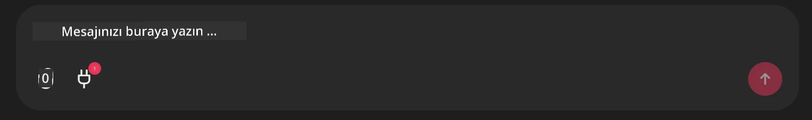

# Github MCP Sunucu Örneği

## Açıklama

Bu, Microsoft Reactor tarafından düzenlenen AI Agents Hackathon için oluşturulmuş bir demoydu.

Araç, bir kullanıcının Github depolarına dayanarak hackathon projeleri önermek için kullanılır.
Bu şu şekilde yapılır:

1. **Github Agent** - Github MCP Sunucusunu kullanarak depoları ve bu depolarla ilgili bilgileri alır.
2. **Hackathon Agent** - Github Agent'tan gelen verileri alır ve kullanıcının projelerine, kullandığı dillere ve AI Agents hackathon proje kategorilerine göre yaratıcı hackathon proje fikirleri üretir.
3. **Events Agent** - Hackathon agentinin önerisine dayanarak, Events Agent AI Agent Hackathon serisinden ilgili etkinlikleri önerir.

## Kodu Çalıştırma 

### Ortam Değişkenleri

Bu demo Microsoft Agent Framework, Azure OpenAI Service, Github MCP Server ve Azure AI Search kullanır.

Bu araçları kullanmak için uygun ortam değişkenlerinin ayarlı olduğundan emin olun:

```python
AZURE_AI_PROJECT_ENDPOINT=""
AZURE_AI_MODEL_DEPLOYMENT_NAME=""
AZURE_SEARCH_SERVICE_ENDPOINT=""
AZURE_SEARCH_API_KEY=""
``` 

## Chainlit Sunucusunu Çalıştırma

MCP sunucusuna bağlanmak için bu demo, Chainlit'i bir sohbet arayüzü olarak kullanır. 

Sunucuyu çalıştırmak için terminalinizde aşağıdaki komutu kullanın:

```bash
chainlit run app.py -w
```

Bu, Chainlit sunucunuzu `localhost:8000` üzerinde başlatmalı ve aynı zamanda `event-descriptions.md` içeriği ile Azure AI Search dizininizi doldurmalıdır. 

## MCP Sunucusuna Bağlanma

Github MCP Sunucusuna bağlanmak için, "Mesajınızı buraya yazın.." sohbet kutusunun altındaki "plug" simgesini seçin:



Buradan Github MCP Sunucusuna bağlanmak için komutu eklemek üzere "Bir MCP Bağla" üzerine tıklayabilirsiniz:

```bash
npx -y @modelcontextprotocol/server-github --env GITHUB_PERSONAL_ACCESS_TOKEN=[YOUR PERSONAL ACCESS TOKEN]
```

"[YOUR PERSONAL ACCESS TOKEN]" ifadesini gerçek Personal Access Token'ınız ile değiştirin. 

Bağlandıktan sonra, bağlantıyı doğrulamak için plug simgesinin yanında (1) görmelisiniz. Görmüyorsanız, chainlit sunucusunu `chainlit run app.py -w` ile yeniden başlatmayı deneyin.

## Demoyu Kullanma 

Hackathon projeleri önermeye yönelik ajan iş akışını başlatmak için şöyle bir mesaj yazabilirsiniz: 

"Recommend hackathon projects for the Github user koreyspace"

Router Agent isteğinizi analiz edecek ve sorgunuzu ele almak için hangi ajan kombinasyonunun (GitHub, Hackathon ve Events) en uygun olduğunu belirleyecektir. Ajanlar, GitHub depo analizine, proje fikir üretimine ve ilgili teknoloji etkinliklerine dayanarak kapsamlı öneriler sunmak için birlikte çalışır.

---

<!-- CO-OP TRANSLATOR DISCLAIMER START -->
Feragatname:
Bu belge, yapay zeka çeviri hizmeti [Co-op Translator](https://github.com/Azure/co-op-translator) kullanılarak çevrilmiştir. Doğruluğa özen göstersek de, otomatik çevirilerin hatalar veya eksiklikler içerebileceğini lütfen unutmayın. Orijinal belge, kendi dilindeki versiyonu yetkili kaynak olarak kabul edilmelidir. Kritik bilgiler için profesyonel insan çevirisi önerilir. Bu çevirinin kullanımı nedeniyle ortaya çıkabilecek herhangi bir yanlış anlama veya yanlış yorumlamadan sorumlu değiliz.
<!-- CO-OP TRANSLATOR DISCLAIMER END -->