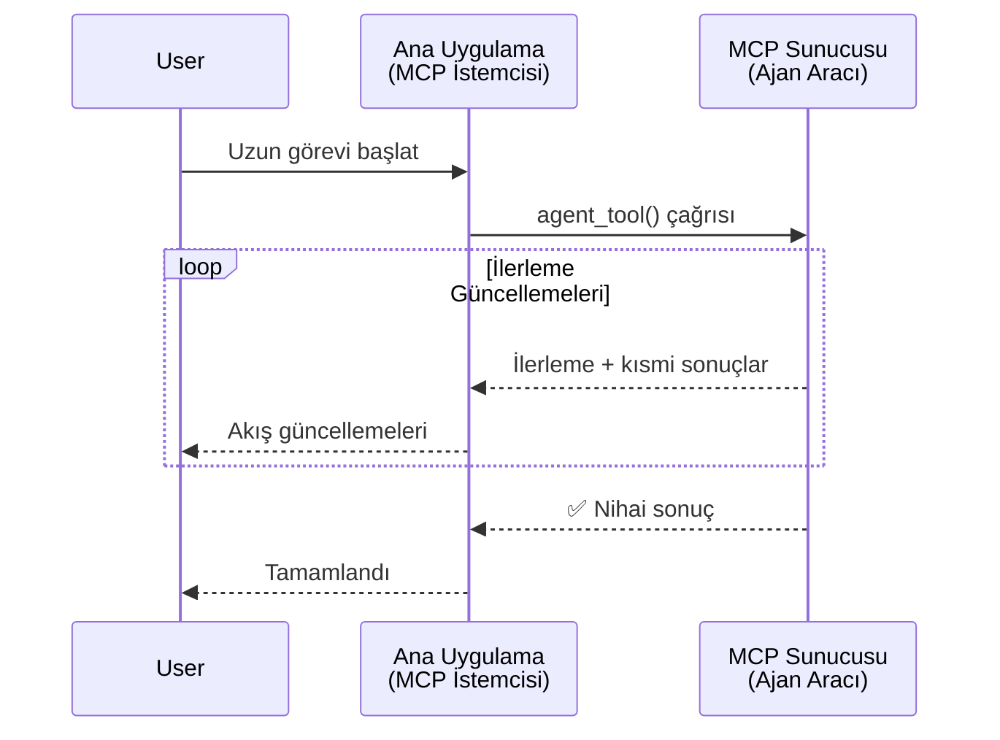
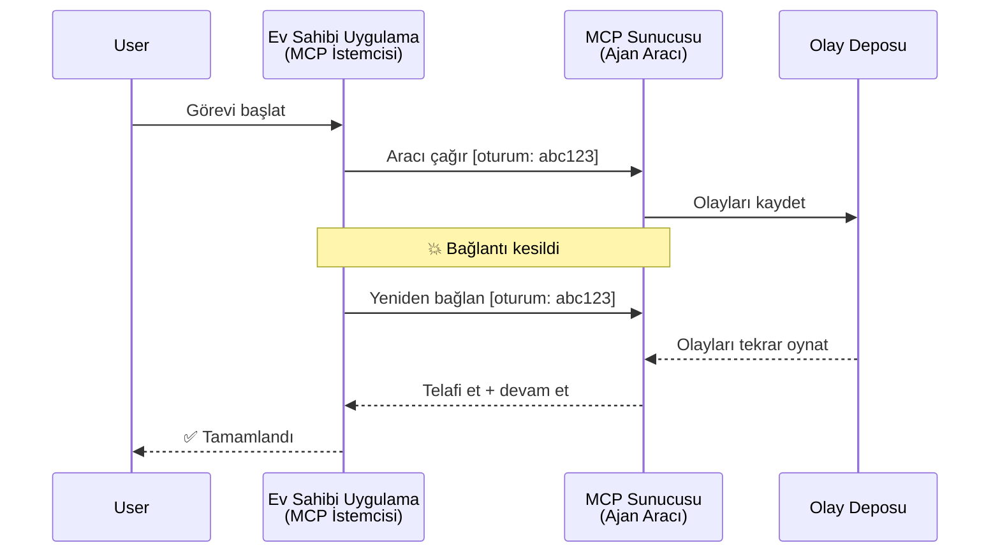
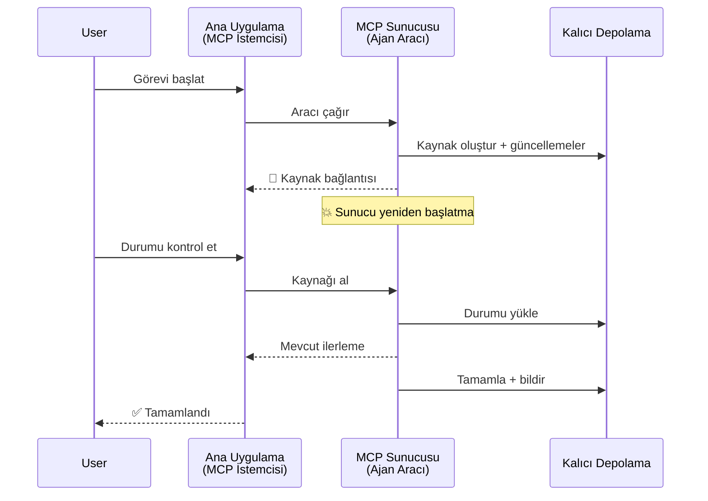
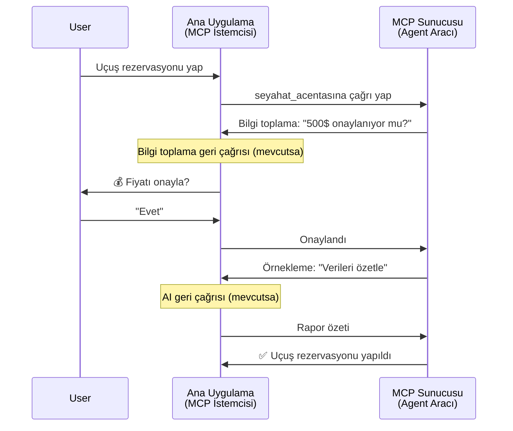
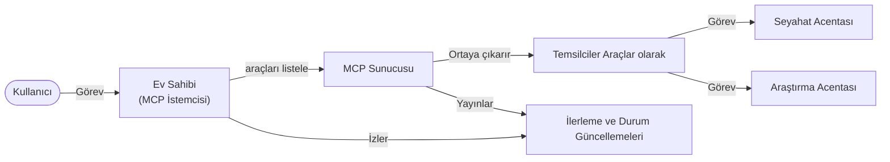

# MCP ile Agent-to-Agent İletişim Sistemleri Oluşturmak

> Özet - MCP Üzerinde Agent2Agent İletişim Kurabilir misiniz? Evet!

MCP, orijinal hedefi olan "LLM'lere bağlam sağlama"dan çok daha ileriye evrildi. [Devam edilebilir akımlar](https://modelcontextprotocol.io/docs/concepts/transports#resumability-and-redelivery), [yöneltme](https://modelcontextprotocol.io/specification/2025-06-18/client/elicitation), [örnekleme](https://modelcontextprotocol.io/specification/2025-06-18/client/sampling) ve bildirimler ([ilerleme](https://modelcontextprotocol.io/specification/2025-06-18/basic/utilities/progress) ve [kaynaklar](https://modelcontextprotocol.io/specification/2025-06-18/schema#resourceupdatednotification)) gibi son gelişmelerle MCP, karmaşık agent-to-agent iletişim sistemleri kurmak için sağlam bir temel sağlar.

## Agent/Araç Yanılgısı

Daha fazla geliştirici uzun süre çalışan, yürütme sırasında ek girdi gerektirebilen vb. ajan davranışlarına sahip araçları keşfettikçe, MCP'nin erken araç örneklerinin basit istek-yanıt kalıplarına odaklanması nedeniyle MCP'nin uygun olmadığına dair yaygın bir yanılgı vardır.

Bu algı artık güncel değil. MCP spesifikasyonu, uzun süre çalışan ajan davranışı oluşturmadaki farkı kapatan yeteneklerle son birkaç ayda önemli ölçüde geliştirildi:

- **Akış ve Kısmi Sonuçlar**: Yürütme sırasında gerçek zamanlı ilerleme güncellemeleri
- **Devam Edebilirlik**: Bağlantı kesildikten sonra istemciler yeniden bağlanıp devam edebilir
- **Dayanıklılık**: Sonuçlar sunucu yeniden başlatmalarından sonra korunur (örneğin, kaynak bağlantıları ile)
- **Çok Turlu**: Yürütme sırasında etkileşimli girdi, yöneltme ve örnekleme yoluyla

Bu özellikler, MCP protokolü üzerinde dağıtılan karmaşık ajan ve çok ajan uygulamalarını mümkün kılmak için birleştirilebilir.

Referans olarak, bir ajanı MCP sunucusunda mevcut olan bir "araç" olarak adlandıracağız. Bu, bir MCP sunucusu ile oturum kuran ve ajanı çağırabilen bir MCP istemcisi uygulayan bir ana uygulamanın varlığını ima eder.

## Bir MCP Aracını "Ajanik" Yapan Nedir?

Uygulamaya dalmadan önce, uzun süre çalışan ajanları desteklemek için hangi altyapı yeteneklerinin gerektiğini belirleyelim.

> Bir ajanı, uzunca süreler boyunca otonom çalışabilen, çoklu etkileşim veya gerçek zamanlı geribildirim temelinde ayarlamalar yapabilen karmaşık görevleri yerine getirebilen bir varlık olarak tanımlayacağız.

### 1. Akış ve Kısmi Sonuçlar

Geleneksel istek-yanıt kalıpları uzun süren görevler için uygun değildir. Ajanların sağlaması gerekenler:

- Gerçek zamanlı ilerleme güncellemeleri
- Ara sonuçlar

**MCP Desteği**: Kaynak güncelleme bildirimleri kısmi sonuçların akışını sağlar, ancak bu JSON-RPC'nin 1:1 istek/yanıt modeli ile çakışmaları önlemek için dikkatli tasarım gerektirir.

| Özellik                   | Kullanım Durumu                                                                                                                                                                   | MCP Desteği                                                                               |
| ------------------------- | -------------------------------------------------------------------------------------------------------------------------------------------------------------------------------- | ----------------------------------------------------------------------------------------- |
| Gerçek Zamanlı İlerleme   | Kullanıcı bir kod tabanı geçiş görevi ister. Ajan ilerlemeyi aktarır: "10% - Bağımlılıklar analiz ediliyor... 25% - TypeScript dosyaları dönüştürülüyor... 50% - İçe aktarımlar güncelleniyor..." | ✅ İlerleme bildirimleri                                                                  |
| Kısmi Sonuçlar            | "Bir kitap oluştur" görevi kısmi sonuçları aktarır: 1) Hikaye arkı taslağı, 2) Bölüm listesi, 3) Her bölüm tamamlandıkça. Ana uygulama herhangi bir aşamada inceleyebilir, iptal edebilir veya yönlendirebilir. | ✅ Bildirimler "uzatılabilir" kısmi sonuçlar için PR 383, 776'de önerilere bakınız            |

<div align="center" style="font-style: italic; font-size: 0.95em; margin-bottom: 0.5em;">
<strong>Şekil 1:</strong> Bu diyagram, MCP ajanının uzun süren bir görev sırasında ana uygulamaya gerçek zamanlı ilerleme güncellemeleri ve kısmi sonuçlar nasıl aktardığını gösterir, kullanıcının yürütmeyi gerçek zamanlı izlemesini sağlar.
</div>



### 2. Devam Edebilirlik

Ajanların ağ kesintilerini zarifçe yönetmesi gerekir:

- (istemci) bağlantı kesilmesinden sonra yeniden bağlanma
- Kaldığı yerden devam etme (mesajların yeniden teslimi)

**MCP Desteği**: MCP StreamableHTTP taşıması bugün oturum devam ettirme ve mesaj yeniden teslimini oturum kimlikleri ve son olay kimlikleri ile destekler. Burada önemli nokta, sunucunun istemci yeniden bağlandığında olay tekrarlarını mümkün kılan bir Olay Deposu uygulaması yapmasıdır.
Toplulukta, taşıma-agnostik devam edilebilir akışları araştıran bir öneri (PR #975) bulunmaktadır.

| Özellik       | Kullanım Durumu                                                                                                                                                | MCP Desteği                                                               |
| ------------- | ------------------------------------------------------------------------------------------------------------------------------------------------------------- | ------------------------------------------------------------------------- |
| Devam Edebilir | İstemci uzun süren bir görev sırasında bağlantısı kesilir. Yeniden bağlandığında, oturum kaybedilen olayların tekrar oynatılmasıyla kaldığı yerden sorunsuz devam eder. | ✅ Oturum kimlikleri, olay tekrarları ve Olay Deposu ile StreamableHTTP taşıması |

<div align="center" style="font-style: italic; font-size: 0.95em; margin-bottom: 0.5em;">
<strong>Şekil 2:</strong> Bu diyagram, MCP'nin StreamableHTTP taşıması ve olay deposunun kesintisiz oturum devamını nasıl sağladığını gösterir: istemci bağlantısı kesilirse, yeniden bağlanabilir ve kaçırılan olayları tekrar oynatabilir, böylece görev ilerlemesini kaybetmeden devam eder.
</div>



### 3. Dayanıklılık

Uzun çalışan ajanların kalıcı duruma ihtiyacı vardır:

- Sonuçlar sunucu yeniden başlatmalarını atlatır
- Durum out-of-band (bant-dışı) alınabilir
- Oturumlar arası ilerleme takibi

**MCP Desteği**: MCP artık araç çağrıları için Kaynak bağlantısı dönüş tipini destekliyor. Bugün yaygın bir desen, arka planda işi sürdüren ve kaynak güncellemeleri ile ilerlemeyi bildiren bir kaynak yaratarak hemen kaynak bağlantısını döndüren bir araç tasarlamaktır. İstemci, kısmi veya tam sonuçlar almak için bu kaynağın durumunu yoklayabilir veya güncelleme bildirimlerine abone olabilir.

Burada bir kısıtlama, kaynakları yoklama ya da güncellemelere abone olmanın ölçeklendirmede kaynak tüketimine yol açmasıdır. Sunucunun istemci/ana uygulamayı güncellemelerden haberdar etmek için çağırabileceği webhook veya tetikleyiciler içerebilme ihtimali üzerine açık bir topluluk önerisi (#992 dahil) bulunmaktadır.

| Özellik   | Kullanım Durumu                                                                                              | MCP Desteği                                                     |
| --------- | ----------------------------------------------------------------------------------------------------------- | --------------------------------------------------------------- |
| Dayanıklılık | Veri geçişi görevi sırasında sunucu çöker. Sonuçlar ve ilerleme yeniden başlatmadan sağ kurtulur, istemci durumu kontrol edip kalıcı kaynaktan devam eder. | ✅ Kalıcı depolama ve durum bildirimleri içeren kaynak bağlantıları |

Bugün yaygın bir desen, bir kaynak yaratan ve hemen kaynak bağlantısını döndüren bir araç tasarlamaktır. Araç arka planda görevi yürütür, ilerleme güncellemeleri veya kısmi sonuçlar sağlayan kaynak bildirimleri oluşturur ve gerektiğinde kaynaktaki içeriği günceller.

<div align="center" style="font-style: italic; font-size: 0.95em; margin-bottom: 0.5em;">
<strong>Şekil 3:</strong> Bu diyagram, MCP ajanlarının kalıcı kaynaklar ve durum bildirimlerini kullanarak, uzun süre çalışan görevlerin sunucu yeniden başlatmalarını atlatmasını ve istemcilerin ilerlemeyi izleyip sonuçları başarısızlık sonrası da alabilmesini nasıl sağladığını gösterir.
</div>



### 4. Çok Turlu Etkileşimler

Ajanlar sıklıkla yürütme sırasında ek girdiye ihtiyaç duyar:

- İnsan tarafından açıklama veya onay
- Karmaşık kararlar için yapay zeka yardımı
- Dinamik parametre ayarı

**MCP Desteği**: Yöneltme (insan girdisi için) ve örnekleme (Yapay Zeka girdisi için) yoluyla tamamen desteklenir.

| Özellik                  | Kullanım Durumu                                                                                                                                       | MCP Desteği                                              |
| ------------------------ | ---------------------------------------------------------------------------------------------------------------------------------------------------- | --------------------------------------------------------- |
| Çok Turlu Etkileşimler   | Seyahat rezervasyon aracısı kullanıcıdan fiyat onayı ister, sonra rezervasyonu tamamlamadan önce yapay zekadan seyahat verilerini özetlemesini ister. | ✅ İnsan girişi için yöneltme, yapay zeka girişi için örnekleme |

<div align="center" style="font-style: italic; font-size: 0.95em; margin-bottom: 0.5em;">
<strong>Şekil 4:</strong> Bu diyagram, MCP ajanlarının yürütme sırasında insan girdisi almak veya yapay zekadan yardım istemek suretiyle nasıl etkileşimde bulunabileceğini ve çok turlu, karmaşık iş akışlarını (onaylar ve dinamik karar alma gibi) desteklediğini gösterir.
</div>



## MCP Üzerinde Uzun Süren Ajanların Uygulanması - Kod Genel Bakış

Bu makale kapsamında, MCP Python SDK'sını StreamableHTTP taşıma ile oturum devam ettirme ve mesaj yeniden teslimi için kullanan uzun süre çalışan ajanların tam bir uygulamasını içeren bir [kod deposu](https://github.com/victordibia/ai-tutorials/tree/main/MCP%20Agents) sağlıyoruz. Uygulama MCP yeteneklerinin nasıl birleştirilebileceğini ve sofistike ajan benzeri davranışları nasıl sağlayabileceğini gösterir.

Özellikle, iki ana ajan aracı sunucusu uygularız:

- **Seyahat Ajanı** - Yöneltme yoluyla fiyat onayı veren seyahat rezervasyon servisini simüle eder
- **Araştırma Ajanı** - Örnekleme yoluyla yapay zeka destekli özetlerle araştırma görevleri yapar

Her iki ajan gerçek zamanlı ilerleme güncellemeleri, etkileşimli onaylar ve tam oturum devam ettirme yeteneklerini gösterir.

### Anahtar Uygulama Kavramları

Aşağıdaki bölümler her yetenek için sunucu tarafı ajan uygulaması ve istemci tarafı ana uygulama işleyişini gösterir:

#### Akış ve İlerleme Güncellemeleri - Gerçek Zamanlı Görev Durumu

Akış, ajanların uzun süren görevlerde gerçek zamanlı ilerleme güncellemeleri sağlamasını mümkün kılar, böylece kullanıcılar görev durumu ve ara sonuçlar hakkında bilgi sahibi olur.

**Sunucu Uygulaması (ajan ilerleme bildirimleri gönderir):**

```python
# Sunucu/server.py'den - Seyahat acentesi ilerleme güncellemeleri gönderiyor
for i, step in enumerate(steps):
    await ctx.session.send_progress_notification(
        progress_token=ctx.request_id,
        progress=i * 25,
        total=100,
        message=step,
        related_request_id=str(ctx.request_id)
    )
    await anyio.sleep(2)  # İş simülasyonu

# Alternatif: Ayrıntılı adım adım güncellemeler için günlük mesajları
await ctx.session.send_log_message(
    level="info",
    data=f"Processing step {current_step}/{steps} ({progress_percent}%)",
    logger="long_running_agent",
    related_request_id=ctx.request_id,
)
```

**İstemci Uygulaması (ana uygulama ilerleme güncellemeleri alır):**

```python
# client/client.py dosyasından - Gerçek zamanlı bildirimleri yöneten istemci
async def message_handler(message) -> None:
    if isinstance(message, types.ServerNotification):
        if isinstance(message.root, types.LoggingMessageNotification):
            console.print(f"📡 [dim]{message.root.params.data}[/dim]")
        elif isinstance(message.root, types.ProgressNotification):
            progress = message.root.params
            console.print(f"🔄 [yellow]{progress.message} ({progress.progress}/{progress.total})[/yellow]")

# Oturum oluşturulurken mesaj işleyicisini kaydet
async with ClientSession(
    read_stream, write_stream,
    message_handler=message_handler
) as session:
```

#### Yöneltme - Kullanıcı Girdisi İsteği

Yöneltme, ajanların yürütme sırasında kullanıcıdan girdi istemesini sağlar. Bu, onaylar, açıklamalar veya onaylar için kritik önemdedir.

**Sunucu Uygulaması (ajan onay ister):**

```python
# Server/server.py'den - Fiyat onayı talep eden seyahat acentesi
elicit_result = await ctx.session.elicit(
    message=f"Please confirm the estimated price of $1200 for your trip to {destination}",
    requestedSchema=PriceConfirmationSchema.model_json_schema(),
    related_request_id=ctx.request_id,
)

if elicit_result and elicit_result.action == "accept":
    # Rezervasyona devam et
    logger.info(f"User confirmed price: {elicit_result.content}")
elif elicit_result and elicit_result.action == "decline":
    # Rezervasyonu iptal et
    booking_cancelled = True
```

**İstemci Uygulaması (ana uygulama yöneltme geri çağrısı sağlar):**

```python
# client/client.py'den - İstemci yoklama isteklerini işleme
async def elicitation_callback(context, params):
    console.print(f"💬 Server is asking for confirmation:")
    console.print(f"   {params.message}")

    response = console.input("Do you accept? (y/n): ").strip().lower()

    if response in ['y', 'yes']:
        return types.ElicitResult(
            action="accept",
            content={"confirm": True, "notes": "Confirmed by user"}
        )
    else:
        return types.ElicitResult(
            action="decline",
            content={"confirm": False, "notes": "Declined by user"}
        )

# Oturum oluşturulurken geri çağırmayı kaydet
async with ClientSession(
    read_stream, write_stream,
    elicitation_callback=elicitation_callback
) as session:
```

#### Örnekleme - Yapay Zeka Yardımı İsteği

Örnekleme, ajanların karmaşık kararlar veya içerik oluşturma için çalıştırma sırasında LLM desteği istemesini sağlar. Bu hibrit insan-yapay zeka iş akışlarını mümkün kılar.

**Sunucu Uygulaması (ajan yapay zeka yardımı ister):**

```python
# Server/server.py'den - Araştırma ajanı AI özeti istiyor
sampling_result = await ctx.session.create_message(
    messages=[
        SamplingMessage(
            role="user",
            content=TextContent(type="text", text=f"Please summarize the key findings for research on: {topic}")
        )
    ],
    max_tokens=100,
    related_request_id=ctx.request_id,
)

if sampling_result and sampling_result.content:
    if sampling_result.content.type == "text":
        sampling_summary = sampling_result.content.text
        logger.info(f"Received sampling summary: {sampling_summary}")
```

**İstemci Uygulaması (ana uygulama örnekleme geri çağrısı sağlar):**

```python
# client/client.py'den - İstemciden örnekleme isteklerini işleme
async def sampling_callback(context, params):
    message_text = params.messages[0].content.text if params.messages else 'No message'
    console.print(f"🧠 Server requested sampling: {message_text}")

    # Gerçek bir uygulamada, bu bir LLM API'sini çağırabilir
    # Demo amaçlı, sahte bir yanıt sağlıyoruz
    mock_response = "Based on current research, MCP has evolved significantly..."

    return types.CreateMessageResult(
        role="assistant",
        content=types.TextContent(type="text", text=mock_response),
        model="interactive-client",
        stopReason="endTurn"
    )

# Oturum oluşturulurken geri çağrıyı kaydet
async with ClientSession(
    read_stream, write_stream,
    sampling_callback=sampling_callback,
    elicitation_callback=elicitation_callback
) as session:
```

#### Devam Edebilirlik - Bağlantı Kesintileri Arasında Oturum Sürekliliği

Devam edebilirlik, uzun süren ajan görevlerinin istemci bağlantı kesintilerinden sağ çıkmasını ve yeniden bağlandığında sorunsuzca devam etmesini sağlar. Bu, olay depoları ve devam ettirme jetonlarıyla uygulanır.

**Olay Deposu Uygulaması (sunucu oturum durumunu tutar):**

```python
# Server/event_store.py'den - Basit bellek içi olay deposu
class SimpleEventStore(EventStore):
    def __init__(self):
        self._events: list[tuple[StreamId, EventId, JSONRPCMessage]] = []
        self._event_id_counter = 0

    async def store_event(self, stream_id: StreamId, message: JSONRPCMessage) -> EventId:
        """Store an event and return its ID."""
        self._event_id_counter += 1
        event_id = str(self._event_id_counter)
        self._events.append((stream_id, event_id, message))
        return event_id

    async def replay_events_after(self, last_event_id: EventId, send_callback: EventCallback) -> StreamId | None:
        """Replay events after the specified ID for resumption."""
        start_index = None
        stream_id = None
        for index, (event_stream_id, event_id, _) in enumerate(self._events):
            if event_id == last_event_id:
                start_index = index + 1
                stream_id = event_stream_id
                break

        if start_index is None:
            return None

        # Oturumun orijinal akışından sadece sonraki olayları tekrar oynat.
        for event_stream_id, event_id, message in self._events[start_index:]:
            if event_stream_id != stream_id:
                continue
            await send_callback(EventMessage(message, event_id))

        return stream_id

# Server/server.py'den - Olay deposunu oturum yöneticisine geçir
def create_server_app(event_store: Optional[EventStore] = None) -> Starlette:
    server = ResumableServer()

    # Devam için olay deposu ile oturum yöneticisi oluştur
    session_manager = StreamableHTTPSessionManager(
        app=server,
        event_store=event_store,  # Olay deposu, oturum devamını sağlar
        json_response=False,
        security_settings=security_settings,
    )

    return Starlette(routes=[Mount("/mcp", app=session_manager.handle_request)])

# Kullanım: Olay deposu ile başlat
event_store = SimpleEventStore()
app = create_server_app(event_store)
```

**Devam ettirme Jetonlu İstemci Metaverisi (istemci saklanan durumla yeniden bağlanır):**

```python
# client/client.py'den - Meta verilerle istemci devamı
if existing_tokens and existing_tokens.get("resumption_token"):
    # Kaldığımız yerden devam etmek için mevcut devam jetonunu kullan
    metadata = ClientMessageMetadata(
        resumption_token=existing_tokens["resumption_token"],
    )
else:
    # Alındığında devam jetonunu kaydetmek için geri arama oluştur
    def enhanced_callback(token: str):
        protocol_version = getattr(session, 'protocol_version', None)
        token_manager.save_tokens(session_id, token, protocol_version, command, args)

    metadata = ClientMessageMetadata(
        on_resumption_token_update=enhanced_callback,
    )

# Devam meta verisi ile istek gönder
result = await session.send_request(
    types.ClientRequest(
        types.CallToolRequest(
            method="tools/call",
            params=types.CallToolRequestParams(name=command, arguments=args)
        )
    ),
    types.CallToolResult,
    metadata=metadata,
)
```

Ana uygulama, oturum kimliklerini ve devam ettirme jetonlarını yerel olarak korur, böylece ilerlemeyi veya durumu kaybetmeden mevcut oturumlara yeniden bağlanabilir.

### Kod Organizasyonu

<div align="center" style="font-style: italic; font-size: 0.95em; margin-bottom: 0.5em;">
<strong>Şekil 5:</strong> MCP tabanlı ajan sistem mimarisi
</div>



**Anahtar Dosyalar:**

- **`server/server.py`** - Yöneltme, örnekleme ve ilerleme güncellemelerini gösteren devam edilebilir MCP sunucusu Seyahat ve Araştırma ajanları ile
- **`client/client.py`** - Devam ettirme desteği, geri çağrı işleyicileri ve jeton yönetimi içeren etkileşimli ana uygulama
- **`server/event_store.py`** - Oturum devam ettirme ve mesaj yeniden teslimini mümkün kılan olay deposu uygulaması

## MCP Üzerinde Çok Ajanlı İletişime Genişletme

Yukarıdaki uygulama, ana uygulamanın zekasını ve kapsamını geliştirerek çok ajanlı sistemlere genişletilebilir:

- **Akıllı Görev Parçalaması**: Ana uygulama karmaşık kullanıcı isteklerini analiz eder ve bunları farklı uzman ajanlar için alt görevlere böler
- **Çoklu Sunucu Koordinasyonu**: Ana uygulama, farklı ajan yetenekleri sunan birden fazla MCP sunucusuna bağlantıları sürdürür
- **Görev Durum Yönetimi**: Ana uygulama, çoklu eşzamanlı ajan görevlerindeki ilerlemeyi, bağımlılıkları ve sıralamayı takip eder
- **Dayanıklılık ve Yeniden Denemeler**: Ana uygulama hataları yönetir, yeniden deneme mantığı uygular ve ajanlar kullanılamaz hale geldiğinde görevleri farklı yönlendirir
- **Sonuç Sentezi**: Ana uygulama çoklu ajanlardan çıkan çıktıları uyumlu nihai sonuçlarda birleştirir

Ana uygulama, basit bir istemciden, dağıtık ajan yeteneklerini koordine eden zeki bir orkestratöre evrilir; aynı MCP protokol temelini korur.

## Sonuç

MCP'nin geliştirilmiş yetenekleri - kaynak bildirimleri, yöneltme/örnekleme, devam edilebilir akışlar ve kalıcı kaynaklar - karmaşık agent-to-agent etkileşimleri sağlarken protokol basitliğini korur.

## Başlarken

Kendi agent2agent sisteminizi kurmaya hazır mısınız? Bu adımları izleyin:

### 1. Demoyu Çalıştırın

```bash
# Devam için olay deposuyla sunucuyu başlat
python -m server.server --port 8006

# Başka bir terminalde, etkileşimli istemciyi çalıştırın
python -m client.client --url http://127.0.0.1:8006/mcp
```

**Etkileşimli modda mevcut komutlar:**

- `travel_agent` - Yöneltme yoluyla fiyat onayı ile seyahat rezervasyonu yapma
- `research_agent` - Örnekleme yoluyla yapay zeka destekli özetler ile araştırma konuları
- `list` - Mevcut tüm araçları göster
- `clean-tokens` - Devam ettirme jetonlarını temizle
- `help` - Detaylı komut yardımını göster
- `quit` - İstemciden çık

### 2. Devam Etme Yeteneğini Test Edin

- Uzun süre çalışan bir ajan başlatın (örn., `travel_agent`)
- Çalıştırma sırasında istemciyi durdurun (Ctrl+C)
- İstemciyi yeniden başlatın - otomatik olarak kaldığı yerden devam edecektir

### 3. Keşfedin ve Genişletin

- **Örnekleri keşfedin**: Bu [mcp-agents](https://github.com/victordibia/ai-tutorials/tree/main/MCP%20Agents) deposunu inceleyin
- **Topluluğa katılın**: GitHub'daki MCP tartışmalarına katılın
- **Deney yapın**: Basit bir uzun süren görevle başlayın ve kademeli olarak akış, devam edebilirlik ve çoklu ajan koordinasyonunu ekleyin

Bu, MCP'nin zeki ajan davranışlarını araç tabanlı sadelikle nasıl mümkün kıldığını gösterir.

Genel olarak, MCP protokol spesifikasyonu hızla gelişiyor; okuyucu resmi dokümantasyon sitesini en son güncellemeler için incelemeye teşvik edilir - https://modelcontextprotocol.io/introduction

---

<!-- CO-OP TRANSLATOR DISCLAIMER START -->
**Feragatname**:
Bu belge, AI çeviri hizmeti [Co-op Translator](https://github.com/Azure/co-op-translator) kullanılarak çevrilmiştir. Doğruluk için çaba sarf etsek de, otomatik çevirilerin hata veya yanlışlık içerebileceğini lütfen unutmayınız. Orijinal belge, kendi dilinde yetkili kaynak olarak kabul edilmelidir. Kritik bilgiler için profesyonel insan çevirisi önerilir. Bu çevirinin kullanımı sonucu ortaya çıkabilecek yanlış anlamalardan veya yanlış yorumlamalardan sorumlu değiliz.
<!-- CO-OP TRANSLATOR DISCLAIMER END -->