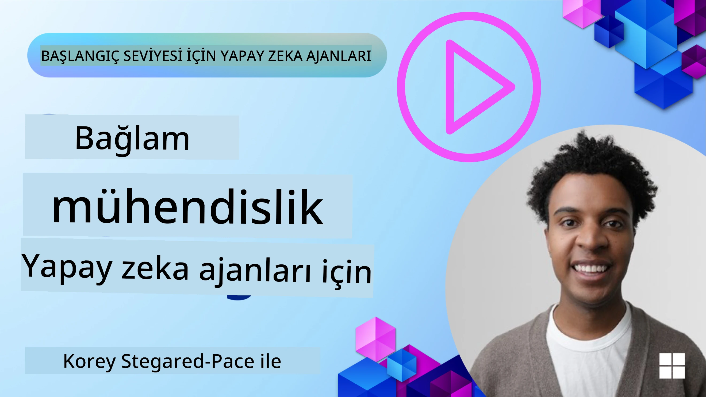
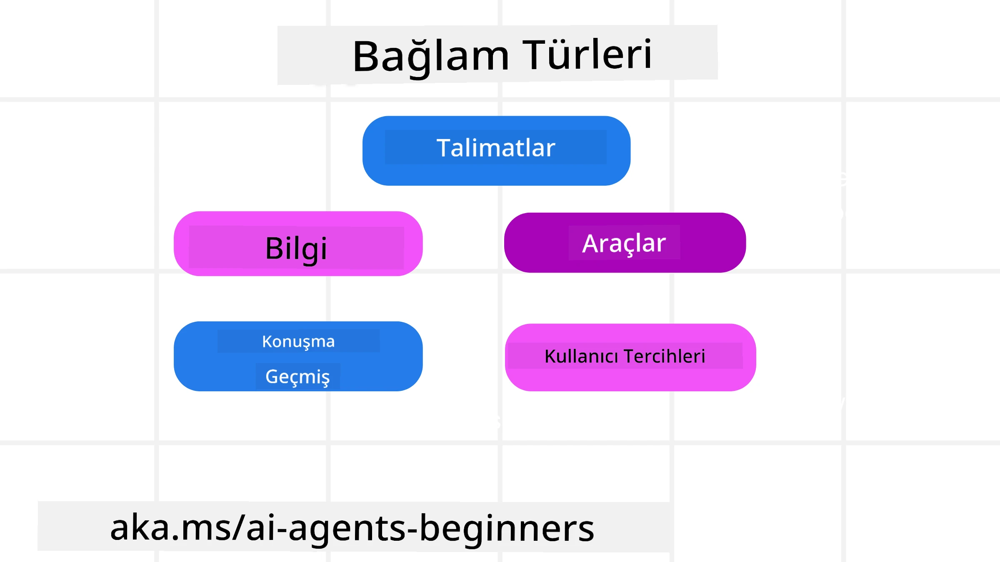
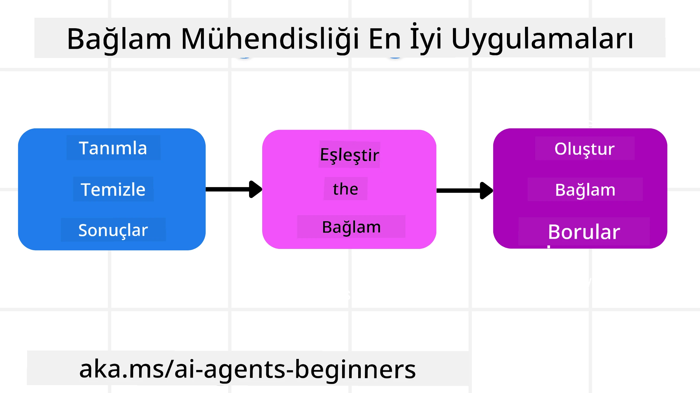

# AI Ajanları için Bağlam Mühendisliği

> _(Bu dersin videosunu izlemek için yukarıdaki resme tıklayın)_

Bir AI ajanı oluşturduğunuz uygulamanın karmaşıklığını anlamak, güvenilir bir tane yapmak için önemlidir. Prompt mühendisliğinin ötesinde karmaşık ihtiyaçları karşılamak için bilgiyi etkili bir şekilde yöneten AI Ajanları inşa etmemiz gerekiyor.

Bu derste, bağlam mühendisliğinin ne olduğunu ve AI ajanları oluşturmadaki rolünü inceleyeceğiz.

## Giriş

Bu ders şunları kapsayacak:

• **Bağlam Mühendisliği nedir** ve neden prompt mühendisliğinden farklıdır.

• **Etkili Bağlam Mühendisliği stratejileri**, bilginin nasıl yazılacağı, seçileceği, sıkıştırılacağı ve izole edileceği dahil.

• AI ajanın başarısız olmasına yol açabilecek **yaygın bağlam hataları** ve bunların nasıl düzeltileceği.

## Öğrenme Hedefleri

Bu dersi tamamladıktan sonra şunları anlayacaksınız:

• **Bağlam mühendisliğini tanımlamak** ve prompt mühendisliğinden ayırt etmek.

• Büyük Dil Modeli (LLM) uygulamalarında **bağlamın ana bileşenlerini tanımlamak**.

• Ajan performansını artırmak için **bağlamı yazma, seçme, sıkıştırma ve izole etme stratejilerini uygulamak**.

• Zehirleme, dikkat dağınıklığı, kafa karışıklığı ve çatışma gibi **yaygın bağlam hatalarını tanımak** ve hafifletme tekniklerini uygulamak.

## Bağlam Mühendisliği Nedir?

AI Ajanları için bağlam, bir AI Ajanının belirli eylemleri gerçekleştirmesi için planlamayı yönlendiren şeydir. Bağlam Mühendisliği, AI Ajanının görevin bir sonraki adımını tamamlamak için doğru bilgiye sahip olmasını sağlama uygulamasıdır. Bağlam penceresi boyut sınırlıdır, bu yüzden ajan geliştiricileri olarak bağlam penceresine bilgi ekleme, çıkarma ve yoğunlaştırma işlemlerini yönetmek için sistemler ve süreçler oluşturmalıyız.

### Prompt Mühendisliği vs Bağlam Mühendisliği

Prompt mühendisliği, AI Ajanlarını kurallarla etkili bir şekilde yönlendirmek için tek bir statik talimat setine odaklanır. Bağlam mühendisliği ise, AI Ajanının zaman içinde ihtiyacı olan şeylere sahip olması için başlangıç promptu dahil dinamik bir bilgi setini nasıl yöneteceğinizle ilgilidir. Bağlam mühendisliği temel fikri, bu süreci tekrarlanabilir ve güvenilir kılmaktır.

### Bağlam Türleri

Bağlamın sadece tek bir şey olmadığını hatırlamak önemlidir. AI Ajanının ihtiyacı olan bilgi çeşitli farklı kaynaklardan gelebilir ve bu kaynaklara erişiminin sağlanması bizim sorumluluğumuzdadır:

AI ajanının yönetmesi gereken bağlam türleri şunları içerebilir:

• **Talimatlar:** Bunlar ajanın "kuralları" gibidir – promptlar, sistem mesajları, örnek gösterimleri (AI'ye nasıl yapılacağını gösterme) ve kullanabileceği araçların açıklamaları. Burası prompt mühendisliği odağının bağlam mühendisliğiyle birleştiği yerdir.

• **Bilgi:** Veritabanlarından alınan gerçekler, bilgiler veya ajan tarafından toplanan uzun vadeli anılar. Bu, bir Retrieval Augmented Generation (RAG) sistemi entegre etmeyi içerir, eğer ajan farklı bilgi depolarına ve veritabanlarına erişim gerektiriyorsa.

• **Araçlar:** Ajanın çağırabileceği harici fonksiyonların, API’lerin ve MCP Sunucularının tanımları ile bunların kullanımından aldığı geri bildirimler (sonuçlar).

• **Konuşma Geçmişi:** Kullanıcıyla devam eden diyalog. Zamanla, bu konuşmalar daha uzun ve karmaşık hale gelir, bu da bağlam penceresinde alan kaplamalarına neden olur.

• **Kullanıcı Tercihleri:** Bir kullanıcının beğenileri veya sevmedikleri hakkında zamanla öğrenilen bilgiler. Bu, önemli kararlar alınırken kullanıcıya yardımcı olmak için saklanabilir ve çağrılabilir.

## Etkili Bağlam Mühendisliği Stratejileri

### Planlama Stratejileri

İyi bağlam mühendisliği iyi planlama ile başlar. Bağlam mühendisliği kavramını nasıl uygulamaya başlayacağınızı düşünmenize yardımcı olacak bir yaklaşım şu şekildedir:

1. **Net Sonuçları Tanımlayın** - AI Ajanlarına verilecek görevlerin sonuçları açıkça tanımlanmalıdır. Şu soruyu cevaplayın - "AI Ajanı görevi tamamladığında dünya nasıl görünecek?" Başka bir deyişle, AI Ajanıyla etkileşimden sonra kullanıcıda ne gibi değişiklik, bilgi veya yanıt olmalı?

2. **Bağlamı Haritalayın** - AI Ajanının sonuçlarını tanımladıktan sonra, "AI Ajanının bu görevi tamamlamak için ne gibi bilgilere ihtiyacı var?" sorusunu yanıtlamalısınız. Böylece bilginin nerede bulunabileceğini haritalamaya başlayabilirsiniz.

3. **Bağlam Boru Hatları Oluşturun** - Bilginin nerede olduğunu bildiğinize göre, "Ajan bu bilgiyi nasıl alacak?" sorusunu cevaplamanız gerekiyor. Bu, RAG, MCP sunucuları ve diğer araçların kullanılması gibi çeşitli yollarla yapılabilir.

### Pratik Stratejiler

Planlama önemlidir, ancak bilgi ajanımızın bağlam penceresine akmaya başladığında, onu yönetmek için pratik stratejilere ihtiyacımız var:

#### Bağlamı Yönetmek

Bazı bilgiler bağlam penceresine otomatik olarak eklenecek olsa da, bağlam mühendisliği bilgiyi daha aktif bir şekilde yönetmeyi gerektirir, bu birkaç stratejiyle yapılabilir:

1. **Ajan Not Defteri**  
Bu, AI Ajanının tek bir oturum sırasında mevcut görevler ve kullanıcı etkileşimleri hakkında ilgili bilgilerin notlarını almasını sağlar. Bu, bağlam penceresinin dışında bir dosyada veya ajan tarafından gerektiğinde oturum sırasında geri alınabilecek çalışma zamanı nesnesinde olmalıdır.

2. **Anılar**  
Not defterleri tek bir oturumun bağlam penceresi dışındaki bilgiyi yönetmek için iyidir. Anılar, ajanların birden fazla oturum boyunca ilgili bilgileri depolayıp geri almasını sağlar. Bu, özetler, kullanıcı tercihleri ve gelecekteki iyileştirmeler için geri bildirimleri içerebilir.

3. **Bağlamı Sıkıştırmak**  
Bağlam penceresi büyüyüp sınırına yaklaştığında, özetleme ve kırpma gibi teknikler kullanılabilir. Bu, yalnızca en alakalı bilgileri tutmak veya eski mesajları kaldırmak anlamına gelir.

4. **Çoklu Ajan Sistemleri**  
Her ajan kendi bağlam penceresine sahip olduğu için çoklu ajan sistemi geliştirmek bir bağlam mühendisliği şeklidir. Bu bağlamın nasıl paylaşıldığı ve farklı ajanlara nasıl aktarıldığı, bu sistemler kurulurken planlanması gereken başka bir konudur.

5. **Sandbox Ortamları**  
Bir ajan kod çalıştırması veya bir belgede çok büyük miktarda bilgi işlemesi gerektiğinde, bu sonuçların işlenmesi için çok sayıda token gerektirebilir. Bu tümünün bağlam penceresinde depolanması yerine, ajan bu kodları çalıştırabilen ve sadece sonuçları ve diğer ilgili bilgileri okuyabilen bir sandbox ortamı kullanabilir.

6. **Çalışma Zamanı Durum Nesneleri**  
Bu, Ajanın belirli bilgilere erişmesi gerektiğinde bu durumları yönetmek için bilgi konteynerleri oluşturulmasıyla yapılır. Karmaşık bir görev için bu, her alt görevin sonuçlarının adım adım saklanmasını sağlayarak bağlamın yalnızca o belirli alt görevle bağlantılı kalmasına izin verir.

#### Bağlamı İncelemek

Bu stratejilerden birini uyguladıktan sonra, bir sonraki model çağrısının gerçekte ne aldığına bakmak faydalıdır. Yararlı bir hata ayıklama sorusu:

> Ajan çok fazla bağlam mı yükledi, yanlış bağlam mı aldı yoksa ihtiyaç duyduğu bağlamdan mı mahrum kaldı?

Bu soruyu yanıtlamak için ham promptları, araç çıktıları veya bellek içeriklerini kaydetmeniz gerekmez. Üretimde, sayılar, kimlikler, karmalar ve politika etiketlerini yakalayan küçük bağlam inceleme kayıtlarını tercih edin:

- **Seçim:** Kaç aday parça, araç veya anının dikkate alındığını, kaçının seçildiğini ve hangi kural veya puanın diğerlerinin filtrelenmesine neden olduğunu takip edin.  
- **Sıkıştırma:** Kaynak aralığı veya iz kimliği, özet kimliği, sıkıştırma öncesi ve sonrası tahmini token sayısı ve ham içeriğin bir sonraki çağrıdan çıkarılıp çıkarılmadığını kaydedin.  
- **İzolasyon:** Hangi alt görevin ayrı bir ajan, oturum veya sandbox'ta çalıştırıldığını, hangi sınırlı özetin döndürüldüğünü ve büyük araç çıktısının ana ajan bağlamı dışında kalıp kalmadığını not edin.  
- **Bellek ve RAG:** Tam alınan metin yerine geri alım belge kimliklerini, bellek kimliklerini, puanları, seçilen kimlikleri ve sansür durumunu saklayın.  
- **Güvenlik ve gizlilik:** Hassas prompt metni, araç argümanları, araç sonuçları veya kullanıcı bellek içerikleri yerine karmalar, kimlikler, token kovaları ve politika etiketlerini tercih edin.

Amaç daha fazla bağlam tutmak değildir. Amaç, geliştiricinin hangi bağlam stratejisinin uygulandığını ve bunun sonraki model çağrısını amaçlanan şekilde değiştirdiğini söyleyebilmesi için yeterli kanıt bırakmaktır.

### Bağlam Mühendisliği Örneği

Diyelim ki bir AI ajandan **“Paris’e bir gezi ayırtmamı”** istiyoruz.

• Sadece prompt mühendisliği kullanan basit bir ajan şöyle yanıt verebilir: **“Tamam, Paris’e ne zaman gitmek istersiniz?”**. Sadece kullanıcının sorduğu doğrudan soruyu işlediği zaman yanıt verir.

• İçinde ele alınan bağlam mühendisliği stratejilerini kullanan bir ajan ise çok daha fazlasını yapar. Yanıt vermeden önce sistem şunları yapabilir:

  ◦ Takviminizi kontrol et (gerçek zamanlı veri alma).

 ◦ Geçmiş seyahat tercihlerinizi hatırla (uzun vadeli bellekten) örneğin tercih ettiğiniz havayolu, bütçe veya doğrudan uçuş isteyip istemediğiniz gibi.

 ◦ Uçuş ve otel rezervasyonu için mevcut araçları belirle.

- Sonra, örnek bir yanıt şöyle olabilir: "Merhaba [Adınız]! Ekim ayının ilk haftasında müsaitsin. [Tercih Edilen Havayolu] ile bütçene uygun doğrudan Paris uçuşlarına bakayım mı?" Bu daha zengin, bağlam odaklı yanıt bağlam mühendisliğinin gücünü gösterir.

## Yaygın Bağlam Hataları

### Bağlam Zehirlenmesi

**Nedir:** Bir halüsinasyon (LLM tarafından üretilen yanlış bilgi) veya hata bağlama girip tekrar tekrar referans alındığında, ajanın imkansız hedefler peşinde koşmasına veya anlamsız stratejiler geliştirmesine neden olur.

**Ne yapılmalı:** **Bağlam doğrulama** ve **karantinaya alma** uygulanmalı. Bilginin uzun vadeli belleğe eklenmeden önce doğrulanması gerekir. Potansiyel zehirlenme algılanırsa, kötü bilginin yayılmasını önlemek için yeni bağlam dizileri başlatılmalıdır.

**Seyahat Rezervasyonu Örneği:** Ajanınız, uluslararası uçuşlar sunmayan küçük bir yerel havalimanından uzak bir uluslararası şehre **doğrudan uçuş** hayal eder. Bu var olmayan uçuş bilgisi bağlamda kaydedilir. Daha sonra rezervasyon yapılması istendiğinde, ajan bu imkansız rota için sürekli bilet arar ve tekrarlayan hatalar gözlemlenir.

**Çözüm:** Uçuş detayını ajanın çalışma bağlamına eklemeden _önce_ uçuşun varlığını ve güzergahları gerçek zamanlı bir API ile doğrulayan bir adım uygulayın. Doğrulama başarısız olursa, yanlış bilgi "karantinaya" alınır ve daha fazla kullanılmaz.

### Bağlam Dikkat Dağınıklığı

**Nedir:** Bağlam çok büyüdüğünde model, eğitim sırasında öğrendiklerinden çok birikmiş geçmişe fazla odaklanır ve tekrarlayan veya faydasız eylemler yapar. Modeller bağlam penceresi dolmadan bile hata yapmaya başlayabilir.

**Ne yapılmalı:** **Bağlam özetleme** kullanın. Biriken bilgileri periyodik olarak daha kısa özetlere sıkıştırarak önemli detayları tutup gereksiz geçmişi çıkarın. Bu odaklanmayı "sıfırlamaya" yardımcı olur.

**Seyahat Rezervasyonu Örneği:** Uzun zamandır hayalinizdeki seyahat destinasyonlarını konuşuyorsunuz ve iki yıl önceki sırt çantalı seyahatinizin detaylı anlatımı da dahil. Sonunda **“gelecek ay için ucuz bir uçuş bul”** dediğinizde, ajan eski, alakasız detaylarda boğuluyor ve sırt çantalı ekipmanınız veya geçmiş yolculuklarınız hakkında sormaya devam ediyor, mevcut isteğinizi ihmal ediyor.

**Çözüm:** Belirli sayıda turdan sonra veya bağlam çok büyüdüğünde, ajan **en son ve en alakalı konuşma kısımlarını özetlemeli** – seyahat tarihleriniz ve hedefiniz üzerine odaklanarak – ve bu yoğun özet ile sonraki LLM çağrısını yapmalı, daha az ilgili tarihsel sohbeti atmalıdır.

### Bağlam Kafa Karışıklığı

**Nedir:** Gereksiz bağlam, genellikle çok fazla mevcut araç olması, modelin kötü yanıtlar üretmesine veya alakasız araçları çağırmasına neden olur. Küçük modeller özellikle buna meyillidir.

**Ne yapılmalı:** RAG teknikleri kullanarak **araç yük yönetimi** uygulayın. Araç tanımlarını bir vektör veritabanında saklayın ve her görev için _yalnızca_ en ilgili araçları seçin. Araştırmalar, araç seçiminin 30’un altında tutulmasının faydalı olduğunu gösteriyor.

**Seyahat Rezervasyonu Örneği:** Ajanınızda onlarca araç var: `book_flight`, `book_hotel`, `rent_car`, `find_tours`, `currency_converter`, `weather_forecast`, `restaurant_reservations` vb. Siz, **“Paris’te dolaşmanın en iyi yolu nedir?”** diye soruyorsunuz. Çok sayıda araç nedeniyle, ajan karışıyor ve Paris içinde `book_flight` çağırmaya ya da toplu taşıma tercih ettiğiniz halde `rent_car` çağırmaya çalışıyor çünkü araç açıklamaları örtüşüyor veya en iyisini seçemiyor.

**Çözüm:** Araç açıklamaları üzerinde **RAG kullanın**. Paris’te dolaşma sorusunda sistem, sorgunuza göre sadece `rent_car` veya `public_transport_info` gibi en ilgili araçları dinamik olarak getirsin ve modeli o araçların odaklı "yüklemesi" ile besleyin.

### Bağlam Çatışması

**Nedir:** Bağlam içinde çelişkili bilgiler olduğunda, tutarsız düşünceye veya kötü nihai yanıtlar oluşmasına yol açar. Genellikle bilgiler aşamalı olarak geldiğinde ve erken, yanlış varsayımlar bağlamda kaldığında olur.

**Ne yapılmalı:** **Bağlam budama** ve **taşıma** kullanın. Budama, yeni bilgiler geldikçe eski veya çelişkili bilgilerin kaldırılmasıdır. Taşıma, modele ana bağlamı karıştırmadan bilgiyi işlemek için ayrı bir "not defteri" çalışma alanı verir.
**Seyahat Rezervasyonu Örneği:** Başlangıçta temsilcinize, **"Ekonomi sınıfında uçmak istiyorum."** diye söylersiniz. Konuşmanın ilerleyen bölümünde fikrinizi değiştirip, **"Aslında, bu seyahat için business sınıfı tercih edelim."** dersiniz. Eğer her iki talep de bağlamda kalırsa, temsilci çatışan arama sonuçları alabilir veya hangi tercihe öncelik verileceği konusunda kafası karışabilir.

**Çözüm:** **bağlam budaması** uygulayın. Yeni bir talep eski bir talebe karşı geliyorsa, eski talep bağlamdan kaldırılır veya açıkça geçersiz kılınır. Alternatif olarak, temsilci karar vermeden önce çatışan tercihleri uzlaştırmak için bir **not defteri** kullanabilir; böylece yalnızca son ve tutarlı talep eylemlerini yönlendirir.

## Bağlam Mühendisliği Hakkında Daha Fazla Sorunuz Mu Var?

Diğer öğrenenlerle tanışmak, ofis saatlerine katılmak ve AI Temsilcileri sorularınızı yanıtlamak için [Microsoft Foundry Discord](https://aka.ms/ai-agents/discord)'a katılın.

---

<!-- CO-OP TRANSLATOR DISCLAIMER START -->
**Feragatname**:
Bu belge, AI çeviri hizmeti [Co-op Translator](https://github.com/Azure/co-op-translator) kullanılarak çevrilmiştir. Doğruluk için çaba sarf etsek de, otomatik çevirilerin hata veya yanlışlık içerebileceğini lütfen unutmayınız. Orijinal belge, kendi dilinde yetkili kaynak olarak kabul edilmelidir. Kritik bilgiler için profesyonel insan çevirisi önerilir. Bu çevirinin kullanımı sonucu ortaya çıkabilecek yanlış anlamalardan veya yanlış yorumlamalardan sorumlu değiliz.
<!-- CO-OP TRANSLATOR DISCLAIMER END -->