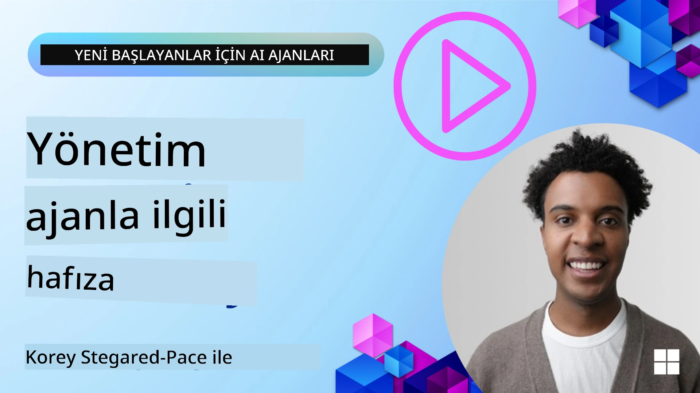

# AI Ajanları için Bellek 

AI Ajanları oluşturmanın benzersiz faydaları tartışılırken, iki konu ağırlıklı olarak ele alınır: görevleri tamamlamak için araç çağırabilme yeteneği ve zaman içinde gelişebilme yeteneği. Bellek, kullanıcılarımız için daha iyi deneyimler yaratabilen kendi kendine gelişen ajanlar oluşturmanın temelidir.

Bu derste, AI Ajanları için belleğin ne olduğunu ve bunu uygulamalarımızın yararına nasıl yönetip kullanabileceğimizi inceleyeceğiz.

## Giriş

Bu ders şunları kapsayacaktır:

• **AI Ajan Belleğini Anlamak**: Belleğin ne olduğu ve ajanlar için neden önemli olduğu.

• **Belleği Uygulama ve Depolama**: Kısa vadeli ve uzun vadeli belleğe odaklanarak AI ajanlarınıza bellek yetenekleri eklemek için pratik yöntemler.

• **AI Ajanlarını Kendi Kendine Geliştirir Hale Getirmek**: Belleğin ajanların geçmiş etkileşimlerden öğrenmesini ve zaman içinde gelişmesini nasıl sağladığı.

## Mevcut Uygulamalar

Bu ders iki kapsamlı not defteri eğitimini içerir:

• **[13-agent-memory.ipynb](./13-agent-memory.ipynb)**: Mem0 ve Azure AI Search kullanarak Microsoft Agent Framework ile belleği uygular

• **[13-agent-memory-cognee.ipynb](./13-agent-memory-cognee.ipynb)**: Cognee kullanarak yapılandırılmış belleği uygular; gömülü temelli bir bilgi grafiği otomatik olarak oluşturur, grafiği görselleştirir ve akıllı getirme sağlar

## Öğrenme Hedefleri

Bu dersi tamamladıktan sonra şunları bileceksiniz:

• **Çalışma, kısa vadeli ve uzun vadeli bellek dahil olmak üzere çeşitli AI ajan belleği türlerini ayırt etmek**, ayrıca persona ve episodik bellek gibi uzmanlaşmış biçimleri anlamak.

• **Microsoft Agent Framework kullanarak AI ajanları için kısa vadeli ve uzun vadeli belleği uygulamak ve yönetmek**, Mem0, Cognee, Whiteboard belleği gibi araçlardan yararlanmak ve Azure AI Search ile entegre etmek.

• **Kendi kendine gelişen AI ajanlarının arkasındaki ilkeleri anlamak** ve sağlam bellek yönetimi sistemlerinin sürekli öğrenme ve uyum sağlamaya nasıl katkıda bulunduğunu kavramak.

## AI Ajan Belleğini Anlamak

Özünde, **AI ajanları için bellek, onların bilgiyi saklamasını ve geri çağırmasını sağlayan mekanizmaları ifade eder**. Bu bilgi, bir konuşmayla ilgili belirli ayrıntılar, kullanıcı tercihleri, geçmiş eylemler veya öğrenilmiş kalıplar olabilir.

Bellek olmadan, AI uygulamaları genellikle durum bilgisinden yoksun olur; yani her etkileşim sıfırdan başlar. Bu, ajanın önceki bağlamı veya tercihleri "unuttuğu" tekrar eden ve sinir bozucu bir kullanıcı deneyimine yol açar.

### Bellek Neden Önemlidir?

bir ajanın zekâsı, geçmiş bilgileri hatırlama ve kullanma yeteneğiyle derinden bağlantılıdır. Bellek, ajanların şunları yapmasını sağlar:

• **Düşünceli**: Geçmiş eylemlerden ve sonuçlardan öğrenme.

• **Etkileşimli**: Süregelen bir konuşma boyunca bağlamı koruma.

• **Proaktif ve Tepkisel**: Tarihsel verilere dayanarak ihtiyaçları öngörme veya uygun şekilde yanıt verme.

• **Otonom**: Depolanan bilgiye dayanarak daha bağımsız çalışabilme.

Bellek uygulamanın amacı, ajanları daha **güvenilir ve yetenekli** hale getirmektir.

### Bellek Türleri

#### Çalışma Belleği

Bunu, bir ajanın tek bir, devam eden görev veya düşünce süreci sırasında kullandığı bir not kağıdı parçası gibi düşünün. Bir sonraki adımı hesaplamak için gereken anlık bilgiyi tutar.

AI ajanları için çalışma belleği genellikle bir konuşmadan en alakalı bilgileri yakalar; sohbet geçmişi uzun veya kısaltılmış olsa bile. Gereksinimler, öneriler, kararlar ve eylemler gibi anahtar unsurların çıkarılmasına odaklanır.

**Çalışma Belleği Örneği**

Bir seyahat rezervasyon ajanında, çalışma belleği kullanıcının şu anki isteğini yakalayabilir: "Paris'e bir gezi rezervasyonu yapmak istiyorum." Bu spesifik gereksinim, mevcut etkileşimi yönlendirmek için ajanın anlık bağlamında tutulur.

#### Kısa Vadeli Bellek

Bu bellek türü, bilgiyi tek bir konuşma veya oturum süresince saklar. Mevcut sohbetin bağlamıdır ve ajanın diyalogdaki önceki turlara tekrar atıfta bulunmasına izin verir.

**Kısa Vadeli Bellek Örneği**

Eğer bir kullanıcı "Paris'e bir uçuş ne kadar tutar?" diye sorar ve ardından "Peki oradaki konaklama ne durumda?" diye devam ederse, kısa vadeli bellek, ajanın aynı konuşma içinde "orası"nın "Paris"e atıfta bulunduğunu bilmesini sağlar.

#### Uzun Vadeli Bellek

Bu, birden çok konuşma veya oturum boyunca devam eden bilgidir. Ajanların kullanıcı tercihlerini, geçmiş etkileşimleri veya genel bilgileri uzun süre boyunca hatırlamasını sağlar. Kişiselleştirme için önemlidir.

**Uzun Vadeli Bellek Örneği**

Uzun vadeli bir bellek, "Ben kayak ve açık hava aktivitelerinden hoşlanır, dağ manzaralı kahveyi sever ve geçmişteki bir sakatlık nedeniyle ileri düzey kayak parkurlarından kaçınmak ister" gibi bilgileri saklayabilir. Önceki etkileşimlerden öğrenilen bu bilgi, gelecekteki seyahat planlama oturumlarında önerileri etkileyecek ve bunları son derece kişiselleştirilmiş hale getirecektir.

#### Persona Belleği

Bu uzmanlaşmış bellek türü, bir ajanın tutarlı bir "kişilik" veya "persona" geliştirmesine yardımcı olur. Ajanın kendisi veya amaçlanan rolü hakkında ayrıntıları hatırlamasına izin verir; bu da etkileşimleri daha akıcı ve odaklı kılar.

**Persona Belleği Örneği**
Eğer seyahat ajanı "uzman kayak planlayıcısı" olarak tasarlandıysa, persona belleği bu rolü pekiştirebilir ve yanıtlarını bir uzman tonuna ve bilgisine göre şekillendirebilir.

#### İş Akışı/Episodik Bellek

Bu bellek, bir ajanın karmaşık bir görev sırasında aldığı adımların sırasını, başarıları ve hataları depolar. Belirli "bölümleri" veya geçmiş deneyimleri hatırlamak ve bunlardan öğrenmek gibidir.

**Episodik Bellek Örneği**

Eğer ajan belirli bir uçuşu rezerve etmeyi denedi ancak uygunluk nedeniyle başarısız olduysa, episodik bellek bu hatayı kaydedebilir; böylece ajan sonraki bir denemede alternatif uçuşları denemek veya kullanıcıyı konu hakkında daha bilgili bir şekilde bilgilendirmek için bu kaydı kullanabilir.

#### Varlık Belleği

Bu, konuşmalardan belirli varlıkları (kişiler, yerler veya nesneler gibi) ve olayları çıkarmayı ve hatırlamayı içerir. Ajanın tartışılan ana unsurların yapılandırılmış bir anlayışını oluşturmasına olanak tanır.

**Varlık Belleği Örneği**

Geçmiş bir gezi hakkında yapılan bir konuşmadan ajan "Paris", "Eyfel Kulesi" ve "Le Chat Noir restoranında akşam yemeği" gibi varlıkları çıkarabilir. Gelecekteki bir etkileşimde ajan "Le Chat Noir"ı hatırlayabilir ve orada yeni bir rezervasyon yapmayı teklif edebilir.

#### Yapılandırılmış RAG (Retrieval Augmented Generation)

RAG daha geniş bir teknik olsa da, "Yapılandırılmış RAG" güçlü bir bellek teknolojisi olarak vurgulanır. Konuşmalar, e-postalar, görüntüler gibi çeşitli kaynaklardan yoğun, yapılandırılmış bilgiyi çıkarır ve bunları yanıtların doğruluğunu, geri çağırmayı ve hızını artırmak için kullanır. Klasik RAG'in yalnızca semantik benzerliğe dayanmasının aksine, Yapılandırılmış RAG bilgilerin doğal yapısı ile çalışır.

**Yapılandırılmış RAG Örneği**

Sadece anahtar kelimeleri eşleştirmek yerine, Yapılandırılmış RAG bir e-postadan uçuş detaylarını (varış yeri, tarih, saat, havayolu) ayrıştırabilir ve bunları yapılandırılmış bir şekilde saklayabilir. Bu, "Salı günü Paris'e hangi uçuşu rezerve ettim?" gibi kesin sorgulara olanak tanır.

## Belleği Uygulama ve Depolama

AI ajanları için bellek uygulamak, bilgiyi oluşturma, depolama, getirme, bütünleştirme, güncelleme ve hatta "unutma" (veya silme) süreçlerini içeren sistematik bir bellek yönetimi sürecini gerektirir. Getirme (retrieval) özellikle kritik bir unsurdur.

### Uzmanlaşmış Bellek Araçları

#### Mem0

Ajan belleğini depolamak ve yönetmenin bir yolu, Mem0 gibi uzmanlaşmış araçlar kullanmaktır. Mem0, ajanların ilgili etkileşimleri hatırlamasına, kullanıcı tercihlerini ve gerçek bağlamı saklamasına ve zaman içinde başarılar ve hatalardan öğrenmesine olanak tanıyan kalıcı bir bellek katmanı olarak çalışır. Buradaki fikir, durum bilgisinden yoksun ajanların durum bilgisine sahip hale gelmesidir.

Bu, **iki aşamalı bir bellek hattı: çıkarım ve güncelleme** yoluyla çalışır. Önce, bir ajanın dizisine eklenen mesajlar Mem0 hizmetine gönderilir; Mem0, konuşma geçmişini özetlemek ve yeni anıları çıkarmak için bir Büyük Dil Modeli (LLM) kullanır. Ardından, LLM destekli bir güncelleme aşaması, bu anıların eklenip eklenmeyeceğini, değiştirilip değiştirilmeyeceğini veya silinip silinmeyeceğini belirler ve bunları vektör, grafik ve anahtar-değer veritabanlarını içerebilen hibrit bir veri deposunda saklar. Bu sistem ayrıca çeşitli bellek türlerini destekler ve varlıklar arasındaki ilişkileri yönetmek için grafik belleğini de içerebilir.

#### Cognee

Başka güçlü bir yaklaşım, yapılandırılmış ve yapılandırılmamış verileri gömülülerle desteklenen sorgulanabilir bilgi grafiğine dönüştüren açık kaynaklı bir semantik bellek olan **Cognee** kullanmaktır. Cognee, vektör benzerlik araması ile grafik ilişkilerini birleştiren **çift depolama mimarisi** sunar; bu, ajanların sadece hangi bilginin benzediğini değil, kavramların birbirleriyle nasıl ilişkili olduğunu da anlamasını sağlar.

Ham parça aramasından grafik farkındalıklı soru-cevaplamaya kadar vektör benzerliği, grafik yapısı ve LLM muhakemesini harmanlayan **hibrit getirme** konusunda mükemmeldir. Sistem, kısa vadeli oturum bağlamını ve uzun vadeli kalıcı belleği destekleyen, gelişen ve büyüyen ancak tek bir bağlı grafik olarak sorgulanabilir kalan **canlı bellek**i korur.

Cognee not defteri eğitimi ([13-agent-memory-cognee.ipynb](./13-agent-memory-cognee.ipynb)) bu birleşik bellek katmanını oluşturmayı gösterir; çeşitli veri kaynaklarını alma, bilgi grafiğini görselleştirme ve belirli ajan ihtiyaçlarına göre farklı arama stratejileriyle sorgulama konusunda pratik örnekler içerir.

### RAG ile Bellek Depolama

mem0 gibi özel bellek araçlarının ötesinde, özellikle yapılandırılmış RAG için anıları depolamak ve geri almak üzere **Azure AI Search gibi sağlam arama hizmetlerini bir arka uç olarak kullanabilirsiniz**.

Bu, ajanınızın yanıtlarını kendi verilerinizle dayandırmanıza olanak tanır ve daha alakalı ve doğru cevaplar sağlar. Azure AI Search, kullanıcıya özel seyahat anılarını, ürün kataloglarını veya herhangi bir alanla ilgili bilgiyi depolamak için kullanılabilir.

Azure AI Search, konuşma geçmişleri, e-postalar veya hatta görüntüler gibi büyük veri kümelerinden yoğun, yapılandırılmış bilgiyi çıkarmada ve geri çağırmada başarılı olan **Yapılandırılmış RAG** gibi yetenekleri destekler. Bu, geleneksel metin parçası ve gömme yaklaşımlarına kıyasla "insanüstü doğruluk ve geri çağırma" sağlar.

## AI Ajanlarını Kendi Kendine Geliştirir Hale Getirmek

Kendi kendine gelişen ajanlar için yaygın bir desen, bir **"bilgi ajanı"** tanımlamayı içerir. Bu ayrı ajan, kullanıcı ile birincil ajan arasındaki ana konuşmayı gözlemler. Rolü şunlardır:

1. **Değerli bilgiyi belirlemek**: Konuşmanın herhangi bir bölümünün genel bilgi veya belirli bir kullanıcı tercihi olarak kaydedilmeye değer olup olmadığını tespit etmek.

2. **Çıkarmak ve özetlemek**: Konuşmadan temel öğrenimi veya tercihi özümsemek.

3. **Bir bilgi tabanında depolamak**: Bu çıkarılan bilgiyi genellikle bir vektör veritabanında saklamak, böylece daha sonra geri çağrılabilmesini sağlamak.

4. **Gelecekteki sorguları zenginleştirmek**: Kullanıcı yeni bir sorgu başlattığında, bilgi ajanı ilgili saklanan bilgileri geri çağırır ve birincil ajana önemli bağlam sağlamak için kullanıcının istemine ekler (RAG'e benzer şekilde).

### Bellek için Optimizasyonlar

• **Gecikme Yönetimi**: Kullanıcı etkileşimlerini yavaşlatmamak için, bilgi değerini hızlıca kontrol etmek üzere daha ucuz, daha hızlı bir model ilk etapta kullanılabilir; yalnızca gerektiğinde daha karmaşık çıkarım/getirme süreci devreye sokulur.

• **Bilgi Tabanı Bakımı**: Büyüyen bir bilgi tabanı için daha az kullanılan bilgiler maliyeti yönetmek amacıyla "soğuk depolama"ya taşınabilir.

## Ajan Belleği Hakkında Daha Fazla Sorunuz mu Var?

[Microsoft Foundry Discord](https://aka.ms/ai-agents/discord) topluluğuna katılın; diğer öğrenenlerle tanışın, ofis saatlerine katılın ve AI Ajanları ile ilgili sorularınızı yanıtlayın.

---

<!-- CO-OP TRANSLATOR DISCLAIMER START -->
Feragatname:
Bu belge, AI çeviri hizmeti [Co-op Translator](https://github.com/Azure/co-op-translator) kullanılarak çevrilmiştir. Doğruluk için çaba göstermemize rağmen, otomatik çevirilerin hata veya eksiklikler içerebileceğini lütfen unutmayın. Orijinal belge, kendi dilindeki hâliyle yetkili kaynak olarak kabul edilmelidir. Kritik bilgiler için profesyonel insan çevirisi önerilir. Bu çevirinin kullanımı sonucu ortaya çıkabilecek herhangi bir yanlış anlaşılma veya yanlış yorumlamadan sorumlu değiliz.
<!-- CO-OP TRANSLATOR DISCLAIMER END -->