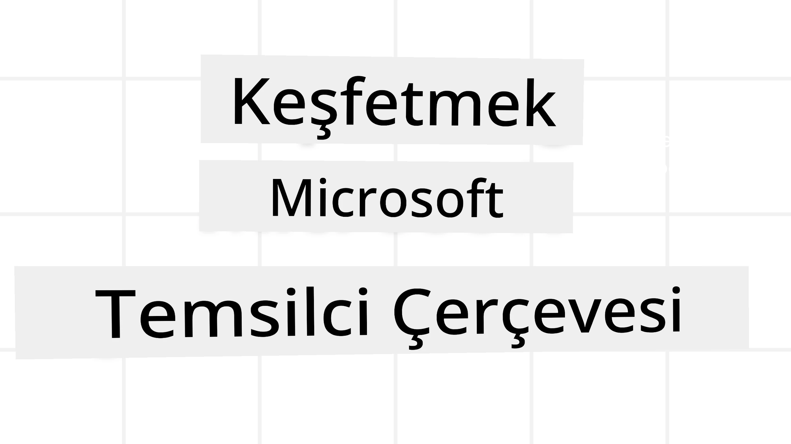
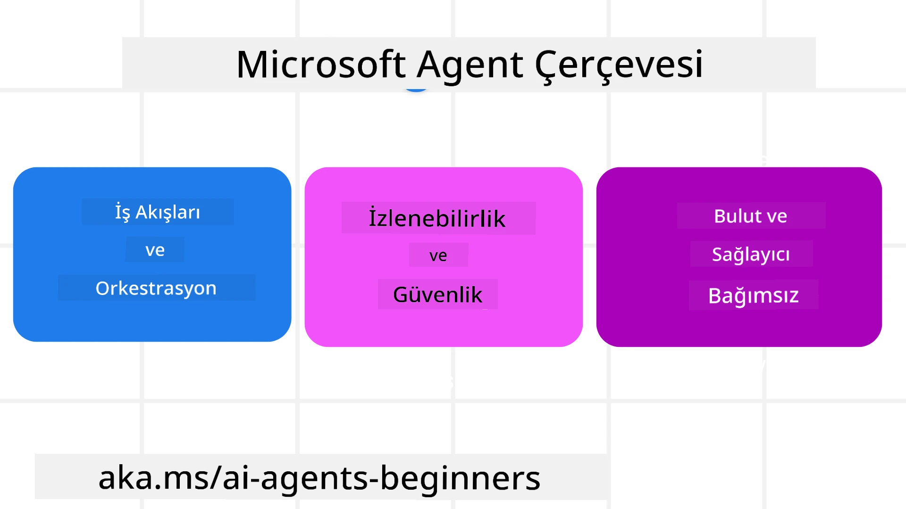
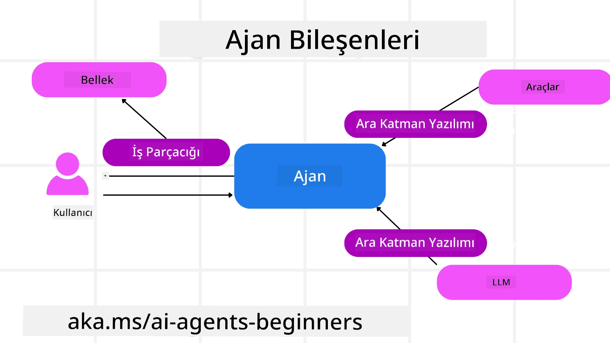

# Microsoft Agent Framework'ü Keşfetmek



### Giriş

Bu derste şunlar ele alınacaktır:

- Microsoft Agent Framework'ü Anlamak: Temel Özellikler ve Değer  
- Microsoft Agent Framework'ün Temel Kavramlarını Keşfetmek
- İleri Düzey MAF Desenleri: İş Akışları, Ara Katman ve Bellek

## Öğrenme Hedefleri

Bu dersi tamamladıktan sonra şu konuları bileceksiniz:

- Microsoft Agent Framework kullanarak Üretim Hazır AI Ajanları oluşturmak
- Microsoft Agent Framework'ün temel özelliklerini Agentik Kullanım Senaryolarınıza uygulamak
- İş akışları, ara katman ve gözlemlenebilirlik gibi ileri düzey desenleri kullanmak

## Kod Örnekleri

[Microsoft Agent Framework (MAF)](https://aka.ms/ai-agents-beginners/agent-framewrok) için kod örneklerine bu depoda `xx-python-agent-framework` ve `xx-dotnet-agent-framework` dosyalarında ulaşılabilir.

## Microsoft Agent Framework'ü Anlamak



[Microsoft Agent Framework (MAF)](https://aka.ms/ai-agents-beginners/agent-framewrok), Microsoft'un AI ajanları oluşturmak için birleşik çerçevesidir. Üretim ve araştırma ortamlarında görülen çeşitli ajan kullanım senaryolarını ele almak için esneklik sunar:

- Adım adım iş akışlarının gerektiği senaryolarda **Ardışık Ajan orkestrasyonu**.
- Ajanların aynı anda görevleri tamamlaması gereken senaryolarda **Eşzamanlı orkestrasyon**.
- Ajanların aynı görevi birlikte yapabildiği senaryolarda **Grup sohbet orkestrasyonu**.
- Alt görevler tamamlandıkça ajanların görevleri birbirlerine devrettiği senaryolarda **Devir Orkestrasyonu**.
- Görev listesini oluşturup değiştiren ve alt ajanları koordinasyonla görevi tamamlatan yönetici ajanın olduğu senaryolarda **Manyetik Orkestrasyon**.

Üretimde AI Ajanları sunmak için MAF şu özellikleri de içerir:

- Her AI ajan eylemini, araç çağrısını, orkestrasyon adımlarını, akıl yürütme akışlarını ve Microsoft Foundry panoları üzerinden performans izlemeyi kapsayan **Gözlemlenebilirlik** için OpenTelemetry kullanımı.
- Rol tabanlı erişim, özel veri işleme ve yerleşik içerik güvenliği gibi güvenlik kontrollerini içeren Microsoft Foundry üzerinde ajanları nativ olarak barındırarak sağlanan **Güvenlik**.
- Ajan iş parçacıkları ve iş akışlarının duraklatılabilmesi, devam ettirilebilmesi ve hatalardan geri dönebilmeleri sayesinde uzun süreli işlemlere izin veren **Dayanıklılık**.
- İnsan onayı gerektiren görevlerin belirtilebildiği **Kontrol** için insan döngülü iş akışlarının desteklenmesi.

Microsoft Agent Framework aynı zamanda birlikte çalışabilirlik üzerine de odaklanır:

- **Bulut bağımsızlığı** - Ajanlar konteynerlerde, kurum içi veya farklı bulutlarda çalışabilir.
- **Sağlayıcı bağımsızlığı** - Ajanlar tercih ettiğiniz SDK ile, örneğin Azure OpenAI veya OpenAI ile oluşturulabilir.
- **Açık Standartların Entegrasyonu** - Agent-to-Agent (A2A) ve Model Context Protocol (MCP) gibi protokollerle diğer ajanların ve araçların keşfi ve kullanımı mümkün.
- **Eklentiler ve Bağlayıcılar** - Microsoft Fabric, SharePoint, Pinecone ve Qdrant gibi veri ve bellek servislerine bağlantılar kurulabilir.

Bu özelliklerin Microsoft Agent Framework'ün temel kavramlarına nasıl uygulandığına bakalım.

## Microsoft Agent Framework'ün Temel Kavramları

### Ajanlar



**Ajan Oluşturma**

Ajan oluşturma, çıkarım servisini (LLM Sağlayıcısı), AI Ajanının izleyeceği talimatlar setini ve atanmış bir `isim`i tanımlayarak yapılır:

```python
agent = AzureOpenAIChatClient(credential=AzureCliCredential()).create_agent( instructions="You are good at recommending trips to customers based on their preferences.", name="TripRecommender" )
```

Yukarıda `Azure OpenAI` kullanılmıştır ancak ajanlar `Microsoft Foundry Agent Service` gibi çeşitli hizmetlerle de oluşturulabilir:

```python
AzureAIAgentClient(async_credential=credential).create_agent( name="HelperAgent", instructions="You are a helpful assistant." ) as agent
```

OpenAI `Responses`, `ChatCompletion` API'leri

```python
agent = OpenAIResponsesClient().create_agent( name="WeatherBot", instructions="You are a helpful weather assistant.", )
```

```python
agent = OpenAIChatClient().create_agent( name="HelpfulAssistant", instructions="You are a helpful assistant.", )
```

ya da A2A protokolü kullanılarak uzak ajanlar:

```python
agent = A2AAgent( name=agent_card.name, description=agent_card.description, agent_card=agent_card, url="https://your-a2a-agent-host" )
```

**Ajanları Çalıştırma**

Ajanlar, yanıtların akışlı olup olmamasına bağlı olarak `.run` veya `.run_stream` metodları ile çalıştırılır.

```python
result = await agent.run("What are good places to visit in Amsterdam?")
print(result.text)
```

```python
async for update in agent.run_stream("What are the good places to visit in Amsterdam?"):
    if update.text:
        print(update.text, end="", flush=True)

```

Her ajan çalıştırmada, ajan tarafından kullanılan `max_tokens`, ajan tarafından çağrılabilecek `tools` ve hatta ajan için kullanılan `model` gibi parametreleri özelleştirmek için seçenekler olabilir.

Bu, kullanıcı görevini tamamlamak için belirli modellerin veya araçların gerektiği durumlarda faydalıdır.

**Araçlar**

Araçlar, hem ajan tanımlanırken hem de ajan çalıştırılırken belirtilebilir:

```python
def get_attractions( location: Annotated[str, Field(description="The location to get the top tourist attractions for")], ) -> str: """Get the top tourist attractions for a given location.""" return f"The top attractions for {location} are." 


# Bir ChatAgent doğrudan oluşturulurken

agent = ChatAgent( chat_client=OpenAIChatClient(), instructions="You are a helpful assistant", tools=[get_attractions]

```

```python

result1 = await agent.run( "What's the best place to visit in Seattle?", tools=[get_attractions] # Bu çalışma için sağlanan araç )
```

**Ajan İş Parçacıkları**

Ajan İş Parçacıkları, çok turlu konuşmaları yönetmek için kullanılır. İş parçacıkları şu şekillerde oluşturulabilir:

- `get_new_thread()` kullanarak iş parçacığının zaman içerisinde saklanmasını sağlamak
- Bir ajan çalıştırılırken otomatik olarak iş parçacığı oluşturup sadece o çalışma süresi boyunca iş parçacığını tutmak

İş parçacığı oluşturmak için kod şöyle görünür:

```python
# Yeni bir iş parçacığı oluşturun.
thread = agent.get_new_thread() # Temsilciyi iş parçacığı ile çalıştırın.
response = await agent.run("Hello, I am here to help you book travel. Where would you like to go?", thread=thread)

```

İş parçacığını daha sonra kullanılmak üzere seri hale getirip saklayabilirsiniz:

```python
# Yeni bir iş parçacığı oluşturun.
thread = agent.get_new_thread() 

# İş parçacığı ile ajanı çalıştırın.

response = await agent.run("Hello, how are you?", thread=thread) 

# Depolama için iş parçacığını serileştirin.

serialized_thread = await thread.serialize() 

# Depolamadan sonra iş parçacığı durumunu deserialize edin.

resumed_thread = await agent.deserialize_thread(serialized_thread)
```

**Ajan Ara Katmanı**

Ajanlar, kullanıcı görevlerini tamamlamak için araçlar ve LLM'lerle etkileşir. Bazı durumlarda bu etkileşimlerin arasında işlem yapmak veya takip etmek isteriz. Ajan ara katmanı bunu sağlar:

*Fonksiyon Ara Katmanı*

Bu ara katman, ajan ile çağrılan fonksiyon/araç arasında bir eylem yapmamıza imkan tanır. Örneğin fonksiyon çağrısı sırasında günlük kaydı yapmak için kullanılabilir.

Aşağıdaki kodda `next`, sonraki ara katmanın mı yoksa gerçek fonksiyonun mu çağrılacağını belirler.

```python
async def logging_function_middleware(
    context: FunctionInvocationContext,
    next: Callable[[FunctionInvocationContext], Awaitable[None]],
) -> None:
    """Function middleware that logs function execution."""
    # Ön işleme: Fonksiyon çalıştırılmadan önce kayıt
    print(f"[Function] Calling {context.function.name}")

    # Sonraki ara yazılıma veya fonksiyon çalıştırmaya devam et
    await next(context)

    # Son işlem: Fonksiyon çalıştırıldıktan sonra kayıt
    print(f"[Function] {context.function.name} completed")
```

*Chat Ara Katmanı*

Bu ara katman, ajan ile LLM arasındaki istekler arasında işlem yapmak veya günlük tutmak için kullanılır.

Burada AI servisine gönderilen `messages` gibi önemli bilgiler bulunur.

```python
async def logging_chat_middleware(
    context: ChatContext,
    next: Callable[[ChatContext], Awaitable[None]],
) -> None:
    """Chat middleware that logs AI interactions."""
    # Ön işleme: Yapay Zeka çağrısından önce kayıt
    print(f"[Chat] Sending {len(context.messages)} messages to AI")

    # Bir sonraki ara yazılım veya Yapay Zeka hizmetine devam et
    await next(context)

    # Son işlem: Yapay Zeka yanıtından sonra kayıt
    print("[Chat] AI response received")

```

**Ajan Belleği**

`Agentic Memory` dersinde ele alındığı gibi, bellek ajanların farklı bağlamlarda çalışmasını sağlayan önemli bir öğedir. MAF, birkaç farklı bellek türü sunar:

*Bellek İçi Depolama*

Bu, uygulama çalışırken iş parçacıklarında saklanan bellektir.

```python
# Yeni bir iş parçacığı oluştur.
thread = agent.get_new_thread() # İş parçacığı ile ajanı çalıştır.
response = await agent.run("Hello, I am here to help you book travel. Where would you like to go?", thread=thread)
```

*Kalıcı Mesajlar*

Bu bellek, farklı oturumlar arasında konuşma geçmişini saklamak için kullanılır. `chat_message_store_factory` ile tanımlanır:

```python
from agent_framework import ChatMessageStore

# Özel bir mesaj deposu oluşturun
def create_message_store():
    return ChatMessageStore()

agent = ChatAgent(
    chat_client=OpenAIChatClient(),
    instructions="You are a Travel assistant.",
    chat_message_store_factory=create_message_store
)

```

*Dinamik Bellek*

Bu bellek, ajanlar çalıştırılmadan önce bağlama eklenir. Bu bellekler mem0 gibi harici servislerde saklanabilir:

```python
from agent_framework.mem0 import Mem0Provider

# Gelişmiş bellek özellikleri için Mem0 kullanımı
memory_provider = Mem0Provider(
    api_key="your-mem0-api-key",
    user_id="user_123",
    application_id="my_app"
)

agent = ChatAgent(
    chat_client=OpenAIChatClient(),
    instructions="You are a helpful assistant with memory.",
    context_providers=memory_provider
)

```

**Ajan Gözlemlenebilirliği**

Gözlemlenebilirlik, güvenilir ve sürdürülebilir ajanik sistemler inşa etmek için önemlidir. MAF, daha iyi gözlemlenebilirlik için OpenTelemetry ile entegrasyon sağlar.

```python
from agent_framework.observability import get_tracer, get_meter

tracer = get_tracer()
meter = get_meter()
with tracer.start_as_current_span("my_custom_span"):
    # bir şey yap
    pass
counter = meter.create_counter("my_custom_counter")
counter.add(1, {"key": "value"})
```

### İş Akışları

MAF, bir görevi tamamlamak için önceden tanımlanmış adımlardan oluşan ve bu adımlarda AI ajanlarını içeren iş akışları sunar.

İş akışları, daha iyi kontrol akışı sağlayan çeşitli bileşenlerden oluşur. İş akışları ayrıca **çoklu ajan orkestrasyonu** ve iş akışı durumlarının kaydedilmesi için **checkpointing** sağlar.

Bir iş akışının temel bileşenleri şunlardır:

**Yürütücüler**

Yürütücüler, giriş mesajlarını alır, atanan görevleri gerçekleştirir ve çıktı mesajı üretir. Bu da iş akışını büyük görevin tamamlanmasına doğru ilerletir. Yürütücüler AI ajanı veya özel mantık olabilir.

**Kenarlar**

Kenarlar, iş akışındaki mesaj akışını tanımlamak için kullanılır. Bunlar:

*Doğrudan Kenarlar* - Yürütücüler arasında basit bire bir bağlantılar:

```python
from agent_framework import WorkflowBuilder

builder = WorkflowBuilder()
builder.add_edge(source_executor, target_executor)
builder.set_start_executor(source_executor)
workflow = builder.build()
```

*Koşullu Kenarlar* - Belirli bir koşul sağlandığında etkinleşir. Örneğin, otel odası yoksa yürütücü başka seçenekler önerebilir.

*Switch-case Kenarlar* - Tanımlı koşullara bağlı olarak mesajları farklı yürütücülere yönlendirir. Örneğin, seyahat müşterisinin öncelikli erişimi varsa görevleri başka bir iş akışıyla işlenir.

*Fan-out Kenarlar* - Bir mesajı birden çok hedefe gönderir.

*Fan-in Kenarlar* - Birden çok yürütücüden gelen mesajları toplayıp tek hedefe gönderir.

**Olaylar**

İş akışlarına daha iyi gözlemlenebilirlik sağlamak için MAF, yürütme ile ilgili yerleşik olaylar sunar:

- `WorkflowStartedEvent`  - İş akışı yürütmesi başlar
- `WorkflowOutputEvent` - İş akışı çıktı üretir
- `WorkflowErrorEvent` - İş akışı hata ile karşılaşır
- `ExecutorInvokeEvent`  - Yürütücü işlemeye başlar
- `ExecutorCompleteEvent`  -  Yürütücü işlemi tamamlar
- `RequestInfoEvent` - Bir istek yapılır

## İleri Düzey MAF Desenleri

Yukarıdaki bölümler Microsoft Agent Framework'ün temel kavramlarını kapsadı. Daha karmaşık ajanlar oluştururken şu ileri düzey desenleri düşünebilirsiniz:

- **Ara Katman Bileşimi**: Fonksiyon ve sohbet ara katmanlarını kullanarak çoklu ara katman işleyicilerini zincirleyerek (günlük kaydı, kimlik doğrulama, hız sınırlama) ajan davranışı üzerinde ince ayar sağlar.
- **İş Akışı Checkpointing**: İş akışı olayları ve serileştirme kullanarak uzun süren ajan süreçlerini kaydedip devam ettirin.
- **Dinamik Araç Seçimi**: Soru başına yalnızca ilgili araçları sunmak için MAF'ın araç kaydı ile araç açıklamaları üzerindeki RAG'i birleştirin.
- **Çoklu Ajan Devir**: Uzmanlaşmış ajanlar arasında devri orkestre etmek için iş akışı kenarları ve koşullu yönlendirmeyi kullanın.

## Kod Örnekleri

Microsoft Agent Framework için kod örneklerine bu depoda `xx-python-agent-framework` ve `xx-dotnet-agent-framework` dosyalarında ulaşılabilir.

## Microsoft Agent Framework Hakkında Daha Fazla Sorunuz mu Var?

Diğer öğrenenlerle tanışmak, ofis saatlerine katılmak ve AI Ajanlarınızla ilgili sorularınızı yanıtlamak için [Microsoft Foundry Discord](https://aka.ms/ai-agents/discord)'a katılın.

---

<!-- CO-OP TRANSLATOR DISCLAIMER START -->
**Feragatname**:  
Bu belge, AI çeviri hizmeti [Co-op Translator](https://github.com/Azure/co-op-translator) kullanılarak çevrilmiştir. Doğruluk için çaba sarf etsek de, otomatik çevirilerin hatalar veya yanlışlıklar içerebileceğini lütfen unutmayınız. Orijinal belge, kendi ana dilinde yetkili kaynak olarak kabul edilmelidir. Kritik bilgiler için profesyonel insan çevirisi önerilir. Bu çevirinin kullanımı sonucunda oluşabilecek yanlış anlamalar veya yorum hatalarından sorumlu değiliz.
<!-- CO-OP TRANSLATOR DISCLAIMER END -->