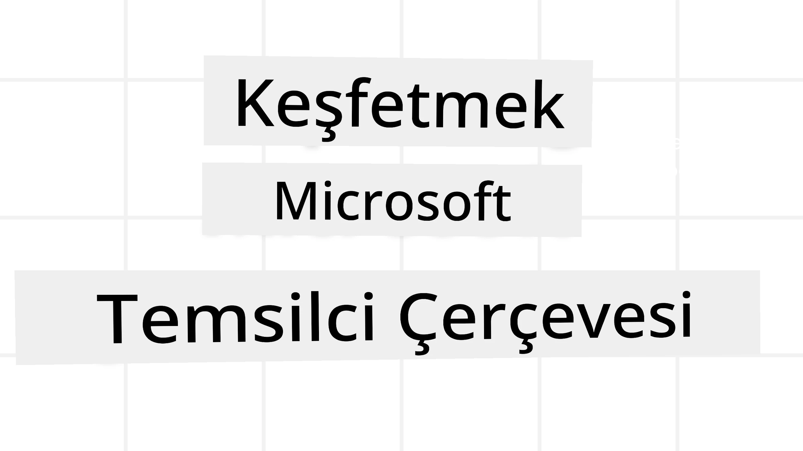
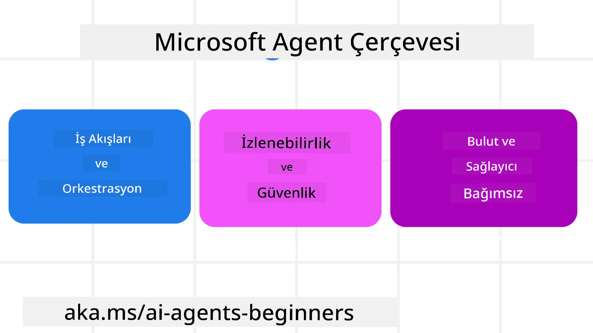
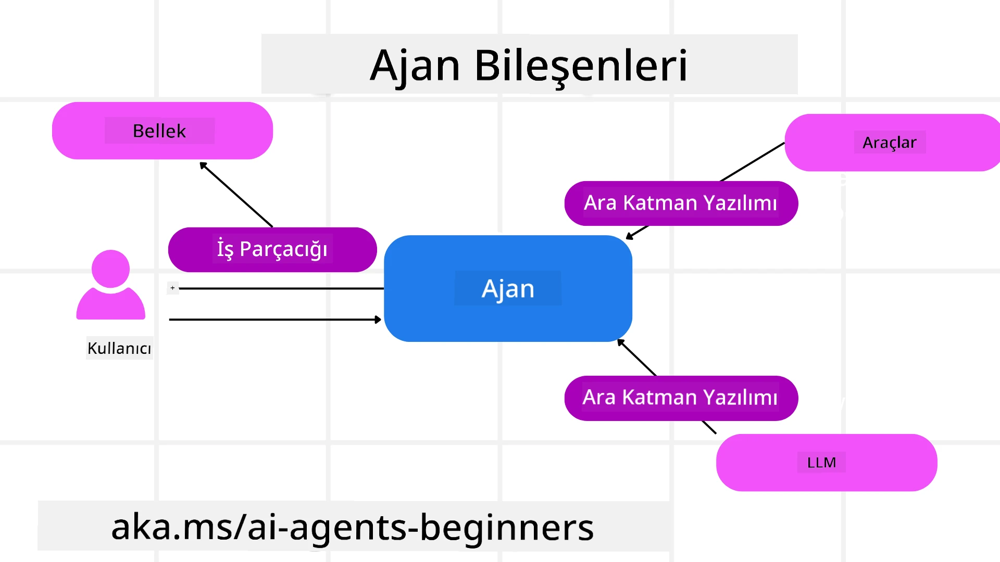

# Microsoft Agent Framework'ü Keşfetmek



### Giriş

Bu ders şunları kapsayacaktır:

- Microsoft Agent Framework'ü Anlama: Temel Özellikler ve Değer  
- Microsoft Agent Framework'ün Temel Kavramlarını Keşfetme
- İleri Seviye MAF Desenleri: Çalışma Akışları, Ara Katman ve Bellek

## Öğrenme Hedefleri

Bu dersi tamamladıktan sonra şunları bileceksiniz:

- Microsoft Agent Framework kullanarak Üretime Hazır AI Ajanları oluşturmak
- Microsoft Agent Framework'ün çekirdek özelliklerini Ajan Kullanım Durumlarınıza uygulamak
- Çalışma akışları, ara katman ve gözlemlenebilirlik dahil ileri desenleri kullanmak

## Kod Örnekleri 

[Microsoft Agent Framework (MAF)](https://learn.microsoft.com/en-us/agent-framework/overview/?wt.mc_id=youtube_26688_organicsocial_reactor&pivots=programming-language-python) için kod örnekleri bu depoda `xx-python-agent-framework` ve `xx-dotnet-agent-framework` dosyalarında bulunabilir.

## Microsoft Agent Framework'ü Anlamak



[Microsoft Agent Framework (MAF)](https://learn.microsoft.com/en-us/agent-framework/overview/?wt.mc_id=youtube_26688_organicsocial_reactor&pivots=programming-language-python), Microsoft'un AI ajanları oluşturmak için birleşik çerçevesidir. Üretim ve araştırma ortamlarında görülen çok çeşitli ajan kullanım durumlarını ele almak için esneklik sunar, bunlar arasında:

- **Sıralı Ajan orkestrasyonu** - adım adım çalışma akışlarının gerektiği senaryolarda.
- **Eşzamanlı orkestrasyon** - ajanların görevleri aynı anda tamamlaması gereken senaryolar.
- **Grup sohbeti orkestrasyonu** - ajanların bir görevi birlikte yürütebildiği senaryolar.
- **Görev devri orkestrasyonu** - alt görevler tamamlandıkça görevlerin ajanlar arasında devredildiği senaryolar.
- **Manyetik orkestrasyon** - bir yönetici ajanın görev listesi oluşturduğu, değiştirdiği ve alt ajanların görevi tamamlaması için koordinasyonu sağladığı senaryolar.

Üretimde AI Ajanları teslim etmek için, MAF ayrıca şunları da içerir:

- **Gözlemlenebilirlik** - AI Ajanının her hareketinin, araç çağrılarının, orkestrasyon adımlarının, mantık akışlarının ve Microsoft Foundry panelleri aracılığıyla performans izleme dahil olmak üzere OpenTelemetry kullanımıyla.
- **Güvenlik** - ajanları Microsoft Foundry üzerinde yerel olarak barındırarak, rol tabanlı erişim, özel veri yönetimi ve yerleşik içerik güvenliği gibi güvenlik kontrolleri sağlar.
- **Dayanıklılık** - Ajan iş parçacıkları ve çalışma akışları duraklatılabilir, devam ettirilebilir ve hatalardan kurtulabilir, böylece uzun süreli süreçlere olanak tanır.
- **Kontrol** - döngüde insan desteği ile çalışma akışları desteklenir, görevler insan onayı gerektiren olarak işaretlenir.

Microsoft Agent Framework ayrıca birlikte çalışabilirliğe odaklanır:

- **Bulut bağımsızlığı** - Ajanlar konteynerlerde, kurum içi veya farklı bulutlarda çalışabilir.
- **Sağlayıcı bağımsızlığı** - Ajanlar tercih ettiğiniz SDK ile, Azure OpenAI ve OpenAI dahil olmak üzere oluşturulabilir.
- **Açık Standartları Entegrasyonu** - Ajanlar, diğer ajanları ve araçları keşfetmek ve kullanmak için Agent-to-Agent (A2A) ve Model Context Protocol (MCP) gibi protokolleri kullanabilir.
- **Eklentiler ve Bağlayıcılar** - Microsoft Fabric, SharePoint, Pinecone ve Qdrant gibi veri ve bellek servislerine bağlantılar kurulabilir.

Bu özelliklerin Microsoft Agent Framework'ün temel kavramlarına nasıl uygulandığına bakalım.

## Microsoft Agent Framework'ün Temel Kavramları

### Ajanlar



**Ajan Oluşturma**

Ajan oluşturma, çıkarım servisini (LLM Sağlayıcı), AI Ajanının takip edeceği
talimatlar setini ve atanmış bir `isim`i tanımlayarak yapılır:

```python
agent = AzureOpenAIChatClient(credential=AzureCliCredential()).create_agent( instructions="You are good at recommending trips to customers based on their preferences.", name="TripRecommender" )
```

Yukarıda `Azure OpenAI` kullanılıyor ancak ajanlar `Microsoft Foundry Agent Service` dahil çeşitli servisler kullanılarak oluşturulabilir:

```python
AzureAIAgentClient(async_credential=credential).create_agent( name="HelperAgent", instructions="You are a helpful assistant." ) as agent
```

OpenAI `Responses`, `ChatCompletion` API'leri

```python
agent = OpenAIResponsesClient().create_agent( name="WeatherBot", instructions="You are a helpful weather assistant.", )
```

```python
agent = OpenAIChatClient().create_agent( name="HelpfulAssistant", instructions="You are a helpful assistant.", )
```

veya büyük bağlam pencereleri (204K token'a kadar) ile OpenAI uyumlu bir API sunan [MiniMax](https://platform.minimaxi.com/):

```python
agent = OpenAIChatClient(base_url="https://api.minimax.io/v1", api_key=os.environ["MINIMAX_API_KEY"], model_id="MiniMax-M3").create_agent( name="HelpfulAssistant", instructions="You are a helpful assistant.", )
```

veya A2A protokolü kullanan uzak ajanlar:

```python
agent = A2AAgent( name=agent_card.name, description=agent_card.description, agent_card=agent_card, url="https://your-a2a-agent-host" )
```

**Ajanları Çalıştırma**

Ajanlar, akışsız veya akışlı yanıtlar için `.run` veya `.run_stream` yöntemleri ile çalıştırılır.

```python
result = await agent.run("What are good places to visit in Amsterdam?")
print(result.text)
```

```python
async for update in agent.run_stream("What are the good places to visit in Amsterdam?"):
    if update.text:
        print(update.text, end="", flush=True)

```

Her ajan çalıştırması, ajan tarafından kullanılan `max_tokens`, çağrılabilecek `tools` ve hatta ajan için kullanılan `model` gibi parametreleri özelleştirme seçeneklerine de sahip olabilir.

Bu, kullanıcının görevinin tamamlanması için belirli modeller veya araçların gerektiği durumlarda faydalıdır.

**Araçlar**

Araçlar hem ajan tanımlanırken hem de ajan çalıştırılırken tanımlanabilir:

```python
def get_attractions( location: Annotated[str, Field(description="The location to get the top tourist attractions for")], ) -> str: """Get the top tourist attractions for a given location.""" return f"The top attractions for {location} are." 


# Bir ChatAgent doğrudan oluşturulurken

agent = ChatAgent( chat_client=OpenAIChatClient(), instructions="You are a helpful assistant", tools=[get_attractions]

```

ve ayrıca ajan çalıştırılırken:

```python

result1 = await agent.run( "What's the best place to visit in Seattle?", tools=[get_attractions] # Bu koşu için sağlanan araç yalnızca )
```

**Ajan İş Parçacıkları**

Ajan İş Parçacıkları çok turlu sohbetleri yönetmek için kullanılır. İş parçacıkları şu şekillerde oluşturulabilir:

- `get_new_thread()` kullanılarak, böylece iş parçacığı zaman içinde saklanabilir
- Bir ajan çalıştırılırken otomatik olarak bir iş parçacığı oluşturularak ve sadece mevcut çalıştırma sırasında iş parçacığının yaşaması sağlanarak.

Bir iş parçacığı oluşturmak için kod şu şekildedir:

```python
# Yeni bir iş parçacığı oluştur.
thread = agent.get_new_thread() # İş parçacığı ile ajanı çalıştır.
response = await agent.run("Hello, I am here to help you book travel. Where would you like to go?", thread=thread)

```

Daha sonra iş parçacığını saklamak için serileştirebilirsiniz:

```python
# Yeni bir iş parçacığı oluşturun.
thread = agent.get_new_thread() 

# İş parçacığıyla ajanı çalıştırın.

response = await agent.run("Hello, how are you?", thread=thread) 

# Depolama için iş parçacığını serileştirin.

serialized_thread = await thread.serialize() 

# Depolamadan yükledikten sonra iş parçacığı durumunu seriden çıkarın.

resumed_thread = await agent.deserialize_thread(serialized_thread)
```

**Ajan Ara Katmanı**

Ajanlar, kullanıcı görevlerini tamamlamak için araçlar ve LLM'lerle etkileşir. Bazı senaryolarda, bu etkileşimler arasında işlem yapmak veya izlemek isteriz. Ajan ara katmanı bunu şunlarla mümkün kılar:

*Fonksiyon Ara Katmanı*

Bu ara katman, ajan ve çağıracağı bir fonksiyon/araç arasında bir işlem gerçekleştirmemize olanak tanır. Örneğin fonksiyon çağrısı üzerinde günlük tutmak istediğinizde kullanılabilir.

Aşağıdaki kodda `next`, sonraki ara katmanın mı yoksa gerçek fonksiyonun mu çağrılacağını belirtir.

```python
async def logging_function_middleware(
    context: FunctionInvocationContext,
    next: Callable[[FunctionInvocationContext], Awaitable[None]],
) -> None:
    """Function middleware that logs function execution."""
    # Ön işleme: Fonksiyon yürütülmeden önce kayıt
    print(f"[Function] Calling {context.function.name}")

    # Sonraki ara yazılım veya fonksiyon yürütülmesine devam et
    await next(context)

    # Son işleme: Fonksiyon yürütüldükten sonra kayıt
    print(f"[Function] {context.function.name} completed")
```

*Sohbet Ara Katmanı*

Bu ara katman, ajan ile LLM arasında yapılan istekler arasında işlem gerçekleştirmemize veya günlük tutmamıza olanak tanır.

Burada AI servisine gönderilen `messages` gibi önemli bilgiler bulunur.

```python
async def logging_chat_middleware(
    context: ChatContext,
    next: Callable[[ChatContext], Awaitable[None]],
) -> None:
    """Chat middleware that logs AI interactions."""
    # Ön işleme: AI çağrısından önce loglama
    print(f"[Chat] Sending {len(context.messages)} messages to AI")

    # Sonraki ara yazılıma veya AI servisine devam et
    await next(context)

    # Son işlem: AI yanıtından sonra loglama
    print("[Chat] AI response received")

```

**Ajan Belleği**

`Agentic Memory` dersinde değinildiği gibi, bellek ajanının farklı bağlamlarda çalışmasını mümkün kılan önemli bir unsurdur. MAF, çeşitli bellek türleri sunar:

*Bellek içi Depolama*

Bu, uygulama çalışması sırasında iş parçacıklarında saklanan bellektir.

```python
# Yeni bir iş parçacığı oluştur.
thread = agent.get_new_thread() # İş parçacığı ile ajanı çalıştır.
response = await agent.run("Hello, I am here to help you book travel. Where would you like to go?", thread=thread)
```

*Kalıcı Mesajlar*

Bu bellek, farklı oturumlar arasında sohbet geçmişini saklamak için kullanılır. `chat_message_store_factory` kullanılarak tanımlanır:

```python
from agent_framework import ChatMessageStore

# Özel bir mesaj deposu oluşturun
def create_message_store():
    return ChatMessageStore()

agent = ChatAgent(
    chat_client=OpenAIChatClient(),
    instructions="You are a Travel assistant.",
    chat_message_store_factory=create_message_store
)

```

*Dinamik Bellek*


Bu hafıza, ajanlar çalıştırılmadan önce bağlama eklenir. Bu hafızalar, mem0 gibi harici servislerde saklanabilir:

```python
from agent_framework.mem0 import Mem0Provider

# Gelişmiş bellek yetenekleri için Mem0 kullanımı
memory_provider = Mem0Provider(
    api_key="your-mem0-api-key",
    user_id="user_123",
    application_id="my_app"
)

agent = ChatAgent(
    chat_client=OpenAIChatClient(),
    instructions="You are a helpful assistant with memory.",
    context_providers=memory_provider
)

```

**Ajan Gözlemlenebilirliği**

Gözlemlenebilirlik, güvenilir ve sürdürülebilir ajan sistemleri oluşturmak için önemlidir. MAF, daha iyi gözlemlenebilirlik için izleme ve ölçümler sağlamak üzere OpenTelemetry ile entegre olur.

```python
from agent_framework.observability import get_tracer, get_meter

tracer = get_tracer()
meter = get_meter()
with tracer.start_as_current_span("my_custom_span"):
    # bir şey yap
    pass
counter = meter.create_counter("my_custom_counter")
counter.add(1, {"key": "value"})
```

### İş Akışları

MAF, bir görevi tamamlamak için önceden tanımlanmış adımlar olan iş akışları sunar ve bu adımların bileşenleri olarak AI ajanlarını içerir.

İş akışları, daha iyi kontrol akışı sağlamak için farklı bileşenlerden oluşur. İş akışları ayrıca **çok ajanlı orkestrasyon** ve iş akışı durumlarını kaydetmek için **kontrol noktası** imkanı sunar.

Bir iş akışının temel bileşenleri şunlardır:

**Yürütücüler**

Yürütücüler, giriş mesajlarını alır, atanmış görevleri yerine getirir ve ardından bir çıktı mesajı üretir. Bu, iş akışını daha büyük görevi tamamlamaya doğru ilerletir. Yürütücüler AI ajanı veya özel mantık olabilir.

**Kenarlar**

Kenarlar, iş akışındaki mesaj akışını tanımlamak için kullanılır. Bunlar şunlar olabilir:

*Doğrudan Kenarlar* - Yürütücüler arasında basit bire bir bağlantılar:

```python
from agent_framework import WorkflowBuilder

builder = WorkflowBuilder()
builder.add_edge(source_executor, target_executor)
builder.set_start_executor(source_executor)
workflow = builder.build()
```

*Koşullu Kenarlar* - Belirli bir koşul sağlandığında etkinleşir. Örneğin, otel odaları müsait değilse, bir yürütücü başka seçenekler önerebilir.

*Switch-case Kenarları* - Mesajları tanımlanmış koşullara göre farklı yürütücülere yönlendirir. Örneğin, seyahat müşterisinin öncelikli erişimi varsa ve görevleri başka bir iş akışı aracılığıyla ele alınacaksa.

*Fan-out Kenarları* - Bir mesajı birden fazla hedefe gönderir.

*Fan-in Kenarları* - Farklı yürütücülerden gelen birden fazla mesajı toplar ve bir hedefe gönderir.

**Olaylar**

İş akışlarına daha iyi gözlemlenebilirlik sağlamak için MAF, yürütme için yerleşik olaylar sunar:

- `WorkflowStartedEvent`  - İş akışı yürütmesi başlar
- `WorkflowOutputEvent` - İş akışı bir çıktı üretir
- `WorkflowErrorEvent` - İş akışı bir hata ile karşılaşır
- `ExecutorInvokeEvent`  - Yürütücü işlemeye başlar
- `ExecutorCompleteEvent`  -  Yürütücü işlemi tamamlar
- `RequestInfoEvent` - Bir istek yapılır

## Gelişmiş MAF Desenleri

Yukarıdaki bölümler Microsoft Agent Framework'ün temel kavramlarını kapsar. Daha karmaşık ajanlar oluştururken göz önünde bulundurulacak bazı gelişmiş desenler şunlardır:

- **Ara katman Bileşimi**: Birden fazla ara katman işleyicisini (günlükleme, kimlik doğrulama, hız sınırlama) fonksiyon ve sohbet ara katmanı kullanarak zincirleyin; ajan davranışı üzerinde ince kontrollü yönetim sağlayın.
- **İş Akışı Kontrol Noktası**: Uzun süren ajan süreçlerini kaydetmek ve devam ettirmek için iş akışı olayları ve serileştirmeyi kullanın.
- **Dinamik Araç Seçimi**: MAF'nın araç kaydı ile araç açıklamaları üzerinde RAG'i birleştirerek her sorgu için yalnızca ilgili araçları sunun.
- **Çoklu Ajan Teslimi**: Uzmanlaşmış ajanlar arasında teslimatlar için iş akışı kenarlarını ve koşullu yönlendirmeyi kullanarak orkestrasyon sağlayın.

## Microsoft Foundry'de LangChain / LangGraph Ajanları Barındırma

Microsoft Agent Framework **çerçeveyle birlikte çalışabilir** — sadece MAF ile yazılmış ajanlarla sınırlı değilsiniz. Zaten **LangChain** veya **LangGraph** ile oluşturulmuş bir ajana sahipseniz, bunu **Microsoft Foundry barındırılan ajanı** olarak çalıştırabilirsiniz; böylece Foundry çalışma zamanı, oturumlar, ölçeklendirme, kimlik ve protokol uç noktalarını sizin için yönetirken, ajan mantığınız LangGraph'da kalır.

Bu, derlenmiş LangGraph grafiğini Foundry barındırılan ajanların kullandığı aynı protokoller üzerinden sunan `langchain_azure_ai.agents.hosting` paketiyle yapılır.

**1. hosting ekstra paketini yükleyin:**

```bash
pip install -U "langchain-azure-ai[hosting]>=1.2.4" azure-identity
```

`hosting` extra paketi Foundry protokol kütüphanelerini yükler: `azure-ai-agentserver-responses` (OpenAI uyumlu `/responses` uç noktası) ve `azure-ai-agentserver-invocations` (genel `/invocations` uç noktası).

**2. Bir barındırma protokolü seçin:**

| Protokol | Host sınıfı | Uç Nokta | Kullanım durumu |
|----------|-----------|----------|----------|
| **Responses** | `ResponsesHostServer` | `/responses` | OpenAI uyumlu sohbet, akış, yanıt geçmişi ve konuşma dizisi istiyorsanız — dialog ajanlar için önerilen varsayılan. |
| **Invocations** | `InvocationsHostServer` | `/invocations` | Özel JSON formatı, webhook tarzı uç nokta veya sohbet dışı işlem gerektiriyorsanız. |

Çünkü **Responses API Foundry'de ajan tarzı geliştirme için birincil API'dir**, çoğu ajan için `ResponsesHostServer` ile başlayın.

**3. Ortam değişkenlerini yapılandırın** (`az login` öncesinde; böylece `DefaultAzureCredential` kimlik doğrulaması yapabilir):

```bash
export FOUNDRY_PROJECT_ENDPOINT="https://<resource>.services.ai.azure.com/api/projects/<project>"
export FOUNDRY_MODEL_NAME="gpt-5-mini"
```

Ajan daha sonra Foundry'de barındırılan ajan olarak çalıştırıldığında, platform `FOUNDRY_PROJECT_ENDPOINT` değişkenini otomatik olarak enjekte eder.

**4. Bir LangGraph ajanını Responses protokolü üzerinden sunun:**

```python
import os

from azure.ai.projects import AIProjectClient
from azure.identity import DefaultAzureCredential, get_bearer_token_provider
from langchain.agents import create_agent
from langchain_openai import ChatOpenAI
from langchain_azure_ai.agents.hosting import ResponsesHostServer

_AZURE_AI_SCOPE = "https://ai.azure.com/.default"


def build_chat_model() -> ChatOpenAI:
    project_endpoint = os.environ["FOUNDRY_PROJECT_ENDPOINT"].rstrip("/")
    deployment = os.environ.get("FOUNDRY_MODEL_NAME", "gpt-5-mini")
    credential = DefaultAzureCredential()
    project = AIProjectClient(endpoint=project_endpoint, credential=credential)
    openai_client = project.get_openai_client()
    token_provider = get_bearer_token_provider(credential, _AZURE_AI_SCOPE)

    # ChatOpenAI burada Foundry projesinin OpenAI ile uyumlu (Yanıtlar) uç noktasını hedefliyor.
    return ChatOpenAI(
        model=deployment,
        base_url=str(openai_client.base_url),
        api_key=token_provider,
    )


def main() -> None:
    graph = create_agent(build_chat_model(), tools=[])
    port = int(os.environ.get("PORT", "8088"))
    ResponsesHostServer(graph).run(port=port)


if __name__ == "__main__":
    main()
```

Yerel olarak `python main.py` ile çalıştırın, ardından `http://localhost:8088/responses` adresine Responses isteği gönderin.

**Temel davranışlar:**

- **Konuşmalar**: İstemciler, `previous_response_id` veya bir `conversation` Kimliği geçerek bir konuşmayı sürdürür. Grafiğiniz LangGraph kontrol noktası ile derlendiyse, Foundry konuşma durumunu kontrol noktasına anahtarlar (üretimde dayanıklı bir kontrol noktası kullanın; yerel test için `MemorySaver` uygun).
- **İnsan Müdahalesi**: Grafiğiniz LangGraph `interrupt()` kullanıyorsa, `ResponsesHostServer` bekleyen kesintiyi Responses `function_call` / `mcp_approval_request` öğesi olarak yansıtır ve istemciler eşleşen `function_call_output` / `mcp_approval_response` ile devam eder.
- **Foundry'ye Dağıtım**: Azure Developer CLI kullanın — `azd ext install azure.ai.agents`, `azd ai agent init -m <manifest>`, `azd ai agent run` (yerel, Docker gerektirir), ardından `azd provision` ve `azd deploy`. Barındırılan ajan dağıtımı için **Foundry Proje Yöneticisi** rolü gerekir.

Bu örneğin çalışır versiyonu [code-samples/14-langchain-hosted-agent.py](../../../14-microsoft-agent-framework/code-samples/14-langchain-hosted-agent.py) dosyasında mevcuttur. Tam rehberlik (Invocations protokolü, özel istek şemaları ve sorun giderme) için [LangGraph ajanlarını Foundry barındırılan ajan olarak barındırma](https://learn.microsoft.com/azure/foundry/how-to/develop/langchain-hosted-agents) sayfasına bakın.

## Kod Örnekleri 

Microsoft Agent Framework için kod örnekleri bu depoda `xx-python-agent-framework` ve `xx-dotnet-agent-framework` dosyalarında bulunabilir.

## Microsoft Agent Framework hakkında daha fazla sorunuz mu var?

Diğer öğrenenlerle tanışmak, ofis saatlerine katılmak ve AI Ajanlarınızla ilgili sorularınızı sormak için [Microsoft Foundry Discord](https://discord.com/invite/ATgtXmAS5D) sunucusuna katılın.
## Önceki Ders

[AI Ajanları için Hafıza](../13-agent-memory/README.md)

## Sonraki Ders


[Bilgisayar Kullanım Ajanları (CUA) Oluşturma](../15-browser-use/README.md)

---

<!-- CO-OP TRANSLATOR DISCLAIMER START -->
**Feragatname**:
Bu belge, AI çeviri hizmeti [Co-op Translator](https://github.com/Azure/co-op-translator) kullanılarak çevrilmiştir. Doğruluk için çaba sarf etsek de, otomatik çevirilerin hata veya yanlışlık içerebileceğini lütfen unutmayınız. Orijinal belge, kendi dilinde yetkili kaynak olarak kabul edilmelidir. Kritik bilgiler için profesyonel insan çevirisi önerilir. Bu çevirinin kullanımı sonucu ortaya çıkabilecek yanlış anlamalardan veya yanlış yorumlamalardan sorumlu değiliz.
<!-- CO-OP TRANSLATOR DISCLAIMER END -->