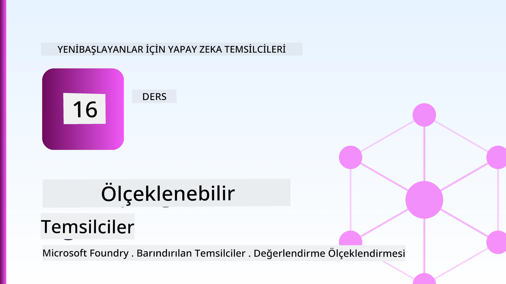
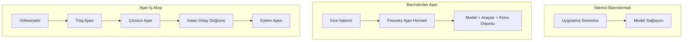
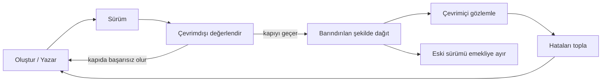
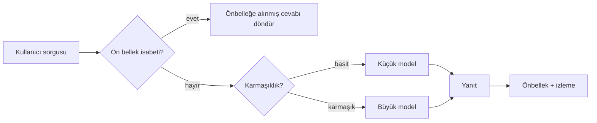

# Microsoft Foundry ile Ölçeklenebilir Ajanlar Dağıtma



Kursun bu noktasına kadar bir dizüstü bilgisayarda, `az login` ve birkaç ortam değişkeni tarafından yönlendirilen ajanlar oluşturdunuz. Bu öğrenmek için tam doğru yoldur. Ancak binlerce müşterinin sabaha karşı 3'te dayandığı bir ajanı çalıştırmak için doğru yol değildir.

Bu ders, "makinemde çalışıyor" ile "üretimde güvenilir ve uygun maliyetli çalışıyor" arasındaki fark hakkındadır. Bu farkı **Microsoft Foundry** ve **Microsoft Foundry Ajan Servisi** kullanarak kapatıyoruz ve bunu, araçları, veri getirme, bellek, değerlendirme ve izleme özelliklerine sahip gerçek bir müşteri destek ajanı oluşturarak yapıyoruz.

## Giriş

Bu ders aşağıdaki konuları kapsayacaktır:

- Bir **prototip ajan** ile **dağıtılmış ajan** arasındaki fark ve geçişin çoğunlukla modelin *etrafındaki* her şeyle ilgili olması.
- Ajanlar için **dağıtım desenleri**: istemci barındırmalı, servis barındırmalı (Barındırılan Ajanlar) ve iş akışı düzenlemeli.
- Microsoft Foundry üzerindeki **ajan yaşam döngüsü** — oluşturma, sürümleme, dağıtım, değerlendirme, gözlemleme, emekliye ayırma.
- **Ölçeklendirme stratejileri**: model yönlendirme, önbellekleme, eşzamanlılık ve durumsuz tasarım.
- OpenTelemetry ve Foundry izleme ile **gözlemlenebilirlik**.
- Model seçimi, yönlendirme ve değerlendirme kapılarıyla **maliyet optimizasyonu**.
- **Kurumsal değerlendirmeler**: yönetim, insan onayı ve üretimde MCP sunucularının güvenli çalıştırılması.

## Öğrenme Hedefleri

Bu dersi tamamladıktan sonra şunları bileceksiniz:

- Bir ajanın iş yükü için doğru dağıtım desenini seçmek.
- Bir ajanı Microsoft Foundry Ajan Servisine dağıtarak onun sürümlendiğinden, yönetildiğinden ve gözlemlendiğinden emin olmak.
- İzleme için bir ajanı donatmak ve her sürüm öncesi çalıştırılan bir değerlendirme hattı kurmak.
- Ölçeklenebilirlikte gecikme ve maliyeti kontrol altında tutmak için model yönlendirme ve önbellekleme uygulamak.
- Yüksek riskli işlemler için insan onay kapısı eklemek ve üretim güvenliği sağlamak için bir MCP sunucusunu entegre etmek.

## Ön Koşullar

Bu ders, önceki dersleri tamamlamış ve aşağıdaki konularda rahat olduğunuzu varsayar:

- [Microsoft Agent Framework](../14-microsoft-agent-framework/README.md) ile ajan oluşturma (Ders 14).
- [Araç Kullanımı](../04-tool-use/README.md) (Ders 4) ve [Agentic RAG](../05-agentic-rag/README.md) (Ders 5).
- [Ajan Belleği](../13-agent-memory/README.md) (Ders 13) ve [Agentic Protokoller / MCP](../11-agentic-protocols/README.md) (Ders 11).
- [Gözlemlenebilirlik ve Değerlendirme](../10-ai-agents-production/README.md) (Ders 10) — bu ders doğrudan buna dayanır.

Ayrıca şunlara ihtiyacınız olacak:

- En az bir dağıtılmış sohbet modeli içeren bir **Azure aboneliği** ve **Microsoft Foundry projesi**.
- Kimlik doğrulaması yapılmış **Azure CLI** (`az login`).
- Python 3.12+ ve depodaki [`requirements.txt`](../../../requirements.txt) dosyasında belirtilen paketler.

## Prototipten Üretime: Gerçekten Ne Değişiyor

Bir prototip ajan ile bir üretim ajanı aynı temel döngüyü paylaşır — mantık yürüt, araçları çağır, yanıtla. Değişen şey, o döngüyü çevreleyen her şeydir. Model üretim ajanının yaklaşık %20'si olabilir; diğer %80 operasyonel iskelettir.

| Endişe | Prototip | Üretim |
| --- | --- | --- |
| **Barındırma** | Dizüstünüzde çalışır | Barındırılan servis olarak çalışır, sürümlenir ve yayılır |
| **Kimlik** | Sizin `az login` jetonunuz | Kapsamlı RBAC ile yönetilen kimlik |
| **Durum** | Bellek içi, yeniden başlatmada kaybolur | Harici (thread deposu, bellek servisi) |
| **Hata** | İzlenecek geri izleme görürsünüz | Tekrar denemeler, yedek planlar, dead letter, uyarılar |
| **Maliyet** | "Birkaç sent" | İstek başına takip edilir, yönlendirilir, önbelleğe alınır, bütçelenir |
| **Kalite** | Çıktıya göz atarsınız | Her sürümden önce otomatik değerlendirilir |
| **Güven** | Her işlemi siz onaylarsınız | Riskli işlemler için politika + insan döngüsü |

Bu tabloyu aklınızda tutun. Aşağıdaki her bölüm bu satırlardan birine karşılık gelir.

## Ajan Dağıtım Desenleri

Sıklıkla kombinasyon halinde kullanılan üç desen vardır.

### 1. İstemci Barındırmalı Ajanlar

Ajan nesnesi *sizin* uygulama sürecinizin içinde yaşar. Kodunuz doğrudan model sağlayıcısını çağırır; mantık döngüsü serviste çalışır. Daha önceki derslerin hepsi bu şekildeydi.

- **Kullanımı:** döngü üzerinde tam kontrol, özel ara yazılım veya ajanı mevcut arka uca gömmek istediğinizde.
- **Dezavantaj:** ölçeklendirme, durum ve dayanıklılığı kendiniz yönetirsiniz.

### 2. Barındırılan Ajanlar (Foundry Ajan Servisi)

Ajan, Microsoft Foundry'de *bir kaynak olarak kaydedilir*. Foundry mantık döngüsünü barındırır, thread'leri depolar, içerik güvenliğini ve RBAC'yi uygular ve ajanı Foundry portalında görünür kılar. Uygulamanız, thread oluşturup yanıtları okuyan ince bir istemci haline gelir.

- **Kullanımı:** dayanıklılık, yerleşik gözlemlenebilirlik, yönetim ve daha az operasyonel yüzey alanı istediğinizde.
- **Dezavantaj:** yönetilen bir çalışma zamanı karşılığında daha az düşük seviyeli kontrol.

### 3. Ajan İş Akışları

Birden fazla ajan (ve araç) açık kontrol akışı ile bir grafik içinde birleştirilir — ardışık adımlar, dallanma, insan onay düğümleri ve duraklatıp devam ettirilebilen dayanıklı kontrol noktaları. Bu, Microsoft Agent Framework'ün dağıtım ölçeğine uygulanan **İş Akışları** özelliğidir.

- **Kullanımı:** tek bir görev birkaç özel ajanı kapsadığında veya ortada onay adımı gerektiğinde.
- **Dezavantaj:** daha fazla hareketli parça; düzenleme seviyesinde gözlemlenebilirlik gerekir.



## Microsoft Foundry'de Ajan Yaşam Döngüsü

Bir ajan dağıtmak tek seferlik bir `push` değildir. Bir döngüdür ve çok benzer şekilde bir yazılım sürüm döngüsüdür.



Ana fikir, [Ders 10](../10-ai-agents-production/README.md)'dan gelir: **çevrimdışı değerlendirme bir kapıdır, sonradan düşünülmez.** Yeni bir ajan sürümü değerlendirme eşiklerini geçmedikçe dağıtılmaz. Çevrimiçi gözlemlenebilirlik gerçek dünya hatalarını çevrimdışı test setinize geri besler. Bütün döngü budur.

## Ölçeklendirme Stratejileri

Bir ajanı ölçeklendirmek, durumsuz bir web API'sini ölçeklendirmekten farklıdır, çünkü her istek birden fazla pahalı model ve araç çağrısını tetikleyebilir. Dört teknik yükün çoğunu taşır.

**Durumsuz istek işleme.** Süreç belleğinizde kullanıcıya özel durum tutmayın. Konuşma thread'lerini Foundry thread deposunda veya bir bellek servisinde kalıcı hale getirin, böylece herhangi bir örnek herhangi bir isteği işleyebilir. Bu, yatay ölçeklendirmenizi sağlar — örnekler ekleyin, yapışkan oturum yok.

**Model yönlendirme.** Her istek en yetenekli (ve en pahalı) modelelmeniz gerekmez. Basit istekleri — amaç sınıflandırması, kısa gerçek cevaplar — küçük, hızlı bir modele yönlendirin ve büyük modeli gerçek mantık yürütme için ayırın. Foundry'nin **Model Yönlendiricisi** bunu sizin için yapabilir veya hafif bir sınıflandırıcı kendiniz yazabilirsiniz. Laboratuvarda DIY versiyonunu oluşturacaksınız.

**Yanıt önbellekleme.** Birçok destek sorgusu neredeyse kopya ("şifremi nasıl sıfırlarım?"). Yaygın sorulara verilen yanıtları önbelleğe alın ve hiç modele dokunmadan sunun. Orta seviyede bir önbellek başarı oranı bile maliyet ve gecikmeyi anlamlı şekilde düşürür.

**Eşzamanlılık ve geri basınç.** Model sağlayıcıların hız sınırları vardır. Eşzamanlılığınızı sınırlayın, üstel artışla yeniden deneme kullanın ve nazikçe başarısız olun (kuyruğa alınmış "üzerindeyiz" yanıtı 500 hatasından iyidir).



## Üretimde Gözlemlenebilirlik

Göremediğinizi işletemezsiniz. Ders 10'da ele alındığı gibi, Microsoft Agent Framework **OpenTelemetry** izlerini doğal olarak yayımlar — her model çağrısı, araç çağrısı ve düzenleme adımı bir span olur. Üretimde, bu spanları Microsoft Foundry'ye (veya herhangi bir OTel uyumlu arka uca) dışa aktarırsınız, böylece:

- Tek bir müşteri şikayetini her model ve araç çağrısı boyunca baştan sona izleyebilirsiniz.
- Zaman içinde p50/p95 gecikme ve maliyeti istek başına izleyebilirsiniz.
- Kullanıcılarınız (veya finans ekibiniz) fark etmeden önce hata oranı artışları ve maliyet anomalileri üzerine uyarılar alabilirsiniz.

```python
from agent_framework.observability import get_tracer

tracer = get_tracer()

with tracer.start_as_current_span("support_request") as span:
    span.set_attribute("customer.tier", "enterprise")
    span.set_attribute("routed.model", "gpt-5-nano")
    # ajan yürütmesi bu aralık içinde otomatik olarak izlenir
```

`customer.tier` ve `routed.model` gibi öznitelikler, bir iz duvarını yanıt verilebilir sorulara dönüştürür ("kurumsal müşteriler küçük modele çok sık mı yönlendiriliyor?").

## Maliyet Optimizasyonu

Üretim ajanlarında maliyet genellikle tokenlar tarafından domine edilir. Etkiye göre sıralanmış üç kolla:

1. **Modeli doğru boyuta getirin.** Değerlendirme kapınızı geçen küçük bir model, geçen büyük bir modelden neredeyse her zaman daha ucuzdur. Küçük modelin yeterince iyi olduğunu değerlendirme ile *kanıtlayın*; varsayılan olarak en büyük modeli kullanmayın.
2. **Karmaşıklığa göre yönlendirin.** Yukarıdaki gibi — sadece büyük model mantığı gereken istekler için büyük model maliyeti ödeyin.
3. **Agresifçe önbellekleme yapın.** En ucuz model çağrısı hiç yapmadığınızdır.

Değerlendirme kapıları ve maliyet kontrolü aynı disiplindir, iki açıdan görülür: değerlendirme *kalite tabanını* söyler, yönlendirme ve önbellekleme maliyeti mümkün olduğunca o tabanın *altında* tutar.

## Kurumsal Dağıtım Dikkatleri

**Yönetim.** Barındırılan Ajanlar Foundry'nin RBAC'sını, içerik güvenliğini ve denetim günlüklerini devralır. Her ajana ihtiyaç duyduğu en az ayrıcalıkla yönetilen bir kimlik verin — bilgi tabanına salt okunur erişim, biletleme API'sine kapsamlama erişimi, fazlası değil.

**İnsanın döngüde olması.** Bazı işlemler doğrudan otomatikleştirilemeyecek kadar kritik — iade gerçekleştirmek, bir hesabı silmek, hukuki ekibe yükseltmek. Microsoft Agent Framework **onay gerektiren** araçları destekler: ajan işlemi önerir, yürütme durur, insan onaylar veya reddeder ve iş akışı devam eder. Bunu [Ders 6](../06-building-trustworthy-agents/README.md)'de gördünüz; burada dağıtıyorsunuz.

**Üretimde MCP.** [MCP](../11-agentic-protocols/README.md) ajanınızın harici araçları standart bir arayüzle tüketmesini sağlar. Üretimde her MCP sunucusunu güvenilir olmayan sınır olarak kabul edin: sunucu sürümünü sabitleyin, kapsamalı kimlikle çalıştırın, çıktıları doğrulayın ve sırları asla ona açmayın. MCP sunucusu bir bağımlılıktır ve bağımlılıklar yamalanır, denetlenir ve hız sınırına tabi tutulur.


Bu üç diyagram — geliştirme, dağıtım, çalışma zamanı — aynı ajanın hayatının üç aşamasıdır. Takip eden laboratuvarda yapımını adım adım göstereceğiz.

## Uygulamalı Laboratuvar: Üretime Hazır Bir Müşteri Destek Ajanı

[`code_samples/16-python-agent-framework.ipynb`](./code_samples/16-python-agent-framework.ipynb) dosyasını açın ve baştan sona çalışın. Her üretim konusu entegre edilmiş bir **Contoso müşteri destek ajanı** oluşturacaksınız:

1. **Araç çağırma** — sipariş durumunu sorgula ve destek biletleri aç.
2. **RAG** — bir bilgi tabanından politika sorularını cevapla (Azure AI Search, ve arama kaynağı olmadan çalışan bellek içi yedeklemeyle).
3. **Bellek** — müşteri konuşma turlarında hatırlanır.
4. **Model yönlendirme** — bir karmaşıklık sınıflandırıcısı her isteği küçük veya büyük modele yönlendirir.
5. **Yanıt önbellekleme** — tekrarlanan sorular önbellekten sunulur.
6. **İnsan onayı** — belirli eşiğin üstündeki iadelerde insan onayına duraklar.
7. **Değerlendirme hattı** — küçük bir çevrimdışı test seti ajanı puanlar ve sürüm kapısı olarak işlev görür.
8. **Gözlemlenebilirlik** — her isteğin etrafında OpenTelemetry izleme.

### Adım Adım

Dizüstü kitabı, her üretim konusunun kendi başına çalışabilen ve bağımsız bölümler halinde düzenlenmiştir. Kalbi yönlendirme-artı-önbellek istek işleyicisidir:

```python
async def handle_support_request(query: str, customer_id: str) -> str:
    # 1. Mümkün olduğunda önbellekten sun.
    cached = response_cache.get(normalize(query))
    if cached:
        return cached

    # 2. Maliyeti kontrol etmek için karmaşıklığa göre yönlendir.
    model = "gpt-5-nano" if is_simple(query) else "gpt-5-mini"

    # 3. Gözlemlenebilirlik için ajanı bir izleme kapsamı içinde çalıştır.
    with tracer.start_as_current_span("support_request") as span:
        span.set_attribute("routed.model", model)
        span.set_attribute("customer.id", customer_id)
        response = await support_agent.run(query, model=model)

    # 4. Önbelleğe al ve döndür.
    response_cache.set(normalize(query), response.text)
    return response.text
```

Bir sürümü koruyan değerlendirme kapısı şöyle görünür:

```python
async def evaluation_gate(agent, test_cases, threshold: float = 0.8) -> bool:
    passed = 0
    for case in test_cases:
        result = await agent.run(case["input"])
        if score_response(result.text, case["expected"]) >= 0.8:
            passed += 1
    pass_rate = passed / len(test_cases)
    print(f"Evaluation pass rate: {pass_rate:.0%} (gate: {threshold:.0%})")
    return pass_rate >= threshold  # sadece kapı geçerse dağıtım yapınız
```

Her satırı okuyun — dizüstü kitabı temel öğeleri kasıtlı olarak küçük tutar, böylece hiçbir şey bir çatı çağrısının arkasına saklanmaz.

## Dağıtılmış Ajanı Duman Testleriyle Doğrulama

Yukarıdaki değerlendirme kapısı *çevrimdışı* olarak ajan nesnenize karşı çalışır. Ajan Bir Barındırılan Ajan olarak dağıtıldığında, sizden bir tane daha, daha ucuz bir kontrol gereklidir: **dağıtılan uç nokta gerçekten yanıt veriyor mu?**

"Başarılı" dağıtım, yalnızca kontrol düzleminin tanımı kabul ettiğini kanıtlar — ajanın yanıt verdiğini kanıtlamaz. Eksik bir bağımlılık, kötü model yönlendirme veya süresi dolmuş bir bağlantı, hiçbir şey döndürmeyen yeşil bir dağıtıma yol açabilir. **Duman testi** bunu saniyeler içinde, her dağıtımda, tam bir değerlendirmenin maliyeti olmadan yakalar.

Bu depo, [AI Smoke Test](https://github.com/marketplace/actions/ai-smoke-test) GitHub Action'a dayalı kullanıma hazır bir duman test hattı sunar:

- **Katalog** — [`tests/lesson-16-smoke-tests.json`](../../../tests/lesson-16-smoke-tests.json), Contoso destek ajanı için istemler ve doğrulamalar içerir (temellendirilmiş politika cevapları, sipariş sorgulama, konuda kalma ve çok turlu thread sürekliliği). Diğer ders ajanları için kataloglar onun yanında bulunur — bkz. [`tests/README.md`](../tests/README.md).
- **İş Akışı** — [`.github/workflows/smoke-test.yml`](../../../.github/workflows/smoke-test.yml), Azure OIDC ile giriş yapar ve her istemi ajanın Yanıtlar uç noktasına POST eder, herhangi bir doğrulama başarısızlığında işi başarısız sayar.

```yaml
- name: Smoke-test hosted agent
  uses: JFolberth/ai-smoketest@v1
  with:
    project_endpoint: ${{ inputs.project_endpoint }}
    agent_name: ContosoSupportAgent
    tests_file: tests/lesson-16-smoke-tests.json
```


Ajanınız dağıtıldıktan sonra, Foundry proje uç noktanızı ve ajan adınızı sağlayarak **Actions** sekmesinden çalıştırın. Federatif kimlik, Foundry proje kapsamı üzerinde **Azure AI User** rolüne sahip olmalıdır. Katmanları bir piramit olarak düşünün: duman testleri (erişilebilir ve yanıt veriyor mu?) her dağıtımda çalıştırılır, çevrimdışı değerlendirme (gönderilecek kadar iyi mi?) terfi öncesinde çalıştırılır ve çevrimiçi değerlendirme (gerçek koşullarda nasıl işliyor?) sürekli olarak çalıştırılır.

## Bilgi Kontrolü

Ödeve geçmeden önce anlayışınızı test edin.

**1. Üretim ajanının yaklaşık ne kadarı "model"dir ve geri kalanı nedir?**

<details>
<summary>Cevap</summary>

Model sistemin azınlığıdır — genellikle %20 civarında belirtilir. Geri kalanı operasyonel iskelettir: barındırma ve sürümleme, kimlik ve RBAC, dışa aktarılmış durum, hata yönetimi, maliyet takibi, değerlendirme ve insan müdahalesi kontrolü. Üretime geçmek çoğunlukla muhakeme döngüsünün *etrafında* her şeyi inşa etmekle ilgilidir.
</details>

**2. Bir Hosted Agent’ı ne zaman client-hosted ajan yerine seçersiniz?**

<details>
<summary>Cevap</summary>

Yönetilen bir çalışma zamanı istiyorsanız; yerleşik dayanıklılığa (devam eden ve yeniden başlayabilen iş parçacıkları), gözlemlenebilirliğe, içerik güvenliğine ve RBAC’a sahip ve muhakeme döngüsü üzerinde biraz daha az düşük seviyeli kontrol karşılığında daha az operasyonel yüzey alanı istiyorsanız Hosted Agent tercih edilir. Döngü üzerinde tam kontrol gerektiğinde veya ajan mevcut bir arka uç sistemine gömülecekse client-hosted tercih edilir.
</details>

**3. Ölçeklenebilir bir ajanın kendi işlem belleğinde durum tutmaması neden önemlidir?**

<details>
<summary>Cevap</summary>

Böylece herhangi bir örnek herhangi bir isteği işleyebilir; bu, yapışkan oturumlar olmadan yatay ölçekleme yapılmasını sağlar. Kullanıcı başına konuşma durumu bir iş parçacığı deposuna veya bellek servislerine dışa aktarılır. Durum işlem belleğinde tutulursa, yeniden başlatmada kaybolur ve yükü serbestçe dağıtamazsınız.
</details>

**4. Model yönlendirme hangi problemi çözer ve değerlendirme ile ilişkisi nedir?**

<details>
<summary>Cevap</summary>

Yönlendirme, basit istekleri küçük, ucuz, hızlı bir modele gönderir ve büyük modeli gerçek muhakeme için ayırır; böylece gecikme süresi ve maliyet kontrol edilir. Değerlendirme ile ilişkisi, küçük modelin belli bir istek sınıfı için yeterince iyi olduğunu *kanıtlayan* şeyin değerlendirme olmasıdır — değerlendirme olmadan yönlendirme tahmindir.
</details>

**5. "Değerlendirme kapısı" nedir ve yaşam döngüsünde nerededir?**

<details>
<summary>Cevap</summary>

Değerlendirme kapısı yeni bir ajan sürümüne karşı çevrimdışı bir test seti çalıştırır ve geçme oranı eşik seviyesini aşmadıkça dağıtımı engeller. Yaşam döngüsünde "sürüm" ile "dağıtım" arasında yer alır ve kaliteyi yayın için ön koşul haline getirir, gönderimi takip eden bir kontrol değil.
</details>

**6. MCP sunucusu neden üretimde güvensiz bir sınır olarak ele alınmalıdır?**

<details>
<summary>Cevap</summary>

Çünkü ajanınızın çağırdığı harici bir bağımlılıktır. Versiyonunu sabitlemeli, sınırlandırılmış kimlikle çalıştırmalı, çıktısını doğrulamalı, oran sınırı uygulamalı ve asla gizli bilgileri ona açmamalısınız — herhangi bir üçüncü taraf bağımlılığına uyguladığınız disiplin aynen geçerlidir. Çıktıları ajanın muhakemesine akar, doğrulanmamış güvenlik riski oluşturur.
</details>

**7. Genellikle üretim ajan maliyetini en çok etkileyen tek değişiklik nedir ve neden?**

<details>
<summary>Cevap</summary>

Modeli uygun boyuta getirmek — değerlendirme kapınızı geçebilen en küçük modeli kullanmak. Maliyet tokenlarla domine edilir ve kalite barını karşılayan daha küçük model hemen her zaman daha büyüğünden daha ucuzdur. Önbellekleme ve yönlendirme maliyeti daha da azaltır ama doğru temel modeli seçmek en büyük birinci dereceden etkendir.
</details>

**8. `customer.tier` ve `routed.model` gibi span nitelikleri gözlemlenebilirlikte ne işe yarar?**

<details>
<summary>Cevap</summary>

Ham izleri yanıtlanabilir iş sorularına dönüştürürler. Nitelikler olmadan bir span duvarınız vardır; niteliklerle "kurumsal müşteriler küçük modele çok sık mı yönlendiriliyor?" ya da "en yavaş isteklerimizi hangi model işliyor?" diye sorabilirsiniz. Nitelikler, telemetrinin operasyonunuz için önemli boyutlara göre dilimlenme yöntemidir.
</details>

## Ödev

Laboratuvardan alınan müşteri destek ajanını belirli bir senaryo için sertleştirin: **bir SaaS şirketi için abonelik faturalama destek ajanı.**

Gönderiminiz şunları içermelidir:

1. Faturalama ile ilgili araçları değiştirin: `get_subscription_status`, `get_invoice` ve `issue_credit` (50$ üzerindeki krediler insan onayı gerektirir).
2. Şirketin iade politikası, fatura döngüsü ve iptal politikasını kapsayan üç RAG dokümanı ekleyin.
3. Değerlendirme setini en az sekiz vakaya genişletin; en az iki vaka insan onayı yolunu *tetiklemeli*, ve değerlendirme kapınızın doğru geçip başarısız olduğunu doğrulayın.
4. Bir maliyet raporu ekleyin: ajan üzerinden on karışık sorgu çalıştırdıktan sonra kaçının küçük modele, kaçının büyük modele gittiğini ve kaçının önbellekten karşılandığını yazdırın.

Kısa bir paragraf (bir markdown hücresinde) hangi model-yönlendirme kuralını seçtiğinizi ve bunu gerçek trafikle nasıl doğrulayacağınızı açıklayın. Tek doğru cevap yoktur — değerlendirme üretim kaygılarının tutarlı şekilde bağlanması üzerinedir.

## Özet

Bu derste bir ajanı prototipten Microsoft Foundry ile üretime taşıdınız:

- Üretime geçiş çoğunlukla modelin *çevresindeki operasyonel iskeletle* ilgilidir — barındırma, kimlik, durum, hata yönetimi, maliyet, kalite ve güven.
- Üç **dağıtım deseni**ni öğrendiniz — client-hosted, Hosted Agents ve Agent Workflows — ve her birinin ne zaman uygun olduğunu.
- **Ajan yaşam döngüsünde** gezindiniz; çevrimdışı **değerlendirme yayın kapısı olarak iş görür** ve çevrimiçi gözlemlenebilirlik hataları test setine geri besler.
- **Ölçeklendirme stratejileri** uyguladınız — durumsuz tasarım, model yönlendirme, önbellekleme ve sınırlı eşzamanlılık — ve bunları **maliyet optimizasyonuna** bağladınız.
- **Kurumsal kontrolleri** entegre ettiniz: RBAC, insan müdahalesi onayı ve üretime uygun MCP entegrasyonu.
- Tüm bu kaygıları çalışan koda bağlayan **üretime hazır müşteri destek ajanı** oluşturdunuz.

Sonraki derste zıt yolculuk yapılacak: ajanları buluta ölçeklendirmek yerine, onları *aşağı* tek bir geliştirici makinesine getirip tamamen yerelde çalıştıracaksınız.

## Ek Kaynaklar

- <a href="https://learn.microsoft.com/azure/ai-foundry/what-is-azure-ai-foundry" target="_blank">Microsoft Foundry dokümantasyonu</a>
- <a href="https://learn.microsoft.com/azure/ai-foundry/agents/overview" target="_blank">Microsoft Foundry Ajan Servisi genel bakış</a>
- <a href="https://learn.microsoft.com/en-us/agent-framework/overview/?wt.mc_id=youtube_26688_organicsocial_reactor&pivots=programming-language-python" target="_blank">Microsoft Agent Framework</a>
- <a href="https://learn.microsoft.com/azure/ai-foundry/concepts/model-router" target="_blank">Microsoft Foundry’de Model Yönlendirici</a>
- <a href="https://learn.microsoft.com/azure/search/search-what-is-azure-search" target="_blank">Azure AI Search</a>
- <a href="https://opentelemetry.io/" target="_blank">OpenTelemetry</a>
- <a href="https://github.com/marketplace/actions/ai-smoke-test" target="_blank">AI Smoke Test GitHub Action</a>
- <a href="https://modelcontextprotocol.io/" target="_blank">Model Context Protocol (MCP)</a>

## Önceki Ders

[Bilgisayar Kullanım Ajanları Oluşturma (CUA)](../15-browser-use/README.md)

## Sonraki Ders

[Yerel AI Ajanları Oluşturma](../17-creating-local-ai-agents/README.md)

---

<!-- CO-OP TRANSLATOR DISCLAIMER START -->
**Feragatname**:
Bu belge, AI çeviri hizmeti [Co-op Translator](https://github.com/Azure/co-op-translator) kullanılarak çevrilmiştir. Doğruluk için çaba sarf etsek de, otomatik çevirilerin hata veya yanlışlık içerebileceğini lütfen unutmayınız. Orijinal belge, kendi dilinde yetkili kaynak olarak kabul edilmelidir. Kritik bilgiler için profesyonel insan çevirisi önerilir. Bu çevirinin kullanımı sonucu ortaya çıkabilecek yanlış anlamalardan veya yanlış yorumlamalardan sorumlu değiliz.
<!-- CO-OP TRANSLATOR DISCLAIMER END -->