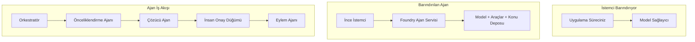
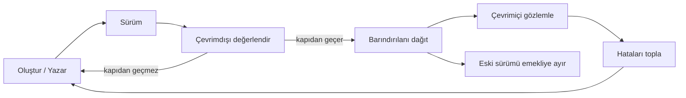
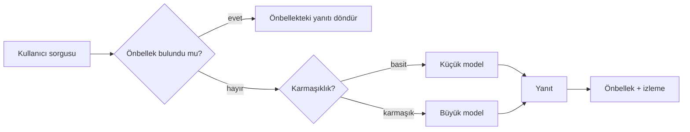
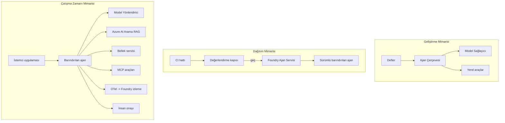

# Microsoft Foundry ile Ölçeklenebilir Ajanları Dağıtmak


Dersin bu noktasına kadar, bilgisayarınızda, bir not defterinin içinde çalışan, `az login` ve bir avuç ortam değişkeni ile sürülen ajanlar oluşturdunuz. Bu, öğrenmek için kesinlikle doğru yoldur. Ancak, binlerce müşterinin sabah 3'te güvendiği bir ajanın çalıştırılması için doğru yol değildir.

Bu ders, "makinemde çalışıyor" ile "üretimde güvenilir ve uygun maliyetle çalışıyor" arasındaki boşluğu konu alır. Bu boşluğu **Microsoft Foundry** ve **Microsoft Foundry Agent Service** kullanarak kapatıyoruz ve bunu, araçlara, geri getirmeye, hafızaya, değerlendirmeye ve izlemeye sahip gerçek bir müşteri destek ajanı inşa ederek yapıyoruz.

## Giriş

Bu ders aşağıdakileri kapsayacak:

- **Prototip ajan** ile **dağıtılmış ajan** arasındaki fark ve geçişin çoğunlukla modelin *çevresinde* olan her şeye dair olması.
- Ajanlar için **dağıtım desenleri**: istemci barındırmalı, servis barındırmalı (Hosted Agents) ve iş akışı düzenlemeli.
- Microsoft Foundry üzerindeki **ajan yaşam döngüsü** — oluşturma, sürümlendirme, dağıtım, değerlendirme, gözlemleme, emekliye ayırma.
- **Ölçeklendirme stratejileri**: model yönlendirme, önbellekleme, eşzamanlılık ve durumsuz tasarım.
- OpenTelemetry ve Foundry izlemeleri ile **görünürlük**.
- Model seçimi, yönlendirme ve değerlendirme kapıları yoluyla **maliyet optimizasyonu**.
- **Kurumsal hususlar**: yönetişim, insan onayı, ve MCP sunucularını üretimde güvenli çalıştırma.

## Öğrenme Hedefleri

Bu dersi tamamladıktan sonra şunları bileceksiniz:

- Belirli bir ajan iş yükü için doğru dağıtım desenini seçmek.
- Bir ajanı Microsoft Foundry Agent Service'e dağıtmak, böylece ajanın sürümlendiğini, yönetildiğini ve gözlemlenebildiğini sağlamak.
- Bir ajanı izleme için donatmak ve her sürümden önce çalışan bir değerlendirme hattını bağlamak.
- Ölçeklendirme sırasında gecikme ve maliyeti kontrol altında tutmak için model yönlendirmesi ve önbellekleme uygulamak.
- Yüksek riskli işlemler için insan onay kapısı eklemek ve bir MCP sunucusunu üretimde güvenli şekilde entegre etmek.

## Önkoşullar

Bu dersin, önceki dersleri tamamlamış olduğunuzu ve şu konularda rahat olduğunuzu varsayar:

- [Microsoft Agent Framework](../14-microsoft-agent-framework/README.md) (Ders 14) ile ajan oluşturma.
- [Araç Kullanımı](../04-tool-use/README.md) (Ders 4) ve [Agentic RAG](../05-agentic-rag/README.md) (Ders 5).
- [Ajan Hafızası](../13-agent-memory/README.md) (Ders 13) ve [Agentic Protokolleri / MCP](../11-agentic-protocols/README.md) (Ders 11).
- [Görünürlük ve Değerlendirme](../10-ai-agents-production/README.md) (Ders 10) — bu ders doğrudan onun üzerine inşa edilmiştir.

Ayrıca şunlara ihtiyacınız olacak:

- En az bir dağıtılmış sohbet modeline sahip bir **Azure aboneliği** ve **Microsoft Foundry projesi**.
- Yetkilendirilmiş **Azure CLI** (`az login`).
- Python 3.12+ ve depodaki [`requirements.txt`](../../../requirements.txt) paketleri.

## Prototipten Üretime: Aslında Neler Değişir

Bir prototip ajan ile üretim ajanı aynı temel döngüyü paylaşır — mantık yürütme, araçları çağırma, yanıt verme. Değişen, o döngünün çevresindeki her şeydir. Model, üretim ajanının yaklaşık %20'si olabilir; geri kalan %80 operasyonel iskelettir.

| Konu | Prototip | Üretim |
| --- | --- | --- |
| **Barındırma** | Not defterinizde çalışır | Barındırılan bir servis olarak çalışır, sürümlendirilir ve yaygınlaştırılır |
| **Kimlik** | `az login` jetonunuz | Kapsamlı RBAC ile yönetilen kimlik |
| **Durum** | Bellekte, yeniden başlatmada kaybolur | Dışsallaştırılmış (thread deposu, hafıza servisi) |
| **Hata Durumu** | İzleme bilgilerini görürsünüz | Yeniden denemeler, yedekleme, ölü mektup, uyarılar |
| **Maliyet** | "Birkaç kuruş" | İstek başına takip edilir, yönlendirilir, önbelleğe alınır, bütçelenir |
| **Kalite** | Çıktıyı gözle kontrol edersiniz | Her sürüm öncesi otomatik olarak değerlendirilir |
| **Güven** | Her işlemi onaylarsınız | Politika + riskli işlemler için insan-kontrolü (insan-girdili döngü) |

Bu tabloyu aklınızda tutun. Aşağıdaki her bölüm bu satırlardan birine karşılık gelir.

## Ajan Dağıtım Desenleri

Sıkça bir arada kullanılan üç desen vardır.

### 1. İstemci-Tarafından Barındırılan Ajanlar

Ajan nesnesi *kendi* uygulama sürecinizin içindedir. Kodunuz modeli doğrudan çağırır; mantık döngüsü servisinize gömülüdür. Bu, önceki her dersin yaptığı şeydir.

- **Ne zaman kullanılır**: Döngü üzerinde tam kontrol istediğinizde, özel ara yazılımlar kullanmak istediğinizde veya ajanı mevcut bir arka uç içine gömüyorsanız.
- **Takası**: Ölçeklendirme, durum ve dayanıklılığı kendiniz yönetirsiniz.

### 2. Barındırılan Ajanlar (Foundry Ajan Servisi)

Ajan, Microsoft Foundry'de *bir kaynak olarak* kaydedilir. Foundry mantık döngüsünü barındırır, threadleri depolar, içerik güvenliğini ve RBAC kurallarını uygular ve ajanı Foundry portalında görünür hale getirir. Uygulamanız, threadler oluşturan ve yanıtları okuyan ince bir istemci olur.

- **Ne zaman kullanılır**: Dayanıklılık, yerleşik görünürlük, yönetişim ve azalan operasyonel yüzey alanı istediğinizde.
- **Takası**: Yönetilen bir çalışma zamanı karşılığında daha az düşük seviye kontrol.

### 3. Ajan İş Akışları

Birden fazla ajan (ve araç) açık kontrol akışı içeren bir grafik olarak birleştirilir — sıralı adımlar, dallanma, insan onay düğümleri ve duraklatılıp devam edebilen dayanıklı kontrol noktaları. Bu, Microsoft Agent Framework **Workflows** özelliğinin dağıtım ölçeğinde uygulanmasıdır.

- **Ne zaman kullanılır**: Tek bir görev birkaç uzmanlaşmış ajanı kapsadığında veya ortasında onay adımı gerektiğinde.
- **Takası**: Daha fazla hareketli parça; orkestrasyon seviyesi görünürlüğü gerekir.



## Microsoft Foundry’de Ajan Yaşam Döngüsü

Bir ajanı dağıtmak tek seferlik bir `push` değildir. Bir döngüdür ve oldukça çok bir yazılım sürüm döngüsüne benzer çünkü gerçekten odur.



[Ders 10](../10-ai-agents-production/README.md)’dan karşıdan devralınan temel fikir: **çevrimdışı değerlendirme bir kapıdır, sonradan düşünülmüş değil.** Yeni bir ajan sürümü, değerlendirme eşiklerinizi aşmadıkça gönderilmez. Çevrimiçi görünürlük, gerçek dünya hatalarını çevrimdışı test setinize geri besler. İşte tüm döngü budur.

## Ölçeklendirme Stratejileri

Bir ajanı ölçeklendirmek, durumsuz bir web API'si ölçeklendirmekten farklıdır, çünkü her istek birden fazla pahalı model ve araç çağrısı tetikleyebilir. Dört teknik yükün çoğunu taşır.

**Durumsuz istek işleme.** Süreç belleğinizde kullanıcı başına durum tutmayın. Konuşma dizilerini Foundry thread deposunda veya bir hafıza servisinde kalıcı hale getirin ki herhangi bir örnek herhangi bir isteği işleyebilsin. Bu yatay ölçeklendirmeyi sağlar — örnekler ekleyin, yapışkan oturuma gerek yok.

**Model yönlendirme.** Her istek en yetenekli (ve en pahalı) modelinizi gerektirmez. Basit istekleri — niyet sınıflandırması, kısa gerçekçi cevaplar — küçük, hızlı bir modele yönlendirin ve gerçek mantık yürütme için büyük modeli ayırın. Foundry'nin **Model Router**’ı bunu sizin için yapabilir veya kendiniz hafif bir sınıflandırıcı uygulayabilirsiniz. Atölyede Kendi Kendine Yapım versiyonunu oluşturacaksınız.

**Yanıt önbellekleme.** Birçok destek sorgusu birbirine çok benzeyen sorulardır ("şifremi nasıl sıfırlarım?"). Yaygın sorulara cevapları önbelleğe alın ve yanıtları modele hiç dokunmadan sunun. Mütevazı bir önbellek başarı oranı bile maliyet ve gecikmeyi anlamlı şekilde azaltır.

**Eşzamanlılık ve geriye basınç.** Model sağlayıcılarının hız sınırları vardır. Eşzamanlılığı sınırlayın, üstel geri çekilme ile yeniden denemeleri kullanın ve zarif bir şekilde başarısız olun (kuyrukta "üzerindeyiz" yanıtı 500’den iyidir).



## Üretimde Görünürlük

Göremediğinizi işletemezsiniz. Ders 10’da ele alındığı gibi, Microsoft Agent Framework **OpenTelemetry** izlemelerini doğal olarak üretir — her model çağrısı, araç çağrısı ve orkestrasyon adımı bir izleme parçası olur. Üretimde bu parçaları Microsoft Foundry'e (veya herhangi bir OTel uyumlu altyapıya) dışa aktarırsınız, böylece:

- Tek bir müşteri şikayetini tüm model ve araç çağrıları boyunca baştan sona izleyebilirsiniz.
- Zamanla istek başına p50/p95 gecikme ve maliyeti izleyebilirsiniz.
- Hata oranı artışlarında ve maliyet anormalliklerinde kullanıcılarınız (veya finans ekibiniz) fark etmeden önce uyarı alabilirsiniz.

```python
from agent_framework.observability import get_tracer

tracer = get_tracer()

with tracer.start_as_current_span("support_request") as span:
    span.set_attribute("customer.tier", "enterprise")
    span.set_attribute("routed.model", "gpt-5-nano")
    # ajan yürütmesi bu alan içinde otomatik olarak izlenir
```

`customer.tier` ve `routed.model` gibi nitelikler, karmaşık izleme duvarını cevaplandırılabilir sorulara dönüştürür ("kurumsal müşteriler küçük modele çok sık mı yönlendiriliyor?").

## Maliyet Optimizasyonu

Üretim ajanlarında maliyeti tokenlar domine eder. Etkisine göre üç kaldıraç:

1. **Modeli doğru boyutta seçin.** Değerlendirme kapısından geçen küçük model neredeyse her zaman büyük modelden daha ucuzdur. Küçük modelin yeterince iyi olduğunu *kanıtlamak* için değerlendirmeyi kullanın, tedbiren en büyük modele yönelmek yerine.
2. **Karmaşıklığa göre yönlendirme.** Yukarıdaki gibi — büyük model fiyatını sadece büyük model mantığı gereken isteklere ödeyin.
3. **Agresif önbellekleme.** En ucuz model çağrısı hiç yapılmayan çağrıdır.

Değerlendirme kapıları ve maliyet kontrolü, iki açıdan aynı disiplindir: değerlendirme size *kalite tabanını* söyler, yönlendirme ve önbellekleme maliyeti mümkün olduğunca o tabanın *altında* tutar.

## Kurumsal Dağıtım Hususları

**Yönetişim.** Barındırılan Ajanlar Foundry'nin RBAC, içerik güvenliği ve denetim kayıtlarını devralır. Her ajana en az ayrıcalıkla yönelik yönetilen bir kimlik verin — bilgi tabanına salt okunur erişim, bilet API’si için kısıtlı erişim, fazlası olmasın.

**İnsan-kontrollü döngü.** Bazı işlemler otomatikleştirilemeyecek kadar önemlidir — geri ödeme yapma, hesap silme, hukuk ekibine yükseltme. Microsoft Agent Framework **onay-gerektiren** araçları destekler: ajan işlemi önerir, yürütme durur, insan onaylar veya reddeder, iş akışı devam eder. Bu ilkel [Ders 6](../06-building-trustworthy-agents/README.md)’da görüldü; burada bunu dağıtıyorsunuz.

**Üretimde MCP.** [MCP](../11-agentic-protocols/README.md) ajanın harici araçları standart arayüzle tüketmesini sağlar. Üretimde her MCP sunucusunu güvenilmeyen sınır olarak değerlendirin: sunucu sürümünü sabitleyin, kapsamlı kimlikle çalıştırın, çıktıları doğrulayın ve ona sırları asla açmayın. MCP sunucu bir bağımlılıktır; bağımlılıklar yamalanır, denetlenir ve oran sınırlandırılır.



Bu üç diyagram — geliştirme, dağıtım, çalışma zamanı — aynı ajanın hayatının üç aşamasıdır. Aşağıdaki atölye size onu oluşturmayı gösterecek.

## Pratik Atölye: Üretime Hazır Bir Müşteri Destek Ajanı

[`code_samples/16-python-agent-framework.ipynb`](./code_samples/16-python-agent-framework.ipynb) dosyasını açın ve baştan sona çalışın. Tüm üretim gereksinimleri entegre edilmiş **Contoso müşteri destek ajanı** oluşturacaksınız:

1. **Araç çağırma** — sipariş durumunu sorgulama ve destek biletleri açma.
2. **RAG** — bilgi tabanından politika sorularına cevap verme (Azure AI Search, not defteri Search kaynağı olmadan çalışması için bellek içi yedekle).
3. **Hafıza** — müşteriyi konuşma turları arasında hatırlama.
4. **Model yönlendirme** — karmaşıklık sınıflandırıcısı her isteği küçük veya büyük modele yönlendirir.
5. **Yanıt önbellekleme** — tekrar eden sorular önbellekten sunulur.
6. **İnsan onayı** — eşik üzeri iadeler insan onayı için duraklar.
7. **Değerlendirme hattı** — küçük bir çevrimdışı test seti ajanı puanlar ve çıkış kapısı olarak işler.
8. **Görünürlük** — her istek etrafında OpenTelemetry izleme.

### Yürütme

Not defteri her üretim kaygısını kendi içinde bağımsız, çalıştırılabilir bir bölüm olarak organize eder. Onun kalbi yönlendirme artı önbellekleme istek işleyicisidir:

```python
async def handle_support_request(query: str, customer_id: str) -> str:
    # 1. Mümkün olduğunda ön bellekten sun.
    cached = response_cache.get(normalize(query))
    if cached:
        return cached

    # 2. Maliyeti kontrol etmek için karmaşıklığa göre yönlendir.
    model = "gpt-5-nano" if is_simple(query) else "gpt-5-mini"

    # 3. Gözlemlenebilirlik için ajanı bir izleme aralığında çalıştır.
    with tracer.start_as_current_span("support_request") as span:
        span.set_attribute("routed.model", model)
        span.set_attribute("customer.id", customer_id)
        response = await support_agent.run(query, model=model)

    # 4. Önbelleğe al ve döndür.
    response_cache.set(normalize(query), response.text)
    return response.text
```

Bir sürümü koruyan değerlendirme kapısı şöyle görünür:

```python
async def evaluation_gate(agent, test_cases, threshold: float = 0.8) -> bool:
    passed = 0
    for case in test_cases:
        result = await agent.run(case["input"])
        if score_response(result.text, case["expected"]) >= 0.8:
            passed += 1
    pass_rate = passed / len(test_cases)
    print(f"Evaluation pass rate: {pass_rate:.0%} (gate: {threshold:.0%})")
    return pass_rate >= threshold  # kapı geçerse yalnızca dağıtım yap
```

Her satırı okuyun — not defteri ilkeleri kasıtlı olarak küçük tutar, böylece hiçbir şey framework çağrısının arkasına saklanmaz.

## Dağıtılmış Bir Ajanı Smoke Testleri ile Doğrulama

Yukarıdaki değerlendirme kapısı ajan nesnenize *çevrimdışı* uygulanır. Ajan Barındırılan Ajan olarak dağıtıldıktan sonra bir kontrol daha gerekir, çok daha ucuz bir kontrol: **dağıtılan uç nokta gerçekten yanıt veriyor mu?**

"Başarılı" dağıtım sadece kontrol düzleminin tanımı kabul ettiğini kanıtlar — ajan cevap verdiğini kanıtlamaz. Eksik bir bağımlılık, kötü model yönlendirmesi veya süresi dolmuş bağlantı, hiçbir şey döndürmeyen yeşil bir dağıtıma yol açabilir. Bir **smoke test**, saniyeler içinde, her dağıtımda, tam bir değerlendirmenin maliyetine katlanmadan bunu yakalar.

Bu depo, [AI Smoke Test](https://github.com/marketplace/actions/ai-smoke-test) GitHub Action üzerine inşa edilmiş kullanıma hazır smoke-test hattı sunar:

- **Katalog** — [`tests/lesson-16-smoke-tests.json`](../../../tests/lesson-16-smoke-tests.json) Contoso destek ajanı için istemler ve doğrulamalar içerir (temelli politika cevapları, sipariş sorgulama, konu dışına çıkmama ve çok turlu thread sürekliliği). Diğer ders ajanlarının katalogları onun yanında bulunur — bkz. [`tests/README.md`](../tests/README.md).
- **İş Akışı** — [`.github/workflows/smoke-test.yml`](../../../.github/workflows/smoke-test.yml) Azure OIDC ile giriş yapar ve her istemi ajanın Responses uç noktasına POST eder, herhangi bir doğrulama başarısızlığında işi başarısız sayar.

```yaml
- name: Smoke-test hosted agent
  uses: JFolberth/ai-smoketest@v1
  with:
    project_endpoint: ${{ inputs.project_endpoint }}
    agent_name: ContosoSupportAgent
    tests_file: tests/lesson-16-smoke-tests.json
```


Ajanınız dağıtıldıktan sonra Foundry proje uç noktanızı ve ajan adınızı sağlayarak **Actions** sekmesinden çalıştırın. Federasyon kimliği, Foundry proje kapsamı için **Azure AI User** rolüne sahip olmalıdır. Katmanları bir piramit olarak düşünün: dumansız testler (ulaşılabilir ve yanıt veriyor mu?) her dağıtımda çalışır, çevrimdışı değerlendirme (gönderilecek kadar iyi mi?) terfi öncesinde çalışır ve çevrimiçi değerlendirme (gerçek ortamda nasıl performans gösteriyor?) sürekli çalışır.

## Bilgi Kontrolü

Ödeve geçmeden önce anlayışınızı test edin.

**1. Üretim ajanının yaklaşık ne kadarı "model" ve geri kalanı nedir?**

<details>
<summary>Cevap</summary>

Model, sistemin azınlığıdır — genellikle yaklaşık %20 olarak belirtilir. Geri kalanı operasyonel iskelettir: barındırma ve sürüm yönetimi, kimlik ve RBAC, dışsal durum, hata yönetimi, maliyet izleme, değerlendirme ve insan-döngüsünde kontroller. Üretime geçiş çoğunlukla akıl yürütme döngüsünün *etrafında* her şeyi kurmakla ilgilidir.
</details>

**2. Ne zaman Hosted Agent yerine istemci barındırmalı ajanı tercih edersiniz?**

<details>
<summary>Cevap</summary>

Yerleşik dayanıklılık (devam eden ve devam edebilen iş parçacıkları), gözlemlenebilirlik, içerik güvenliği, ve RBAC ile yönetilen bir çalışma zamanı istediğinizde seçersiniz ve akıl yürütme döngüsünün düşük seviyeli kontrolünü biraz feda ederek daha az operasyonel yüzey alanına razısınız. İstemci barındırma, döngü üzerinde tam kontrol gerektiğinde veya ajan mevcut bir arka uca gömülüyorsa tercih edilir.
</details>

**3. Ölçeklenebilir bir ajanın kendi işlem belleğinde durumsuz olması neden gereklidir?**

<details>
<summary>Cevap</summary>

Böylece herhangi bir örnek herhangi bir isteği işleyebilir, bu da yatay ölçeklendirmeyi yapışkan oturum olmadan mümkün kılar. Kullanıcıya özel konuşma durumu iş parçacığı deposu veya bellek servisine dışsal hale getirilir. Durum işlem belleğinde olsaydı, yeniden başlatmada kaybedilir ve yükü serbestçe dağıtamazdınız.
</details>

**4. Model yönlendirme hangi sorunu çözer ve değerlendirmeyle nasıl ilişkilidir?**

<details>
<summary>Cevap</summary>

Yönlendirme, basit istekleri küçük, ucuz, hızlı bir modele gönderir ve büyük modeli gerçek akıl yürütme için ayırır, böylece gecikmeyi ve maliyeti kontrol eder. Değerlendirmeyle ilgisi, değerlendirmenin *kanıtlamasıdır* küçük modelin belli bir istek sınıfı için yeterince iyi olduğunun — değerlendirme olmadan yönlendirme tahmin etmektir.
</details>

**5. "Değerlendirme kapısı" nedir ve yaşam döngüsünde nerede yer alır?**

<details>
<summary>Cevap</summary>

Bir değerlendirme kapısı, yeni bir ajan sürümüne karşı çevrimdışı bir test seti çalıştırır ve geçme oranı bir eşik değeri aşmazsa dağıtımı engeller. Yaşam döngüsünde "sürüm" ile "dağıtım" arasında yer alır, böylece kaliteleri teslimattan önce bir ön koşul haline getirir.
</details>

**6. MCP sunucusu üretimde neden güvenilmeyen bir sınır olarak değerlendirilmelidir?**

<details>
<summary>Cevap</summary>

Çünkü ajanınızın çağrı yaptığı harici bir bağımlılıktır. Sürümünü sabitlemeli, kapsamlı bir kimlikle çalıştırmalı, çıktıları doğrulamalı, oran sınırlaması uygulamalı ve ona asla gizli bilgiler vermemelisiniz — bu, herhangi bir üçüncü taraf bağımlılığa uyguladığınız disiplindir. Çıktıları ajanınızın akıl yürütmesine akar, bu yüzden doğrulanmamış güvenlik riski oluşturur.
</details>

**7. Üretim ajanı maliyetinde genellikle en büyük etkiye sahip tek değişiklik nedir ve neden?**

<details>
<summary>Cevap</summary>

Modelin doğru büyüklüğe getirilmesi — değerlendirme kapınızı geçen en küçük modeli kullanmak. Maliyet, tokenlarla belirlenir ve kalite standartlarını karşılayan daha küçük model, neredeyse her zaman daha büyük modelden daha ucuzdur. Önbellekleme ve yönlendirme maliyeti daha da azaltır ancak doğru temel modeli seçmek en büyük birinci dereceden etkidir.
</details>

**8. `customer.tier` ve `routed.model` gibi alan özellikleri gözlemlenebilirlikte ne rol oynar?**

<details>
<summary>Cevap</summary>

Ham izleri cevaplanabilir iş sorularına dönüştürürler. Özellikler olmadan sadece bir alan duvarınız olur; özelliklerle "kurumsal müşteriler küçük modele çok sık mı yönlendiriliyor?" veya "en yavaş isteklerimizi hangi model karşılıyor?" diyebilirsiniz. Özellikler, telemetriyi operasyonunuz için önemli boyutlarla dilimlemenin yoludur.
</details>

## Ödev

Laboratuvardaki müşteri destek ajanını alıp belirli bir senaryo için sağlamlaştırın: **bir SaaS şirketi için abonelik faturalama destek ajanı.**

Gönderiminiz şunları içermelidir:

1. **Araçları** faturalama ile alakalı olanlarla değiştirin: `get_subscription_status`, `get_invoice`, ve `issue_credit` (50$ üzerindeki krediler insan onayı gerektirir).
2. Şirketin iade politikası, faturalama döngüsü ve iptal politikası ile ilgili **üç RAG belge** ekleyin.
3. **Değerlendirme setini** en az sekiz vaka olacak şekilde genişletin, bunlardan en az ikisi *insan onayı yolunu* tetiklemeli ve değerlendirme kapınızın doğru geçiş veya başarısızlık verdiğini doğrulayın.
4. **Bir maliyet raporu** ekleyin: ajana on karışık sorgu geçirdikten sonra kaçının küçük modele, kaçının büyük modele ve kaçının önbellekten hizmet edildiğini yazdırın.

Hangi model-yönlendirme kuralını seçtiğinizi ve gerçek trafikle nasıl doğrulayacağınızı açıklayan kısa bir paragraf (bir markdown hücresinde) yazın. Tek doğru cevap yoktur — üretim kaygılarının tutarlı bir şekilde bağlandığı değerlendirileceksiniz.

## Özet

Bu derste, bir ajanı Microsoft Foundry ile prototipten üretime taşıdınız:

- Üretime geçiş çoğunlukla modelin çevresindeki **operasyonel iskeletle** ilgilidir — barındırma, kimlik, durum, hata yönetimi, maliyet, kalite ve güven.
- Üç **dağıtım modelini** öğrendiniz — istemci barındırma, Hosted Agent’lar ve Ajan İş Akışları — ve her birinin ne zaman uygun olduğunu.
- **Ajan yaşam döngüsünü** yürüdünüz; çevrimdışı **değerlendirme salım kapısı olarak** işlev görür ve çevrimiçi gözlemlenebilirlik hataları test setine geri besler.
- **Ölçeklendirme stratejileri** uyguladınız — durumsuz tasarım, model yönlendirme, önbellekleme ve sınırlı eşzamanlılık — ve bunları **maliyet optimizasyonuyla** bağladınız.
- **Kurumsal kontrolleri** entegre ettiniz: RBAC, insan-döngüsünde onay ve üretim güvenli MCP entegrasyonu.
- Çalıştırılabilir kodda tüm bu kaygıları birbirine bağlayan **üretim hazır müşteri destek ajanı** yaptınız.

Bir sonraki ders zıt bir yolculuk yapacak: ajanları buluta ölçeklendirmek yerine onları *bir geliştirici makinesine indirip* tamamen yerel olarak çalıştıracaksınız.

## Ek Kaynaklar

- <a href="https://learn.microsoft.com/azure/ai-foundry/what-is-azure-ai-foundry" target="_blank">Microsoft Foundry belgelendirmesi</a>
- <a href="https://learn.microsoft.com/azure/ai-foundry/agents/overview" target="_blank">Microsoft Foundry Ajan Servisi genel bakış</a>
- <a href="https://learn.microsoft.com/en-us/agent-framework/overview/?wt.mc_id=youtube_26688_organicsocial_reactor&pivots=programming-language-python" target="_blank">Microsoft Agent Framework</a>
- <a href="https://learn.microsoft.com/azure/ai-foundry/concepts/model-router" target="_blank">Microsoft Foundry’de Model Yönlendirici</a>
- <a href="https://learn.microsoft.com/azure/search/search-what-is-azure-search" target="_blank">Azure AI Search</a>
- <a href="https://opentelemetry.io/" target="_blank">OpenTelemetry</a>
- <a href="https://github.com/marketplace/actions/ai-smoke-test" target="_blank">AI Smoke Test GitHub Action</a>
- <a href="https://modelcontextprotocol.io/" target="_blank">Model Context Protocol (MCP)</a>

## Önceki Ders

[Bilgisayar Kullanım Ajanları (CUA) Oluşturma](../15-browser-use/README.md)

## Sonraki Ders

[Yerel AI Ajanları Oluşturma](../17-creating-local-ai-agents/README.md)

---

<!-- CO-OP TRANSLATOR DISCLAIMER START -->
**Feragatname**:
Bu belge, AI çeviri hizmeti [Co-op Translator](https://github.com/Azure/co-op-translator) kullanılarak çevrilmiştir. Doğruluk için çaba sarf etsek de, otomatik çevirilerin hata veya yanlışlık içerebileceğini lütfen unutmayınız. Orijinal belge, kendi dilinde yetkili kaynak olarak kabul edilmelidir. Kritik bilgiler için profesyonel insan çevirisi önerilir. Bu çevirinin kullanımı sonucu ortaya çıkabilecek yanlış anlamalardan veya yanlış yorumlamalardan sorumlu değiliz.
<!-- CO-OP TRANSLATOR DISCLAIMER END -->