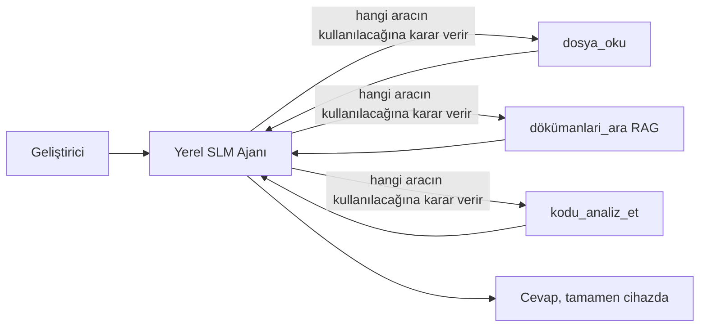
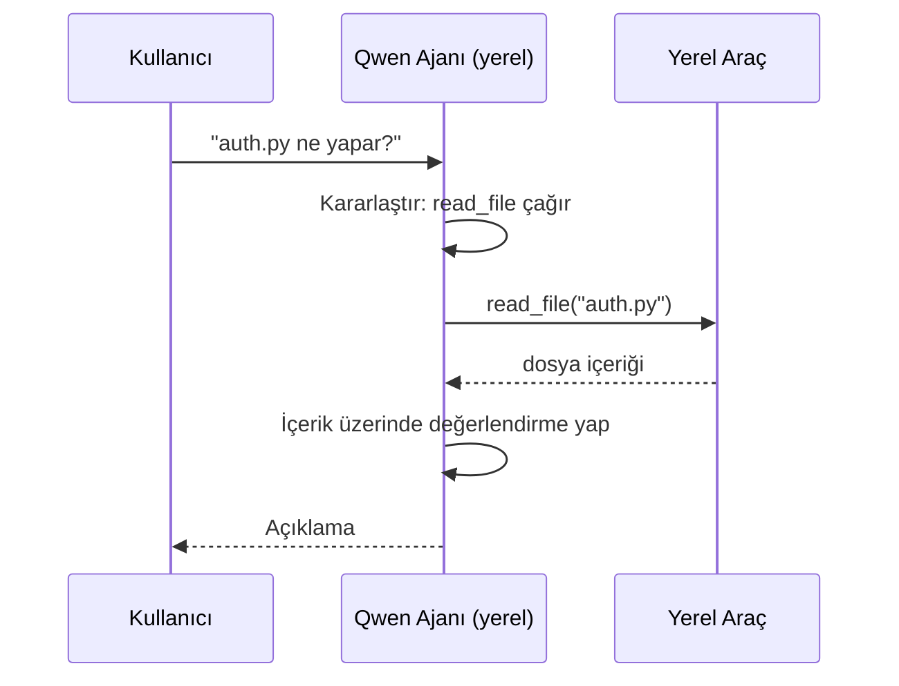
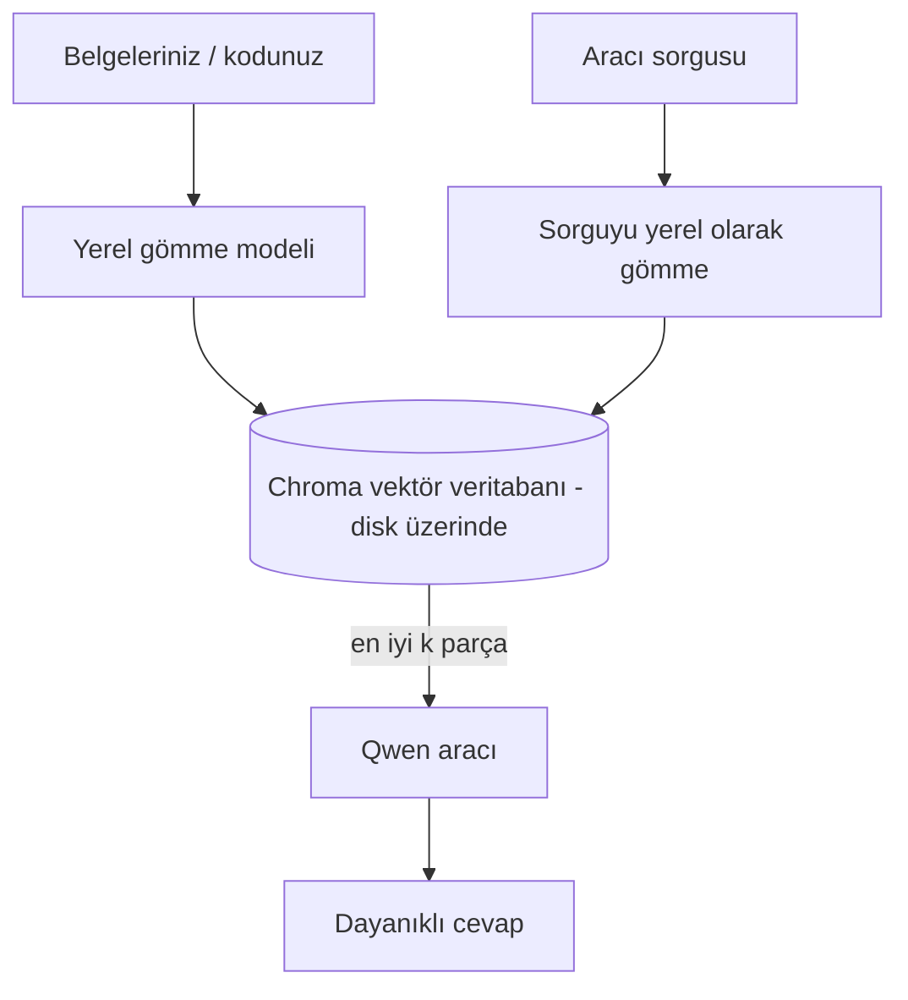
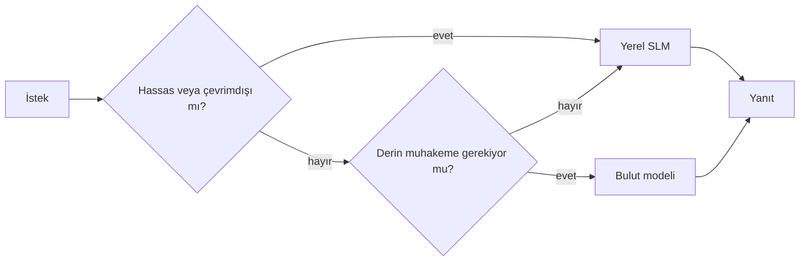

# Microsoft Foundry Local ve Qwen Kullanarak Yerel AI Ajanları Oluşturma


Önceki ders, ajanları buluta *yükseltmişti*. Bu ders, onları tek bir makineye *indiriyor*. Dersin sonunda, mantık yürüten, araç çağıran, dosyalarınızı okuyan ve belgelerinizi arayan çalışan bir mühendislik asistanınız olacak — **tek bir bulut çıkarımı çağrısı olmadan.**

Neden böyle bir şeye ihtiyacınız olsun? Mühendislik çalışmalarında sıkça karşılaşılan üç sebep:

- **Gizlilik.** Kod ve belgeler makineden hiç çıkmaz. Ağ sınırını geçen hiçbir istem, parça veya müşteri verisi yoktur.
- **Maliyet.** Yerel çıkarım için her token bazında faturalandırma yoktur. Elektrik fiyatına gün boyu yineleyebilirsiniz.
- **Çevrimdışı Çalışma.** Uçakta, güvenli bir tesiste veya kesinti sırasında ajan hala çalışır.

Fakat burada, sınırdaki bulut modelini CPU, GPU veya NPU üzerinde çalışan **Küçük Dil Modeli (SLM)** ile takas ediyorsunuz. Bu ders, bu kısıt içinde *iyi* olan ajanlar oluşturmakla ilgilidir, kısıt yokmuş gibi davranmakla değil.

## Giriş

Bu ders şunları kapsayacak:

- **Küçük Dil Modelleri (SLM'ler)** — ne oldukları, nerede iyi oldukları ve nerelerde olmadıkları.
- **Microsoft Foundry Local** — modelleri cihazda indirip sunan ve **OpenAI uyumlu bir API** üzerinden erişim sağlayan bir çalışma zamanı.
- **Qwen fonksiyon çağırma modelleri** — yerel *ajanları* (yalnızca yerel sohbet değil) mümkün kılan, güvenilir araç çağrıları üreten SLM'ler.
- **Yerel araçlar, yerel RAG ve yerel MCP** — ajanlara bulut olmadan yetenek kazandırma.
- **Hibrit desenler** — işleri ne zaman yerelde tutacağınız ve ne zaman buluta uzanacağınız.

## Öğrenim Hedefleri

Bu dersi tamamladıktan sonra şunları bileceksiniz:

- SLM'lerin takaslarını açıklamak ve uygun yerel ajan kullanımı senaryolarını seçmek.
- Foundry Local ile bir Qwen modelini yerelde çalıştırmak ve OpenAI uyumlu uç noktaya bağlanmak.
- Tümüyle çalışma istasyonunuzda çalışan bir araç çağıran ajan inşa etmek.
- Kendi belgeleriniz üzerinde yerel RAG eklemek için yerel vektör veritabanı (Chroma) kullanmak.
- Ajanı yerel bir MCP sunucusuna bağlamak ve hibrit yerel/bulut tasarımlarını değerlendirmek.

## Ön Koşullar

Bu ders, önceki dersleri tamamladığınızı ve şu konularda rahat olduğunuzu varsayar:

- [Araç Kullanımı](../04-tool-use/README.md) (Ders 4) ve [Agentic RAG](../05-agentic-rag/README.md) (Ders 5).
- [Agentic Protokoller / MCP](../11-agentic-protocols/README.md) (Ders 11).
- [Microsoft Agent Framework](../14-microsoft-agent-framework/README.md) (Ders 14).

Ayrıca ihtiyacınız olacak:

- Bir geliştirici çalışma istasyonu. **8 GB RAM gerçekçi bir minimumdur**; 16 GB+ rahat bir kullanım sağlar. Bir GPU veya NPU faydalı ancak zorunlu değildir.
- **Microsoft Foundry Local** kurulumu (kurulum bölümü aşağıda).
- Python 3.12+ ve depo içindeki paketler [`requirements.txt`](../../../requirements.txt), ayrıca bu ders için `foundry-local-sdk`, `openai` ve `chromadb`.

## Küçük Dil Modelleri: Yerel İşler İçin Doğru Araç

Bir sınır modeli yüzlerce milyar parametreye ve bir veri merkezine sahiptir. Bir SLM birkaç milyar parametreye sahiptir ve dizüstü bilgisayarınızın belleğine sığmalıdır. Bu fark beklentileri netleştirir.

**SLM'ler şunlarda iyidir:**

- Yapılandırılmış, sınırlı görevler — sınıflandırma, bilinen bir belgeden çıkarım, özetleme.
- **Araç çağırma** — hangi fonksiyonun hangi argümanlarla çağrılacağına karar verme.
- Kendi verinizde hızlı, ucuz ve özel yineleme yapma.

**SLM'ler şunlarda zayıftır:**

- Büyük bir bağlamda açık uçlu, çok adımlı çıkarım.
- Geniş dünya bilgisi (daha az görmüşler ve daha çok unuturlar).

Bu nedenle yerel ajanlar için kazanan strateji: **SLM orkestrasyon yapsın, ağır iş araçlara kalsın.** Model kod tabanınızı *bilmesine* gerek yok — `read_file` ve `search_docs` ne zaman çağrılacağını bilmesi yeterli. Bu doğrudan SLM'nin güçlü yanlarına oynar.



## Microsoft Foundry Local

**Microsoft Foundry Local**, modelleri tamamen makinenizde indirip yöneten ve sunan hafif bir çalışma zamanıdır. Bizim için en önemli özelliği, **OpenAI uyumlu bir HTTP uç noktası** sunmasıdır — bu, OpenAI SDK'nın ve Microsoft Agent Framework'ün OpenAI istemcisinin yalnızca `base_url` değişikliğine ihtiyaç duyarak buna bağlanabileceği anlamına gelir. Ajan oluşturmanın tüm bilgisi doğrudan aktarılır; sadece uç nokta buluttan `localhost`a taşınır.

Foundry Local ayrıca donanımınıza en uygun modeli otomatik seçer — CPU derlemesi, CUDA/GPU derlemesi veya NPU derlemesi — böylece makine başına elle optimizasyon yapmanıza gerek kalmaz.

### Kurulum

Foundry Local'u kurun (işletim sisteminiz için [belgelere](https://learn.microsoft.com/azure/ai-foundry/foundry-local/) bakın), sonra çalıştığını doğrulayın:

```bash
# Kurulum (örnek; platformunuz için belgeleri takip edin)
winget install Microsoft.FoundryLocal      # Windows
# brew install microsoft/foundrylocal/foundrylocal   # macOS

# Bir Qwen modeli indirip çalıştırın, sonra yerel servisi başlatın
foundry model run qwen2.5-7b-instruct
foundry service status
```

Hizmet çalışmaya başladıktan sonra yerel, OpenAI uyumlu bir uç noktanız olur (genellikle `http://localhost:PORT/v1`). Not defteri `foundry-local-sdk` kullanarak bu uç noktayı otomatik bulur, böylece portu sabit kodlamanız gerekmez.

## Qwen Fonksiyon Çağırma: Neden Önemli

Bir ajan ancak araç çağırabiliyorsa ajandır. Çoğu SLM sohbet eder ama güvenilmez, hatalı araç çağrıları üretir. **Qwen** modelleri fonksiyon çağırmak üzere eğitilmiştir ve tutarlı, düzgün araç çağrıları üretir — bu da yerel sohbet modelini yerel *ajan* haline getirir.

Akış, zaten bildiğiniz standart araç çağırma döngüsüdür, sadece cihazda çalışır:



## Yerel RAG

Dokümantasyon araması, yerel ajanların değerini gösterir. SLM'nin framework belgelerinizi ezberlediğini ummak yerine, bu belgeleri **yerel vektör veritabanına** gömersiniz ve ajanın ilgili parçaları ihtiyaç anında getirmesini sağlarsınız.

Yönetim gerektirmeyen, uygulama içi çalışan gömülü bir vektör mağazası olan **Chroma**'yı kullanıyoruz. İşlem tamamen yerel: yerel gömme modeli → yerel vektörler → yerel arama → yerel SLM.



Bu, Ders 5'ten aynı Agentic RAG deseni — tek fark, her bileşenin makinenizde çalışmasıdır.

## Yerel MCP Sunucuları

[MCP](../11-agentic-protocols/README.md) bir taşımacılık protokolüdür, bulut hizmeti değil. Bir MCP sunucusu `stdio` üzerinde yerel bir işlem olarak çalışabilir, ajanınıza standart protokol üzerinden araçlar sunar. Bu, dosya sistemi erişimi, git işlemleri, veritabanı sorguları gibi büyüyen MCP sunucu ekosistemini tamamen çevrimdışı kullanmanızı sağlar.

Güvenlik duruşu buluttan farklıdır ama yok değildir: yerel MCP sunucusu hala kullanıcı izinlerinizle çalışır, bu yüzden erişebileceği alanı (örneğin bir proje dizini, tüm ev klasörünüz değil) sınırlandırın ve çıktıları doğrulama için giriş olarak değerlendirin.

## Hibrit Bulut-ve-Yerel Desenler

Yerel öncelikli, sadece yerel demek değildir. Olgun sistemler hassasiyet ve zorluk bazında yönlendirme yapar:

| Durum | Nerede çalışır |
| --- | --- |
| Hassas kod/veri veya çevrimdışı | **Yerel SLM** |
| Basit, sınırlı görevler | **Yerel SLM** (ucuz, hızlı) |
| Zorlu çok adımlı çıkarım, hassas olmayan verilerde | **Bulut modeli** |
| Her durumda, kesinti sırasında | **Yerel SLM** (nazik degrade) |

Bu, Ders 16'daki **model yönlendirme** fikrine benzer — tek fark "modellerden" birinin artık kendi makineniz olması. Dayanıklı tasarım, bulut kullanılamayınca yerel modele düşer, böylece ajan kalitesini azaltır ama tamamen başarısız olmaz.



## Uygulamalı Laboratuvar: Yerel Bir Mühendislik Asistanı

[`code_samples/17-local-agent-foundry-local.ipynb`](./code_samples/17-local-agent-foundry-local.ipynb) dosyasını açın ve ilerleyin. Tümüyle çalışma istasyonunuzda çalışan bir **yerel mühendislik asistanı** oluşturacaksınız ve şunları yapabilecek:

1. **Araç çağırmak** — Foundry Local üzerinden Qwen fonksiyon çağrısıyla.
2. **Yerel dosya işlemleri yapmak** — bir proje dizinindeki dosyaları listelemek ve okumak.
3. **Kod analiz etmek** — bir kaynak dosyada temel metrikleri raporlamak.
4. **Dokümantasyon aramak** — Chroma ile bir dokümanlar klasöründe yerel RAG.
5. **MCP kullanmak** — yerel bir MCP sunucusuna bağlanmak (uygulamada yoksa nazikçe atlamak).

Herhangi bir noktada bulut çıkarımı kullanılmaz.

### Adım Adım İnceleme

Asistan, OpenAI uyumlu uç nokta aracılığıyla Foundry Local'a bağlanır, bu yüzden ajan kodu bulut derslerinkiyle neredeyse aynıdır — sadece istemci değişir:

```python
from foundry_local import FoundryLocalManager
from openai import OpenAI

# Foundry Local modeli keşfeder/indirir ve bize yerel bir uç nokta sağlar.
manager = FoundryLocalManager(\"qwen2.5-7b-instruct\")
client = OpenAI(base_url=manager.endpoint, api_key=manager.api_key)  # api_key yerel bir yer tutucudur
```

Araçlar, proje dizinine bağlı sıradan Python fonksiyonlarıdır:

```python
def read_file(path: str) -> str:
    \"\"\"Read a file, but only inside the sandboxed project directory.\"\"\"
    full = (PROJECT_ROOT / path).resolve()
    if PROJECT_ROOT not in full.parents and full != PROJECT_ROOT:
        return \"Access denied: path is outside the project directory.\"
    return full.read_text(encoding=\"utf-8\")
```

Sandbox kontrolüne dikkat edin — yerelde bile, rastgele yolları okuyan bir araç risklidir. Not defteri her aracı tek bir proje köküne sınırlar.

## Bilgi Kontrolü

Atamaya geçmeden önce bilginizi test edin.

**1. Bir ajanı neden bulutta değil de yerelde çalıştırmak için iki somut sebep verin.**

<details>
<summary>Cevap</summary>

Gizlilik (kod ve veri makineden hiç çıkmaz), maliyet (token başına çıkarım faturası yok), ve çevrimdışı yetenek (ağ yoksa uçakta, güvenli tesiste veya kesinti sırasında çalışır) arasından herhangi ikisi. Cihaz dışına veri gönderimini yasaklayan düzenleyici/uyum kısıtlamaları gizlilik sebebini sıkça tetikler.
</details>

**2. Yerel bir ajanda SLM ile araçları arasında önerilen iş bölümü nedir ve neden?**

<details>
<summary>Cevap</summary>

SLM **orkestrasyon yapsın** (hangi araç çağrılacak ve hangi argümanlarla karar verme) ve **araçlar ağır işi yapsın** (dosyaları okumak, belgeleri getirmek, sonuçları hesaplamak). SLM'ler araç seçimi gibi sınırlı kararlar konusunda güçlüdür ama geniş bilgi ve uzun çok adımlı çıkarımda zayıftır, araçlara dayanmak onların gücünü kullanmaktır.
</details>

**3. Foundry Local ile bulut ajan kodunu yeniden kullanmayı mümkün kılan nedir?**

<details>
<summary>Cevap</summary>

Foundry Local, **OpenAI uyumlu bir HTTP uç noktası** sunar. OpenAI SDK ve Agent Framework'ün OpenAI istemcisi, sadece `base_url` değiştirerek (yerel yer tutucu API anahtarı kullanarak) buna bağlanır. Ajan kodunun diğer tüm yönleri aynı kalır.
</details>

**4. Neden herhangi bir SLM yerine özellikle Qwen fonksiyon çağırma modelini kullanıyoruz?**

<details>
<summary>Cevap</summary>

Çünkü bir ajan güvenilir, düzgün biçimlendirilmiş **araç çağrıları** üretmek zorundadır. Birçok SLM sohbet edebilir ama hatalı ya da tutarsız araç çağrıları üretir. Qwen modelleri fonksiyon çağırma üzere eğitilmiş ve tutarlı araç çağrıları çıkarır, bu da yerel sohbet modelini çalışan bir yerel ajana dönüştürür.
</details>

**5. Yerel RAG işlem hattında hangi bileşenler makinede çalışır?**

<details>
<summary>Cevap</summary>

Hepsi: gömme modeli, vektör veritabanı (Chroma, disk üzerinde), getirme adımı ve SLM. Belgeler yerelde gömülür, yerelde saklanır, yerelde getirilir ve yerel model tarafından işlenir — hiçbiri bulutla temas etmez.
</details>

**6. Yerel bir MCP sunucusu makinenizde çalışıyor. Bu onu otomatik olarak güvenli yapar mı? Hangi önlemi almalısınız?**

<details>
<summary>Cevap</summary>

Hayır. Yerel MCP sunucusu kullanıcı izinlerinizle çalışır, yani sizin erişebileceğiniz her şeye erişebilir. İhtiyacı olanla sınırlandırın (örneğin tüm ev klasörünüz yerine tek bir proje dizini) ve çıktıları eyleme geçmeden önce doğrulamak için girdiler olarak değerlendirin.
</details>

**7. Yerel modeli içeren mantıklı bir hibrit yönlendirme kuralını tanımlayın.**

<details>
<summary>Cevap</summary>

Hassas veya çevrimdışı istekleri yerel SLM'ye yönlendir; basit, sınırlı görevleri hız ve maliyet için yerel SLM'ye yönlendir; hassas olmayan verilerde zorlu çok adımlı çıkarımı bulut modeline yönlendir; bulut yoksa yerel SLM'ye düş ve ajanın düzgün bir şekilde kalitesini düşürmesini sağla. Bu Ders 16'daki model yönlendirmedir ama modellerden biri yerel makinedir.
</details>

**8. Bu derste yerel ajanı çalıştırmak için gerçekçi minimum RAM miktarı nedir ve daha fazla RAM size ne kazandırır?**

<details>
<summary>Cevap</summary>

Yaklaşık **8 GB**, gerçekçi minimumdur; 16 GB+ rahat bir kullanımdır. Daha fazla RAM daha büyük, yetenekli modelleri çalıştırmanızı ve daha fazla bağlamı bellekte tutmanızı sağlar. Bir GPU veya NPU çıkarımı hızlandırır ama zorunlu değildir — Foundry Local hızlandırıcı yoksa CPU derlemesini seçer.
</details>

## Ödev

Yerel mühendislik asistanını, kendi seçtiğiniz küçük bir proje için **yerel dokümantasyon inceleyicisi** haline getirin (İsterseniz bu depodaki ders klasörlerinden birini kullanabilirsiniz).

Teslimatınız şunları içermelidir:

1. Gerçek bir doküman/kod klasörünü Chroma'ya dizinleyin (en az beş dosya).
2. Projede `TODO`/`FIXME` yorumlarını tarayan ve dosya ile satır numarasıyla birlikte döndüren bir `find_todos` aracı ekleyin — `read_file` ile aynı sandbox kontrolünü koruyarak.

3. **Ajanı, araçları birleştirmesini gerektiren üç soru ile sorgulayın**: biri saf bir RAG sorusu, biri belirli bir dosyayı okumasını gerektiren ve biri TODO bulmasını gerektiren soru.
4. **Ölçün**: üç cevabın her birinin süresini ölçün ve bir markdown hücresinde not alın. Gecikmenin hedeflediğiniz iş akışı için kabul edilebilir olup olmadığı hakkında yorum yapın.

Sonra, **bu değerlendirme için neleri buluta taşıyacağınız ve neleri yerelde tutacağınız** hakkında kısa bir paragraf yazın ve nedenlerini açıklayın. Yerel bileşenlerin doğru şekilde birbirine bağlanıp bağlanmadığı ve karma hibrit akıl yürütmenizin sağlamlığı değerlendirilir — model kalitesi değil.

## Özet

Bu derste tamamen kendi makinenizde çalışan bir ajan oluşturdunuz:

- **SLM'ler** kapsamı gizlilik, maliyet ve çevrimdışı çalışma için feda eder — ve tüm bilgiyi taşımak yerine **araçları orkestrasyonunda** parıldarlar.
- **Foundry Local**, modelleri cihaz üzerinde **OpenAI uyumlu bir uç noktada** sunar, böylece bulut ajanın kodu satırlık bir değişiklikle aktarılır.
- **Qwen fonksiyon çağırma modelleri**, güvenilir yerel araç çağrısı — dolayısıyla yerel *ajanlar* — yapılmasını mümkün kılar.
- **Yerel RAG** (Chroma) ve **yerel MCP**, ajanı makineyi terk etmeden yeteneklendirir.
- **Hibrit desenler**, duyarlılık ve zorluk bazında yönlendirme yapmanızı sağlar, yerel ise zarif bir devreye alma noktası olarak kullanılır.

Bu, dağıtım döngüsünü tamamlar: Ders 16 ajanları Microsoft Foundry'e ölçeklendirdi, bu ders onları tek bir iş istasyonuna küçülttü. Sonraki ders, dağıtılmış ajanların güvenliğinin korunmasına odaklanıyor.

## Ek Kaynaklar

- <a href="https://learn.microsoft.com/azure/ai-foundry/foundry-local/" target="_blank">Microsoft Foundry Local belgeleri</a>
- <a href="https://learn.microsoft.com/azure/ai-foundry/what-is-azure-ai-foundry" target="_blank">Microsoft Foundry belgeleri</a>
- <a href="https://learn.microsoft.com/en-us/agent-framework/overview/?wt.mc_id=youtube_26688_organicsocial_reactor&pivots=programming-language-python" target="_blank">Microsoft Agent Framework</a>
- <a href="https://qwen.readthedocs.io/en/latest/framework/function_call.html" target="_blank">Qwen fonksiyon çağırma belgeleri</a>
- <a href="https://modelcontextprotocol.io/" target="_blank">Model Context Protocol (MCP)</a>
- <a href="https://docs.trychroma.com/" target="_blank">Chroma vektör veritabanı</a>

## Önceki Ders

[Ölçeklenebilir Ajanları Dağıtmak](../16-deploying-scalable-agents/README.md)

## Sonraki Ders

[AI Ajanlarını Güvence Altına Almak](../18-securing-ai-agents/README.md)

---

<!-- CO-OP TRANSLATOR DISCLAIMER START -->
**Feragatname**:
Bu belge, AI çeviri hizmeti [Co-op Translator](https://github.com/Azure/co-op-translator) kullanılarak çevrilmiştir. Doğruluk için çaba sarf etsek de, otomatik çevirilerin hata veya yanlışlık içerebileceğini lütfen unutmayınız. Orijinal belge, kendi dilinde yetkili kaynak olarak kabul edilmelidir. Kritik bilgiler için profesyonel insan çevirisi önerilir. Bu çevirinin kullanımı sonucu ortaya çıkabilecek yanlış anlamalardan veya yanlış yorumlamalardan sorumlu değiliz.
<!-- CO-OP TRANSLATOR DISCLAIMER END -->